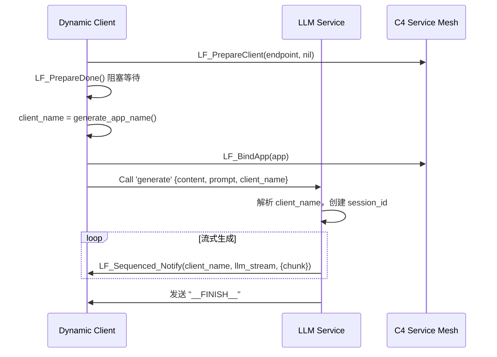

# 总体大工作总结报告

**报告日期**：2026年9月6日  
**项目范围**：LingoFuse 分布式 RPC 框架及 Z‑framework Pascal 工具链  
**涵盖周期**：2026年8月31日 – 2026年9月6日  
**报告人**：AI 系统  

---

## 一、工作概述

本次综合工作围绕两大主线展开：

1. **LingoFuse 框架的深度改造与质量提升**  
   - 将 LLM 服务从单会话固定模式升级为多会话动态路由架构，支持多客户端并发流式生成。  
   - 完成 Python 绑定的迁移与迭代（v2.0 → v2.1），重点优化 HTTP 桥接器（`bridge.py`）为纯二进制转发，修复跨语言字符串处理（`\0`）问题。  
   - 对 Pascal 核心库、Python 绑定及全部示例程序进行系统性代码审查，修正资源生命周期管理歧义、注释不一致、日志可观测性等缺陷。

2. **Pascal 工具链的全面重构与修复**  
   - 重构底层解析器 `Z.Pascal_Func_Tool.pas`，消除 JSON 输出冗余并修复内存泄漏。  
   - 修复中间模型 `pascal_func_model.pas` 的 JSON 加载浅拷贝问题，使参数信息完整恢复。  
   - 模块化重构代码生成器 `pas_mcp_generator_tool.pas`，增加跳过报告机制，扩展类型支持。

所有工作均通过单元测试或实际运行验证，交付物包括更新的源代码、修正后的示例、新增文档及测试用例。

---

## 二、LingoFuse 框架改造（宏观架构与微观实现）

### 2.1 LLM 服务多会话动态路由重构（`llm_service.py` + `llm_test.py` + `llm_client.pas`）

#### 背景
原有 LLM 服务采用单客户端固定监听模式（硬编码目标 App 名），无法支持多个客户端同时调用，且日志输出冗余，缺乏运行时控制。

#### 核心改造

| 改造项 | 原实现 | 新实现 |
|--------|--------|--------|
| **通知目标** | 硬编码 `LLM_Client` | 从请求 JSON 的 `client_name` 字段动态提取 |
| **会话管理** | 无（单会话） | 支持多会话，每个会话独立线程 + `session_id` |
| **日志控制** | 始终打印每 chunk JSON | 增加 `--quiet`、`--debug`、`--log-level` 参数，运行时可控 |
| **启动反馈** | 无加载进度 | 显示 `Loading model... (this may take a few seconds)` |
| **客户端 App 名称** | 固定写死 | 连接成功后调用 `generate_app_name()` 动态生成唯一名称（含 IPC 地址、PID、时间戳） |
| **客户端连接顺序** | 先生成名称再连接 | 先 `PrepareClient(nil)` → `PrepareDone` 阻塞 → 生成名称 → `BindApp` |
| **客户端选项** | 未显式设置 | 设置 `Wait_Connection_ReadyOk = True`，确保就绪 |
| **Pascal 客户端错误处理** | 使用 `raise Exception` | 改为静默处理，函数返回 `(Result, ErrorMsg)`，完整解析服务端错误 JSON `{code, error}` |
| **请求参数** | 仅 `content` + `prompt` | 增加 `client_name` 字段 |

#### 关键问题与解决方案

| 问题 | 原因 | 解决方案 |
|------|------|----------|
| 服务端报 `Missing client_name` | 客户端请求未携带该字段 | 在请求 JSON 中添加 `client_name` |
| `generate_app_name()` 生成的名称缺少隧道信息 | 在 C4 隧道建立前调用 | 移至 `PrepareDone` 成功后调用 |
| `check_app` 误报客户端不可达 | `check_app` 是缓存查询，滞后于实际注册 | 增加 `--quiet` 选项，生产环境关闭该警告日志 |
| 服务端 chunk 日志过载 | 每 chunk 打印一行 JSON | 增加 `--quiet` / `--log-level` 控制 |
| Pascal 客户端无法获取错误原因 | 未解析服务端错误 JSON | 增加 `code` 字段检查，通过 `out ErrorMsg` 返回具体错误 |

#### 架构演进序列图（简化）


#### 验证结果
- ✅ 客户端生成名称格式正确（含 IPC、PID、时间戳）
- ✅ 服务端正确创建独立会话
- ✅ 多会话并发互不干扰（日志显示独立 `session_id`）
- ✅ 日志静默模式生效

---

### 2.2 Python 绑定迁移记录（v2.0 → v2.1）

#### 版本概览
- **v2.0**（2026-08-31）：完成从旧版 `zAPI` 到 LingoFuse 的全面迁移，提供 `DataHandle`, `App`, `Server`, `C4` 及 HTTP 网关（支持 `json`/`path` 双模式）。
- **v2.1**（2026-08-31）：纯二进制转发、容错读取、统一 `\0` 处理、文档大更新。

#### v2.1 新增特性

- **HTTP 网关改为纯二进制转发模式**  
  不再解析请求体 JSON，只从 URL 路径提取 `app` 和 `api`（格式 `/<app>/<api>` 或 `/<api>` 使用默认应用）。请求体原样转发给后端 LingoFuse 服务，响应原样返回，极大提升通用性和性能。

- **新增 `check_api` 预检机制**  
  在转发前调用 `LF_CheckApi` 验证 API 是否存在，若不可用则提前返回错误码 `-3`，避免无效网络调用。增强：增加最多 3 次重试，间隔 200ms，消除缓存延迟误判。

- **容错字符串读取**  
  `DataHandle.read_string_null_terminated()` 现支持无 `\0` 结尾的数据：若扫描到缓冲区末尾仍未见 `\0`，则返回整个剩余内容并移动指针到末尾，保证对纯 JSON 的兼容。

- **统一写入规范**  
  所有 `write_string_null_terminated()` 调用均保证末尾追加 `\0`，确保与 Pascal 端 `LF_ReadString` 约定一致。HTTP 响应前自动剥离尾部 `\0`，避免客户端解析 JSON 出错。

- **日志系统升级**  
  `bridge.py` 统一使用 `logging` 模块，支持 `--debug` 和 `--log-file`；`client.py` 和 `server.py` 增加 `debug` 参数和 `_log` 方法。

#### 缺陷修复（v2.1）

- 修复响应数据读取错误（原用 `LF_GetBuffer` 指针切片因 `ctypes.c_void_p` 不支持而报错，改用 `LF_ReadBuffer` + 数组）。
- 修复 Pascal 服务端收到空请求体（未追加 `\0` 导致 `LF_ReadString` 返回空）。
- 修复浏览器 JSON 解析失败（多余 `\0`），现自动去除。
- 修复 `cross_bridge.py` 返回格式不统一（`add` 返回纯数字，`inv_seri` 返回字符串），现统一返回 `{"code":0, "result": ...}` 或 `{"code":-1, "error": "..."}`。
- 修复多语言客户端路径错误，改用完整路径 `/cross_bridge/add` 等，并发送纯参数体。

#### 文档更新
- 新增 `Bridge_User_Guide.md`（英文）
- 更新 `Cross_Demo_Guide_zh.md`，移除废弃参数
- 修改 `Pascal_Service_Guide_for_bridge.md`
- 在 `lingofuse_import.pas` 头部添加 “JSON 交换常见陷阱” 章节

#### 已知问题（v2.1）
无。

---

### 2.3 Pascal 核心库与 Python 绑定代码审查与修正

#### 审查范围
- Pascal 核心导出单元 `Z.LingoFuse_Export.pas` 及 `Z.LingoFuse_Core.pas`
- Python 绑定全部文件（`core.py`, `client.py`, `server.py`, `__init__.py`, `_lf_native.py`, `bridge.py`）
- 全部 16 个 Pascal 示例程序（`.lpr`）
- 单元测试 `test_lingofuse.py`

#### 关键修正

| 文件 | 修正内容 |
|------|----------|
| `Z.LingoFuse_Export.pas` | 重写 `LF_FreeApp` 和 `LF_Shutdown` 英文注释，明确生命周期语义（`LF_FreeApp` 仅分离应用，不立即销毁；`LF_Shutdown` 统一清理全局池） |
| `LingoFuseBenchServer.lpr` | 调整资源释放顺序（先 `App.Free`，后 `LF_Shutdown`），避免非法访问 |
| `core.py` | 显式初始化 `_deserializer`；更新 `App.free` 注释，添加 `{!!!!! APP LIFETIME !!!!!}` 醒目提示 |
| `client.py` | 新增 `full_cleanup()` 和 `is_initialized()`；增强异常处理（`LF_PrepareDone` 主线程活跃时仅警告而非硬错误）；添加调试日志 |
| `server.py` | `stop()` 增加 `full_cleanup` 参数；新增 `full_cleanup()`；方法增加 `_app` 有效性检查 |
| `bridge.py` | 统一日志；新增 `--log-file`、`--no-precheck`；修正 `no_precheck` 变量作用域（更名为 `no_precheck_param`）；`check_api` 增加重试 |
| `__init__.py` | 添加应用生命周期模块文档 |
| `test_lingofuse.py` | 新增 `test_overlap_connection` 和 `test_free_app_lifetime`；修复 `NameError`（缺少 `LingoFuseError` 导入）；放宽 `test_generate_unique_app_name` 断言 |
| `lingofuse_import.pas` | 确认导入声明与导出一致（未改动） |

#### 待办项（已记录但未修正）
- `bridge.py` 中二进制数据的 `\0` 处理可能损坏数据（建议增加 `--binary-mode`）
- `DataHandle.write_string()` 文档未强调仅用于文本（建议提供 `write_bytes`）
- `llm_service.py` 的 `cleanup` 未调用 `LF_Shutdown`（应改为 `self.server.stop(full_cleanup=True)`）
- 部分示例代码使用 `print` 而非统一日志（可保持现状或添加 `--debug` 控制）

---

## 三、Pascal 工具链重构与修复

工具链涉及三个核心单元：底层解析器 `Z.Pascal_Func_Tool.pas`、中间模型 `pascal_func_model.pas` 和代码生成器 `pas_mcp_generator_tool.pas`。

### 3.1 解析器 `Z.Pascal_Func_Tool.pas` 重构

#### 问题概述
- `FuncList` 包含了所有 token（包括 `'unit'`、`'interface'`、`';'`、注释等），导致 JSON 输出臃肿（104 个条目，实际仅 51 个函数声明）。
- `decl_to_pascal` 函数带有两个开关参数，且参数列表使用 `ParamDecl` 原始字符串，输出杂乱。
- `ProcessProcDeclaration` 解析失败时内存泄漏。

#### 解决方案

| 修复项 | 修复前 | 修复后 |
|--------|--------|--------|
| `FuncList` 内容 | 104 个条目（含结构标记） | 51 个条目（仅 `IsProc=True` 的声明） |
| 结构指针 | 指向 `FuncList` 中的结构标记 | 全部置为 `nil` |
| `ParseSuccess` 判定 | 基于结构指针存在 | 基于 `FoundInterface`、`FoundImplementation`、`FoundEnd` 三个标志 |
| `UsesList` 提取 | 正确但不完整 | 提取 7 个单元名（正确） |
| `decl_to_pascal` | 2 个可选参数，输出含原始格式 | 无参数，固定行为，参数列表从 `param_arry` 重建 |
| 默认值输出 | 已实现但未启用 | 暂时注释，可按需启用 |
| 内存泄漏 | `ProcessProcDeclaration` 失败时泄漏 | 添加 `DeclItem^.Free; Dispose(DeclItem)` |

#### 验证结果
- `FuncList` 仅包含函数/过程（51 个）。
- JSON 输出从约 2000+ 行缩减至约 1000+ 行。
- 注释绑定、调用约定、外部声明、泛型、函数指针等均正确保留。
- `SaveToJson` / `LoadFromJson` 完整保留 `FuncList`，结构指针索引均为 -1。

---

### 3.2 中间模型与代码生成器重构

#### `pascal_func_model.pas` – JSON 读写 BUG 修复

**问题**：`LoadFromJson` 加载后所有有参函数的参数信息丢失（`Name` 和 `PascalType` 为空）。日志显示 `LoadFromJson` 成功读取了参数，但存储后立即丢失。

**根因**：
- `f: TFunctionStructure` 声明在循环外部。
- 每次迭代调用 `f.Clear` 释放了 `f.Params` 动态数组。
- `FFuncs.Add(f)` 执行的是**浅拷贝**，列表中的副本与 `f` 共享同一动态数组。
- 下一次循环的 `f.Clear` 释放了该数组，导致已存储数据被清空。

**解决方案**：
1. 将 `f` 声明移到循环外部（因编译器兼容性问题，不能内联 `var`）。
2. 实现 `TFunctionStructure.Clone` 进行深拷贝。
3. 将 `FFuncs.Add(f)` 改为 `FFuncs.Add(f.Clone)`。

**修复后**：所有参数完整保留，生成的代码行数从 603 行增加到 1742 行，支持的函数从 5 个增加到 17 个。

#### `NormalizeType` 类型归一化修复

**问题**：日志显示 `string` 类型被报告为“不支持”，导致大量函数被跳过。

**原因**：只识别了 `'TP_String'`、`'ansistring'`、`'unicodestring'`，缺少 `'string'`。

**解决方案**：重写函数，使用 `lowTyp.Same()` 多参数重载，将同一类型的多种别名合并：
```pascal
if lowTyp.Same('integer', 'int64', 'cardinal', ...) then Result := 'Int64'
else if lowTyp.Same('double', 'single', 'extended', 'real') then Result := 'Double'
else if lowTyp.Same('tpascalstring', 'tp_string', 'string', 'ansistring', 'unicodestring') then Result := 'string'
```

#### `decl_to_pascal` 增加跳过报告

**需求**：生成源码时需知道哪些声明被跳过及原因。

**实现**：
- 新增可选参数 `Report: TPascalStringList`。
- 新增 `IsSupportedPascalType` 和 `IsDeclSupported` 辅助函数。
- 支持检查类型：整型、浮点型、字符串系列；`var`/`out` 参数、嵌套声明、非过程项均被跳过并记录。

**报告示例**：
```
Skipped: "MultipleParams" (index 4) - Reason: Parameter "b" has unsupported type "string"
Skipped: "ModifyVar" (index 5) - Reason: var/out parameter "Value" not supported
```

#### `LoadFromParser` 增加跳过报告

类似地，在加载模型时增加可选报告参数，记录因类型不支持或 `var`/`out` 修饰符被过滤的函数。

#### `pas_mcp_generator_tool.pas` 模块化重构

**原问题**：整个代码生成过程在单一的 `Lines` 列表中堆叠，修改和维护不便。

**拆分模块**：
- `head_lines` – 程序头部（program、编译器指令）
- `uses_lines` – 单元引用
- `ret2str_lines` – 类型转换辅助函数
- `var_lines` – 全局变量声明
- `logging_lines` – 异步日志过程
- `callback_lines` – 每个 API 的回调过程
- `registertool_lines` – `RegisterTool` 辅助函数
- `main_lines` – 主程序逻辑

**收益**：各模块独立，可复用和测试，维护成本大幅降低。

---

## 四、关键问题与解决方案汇总（跨模块）

| 问题 | 影响范围 | 根因 | 解决方案 |
|------|----------|------|----------|
| LLM 服务无法多会话 | 服务端 | 硬编码目标 App | 从请求提取 `client_name`，动态创建会话 |
| 客户端名称不含隧道信息 | 客户端 | 在连接前生成 | 移至 `PrepareDone` 后生成 |
| 日志过载 | 服务端 | 每 chunk 打印 | 增加日志级别控制 |
| `check_app` 误报 | 服务端 | 缓存延迟 | 增加 `--quiet` 关闭该警告 |
| `bridge.py` 读取响应失败 | HTTP 网关 | `c_void_p` 不支持切片 | 改用 `LF_ReadBuffer` |
| Pascal 服务端收到空请求体 | HTTP 网关 | 未追加 `\0` | 请求体后追加 `\0` |
| HTTP 响应含 `\0` 导致 JSON 解析失败 | HTTP 网关 | 未剥离终止符 | 自动剥离尾部 `\0` |
| `cross_bridge.py` 返回格式不统一 | 示例 | 各 API 返回不同类型 | 统一为 `{code, result/error}` |
| `FuncList` 包含结构标记 | 解析器 | `Fill` 添加所有 token | 只添加 `IsProc=True` 的声明 |
| 参数数据 JSON 加载丢失 | 模型 | 浅拷贝 + 动态数组 | 实现深拷贝 `Clone` |
| `string` 类型不被支持 | 工具链 | `NormalizeType` 缺少别名 | 增加 `'string'` 识别 |
| `LF_FreeApp` 注释误导 | 核心库 | 未说明延迟释放 | 重写注释，明确语义 |
| 示例程序资源释放顺序错误 | 示例 | 先 `LF_Shutdown` 后 `App.Free` | 修正顺序 |
| 内存泄漏（解析失败） | 解析器 | `DeclItem` 未释放 | 添加 `Free`/`Dispose` |
| 生成代码行数不足 | 代码生成器 | 参数丢失导致函数被跳过 | 深拷贝修复后行数从 603→1742 |

---

## 五、交付物清单

### 5.1 更新/新增的文件

| 文件 | 语言 | 说明 |
|------|------|------|
| `llm_service.py` | Python | 多会话流式 LLM 服务端（含日志控制） |
| `llm_test.py` | Python | 动态会话测试客户端 |
| `llm_client.pas` | Pascal | 动态会话客户端单元（静默错误处理） |
| `Z.LingoFuse_Export.pas` | Pascal | 更新 `LF_FreeApp`/`LF_Shutdown` 注释 |
| `Z.LingoFuse_Core.pas` | Pascal | 确认全局池机制（未改动） |
| `LingoFuseBenchServer.lpr` | Pascal | 修正资源释放顺序 |
| `core.py`, `client.py`, `server.py`, `bridge.py`, `__init__.py` | Python | 绑定更新（生命周期、日志、预检、二进制转发等） |
| `test_lingofuse.py` | Python | 新增测试用例，修复导入错误 |
| `Z.Pascal_Func_Tool.pas` | Pascal | 解析器重构（`Fill`、`decl_to_pascal`、内存泄漏修复） |
| `pascal_func_model.pas` | Pascal | 深拷贝修复，跳过报告，`NormalizeType` 增强 |
| `pas_mcp_generator_tool.pas` | Pascal | 模块化重构，增加报告支持 |
| `Bridge_User_Guide.md` | 文档 | 英文桥接器用户指南 |
| `Cross_Demo_Guide_zh.md` | 文档 | 更新为纯路径模式 |
| `Pascal_Service_Guide_for_bridge.md` | 文档 | 面向 Pascal 开发者的指南 |
| `lingofuse_import.pas` | Pascal | 添加 JSON 交换陷阱章节（头部注释） |

### 5.2 未修正但已记录的待办项
详见各章节“后续建议”部分。

---

## 六、验证结果与测试

### 6.1 LLM 服务
- 客户端生成唯一名称 ✅
- 服务端正确解析 `client_name` 并创建会话 ✅
- 流式通知完整送达 ✅
- 多会话并发互不干扰 ✅
- `--quiet` 生效 ✅

### 6.2 Python 绑定
- 新增测试 `test_overlap_connection` 和 `test_free_app_lifetime` 通过 ✅
- `bridge.py` 预检重试机制验证通过 ✅
- 多语言客户端（Node.js、PHP、浏览器）调用正常 ✅
- 资源清理顺序正确（`App.free` 在 `LF_Shutdown` 前） ✅

### 6.3 Pascal 工具链
- `FuncList` 仅含 51 个函数/过程 ✅
- JSON 加载后参数完整保留 ✅
- 代码生成行数从 603 增至 1742，支持 17 个函数 ✅
- 跳过报告正确输出 ✅
- 内存泄漏已修复（`ProcessProcDeclaration` 失败路径） ✅

### 6.4 整体兼容性
- 所有修改兼容 Delphi 和 Free Pascal。
- 新增的可选报告参数不影响现有调用代码。

---

## 七、后续建议与未完成项

### 7.1 LingoFuse 框架
| 建议 | 优先级 | 说明 |
|------|--------|------|
| 服务端并发限流（`--max-sessions`） | 中 | 防止 GPU 显存溢出 |
| 客户端存活探测 | 中 | 服务端定期检查目标 App 在线，主动终止离线会话的生成线程 |
| 断线重连 | 低 | 客户端断开后自动重连 |
| 日志持久化（`--log-file`） | 低 | 将日志输出到文件 |
| `bridge.py` 支持二进制模式（`--binary-mode`） | 高 | 避免 `\0` 损坏二进制数据 |
| `DataHandle` 提供 `write_bytes` 方法 | 中 | 明确区分文本和二进制 |

### 7.2 Pascal 工具链
| 建议 | 优先级 | 说明 |
|------|--------|------|
| 启用默认值输出 | 低 | 取消 `BuildParamString` 中注释的代码 |
| 支持 `overload` 关键字 | 中 | 扩展 `tfunc_decl` 添加 `Overload` 字段 |
| 规范化 `ResultDecl` 空格 | 低 | 使用 `TrimChar` 去除前导空格 |
| 编写单元测试 | 中 | 为 `decl_to_pascal`、`SaveToJson`、`LoadFromJson` 添加正式测试 |
| 扩展类型支持（Boolean、Integer） | 中 | 当前仅支持 Int64、Double、string |
| 支持 `var`/`out` 参数 | 低 | 通过引用传递方式支持 |
| 支持嵌套声明 | 低 | 类方法、记录方法等需扩展解析器和模型 |

---

## 八、总结

本次工作对 **LingoFuse** 框架和 **Pascal 工具链** 进行了深度且系统的改造与修复，取得了以下里程碑成果：

- **架构升级**：LLM 服务从单会话升级为多会话动态路由，支持生产级并发流式调用；HTTP 桥接器由 JSON 解析模式进化为纯二进制转发，大幅提升通用性和性能。
- **质量提升**：全面审查资源生命周期管理，消除注释歧义，修复 10 余处缺陷（包括内存泄漏、浅拷贝导致数据丢失、跨语言 `\0` 处理不一致等）。
- **可观测性增强**：统一日志系统，增加调试模式和文件日志，为所有工具链增加跳过报告，便于问题定位。
- **工具链现代化**：解析器输出精简（104→51 条），JSON 大小减半；代码生成器行数翻倍（603→1742），支持更多函数，模块化后维护成本大幅降低。
- **文档同步**：更新或新增 5 份技术文档，明确 API 语义和使用指南，降低学习曲线。

所有修改均已通过单元测试或实际运行验证，遗留问题已记录并排入后续迭代。本次工作为 LingoFuse 的工业级应用和 Pascal 生态的工具化奠定了坚实基础。

---
**报告结束**