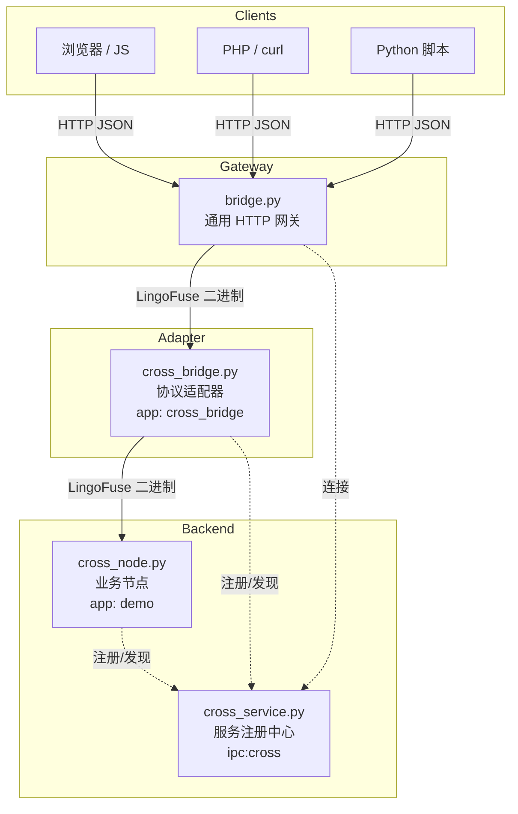
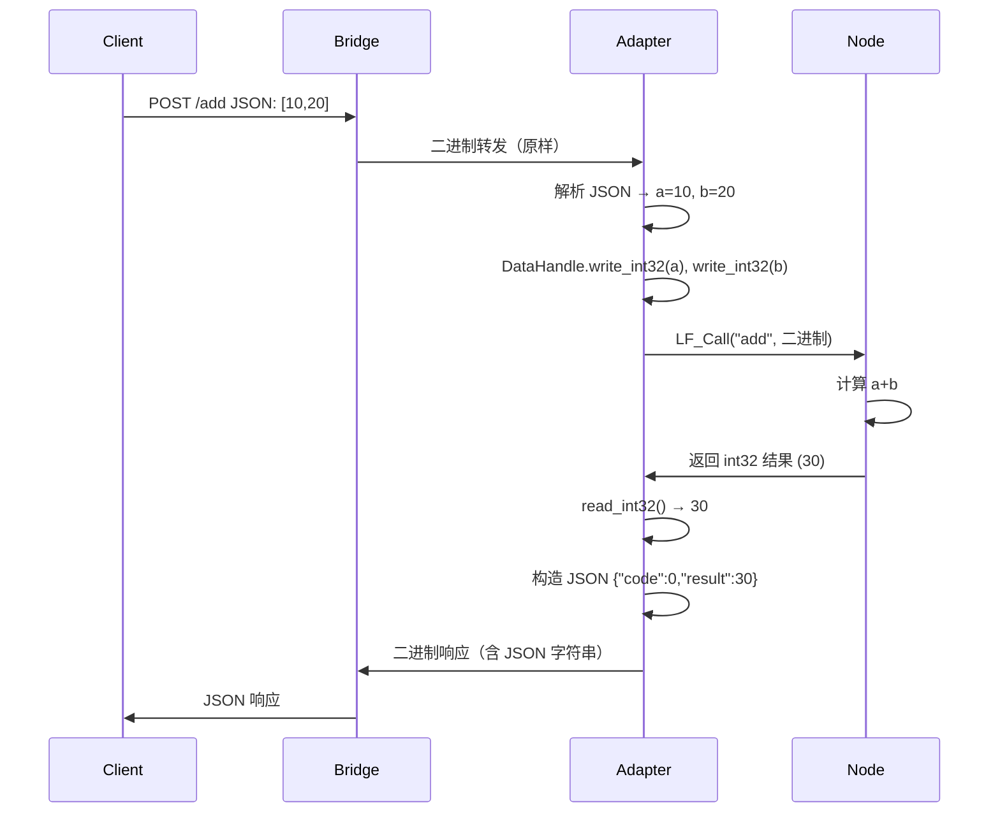
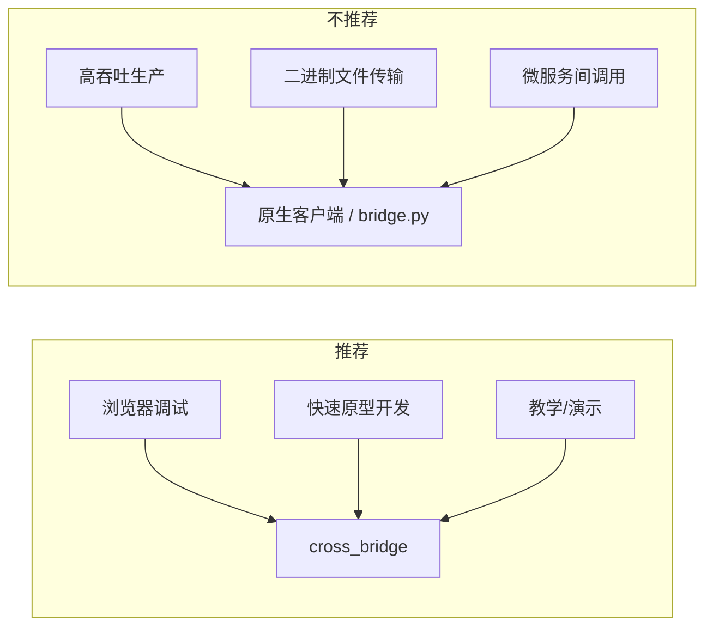
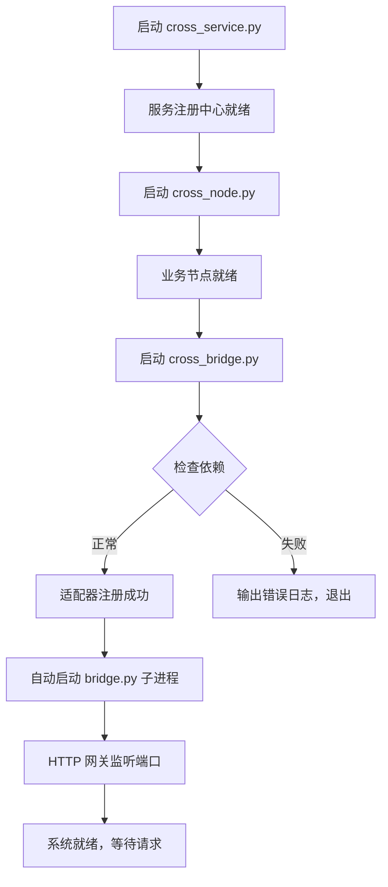
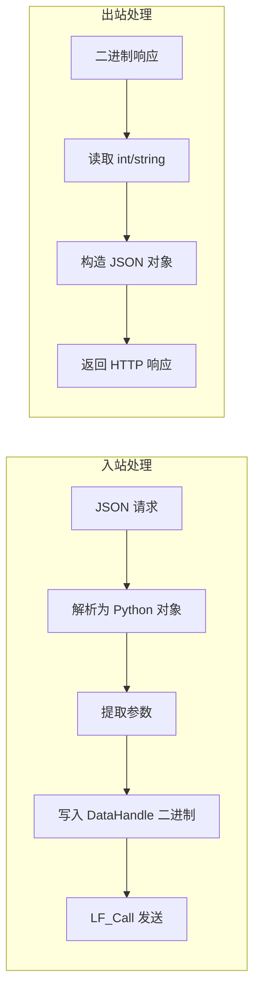
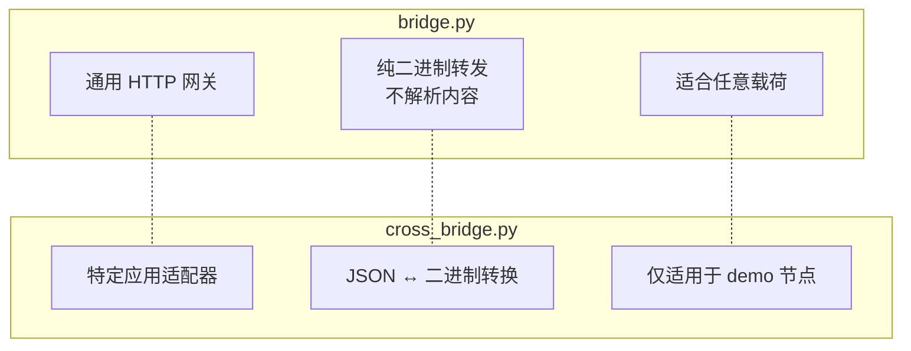
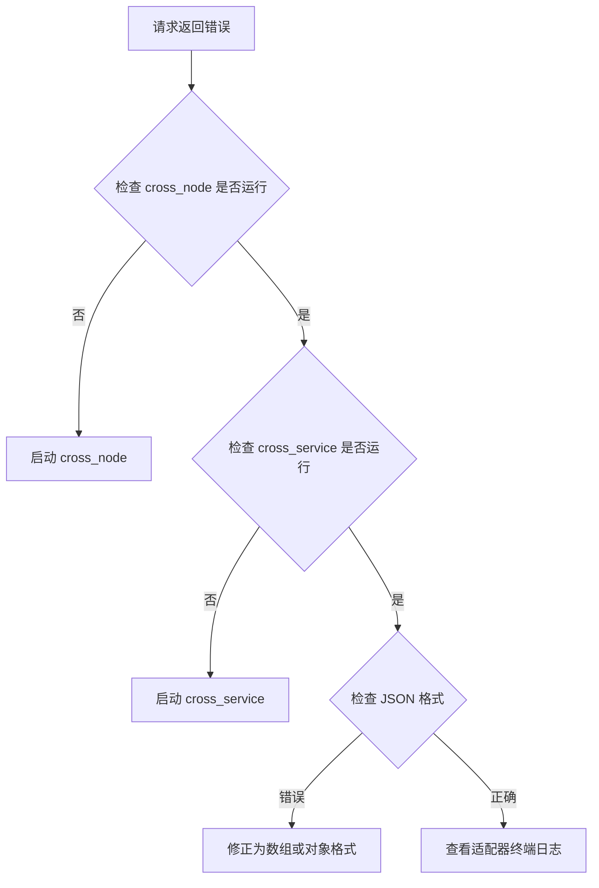

# cross_bridge_architecture_zh.md

## 1. 概述

`cross_bridge.py` 是 LingoFuse 的 **JSON ↔ 二进制协议适配器**，使 JavaScript、PHP 等动态语言能通过 HTTP/JSON 调用底层二进制 RPC 节点（`cross_node.py`）。适用于演示、调试和快速原型，生产环境建议直接使用 `bridge.py` 或原生客户端。

---

## 2. 系统架构

> 实线 = 数据流，虚线 = 服务注册与发现。

---

## 3. 数据流：从 JSON 到二进制再返回

---

## 4. 使用场景

---

## 5. 启动流程

> `cross_bridge.py` 默认会自动启动 `bridge.py` 子进程，也可以手动单独启动 `bridge.py`。

---

## 6. 协议转换细节

**支持的 API**：

| API | 输入格式 | 输出格式 |
|-----|---------|---------|
| `add` | `[a,b]` 或 `{"a":a,"b":b}` | `{"code":0,"result":a+b}` |
| `inv_seri` | 含 `b,w,c,u64,s,f` 的对象或数组（缺失用默认值） | `{"code":0,"result":"格式化字符串"}` |

---

## 7. bridge.py 与 cross_bridge.py 的关系

**协作方式**：
- `bridge.py` 可独立部署，直接连接任意 LingoFuse 服务。
- `cross_bridge.py` 内部自动启动 `bridge.py`，使 HTTP 客户端能访问 JSON 适配接口。
- 生产环境若仅需通用 HTTP 接入，直接部署 `bridge.py` 即可。

---

## 8. 常见问题排查

**其他常见问题**：
- **跨域**：`bridge.py` 已配置 CORS 头，允许所有来源。
- **性能**：JSON 转换会引入额外延迟，高并发场景请使用原生客户端或纯二进制网关。
- **端口占用**：通过 `--http-port` 参数修改 HTTP 端口。

---

## 9. 总结

`cross_bridge.py` 是一个轻量级适配器，专为二进制 LingoFuse 节点（如 `cross_node.py`）提供 JSON 接口，降低动态语言接入门槛。适合演示和开发环境，生产环境建议直接使用 `bridge.py` 或原生 LingoFuse 客户端以获得最佳性能和通用性。