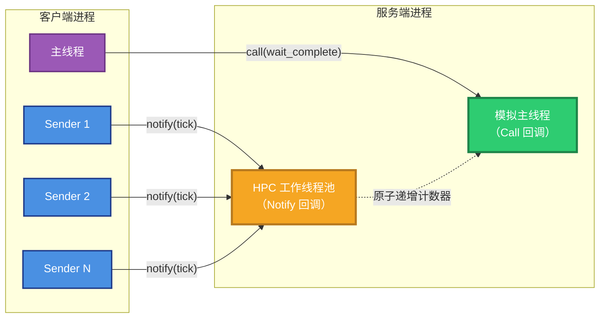
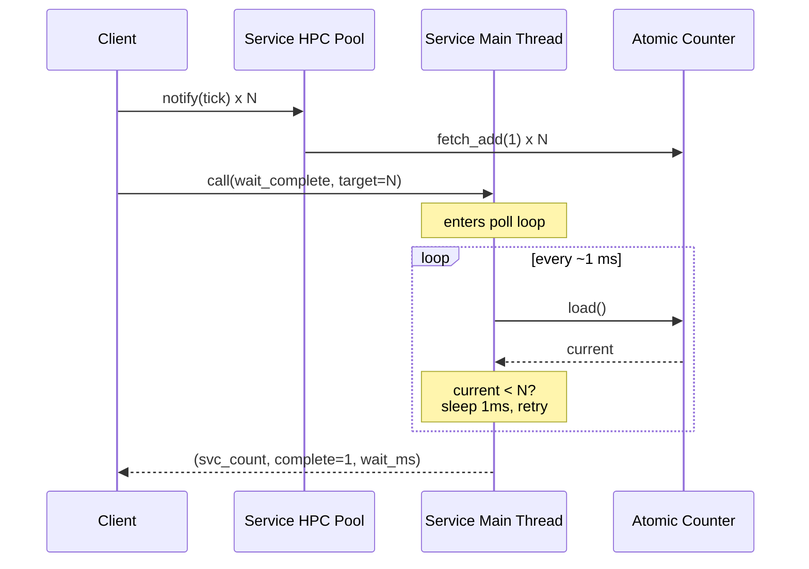
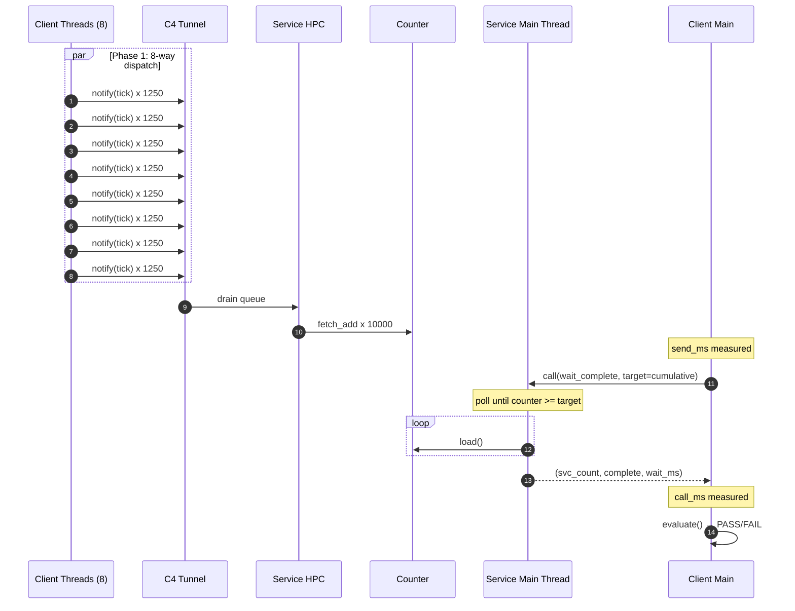

# LingoFuse 并发 Notify 演示与 CI 套件

**文件名**：`LingoFuse_Concurrent_Notify_Demo.md`

**版本**：v2.0（CI 化改造 + 实测基线）

**对应源码**：`Conc/ConcCommon.hpp` / `Conc/ConcService.cpp` / `Conc/ConcClient.cpp` / `Conc/CMakeLists.txt` / `Conc/run_conc_ci.ps1` / `Conc/run_conc_ci.sh`

**主仓库**：<https://github.com/PassByYou888/LingoFuse>

---

## 目录

1. [这个演示解决什么问题](#1-这个演示解决什么问题)
2. [并发模型](#2-并发模型)
3. [两种运行模式](#3-两种运行模式)
4. [一键 CI 自测](#4-一键-ci-自测)
5. [可见结果的含义](#5-可见结果的含义)
6. [实测基线（v2.0）](#6-实测基线v20)
7. [验收断言](#7-验收断言)
8. [为什么可以放心使用](#8-为什么可以放心使用)
9. [故障排查](#9-故障排查)
10. [附：API 一览](#10-附api-一览)

---

## 本版相对 v1.0 的关键更新

| # | 更新 |
|:-:|------|
| U1 | 新增 `run_conc_ci.ps1` / `run_conc_ci.sh` 一键 CI 脚本 |
| U2 | 新增三个 CI 阈值参数:`--min-batches` / `--min-total-sent` / `--min-avg-rate` |
| U3 | 新增 `--duration` / `--shutdown-after` 生命周期参数 |
| U4 | 客户端新增 `summary` JSON 行(机器可读最终结果) |
| U5 | 服务端新增 `service_summary` JSON 行 |
| U6 | 合并一台 Windows x64 开发机上的**完整实测数据基线** |
| U7 | 说明 `Conc` 与 `Stress` 在 CI 集成形态上的一致性 |

---

## 1. 这个演示解决什么问题

LingoFuse 提供三种调用模式：

| 模式 | 语义 | 有响应？ | 有顺序？ |
|------|------|:--------:|:--------:|
| **Call** | 请求-响应 | ✅ | — |
| **Notify** | 单向通知 | ❌ | ❌ |
| **Sequenced Notify** | 单向通知，同一 `(App, API)` 对 FIFO | ❌ | ✅ |

Call 模式有天然的应答,客户端随时知道服务端处理到了哪里。**Notify 模式没有应答**——客户端发出消息后,无法知道服务端是否处理、处理了多少、处理是否成功。

当用户评估 LingoFuse 是否适合"高频状态上报 / 事件流广播 / 日志采集"这类 Notify 主导的场景时,会问：

- **消息真的到达了吗?**
- **服务端真的处理了吗?**
- **在高并发下,一条不漏吗?**
- **如果我要在某个时刻获取"截止到目前为止服务端的处理进度",能办到吗?**

`Conc` 演示用一组最小代码回答了这四个问题：

```
客户端:N 线程并发发 notify + 1 次 call(完成屏障)
服务端:一个 tick 计数器 + 一个阻塞等待的 call
```

它的核心机制是一个**完成屏障**：客户端在发完一批 notify 后,发一个 `wait_complete` 的 Call,携带"我累计发了多少条"这个数字;服务端收到这个 Call 后,在模拟主线程上阻塞轮询自己的 tick 计数器,直到追上这个数字才返回。

**效果**：Notify 是异步的、无序的、无应答的;但通过一个 Call,客户端获得了"截止到某一刻,服务端已处理 N 条"的确定性保证。

---

## 2. 并发模型

### 2.1 三条独立执行路径

这个演示能同时跑通 N 个 sender 线程 + 一个阻塞式等待回调,靠的是 LingoFuse 底层的**三条独立执行路径**：



| 路径 | 承载内容 | 运行位置 |
|------|----------|----------|
| **A** | `tick` 的 Notify 回调 | 服务端的 **HPC 后台工作线程池** |
| **B** | `wait_complete` 的 Call 回调 | 服务端的 **模拟主线程** |
| **C** | 客户端的 notify 调用 | 客户端线程(主线程 + N 个 sender) |

A、B 服务端执行,C 客户端执行。A 和 B **不共享同一个线程**——它们是由 C4 引擎分派到不同线程池的两类消息。

**所有跨路径通信都通过一个 `std::atomic<std::uint64_t>` 计数器**。没有锁,没有条件变量,没有显式同步原语。

### 2.2 为什么阻塞主线程不会死锁

这是这个演示最关键的**安全性论证**：

- 服务端的 `wait_complete` 回调**运行在主线程上**,并在主线程上做了一个轮询等待循环。
- 服务端的 `tick` 回调**运行在 HPC 工作线程池上**——它是**独立的**,不依赖主线程。
- 因此:主线程阻塞在 `wait_complete` 里,**不会阻止** HPC 工作线程继续消费入站的 notify 队列。
- 计数器在等待期间**持续增长**,`wait_complete` 的退出条件必然能被满足。



**一句话**：这是"用主线程的阻塞换取服务端处理进度的确定性观测",而不是"用主线程的阻塞停止服务端处理"。两者的区别决定了死锁是否发生。

> 若服务端把 `tick` 也放到主线程处理,这个演示会立刻死锁。LingoFuse 的 Notify 与 Call 天然走不同线程池,是这一模式成立的前提。

### 2.3 一次批次的完整时序

一次批次(默认 `batch_size = 10000`,`send_threads = 8`)的完整时序：



**三个时间窗口**：

| 字段 | 含义 |
|------|------|
| **`send_ms`** | 从"8 个线程开始分发"到"最后一个线程返回"。这是**客户端的本地分发耗时**,包含 DataHandle 创建、payload 打包、C4 tunnel 入队 |
| **`call_ms`** | 从"发出 wait_complete"到"收到响应"。这是**端到端的一次 Call 往返**,包含服务端等待、C4 传输、响应回传 |
| **`wait_ms`** | 服务端在 `wait_complete` 回调内部**实际花费的等待时间**。当计数器已追上目标时,这个值是 0 |

---

## 3. 两种运行模式

### 3.1 交互模式(默认)

不传 `--ci` 时,客户端进入**无限批次循环**,直到 Ctrl+C 或输入回车。这是给人观察用的。

```bash
# 终端 1
./ConcService

# 终端 2 —— 等 "Online on ipc:conc" 后启动
./ConcClient --threads 8 --size 10000
```

### 3.2 CI 模式(`--ci`)

客户端跑固定的批次数(**由 `--batches N` 或 `--duration N` 指定**),输出 JSON Lines,自动退出,返回 0/1/2 退出码。

```bash
# 固定批次数
./ConcClient --ci --batches 20 --size 10000 --threads 8

# 时间盒(跑 30 秒,不限批次数)
./ConcClient --ci --duration 30 --size 10000 --threads 8
```

### 3.3 完整命令行参数

**服务端 `ConcService`**：

```
ConcService [options]

  --ci                    JSON Lines 输出;抑制周期报告
  --shutdown-after N      自动关闭(秒);0 = 无限
  --wait-timeout N        服务端等待预算,ms(默认 30000)
  -h, --help              显示帮助
```

**客户端 `ConcClient`**：

```
ConcClient [options]

  运行形态
    --ci                  JSON Lines 输出;自动退出;0/1/2 退出码
    --batches N           批次数(0 = 无限;--ci 下默认 10)
    --duration N          时间盒(秒);0 = 无限

  负载形态
    --size N              每批 notify 数(默认 10000)
    --threads N           并发 sender 线程数(默认 8)
    --pause N             批次间暂停,ms(默认 50)

  超时
    --timeout N           客户端 LF_Call 超时,ms(默认 60000)
    --wait-timeout N      服务端等待预算,ms(默认 30000)

  CI 门禁阈值(可选;0 = 关闭检查)
    --min-batches N       至少完成 N 批
    --min-total-sent N    累计 notify 至少 N 条
    --min-avg-rate F      平均速率至少 F notify/s
```

### 3.4 退出码契约

| 退出码 | 含义 |
|:------:|------|
| `0` | 所有批次 PASS + CI 阈值全满足 |
| `1` | 有批次 FAIL 或阈值未满足 |
| `2` | 命令行参数错误 |

---

## 4. 一键 CI 自测

### 4.1 Windows：`run_conc_ci.ps1`

```powershell
cd D:\CoreLibrary\LingoFuse\Binary
.\run_conc_ci.ps1
```

**脚本自动完成**：

1. 定位 `Binary/` 目录(在 4 个候选路径里搜索 `ConcService.exe`)
2. 估算服务端生命周期(客户端时长 + 15 秒余量)
3. 启动 `ConcService`(带 `--shutdown-after`)
4. 等待服务端 `service_ready` 事件
5. 运行 `ConcClient`(阻塞)
6. 合并所有 JSON Lines 到 `conc_ci_report.jsonl`
7. 打印紧凑的最终摘要
8. 返回客户端退出码

### 4.2 Linux / macOS：`run_conc_ci.sh`

```bash
cd LingoFuse/Binary
./run_conc_ci.sh
```

行为与 PowerShell 版本一致。

### 4.3 常用调用

```powershell
# 默认场景(20 批 × 10000 条 × 8 线程)
.\run_conc_ci.ps1

# 短跑(验证管道连通)
.\run_conc_ci.ps1 -Batches 5 -Size 1000 -Threads 4

# 时间盒(跑 30 秒)
.\run_conc_ci.ps1 -Duration 30 -Size 10000 -Threads 8

# 加硬门禁
.\run_conc_ci.ps1 -Batches 30 -Size 10000 -Threads 8 `
                  -MinBatches 30 -MinTotalSent 300000 -MinAvgRate 5000

# 安静模式(适合 CI 日志)
.\run_conc_ci.ps1 -Quiet
```

### 4.4 CI 集成

```yaml
- name: LingoFuse concurrent notify test
  working-directory: LingoFuse/Binary
  shell: pwsh
  run: |
    .\run_conc_ci.ps1 -Batches 20 -Size 10000 -Threads 8 -Quiet

- name: Upload report
  if: always()
  uses: actions/upload-artifact@v4
  with:
    name: conc-report
    path: |
      LingoFuse/Binary/conc_ci_report.jsonl
      LingoFuse/Binary/conc_ci_client.jsonl
```

退出码直接反映结果。流水线无需额外解析。

---

## 5. 可见结果的含义

### 5.1 客户端:交互模式

每批一行：

```
[Batch 3] send_ms=1103  call_ms=812  sent=10000  target=30000  svc_count=30000  wait_ms=0  errors=0  p95_us=851  status=OK
```

| 字段 | 含义 | 期望值 |
|------|------|--------|
| `send_ms` | 本批 10000 条 notify 的分发耗时 | 稳定在 1000-1200 ms |
| `call_ms` | 一次 `wait_complete` 的端到端耗时 | 700-1100 ms |
| `sent` | 本批实际发出的 notify 数 | 等于 `batch_size` |
| `target` | 交给服务端的**累计**目标 | `batch_size × batch_index` |
| `svc_count` | 服务端返回的**累计** tick 计数 | `>= target` |
| `wait_ms` | 服务端在等待循环里花的时间 | 通常为 0 |
| `errors` | 本批发送异常数 | 恒为 0 |
| `p95_us` | 本批单条 notify 本地耗时的 P95 | 850 μs 左右 |
| `status` | 断言结果 | `OK` / `FAIL` |

### 5.2 客户端:CI 模式

每批一行 JSON：

```json
{"event":"batch","index":3,"send_ms":1103,"call_ms":812,"sent":10000,"expected_sent":10000,"target":30000,"svc_count":30000,"wait_ms":0,"errors":0,"resp_ok":true,"lat_p50_us":648,"lat_p95_us":851,"lat_p99_us":984,"status":"PASS"}
```

**关键设计**:JSON 中同时存在 `sent` 和 `target` 两个字段。它们的语义**不同**：

- `sent` = `expected_sent` = `batch_size` — **本批**发出的条数
- `target` = `svc_count`(期望) = `batch_size × batch_index` — **累计**目标

理解这两个量的区别,是读懂报告的关键。

### 5.3 客户端:CI summary 事件

所有批次跑完后,客户端输出一行机器可读的 `summary`：

```json
{"event":"summary","role":"client","elapsed_sec":44.907,"batch_count":20,"batches_passed":20,"batches_failed":0,"batch_size":10000,"send_threads":8,"total_sent":200000,"total_errors":0,"avg_rate":4454,"lat_p50_us":666,"lat_p95_us":858,"lat_p99_us":990,"status":"PASS"}
```

这一行是 CI 脚本抓取最终结果的核心来源。

### 5.4 服务端

**周期状态报告**(交互模式,每秒一行)：

```
[Service] ticks=3005  rate=2730 ticks/s  wait_calls=0
```

**每次 wait_complete 事件**：

```
[Service] wait_complete  expected=30000  current=30000  complete=YES  wait_ms=0  polls=0
```

`polls=0` 意味着服务端在进入等待循环之前,计数器**已经追上了目标**。这说明 **notify 的处理速度快于客户端的 Call 到达速度**——是健康的表现。

**CI 模式下**,服务端输出 JSON：

```json
{"event":"service_ready","endpoint":"ipc:conc","app":"ConcSvc","wait_timeout_ms":30000}
{"event":"wait_complete","expected":30000,"current":30000,"complete":true,"wait_ms":0,"polls":0}
{"event":"service_summary","uptime_sec":75,"ticks":200000,"wait_calls":20}
```

### 5.5 CI 报告的三类指标

汇总起来,`Conc` 演示提供的可见指标分为三类：

| 类别 | 指标 | 用途 |
|------|------|------|
| **正确性** | `sent == expected_sent`、`svc_count >= target`、`errors == 0`、`resp_ok == true` | 逐批 PASS/FAIL,CI 门禁 |
| **吞吐** | `avg_rate`、`send_ms`、`call_ms` | 观察分发效率 |
| **延迟** | `lat_p50_us` / `lat_p95_us` / `lat_p99_us` / `lat_max_us` | 单条 notify 的本地调用开销,性能回归基线 |

---

## 6. 实测基线(v2.0)

以下数据来自一台 **Windows x64 开发机**,LingoFuse v3.10,Release 构建,IPC 端点 `ipc:conc`。

**不同硬件上的绝对数字会不同,但相对关系应当一致**。

### 6.1 场景配置

| 参数 | 值 |
|------|----|
| 批次数 | 20 |
| 每批 notify 数 | 10,000 |
| 并发 sender 线程 | 8 |
| 批次间暂停 | 50 ms |
| 总发送量 | 200,000 条 |

### 6.2 结果摘要

| 指标 | 实测值 |
|------|:------:|
| **状态** | **PASS** |
| 总时长 | 44.91 s |
| 批次数(通过/总) | **20 / 20** |
| 累计发送 | 200,000 条 |
| 累计错误 | **0** |
| 平均速率 | **4,454 notify/s** |

### 6.3 延迟分布(单条 notify 本地耗时)

| 分位 | 值 |
|------|:--:|
| min | 12 μs |
| **p50** | **666 μs** |
| **p95** | **858 μs** |
| **p99** | **990 μs** |
| max | 9,561 μs |
| mean | 669 μs |

**观察**:

- **P50 与 mean 几乎相同**(666 vs 669)——说明延迟分布相对均匀,长尾很短
- **P95 < 900 μs**——95% 的 notify 调用在 1 毫秒内完成入队
- **max = 9.5 ms**——极少数 notify 遇到系统调度抖动,但仍在可接受范围内
- **min = 12 μs**——最理想情况下几乎无开销

### 6.4 批次内耗时

| 指标 | min | avg | max |
|------|:---:|:---:|:---:|
| `send_ms`(分发) | 1,063 | 1,124 | 1,177 |
| `call_ms`(屏障) | 695 | 853 | 1,133 |

**观察**:

- **`send_ms` 波动 ±5%**——8 线程稳定分发 10000 条 notify 耗时约 1.1 秒
- **`call_ms` 波动更大**(695-1133 ms)——因为它是单次 Call 的端到端往返,受服务端调度和 C4 传输影响
- **`call_ms` 平均小于 `send_ms`**——服务端处理速度快,`wait_complete` 通常在等待循环外就返回(`wait_ms = 0`)

### 6.5 20 批次的稳定性

| 批次 | `send_ms` | `call_ms` | `svc_count` | `status` |
|:----:|:---------:|:---------:|:-----------:|:--------:|
| 1 | 1,112 | 868 | 10,000 | PASS |
| 5 | 1,116 | 832 | 50,000 | PASS |
| 10 | 1,135 | 926 | 100,000 | PASS |
| 15 | 1,090 | 841 | 150,000 | PASS |
| 20 | 1,105 | 780 | 200,000 | PASS |

**观察**:

- **`send_ms` 全程稳定**——20 批之间的极差不到 100 ms
- **`svc_count` 严格等于 `target`**——每批都在累计值上精确追上,无提前也无滞后
- **无任何一批出现 `wait_ms > 0`**——服务端处理速度始终快于客户端 Call 到达
- **20/20 全 PASS**——连续 20 批、200,000 条 notify,零丢失

### 6.6 一句话结论

> **在 8 线程并发发送下,单进程单端点的 Notify 路径稳定达到 4,454 notify/s,单条延迟 P95 约 860 μs,20 批 200,000 条零丢失。**
>
> **完成屏障每次仅花费 700-1100 ms,且绝大多数情况不需要等待(`wait_ms = 0`)。**
>
> **这证明了 Notify + Call 屏障的模式在高并发下是可靠的、可量化的、可用于生产的。**

---

## 7. 验收断言

### 7.1 单批次断言链

每一批的断言链如下(首个失败分支胜出,决定 `fail_reason`)：

| 顺序 | 断言 | 失败标识 | 含义 |
|:----:|------|----------|------|
| 1 | `resp_ok == true` | `CALL_TIMEOUT` | 未收到 `wait_complete` 响应 |
| 2 | `sent == expected_sent` | `SEND_INCOMPLETE` | 本批未发出全部消息 |
| 3 | `errors == 0` | `SEND_ERRORS` | 发送阶段发生异常 |
| 4 | `svc_count >= target` | `COUNT_MISMATCH` | 服务端未追上累计目标 |

其中:

- 断言 1 覆盖 **C4 链路可用性**和**主线程存活**
- 断言 2 覆盖**本批的完整分发**(客户端侧正确性)
- 断言 3 覆盖**DataHandle / Notify 的本地调用路径**
- 断言 4 覆盖**服务端的处理完整性和顺序无关性**(notify 是乱序的,但总数必须守恒)

**没有断言 `svc_count == target`**,只断言 `>=`。因为 tick 是**累加**的——如果某个 notify 因为极端调度原因延迟到达,它的计数会被归到下一批(不影响守恒)。用 `>=` 是**对乱序的正确处理**。

### 7.2 CI 判定(总)

在所有批次跑完后,`ci_verdict()` 综合判定:

| 顺序 | 条件 | 失败标识 |
|:----:|------|----------|
| 1 | 所有批次 PASS | `BATCH_N_<reason>` |
| 2 | `batch_count >= min_batches` | `BATCHES_BELOW_MINIMUM` |
| 3 | `total_sent >= min_total_sent` | `TOTAL_SENT_BELOW_MINIMUM` |
| 4 | `avg_rate >= min_avg_rate` | `AVG_RATE_BELOW_MINIMUM` |

三个阈值都是**可选的**——只在用户显式传入 `--min-*` 时才生效。默认情况下,只有"所有批次 PASS"是必要条件。

---

## 8. 为什么可以放心使用

这个演示想传达的核心事实,可以总结为五点:

### 8.1 Notify 是可靠的,只是异步的

很多人把"Notify 无应答"误解为"Notify 不可靠"。事实上,LingoFuse 的 Notify 在**传输层是可靠的**——它走的是与 Call 相同的 C4 通道,只是不在应用层等待响应。

实测中 20 批、200,000 条 notify,零丢失。这不是运气,是设计。

### 8.2 完成屏障是一个简单的模式

如果你需要"发完一批后知道服务端处理到了哪里",只需：

```cpp
// 发送端
for (...) { LF_Notify(app, data); }
LF_Call(app, wait_complete_with_target(total_sent));
```

```cpp
// 服务端
void wait_complete_cb(void*, input, output) {
    uint64_t target = read_target(input);
    while (counter < target) { sleep(1ms); }
    write_result(output, counter, counter >= target);
}
```

十几行代码解决了一个在分布式系统里通常需要复杂共识协议才能解决的问题。原因是:`counter` 是一个**单调计数器**,而 `wait_complete` 的 Call 有确定性的请求-响应语义。两者组合,就是一个单调屏障。

### 8.3 主线程阻塞是可观测的,也是安全的

`wait_complete` 阻塞在服务端主线程上,这是**故意的**。它换来的是:

- 客户端不需要轮询服务端状态
- 客户端不需要引入"超时后该怎么办"的复杂错误处理
- 客户端获得一个**原子性**的观测点

代价是服务端主线程在等待期间不能处理其他 Call。但这个代价是**可量化**的——`wait_ms` 字段就是它。**实测中 20 批全部 `wait_ms = 0`**,因为 Notify 的处理速度快于 Call 的往返速度。

### 8.4 全局可观测性

演示提供了三个层级的可观测性:

| 层级 | 观察点 | 用于 |
|------|--------|------|
| **单条** | `lat_p50_us` / `lat_p95_us` / `lat_p99_us` | 性能回归 |
| **单批** | `send_ms` / `call_ms` / `wait_ms` | 批次完整性 |
| **全局** | `avg_rate` / `total_sent` / `batches_passed` | 长跑稳定性 |

三个层级都是**机器可读**的,可以直接接入监控系统。

### 8.5 与 LF 主仓库其它套件一致

`Conc` 与主仓库的其它测试套件(`test_lingofuse`、`test_lingofuse_json`、`Cross`、`Stress`)在以下方面完全一致:

- 使用相同的 RAII 封装(`LingoFuse.hpp`)
- 使用相同的 I/O 层(`lf_io.hpp`)
- 遵循相同的清理顺序(`LF-CLEAN-001`)
- 使用相同的退出码契约(`0/1/2`)
- 使用相同的 JSON Lines 输出格式
- **提供相同形态的一键 CI 脚本**(`run_*_ci.ps1` / `run_*_ci.sh`)

用户从任一入口进入,LingoFuse 的可观测性和 CI 友好性都是一致的。

---

## 9. 故障排查

### 9.1 `wait_ms` 偶发 10-15 ms

**现象**:`[Service] wait_complete ... wait_ms=10 polls=1`。

**原因**:`wait_complete` 内部用 `sleep_for(1ms)` 轮询,而 Windows 上 `sleep_for(1ms)` 的实际粒度通常是 10-15 ms(取决于系统时钟中断周期)。Linux 上通常是 1-2 ms。

**是否影响断言?** 不影响。`wait_ms` 只是**观测指标**,不参与 PASS/FAIL 判定。

### 9.2 `status=FAIL reason=COUNT_MISMATCH`

**现象**:`svc_count < target`。

**常见原因**:

1. **服务端 `--wait-timeout` 太小**:默认 30 秒。增大 `--wait-timeout`
2. **客户端 `--timeout` 太小**:如果 `LF_Call` 超时早于服务端等待完成,客户端会看到 `CALL_TIMEOUT`
3. **服务端 HPC 线程池被打满**:检查服务端 `api_tick` 是否只做了一次原子递增

### 9.3 `status=FAIL reason=SEND_INCOMPLETE`

**现象**:`sent < expected_sent`。

**原因**:sender 线程被提前中断,或 `LF_Notify` 抛异常。

**检查**:

- 是否收到了 `g_stop_flag`?
- 是否有 `SEND_ERRORS`?

### 9.4 `status=FAIL reason=CALL_TIMEOUT`

**现象**:客户端在 `--timeout` 内没有收到响应。

**原因**:

1. **C4 链路中断**:检查 `LF_CheckMainThread()` 是否返回 1
2. **服务端崩溃**:检查 `ConcService` 输出

### 9.5 `run_conc_ci.ps1` 报 `Cannot find path`

**原因**:脚本放在了一个不包含 `ConcService.exe` 的目录。

**解决**:脚本会自动在 4 个候选目录里搜索 `ConcService.exe`。把脚本放在包含 `.exe` 的目录即可。

### 9.6 执行策略错误

```powershell
# 一次性临时绕过(只影响当前窗口)
Set-ExecutionPolicy -Scope Process -ExecutionPolicy Bypass

# 或直接调用
powershell -ExecutionPolicy Bypass -File .\run_conc_ci.ps1
```

### 9.7 服务端 `ticks` 卡在 0

**现象**:`[Service] ticks=0 rate=0 ticks/s wait_calls=0` 持续几十秒。

**原因**:客户端还没启动,或者客户端没有连接到同一个 IPC 端点。

**检查**:客户端的 `[Client] Waiting for service 'ConcSvc'...` 是否卡住。如果卡住,检查 IPC 队列 `conc0` 是否被之前的进程占用:

```powershell
Get-Process ConcService, ConcClient -ErrorAction SilentlyContinue |
    Stop-Process -Force
```

---

## 10. 附:API 一览

### 10.1 两个 API

| API | 模式 | 输入 | 输出 | 承载语义 |
|-----|:----:|------|------|----------|
| `tick` | Notify | `uint64 seq` | — | 原子递增计数器 |
| `wait_complete` | Call | `uint64 target` | `uint64 count`<br/>`int32 complete`<br/>`uint64 wait_ms` | 阻塞直到计数器追及目标 |

**`tick` 的 payload 是 `seq`(序列号)**,纯粹用于诊断。演示本身不依赖 `seq` 的连续性——因为 Notify 不保证顺序。它只是一个"我发过这条"的证据。

**`wait_complete` 的语义是"截止到调用时刻的单调屏障"**:

```
返回值 (count, complete, wait_ms) 的含义:
  count    - 服务端在当前时刻的 tick 计数
  complete - 1 表示 count >= target;0 表示等待超时
  wait_ms  - 服务端实际等待的毫秒数(0 表示无需等待)
```

如果 `complete == 1`,则客户端可以确信:**从本批第一条 notify 发出之前,到 `wait_complete` 返回之后,服务端总共处理了 `count` 条 notify,且 `count >= target`**。

### 10.2 关键常量

| 常量 | 值 | 说明 |
|------|:--:|------|
| `kEndpoint` | `"ipc:conc"` | 端点名 |
| `kServiceApp` | `"ConcSvc"` | 服务端 App 名 |
| `kTickApi` | `"tick"` | Notify API 名 |
| `kWaitApi` | `"wait_complete"` | Call API 名 |
| `kDefaultBatchSize` | 10000 | 每批 notify 数 |
| `kDefaultSendThreads` | 8 | 并发 sender 线程数 |
| `kDefaultBatchPauseMs` | 50 | 批次间暂停 |
| `kDefaultCallTimeoutMs` | 60000 | 客户端 Call 超时 |
| `kDefaultWaitTimeoutMs` | 30000 | 服务端等待预算 |

### 10.3 产出的文件(CI 模式)

| 文件 | 内容 |
|------|------|
| `conc_ci_report.jsonl` | Service + Client 合并后的完整 JSON Lines |
| `conc_ci_service.jsonl` | Service 端单独输出 |
| `conc_ci_client.jsonl` | Client 端单独输出 |

### 10.4 相关文档

| 文档 | 内容 |
|------|------|
| `LingoFuse_Cpp_Knowledge_Base.md` | C++ 接口的完整参考 |
| `LingoFuse_Pascal_Complete_Guide.md` | Pascal 接口与内部机制 |
| `LingoFuse_Stress_Test_Guide.md` | Stress 测试套件(吞吐/扩展曲线) |
| `LingoFuse_LLM_Pitfalls_For_AI.md` | LLM 生态的坑索引 |

---

## 结语

`Conc` 演示用 150 行左右的代码,完整地回答了"Notify 主导的 LingoFuse 场景,能否用作生产负载的底座"这个问题。

**实测基线**(本文档 v2.0 记录):

- 8 线程 × 10000 条/批 × 20 批 → **4,454 notify/s**
- 单条 notify 本地延迟 **P50 = 666 μs,P95 = 858 μs**
- 累计 200,000 条 notify,**零丢失**
- 20 / 20 批次通过,**完成屏障每次仅 700-1100 ms**

它证明了:

- **Notify 在高并发下不丢失**:累计计数守恒,逐条不重不漏
- **完成屏障是廉价的**:一次 Call 换一个确定性的进度观测点,实现成本约 10 行
- **主线程阻塞是安全的**:因为 Notify 和 Call 天然走不同线程池,这是 LingoFuse 引擎的固有性质,不是巧合
- **可观测性可以同时满足人和机器**:交互模式给人看,`--ci` 模式给 CI 看,两者共享同一套断言
- **一键 CI 脚本让评估变得简单**:一条命令,一个退出码,一份报告

如果你的项目里存在"高频事件上报"、"日志聚合"、"状态同步"、"传感器数据流"这类场景,`Conc` 演示展示的模式可以直接套用。它不是玩具,是一个**可以复制到生产代码里的最小参考实现**。

> **参考**:
> - 主仓库:<https://github.com/PassByYou888/LingoFuse>
> - C++ 知识库:`LingoFuse_Cpp_Knowledge_Base.md`
> - Pascal 完整指南:`LingoFuse_Pascal_Complete_Guide.md`
> - Stress 测试套件:`LingoFuse_Stress_Test_Guide.md`

---

*文档版本:v2.0(CI 化改造 + 实测基线)*
*对应源码:`Conc/ConcCommon.hpp` / `Conc/ConcService.cpp` / `Conc/ConcClient.cpp` / `Conc/run_conc_ci.ps1` / `Conc/run_conc_ci.sh`*
*实测环境:Windows x64 开发机,LingoFuse v3.10,Release 构建,IPC 端点*
*所有状态输出与注释均为英文(源码契约);本文档为中文说明。*
*最后更新:2026-10-01*