# LingoFuse C++ Interface Knowledge Base (v6.0, English Edition)

> **Purpose**: The self-contained, authoritative reference for the LingoFuse C++ interface. Any AI or human engineer can read this file alone and write correct, complete, production-grade LingoFuse C++ programs without reading the source.
>
> **Source coverage**: `LingoFuse.h`, `LingoFuse.c`, `lf_io.hpp`, `LingoFuse.hpp`, `lf_http_bridge_client.hpp`, cross-checked against the Pascal layer (`lingofuse_import.pas`, `lingofuse_helper.pas`) and against `LingoFuse_Pascal_Complete_Guide.md`.
>
> **Evidence level**: 🟢 verified against source / 🟡 documentation inference / ⏳ unverified
>
> **Diagrams**: All diagrams use Mermaid.
>
> **Changelog**: v6.0 (2026-09-25) — English rebuild. Adds an explicit **ABI loading contract** section and a new pitfall class discovered while building the CMake test-program generator. See §0.7 and §22.

---

## Table of Contents

- [Chapter 0 — Quick Orientation](#chapter-0--quick-orientation)
  - [0.7 ABI Loading Contract (READ THIS FIRST)](#07-abi-loading-contract-read-this-first)
- [Chapter 1 — What LingoFuse Is](#chapter-1--what-lingofuse-is)
- [Chapter 2 — Build, Load, and Platform](#chapter-2--build-load-and-platform)
- [Chapter 3 — Runtime Mechanics](#chapter-3--runtime-mechanics)
- [Chapter 4 — The C ABI Layer](#chapter-4--the-c-abi-layer)
- [Chapter 5 — Unified I/O (`lf_io.hpp`)](#chapter-5--unified-io-lf_iohpp)
- [Chapter 6 — RAII Layer (`LingoFuse.hpp`)](#chapter-6--raii-layer-lingofusehpp)
- [Chapter 7 — Callback Contract](#chapter-7--callback-contract)
- [Chapter 8 — Cross-Language Wire Format](#chapter-8--cross-language-wire-format)
- [Chapter 9 — Full Call Chain and Lifecycle](#chapter-9--full-call-chain-and-lifecycle)
- [Chapter 10 — Multi-Node, Multi-App, Load Balancing](#chapter-10--multi-node-multi-app-load-balancing)
- [Chapter 11 — Runtime Options](#chapter-11--runtime-options)
- [Chapter 12 — Error Handling and Recovery](#chapter-12--error-handling-and-recovery)
- [Chapter 13 — HTTP Bridge](#chapter-13--http-bridge)
- [Chapter 14 — Complete Application Patterns](#chapter-14--complete-application-patterns)
- [Chapter 15 — Cross-Language Comparison](#chapter-15--cross-language-comparison)
- [Chapter 16 — Integration with the Z Framework](#chapter-16--integration-with-the-z-framework)
- [Chapter 17 — Debugging and Troubleshooting](#chapter-17--debugging-and-troubleshooting)
- [Chapter 18 — Testing and Verification](#chapter-18--testing-and-verification)
- [Chapter 19 — Anti-Patterns and Pitfalls](#chapter-19--anti-patterns-and-pitfalls)
- [Chapter 20 — API Quick Reference](#chapter-20--api-quick-reference)
- [Chapter 21 — Honest Uncertainty List](#chapter-21--honest-uncertainty-list)
- [Chapter 22 — Generated-Code Pitfalls (NEW in v6.0)](#chapter-22--generated-code-pitfalls-new-in-v60)
- [Appendix A — Glossary](#appendix-a--glossary)
- [Appendix B — Pascal LF-* Numbering Cross-Reference](#appendix-b--pascal-lf--numbering-cross-reference)
- [Appendix C — Version History](#appendix-c--version-history)

---

## Chapter 0 — Quick Orientation

### 0.1 One-Sentence Definition

> **LingoFuse is a cross-language, cross-process, cross-machine RPC framework. The C++ interface exposes its capabilities through five headers: C ABI, unified I/O, RAII wrapper, JSON library, and HTTP bridge client.**

### 0.2 File Layout and Dependency Direction

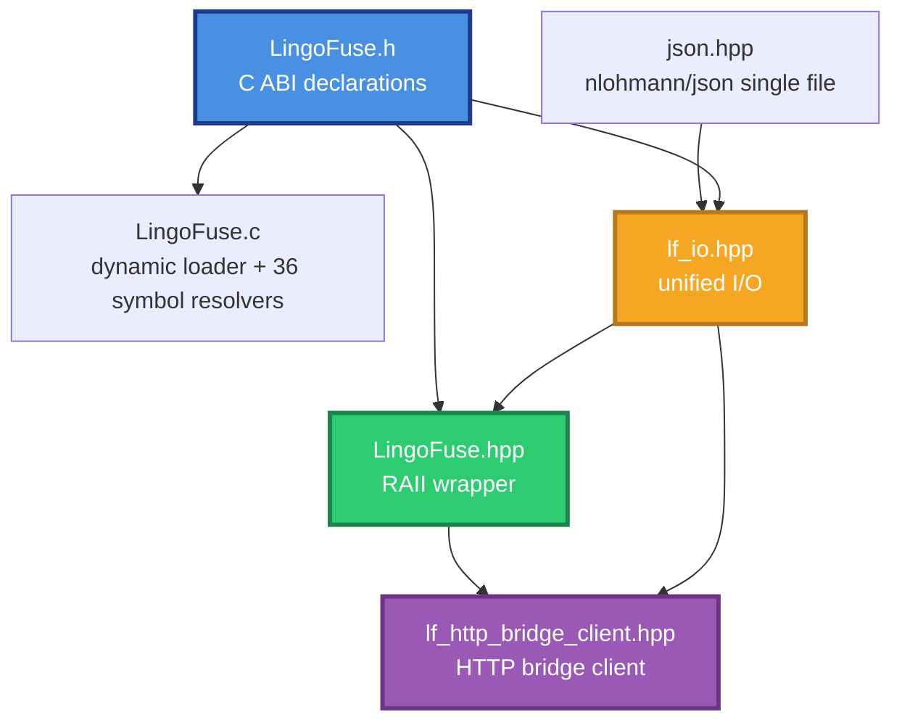
```mermaid
flowchart TB
    JSON["json.hpp<br/>nlohmann/json single file"]
    H["LingoFuse.h<br/>C ABI declarations"]
    C["LingoFuse.c<br/>dynamic loader + 36 symbol resolvers"]
    IO["lf_io.hpp<br/>unified I/O"]
    HPP["LingoFuse.hpp<br/>RAII wrapper"]
    BRIDGE["lf_http_bridge_client.hpp<br/>HTTP bridge client"]

    JSON --> IO
    H --> IO
    H --> HPP
    IO --> HPP
    H --> C
    HPP --> BRIDGE
    IO --> BRIDGE

    style H fill:#4A90E2,stroke:#1E3A8A,stroke-width:3px,color:#FFFFFF
    style IO fill:#F5A623,stroke:#B7791F,stroke-width:3px,color:#FFFFFF
    style HPP fill:#2ECC71,stroke:#1E8449,stroke-width:3px,color:#FFFFFF
    style BRIDGE fill:#9B59B6,stroke:#6C3483,stroke-width:3px,color:#FFFFFF
```

Dependency direction is strictly one-way: `LingoFuse.h → lf_io.hpp → LingoFuse.hpp → lf_http_bridge_client.hpp`.

### 0.3 Three Layers of Abstraction

| Layer | File | Purpose | Who uses it |
|---|---|---|---|
| C ABI | `LingoFuse.h` / `.c` | Dynamic loading, 36 exports, C helpers | C / C++ / any-FFI language |
| Unified I/O | `lf_io.hpp` | Only sanctioned entry for JSON/string/byte wire format | Callbacks, RAII layer |
| RAII | `LingoFuse.hpp` | `DataHandle` / `App` / `LibraryLoader` / network events | Modern C++ applications |
| HTTP Bridge client | `lf_http_bridge_client.hpp` | Call `bridge.py` / `bridge.exe` over the LF mesh | Services needing HTTP/JSON repair |

### 0.4 Five Iron Rules

| # | Rule | Violation Consequence |
|:-:|---|---|
| 1 | Callbacks MUST be `LF_CDECL` | Stack misalignment, random crashes |
| 2 | Never call `LF_Call` / `LF_Notify` / `LF_LocalCall` / `LF_PrepareDone` inside a callback | Deadlock |
| 3 | Route all JSON / string I/O through `lingofuse::io` | Frame drift, cross-language failures |
| 4 | Cleanup order: `clearNetworkEvent` → `exitMainThread` → `~App` / `FreeApp` → `shutdown` → `LF_FreeLibrary` | Dangling pointers, leaks |
| 5 | One client per physical address, unless `Overlap_Connection=True` | Silent dropped connections |
| **6** | **`LF_LoadLibrary()` MUST be called before ANY other `LF_*` call.** | **All other `LF_*` calls silently target null function pointers → crash or no-op** |

### 0.5 Key Defaults

| Item | Value |
|---|---:|
| C ABI export count | 36 |
| Default TCP port | 9898 |
| DataHandle idle reclamation | 5 minutes |
| Reclamation scan interval | 5 seconds |
| `LF_PrepareDone` init timeout | 30 seconds |
| `Wait_Connection_Timeout` default | 30000 ms |
| `Overlap_Connection` default | False |
| `Wait_Connection_ReadyOk` default | True |
| `Fixed_Sequenced_Time` default | 20000 ms |
| Bridge default App | `__lf_http_bridge__` |
| Bridge default POST API | `__lf_outbound_post__` |
| Bridge default repair API | `__lf_repair_json__` |
| Bridge default LF_Call timeout | 60000 ms |
| Bridge default HTTP timeout | 25.0 s |
| Bridge HTTP timeout cap | 300.0 s |
| `LF_Generate_AppName` pointer validity | ~5 seconds |

### 0.6 Reading Paths

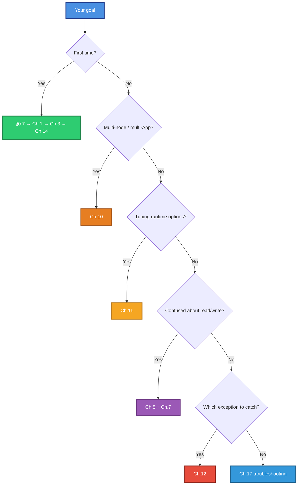
```mermaid
flowchart TD
    S["Your goal"] --> Q1{"First time?"}
    Q1 -- Yes --> R1["§0.7 → Ch.1 → Ch.3 → Ch.14"]
    Q1 -- No --> Q2{"Multi-node / multi-App?"}
    Q2 -- Yes --> R2["Ch.10"]
    Q2 -- No --> Q3{"Tuning runtime options?"}
    Q3 -- Yes --> R3["Ch.11"]
    Q3 -- No --> Q4{"Confused about read/write?"}
    Q4 -- Yes --> R4["Ch.5 + Ch.7"]
    Q4 -- No --> Q5{"Which exception to catch?"}
    Q5 -- Yes --> R5["Ch.12"]
    Q5 -- No --> R6["Ch.17 troubleshooting"]

    style S fill:#4A90E2,stroke:#1E3A8A,stroke-width:3px,color:#FFFFFF
    style R1 fill:#2ECC71,stroke:#1E8449,stroke-width:3px,color:#FFFFFF
    style R2 fill:#E67E22,stroke:#9C4A0C,stroke-width:3px,color:#FFFFFF
    style R3 fill:#F5A623,stroke:#B7791F,stroke-width:3px,color:#FFFFFF
    style R4 fill:#9B59B6,stroke:#6C3483,stroke-width:3px,color:#FFFFFF
    style R5 fill:#E74C3C,stroke:#922B21,stroke-width:3px,color:#FFFFFF
    style R6 fill:#3498DB,stroke:#1F618D,stroke-width:3px,color:#FFFFFF
```

### 0.7 ABI Loading Contract (READ THIS FIRST)

> **This is the single most important operational rule when using the C ABI layer from C++.** Every bug that manifests as "my service does nothing", "LF_CreateData returns garbage", or "callback never fires" traces back to violating this contract.

#### 0.7.1 The Rule

The C ABI layer is **dynamically loaded**. `LingoFuse.h` declares 36 functions. `LingoFuse.c` implements them as **thin wrappers around a table of function pointers**. Those pointers are populated only when you explicitly call:

```c
int LF_LoadLibrary(void);   /* returns 1 on success, 0 on failure */
```

**Before that call, every `LF_*` pointer is null.** Invoking any other `LF_*` function without a prior successful `LF_LoadLibrary()` is undefined behaviour — typically a null-pointer dereference.

#### 0.7.2 Mandatory Ordering

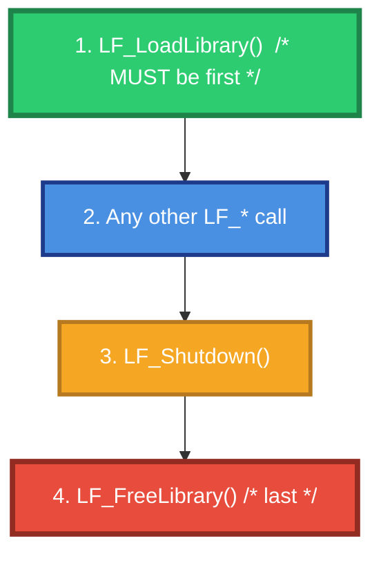
```mermaid
flowchart TB
    A["1. LF_LoadLibrary()  /* MUST be first */"]
    B["2. Any other LF_* call"]
    C["3. LF_Shutdown()"]
    D["4. LF_FreeLibrary()  /* last */"]

    A --> B --> C --> D

    style A fill:#2ECC71,stroke:#1E8449,stroke-width:4px,color:#FFFFFF
    style D fill:#E74C3C,stroke:#922B21,stroke-width:4px,color:#FFFFFF
    style B fill:#4A90E2,stroke:#1E3A8A,stroke-width:3px,color:#FFFFFF
    style C fill:#F5A623,stroke:#B7791F,stroke-width:3px,color:#FFFFFF
```

#### 0.7.3 Search Order Used by `LF_LoadLibrary`

`LF_LoadLibrary()` takes **no arguments**. The wrapper locates the runtime using this fixed search order:

1. The directory that contains the **current executable**.
2. The platform's **default loader search path** (PATH on Windows, LD_LIBRARY_PATH on Linux, DYLD_LIBRARY_PATH on macOS).

Expected runtime library names:

| Platform | Library |
|---|---|
| Windows 64-bit | `LingoFuse64.dll` |
| Windows 32-bit | `LingoFuse32.dll` |
| Linux / BSD | `liblingofuse.so` |
| macOS | `liblingofuse.dylib` |

There is **no environment-variable override** at the C ABI level. To relocate the runtime library, either place it next to the executable or add its directory to the platform loader search path.

#### 0.7.4 Minimal Correct Pattern

```cpp
#include "LingoFuse.hpp"

int main() {
    /* Step 1 — load the runtime BEFORE anything else. */
    if (LF_LoadLibrary() != 1) {
        std::fprintf(stderr, "[FATAL] LF_LoadLibrary failed\n");
        return 1;
    }

    /* Step 2 — now every LF_* call is safe. */
    lingofuse::resetPrepare();
    lingofuse::App app("MyApp", "demo");
    app.registerCall("ping", "ping", nullptr, my_cb);
    /* ... */

    lingofuse::prepareDone();

    /* Step 3 — shut down and unload. */
    lingofuse::shutdown();
    LF_FreeLibrary();
    return 0;
}
```

#### 0.7.5 RAII Shortcut

`lingofuse::LibraryLoader` handles both `LF_LoadLibrary()` and `LF_FreeLibrary()` via RAII. **Construct it as the very first object in `main()`** (or before any other LingoFuse code):

```cpp
int main() {
    lingofuse::LibraryLoader loader;   /* constructor calls LF_LoadLibrary */
    /* ... everything else ... */
    return 0;                          /* destructor calls LF_FreeLibrary */
}
```

If `LF_LoadLibrary` fails, the constructor throws `lingofuse::Error` with `code() == ErrorCode::LibraryLoadFailed`.

#### 0.7.6 Why This Rule Is Easy to Miss

- **Pascal has no equivalent**: Pascal links statically against `LingoFuse` and the runtime is always present.
- **Python has no equivalent**: the Python wrapper loads the library during import.
- **Generated test programs** (from `cpp_abi_cmake_generator_tool`) are a common failure point: a naive generator emits `LF_CreateApp`, `LF_PrepareService`, etc. without a leading `LF_LoadLibrary()`. The resulting program compiles cleanly and then dies at the first `LF_*` call. See Chapter 22.

---

## Chapter 1 — What LingoFuse Is

> Read this chapter to make all later chapters precise. Skipping it leads to vague semantics.

### 1.1 Five Fundamental Abstractions

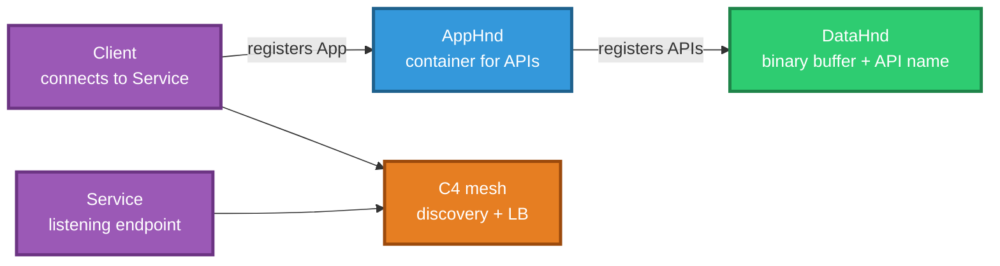
```mermaid
flowchart LR
    DH["DataHnd<br/>binary buffer + API name"]
    AH["AppHnd<br/>container for APIs"]
    SVC["Service<br/>listening endpoint"]
    CLI["Client<br/>connects to Service"]
    MESH["C4 mesh<br/>discovery + LB"]

    AH -->|registers APIs| DH
    CLI -->|registers App| AH
    SVC --> MESH
    CLI --> MESH

    style DH fill:#2ECC71,stroke:#1E8449,stroke-width:3px,color:#FFFFFF
    style AH fill:#3498DB,stroke:#1F618D,stroke-width:3px,color:#FFFFFF
    style SVC fill:#9B59B6,stroke:#6C3483,stroke-width:3px,color:#FFFFFF
    style CLI fill:#9B59B6,stroke:#6C3483,stroke-width:3px,color:#FFFFFF
    style MESH fill:#E67E22,stroke:#9C4A0C,stroke-width:3px,color:#FFFFFF
```

| Abstraction | Underlying type | Lifetime | Owner |
|---|---|---|---|
| **DataHnd** | `TLF_Data` record | 5 min idle → reclaimed | Global handle pool |
| **AppHnd** | `TLF_App` object | Until `LF_Shutdown` | Global app pool |
| **Service** | C4 physical service | Until `LF_Shutdown` | Internal |
| **Client** | C4 physical client | Until `LF_Shutdown` | Internal |
| **MESH** | C4 service mesh | Process-wide singleton | Internal |

Users see `DataHnd` and `AppHnd`. Service/Client/MESH are internal; you touch them only through `prepareService` / `prepareClient` / `prepareDone`.

### 1.2 Service vs. Client

- **Service**: listening endpoint; maintains the registry (who exposes what API); broadcasts API info. It is a **beacon**, not a business endpoint.
- **Client**: connects to a Service; exposes its own App and APIs, or is a pure consumer.
- **A process may be both Service and Client** (self-connected; local calls avoid the network).

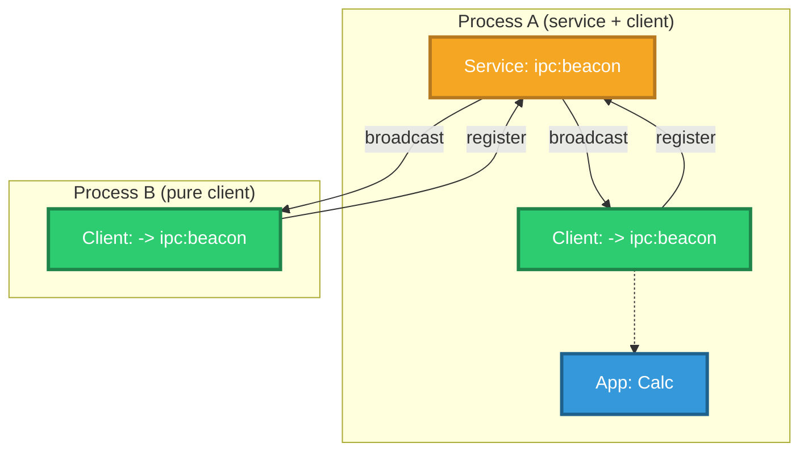
```mermaid
flowchart TB
    subgraph ProcessA["Process A (service + client)"]
        SA["Service: ipc:beacon"]
        CA["Client: -> ipc:beacon"]
        AppA["App: Calc"]
        CA -.-> AppA
    end
    subgraph ProcessB["Process B (pure client)"]
        CB["Client: -> ipc:beacon"]
    end

    CA -->|register| SA
    CB -->|register| SA
    SA -->|broadcast| CA
    SA -->|broadcast| CB

    style SA fill:#F5A623,stroke:#B7791F,stroke-width:3px,color:#FFFFFF
    style CA fill:#2ECC71,stroke:#1E8449,stroke-width:3px,color:#FFFFFF
    style CB fill:#2ECC71,stroke:#1E8449,stroke-width:3px,color:#FFFFFF
    style AppA fill:#3498DB,stroke:#1F618D,stroke-width:3px,color:#FFFFFF
```

| Role | `prepareService` | `prepareClient` | Bind App |
|---|---|---|---|
| Pure beacon | ✅ | ✅ (self) | ❌ |
| Compute node | ❌ | ✅ (to beacon) | ✅ |
| Pure consumer | ❌ | ✅ | ❌ |
| Standalone | ✅ | ✅ | ✅ |

### 1.3 The C4 Mesh

C4 is LingoFuse's underlying service mesh. It provides:

1. **Discovery**: clients publish App/API info to a Service on connect.
2. **Broadcast**: Service distributes the registry to all clients.
3. **Routing**: `LF_Call` looks up the local cache and picks a target client.
4. **Load balancing**: with multiple clients offering the same App, pick by `Cycle_Time_Anchor` (least recently used).
5. **Local-first**: if the target App exists in-process, execute locally without a network hop.

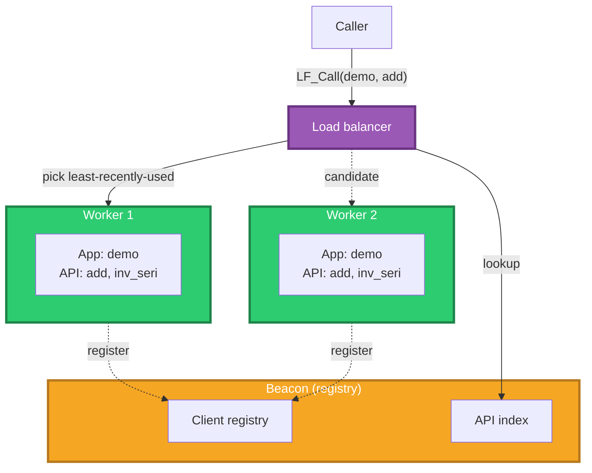
```mermaid
flowchart TB
    subgraph Beacon["Beacon (registry)"]
        REG["Client registry"]
        APITAB["API index"]
    end
    subgraph Worker1["Worker 1"]
        APP1["App: demo<br/>API: add, inv_seri"]
    end
    subgraph Worker2["Worker 2"]
        APP2["App: demo<br/>API: add, inv_seri"]
    end

    CALLER["Caller"] -->|"LF_Call(demo, add)"| LB["Load balancer"]
    LB -->|"pick least-recently-used"| Worker1
    LB -.->|"candidate"| Worker2

    Worker1 -.->|"register"| REG
    Worker2 -.->|"register"| REG
    LB -->|"lookup"| APITAB

    style Beacon fill:#F5A623,stroke:#B7791F,stroke-width:3px,color:#FFFFFF
    style LB fill:#9B59B6,stroke:#6C3483,stroke-width:3px,color:#FFFFFF
    style Worker1 fill:#2ECC71,stroke:#1E8449,stroke-width:3px,color:#FFFFFF
    style Worker2 fill:#2ECC71,stroke:#1E8449,stroke-width:3px,color:#FFFFFF
```

### 1.4 Service Discovery Sequence

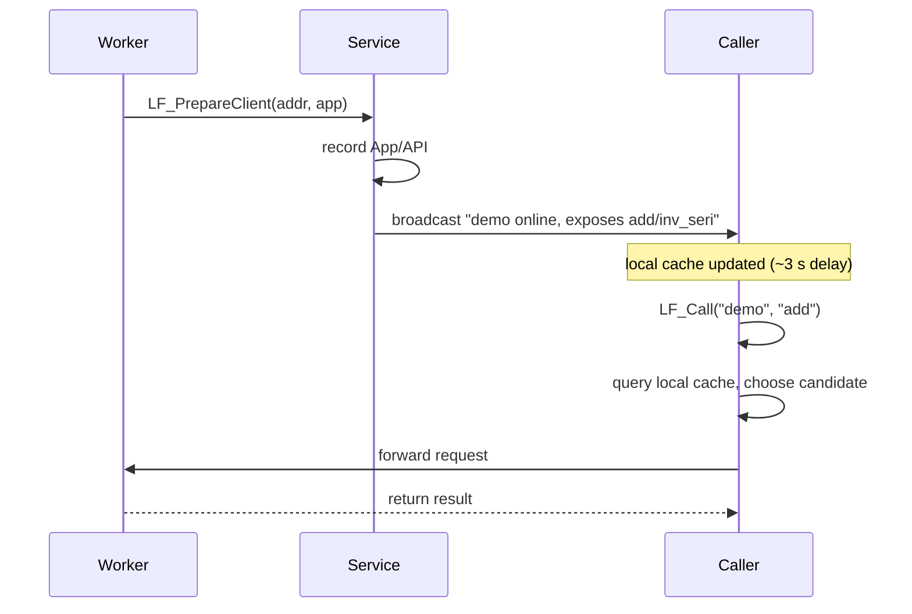
```mermaid
sequenceDiagram
    participant W as Worker
    participant S as Service
    participant C as Caller

    W->>S: LF_PrepareClient(addr, app)
    S->>S: record App/API
    S->>C: broadcast "demo online, exposes add/inv_seri"
    Note over C: local cache updated (~3 s delay)
    C->>C: LF_Call("demo", "add")
    C->>C: query local cache, choose candidate
    C->>W: forward request
    W-->>C: return result
```

**Three core conclusions**:

- **`checkApi` has ~3 s delay** — it reads the locally cached broadcast.
- **Multiple workers are automatically load balanced** — selection by `Cycle_Time_Anchor`.
- **`LF_Call` can invoke a local App** — C4 checks the local instance first.

### 1.5 Local-First Routing

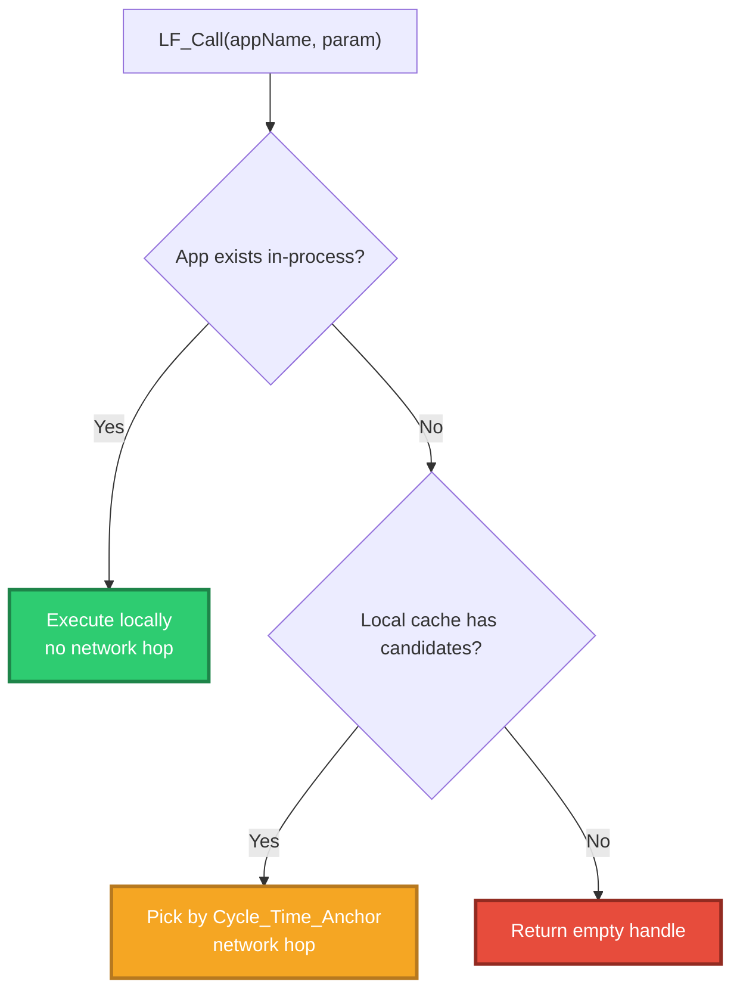
```mermaid
flowchart TD
    A["LF_Call(appName, param)"] --> B{"App exists in-process?"}
    B -- Yes --> C["Execute locally<br/>no network hop"]
    B -- No --> D{"Local cache has candidates?"}
    D -- Yes --> E["Pick by Cycle_Time_Anchor<br/>network hop"]
    D -- No --> F["Return empty handle"]

    style C fill:#2ECC71,stroke:#1E8449,stroke-width:3px,color:#FFFFFF
    style E fill:#F5A623,stroke:#B7791F,stroke-width:3px,color:#FFFFFF
    style F fill:#E74C3C,stroke:#922B21,stroke-width:3px,color:#FFFFFF
```

**Implication**: even when you call `LF_Call("demo", ...)` intending a remote target, if the same App name is registered locally, the local instance wins.

### 1.6 DataHandle Memory Model

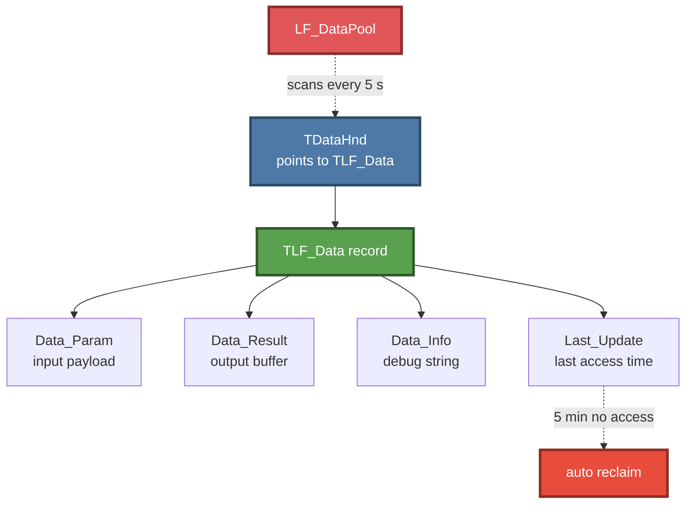
```mermaid
flowchart TB
    HND["TDataHnd<br/>points to TLF_Data"] --> DATA["TLF_Data record"]
    DATA --> DP["Data_Param<br/>input payload"]
    DATA --> DR["Data_Result<br/>output buffer"]
    DATA --> DI["Data_Info<br/>debug string"]
    DATA --> LT["Last_Update<br/>last access time"]

    POOL["LF_DataPool"] -.->|"scans every 5 s"| HND
    LT -.->|"5 min no access"| RECYCLE["auto reclaim"]

    style HND fill:#4E79A7,stroke:#2C4C6B,stroke-width:3px,color:#FFFFFF
    style DATA fill:#59A14F,stroke:#2F5928,stroke-width:3px,color:#FFFFFF
    style POOL fill:#E15759,stroke:#8C2A2B,stroke-width:3px,color:#FFFFFF
    style RECYCLE fill:#E74C3C,stroke:#922B21,stroke-width:3px,color:#FFFFFF
```

| Property | Note |
|---|---|
| **`Data_Param` and `Data_Result` are mutually exclusive** | Input handle has Param only; output handle has Result only |
| **Auto reclamation** | Scans every 5 s; releases handles idle for 5 min |
| **Keep-alive** | Any `LF_*` access refreshes `Last_Update` |
| **Do not rely on auto-reclamation** | Under heavy load, handle growth can outpace reclamation → OOM |

### 1.7 Three Invocation Modes

| Mode | Semantics | Ordering | Return value | Underlying |
|---|---|---|---|---|
| **Call** | Request-response, synchronous | — | ✅ | Blocks until response or timeout |
| **Notify** | One-way notification | ❌ | ❌ | Best-effort |
| **Sequenced Notify** | One-way with FIFO | ✅ (same (app,api)) | ❌ | Per-pair dedicated thread |

### 1.8 Relationship with the Z Framework

LingoFuse is not standalone. It builds on the Z framework:

| LingoFuse Layer | Z Framework Unit |
|---|---|
| Core RPC engine | `Z.Core` (`TAtomInt`, `TCritical`, `TCompute`) |
| Hash pools | `Z.HashList.Templet` |
| Memory streams | `Z.MemoryStream` (`TMem64`) |
| Timers | `Z.Notify` (`Subscribe_Timer_M`) |
| Status | `Z.Status` (`DoStatus`) |
| C4 distribution | `Z.Net.C4`, `Z.Net.DoubleTunnelIO.NoAuth`, `Z.Net.PhysicsIO` |
| JSON | `Z.Json` |

The C++ layer is a thin wrapper over the Pascal core. Understanding this explains why certain behaviours exist (5-second pointer validity, 5-minute reclamation, etc.).

---

## Chapter 2 — Build, Load, and Platform

### 2.1 Directory Structure

```
LingoFuse/cpp/
├── CMakeLists.txt
├── json.hpp
├── LingoFuse.h
├── LingoFuse.c
├── LingoFuse.hpp
├── lf_io.hpp
├── lf_http_bridge_client.hpp
├── CrossDemo/
└── test/
```

### 2.2 CMake Targets

| Target | Type | Purpose |
|---|---|---|
| `lingofuse_headers` | INTERFACE | Public headers |
| `lingofuse_c_wrapper` | STATIC | Compiles `LingoFuse.c`; links platform dynamic-loader library |
| `test_lingofuse` | EXECUTABLE | ABI / RAII / network / concurrency / stress tests |
| `test_lingofuse_json` | EXECUTABLE | `lf_io.hpp` tests |
| `CrossService` / `CrossNode` / `CrossCall` | EXECUTABLE | Demo programs |

### 2.3 Build Commands

```bash
cd LingoFuse/cpp
mkdir build && cd build
cmake .. -DCMAKE_BUILD_TYPE=Release
cmake --build . --config Release
# Output goes to LingoFuse/Binary/
```

### 2.4 Platform and Dynamic Library Names

| Platform | Library name |
|---|---|
| Windows 64-bit | `LingoFuse64.dll` |
| Windows 32-bit | `LingoFuse32.dll` |
| Linux / BSD | `liblingofuse.so` |
| macOS | `liblingofuse.dylib` |

On Windows, `LF_LoadLibrary` chooses 64/32-bit at runtime via `sizeof(void*)`, avoiding cross-compilation macro errors.

### 2.5 `LF_LoadLibrary` / `LF_FreeLibrary`

```c
int  LF_LoadLibrary(void);
void LF_FreeLibrary(void);
```

**`LF_LoadLibrary` resolution order**:

1. If `g_loaded == 1`, return 1.
2. Determine the executable directory.
3. Try loading from the executable directory first.
4. Fall back to the system search path.
5. Resolve all 36 exports; any failure → `FreeLibrary` + return 0.
6. All succeed → `g_loaded = 1`, return 1.

**`LF_FreeLibrary`**: unloads the dynamic library and clears all static function pointers. Safe to call multiple times.

**Thread safety**: `LF_LoadLibrary` / `LF_FreeLibrary` are **not** thread-safe with each other; call them from a single thread. Other `LF_*` functions are thread-safe.

### 2.6 `LF_CDECL`

```c
#if defined(_WIN32)
#  if defined(__GNUC__) || defined(__clang__)
#    define LF_CDECL __attribute__((cdecl))
#  else
#    define LF_CDECL __cdecl
#  endif
#else
#  define LF_CDECL
#endif
```

All callbacks must use `LF_CDECL`. The default calling convention (Delphi/FPC `register`/`fastcall`) misaligns the stack.

### 2.7 Compatibility

- C++17 or later
- Delphi XE 10.4+ / Free Pascal 3.2.2+
- MSVC, GCC, Clang, MinGW
- Windows / Linux / macOS / BSD

### 2.8 Distribution Contract

The C++ layer never links against the runtime shared library at build time. `LingoFuse.c` is a **dynamic loader** and the runtime is discovered **at process start**, by the first `LF_LoadLibrary()` call. This has three deployment implications:

| Deployment step | Action |
|---|---|
| **Build** | Only `LingoFuse.c` is compiled and archived; no `.lib` / `.so` / `.dylib` is referenced. |
| **Ship** | Ship the runtime DLL/so/dylib **alongside** your executable, or install it to a directory that is on the loader search path. |
| **Launch** | The program MUST call `LF_LoadLibrary()` at startup. A missing runtime library produces a clean `[FATAL] LF_LoadLibrary failed` message, not a link-time error. |

---

## Chapter 3 — Runtime Mechanics

### 3.1 Simulated Main Thread

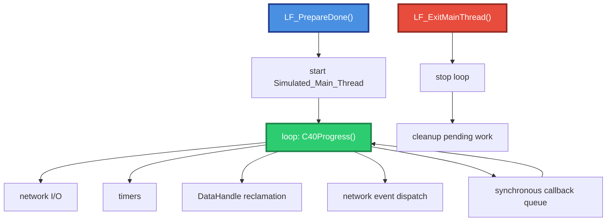
```mermaid
flowchart TB
    PD["LF_PrepareDone()"] --> A["start Simulated_Main_Thread"]
    A --> B["loop: C40Progress()"]
    B --> C["network I/O"]
    B --> D["timers"]
    B --> E["DataHandle reclamation"]
    B --> F["network event dispatch"]
    B --> G["synchronous callback queue"]
    G --> B
    EMT["LF_ExitMainThread()"] --> H["stop loop"]
    H --> I["cleanup pending work"]

    style PD fill:#4A90E2,stroke:#1E3A8A,stroke-width:3px,color:#FFFFFF
    style B fill:#2ECC71,stroke:#1E8449,stroke-width:3px,color:#FFFFFF
    style EMT fill:#E74C3C,stroke:#922B21,stroke-width:3px,color:#FFFFFF
```

**`LF_PrepareDone` returns 1 exactly once per process**:

- First call starts the simulated main thread.
- Second call detects an already-running thread → returns 0 (**not a failure**).
- Re-initialisation requires a prior `LF_Shutdown`.

**Simulated main thread responsibilities**: drives C4 network I/O, processes timers, runs DataHandle reclamation (every 5 s), dispatches network event callbacks, processes the synchronous callback queue.

### 3.2 Why Callbacks Cannot Call `LF_Call`

- Callbacks run on C4 worker threads.
- Workers hold internal locks (used for callback dispatch).
- `LF_Call` needs the simulated main thread to dispatch the response, and the main thread is waiting on the same internal lock.
- **Self-deadlock**.

### 3.3 DataHandle Auto-Reclamation

- `TLF_DataPool.Progress` scans every 5 s.
- Handles idle for 5 min are reclaimed.
- Any `LF_*` access refreshes `Last_Update`.
- **Do not rely on auto-reclamation**; production code should explicitly `LF_FreeData`.

### 3.4 Status Queue

- Capacity 1000; oldest dropped on overflow.
- Depends on the simulated main thread; before `LF_PrepareDone` queries are ineffective.
- `LF_GetStatus` returns a static buffer that is invalidated by the next call — **copy immediately**.

### 3.5 Lifecycle of the Three Invocation Modes

#### 3.5.1 Call (synchronous request-response)

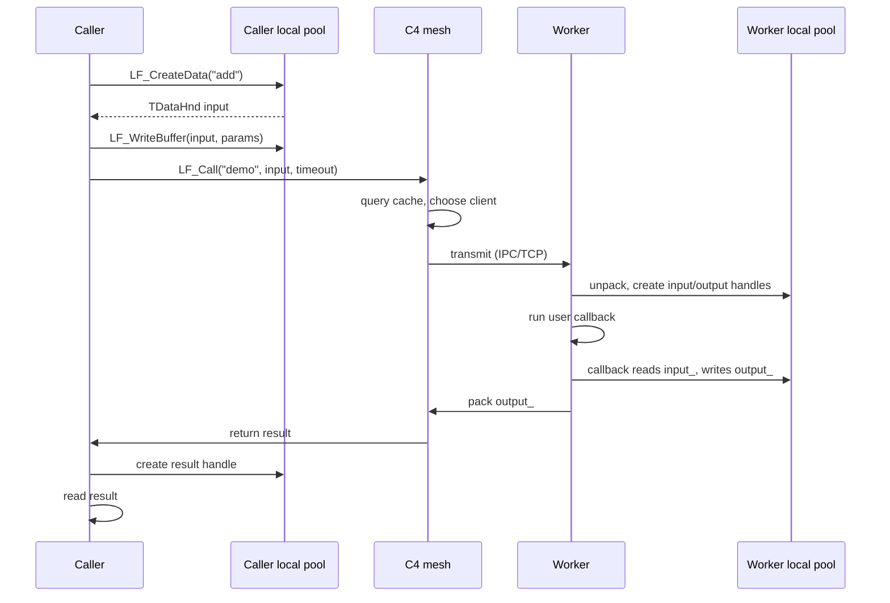
```mermaid
sequenceDiagram
    participant C as Caller
    participant H1 as Caller local pool
    participant MESH as C4 mesh
    participant W as Worker
    participant H2 as Worker local pool

    C->>H1: LF_CreateData("add")
    H1-->>C: TDataHnd input
    C->>H1: LF_WriteBuffer(input, params)
    C->>MESH: LF_Call("demo", input, timeout)
    MESH->>MESH: query cache, choose client
    MESH->>W: transmit (IPC/TCP)
    W->>H2: unpack, create input/output handles
    W->>W: run user callback
    W->>H2: callback reads input_, writes output_
    W->>MESH: pack output_
    MESH->>C: return result
    C->>H1: create result handle
    C->>C: read result
```

**Timeout behaviour**: `LF_Call` timeout returns a **size = 0 handle, not NULL**.

#### 3.5.2 Server-Side Behaviour After Timeout

| Question | Answer |
|---|---|
| Does the server callback continue after client timeout? | ✅ **Yes, runs to completion** (cannot be cancelled) |
| Is the result cached? | ❌ **No** — discarded |
| Does a client retry cause a second execution? | ✅ **Yes** (no idempotency guarantee) |
| How to prevent duplicate execution? | Application-level **idempotency key** (e.g., request ID) |

**Production advice**:

```cpp
// ❌ Dangerous: no idempotency key; retry re-executes
auto resp = lingofuse::tryCall("Payment", param, 1000);
if (!resp) {
    resp = lingofuse::tryCall("Payment", param, 5000);  // may double-charge
}

// ✅ Safe: request carries an idempotency key
param.writeJson({
    {"request_id", generate_uuid()},
    {"amount", 100},
    {"from", "A"},
    {"to", "B"}
});
auto resp = lingofuse::tryCall("Payment", param, 10000);
```

The server callback deduplicates by `request_id`.

#### 3.5.3 Notify (one-way)

- **No ordering guarantee**.
- **No delivery guarantee** (best-effort).
- **No return value**.
- Implemented over `SendCompleteBuffer` with an explicit NULL flush after large payloads.

#### 3.5.4 Sequenced Notify (FIFO one-way)

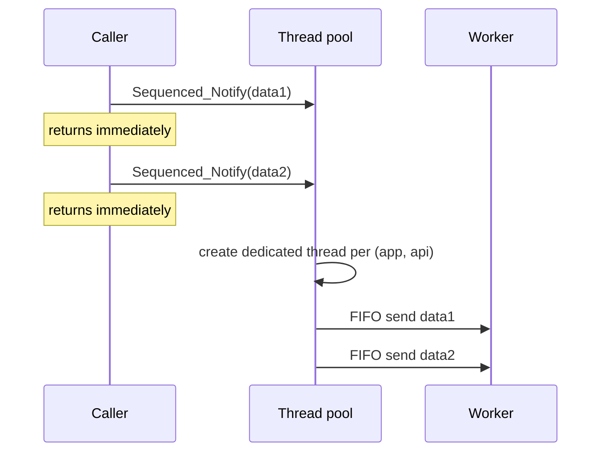
```mermaid
sequenceDiagram
    participant C as Caller
    participant TP as Thread pool
    participant W as Worker

    C->>TP: Sequenced_Notify(data1)
    Note over C: returns immediately
    C->>TP: Sequenced_Notify(data2)
    Note over C: returns immediately
    TP->>TP: create dedicated thread per (app, api)
    TP->>W: FIFO send data1
    TP->>W: FIFO send data2
```

| Property | Note |
|---|---|
| **One thread per (app, api) pair** | No ordering guarantee between pairs |
| **Idle thread terminates after 5 min** | Next call recreates it (startup latency) |
| **Automatic chunking** | Underlying chunked transfer; no manual chunking needed |
| **Fallback threshold** | `Fixed_Sequenced_Time` (default 20 s), after which routing falls back to the newest client |

### 3.6 Callback Thread Pool

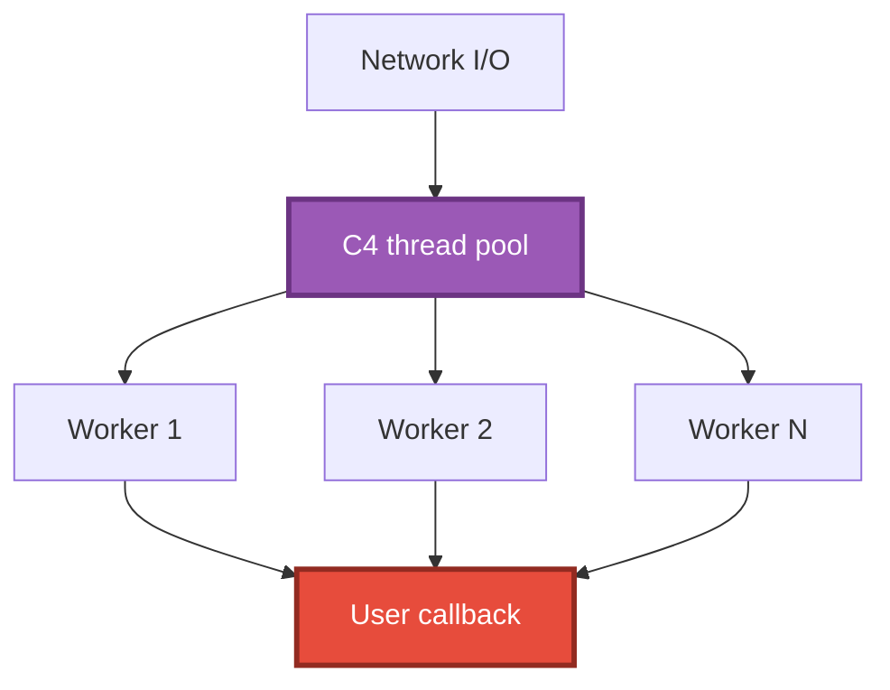
```mermaid
flowchart TB
    NET["Network I/O"] --> POOL["C4 thread pool"]
    POOL --> W1["Worker 1"]
    POOL --> W2["Worker 2"]
    POOL --> W3["Worker N"]
    W1 --> CB["User callback"]
    W2 --> CB
    W3 --> CB

    style POOL fill:#9B59B6,stroke:#6C3483,stroke-width:3px,color:#FFFFFF
    style CB fill:#E74C3C,stroke:#922B21,stroke-width:3px,color:#FFFFFF
```

**Thread contract**:

- Callbacks run on **background worker threads** — not the caller's thread, not the main thread.
- **Never block**: one blocked worker removes a thread from the pool.
- **Never call `LF_Call`**: see §3.2.
- **Never touch UI**: VCL/LCL/Qt controls are not thread-safe.
- **`trigger`**: the user pointer passed at registration, returned unchanged.

### 3.7 Network Event Trigger Chain

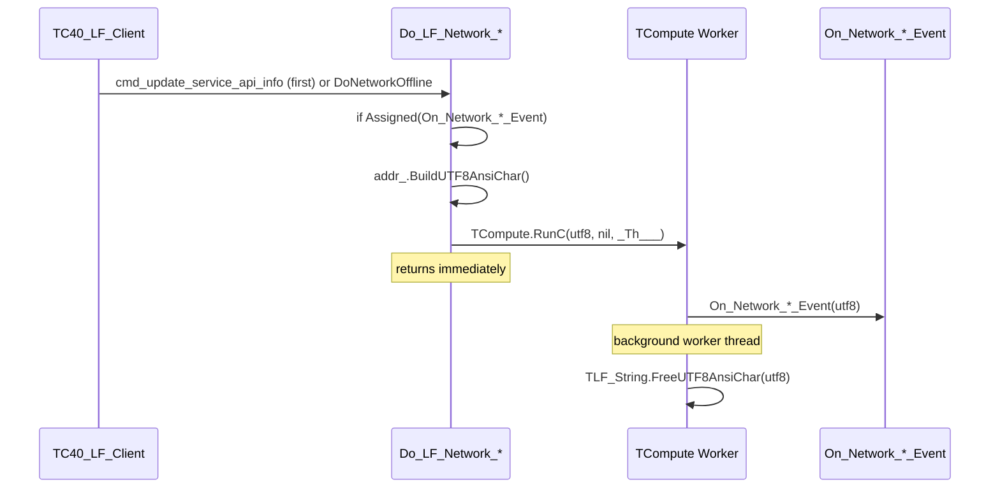
```mermaid
sequenceDiagram
    participant Client as TC40_LF_Client
    participant Trigger as Do_LF_Network_*
    participant Compute as TCompute Worker
    participant User as On_Network_*_Event

    Client->>Trigger: cmd_update_service_api_info (first) or DoNetworkOffline
    Trigger->>Trigger: if Assigned(On_Network_*_Event)
    Trigger->>Trigger: addr_.BuildUTF8AnsiChar()
    Trigger->>Compute: TCompute.RunC(utf8, nil, _Th___)
    Note over Trigger: returns immediately
    Compute->>User: On_Network_*_Event(utf8)
    Note over Compute: background worker thread
    Compute->>Compute: TLF_String.FreeUTF8AnsiChar(utf8)
```

| Item | Connect | Disconnect |
|---|---|---|
| **Trigger point** | First `cmd_update_service_api_info` received | `DoNetworkOffline` (physical link loss) |
| **Semantics** | **Not TCP handshake** — "service is available" | Physical link down |
| **Fire count** | Once per connection lifecycle | Once per physical loss |
| **After reconnect** | **Fires again** | **Not again** |
| **Thread** | Background TCompute worker | Background TCompute worker |
| **`addr_` lifetime** | Freed immediately after callback returns | Same |
| **Exceptions** | Swallowed by `try...except` | Same |

---

## Chapter 4 — The C ABI Layer

### 4.1 Handle Types

```c
typedef void* TDataHnd;   // data handle: binary buffer + API name
typedef void* TAppHnd;    // app handle: container for APIs
```

**Do not dereference.** Operate only through `LF_*` functions. The two handle kinds are not interchangeable.

### 4.2 Callback Types

```c
typedef void (LF_CDECL* LF_CallFunc)(void* trigger, void* input, void* output);
typedef void (LF_CDECL* LF_NotifyFunc)(void* trigger, void* input);
typedef void (LF_CDECL* LF_NetworkEventFunc)(const char* addr);
```

| Type | Mode | Parameters | Thread |
|---|---|---|---|
| `LF_CallFunc` | Call | `trigger`, read-only `input`, writable `output` | background worker |
| `LF_NotifyFunc` | Notify | `trigger`, read-only `input` | background worker |
| `LF_NetworkEventFunc` | Network event | `addr` (valid only during the callback) | background worker |

### 4.3 The 36 Exported Functions

#### 4.3.1 Data Handles (9)

```c
TDataHnd LF_CreateData(const char* method_name);
void     LF_FreeData(TDataHnd hnd);
void*    LF_GetBuffer(TDataHnd hnd);
int64_t  LF_WriteBuffer(TDataHnd hnd, const void* buff, int64_t size);
int64_t  LF_ReadBuffer(TDataHnd hnd, void* buff, int64_t size);
int64_t  LF_GetPos(TDataHnd hnd);
void     LF_SetPos(TDataHnd hnd, int64_t pos);
int64_t  LF_GetSize(TDataHnd hnd);
void     LF_SetSize(TDataHnd hnd, int64_t size);
```

| Function | Contract |
|---|---|
| `LF_CreateData` | Creates an input handle bound to an API name. `method_name` must be UTF-8 + NUL. Must be freed with `LF_FreeData`. |
| `LF_FreeData` | Releases the handle. `NULL` is ignored. |
| `LF_GetBuffer` | Returns a pointer to the internal buffer. Returns `NULL` if the handle is empty. The pointer may be invalidated by `WriteBuffer` / `SetSize`. |
| `LF_WriteBuffer` | Writes `size` bytes at the current position; auto-grows; advances the cursor. Returns actual bytes written. |
| `LF_ReadBuffer` | Reads up to `size` bytes at the current position; advances the cursor. Returns actual bytes read. |
| `LF_GetPos` | Current cursor. |
| `LF_SetPos` | Sets the cursor. Passing a position beyond the size implicitly grows the buffer. |
| `LF_GetSize` | Total buffer size. |
| `LF_SetSize` | Resizes the buffer. Newly added space is uninitialised. |

#### 4.3.2 Application Handles (5)

```c
TAppHnd     LF_CreateApp(const char* app_name, const char* desc);
void        LF_FreeApp(TAppHnd app_hnd);
const char* LF_Generate_AppName(void);
const char* LF_Get_AppName(TAppHnd app_hnd);
int         LF_BindApp(TAppHnd app_hnd);
```

| Function | Contract |
|---|---|
| `LF_CreateApp` | `app_name` required UTF-8; `desc` may be `NULL` (treated as empty). |
| `LF_FreeApp` | **Stage one of two-stage destruction**: unbinds all clients, stops sequenced threads, removes timers. The object stays in the global pool until `LF_Shutdown`. The handle becomes invalid. |
| `LF_Generate_AppName` | Must be called after `LF_PrepareDone` returns 1. Returned pointer is valid for **~5 s** — copy immediately. |
| `LF_Get_AppName` | Same 5-second rule; copy immediately. |
| `LF_BindApp` | Binds the App to all currently idle clients (`Cli.app == NULL`). Returns the count bound. Returns 0 when the main thread isn't running or all clients are occupied. |

#### 4.3.3 API Registration (3)

```c
int LF_RegisterCall(TAppHnd, const char*, const char*, void*, LF_CallFunc);
int LF_RegisterNotify(TAppHnd, const char*, const char*, void*, LF_NotifyFunc);
int LF_Unregister(TAppHnd, const char*);
```

| Function | Return | Contract |
|---|---|---|
| `LF_RegisterCall` | 1 success / 0 failure | Fails on duplicate name. `desc` may be `NULL`. |
| `LF_RegisterNotify` | 1 / 0 | Same. |
| `LF_Unregister` | 1 found-and-removed / 0 not-found | Local effect immediate; broadcast ~3 s. |

#### 4.3.4 Local Execution (2)

```c
TDataHnd LF_LocalCall(TAppHnd app_hnd, TDataHnd param);
void     LF_LocalNotify(TAppHnd app_hnd, TDataHnd param);
```

- Bypasses the network; runs in-process.
- `param` is not freed; the caller owns it.
- `LF_LocalCall` returns a new result handle; the caller must `LF_FreeData`.

#### 4.3.5 Network Preparation (5)

```c
void LF_ResetPrepare(void);
int  LF_PrepareService(const char* listening_addr, const char* physics_addr);
int  LF_PrepareClient(const char* physics_addr, TAppHnd app_hnd);
int  LF_PrepareDone(void);
void LF_ExitMainThread(void);
```

| Function | Contract |
|---|---|
| `LF_ResetPrepare` | Clears the preparation queue. Running services/clients are unaffected. |
| `LF_PrepareService` | Prepares or immediately creates a C4 service. Returns a tag; returns -1 for a duplicate address. |
| `LF_PrepareClient` | Prepares or immediately creates a client. By default only one client per address; duplicate returns -1 unless `Overlap_Connection=True`. |
| `LF_PrepareDone` | Starts the framework. **Returns 1 only once per process.** 0 is not necessarily a failure. |
| `LF_ExitMainThread` | Requests the simulated main thread to exit. Does not release everything; call `LF_Shutdown` too. |

#### 4.3.6 Remote Invocation (3)

```c
TDataHnd LF_Call(const char* app_name, TDataHnd param, uint64_t timeout_ms);
void     LF_Notify(const char* app_name, TDataHnd param);
void     LF_Sequenced_Notify(const char* app_name, TDataHnd param);
```

| Function | Contract |
|---|---|
| `LF_Call` | Synchronous request-response. Timeout/failure returns a **size=0 handle, not NULL**. Must be freed with `LF_FreeData`. |
| `LF_Notify` | One-way notification; no ordering or delivery guarantee. |
| `LF_Sequenced_Notify` | FIFO per `(app, api)`. Per-pair dedicated thread; idle thread terminates after 5 min. |

#### 4.3.7 Options and Diagnostics (7)

```c
void        LF_SetOption(const char* option, const char* value);
int         LF_GetStatusCount(void);
const char* LF_GetStatus(void);
void        LF_PostStatus(const char* status);
int         LF_CheckMainThread(void);
int         LF_CheckApp(const char* app_name);
int         LF_CheckApi(const char* app_name, const char* api_name);
```

- Unknown options are silently ignored.
- Status queue capacity 1000; depends on the simulated main thread.
- `LF_GetStatus` returns a static buffer that is invalidated by the next call.
- `LF_CheckApp` / `LF_CheckApi` rely on local cache; broadcast delay ~3 s.

#### 4.3.8 Shutdown (1)

```c
void LF_Shutdown(void);
```

Clears network event callbacks → stops sequenced threads → frees remaining data handles → exits the simulated main thread → clears the global App pool → unloads the IPC library. Safe to call multiple times.

#### 4.3.9 Network Events (1)

```c
void LF_Set_Network_Event(LF_NetworkEventFunc on_connect,
                          LF_NetworkEventFunc on_disconnect);
```

- Process-global; no per-client registration.
- Connect: first service-API-info broadcast, not TCP handshake.
- Disconnect: physical link loss.
- Callbacks run on background workers; `addr` is freed immediately after the callback.
- `NULL` disables the corresponding event.
- `LF_Shutdown` clears both automatically.

### 4.4 C Wrapper Helpers (not exported from the DLL)

```c
void*   LF_GetBufferOffset(TDataHnd hnd, int64_t offset);

int LF_WriteInt8(TDataHnd, int8_t);
int LF_WriteUInt8(TDataHnd, uint8_t);
int LF_WriteInt16(TDataHnd, int16_t);
int LF_WriteUInt16(TDataHnd, uint16_t);
int LF_WriteInt32(TDataHnd, int32_t);
int LF_WriteUInt32(TDataHnd, uint32_t);
int LF_WriteInt64(TDataHnd, int64_t);
int LF_WriteUInt64(TDataHnd, uint64_t);
int LF_WriteSingle(TDataHnd, float);
int LF_WriteDouble(TDataHnd, double);
int LF_WriteString(TDataHnd, const char* value);
int LF_WriteStringBytes(TDataHnd, const void* data, int64_t length);

int LF_ReadInt8(TDataHnd, int8_t* out);
int LF_ReadUInt8(TDataHnd, uint8_t* out);
int LF_ReadInt16(TDataHnd, int16_t* out);
int LF_ReadUInt16(TDataHnd, uint16_t* out);
int LF_ReadInt32(TDataHnd, int32_t* out);
int LF_ReadUInt32(TDataHnd, uint32_t* out);
int LF_ReadInt64(TDataHnd, int64_t* out);
int LF_ReadUInt64(TDataHnd, uint64_t* out);
int LF_ReadSingle(TDataHnd, float* out);
int LF_ReadDouble(TDataHnd, double* out);
int LF_ReadString(TDataHnd, char* buf, size_t buf_size);
int64_t LF_ReadStringBytes(TDataHnd, void* buf, int64_t buf_size);
```

**Little-endian**: all integer helpers use little-endian.

**`LF_WriteString`**: always appends a `#0`. `NULL` returns 0 without writing.

**`LF_WriteStringBytes`**: writes `length` bytes then appends a `#0`. Embedded `#0` bytes are preserved.

**`LF_ReadString` tri-state**:

| Case | Behaviour |
|---|---|
| `#0` found | Copies bytes before the `#0`; cursor → `#0 + 1`. |
| No `#0` | Copies all remaining bytes; cursor → `size + 1`. Underlying library grows the buffer by one byte. |
| Cursor ≥ size | Returns 0; `buf` set empty; cursor unchanged. |
| `buf` too small | Returns 0; cursor unchanged. |

**`LF_ReadStringBytes`**:

| Case | Return |
|---|---|
| `#0` found | Number of bytes copied (≥ 0); cursor → `#0 + 1`. |
| No `#0` | Copies all remaining; cursor → `size + 1`; returns byte count. |
| Cursor ≥ size | -1; cursor unchanged. |
| Destination too small | -1; cursor unchanged. |

### 4.5 Thread Safety

- All exported functions are thread-safe.
- Writes on the same `TDataHnd` must be serialised by the caller; reads are safe.
- Different `TDataHnd` instances are independent.
- `LF_LoadLibrary` / `LF_FreeLibrary` are **not** thread-safe with each other.

---

## Chapter 5 — Unified I/O (`lf_io.hpp`)

### 5.1 Role

`lingofuse::io` is the **only** payload-touching layer in the C++ toolchain that calls `LF_WriteBuffer` / `LF_ReadBuffer`. All string and JSON I/O must go through it.

**Why**: manually calling `LF_WriteBuffer` easily misses the `#0` frame, mis-orders bytes, or corrupts UTF-8. `lf_io` centralises all of these.

### 5.2 Error Type

```cpp
class LfIoError : public std::runtime_error;
```

### 5.3 JSON Serialisation Policy

```cpp
inline std::string dumps_json(const nlohmann::json& obj) {
    return obj.dump(
        -1,
        ' ',
        false,
        nlohmann::json::error_handler_t::replace
    );
}
```

| Argument | Effect |
|---|---|
| `-1` | Compact, no indentation, no newlines |
| `false` | `ensure_ascii=false`; non-ASCII stays literal UTF-8 |
| `replace` | Invalid UTF-8 replaced with U+FFFD, no exception |

`loads_json` parses strictly and throws `LfIoError` on failure.

### 5.4 Write Functions

```cpp
void write_string(TDataHnd hnd, std::string_view value);
void write_string_bytes(TDataHnd hnd, const void* data, std::size_t len);
void write_string_bytes(TDataHnd hnd, const std::vector<std::uint8_t>& data);
void write_json(TDataHnd hnd, const nlohmann::json& obj);
```

- `write_string`: writes UTF-8 bytes + `#0`. An empty string writes one `#0`.
- `write_string_bytes`: writes raw bytes + `#0`. Embedded `#0` bytes are preserved.
- `write_json`: `dumps_json` then `write_string`.

### 5.5 Read Functions

```cpp
std::string read_string(TDataHnd hnd);
std::vector<std::uint8_t> read_string_bytes(TDataHnd hnd);
std::vector<std::uint8_t> peek_string_bytes(TDataHnd hnd);
std::vector<std::uint8_t> read_all_bytes(TDataHnd hnd);
nlohmann::json read_json(TDataHnd hnd);
JsonOrBytes read_json_or_bytes(TDataHnd hnd);
```

**Tri-state read semantics**:

| Scenario | `read_string` / `read_string_bytes` / `read_json` |
|---|---|
| `#0` found | Return content before `#0`; cursor → `#0 + 1` |
| No `#0` | Return all remaining; cursor → `size + 1` |
| Cursor ≥ size | Return empty; cursor unchanged |

- `peek_string_bytes`: reads without advancing the cursor.
- `read_all_bytes`: no NUL handling; reads all remaining; cursor → end.
- `read_json`: empty payload → null JSON; invalid JSON throws `LfIoError`.
- `read_json_or_bytes`: empty → `monostate`; valid JSON → `json`; otherwise raw bytes.

### 5.6 `JsonOrBytes`

```cpp
using JsonOrBytes = std::variant<
    std::monostate,
    nlohmann::json,
    std::vector<std::uint8_t>
>;
```

Used for MCP bridges, LLM proxies, and any scenario requiring forwarding of non-JSON responses.

### 5.7 `cstr`

```cpp
inline std::string cstr(std::string_view value);
```

Returns a NUL-terminated `std::string` for LF_* c_char_p parameters.

### 5.8 Thread Safety

All helpers are stateless. Concurrent writes on the same `TDataHnd` still require external serialisation.

---

## Chapter 6 — RAII Layer (`LingoFuse.hpp`)

### 6.1 `Error` / `ErrorCode`

```cpp
enum class ErrorCode {
    Generic = 0,
    LibraryLoadFailed,
    NullHandle,
    InvalidArgument,
    WriteFailed,
    ReadFailed,
    CallFailed,
    RegistrationFailed,
    NotConnected,
    Timeout,
};

class Error : public std::runtime_error {
public:
    Error(ErrorCode c, const std::string& what);
    ErrorCode code() const noexcept;
};
```

### 6.2 `LibraryLoader`

- Reference-counted RAII.
- When multiple `LibraryLoader` instances coexist, `LF_LoadLibrary` is called once; `LF_FreeLibrary` on the last destruction.
- Internally `weak_ptr` + `shared_ptr` with sentinel pointer `reinterpret_cast<void*>(1)` (never dereferenced).
- Throws `Error(LibraryLoadFailed)` on construction failure.

**Why a sentinel**: `std::shared_ptr` needs a non-null pointer and a custom deleter. Since the library base address is unavailable, `1` is used as an un-dereferenced token.

**Deployment reminder**: `LibraryLoader` performs both `LF_LoadLibrary` and `LF_FreeLibrary`; see §0.7 for the ordering contract.

### 6.3 `DataHandle`

```cpp
class DataHandle {
public:
    explicit DataHandle(const std::string& api_name);
    explicit DataHandle(TDataHnd h, bool owned) noexcept;
    ~DataHandle();

    DataHandle(DataHandle&&) noexcept;
    DataHandle& operator=(DataHandle&&) noexcept;
    DataHandle(const DataHandle&) = delete;
    DataHandle& operator=(const DataHandle&) = delete;

    TDataHnd get() const noexcept;
    explicit operator bool() const noexcept;
    TDataHnd release() noexcept;
    void reset() noexcept;

    template <typename T> void write(T value);
    template <typename T> bool read(T& out);

    void writeRaw(const void* data, std::size_t len);
    std::size_t readRaw(void* data, std::size_t len);

    void write(const std::string& s);
    void write(const std::vector<std::uint8_t>& v);
    void writeJson(const nlohmann::json& obj);
    std::string readString();
    bool read(std::string& out);
    std::vector<std::uint8_t> readBytes();
    nlohmann::json readJson();

    void seek(std::int64_t pos);
    std::int64_t tell() const;
    std::int64_t size() const;
    const std::uint8_t* data() const;
};
```

**Template constraint**: `write<T>` / `read<T>` accept only `std::is_arithmetic` non-`bool`. The `bool` wire format is undefined.

**Delegation**:

| Method | Delegates to |
|---|---|
| `write(std::string)` | `io::write_string` |
| `write(vector<uint8_t>)` | `io::write_string_bytes` |
| `writeJson` | `io::write_json` |
| `readString` | `io::read_string` |
| `read(std::string&)` | First checks `start < total`, then `io::read_string` |
| `readBytes` | `io::read_string_bytes` |
| `readJson` | `io::read_json`; on failure returns null JSON |

**Errors**:

- `write` family throws `Error(WriteFailed)` on failure.
- `readJson` does not throw; failure returns null JSON.
- `readString` returns empty on failure.

### 6.4 `App`

```cpp
class App {
public:
    explicit App(const std::string& name, const std::string& desc = "");
    ~App();

    App(App&&) noexcept;
    App& operator=(App&&) noexcept;
    App(const App&) = delete;
    App& operator=(const App&) = delete;

    TAppHnd get() const noexcept;
    explicit operator bool() const noexcept;
    const std::string& name() const noexcept;

    bool registerCall(const std::string& api_name,
                      const std::string& desc,
                      void* trigger,
                      LF_CallFunc on_call);
    bool registerNotify(const std::string& api_name,
                        const std::string& desc,
                        void* trigger,
                        LF_NotifyFunc on_notify);
    bool unregister(const std::string& api_name);

    DataHandle localCall(const DataHandle& param) const;
    void localNotify(const DataHandle& param) const;

    int bind();
};
```

- Destructor calls `LF_FreeApp`; the object is unbound but not destroyed.
- `bind()` returns the bound count; 0 means no idle client or main thread not running.

**Lifecycle**:

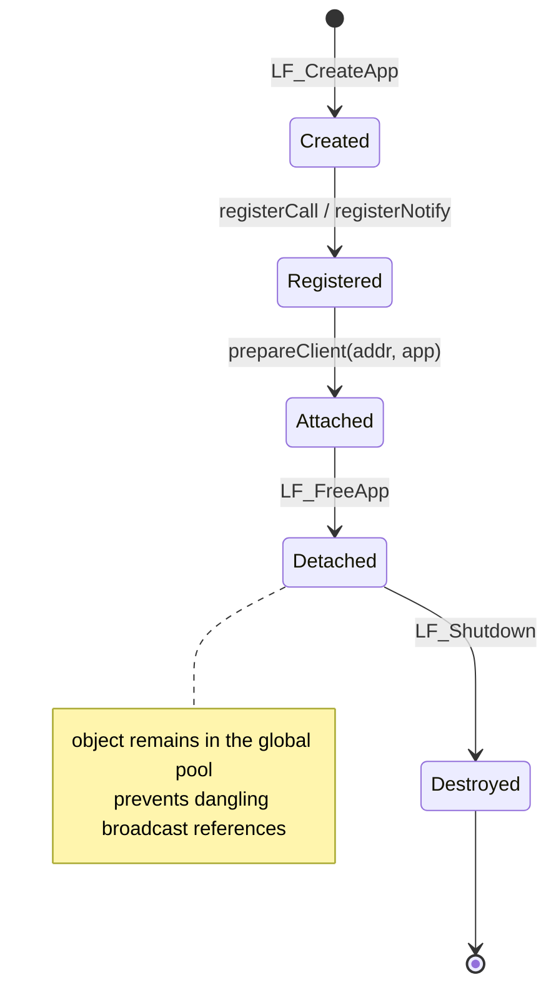
```mermaid
stateDiagram-v2
    [*] --> Created: LF_CreateApp
    Created --> Registered: registerCall / registerNotify
    Registered --> Attached: prepareClient(addr, app)
    Attached --> Detached: LF_FreeApp
    Detached --> Destroyed: LF_Shutdown
    Destroyed --> [*]

    note right of Detached
        object remains in the global pool
        prevents dangling broadcast references
    end note
```

### 6.5 `NetworkEventListener`

```cpp
class NetworkEventListener {
public:
    virtual ~NetworkEventListener() = default;
    virtual void onConnect(const std::string& addr) {}
    virtual void onDisconnect(const std::string& addr) {}
};
```

Installed via `setNetworkEvent(std::shared_ptr<NetworkEventListener>)`; the framework keeps the `shared_ptr` alive.

### 6.6 Global Functions

```cpp
void resetPrepare();
int  prepareService(const std::string& listening_addr,
                    const std::string& physics_addr);
int  prepareClient(const std::string& physics_addr, TAppHnd app = nullptr);
int  prepareDone();
void exitMainThread();

DataHandle call(const std::string& app_name,
                const DataHandle& param,
                std::uint64_t timeout_ms);
std::optional<DataHandle> tryCall(const std::string& app_name,
                                  const DataHandle& param,
                                  std::uint64_t timeout_ms);
void notify(const std::string& app_name, const DataHandle& param);
void sequencedNotify(const std::string& app_name, const DataHandle& param);

void setOption(const std::string& option, const std::string& value);
bool checkMainThread();
bool checkApp(const std::string& app_name);
bool checkApi(const std::string& app_name, const std::string& api_name);

int statusCount();
std::string popStatus();
void postStatus(const std::string& msg);

std::string generateAppName();
std::string getAppName(TAppHnd app);

void shutdown();

void setNetworkEvent(detail::ConnectHandler on_connect,
                     detail::DisconnectHandler on_disconnect);
void setNetworkEvent(std::shared_ptr<NetworkEventListener> listener);
void clearNetworkEvent();
```

| Function | Contract |
|---|---|
| `call` | Returns `DataHandle`; timeout size=0. |
| `tryCall` | Timeout/empty → `nullopt`. **Recommended.** |
| `prepareDone` | Returns 1 only once per process. |
| `generateAppName` | Must be called after `prepareDone`. Copies the 5-second pointer internally. |
| `setNetworkEvent` | Replaces globally; `clearNetworkEvent` uninstalls. |
| `shutdown` | Full shutdown; idempotent. |

### 6.7 `call` vs `tryCall`

| Scenario | `call` | `tryCall` |
|---|---|---|
| Normal return | `DataHandle` (size > 0) | `optional<DataHandle>` engaged |
| Timeout | `DataHandle` (size == 0) | `nullopt` |
| Target missing | `DataHandle` (size == 0) | `nullopt` |
| Use case | Need to distinguish timeout vs empty result | Only need yes/no |

**Recommendation**: almost always use `tryCall`.

### 6.8 Error Mapping

| Call path | Exception |
|---|---|
| `DataHandle::writeJson` | `Error(WriteFailed)` |
| `DataHandle::write(string)` | `Error(WriteFailed)` |
| `DataHandle::write<T>` | `Error(NullHandle/WriteFailed)` |
| `DataHandle::readJson` | No throw; returns null JSON |
| `io::write_json(TDataHnd, ...)` | `io::LfIoError` |
| `io::read_json(TDataHnd)` | `io::LfIoError` |
| `lingofuse::call` | No throw; returns size=0 |
| `LibraryLoader` construct failure | `Error(LibraryLoadFailed)` |

---

## Chapter 7 — Callback Contract

### 7.1 Input / Output Direction Constraint

**This is the most easily overlooked and most easily broken contract**:

| Parameter | Direction | Allowed | Forbidden |
|---|---|---|---|
| `input` | **read-only** | `readJson` / `readString` / `readBytes` / `readAllBytes` / `read<T>` | `write*` / seek to a write position |
| `output` | **write-only** | `writeJson` / `writeString` / `writeBytes` / `write<T>` | `read*` |
| `trigger` | read-only | Cast and use | Modify |

**Writing to `input` or reading from `output` is undefined behaviour.** The C ABI does not prevent it, but it corrupts the buffer state.

### 7.2 `output` Construction Semantics

**Writing to `output` means "return a result"**. After `LF_WriteBuffer` into `output`, the framework marshals the `output` bytes back to the caller.

**Empty `output`**: if the callback writes nothing, the caller receives a size=0 handle.

### 7.3 Typical Uses of `trigger`

`trigger` is the user pointer passed at registration, returned unchanged at callback time. Typical uses:

**Use case A — context object**:

```cpp
struct CallContext {
    std::string prefix;
    std::atomic<int> count;
};

static void LF_CDECL ctx_cb(void* trigger, void* in, void* out) {
    auto* ctx = static_cast<CallContext*>(trigger);
    ctx->count.fetch_add(1);

    auto req = lingofuse::io::read_json(static_cast<TDataHnd>(in));
    lingofuse::io::write_json(static_cast<TDataHnd>(out),
                              {{"prefix", ctx->prefix},
                               {"echo", req}});
}

int main() {
    CallContext ctx{"[calc] ", 0};
    app.registerCall("echo", "echo with prefix", &ctx, ctx_cb);
    // ...
}
```

**Use case B — `this` pointer**:

```cpp
class MyService {
public:
    void handle(void* in, void* out) {
        // use this->member_...
    }
};

static void LF_CDECL method_cb(void* trigger, void* in, void* out) {
    auto* self = static_cast<MyService*>(trigger);
    self->handle(in, out);
}

// Registration
MyService svc;
app.registerCall("api", "desc", &svc, method_cb);
```

**Use case C — `nullptr` (no context)**:

```cpp
app.registerCall("api", "desc", nullptr, simple_cb);
```

### 7.4 Chunked Read/Write Pattern

**Chunked input read**:

```cpp
static void LF_CDECL chunked_read_cb(void*, void* in, void* out) {
    TDataHnd h = static_cast<TDataHnd>(in);
    const int64_t total = LF_GetSize(h);

    std::vector<uint8_t> buf;
    buf.reserve(static_cast<size_t>(total));
    while (LF_GetPos(h) < total) {
        uint8_t chunk[4096];
        int64_t got = LF_ReadBuffer(h, chunk, sizeof(chunk));
        if (got <= 0) break;
        buf.insert(buf.end(), chunk, chunk + got);
    }
    // ...process buf...
}
```

**Chunked output write**:

```cpp
static void LF_CDECL chunked_write_cb(void*, void* in, void* out) {
    TDataHnd h = static_cast<TDataHnd>(out);
    for (int i = 0; i < 1000; ++i) {
        std::string line = "line " + std::to_string(i) + "\n";
        LF_WriteBuffer(h, line.data(), line.size());
    }
}
```

### 7.5 No "Synchronous Callbacks" in C++

**Pascal has `LF_RegisterSyncCall_M`** (callbacks marshalled to the main thread).

**The C++ layer has no equivalent.** Callbacks registered with `LF_RegisterCall` **always** run on background worker threads.

**If main-thread execution is required**:

```cpp
static void LF_CDECL worker_cb(void*, void* in, void* out) {
    // On a background thread
    auto data = lingofuse::io::read_json(static_cast<TDataHnd>(in));

    // Marshal to the main thread
    post_to_main_thread([data]() {
        // Now on the main thread; UI access is allowed here
    });

    // Return immediately
}
```

### 7.6 Calling a Callback from a Callback

**Allowed**: callback A can call another **local** callback via `LF_LocalCall` or `LF_LocalNotify` (not `LF_Call`).

```cpp
static void LF_CDECL outer_cb(void*, void* in, void* out) {
    // Local call to another API (no network hop)
    // Requires the App handle, typically passed via trigger
    // LF_LocalCall(app_hnd, in);  // ✅
    // LF_Call("other", in, 1000); // ❌ deadlock
}
```

**Forbidden**: calling `LF_Call` / `LF_Notify` / `LF_Sequenced_Notify` inside a callback (deadlock).

### 7.7 Exception Isolation in Callbacks

**C++ exceptions must not cross the C stack.** Callbacks must try/catch internally:

```cpp
static void LF_CDECL safe_cb(void*, void* in, void* out) {
    try {
        auto j = lingofuse::io::read_json(static_cast<TDataHnd>(in));
        // ...business logic...
        lingofuse::io::write_json(static_cast<TDataHnd>(out), result);
    }
    catch (const std::exception& e) {
        std::cerr << "Callback error: " << e.what() << "\n";
        try {
            lingofuse::io::write_json(
                static_cast<TDataHnd>(out),
                {{"error", std::string(e.what())}});
        }
        catch (...) {
            // Even the error response failed; nothing more we can do
        }
    }
    catch (...) {
        std::cerr << "Callback error: unknown\n";
    }
}
```

### 7.8 Callback Registration Thread Safety

- `registerCall` / `registerNotify` **should be called before `prepareClient`**.
- If called after `prepareClient`, a re-broadcast of `Init_App_Info` is needed (the framework does this automatically).
- Runtime `unregister` is safe, but propagation delay is ~3 s.

---

## Chapter 8 — Cross-Language Wire Format

### 8.1 The NUL Contract

| Function | Appends `#0`? |
|---|---|
| `LF_WriteString` / `write_string` / `write_json` | ✅ |
| `LF_WriteStringBytes` / `write_string_bytes` | ✅ |
| `LF_WriteBuffer` / `writeRaw` | ❌ |
| `LF_ReadString` / `read_string` / `read_json` | Stops at `#0`; if no `#0` reads all remaining |
| `LF_ReadStringBytes` / `read_string_bytes` | Same |
| `LF_ReadBuffer` / `readRaw` | No `#0` detection |

### 8.2 Tri-State Read

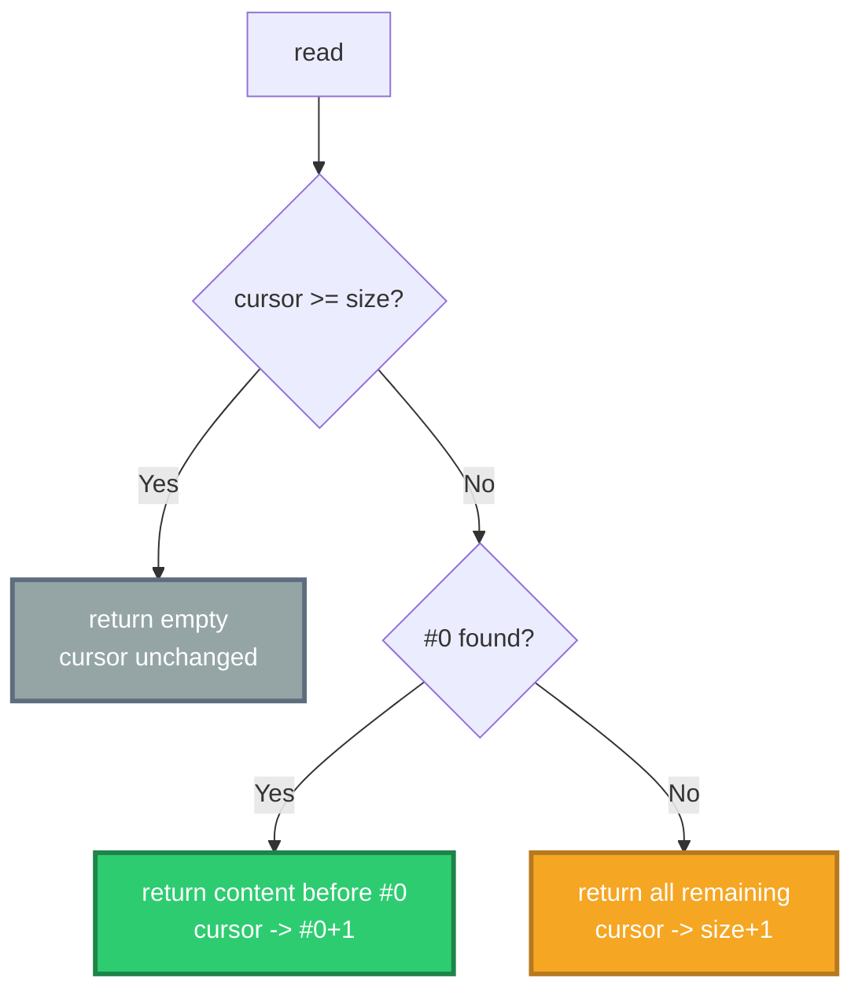
```mermaid
flowchart TD
    A["read"] --> B{"cursor >= size?"}
    B -- Yes --> C["return empty<br/>cursor unchanged"]
    B -- No --> D{"#0 found?"}
    D -- Yes --> E["return content before #0<br/>cursor -> #0+1"]
    D -- No --> F["return all remaining<br/>cursor -> size+1"]

    style C fill:#95A5A6,stroke:#5D6D7E,stroke-width:3px,color:#FFFFFF
    style E fill:#2ECC71,stroke:#1E8449,stroke-width:3px,color:#FFFFFF
    style F fill:#F5A623,stroke:#B7791F,stroke-width:3px,color:#FFFFFF
```

The meaning of `size+1`: the underlying library implicitly grows the buffer by one byte to accommodate the new position — identical to Pascal's `LF_SetPos(Hnd, e + 1)`.

### 8.3 UTF-8 Mandatory

All string parameters must be UTF-8 + NUL. The C++ side passes bytes through `std::string` without transcoding.

### 8.4 Little-Endian

All integer helpers use little-endian. Most platforms today are little-endian; big-endian requires explicit conversion.

### 8.5 JSON Not Escaped

`dumps_json` uses `ensure_ascii=false`; CJK and emoji stay literal UTF-8. The bridge repair engine applies the same rule.

### 8.6 Three-Way Symmetry Table

| Producer | `{"a":1}` bytes |
|---|---|
| Pascal `LF_WriteString` | `7B 22 61 22 3A 31 7D 00` |
| Python `lf_io.write_json` | same |
| C++ `io::write_json` | same |

### 8.7 Byte-Level Example

**`{"name":"张三","age":30}`**:

```
7B 22 6E 61 6D 65 22 3A 22 E5 BC A0 E4 B8 89 22 2C 22 61 67 65 22 3A 33 30 7D 00
```

**Breakdown**:

- `7B` = `{`
- `22 6E 61 6D 65 22` = `"name"`
- `E5 BC A0 E4 B8 89` = `张三` (three UTF-8 bytes + three UTF-8 bytes)
- `7D` = `}`
- `00` = NUL

### 8.8 Wire Format with HTTP Bridge

The bridge follows the same NUL contract:

- Pascal → Bridge: `LF_WriteString` appends `#0`.
- Bridge → HTTP: strips `#0` before forwarding.
- HTTP → Bridge: HTTP body has no `#0`.
- Bridge → Pascal: reads all remaining, or appends `#0`.

---

## Chapter 9 — Full Call Chain and Lifecycle

### 9.1 Complete Client-to-Server Path

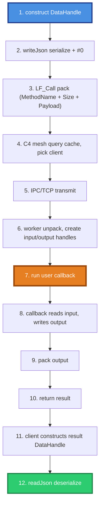
```mermaid
flowchart TB
    S1["1. construct DataHandle"] --> S2["2. writeJson serialize + #0"]
    S2 --> S3["3. LF_Call pack (MethodName + Size + Payload)"]
    S3 --> S4["4. C4 mesh query cache, pick client"]
    S4 --> S5["5. IPC/TCP transmit"]
    S5 --> S6["6. worker unpack, create input/output handles"]
    S6 --> S7["7. run user callback"]
    S7 --> S8["8. callback reads input, writes output"]
    S8 --> S9["9. pack output"]
    S9 --> S10["10. return result"]
    S10 --> S11["11. client constructs result DataHandle"]
    S11 --> S12["12. readJson deserialize"]

    style S1 fill:#4A90E2,stroke:#1E3A8A,stroke-width:3px,color:#FFFFFF
    style S7 fill:#E67E22,stroke:#9C4A0C,stroke-width:4px,color:#FFFFFF
    style S12 fill:#2ECC71,stroke:#1E8449,stroke-width:3px,color:#FFFFFF
```

### 9.2 Handle Lifecycle Sequence

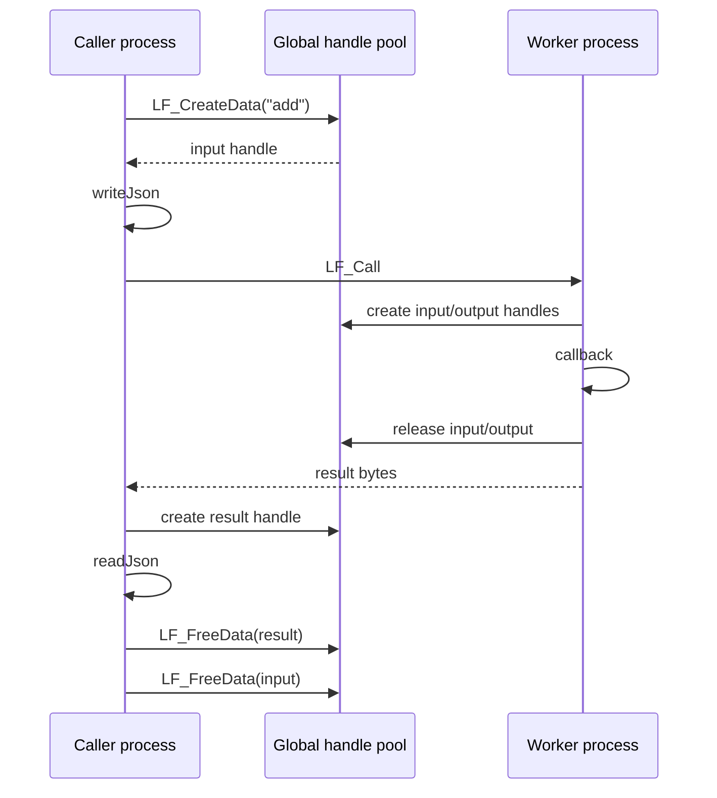
```mermaid
sequenceDiagram
    participant Caller as Caller process
    participant Pool as Global handle pool
    participant Worker as Worker process

    Caller->>Pool: LF_CreateData("add")
    Pool-->>Caller: input handle
    Caller->>Caller: writeJson
    Caller->>Worker: LF_Call
    Worker->>Pool: create input/output handles
    Worker->>Worker: callback
    Worker->>Pool: release input/output
    Worker-->>Caller: result bytes
    Caller->>Pool: create result handle
    Caller->>Caller: readJson
    Caller->>Pool: LF_FreeData(result)
    Caller->>Pool: LF_FreeData(input)
```

### 9.3 Post-Timeout Behaviour on Both Sides

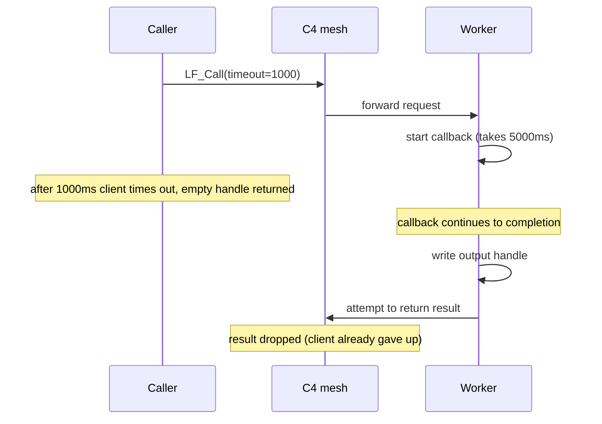
```mermaid
sequenceDiagram
    participant C as Caller
    participant MESH as C4 mesh
    participant W as Worker

    C->>MESH: LF_Call(timeout=1000)
    MESH->>W: forward request
    W->>W: start callback (takes 5000ms)
    Note over C: after 1000ms client times out, empty handle returned
    Note over W: callback continues to completion
    W->>W: write output handle
    W->>MESH: attempt to return result
    Note over MESH: result dropped (client already gave up)
```

### 9.4 Load-Balancing Path

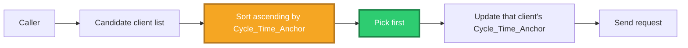
```mermaid
flowchart LR
    C["Caller"] --> L["Candidate client list"]
    L --> S["Sort ascending by Cycle_Time_Anchor"]
    S --> P["Pick first"]
    P --> U["Update that client's Cycle_Time_Anchor"]
    U --> CALL["Send request"]

    style S fill:#F5A623,stroke:#B7791F,stroke-width:3px,color:#FFFFFF
    style P fill:#2ECC71,stroke:#1E8449,stroke-width:3px,color:#FFFFFF
```

**Effect**: requests automatically spread across the least-recently-used workers.

### 9.5 Network Event Listener

```mermaid
sequenceDiagram
    participant User as User
    participant LF as LF kernel
    participant W as background worker

    User->>LF: LF_Set_Network_Event(on_connect, on_disconnect)
    Note over LF: stores callbacks
    LF->>LF: client connects -> first broadcast received
    LF->>W: TCompute.RunC(utf8_addr)
    W->>User: on_connect(addr)
    Note over User: must copy addr immediately
    W->>W: free utf8_addr
```

### 9.6 Sequenced Notify Thread Lifecycle

```mermaid
stateDiagram-v2
    [*] --> Absent: not used
    Absent --> Creating: first Sequenced_Notify
    Creating --> Active: thread started
    Active --> Active: FIFO processing
    Active --> Idle: 5 min with no notification
    Idle --> Destroyed: auto-terminate
    Destroyed --> Absent
    Active --> Destroyed: LF_Shutdown

    note right of Idle
        Next notification recreates the thread
        with a small startup latency
    end note
```

---

## Chapter 10 — Multi-Node, Multi-App, Load Balancing

### 10.1 Scenario Classification

```mermaid
flowchart TD
    S["Your program"] --> Q1{"How many Services?"}
    Q1 -- 1 --> Q2{"How many Apps?"}
    Q2 -- 1 --> A["Single client + single App"]
    Q2 -- "N > 1" --> B["Single client + multiple Apps<br/>(§10.2)"]
    Q1 -- "N > 1" --> Q3{"Apps per Service?"}
    Q3 -- 1 --> C["Multiple clients + one App each<br/>(§10.3)"]
    Q3 -- "N > 1" --> D["Multiple clients + multiple Apps each<br/>(§10.4)"]

    style S fill:#4A90E2,stroke:#1E3A8A,stroke-width:3px,color:#FFFFFF
    style A fill:#D5F5E3,stroke:#1E8449,stroke-width:3px,color:#0E4D2A
    style B fill:#F5A623,stroke:#B7791F,stroke-width:3px,color:#FFFFFF
    style C fill:#F5A623,stroke:#B7791F,stroke-width:3px,color:#FFFFFF
    style D fill:#E67E22,stroke:#9C4A0C,stroke-width:3px,color:#FFFFFF
```

### 10.2 Single Client + Multiple Apps (`Overlap_Connection=True`)

**Goal**: same process, one Service, two independent Apps exposed.

```cpp
#include "LingoFuse.hpp"

static void LF_CDECL app_a_cb(void*, void* in, void* out) {
    lingofuse::io::write_json(static_cast<TDataHnd>(out), {{"app", "A"}});
}

static void LF_CDECL app_b_cb(void*, void* in, void* out) {
    lingofuse::io::write_json(static_cast<TDataHnd>(out), {{"app", "B"}});
}

int main() {
    /* Step 1: load the runtime. */
    lingofuse::LibraryLoader loader;

    lingofuse::App app_a("ServiceA", "App A");
    lingofuse::App app_b("ServiceB", "App B");
    app_a.registerCall("ping", "ping A", nullptr, app_a_cb);
    app_b.registerCall("ping", "ping B", nullptr, app_b_cb);

    /* Key: enable Overlap_Connection */
    lingofuse::setOption("Overlap_Connection", "True");
    lingofuse::setOption("Wait_Ready", "False");

    lingofuse::resetPrepare();
    lingofuse::prepareService("ipc:multi", "ipc:multi");

    int tag_a = lingofuse::prepareClient("ipc:multi", app_a.get());
    int tag_b = lingofuse::prepareClient("ipc:multi", app_b.get());
    /* Expected: tag_a = 1, tag_b = 2 (two distinct tags) */

    if (lingofuse::prepareDone() != 1) return 1;

    std::cin.get();
    lingofuse::exitMainThread();
    lingofuse::shutdown();
    return 0;
}
```

### 10.3 Multiple Clients + One App Each

```cpp
lingofuse::LibraryLoader loader;

lingofuse::App app_x("ClientX", "for service 1");
lingofuse::App app_y("ClientY", "for service 2");

lingofuse::setOption("Wait_Ready", "False");
lingofuse::resetPrepare();

/* Different addresses -> no Overlap_Connection needed */
int t1 = lingofuse::prepareClient("ipc:service_1", app_x.get());
int t2 = lingofuse::prepareClient("ipc:service_2", app_y.get());

lingofuse::prepareDone();
```

### 10.4 Multiple Clients + Multiple Apps Each

```cpp
lingofuse::LibraryLoader loader;

lingofuse::App a1("A1"), a2("A2"), b1("B1"), b2("B2");

lingofuse::setOption("Overlap_Connection", "True");
lingofuse::setOption("Wait_Ready", "False");
lingofuse::resetPrepare();

lingofuse::prepareService("ipc:svc_1", "ipc:svc_1");
lingofuse::prepareService("ipc:svc_2", "ipc:svc_2");

lingofuse::prepareClient("ipc:svc_1", a1.get());
lingofuse::prepareClient("ipc:svc_1", a2.get());
lingofuse::prepareClient("ipc:svc_2", b1.get());
lingofuse::prepareClient("ipc:svc_2", b2.get());

lingofuse::prepareDone();
```

### 10.5 Late Binding with `LF_BindApp`

```cpp
lingofuse::LibraryLoader loader;

lingofuse::App app("LateBind", "bind after prepare");

lingofuse::resetPrepare();
lingofuse::prepareService("ipc:s1", "ipc:s1");
lingofuse::prepareService("ipc:s2", "ipc:s2");

/* Prepare clients without binding an App */
lingofuse::prepareClient("ipc:s1", nullptr);
lingofuse::prepareClient("ipc:s2", nullptr);

lingofuse::prepareDone();

/* Bind later */
int bound = app.bind();
/* Expected: bound = 2 */
```

**Conditions for `bind()` returning 0**:

| Condition | Note |
|---|---|
| Main thread not running | `prepareDone` not called or failed |
| All clients occupied | Each client hosts at most one App |
| App invalidated | `App` object already freed |

### 10.6 `LF_BindApp` vs `prepareClient(addr, app)`

| Dimension | `prepareClient(addr, app)` | `App::bind()` |
|---|---|---|
| **Bind time** | Preparation phase | After the framework is running |
| **Binding target** | Specified address | All idle clients |
| **Typical use** | Service startup | Dynamic App injection |
| **Overlap required?** | Yes for same-address repeats | No |

### 10.7 Load-Balancing Observation

**Worker process × N**:

```cpp
lingofuse::App app("demo", "worker");
app.registerCall("add", "...", nullptr, add_cb);
lingofuse::setOption("Wait_Ready", "False");
lingofuse::resetPrepare();
lingofuse::prepareClient("ipc:beacon", app.get());
lingofuse::prepareDone();
```

**Caller side**:

```cpp
for (int i = 0; i < 100; ++i) {
    lingofuse::DataHandle p("add");
    p.writeJson({{"a", i}, {"b", i}});
    auto resp = lingofuse::tryCall("demo", p, 1000);
    // ...
}
```

**Observation**: N workers each handle roughly `100 / N` requests.

### 10.8 `generateAppName` Dynamic Client Sequence

```
1. resetPrepare
2. prepareClient(endpoint, nil)
3. prepareDone returns 1
4. generateAppName
5. Create App
6. Register callbacks
7. bind or prepareClient again
```

**Why after `prepareDone`**: `generateAppName` includes C4 tunnel address and RemoteID, which do not exist before `prepareDone`.

---

## Chapter 11 — Runtime Options

### 11.1 All Options

| Option | Aliases | Type | Default | Description |
|---|---|---|---|---|
| `password` | `passwd` | string | empty | C4 P2PVM auth token |
| `Quiet` | — | bool | False | Quiet mode; suppress most logs |
| `ShowThreadID` | `ShowThread` / `Show_Thread` | bool | False | Show thread IDs in logs |
| `ConsoleOutput` | `Console_Output` | bool | True on console, False on GUI | Console output |
| `Overlap_Connection` | `Overlap_Client` / `OverlapConnection` / `OverlapClient` / `OverlapConnect` | bool | False | Allow multiple clients on the same address |
| `Wait_Connection_ReadyOk` | `Wait_API_Prepare_Done` / `API_Prepare_Done_Wait` / `WaitConnect` / `Wait_Ready` / `WaitReady` | bool | True | `prepareDone` waits for all clients ready |
| `Wait_Connection_Timeout` | `Wait_TimeOut` / `API_Prepare_Done_TimeOut` / `WaitTimeOut` | int ms | 30000 | Timeout for the above wait |
| `IPC_Serv_ThreadCount` | `IPC_ThreadCount` / `IPC_Server_ThreadCount` | int | platform default | IPC service thread count |
| `IPC_Serv_MaxQueueLength` | `IPC_MaxQueueLength` / `IPC_Server_MaxQueueLength` | int | platform default | IPC message queue length |
| `IPC_Serv_MaxMsgSize` | `IPC_MaxMsgSize` / `IPC_Server_MaxMsgSize` | int bytes | platform default | Max bytes per IPC message |
| `Fixed_Sequenced_Time` | `Fixed_Sequenced_Life` | int ms | 20000 | Sequenced Notify fallback threshold |

### 11.2 Value Format

| Type | Accepted values |
|---|---|
| bool | `"True"` / `"False"` / `"1"` / `"0"` / `"Yes"` / `"No"` (case-insensitive) |
| int | Decimal string |
| string | Verbatim |

**⚠️ Common mistake**: `"true"` (all-lowercase) is not reliably recognised in some builds. **Use `"True"` / `"False"`.**

### 11.3 `Wait_Ready` in Detail

```mermaid
flowchart TD
    A["prepareDone()"] --> B{"Wait_Ready?"}
    B -- "True (default)" --> C["block until all clients ready<br/>(or timeout)"]
    B -- "False" --> D["return immediately"]
    C --> E["guarantee: after prepareDone returns 1<br/>all clients are online"]
    D --> F["you must retry yourself<br/>target may not be ready"]

    style C fill:#2ECC71,stroke:#1E8449,stroke-width:3px,color:#FFFFFF
    style D fill:#F5A623,stroke:#B7791F,stroke-width:3px,color:#FFFFFF
```

| Scenario | Suggested value |
|---|---|
| Single-machine development | `"True"` (default) |
| Elastic cluster (services start late) | `"False"` |
| Fast-startup priority | `"False"` |
| Strong startup consistency | `"True"` |

**Client retry pattern with `"False"`**:

```cpp
lingofuse::setOption("Wait_Ready", "False");
// ... prepareDone ...

for (int attempt = 0; attempt < 30; ++attempt) {
    if (lingofuse::checkApi("TargetApp", "target_api")) break;
    std::this_thread::sleep_for(std::chrono::milliseconds(200));
}
auto resp = lingofuse::tryCall("TargetApp", param, 3000);
```

### 11.4 `Overlap_Connection`

| Value | Behaviour |
|---|---|
| `"False"` (default) | Second `prepareClient` on the same address returns -1; the App is silently ignored |
| `"True"` | Each `prepareClient` creates a new tunnel bound to the passed App |

**Set `"True"`** when exposing multiple Apps to the same address in the same process.

### 11.5 `Wait_Connection_Timeout`

```cpp
lingofuse::setOption("Wait_Connection_Timeout", "60000");
```

Even after a timeout, `prepareDone` still returns 1, but some clients may not be ready. **Pair with retry logic.**

### 11.6 `Fixed_Sequenced_Time`

Sequenced Notify's even distribution always picks the "oldest" client, which starves some clients. `Fixed_Sequenced_Time` sets a fallback threshold: if the chosen client is older than the threshold, **fall back to the newest client**.

```cpp
lingofuse::setOption("Fixed_Sequenced_Time", "5000");
```

### 11.7 Scope and Persistence

| Property | Value |
|---|---|
| **Scope** | Process-global |
| **Effective time** | Immediate (for subsequent operations) |
| **Persistent?** | ❌ Lost after `shutdown()` |
| **Unknown options** | **Silently ignored** (no error, no warning) |
| **Case sensitivity** | Option names are case-insensitive |

**The unknown-option trap**:

```cpp
lingofuse::setOption("WaitReady", "True");     // ✅ alias, works
lingofuse::setOption("Wait_Ready ", "True");   // ❌ trailing space, silently ignored
lingofuse::setOption("wait_ready", "True");    // ✅ case-insensitive, works
```

### 11.8 Common Configuration Recipes

| Scenario | Commands |
|---|---|
| **Single-machine development** | keep defaults |
| **Elastic cluster (unordered start)** | `Wait_Ready=False` |
| **Multiple Apps per address** | `Overlap_Connection=True` |
| **WAN slow startup** | `Wait_Connection_Timeout=60000` |
| **Disable logs** | `Quiet=True` + `ConsoleOutput=False` |
| **Debug thread issues** | `ShowThreadID=True` |
| **High-frequency Sequenced Notify** | `Fixed_Sequenced_Time=5000` |

---

## Chapter 12 — Error Handling and Recovery

### 12.1 Exception Hierarchy

| Exception | Source | Payload |
|---|---|---|
| `lingofuse::io::LfIoError` | `lf_io.hpp` | `what()` |
| `lingofuse::Error` | `LingoFuse.hpp` | `what()` + `code()` |

### 12.2 `ErrorCode` Trigger Scenarios and Recovery

| `ErrorCode` | Trigger | Recovery |
|---|---|---|
| `Generic` | `LF_CreateData` / `LF_CreateApp` returns NULL | OOM or invalid argument |
| `LibraryLoadFailed` | `LibraryLoader` constructor | Check DLL placement (exe dir or PATH) |
| `NullHandle` | Operation on a freed `DataHandle` / `App` | Check lifetime |
| `InvalidArgument` | `writeRaw(nullptr, n>0)` | Check arguments |
| `WriteFailed` | `write` / `writeJson` / `writeRaw` failure | Usually invalid handle |
| `ReadFailed` | `read` family failure | Usually invalid handle |
| `CallFailed` | `App::localCall` returns NULL / bridge error | Rare; check API registration |
| `RegistrationFailed` | `registerCall` / `registerNotify` failure | Check for duplicate API name |
| `NotConnected` | Remote call before `prepareDone` | Call `prepareDone` first |
| `Timeout` | **Never thrown automatically** (use `tryCall` → `nullopt`) | Check the timeout parameter |

### 12.3 Unified Exception Handling Strategy

```cpp
try {
    lingofuse::DataHandle p("api");
    p.writeJson(payload);

    auto resp = lingofuse::tryCall("app", p, 3000);
    if (!resp) {
        // timeout or target missing
    }
}
catch (const lingofuse::Error& e) {
    switch (e.code()) {
        case lingofuse::ErrorCode::Timeout:
            // ...
            break;
        case lingofuse::ErrorCode::WriteFailed:
            // ...
            break;
        default:
            std::cerr << "Error " << static_cast<int>(e.code())
                      << ": " << e.what() << "\n";
    }
}
catch (const lingofuse::io::LfIoError& e) {
    // Only thrown when calling io::* directly
    std::cerr << "I/O error: " << e.what() << "\n";
}
catch (const std::exception& e) {
    std::cerr << "Other: " << e.what() << "\n";
}
```

### 12.4 Retry Pattern

**Recommended**: `tryCall` + retry + `checkApi` pre-check.

```cpp
std::optional<lingofuse::DataHandle> call_with_retry(
    const std::string& app,
    const std::string& api,
    const lingofuse::DataHandle& param,
    int max_retries = 3,
    int base_delay_ms = 200)
{
    for (int i = 0; i < max_retries; ++i) {
        if (lingofuse::checkApi(app, api)) {
            auto resp = lingofuse::tryCall(app, param, 5000);
            if (resp) return resp;
        }
        std::this_thread::sleep_for(
            std::chrono::milliseconds(base_delay_ms * (i + 1)));
    }
    return std::nullopt;
}
```

### 12.5 Idempotency Key Pattern

```cpp
nlohmann::json make_idempotent_request(
    const std::string& operation,
    const nlohmann::json& params)
{
    return {
        {"request_id", generate_uuid()},
        {"operation", operation},
        {"params", params}
    };
}

// Server side
static void LF_CDECL payment_cb(void*, void* in, void* out) {
    auto req = lingofuse::io::read_json(static_cast<TDataHnd>(in));
    const std::string request_id = req.at("request_id").get<std::string>();

    // Idempotency cache lookup
    if (idempotency_cache.contains(request_id)) {
        lingofuse::io::write_json(static_cast<TDataHnd>(out),
                                  idempotency_cache[request_id]);
        return;
    }

    // Perform the operation
    auto result = do_payment(req);

    // Record idempotency
    idempotency_cache[request_id] = result;

    lingofuse::io::write_json(static_cast<TDataHnd>(out), result);
}
```

### 12.6 Network Partition and Reconnection

- Clients reconnect automatically after a link drop.
- Apps re-register automatically after reconnect.
- A reconnect **re-triggers** the Connect event (Disconnect does not re-fire).
- During reconnection, `tryCall` returns `nullopt`.
- **Recommendation**: heartbeat + retry loop.

### 12.7 Cross-Language Comparison Table

| Scenario | C++ | Python | Pascal |
|---|---|---|---|
| I/O failure | `LfIoError` / `Error` | `LingoFuseError` | silently swallowed |
| Remote call failure | `tryCall` → `nullopt` | `TimeoutError` | size=0 handle |
| Registration failure | returns `false` | `RegistrationError` | returns 0 |
| Library load failure | `Error(LibraryLoadFailed)` | `LingoFuseError` | DLL load failure |
| Callback exception | **must try/catch** | auto-isolated | library `try/except` |

**C++ specificity**: exceptions must not cross the C stack. Callbacks must try/catch themselves.

---

## Chapter 13 — HTTP Bridge

### 13.1 What the Bridge Is

The LingoFuse HTTP Bridge is a **standalone process** (`bridge.py` / `bridge.exe`) that registers itself as an App on the LingoFuse mesh.

**Three directions**:

```mermaid
flowchart LR
    subgraph A["Direction A: inbound HTTP -> LF"]
        H1["HTTP client"] -->|"POST /app/api"| B1["Bridge"]
        B1 -->|"LF_Call"| S1["LF service"]
    end
    subgraph B["Direction B: outbound LF -> HTTP"]
        S2["LF service"] -->|"LF_Call"| B2["Bridge"]
        B2 -->|"HTTP request"| H2["Remote HTTP"]
    end
    subgraph C["Direction C: JSON repair"]
        S3["LF service"] -->|"LF_Call"| B3["Bridge"]
        B3 -->|"repair engine"| R3["Repaired JSON"]
    end

    style B1 fill:#9B59B6,stroke:#6C3483,stroke-width:3px,color:#FFFFFF
    style B2 fill:#9B59B6,stroke:#6C3483,stroke-width:3px,color:#FFFFFF
    style B3 fill:#9B59B6,stroke:#6C3483,stroke-width:3px,color:#FFFFFF
```

**The C++ client covers only directions B and C** (`lf_http_bridge_client.hpp`). Direction A is handled by HTTP clients calling the bridge directly.

### 13.2 Bridge and the Code-Generation System

**`lf_http_bridge_client.hpp` exists to serve code generation.**

**LingoFuse-Tools** (https://github.com/PassByYou888/LingoFuse-Tools) provides three generators:

| Generator | Output |
|---|---|
| `code_decl_to_abi` | Binary ABI binding |
| `code_decl_to_json_abi` | HTTP/JSON binding (via the bridge) |
| `code_decl_to_mcp` | MCP tool provider binding |

Each generator emits Pascal / Python / C++ / JavaScript.

**Workflow**:

1. Declare service APIs (Pascal unit or C header).
2. Run `code_decl_to_json_abi`.
3. Generates a server skeleton + client header + README.
4. The client header `#include "lf_http_bridge_client.hpp"` uses this header's runtime.

**This header is the runtime half** of the HTTP/JSON binding; the generator produces the API-specific half.

### 13.3 Constants

```cpp
inline constexpr const char* kBDefaultAppName = "__lf_http_bridge__";
inline constexpr const char* kBDefaultPostApiName = "__lf_outbound_post__";
inline constexpr const char* kBDefaultRepairApiName = "__lf_repair_json__";
inline constexpr std::uint64_t kBDefaultCallTimeoutMs = 60000;
inline constexpr double kBDefaultHttpTimeoutSec = 25.0;
inline constexpr double kBMaxHttpTimeoutSec = 300.0;
```

### 13.4 Bridge Configuration

The bridge is configured via CLI args or env vars:

| Argument | Environment variable | Default | C++ constant |
|---|---|---|---|
| `--bridge-app` | `LINGOFUSE_BRIDGE_APP` | `__lf_http_bridge__` | `kBDefaultAppName` |
| `--bridge-api` | `LINGOFUSE_BRIDGE_API` | `__lf_outbound_post__` | `kBDefaultPostApiName` |
| `--bridge-repair-api` | `LINGOFUSE_BRIDGE_REPAIR_API` | `__lf_repair_json__` | `kBDefaultRepairApiName` |

**If the bridge runs with non-default names**, the C++ client must pass the corresponding names.

### 13.5 Outbound HTTP Request/Response Contract

**Request JSON** (sent to `__lf_outbound_post__`):

```json
{
    "url":     "http://example.com/api",
    "method":  "POST",
    "headers": { "X-Foo": "Bar" },
    "body":    { "any": "json" },
    "timeout": 25
}
```

**Response JSON** (returned by the bridge):

```json
{
    "status_code": 200,
    "headers":     { "content-type": "application/json", ... },
    "body":        { ... } | "raw string if not JSON"
}
```

**Bridge-level error**:

```json
{ "error": "description" }
```

### 13.6 JSON Repair Contract

**Request**: UTF-8 JSON text (possibly malformed, possibly BOM-prefixed, possibly NUL-terminated).

**Response**: UTF-8 NUL-terminated text, which may be:

- Repaired JSON (input malformed but repairable).
- Original text (input was valid JSON).
- Original text (input malformed and unrepairable).
- Original bytes (bridge could not decode to text).

**The response is a plain string, not a JSON envelope.** Read it with `LF_ReadString`.

**No-escaping guarantee**: the bridge uses `ensure_ascii=False`; the returned text contains no `\uXXXX` escapes.

### 13.7 `httpCall`

```cpp
nlohmann::json httpCall(
    std::string_view url,
    std::string_view method,
    const nlohmann::json& request_body,
    double http_timeout_sec = 0.0,
    const char* app_name = nullptr,
    const char* api_name = nullptr,
    std::uint64_t call_timeout_ms = 0
);
```

- Empty `url` → throws `Error(InvalidArgument)`.
- Empty `method` → defaults to `"POST"`.
- Null/discarded `request_body` → no body.
- `timeout` is rounded and written into the request JSON.
- Calls `LF_Call`; empty response → throws `Error(CallFailed)`.
- Parses the envelope; failure → throws `Error(ReadFailed)`.
- If the envelope has `"error"` → throws `Error(CallFailed)`.
- Returns the full envelope.

### 13.8 `httpPost` / `httpPostBody`

```cpp
nlohmann::json httpPost(
    std::string_view url,
    const nlohmann::json& request_body,
    const char* app_name = nullptr,
    const char* api_name = nullptr
);

nlohmann::json httpPostBody(
    std::string_view url,
    const nlohmann::json& request_body,
    const char* app_name = nullptr,
    const char* api_name = nullptr
);
```

- `httpPost` = `httpCall(url, "POST", ...)`.
- `httpPostBody` returns the `body` field of the envelope. Missing body or null → null JSON.

### 13.9 `repairJson`

```cpp
std::string repairJson(
    std::string_view input_json,
    const char* app_name = nullptr,
    const char* api_name = nullptr,
    std::uint64_t call_timeout_ms = 0
);
```

- Writes the input using `io::write_string`.
- After `LF_Call`, empty response → throws `Error(CallFailed)`.
- String read failure → throws `Error(ReadFailed)`.
- Does not compare input vs. output; empty repair result is a valid success.
- Guarantees no `\uXXXX` escapes.

### 13.10 Non-Throwing Variants

```cpp
std::optional<nlohmann::json> tryHttpCall(...) noexcept;
std::optional<nlohmann::json> tryHttpPost(...) noexcept;
std::optional<nlohmann::json> tryHttpPostBody(...) noexcept;
std::optional<std::string>    tryRepairJson(...) noexcept;
```

All catch every exception and return `nullopt` on failure.

### 13.11 `waitForBridge`

```cpp
bool waitForBridge(
    const char* app_name = nullptr,
    std::uint64_t timeout_ms = 10000,
    std::uint64_t poll_interval_ms = 200
);
```

Polls `checkApp` until the bridge becomes visible or the timeout expires. Used with `Wait_Ready=False` deployments.

### 13.12 Contract and Pitfalls

| Pitfall | Note |
|---|---|
| App/API name mismatch | Must match the bridge's startup parameters. |
| LF_Call timeout shorter than HTTP timeout | Client times out first. Rule: `call_timeout >= (http_timeout + 5) * 1000`. |
| Treating empty repair result as failure | Empty string is a valid repair result. |
| Assuming repair always modifies | Already-valid JSON is returned as-is. |
| Assuming outbound always returns JSON body | The remote may return HTML/image; `body` may be a string. |
| Treating the envelope as the remote response | The remote response is inside `body`. |
| Hand-crafting an invalid JSON body | Use `nlohmann::json` to construct. |
| Expecting repair to fail on non-JSON | Unrepairable input returns success with the original text. |

### 13.13 Cross-Language Bridge API Comparison

| Feature | Pascal | Python | C++ |
|---|---|---|---|
| Full HTTP call | `LFHttpCall` | `http_call` | `httpCall` |
| POST envelope | `LFHttpPost` | `http_post` | `httpPost` |
| POST body only | `LFHttpPostBody` | `http_post_body` | `httpPostBody` |
| JSON repair | `LFHttpRepairJson` | `repair_json` | `repairJson` |
| Non-throwing variants | — | — | `try*` |
| Wait for bridge | — | — | `waitForBridge` |

---

## Chapter 14 — Complete Application Patterns

### 14.1 Standalone Server + Client

**Server (`server.cpp`)**:

```cpp
#include "LingoFuse.hpp"
#include <iostream>

static void LF_CDECL add_cb(void*, void* in, void* out) {
    using namespace lingofuse::io;
    try {
        auto req = read_json(static_cast<TDataHnd>(in));
        int a = req.value("a", 0);
        int b = req.value("b", 0);
        write_json(static_cast<TDataHnd>(out), {{"result", a + b}});
    } catch (const std::exception& e) {
        write_json(static_cast<TDataHnd>(out),
                   {{"error", std::string(e.what())}});
    }
}

int main() {
    try {
        lingofuse::LibraryLoader loader;    /* LF_LoadLibrary */

        lingofuse::App app("Calc", "JSON calc");
        app.registerCall("add", "add two ints", nullptr, add_cb);

        lingofuse::setOption("Wait_Ready", "False");
        lingofuse::resetPrepare();
        lingofuse::prepareService("ipc:calc", "ipc:calc");
        lingofuse::prepareClient("ipc:calc", app.get());

        if (lingofuse::prepareDone() != 1) return 1;

        std::cout << "Ready. Press Enter...\n";
        std::cin.get();

        lingofuse::exitMainThread();
        lingofuse::shutdown();
    } catch (const std::exception& e) {
        std::cerr << "Error: " << e.what() << '\n';
        return 1;
    }
    return 0;
}
```

**Client (`client.cpp`)**:

```cpp
#include "LingoFuse.hpp"
#include <iostream>

int main() {
    try {
        lingofuse::LibraryLoader loader;    /* LF_LoadLibrary */

        lingofuse::resetPrepare();
        if (lingofuse::prepareClient("ipc:calc", nullptr) < 0) return 1;
        if (lingofuse::prepareDone() != 1) return 1;

        for (int i = 0; i < 15; ++i) {
            if (lingofuse::checkApi("Calc", "add")) break;
            std::this_thread::sleep_for(std::chrono::milliseconds(200));
        }

        lingofuse::DataHandle param("add");
        param.writeJson({{"a", 5}, {"b", 7}});

        auto resp = lingofuse::tryCall("Calc", param, 3000);
        if (!resp) {
            std::cerr << "call failed\n";
            return 1;
        }

        resp->seek(0);
        auto j = resp->readJson();
        std::cout << "5 + 7 = " << j.at("result").get<int>() << '\n';

        lingofuse::exitMainThread();
        lingofuse::shutdown();
    } catch (const std::exception& e) {
        std::cerr << "Error: " << e.what() << '\n';
        return 1;
    }
    return 0;
}
```

### 14.2 Distributed Compute Grid

**Beacon (`beacon.cpp`)**:

```cpp
#include "LingoFuse.hpp"

int main() {
    lingofuse::LibraryLoader loader;    /* LF_LoadLibrary */
    lingofuse::setOption("Wait_Ready", "False");
    lingofuse::resetPrepare();
    lingofuse::prepareService("ipc:compute_grid", "ipc:compute_grid");
    if (lingofuse::prepareDone() != 1) return 1;
    std::cin.get();
    lingofuse::exitMainThread();
    lingofuse::shutdown();
    return 0;
}
```

**Node (`node.cpp`, run N copies)**:

```cpp
#include "LingoFuse.hpp"

static void LF_CDECL exp_cb(void*, void* in, void* out) {
    auto req = lingofuse::io::read_json(static_cast<TDataHnd>(in));
    double base = req.value("base", 0.0);
    double exponent = req.value("exponent", 0.0);
    double result = std::pow(base, exponent);
    lingofuse::io::write_json(static_cast<TDataHnd>(out),
                              {{"result", result}});
}

int main() {
    lingofuse::LibraryLoader loader;    /* LF_LoadLibrary */
    lingofuse::App app("compute_node", "compute worker");
    app.registerCall("exp", "exponent", nullptr, exp_cb);

    lingofuse::setOption("Wait_Ready", "False");
    lingofuse::resetPrepare();
    lingofuse::prepareClient("ipc:compute_grid", app.get());
    if (lingofuse::prepareDone() != 1) return 1;
    std::cin.get();
    lingofuse::exitMainThread();
    lingofuse::shutdown();
    return 0;
}
```

**Caller (`call.cpp`)**:

```cpp
#include "LingoFuse.hpp"
#include <iostream>

int main() {
    lingofuse::LibraryLoader loader;    /* LF_LoadLibrary */
    lingofuse::resetPrepare();
    lingofuse::prepareClient("ipc:compute_grid", nullptr);
    if (lingofuse::prepareDone() != 1) return 1;

    for (int i = 0; i < 15; ++i) {
        if (lingofuse::checkApi("compute_node", "exp")) break;
        std::this_thread::sleep_for(std::chrono::milliseconds(200));
    }

    lingofuse::DataHandle p("exp");
    p.writeJson({{"base", 2.0}, {"exponent", 10.0}});
    auto resp = lingofuse::tryCall("compute_node", p, 3000);
    if (resp) {
        resp->seek(0);
        auto j = resp->readJson();
        std::cout << "2^10 = " << j.at("result").get<double>() << "\n";
    }

    lingofuse::exitMainThread();
    lingofuse::shutdown();
    return 0;
}
```

### 14.3 Cross-Language Mixed Deployment

Pascal server + C++ client:

- Pascal: `LF_CreateApp('CrossApp', ...)` + `LF_RegisterCall`.
- C++: `lingofuse::tryCall("CrossApp", ...)`.
- Both sides agree on API names and parameter format (JSON recommended).

**Key**: both sides must agree on the wire format (NUL + UTF-8 + JSON).

### 14.4 Large-Payload Sequenced Transfer

**Sender**:

```cpp
lingofuse::DataHandle p("chunk");
for (int i = 0; i < 1000; ++i) {
    p.reset();  /* or a fresh handle */
    p.writeJson({
        {"index", i},
        {"total", 1000},
        {"data", std::string(10240, 'x')}  /* 10 KB payload */
    });
    lingofuse::sequencedNotify("receiver", p);
}
```

**Receiver**:

```cpp
static void LF_CDECL chunk_cb(void*, void* in, void*) {
    auto j = lingofuse::io::read_json(static_cast<TDataHnd>(in));
    int index = j.at("index").get<int>();
    /* Arrives in order (FIFO per (app, api)) */
    /* Reassemble by index */
}
```

### 14.5 Stress Test

```cpp
std::atomic<int> success{0};
std::atomic<int> failure{0};

std::vector<std::thread> threads;
for (int t = 0; t < 50; ++t) {
    threads.emplace_back([&]() {
        for (int i = 0; i < 20; ++i) {
            lingofuse::DataHandle p("add");
            p.writeJson({{"a", i}, {"b", i}});
            auto resp = lingofuse::tryCall("Calc", p, 3000);
            if (resp) success.fetch_add(1);
            else failure.fetch_add(1);
        }
    });
}
for (auto& t : threads) t.join();

std::cout << "success: " << success << " failure: " << failure << "\n";
```

### 14.6 Network Event Listener

```cpp
#include "LingoFuse.hpp"
#include <memory>
#include <iostream>

struct RouterListener : lingofuse::NetworkEventListener {
    void onConnect(const std::string& addr) override {
        if (addr == "ipc:service_a") {
            std::cout << "[A] online\n";
        } else if (addr == "ipc:service_b") {
            std::cout << "[B] online\n";
        } else {
            std::cout << "[?] unknown: " << addr << "\n";
        }
    }
    void onDisconnect(const std::string& addr) override {
        std::cout << "[-] " << addr << "\n";
    }
};

int main() {
    lingofuse::LibraryLoader loader;    /* LF_LoadLibrary */
    auto listener = std::make_shared<RouterListener>();
    lingofuse::setNetworkEvent(listener);

    lingofuse::resetPrepare();
    lingofuse::prepareClient("ipc:service_a", nullptr);
    lingofuse::prepareClient("ipc:service_b", nullptr);
    lingofuse::prepareDone();

    std::cin.get();

    lingofuse::clearNetworkEvent();
    lingofuse::exitMainThread();
    lingofuse::shutdown();
    return 0;
}
```

### 14.7 HTTP Bridge Usage

```cpp
#include "LingoFuse.hpp"
#include "lf_http_bridge_client.hpp"
#include <iostream>

int main() {
    try {
        lingofuse::LibraryLoader loader;    /* LF_LoadLibrary */
        lingofuse::resetPrepare();
        lingofuse::prepareClient("ipc:compute_grid", nullptr);
        if (lingofuse::prepareDone() != 1) return 1;

        if (!lingofuse::bridge::waitForBridge(nullptr, 5000)) {
            std::cerr << "Bridge not visible\n";
            return 1;
        }

        auto envelope = lingofuse::bridge::httpPost(
            "https://api.example.com/v1/echo",
            {{"message", "Hello 🌍"}}
        );
        std::cout << "status: "
                  << envelope.at("status_code").get<int>() << "\n";

        auto body = lingofuse::bridge::httpPostBody(
            "https://api.example.com/v1/echo",
            {{"message", "again"}}
        );
        std::cout << "body: " << body.dump() << "\n";

        std::string repaired = lingofuse::bridge::repairJson(
            "{'name': 'Alice', 'age': 30,}"
        );
        std::cout << "repaired: " << repaired << "\n";

        lingofuse::exitMainThread();
        lingofuse::shutdown();
    } catch (const std::exception& e) {
        std::cerr << "Error: " << e.what() << "\n";
        return 1;
    }
    return 0;
}
```

---

## Chapter 15 — Cross-Language Comparison

### 15.1 Three-Way API Comparison

| Feature | Pascal | Python | C++ |
|---|---|---|---|
| Load library | automatic (static link) | automatic (import) | **`LibraryLoader` / `LF_LoadLibrary`** |
| Create data handle | `LF_CreateDataEx` | `DataHandle('api')` | `DataHandle dh("api")` |
| Write JSON | `LF_WriteString` | `dh.write_json(obj)` | `dh.writeJson(obj)` |
| Read JSON | `LF_ReadString` | `dh.read_json()` | `dh.readJson()` |
| Create App | `LF_CreateAppEx` | `App('name')` | `App app("name")` |
| Register Call | `LF_RegisterCall_M` | `@app.expose('api')` | `app.registerCall(...)` |
| Register Call (sync) | `LF_RegisterSyncCall_M` | — | **no equivalent** |
| Register Notify | `LF_RegisterNotify_M` | `@app.expose('api', notify=True)` | `app.registerNotify(...)` |
| Local call | `LF_LocalCall` | `app.local_call(...)` | `app.localCall(...)` |
| Remote call | `LF_Call` | `call(...)` | `lingofuse::call(...)` |
| Generate unique name | `LF_Generate_AppNameEx` | `generate_app_name()` | `generateAppName()` |
| Bind App | `LF_BindApp` | `app.bind()` | `app.bind()` |
| Network prepare | `LF_PrepareService/Client/Done` | `prepare_*` | `prepare*` |
| Shutdown | `LF_Shutdown` | `shutdown()` | `shutdown()` |
| Network events | `LF_Set_Network_Event` | none | `setNetworkEvent` |
| HTTP Bridge | `LFHttpCall` etc. | `http_call` etc. | `bridge::httpCall` etc. |
| **Unload library** | automatic | automatic | **`LF_FreeLibrary` (or `~LibraryLoader`)** |

### 15.2 Exception Semantics Difference

| Scenario | C++ | Python | Pascal |
|---|---|---|---|
| I/O failure | throws `LfIoError` / `Error` | throws `LingoFuseError` | silently swallowed |
| Remote call timeout | `tryCall` → `nullopt` | throws `TimeoutError` | returns size=0 handle |
| Registration failure | returns `false` | throws `RegistrationError` | returns 0 |
| Callback exception | **must try/catch** | auto-isolated + logged | library `try/except` |

**C++ specificity**: exceptions must not cross the C stack. Callbacks must try/catch internally.

### 15.3 Callback Style Difference

| Style | Pascal | Python | C++ |
|---|---|---|---|
| C function | `LF_RegisterCall` | — | `registerCall` |
| Object method | `LF_RegisterCall_M` | — | **no equivalent** |
| Anonymous / nested | `LF_RegisterCall_P` | `@app.expose` | **no equivalent** |
| Sync to main thread | `LF_RegisterSyncCall_M` | — | **no equivalent** |

**C++ only has C-function-style callbacks**. For `this` semantics, pass `this` via `trigger`.

### 15.4 Migration Guide (Pascal → C++)

| Pascal code | C++ equivalent |
|---|---|
| `App := TLF_App.Create` | `lingofuse::App app("name")` |
| `App.Engine.Reg_Call('api', ...)` | `app.registerCall("api", ...)` |
| `App.FakeFree` | `~App` calls `LF_FreeApp` |
| `LF_Data.Free_Data(hnd)` | `DataHandle` destructor frees |
| `LF_WriteString(hnd, s)` | `dh.write(s)` or `io::write_string` |
| `App.Engine.Execute_Call(param)` | `app.localCall(param)` |
| `SysPost.PostExecuteC_NP(delay, proc)` | `std::thread` + `sleep_for` |
| `DelayFreeObject(delay, obj)` | `std::shared_ptr` + timer |

**Key differences**:

- Pascal has `TDFE` data containers; C++ uses `nlohmann::json`.
- Pascal has `Data1..5` fields; C++ passes context via `trigger`.
- Pascal has `Auto_Free_Pool`; C++ uses RAII.

---

## Chapter 16 — Integration with the Z Framework

### 16.1 Underlying Dependencies

| LingoFuse C++ Layer | Pascal Unit |
|---|---|
| Core RPC | `Z.LingoFuse_Core` |
| C ABI exports | `Z.LingoFuse_Export` |
| C4 distribution | `Z.Net.C4.LingoFuse` |
| Process identity | `Z.LingoFuse_System_ProcessID.inc` |
| Data streams | `Z.MemoryStream` (`TMem64`) |
| Timers | `Z.Notify` |
| Status | `Z.Status` |
| JSON | `Z.Json` |
| Hashing | `Z.HashList.Templet` |
| Concurrency | `Z.Core` (`TCompute`, `TCritical`, `TAtomInt`) |

### 16.2 Why Understanding Z Helps

| C++ behaviour | Underlying Z mechanism |
|---|---|
| DataHandle 5-min reclamation | `TLF_DataPool.Progress` scans every 5 s |
| `prepareDone` 30 s timeout | `Simulated_Main_Thread` init loop |
| Network events on background threads | `TCompute.RunC` |
| Sequenced Notify 5-min termination | `TLF_Notify_Sequence_Thread` idle timeout |
| `generateAppName` 5-second expiry | `Z.Notify.DelayFreeMem(5.0, Result)` |
| Bridge JSON repair | `Z.Json` repair engine |

### 16.3 Bridge and Z.Json

The bridge's repair engine uses `Z.Json`'s normalisation. Repair strategy:

1. Strict JSON validation.
2. On failure, conservative repair.
3. Re-validate output.
4. Return repaired text or the original.

### 16.4 Relationship with LingoFuse-Tools

`lf_http_bridge_client.hpp` is the **runtime half** of the HTTP/JSON binding. The generator produces the API-specific half:

```
code_decl_to_json_abi
    ↓
Generates:
  - server skeleton (Pascal / C)
  - client C++ header (#include "lf_http_bridge_client.hpp")
  - client Python/JS equivalents
  - README describing the wire format
```

---

## Chapter 17 — Debugging and Troubleshooting

### 17.1 Status Queue

```cpp
// Drain periodically from a main loop
while (lingofuse::statusCount() > 0) {
    std::string msg = lingofuse::popStatus();
    std::cout << "[LF] " << msg << "\n";
}

// Inject a custom log entry
lingofuse::postStatus("Custom marker: entering critical section");
```

**Prerequisite**: `prepareDone` must have been called (simulated main thread running).

### 17.2 Enabling Debug Logs

```cpp
lingofuse::setOption("ConsoleOutput", "True");
lingofuse::setOption("ShowThreadID", "True");
lingofuse::setOption("Quiet", "False");
```

### 17.3 Health Checks

```cpp
// Check the main thread
bool mt_ok = lingofuse::checkMainThread();

// Check an app (with retry; broadcast has ~3 s delay)
for (int i = 0; i < 15; ++i) {
    if (lingofuse::checkApp("MyApp")) break;
    std::this_thread::sleep_for(std::chrono::milliseconds(200));
}

// Check an API
bool api_ok = lingofuse::checkApi("MyApp", "my_api");
```

### 17.4 Raw Byte Inspection

```cpp
auto raw = lingofuse::io::peek_string_bytes(hnd.get());
std::cout << "Raw bytes (" << raw.size() << "): ";
for (auto b : raw) {
    std::printf("%02X ", b);
}
std::cout << "\n";

// Or parse as a string
std::string s(raw.begin(), raw.end());
std::cout << "As string: " << s << "\n";
```

### 17.5 Troubleshooting Decision Tree

```mermaid
flowchart TD
    Start["An issue appears"] --> Q1{"Crash?"}
    Q1 -- Yes --> Q2{"Crash inside a callback?"}
    Q2 -- Yes --> A1["Check: LF_CDECL, UI access, blocking calls"]
    Q2 -- No --> A2["Check: cleanup order, dangling handles"]
    Q1 -- No --> Q3{"Call timed out?"}
    Q3 -- Yes --> A3["Increase timeout, checkApi, look at server logs"]
    Q3 -- No --> Q4{"Empty result?"}
    Q4 -- Yes --> A4["checkApi retry, check status queue"]
    Q4 -- No --> Q5{"JSON parse failure?"}
    Q5 -- Yes --> A5["Inspect raw bytes: read_string_bytes"]
    Q5 -- No --> A6["Enable debug logs, read status queue"]

    style A1 fill:#E74C3C,stroke:#922B21,stroke-width:3px,color:#FFFFFF
    style A2 fill:#E74C3C,stroke:#922B21,stroke-width:3px,color:#FFFFFF
    style A3 fill:#E67E22,stroke:#9C4A0C,stroke-width:3px,color:#FFFFFF
    style A4 fill:#F5A623,stroke:#B7791F,stroke-width:3px,color:#FFFFFF
    style A5 fill:#3498DB,stroke:#1F618D,stroke-width:3px,color:#FFFFFF
    style A6 fill:#9B59B6,stroke:#6C3483,stroke-width:3px,color:#FFFFFF
```

### 17.6 Common Error Messages

| Message | Meaning | Handling |
|---|---|---|
| `LingoFuse: Failed to load LingoFuse64.dll` | DLL not found | Place next to exe or on PATH |
| `LingoFuse: Failed to resolve symbol LF_xxx` | Missing symbol | DLL version mismatch |
| `LingoFuse: xxx called before LF_LoadLibrary` | Called before load | Call `LF_LoadLibrary` first |
| `no found api "X"` | API not registered | Check registration |
| `repeat connection` | Duplicate address | Enable `Overlap_Connection` |
| `All clients are already occupied` | No idle client | `bind` failed; needs a new client |
| `hint: Data handle pool "N" handles ... 5 minutes` | Handle reclamation | Normal behaviour |
| `invoked as Call` warning | Mode mismatch | Use the right invocation mode |
| `application mismatch` | Same key, different App | Use a distinct key |
| `Callback type mismatch` | Callback missing `cdecl` | Add `LF_CDECL` |

### 17.7 Thread Debugging

```cpp
lingofuse::setOption("ShowThreadID", "True");

// Print thread ID in a callback
static void LF_CDECL debug_cb(void*, void* in, void*) {
    std::cout << "Callback on thread: "
              << std::this_thread::get_id() << "\n";
}
```

---

## Chapter 18 — Testing and Verification

### 18.1 Unit Tests

**Test callback registration**:

```cpp
TEST(LingoFuseTest, RegisterCall) {
    lingofuse::LibraryLoader loader;
    lingofuse::App app("TestApp", "test");

    ASSERT_TRUE(app.registerCall("api", "desc", nullptr, test_cb));
    ASSERT_FALSE(app.registerCall("api", "desc", nullptr, test_cb));
    // duplicate name fails

    ASSERT_TRUE(app.unregister("api"));
    ASSERT_FALSE(app.unregister("api"));
    // not-found fails
}
```

**Test JSON I/O**:

```cpp
TEST(LingoFuseTest, WriteReadJson) {
    lingofuse::LibraryLoader loader;
    lingofuse::DataHandle dh("test");

    nlohmann::json original = {
        {"name", "张三"},
        {"age", 30},
        {"emoji", "🌍"}
    };

    dh.writeJson(original);

    dh.seek(0);
    auto parsed = dh.readJson();

    ASSERT_EQ(parsed, original);
}
```

### 18.2 Integration Tests

```cpp
TEST(LingoFuseTest, IntegrationCall) {
    lingofuse::LibraryLoader loader;

    // Server side
    lingofuse::App app("TestServer", "integration");
    app.registerCall("echo", "echo", nullptr, echo_cb);

    lingofuse::setOption("Wait_Ready", "False");
    lingofuse::resetPrepare();
    lingofuse::prepareService("ipc:test", "ipc:test");
    lingofuse::prepareClient("ipc:test", app.get());
    ASSERT_EQ(lingofuse::prepareDone(), 1);

    // Wait for broadcast
    for (int i = 0; i < 15; ++i) {
        if (lingofuse::checkApi("TestServer", "echo")) break;
        std::this_thread::sleep_for(std::chrono::milliseconds(200));
    }

    // Invoke
    lingofuse::DataHandle p("echo");
    p.writeJson({{"msg", "hello"}});
    auto resp = lingofuse::tryCall("TestServer", p, 3000);
    ASSERT_TRUE(resp.has_value());

    resp->seek(0);
    auto j = resp->readJson();
    ASSERT_EQ(j.at("msg").get<std::string>(), "hello");

    lingofuse::exitMainThread();
    lingofuse::shutdown();
}
```

### 18.3 Stress Test

```cpp
TEST(LingoFuseTest, StressTest) {
    lingofuse::LibraryLoader loader;

    lingofuse::App app("StressApp", "stress");
    app.registerCall("echo", "echo", nullptr, echo_cb);

    lingofuse::setOption("Wait_Ready", "False");
    lingofuse::resetPrepare();
    lingofuse::prepareService("ipc:stress", "ipc:stress");
    lingofuse::prepareClient("ipc:stress", app.get());
    ASSERT_EQ(lingofuse::prepareDone(), 1);

    std::atomic<int> success{0};
    std::atomic<int> failure{0};

    std::vector<std::thread> threads;
    for (int t = 0; t < 50; ++t) {
        threads.emplace_back([&]() {
            for (int i = 0; i < 20; ++i) {
                lingofuse::DataHandle p("echo");
                p.writeJson({{"n", i}});
                auto resp = lingofuse::tryCall("StressApp", p, 3000);
                if (resp) success.fetch_add(1);
                else failure.fetch_add(1);
            }
        });
    }
    for (auto& t : threads) t.join();

    std::cout << "success: " << success << " failure: " << failure << "\n";

    lingofuse::exitMainThread();
    lingofuse::shutdown();
}
```

### 18.4 Wire Format Verification

```cpp
TEST(LingoFuseTest, WireFormat) {
    lingofuse::LibraryLoader loader;
    lingofuse::DataHandle dh("test");

    dh.writeJson({{"a", 1}});

    auto raw = lingofuse::io::peek_string_bytes(dh.get());

    // Expected: 7B 22 61 22 3A 31 7D 00
    ASSERT_EQ(raw.size(), 8);
    ASSERT_EQ(raw[0], 0x7B);  // {
    ASSERT_EQ(raw[1], 0x22);  // "
    ASSERT_EQ(raw[2], 0x61);  // a
    ASSERT_EQ(raw[3], 0x22);  // "
    ASSERT_EQ(raw[4], 0x3A);  // :
    ASSERT_EQ(raw[5], 0x31);  // 1
    ASSERT_EQ(raw[6], 0x7D);  // }
    ASSERT_EQ(raw[7], 0x00);  // NUL
}
```

### 18.5 Existing Test Suites

| Suite | Coverage | Requires network |
|---|---|---|
| `test_lingofuse` | ABI / RAII / network / concurrency / stress | ✅ |
| `test_lingofuse_json` | Every `lf_io.hpp` API | ❌ |

Run:

```bash
cd build
ctest --output-on-failure
# or
cd LingoFuse/Binary
./test_lingofuse
./test_lingofuse_json
```

### 18.6 Loading Contract Test (NEW in v6.0)

```cpp
TEST(LingoFuseTest, LoadLibraryContract) {
    /* LF_LoadLibrary must succeed before anything else */
    ASSERT_EQ(LF_LoadLibrary(), 1);

    /* Now every other call is safe */
    lingofuse::DataHandle dh("test");
    dh.writeJson({{"ok", true}});

    ASSERT_GT(dh.size(), 0);

    /* And cleanly unload */
    LF_FreeLibrary();

    /* Second load is a no-op and still returns 1 */
    ASSERT_EQ(LF_LoadLibrary(), 1);
    LF_FreeLibrary();
}

TEST(LingoFuseTest, LoaderRaiiContract) {
    /* LibraryLoader is idempotent, reference-counted */
    {
        lingofuse::LibraryLoader a;
        lingofuse::LibraryLoader b;   /* inner load: no-op */
        lingofuse::DataHandle dh("x");
        dh.writeJson({{"v", 42}});
    }   /* one loader goes out of scope; library still loaded */
    {
        lingofuse::LibraryLoader c;   /* library still usable */
        lingofuse::DataHandle dh("x");
        dh.writeJson({{"v", 43}});
    }
    /* Final destruction triggers LF_FreeLibrary */
}
```

---

## Chapter 19 — Anti-Patterns and Pitfalls

| ID | Pitfall | Symptom | Fix |
|---|---|---|---|
| LF-APP-001 | Callback missing `LF_CDECL` | Crash / argument corruption | Add `LF_CDECL` |
| LF-APP-002 | Expecting `LF_FreeApp` to release immediately | Memory never shrinks | `shutdown()` |
| LF-APP-003 | `generateAppName` before `prepareDone` | Name not unique | Call after |
| LF-APP-004 | Storing `LF_Generate_AppName` pointer | Dangling after 5 s | Use `generateAppName()` in C++ |
| LF-NET-001 | Second `prepareClient` on same address | Returns -1 | `Overlap_Connection=True` |
| LF-NET-003 | Expecting second `prepareDone` to return 1 | Returns 0 | 0 is not a failure |
| LF-NET-004 | Calling immediately after `Wait_Ready=False` | Empty result | Retry + `checkApi` |
| LF-NET-005 | UI access in network event callback | Random crash | Marshal via `std::thread` |
| LF-NET-006 | Storing the network event `addr` | Dangling | Copy to `std::string` immediately |
| LF-CB-002 | `LF_Call` inside a callback | Deadlock | Offload to another thread |
| LF-CB-003 | Blocking inside a callback | Thread pool starvation | Keep callbacks lightweight |
| LF-DATA-001 | Forgetting `FreeData` | Memory growth | Use `DataHandle` RAII |
| LF-DATA-004 | Reading a payload without `#0` | Reads all remaining (correct) | No action needed |
| LF-DATA-005 | Expecting `writeRaw` to append `#0` | Boundary error | `write` appends; `writeRaw` does not |
| LF-CHK-001 | `checkApi` false immediately | 3-second broadcast delay | Retry 3× with 200 ms |
| LF-CALL-001 | Checking `LF_Call` for NULL | NULL check fails | Check `size == 0` |
| LF-XLANG-002 | CJK through `string` relay | Garbled | Write UTF-8 bytes directly |
| LF-CLEAN-001 | Wrong cleanup order | Crash | Follow §0.4 |
| C++-NEW-001 | Misusing `write` for `writeRaw` | Cross-language boundary not readable | Use `write` / `writeJson` |
| C++-NEW-002 | `setOption` with `"true"` | Option silently ignored | Use `"True"` |
| C++-NEW-003 | `read_json` + `write_json` relay | Key reordering | Use `read_string_bytes` + `write_string_bytes` |
| C++-NEW-004 | `LF_Call` retry without idempotency | Duplicate business execution | Send an idempotency key |
| C++-NEW-005 | Writing to `input` | Undefined behaviour | `input` is read-only |
| C++-NEW-006 | Reading from `output` | Undefined behaviour | `output` is write-only |
| C++-NEW-007 | Letting an exception cross a callback | Crash | Must try/catch |
| C++-NEW-008 | Sharing a `DataHandle` across threads for writes | Data race | Per-thread handles |
| **C++-NEW-009** | **Calling any `LF_*` before `LF_LoadLibrary`** | **Null-pointer deref; no visible effect** | **§0.7 / Chapter 22** |
| Bridge-001 | `call_timeout` < HTTP timeout | Empty response | `call_timeout >= (http+5)*1000` |
| Bridge-002 | Treating empty repair as failure | Misjudged | Empty string is a valid success |
| Bridge-003 | Treating envelope as the remote response | Parse error | Remote response is in `body` |
| Bridge-004 | App/API name mismatch | Empty response | Match bridge config |
| Bridge-005 | Assuming repair always modifies | Misjudged | Valid JSON returns as-is |

---

## Chapter 20 — API Quick Reference

### 20.1 C ABI Exports (36)

**Data handle**: `LF_CreateData`, `LF_FreeData`, `LF_GetBuffer`, `LF_WriteBuffer`, `LF_ReadBuffer`, `LF_GetPos`, `LF_SetPos`, `LF_GetSize`, `LF_SetSize`

**App handle**: `LF_CreateApp`, `LF_FreeApp`, `LF_Generate_AppName`, `LF_Get_AppName`, `LF_BindApp`

**Registration**: `LF_RegisterCall`, `LF_RegisterNotify`, `LF_Unregister`

**Local execution**: `LF_LocalCall`, `LF_LocalNotify`

**Network preparation**: `LF_PrepareService`, `LF_PrepareClient`, `LF_ResetPrepare`, `LF_PrepareDone`, `LF_ExitMainThread`

**Remote invocation**: `LF_Call`, `LF_Notify`, `LF_Sequenced_Notify`

**Options and diagnostics**: `LF_SetOption`, `LF_GetStatusCount`, `LF_GetStatus`, `LF_PostStatus`, `LF_CheckMainThread`, `LF_CheckApp`, `LF_CheckApi`

**Shutdown**: `LF_Shutdown`

**Network events**: `LF_Set_Network_Event`

**Loader (implemented in the C wrapper, not exported from the DLL)**: `LF_LoadLibrary`, `LF_FreeLibrary`

### 20.2 C Wrapper Helpers

`LF_GetBufferOffset`, `LF_Write{Int8,UInt8,Int16,UInt16,Int32,UInt32,Int64,UInt64,Single,Double,String,StringBytes}`, `LF_Read{Int8,UInt8,Int16,UInt16,Int32,UInt32,Int64,UInt64,Single,Double,String,StringBytes}`

### 20.3 `lingofuse::io`

| Function | Return |
|---|---|
| `dumps_json(const json&)` | `std::string` |
| `loads_json(string_view)` | `json` |
| `loads_json(const vector<uint8_t>&)` | `json` |
| `write_string(TDataHnd, string_view)` | `void` |
| `write_string_bytes(TDataHnd, const void*, size_t)` | `void` |
| `write_string_bytes(TDataHnd, const vector<uint8_t>&)` | `void` |
| `write_json(TDataHnd, const json&)` | `void` |
| `read_string(TDataHnd)` | `std::string` |
| `read_string_bytes(TDataHnd)` | `vector<uint8_t>` |
| `peek_string_bytes(TDataHnd)` | `vector<uint8_t>` |
| `read_all_bytes(TDataHnd)` | `vector<uint8_t>` |
| `read_json(TDataHnd)` | `json` |
| `read_json_or_bytes(TDataHnd)` | `JsonOrBytes` |
| `cstr(string_view)` | `std::string` |

### 20.4 `lingofuse`

| Symbol | Description |
|---|---|
| `LibraryLoader` | RAII library loader; ref-counted; calls `LF_LoadLibrary` / `LF_FreeLibrary` |
| `DataHandle` | RAII data handle |
| `App` | RAII app handle |
| `NetworkEventListener` | Base class for network events |
| `Error` / `ErrorCode` | Unified exception |
| `resetPrepare` / `prepareService` / `prepareClient` / `prepareDone` / `exitMainThread` | Network preparation |
| `call` / `tryCall` / `notify` / `sequencedNotify` | Remote invocation |
| `setOption` / `checkMainThread` / `checkApp` / `checkApi` | Options and diagnostics |
| `statusCount` / `popStatus` / `postStatus` | Status queue |
| `generateAppName` / `getAppName` | App name |
| `shutdown` | Full shutdown |
| `setNetworkEvent` / `clearNetworkEvent` | Network events |

### 20.5 `lingofuse::bridge`

| Symbol | Description |
|---|---|
| `kBDefaultAppName` | `__lf_http_bridge__` |
| `kBDefaultPostApiName` | `__lf_outbound_post__` |
| `kBDefaultRepairApiName` | `__lf_repair_json__` |
| `kBDefaultCallTimeoutMs` | 60000 |
| `kBDefaultHttpTimeoutSec` | 25.0 |
| `kBMaxHttpTimeoutSec` | 300.0 |
| `httpCall` | Full HTTP call |
| `httpPost` | POST, full envelope |
| `httpPostBody` | POST, body only |
| `repairJson` | JSON repair |
| `tryHttpCall` / `tryHttpPost` / `tryHttpPostBody` / `tryRepairJson` | Non-throwing variants |
| `waitForBridge` | Wait for bridge visibility |

### 20.6 `ErrorCode`

| Value | Trigger |
|---|---|
| `Generic` | Uncategorised |
| `LibraryLoadFailed` | `LF_LoadLibrary` failure |
| `NullHandle` | Null handle |
| `InvalidArgument` | Invalid argument |
| `WriteFailed` | Write failure |
| `ReadFailed` | Read failure |
| `CallFailed` | Remote call failure |
| `RegistrationFailed` | API registration failure |
| `NotConnected` | Framework not initialised |
| `Timeout` | Remote call timeout |

### 20.7 `call` vs `tryCall`

| Scenario | `call` | `tryCall` |
|---|---|---|
| Normal return | `DataHandle` (size > 0) | `optional<DataHandle>` engaged |
| Timeout | `DataHandle` (size == 0) | `nullopt` |
| Target missing | `DataHandle` (size == 0) | `nullopt` |

**Recommendation**: almost always use `tryCall`.

---

## Chapter 21 — Honest Uncertainty List

| # | Uncertainty | Status |
|---|---|---|
| 1 | Exact `json.hpp` version | 🟡 |
| 2 | `LibraryLoader` behaviour in multi-DLL scenarios | ⏳ |
| 3 | Very large payload (>100 MB) performance | ⏳ |
| 4 | `dumps_json` behaviour on cyclic JSON | ⏳ |
| 5 | Exact `LF_CDECL` expansion on MinGW 64-bit | ⏳ |
| 6 | Complete conditions for `App::bind()` returning 0 | 🟡 |
| 7 | Sequenced Notify thread restart latency after 5-min idle | ⏳ |
| 8 | Broadcast delay distribution in WAN environments | ⏳ |
| 9 | Whether `setOption` `"true"` (lowercase) is recognised in every build | 🟡 |
| 10 | Precise cancellation point of a server callback after client timeout | ⏳ |
| 11 | Bridge repair engine behaviour on very large JSON | ⏳ |
| 12 | `waitForBridge` behaviour after bridge reconnection | ⏳ |
| 13 | `LF_Call` byte order on cross-big-endian platforms | ⏳ |
| 14 | Exact auto-reconnect delay under network partitions | ⏳ |
| 15 | Bridge HTTP client library (dependency) | 🟡 |
| 16 | Behaviour of `LF_LoadLibrary` when the runtime library has already been loaded by another module | 🟡 |

---

## Chapter 22 — Generated-Code Pitfalls (NEW in v6.0)

### 22.1 Context

The `cpp_abi_cmake_generator_tool` (part of LingoFuse-Tools) generates three artefacts from a `TPascal_Func_Model`:

1. `CMakeLists.txt` — build script.
2. `<unit>_abi_service_main.cpp` — a service-side test program.
3. `<unit>_abi_call_main.cpp` — a client-side test program.

Both test programs are designed to run **without any external configuration** when the runtime library is placed next to the executable.

### 22.2 The Observed Problem

**Symptom**: The generated C++ code compiles and links cleanly. When executed, it prints its banner and then, within a few milliseconds, appears to do nothing — or crashes with a null function pointer. There is no diagnostic. The program exits (or hangs) without any `[FATAL]` message from the runtime.

**Root cause**: A naive ABI generator produced a `main()` function that started with:

```cpp
LF_ResetPrepare();
LF_PrepareService("ipc:unit_abi", "ipc:unit_abi");
TAppHnd app = unit_abi::CreateAndRegisterABIApp();
LF_PrepareClient("ipc:unit_abi", app);
if (LF_PrepareDone() != 1) { /* ... */ }
```

**There is no `LF_LoadLibrary()` anywhere in the file.** All the `LF_*` symbols are **function pointers in the C wrapper**, and those pointers are **null** until `LF_LoadLibrary()` runs. Every `LF_*` call after the first is therefore a null-pointer dereference.

### 22.3 The Correct Precedence

Every generated service or client test program must open with the runtime loading prelude:

```cpp
#include "<unit>_abi_service.hpp"    // or _call.hpp
#include "LingoFuse.hpp"

#include <cstdio>
#include <cstdlib>

int main() {
    std::printf("=== <unit> ABI service test ===\n");

    /* ---------------------------------------------------------------------
     * Step 1 — load the LingoFuse runtime.
     *
     * LF_LoadLibrary() takes no arguments. The wrapper resolves the
     * runtime shared library using a fixed search order:
     *    1. the directory containing the current executable,
     *    2. the platform's default loader search path.
     *
     * This call MUST be the first LF_* operation in the process.
     * --------------------------------------------------------------------- */
    if (LF_LoadLibrary() != 1) {
        std::fprintf(stderr,
            "[FATAL] LF_LoadLibrary failed.\n"
            "        Could not load the LingoFuse runtime library.\n"
            "        Place it next to this executable, or on the OS\n"
            "        loader search path:\n"
            "          Windows : LingoFuse64.dll\n"
            "          Linux   : liblingofuse.so\n"
            "          macOS   : liblingofuse.dylib\n");
        return 1;
    }
    std::printf("[OK] LingoFuse runtime loaded.\n");

    /* ---------------------------------------------------------------------
     * Step 2 — now every other LF_* call is safe.
     * --------------------------------------------------------------------- */
    LF_ResetPrepare();
    LF_PrepareService("ipc:<unit>_abi", "ipc:<unit>_abi");

    TAppHnd app = <unit>_abi::CreateAndRegisterABIApp();
    if (app == nullptr) {
        std::fprintf(stderr, "[FATAL] CreateAndRegisterABIApp failed\n");
        LF_Shutdown();
        LF_FreeLibrary();
        return 1;
    }

    if (LF_PrepareClient("ipc:<unit>_abi", app) == -1) {
        std::fprintf(stderr, "[FATAL] LF_PrepareClient failed\n");
        LF_FreeApp(app);
        LF_Shutdown();
        LF_FreeLibrary();
        return 1;
    }

    if (LF_PrepareDone() != 1) {
        std::fprintf(stderr, "[FATAL] LF_PrepareDone failed\n");
        LF_ExitMainThread();
        LF_FreeApp(app);
        LF_Shutdown();
        LF_FreeLibrary();
        return 1;
    }

    std::printf("[OK] Press Enter to shut down.\n");
    std::getchar();

    /* ---------------------------------------------------------------------
     * Step 3 — shutdown and unload.
     * --------------------------------------------------------------------- */
    LF_ExitMainThread();
    LF_FreeApp(app);
    LF_Shutdown();
    LF_FreeLibrary();
    return 0;
}
```

### 22.4 Generator Contract for Downstream Tools

Any tool generating C++ ABI test programs must enforce the following, in order:

| Order | Requirement |
|:-:|---|
| 1 | `LF_LoadLibrary()` must be the **very first** `LF_*` call in `main()`. |
| 2 | `LF_FreeLibrary()` must be called on **every** exit path, including all error branches. |
| 3 | Between load and free, the program may call any other `LF_*` function. |
| 4 | The generated file must **not** rely on RAII (the test programs are not allowed to construct `lingofuse::LibraryLoader`) — this keeps the generated code purely ABI-level. |

### 22.5 Anti-Pattern Table

| ID | Anti-pattern | Symptom | Fix |
|---|---|---|---|
| GEN-ABI-001 | Calling any `LF_*` before `LF_LoadLibrary` | Null pointer deref; silent exit | Add the loading prelude |
| GEN-ABI-002 | Calling `LF_LoadLibrary` **after** `LF_ResetPrepare` | Same as GEN-ABI-001 | Move load to first |
| GEN-ABI-003 | Forgetting `LF_FreeLibrary` on an error path | Small resource leak | Add to every exit path |
| GEN-ABI-004 | Passing an argument to `LF_LoadLibrary` | Compile error | `LF_LoadLibrary` takes no arguments |
| GEN-ABI-005 | Setting an environment variable expecting it to be honoured | No effect | Place the runtime next to the exe, or on the loader path |
| GEN-ABI-006 | Assuming `LF_LoadLibrary` throws on failure | No exception mechanism at the C ABI level | Check the return value |

### 22.6 Deployment Reminder

The runtime library must be discoverable by the OS loader. Because `LF_LoadLibrary` does not consult `LINGOFUSE_LIBRARY` (or any other environment variable), the two supported placement strategies are:

**Strategy A — next to the executable**:

```
build/
├── my_service_test           (or .exe on Windows)
├── my_call_test              (or .exe on Windows)
├── LingoFuse64.dll           (Windows)  /  liblingofuse.so (Linux)  /  liblingofuse.dylib (macOS)
└── ...
```

**Strategy B — on the loader search path**:

- Windows: append the runtime directory to `PATH`.
- Linux: append to `LD_LIBRARY_PATH`.
- macOS: append to `DYLD_LIBRARY_PATH`, or install to `/usr/local/lib`.

If neither is done, `LF_LoadLibrary()` returns 0 and the generated program prints the diagnostic and exits with status 1.

### 22.7 Test-Harness Verification

The generated CMake script should be exercised with these three cases:

| Test case | Expected result |
|---|---|
| Runtime library **next to the exe** | `[OK] LingoFuse runtime loaded.` and normal service operation |
| Runtime library **not present** | `[FATAL] LF_LoadLibrary failed.` and exit code 1 |
| Runtime library on `PATH` / `LD_LIBRARY_PATH` only | `[OK] LingoFuse runtime loaded.` |

If any case produces an exit code 0 without the corresponding `[OK]`/`[FATAL]` line, the loading prelude is missing or in the wrong position.

---

## Appendix A — Glossary

| Term | Definition |
|---|---|
| **DataHnd** | Data handle: binary buffer + API name |
| **AppHnd** | App handle: a set of registered APIs |
| **Service** | Listening endpoint; maintains registry; broadcasts API info |
| **Client** | Connects to a Service; exposes App/API |
| **Beacon** | Registry centre; no business APIs |
| **C4 mesh** | LingoFuse service mesh: discovery + routing + load balancing |
| **Simulated_Main_Thread** | User-space main loop started by `LF_PrepareDone` |
| **NUL frame** | Strings terminated with `0x00` |
| **Fault-tolerant read** | Read until `#0` or end; does not fail on missing `#0` |
| **Cycle_Time_Anchor** | Last time a client was chosen; used for load balancing |
| **Fixed_Sequenced_Time** | Sequenced Notify fallback threshold |
| **Idempotency key** | Application-level request deduplication identifier |
| **Bridge** | HTTP bridge; standalone process providing HTTP/JSON services |
| **LingoFuse-Tools** | Code-generation system producing cross-language bindings |
| **ABI loading contract** | `LF_LoadLibrary()` before any other `LF_*` call; `LF_FreeLibrary()` after `LF_Shutdown` |

## Appendix B — Pascal LF-* Numbering Cross-Reference

| C++ scenario | Pascal ID | Chapter |
|---|---|---|
| Callback `cdecl` | LF-APP-001 | §0.4 / Ch.19 |
| `LF_FreeApp` two-stage | LF-APP-002 | §3.7 / §6.4 |
| `generateAppName` timing | LF-APP-003 | §10.8 |
| 5-second pointer expiry | LF-APP-004 | §4.3.2 |
| Address uniqueness | LF-NET-001 | §10.2 |
| `prepareDone` single-shot | LF-NET-003 | §3.1 |
| Deployment mode | LF-NET-004 | §11.3 |
| Network event threads | LF-NET-005 | §3.7 / §7.6 |
| Network event `addr` lifetime | LF-NET-006 | §3.7 |
| No blocking in callbacks | LF-CB-002 | §3.2 / §7.6 |
| Callback thread safety | LF-CB-003 | §3.6 |
| Explicit handle release | LF-DATA-001 | §3.3 |
| NUL fault-tolerant read | LF-DATA-004 | §4.4 / §5.5 |
| `write` appends NUL | LF-DATA-005 | §4.4 / §5.4 |
| `checkApi` delay | LF-CHK-001 | §1.4 |
| `LF_Call` timeout is not NULL | LF-CALL-001 | §3.5.1 |
| UTF-8 pass-through | LF-XLANG-002 | §8.3 |
| Cleanup order | LF-CLEAN-001 | §0.4 |
| **Runtime loading contract** | **GEN-ABI-001** | **§0.7 / Ch.22** |

## Appendix C — Version History

| Version | Date | Changes |
|---|---|---|
| v1.0 | 2026-09 | Initial |
| v2.0 | 2026-09 | Network events, JSON pitfalls merged |
| v3.0 | 2026-09-19 | Multi-node, options table, exception system, read/write guide |
| v5.0 | 2026-09-25 | Complete knowledge-system rebuild: concepts, callback contract, call chain, bridge, cross-language comparison, Z framework integration, testing |
| **v6.0** | **2026-09-25** | **English rebuild. Added §0.7 "ABI Loading Contract" and Chapter 22 "Generated-Code Pitfalls". Updated the "Iron Rules" table, the `LF_LoadLibrary` / `LF_FreeLibrary` section, the RAII `LibraryLoader` section, the loading-contract test (§18.6), the anti-pattern table (C++-NEW-009, GEN-ABI-001..006), and Appendix B (GEN-ABI-001). Cross-referenced against `LingoFuse_Pascal_Complete_Guide.md`.** |

---

**Document version**: v6.0 (English rebuild)
**Coverage**: `LingoFuse.h`, `LingoFuse.c`, `lf_io.hpp`, `LingoFuse.hpp`, `lf_http_bridge_client.hpp`; cross-checked with `LingoFuse_Pascal_Complete_Guide.md`
**Promise**: This file is the only self-contained reference needed for the LingoFuse C++ interface. Any AI reading this file alone can write correct, complete, production-grade LingoFuse C++ programs.
**Maintenance rule**: Any C++ interface change must update this file in the same commit.