# LingoFuse C++ 接口知识库

**版本**：3.0
**最后更新**：2026-09-19
**文档定位**：让读者**无需翻阅源码**即可精通 C++ 接口的使用，并理解 LingoFuse 的运行时机理。
**证据等级**：🟢 已核实源码 / 🟡 文档推断 / ⏳ 未验证
**制图约定**：全部使用 Mermaid。
**v3.0 增量**：新增第 16–19 章（多节点、选项、异常、读写选择）；扩展 §3.5.1 / §6.1 / §9.4；修正 §11.1 / §14.3。

---

## 阅读路线

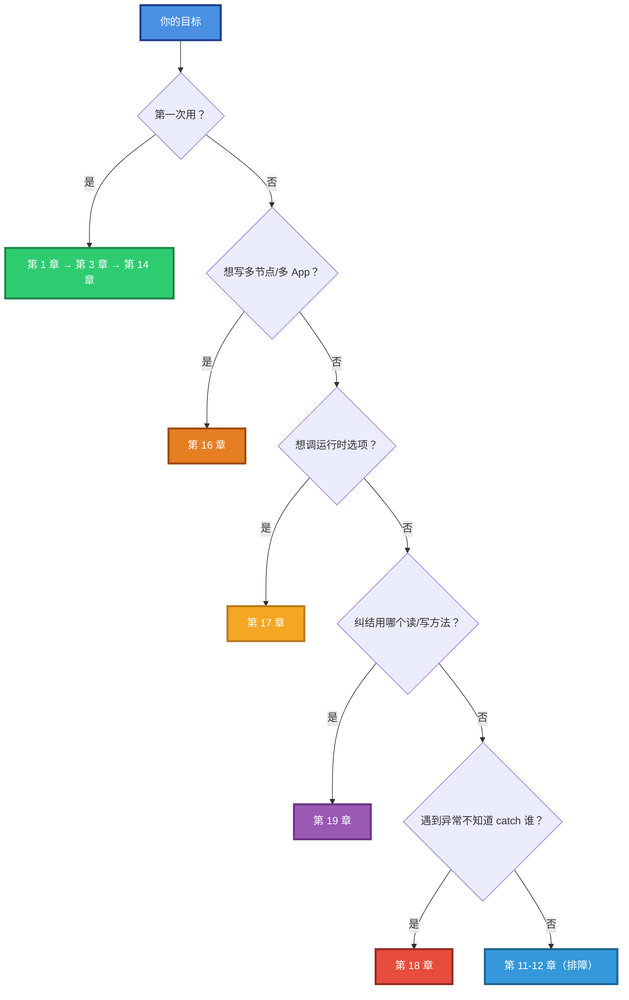

---

# 第 1 章 总览

## 1.1 一句话定义

> **LingoFuse 是一套跨语言、跨进程、跨机器的 RPC 框架。C++ 接口通过 4 个头文件暴露能力：C ABI（`LingoFuse.h`）、统一 I/O（`lf_io.hpp`）、RAII 包装（`LingoFuse.hpp`）、JSON 库（`json.hpp`）。**

## 1.2 三层抽象

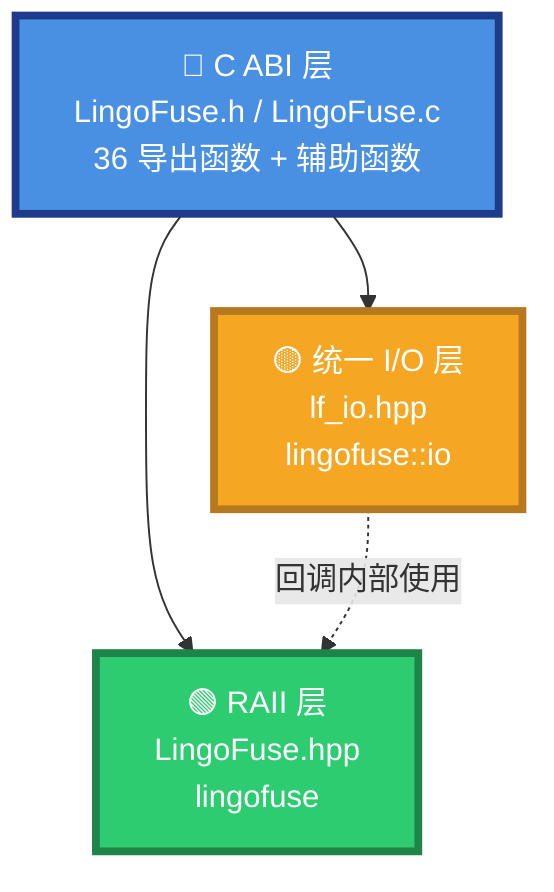

## 1.3 五条铁律（违反任一条 → 崩溃或死锁）

| # | 铁律 | 违反后果 |
|:-:|------|---------|
| 1 | 回调必须 `LF_CDECL` | 栈错位、随机崩溃 |
| 2 | 回调内禁止 `LF_Call` / `LF_Notify` / `LF_LocalCall` | 死锁 |
| 3 | 所有 JSON/字符串 I/O 走 `lingofuse::io` | 帧格式漂移、跨语言失败 |
| 4 | 清理顺序：`exitMainThread` → `FreeApp` → `Shutdown` → `FreeLibrary` | 悬空指针、资源泄漏 |
| 5 | 同一物理地址只能有一个 client（除非 `Overlap_Connection=True`） | 静默丢连接 |

---

# 第 2 章 文件布局与依赖

## 2.1 目录结构

```
LingoFuse/cpp/
├── CMakeLists.txt
├── json.hpp                    nlohmann/json 单文件版
├── LingoFuse.h                 C ABI 声明
├── LingoFuse.c                 C ABI 实现（动态加载 + 转发）
├── LingoFuse.hpp               RAII 包装（header-only）
├── lf_io.hpp                   统一 I/O（header-only）
├── CrossDemo/                  演示程序
└── test/                       测试套件
```

## 2.2 依赖方向（严格单向）

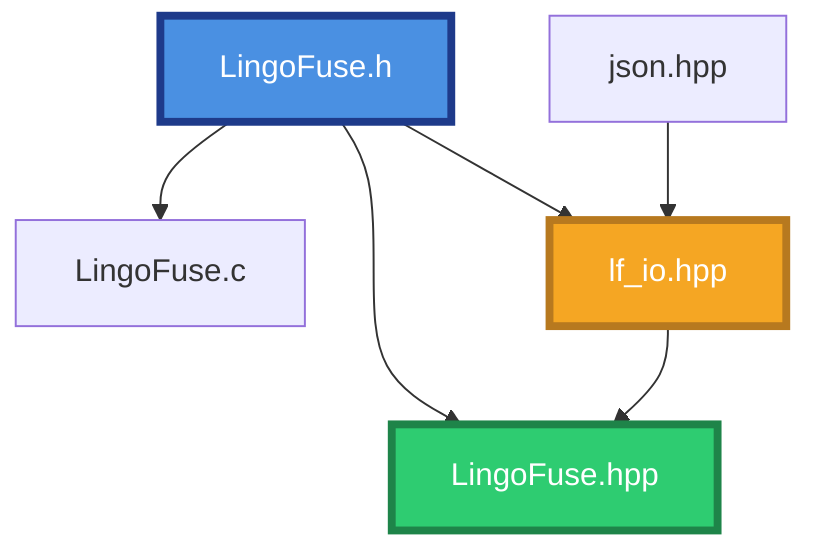

**为什么 `lf_io.hpp` 不依赖 `LingoFuse.hpp`**：回调只收到裸 `TDataHnd`，拿不到 `DataHandle`。`lf_io.hpp` 必须能在无 RAII 包装的场景下工作。

## 2.3 CMake 目标

| 目标 | 类型 | 作用 |
|------|------|------|
| `lingofuse_headers` | INTERFACE | 4 个公开头文件的单一承载点 |
| `lingofuse_c_wrapper` | STATIC | 编译 `LingoFuse.c`，链接平台动态加载库 |
| `test_lingofuse` / `test_lingofuse_json` | EXECUTABLE | 测试套件，输出到 `Binary/` |
| `CrossService` / `CrossNode` / `CrossCall` | EXECUTABLE | 演示程序 |

---

# 第 3 章 运行时机理（核心）

> 本章是理解其余章节的基础。

## 3.1 五个基本抽象

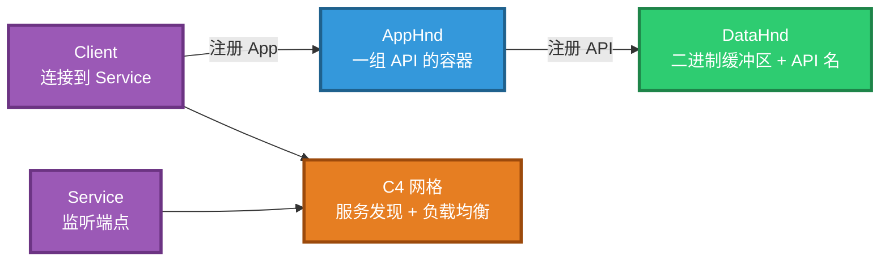

| 抽象 | 底层类型 | 生命周期 | 谁拥有 |
|------|---------|---------|-------|
| **DataHnd** | `TLF_Data` 记录 | 5 分钟不访问 → 自动回收 | 全局句柄池 |
| **AppHnd** | `TLF_App` 对象 | 直到 `LF_Shutdown` | 全局 App 池 |
| **Service** | C4 物理服务 | 直到 `LF_Shutdown` | 内部 |
| **Client** | C4 物理客户端 | 直到 `LF_Shutdown` | 内部 |
| **MESH** | C4 服务网格 | 进程级单例 | 内部 |

## 3.2 主线程模拟器（Simulated_Main_Thread）

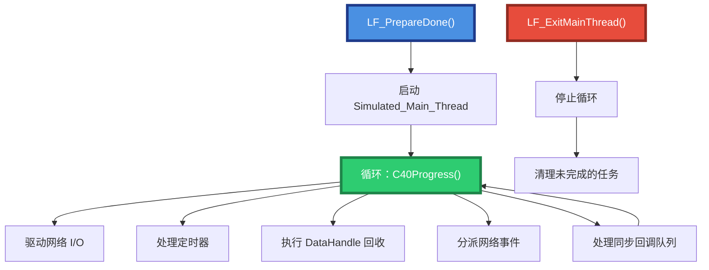

**为什么 `LF_PrepareDone` 每进程只返回 1 一次**：

- 第一次调用启动模拟主线程。
- 第二次调用检测到主线程已运行 → 返回 0（**不是失败**）。
- 要重新启动 → 必须先 `LF_Shutdown()`。

**为什么回调中不能 `LF_Call`**：

- 回调运行在 C4 线程池 worker 线程。
- worker 持有内部锁（用于分派回调）。
- `LF_Call` 需要等模拟主线程分派结果，而模拟主线程又在等内部锁。
- **自锁死**。

## 3.3 C4 服务网格

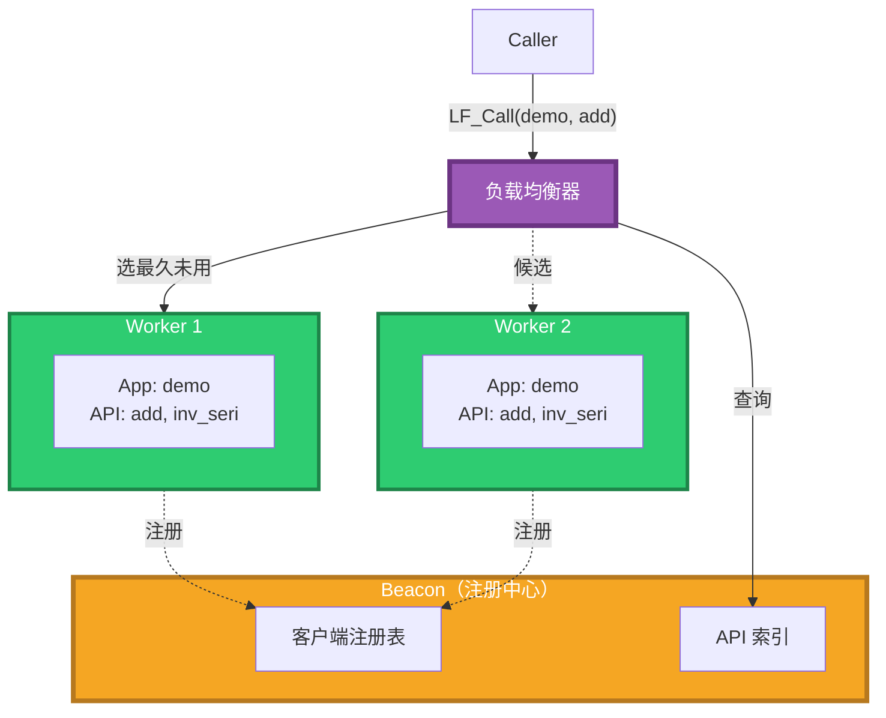

**服务发现流程**：

1. Worker 启动时通过 `LF_PrepareClient(addr, app)` 连接到 Service。
2. Service 广播"某 client 上线，暴露 App demo 的 API X/Y/Z"。
3. 每个 Caller 的本地缓存更新（**约 3 秒延迟**）。
4. Caller 调 `LF_Call("demo", ...)` 时查本地缓存，选出候选 client。
5. 按 **`Cycle_Time_Anchor`（最久未使用）** 挑选 → 实现负载均衡。

**解释三个疑问**：

- **`check_api` 有 3 秒延迟**：它查的是广播更新的本地缓存。
- **多 worker 自动负载均衡**：选择标准是 `Cycle_Time_Anchor`。
- **`LF_Call` 能调用本地 App**：C4 会先查本地实例，避免网络开销。

## 3.4 DataHandle 内存模型

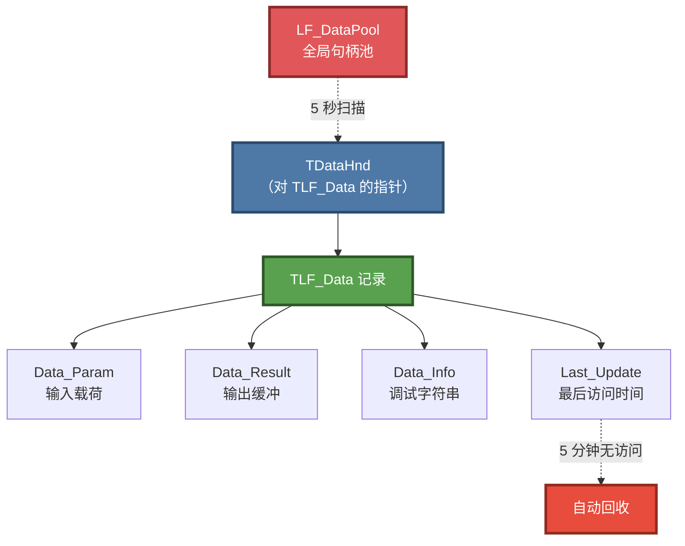

| 特性 | 说明 |
|------|------|
| **`Data_Param` 与 `Data_Result` 互斥** | 输入句柄只有 `Data_Param`，输出句柄只有 `Data_Result` |
| **自动回收** | 每 5 秒扫描一次，5 分钟无访问即释放 |
| **续命机制** | **任何** LF_* 访问都更新 `Last_Update` |
| **不要依赖自动回收** | 高并发下句柄增长快于回收速度 → OOM |

```cpp
// ❌ 错误：创建句柄后遗忘 6 分钟
lingofuse::DataHandle dh("api");
// ... 6 分钟后 ...
dh.write("data");  // 可能已经 use-after-free

// ✅ 正确：用作用域管理
{
    lingofuse::DataHandle dh("api");
    // 立即使用
}
```

## 3.5 三种调用模式的完整生命周期

### 3.5.1 Call（同步请求-响应）

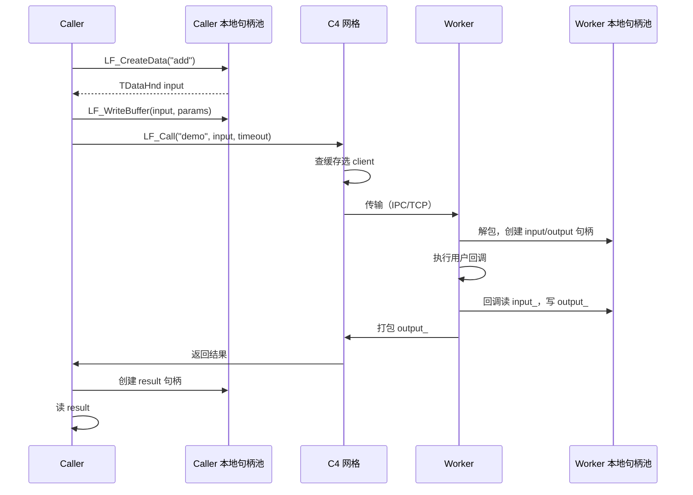

**超时行为**：

- `LF_Call` 超时 → 返回 **size = 0 的空句柄**（**不是 NULL**）。
- C++ `lingofuse::call` → 返回 size = 0 的 `DataHandle`。
- C++ `lingofuse::tryCall` → 返回 `std::nullopt`。

### 3.5.1.1 超时后服务端行为（v3.0 新增）

**关键问题**：客户端超时后，服务端回调是否还在执行？会不会重试时执行两次？

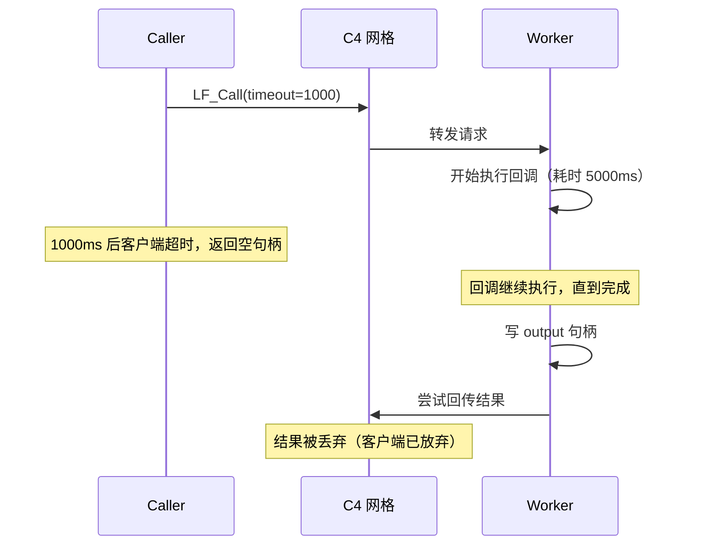

**结论（🟢 已核实源码 `Z.Net.C4.LingoFuse.pas`）**：

| 问题 | 答案 |
|------|------|
| 超时后服务端回调是否继续执行？ | ✅ **继续执行到完成**（不能中途取消） |
| 结果是否被缓存？ | ❌ **不缓存**，直接丢弃 |
| 客户端重试会不会执行两次？ | ✅ **会执行两次**（无幂等保证） |
| 如何避免重复执行？ | 应用层加**幂等键**（如请求 ID） |

**生产建议**：

```cpp
// ❌ 危险：无幂等键，超时重试会重复处理
auto resp = lingofuse::tryCall("Payment", param, 1000);
if (!resp) {
    resp = lingofuse::tryCall("Payment", param, 5000);  // 可能扣款两次
}

// ✅ 安全：请求携带幂等键
param.writeJson({
    {"request_id", generate_uuid()},
    {"amount", 100},
    {"from", "A"},
    {"to", "B"}
});
auto resp = lingofuse::tryCall("Payment", param, 10000);
```

服务端回调根据 `request_id` 去重。

### 3.5.2 Notify（单向通知）

- **不保证顺序**。
- **不保证送达**（尽力送达）。
- **不返回结果**。
- 底层用 `SendCompleteBuffer` + 大包后发 NULL 刷新。

### 3.5.3 Sequenced Notify（FIFO 单向通知）

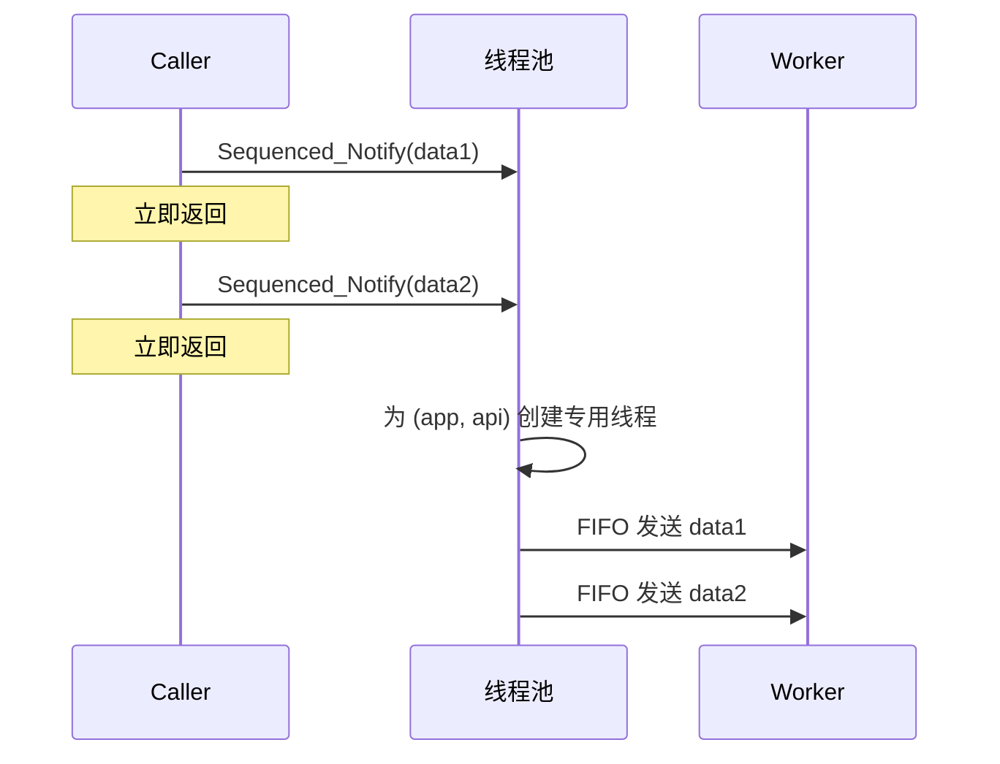

| 特性 | 说明 |
|------|------|
| **每 (app, api) 一对一个线程** | 不同 (app, api) 之间无顺序保证 |
| **线程空闲 5 分钟自动终止** | 下次调用重建（有启动延迟） |
| **大包分片** | 底层 chunked transfer，无需手动分片 |
| **回退阈值** | `Fixed_Sequenced_Time`（默认 20 秒），超时回退到最新 client |

## 3.6 回调线程池

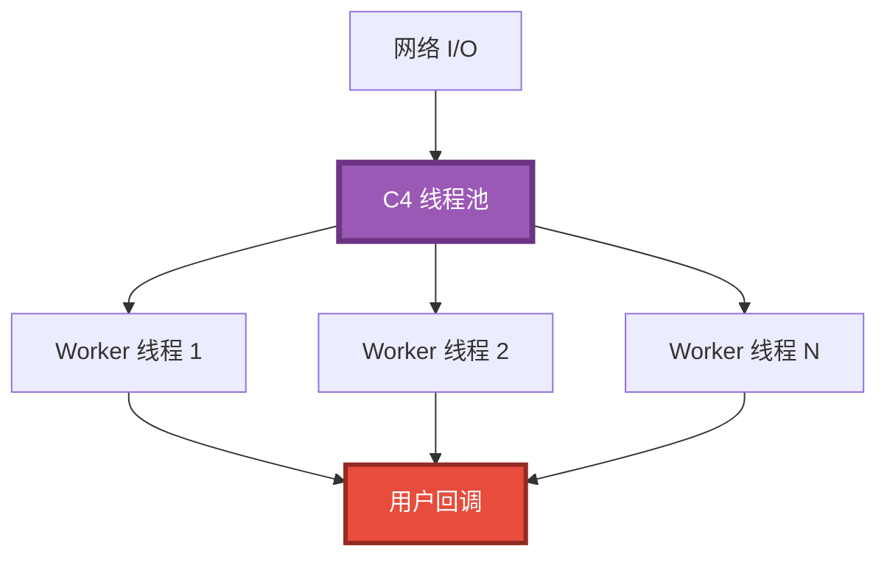

**线程契约**：

- 回调在**后台 worker 线程**执行，不是调用线程，不是主线程。
- **不要阻塞**：一个 worker 阻塞 → 整个池少一个线程。
- **不要调 LF_Call**：见 §3.2 死锁分析。
- **不要操作 UI**：VCL/LCL/Qt 控件非线程安全。
- **`trigger` 参数**：注册时传入的用户指针，回调时原样传回。

## 3.7 状态队列

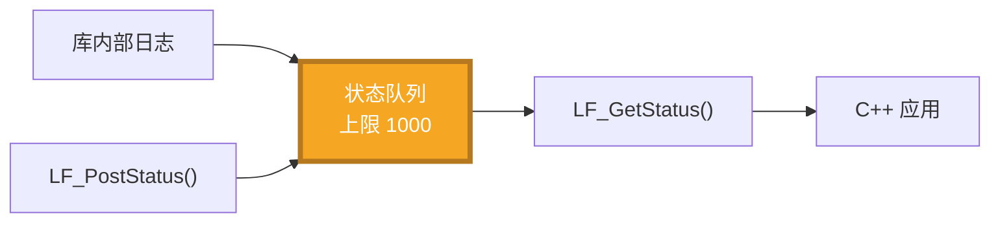

**契约**：

- **上限 1000 条**，超出丢最旧。
- **依赖模拟主线程**：`LF_PrepareDone` 之前查询无效果。
- **`LF_GetStatus` 返回的指针只到下次调用**：立即复制。

---

# 第 4 章 C ABI 层

## 4.1 36 个导出函数

见 §9.1 速查表。此处只讲**行为契约**。

## 4.2 动态加载机理

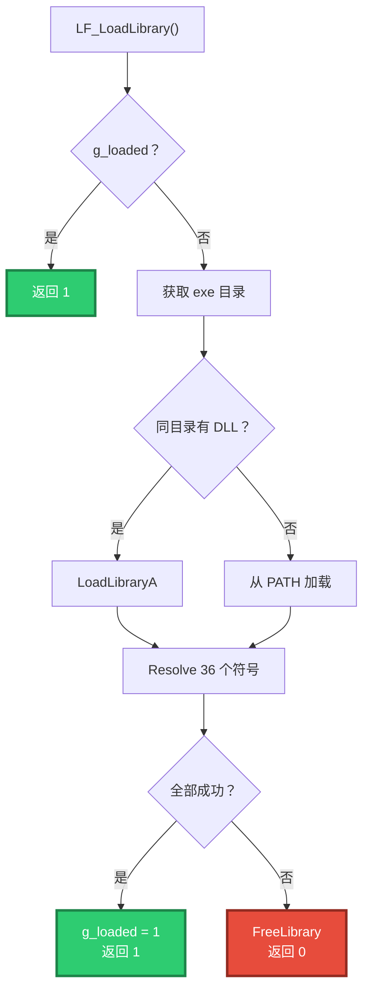

**为什么优先 exe 目录**：允许把 DLL 与 EXE 放一起，无需配置 PATH。

**`LF_FreeLibrary` 后所有函数指针清零**：防止 use-after-unload。

## 4.3 辅助函数（不从 DLL 导出）

| 类别 | 行为 |
|------|------|
| `LF_WriteInt8` 等 | 小端序写入，返回 1 成功 / 0 失败 |
| `LF_WriteString` | **总是**追加 `#0`；`NULL` → 返回 0，不写 |
| `LF_WriteStringBytes` | 同上，但保留嵌入 `#0` |
| `LF_ReadString` | 三态：找到 `#0` / 读到末尾 / 缓冲不足 |
| `LF_ReadStringBytes` | 同上，返回字节数 |

---

# 第 5 章 统一 I/O 层

## 5.1 `lingofuse::io` 的定位

> **C++ 工具链中唯一触碰 `LF_WriteBuffer` / `LF_ReadBuffer` 的 payload 层。**

## 5.2 序列化策略

```cpp
// dumps_json 的实现（等价于）：
obj.dump(
    -1,                                     // 紧凑
    ' ',                                    // 缩进字符（未用）
    false,                                  // ensure_ascii = false
    nlohmann::json::error_handler_t::replace
);
```

| 参数 | 效果 | 为什么 |
|------|------|-------|
| `-1` | 紧凑，无换行 | 与 Python 一致 |
| `false` | 非 ASCII 保持字面 UTF-8 | 跨语言不变 |
| `replace` | 非法 UTF-8 → U+FFFD | 不崩，不静默丢字节 |

## 5.3 三态读取语义

| 场景 | `read_string` / `read_json` | `read_string_bytes` |
|------|---------------------------|---------------------|
| 找到 `#0` | 返回 `#0` 前的字节，游标推进到 `#0 + 1` | 同左 |
| 无 `#0` | 返回全部剩余，游标推进到 `size + 1` | 同左 |
| 游标 ≥ size | 返回空，游标不动 | 返回空，游标不动 |

**`size + 1` 的含义**：底层库隐式扩容 1 字节以容纳新位置，与 Pascal `LF_SetPos(Hnd, e + 1)` 一致。

## 5.4 三态变体读

```cpp
auto v = lingofuse::io::read_json_or_bytes(hnd);

if (std::holds_alternative<std::monostate>(v)) {
    // 空 payload
} else if (std::holds_alternative<nlohmann::json>(v)) {
    // 合法 JSON
    auto& j = std::get<nlohmann::json>(v);
} else {
    // 原始字节
    auto& bytes = std::get<std::vector<std::uint8_t>>(v);
}
```

**用途**：MCP 桥接、LLM 代理等**必须转发非 JSON 响应**的场景。

---

# 第 6 章 RAII 层

## 6.1 `LibraryLoader` 的引用计数机理

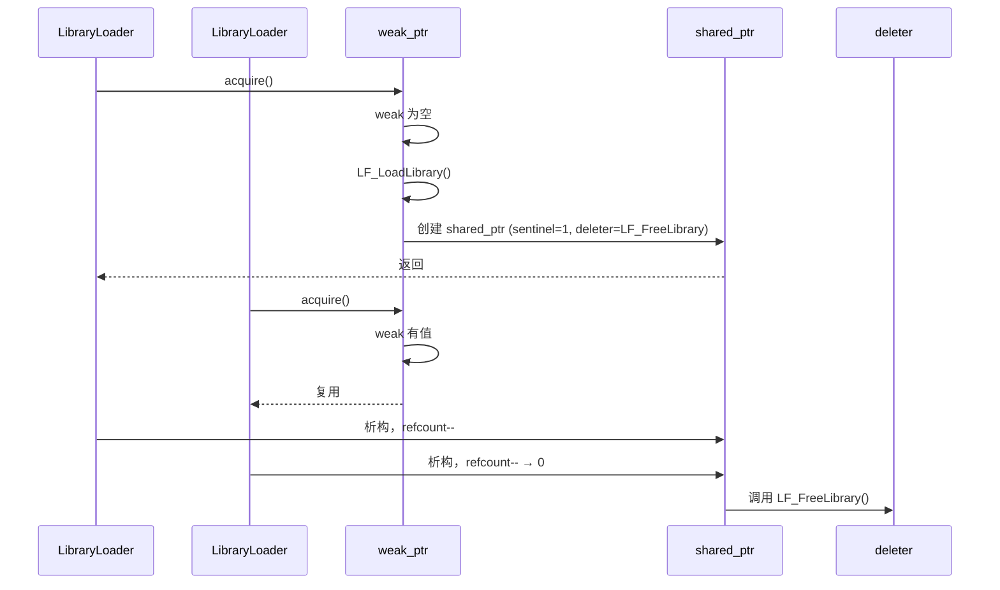

**`reinterpret_cast<void*>(1)` 是哨兵值**，不解引用，只用于 `shared_ptr` 非空约束。

### 6.1.1 网络事件的 `addr` 参数格式（v3.0 新增）

**问题**：网络事件回调 `void LF_CDECL onConnect(const char* addr)` 中的 `addr` 到底是什么？

**答（🟢 已核实源码 `Z.Net.C4.LingoFuse.pas`）**：

| 问题 | 答案 |
|------|------|
| `addr` 是对端地址还是本地地址？ | **对端**（被连接的 Service 地址） |
| 格式是 `ipc:foo` 还是 `ipc:foo:9898`？ | 与 `LF_PrepareClient` 传入的 `physics_addr` **完全一致** |
| TCP 场景示例 | `"127.0.0.1:9898"` |
| IPC 场景示例 | `"ipc:compute_grid"` |
| 一个进程连多个 Service，回调触发几次？ | **每个连接各触发一次 Connect**，Disconnect 同理 |
| 回调里能区分是哪个连接吗？ | ✅ 通过 `addr` 字符串比较 |

**示例**：

```cpp
struct RouterListener : lingofuse::NetworkEventListener {
    void onConnect(const std::string& addr) override {
        if (addr == "ipc:service_a") {
            std::cout << "[A] online\n";
        } else if (addr == "ipc:service_b") {
            std::cout << "[B] online\n";
        } else {
            std::cout << "[?] unknown endpoint: " << addr << "\n";
        }
    }
    void onDisconnect(const std::string& addr) override {
        std::cout << "[-] " << addr << "\n";
    }
};

int main() {
    lingofuse::LibraryLoader loader;
    auto listener = std::make_shared<RouterListener>();
    lingofuse::setNetworkEvent(listener);

    lingofuse::resetPrepare();
    lingofuse::prepareClient("ipc:service_a", nullptr);
    lingofuse::prepareClient("ipc:service_b", nullptr);
    lingofuse::prepareDone();

    // 输出（顺序不定）：
    //   [A] online
    //   [B] online
    std::cin.get();
}
```

## 6.2 `DataHandle` 的方法分类

| 类别 | 方法 | 是否走 `lf_io` |
|------|------|:------------:|
| 标量 I/O | `write<T>` / `read<T>` | ❌ 本地实现 |
| 原始字节 | `writeRaw` / `readRaw` | ❌ 本地实现 |
| 字符串 | `write(string)` / `readString` / `read(string&)` / `readBytes` | ✅ 委托 |
| JSON | `writeJson` / `readJson` | ✅ 委托 |
| 游标 | `seek` / `tell` / `size` / `data` | ❌ 直接调 LF_* |
| 生命周期 | `get` / `release` / `reset` / 析构 | ❌ 直接调 LF_FreeData |

## 6.3 `App` 的生命周期

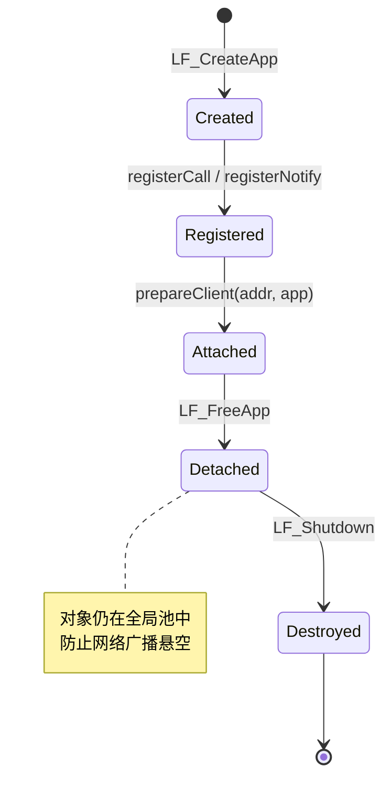

**关键**：`App` 析构（`~App()`）调用 `LF_FreeApp`，**只解绑**，不销毁。真正销毁在 `LF_Shutdown`。

---

# 第 7 章 核心契约

## 7.1 清理顺序

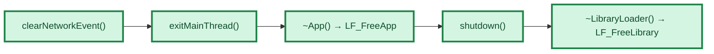

**RAII 保证**：C++ 按声明逆序析构。正确声明顺序：

```cpp
lingofuse::LibraryLoader loader;      // 声明 #1 → 最后析构
ShutdownGuard shutdown_guard;         // 声明 #2 → 中间析构
lingofuse::App app("name");           // 声明 #3 → 最先析构
```

## 7.2 地址唯一性

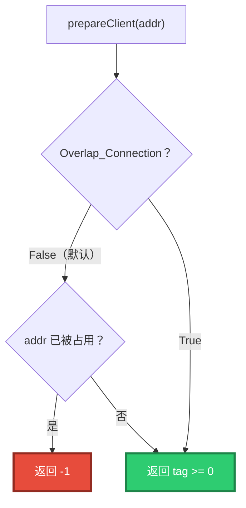

## 7.3 UTF-8 强制契约

所有字符串参数（应用名、API 名、地址、选项名/值）必须是 **UTF-8 + NUL 结尾**。C++ 侧用 `std::string`，内部字节直传，**不做转码**。

---

# 第 8 章 端到端调用链路

## 8.1 从客户端到服务端：一次 `add` 的完整路径

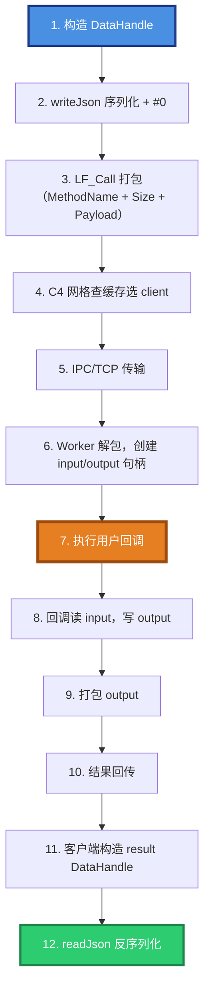

## 8.2 负载均衡路径

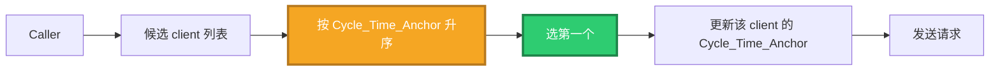

**效果**：请求自动均匀分发到最久未被使用的 worker。

---

# 第 9 章 完整 API 速查

## 9.1 `lingofuse::io`

| 函数 | 返回 | 说明 |
|------|------|------|
| `dumps_json(const json&)` | `string` | JSON → 紧凑 UTF-8 |
| `loads_json(string_view)` | `json` | UTF-8 → JSON，失败抛 `LfIoError` |
| `loads_json(const vector<uint8_t>&)` | `json` | 字节 → JSON |
| `write_string(TDataHnd, string_view)` | `void` | 追加 UTF-8 + `#0` |
| `write_string_bytes(TDataHnd, const void*, size_t)` | `void` | 追加原始 + `#0` |
| `write_string_bytes(TDataHnd, const vector<uint8_t>&)` | `void` | 同上（重载） |
| `read_string(TDataHnd)` | `string` | 容错读到 `#0` |
| `read_string_bytes(TDataHnd)` | `vector<uint8_t>` | 容错读（原始） |
| `peek_string_bytes(TDataHnd)` | `vector<uint8_t>` | 不推进游标 |
| `read_all_bytes(TDataHnd)` | `vector<uint8_t>` | 读到末尾 |
| `write_json(TDataHnd, const json&)` | `void` | JSON + `#0` |
| `read_json(TDataHnd)` | `json` | 严格读，失败抛错 |
| `read_json_or_bytes(TDataHnd)` | `JsonOrBytes` | 三态宽松读 |
| `cstr(string_view)` | `string` | c_char_p 参数 |

## 9.2 `lingofuse`

| 符号 | 说明 |
|------|------|
| `LibraryLoader` | RAII 库加载（引用计数） |
| `DataHandle` | RAII 数据句柄 |
| `App` | RAII 应用句柄 |
| `NetworkEventListener` | 网络事件基类 |
| `Error` / `ErrorCode` | 统一异常 |
| `resetPrepare` / `prepareService` / `prepareClient` / `prepareDone` / `exitMainThread` | 网络准备 |
| `call` / `tryCall` / `notify` / `sequencedNotify` | 远程调用 |
| `setOption` / `checkMainThread` / `checkApp` / `checkApi` | 选项与诊断 |
| `statusCount` / `popStatus` / `postStatus` | 状态队列 |
| `generateAppName` / `getAppName` | 应用名 |
| `shutdown` | 完全关闭 |
| `setNetworkEvent` / `clearNetworkEvent` | 网络事件 |

## 9.3 `ErrorCode`

| 值 | 触发条件 |
|---|---------|
| `Generic` | 未分类 |
| `LibraryLoadFailed` | `LF_LoadLibrary` 失败 |
| `NullHandle` | 空句柄 |
| `InvalidArgument` | 参数非法 |
| `WriteFailed` | 写失败 |
| `ReadFailed` | 读失败 |
| `CallFailed` | 远程调用失败 |
| `RegistrationFailed` | API 注册失败 |
| `NotConnected` | 框架未初始化 |
| `Timeout` | 远程调用超时 |

## 9.4 `call` vs `tryCall`

| 场景 | `call` | `tryCall` |
|------|--------|----------|
| 正常返回 | `DataHandle`（size > 0） | `optional<DataHandle>`（engaged） |
| 超时 | `DataHandle`（size == 0） | `nullopt` |
| 目标不存在 | `DataHandle`（size == 0） | `nullopt` |
| 使用场景 | 需要精确区分超时和空结果 | 只需"有/无" |

**推荐**：几乎总是用 `tryCall`。

### 9.4.1 `setOption` 常用值速查（v3.0 新增）

详见第 17 章。此处仅列**最常用的 3 个**：

| 选项 | 常用值 | 何时用 |
|------|--------|-------|
| `Wait_Ready` | `"True"`（默认）/ `"False"` | 弹性集群（服务端晚启动）设 `False` |
| `Overlap_Connection` | `"True"` / `"False"`（默认） | 同地址多 client 设 `True` |
| `Wait_Connection_Timeout` | `"30000"`（默认，毫秒） | WAN 或慢启动场景加大 |

---

# 第 10 章 跨语言对称性

## 10.1 帧格式逐字节对称

| 生产者 | 输出字节（`{"a":1}`） |
|--------|---------------------|
| Pascal `LF_WriteString` | `7B 22 61 22 3A 31 7D 00` |
| Python `lf_io.write_json` | `7B 22 61 22 3A 31 7D 00` |
| C++ `io::write_json` | `7B 22 61 22 3A 31 7D 00` |

## 10.2 I/O 函数对称

| Python `lf_io` | C++ `lingofuse::io` |
|---|---|
| `dumps_json(obj) -> str` | `dumps_json(const json&) -> string` |
| `write_string(hnd, str)` | `write_string(hnd, string_view)` |
| `read_string(hnd) -> str` | `read_string(hnd) -> string` |
| `write_json(hnd, obj)` | `write_json(hnd, json)` |
| `read_json(hnd)` | `read_json(hnd) -> json` |
| `read_json_or_bytes(hnd)` | `read_json_or_bytes(hnd) -> JsonOrBytes` |
| `cstr(str) -> bytes` | `cstr(string_view) -> string` |

---

# 第 11 章 常见陷阱与排障

## 11.1 陷阱清单（对齐 Pascal LF-* 编号，v3.0 扩展）

| 编号 | 陷阱 | 症状 | 修复 |
|------|------|------|------|
| **LF-APP-001** | 回调缺 `LF_CDECL` | 崩溃 / 参数错乱 | 加 `LF_CDECL` |
| **LF-APP-002** | 期待 `LF_FreeApp` 立即释放 | 内存不降 | 调用 `shutdown()` |
| **LF-APP-003** | `generateAppName` 在 `prepareDone` 前调用 | 名字不唯一 | 移到 `prepareDone` 后 |
| **LF-APP-004** | 保存 `LF_Generate_AppName` 返回的指针 | 5 秒后悬空 | C++ 侧自动复制 |
| **LF-NET-001** | 同地址第二次 `prepareClient` | 返回 -1 | 开 `Overlap_Connection=True` |
| **LF-NET-003** | 第二次 `prepareDone` 期望返回 1 | 返回 0 | 0 不是失败 |
| **LF-NET-004** | `Wait_Ready=False` 后立即调用 | 空结果 | 重试 + `check_api` |
| **LF-NET-005** | 网络事件回调直接操作 UI | 随机崩溃 | 用 `std::thread` 编组 |
| **LF-NET-006** | 保存网络事件回调的 `addr` | 悬空 | 立即复制为 `std::string` |
| **LF-CB-002** | 回调中调 `LF_Call` | 死锁 | 另开线程 |
| **LF-CB-003** | 回调中阻塞 | 线程池耗尽 | 只做轻量操作 |
| **LF-DATA-001** | 忘记 `FreeData` | 内存增长 | 用 `DataHandle` RAII |
| **LF-DATA-004** | 读到无 `#0` 的 payload | 读到全部剩余（正确行为） | 无需处理 |
| **LF-DATA-005** | `writeRaw` 期待追加 `#0` | 数据边界错 | `writeRaw` 不追加，`write` 追加 |
| **LF-CHK-001** | `check_api` 立即返回 False | 3 秒广播延迟 | 重试 3 次，间隔 200ms |
| **LF-CALL-001** | `LF_Call` 超时后判 NULL | NULL 检查失败 | 检查 `size == 0` |
| **LF-XLANG-002** | 中文经 `string` 中转 | 乱码 | 直接写 UTF-8 字节 |
| **LF-CLEAN-001** | 清理顺序错 | 崩溃 | `exitMainThread` → `FreeApp` → `Shutdown` |
| **v3 新增：`write` 误用为 `writeRaw`** | 期望追加 `#0` 但用了 `writeRaw` | 跨语言读不到边界 | 用 `write` / `writeJson` |
| **v3 新增：`setOption` 值格式错** | 写 `"true"`（小写）而非 `"True"` | 选项静默失效 | 用 `"True"` / `"False"` |
| **v3 新增：`shutdown` 后未重建** | `shutdown` 后再 `prepareDone` 失败 | 框架状态残留 | 完整重走 `resetPrepare` → `prepareDone` |
| **v3 新增：`LF_Call` 超时重试导致重复执行** | 无幂等键，业务被处理两次 | 数据损坏 | 请求携带幂等键 |
| **v3 新增：`read_json` + `write_json` 意外重排序** | 原样转发却 key 顺序变了 | 下游 hash 校验失败 | 直接转发原始字节（`read_string_bytes` + `write_string_bytes`） |

## 11.2 排障决策树

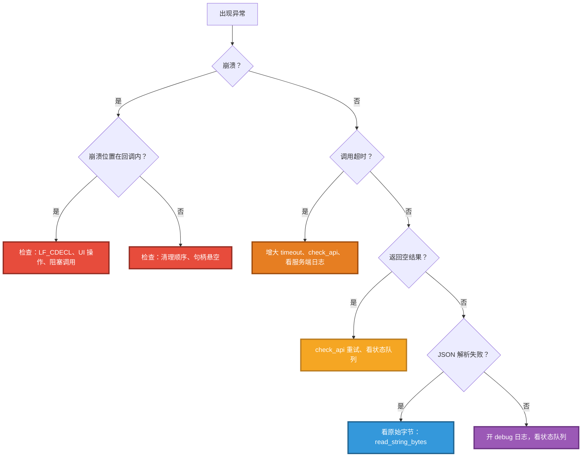

---

# 第 12 章 调试方法

## 12.1 状态队列

```cpp
// 主循环里定期拉取
while (lingofuse::statusCount() > 0) {
    std::string msg = lingofuse::popStatus();
    std::cout << "[LF] " << msg << "\n";
}

// 主动注入自定义日志
lingofuse::postStatus("Custom marker: entering critical section");
```

**前置条件**：必须先 `prepareDone`（模拟主线程运行）。

## 12.2 打开调试日志

```cpp
lingofuse::setOption("ConsoleOutput", "True");
lingofuse::setOption("ShowThreadID", "True");
lingofuse::setOption("Quiet", "False");
```

## 12.3 健康检查

```cpp
// 检查主线程
bool mt_ok = lingofuse::checkMainThread();

// 检查应用（带重试，因广播有 3 秒延迟）
for (int i = 0; i < 15; ++i) {
    if (lingofuse::checkApp("MyApp")) break;
    std::this_thread::sleep_for(std::chrono::milliseconds(200));
}

// 检查 API
bool api_ok = lingofuse::checkApi("MyApp", "my_api");
```

## 12.4 原始字节检查

```cpp
auto raw = lingofuse::io::peek_string_bytes(hnd.get());
std::cout << "Raw bytes (" << raw.size() << "): ";
for (auto b : raw) {
    std::printf("%02X ", b);
}
std::cout << "\n";
```

---

# 第 13 章 构建与测试

## 13.1 目录

```
LingoFuse/
├── Binary/                  ← 所有 EXE 和 DLL
└── cpp/                     ← 源码
```

## 13.2 构建

```bash
cd LingoFuse/cpp
mkdir build && cd build
cmake .. -DCMAKE_BUILD_TYPE=Release
cmake --build . --config Release
```

**输出**：所有可执行文件落到 `LingoFuse/Binary/`。

## 13.3 测试

```bash
cd build
ctest --output-on-failure

# 或
cd LingoFuse/Binary
./test_lingofuse
./test_lingofuse_json
```

| 套件 | 覆盖 | 依赖网络 |
|------|------|:--------:|
| `test_lingofuse` | ABI / RAII / 网络 / 并发 / 压力 | ✅ |
| `test_lingofuse_json` | `lf_io.hpp` 全部 API | ❌ |

---

# 第 14 章 完整示例

## 14.1 服务端：注册 JSON API

```cpp
#include "LingoFuse.hpp"
#include <iostream>

static void LF_CDECL add_cb(void*, void* in, void* out) {
    using namespace lingofuse::io;
    try {
        auto req = read_json(static_cast<TDataHnd>(in));
        const int a = req.value("a", 0);
        const int b = req.value("b", 0);
        write_json(static_cast<TDataHnd>(out), {{"result", a + b}});
    }
    catch (const LfIoError& e) {
        write_json(static_cast<TDataHnd>(out), {{"error", std::string(e.what())}});
    }
}

int main() {
    try {
        lingofuse::LibraryLoader loader;
        lingofuse::App app("Calc", "JSON calc");

        app.registerCall("add", "add two ints", nullptr, add_cb);

        lingofuse::setOption("Wait_Ready", "False");
        lingofuse::resetPrepare();
        lingofuse::prepareService("ipc:calc", "ipc:calc");
        lingofuse::prepareClient("ipc:calc", app.get());

        if (lingofuse::prepareDone() != 1) return 1;

        std::cout << "Ready. Press Enter to exit...\n";
        std::cin.get();

        lingofuse::exitMainThread();
        lingofuse::shutdown();
    }
    catch (const std::exception& e) {
        std::cerr << "Error: " << e.what() << '\n';
        return 1;
    }
    return 0;
}
```

## 14.2 客户端：JSON 调用

```cpp
#include "LingoFuse.hpp"
#include <iostream>

int main() {
    try {
        lingofuse::LibraryLoader loader;

        lingofuse::resetPrepare();
        if (lingofuse::prepareClient("ipc:calc", nullptr) < 0) return 1;
        if (lingofuse::prepareDone() != 1) return 1;

        for (int i = 0; i < 15; ++i) {
            if (lingofuse::checkApi("Calc", "add")) break;
            std::this_thread::sleep_for(std::chrono::milliseconds(200));
        }

        lingofuse::DataHandle param("add");
        param.writeJson({{"a", 5}, {"b", 7}});

        auto resp = lingofuse::tryCall("Calc", param, 3000);
        if (!resp) {
            std::cerr << "call failed\n";
            return 1;
        }

        resp->seek(0);
        auto j = resp->readJson();
        std::cout << "5 + 7 = " << j.at("result").get<int>() << '\n';

        lingofuse::exitMainThread();
        lingofuse::shutdown();
    }
    catch (const std::exception& e) {
        std::cerr << "Error: " << e.what() << '\n';
        return 1;
    }
    return 0;
}
```

## 14.3 回调中只用 `lf_io.hpp`

```cpp
#include "lf_io.hpp"    // 只依赖 LingoFuse.h + json.hpp

static void LF_CDECL echo_cb(void*, void* in, void* out) {
    using namespace lingofuse::io;
    auto j = read_json(static_cast<TDataHnd>(in));
    write_json(static_cast<TDataHnd>(out), j);
}
```

> **⚠️ v3.0 修正**：`read_json` + `write_json` 会**重新序列化**，可能导致：
> - 对象 key **按字典序重排序**（nlohmann::json 默认行为）
> - 空白字符被压缩
> - 数字格式规范化（`1.0` → `1.0`，`1e2` → `100.0`）
>
> **若需字节级原样转发**（下游做 hash 校验、签名验证等），必须用：
>
> ```cpp
> static void LF_CDECL raw_forward_cb(void*, void* in, void* out) {
>     auto raw = lingofuse::io::read_string_bytes(
>         static_cast<TDataHnd>(in));
>     lingofuse::io::write_string_bytes(
>         static_cast<TDataHnd>(out), raw);
> }
> ```

## 14.4 网络事件监听（OOP 风格）

```cpp
#include "LingoFuse.hpp"
#include <memory>
#include <iostream>

struct MyListener : lingofuse::NetworkEventListener {
    void onConnect(const std::string& addr) override {
        std::cout << "[+] Connected: " << addr << "\n";
    }
    void onDisconnect(const std::string& addr) override {
        std::cout << "[-] Disconnected: " << addr << "\n";
    }
};

int main() {
    lingofuse::LibraryLoader loader;

    auto listener = std::make_shared<MyListener>();
    lingofuse::setNetworkEvent(listener);

    lingofuse::resetPrepare();
    lingofuse::prepareClient("ipc:calc", nullptr);
    lingofuse::prepareDone();

    std::cin.get();

    lingofuse::clearNetworkEvent();
    lingofuse::exitMainThread();
    lingofuse::shutdown();
    return 0;
}
```

## 14.5 多节点负载均衡拓扑

```bash
# 终端 1：协调者
./CrossService

# 终端 2-4：开 3 个 worker
./CrossNode    # 重复 3 次

# 终端 5-6：开 2 个客户端压测
./CrossCall    # 重复 2 次
```

观察：3 个 worker 的输出行数大致均匀 → 负载均衡生效。

---

# 第 15 章 诚实的不确定清单

| # | 不确定点 | 状态 |
|---|---------|:----:|
| 1 | `json.hpp` 精确版本 | 🟡 |
| 2 | `LibraryLoader` 多 DLL 场景 | ⏳ |
| 3 | 超大 payload（>100MB）性能 | ⏳ |
| 4 | `dumps_json` 对循环引用 JSON 的行为 | ⏳ |
| 5 | `LF_CDECL` 在 MinGW 64 位的精确展开 | ⏳ |
| 6 | `App::bind()` 返回 0 的完整条件 | 🟡 |
| 7 | Sequenced Notify 线程空闲 5 分钟后的重建延迟 | ⏳ |
| 8 | 广播延迟在 WAN 环境下的分布 | ⏳ |

---

# 第 16 章 多节点与多 App（v3.0 新增）

> 本章覆盖 v2.0 缺失的**多节点拓扑**场景。

## 16.1 场景分类

```mermaid
flowchart TD
    S["你要写的程序"] --> Q1{"要连几个 Service？"}
    Q1 -- 1 --> Q2{"要绑几个 App？"}
    Q2 -- 1 --> A["单 client + 单 App<br/>（第 14 章已覆盖）"]
    Q2 -- "N > 1" --> B["单 client + 多 App<br/>（§16.2）"]
    Q1 -- "N > 1" --> Q3{"每个 Service 绑几个 App？"}
    Q3 -- 1 --> C["多 client + 每 client 单 App<br/>（§16.3）"]
    Q3 -- "N > 1" --> D["多 client + 每 client 多 App<br/>（§16.4）"]

    style S fill:#4A90E2,stroke:#1E3A8A,stroke-width:3px,color:#FFFFFF
    style A fill:#D5F5E3,stroke:#1E8449,stroke-width:3px,color:#0E4D2A
    style B fill:#F5A623,stroke:#B7791F,stroke-width:3px,color:#FFFFFF
    style C fill:#F5A623,stroke:#B7791F,stroke-width:3px,color:#FFFFFF
    style D fill:#E67E22,stroke:#9C4A0C,stroke-width:3px,color:#FFFFFF
```

## 16.2 单 client + 多 App（`Overlap_Connection=True`）

**目标**：同一进程，连一个 Service，暴露两个独立 App。

```cpp
#include "LingoFuse.hpp"
#include <iostream>

static void LF_CDECL app_a_cb(void*, void* in, void* out) {
    lingofuse::io::write_json(static_cast<TDataHnd>(out),
                              {{"app", "A"}});
}

static void LF_CDECL app_b_cb(void*, void* in, void* out) {
    lingofuse::io::write_json(static_cast<TDataHnd>(out),
                              {{"app", "B"}});
}

int main() {
    try {
        lingofuse::LibraryLoader loader;

        lingofuse::App app_a("ServiceA", "App A");
        lingofuse::App app_b("ServiceB", "App B");
        app_a.registerCall("ping", "ping A", nullptr, app_a_cb);
        app_b.registerCall("ping", "ping B", nullptr, app_b_cb);

        // 关键：开启 Overlap_Connection，允许同一地址多个 client
        lingofuse::setOption("Overlap_Connection", "True");
        lingofuse::setOption("Wait_Ready", "False");

        lingofuse::resetPrepare();
        lingofuse::prepareService("ipc:multi", "ipc:multi");

        // 两次 prepareClient 使用同一个地址，绑定不同的 App
        int tag_a = lingofuse::prepareClient("ipc:multi", app_a.get());
        int tag_b = lingofuse::prepareClient("ipc:multi", app_b.get());

        std::cout << "tag_a=" << tag_a << " tag_b=" << tag_b << "\n";
        // 期望输出：tag_a=1 tag_b=2（两个不同的 tag）

        if (lingofuse::prepareDone() != 1) return 1;

        std::cout << "Ready. Press Enter to exit...\n";
        std::cin.get();

        lingofuse::exitMainThread();
        lingofuse::shutdown();
    }
    catch (const std::exception& e) {
        std::cerr << "Error: " << e.what() << '\n';
        return 1;
    }
    return 0;
}
```

**验证**（另一个进程的客户端）：

```cpp
// 分别调用两个 App，各自响应
auto r1 = lingofuse::tryCall("ServiceA", p, 1000);  // {"app":"A"}
auto r2 = lingofuse::tryCall("ServiceB", p, 1000);  // {"app":"B"}
```

## 16.3 多 client + 每 client 单 App

**目标**：同一进程，连两个不同 Service，各自绑一个 App。

```cpp
#include "LingoFuse.hpp"

int main() {
    lingofuse::LibraryLoader loader;

    lingofuse::App app_x("ClientX", "for service 1");
    lingofuse::App app_y("ClientY", "for service 2");
    // ... 注册各自的 API ...

    lingofuse::setOption("Wait_Ready", "False");
    lingofuse::resetPrepare();

    // 两个不同地址 → 两个独立 client
    int t1 = lingofuse::prepareClient("ipc:service_1", app_x.get());
    int t2 = lingofuse::prepareClient("ipc:service_2", app_y.get());
    // 不需要 Overlap_Connection，因为地址不同

    lingofuse::prepareDone();
    // ...
}
```

**关键点**：

- **地址不同** → 无需 `Overlap_Connection`。
- 两个 client 各自独立，互不干扰。

## 16.4 多 client + 每 client 多 App

**目标**：同一进程，连两个不同 Service，每个 Service 上暴露多个 App。

```cpp
lingofuse::App a1("A1"), a2("A2"), b1("B1"), b2("B2");
// ... 注册 ...

lingofuse::setOption("Overlap_Connection", "True");
lingofuse::setOption("Wait_Ready", "False");
lingofuse::resetPrepare();

lingofuse::prepareService("ipc:svc_1", "ipc:svc_1");
lingofuse::prepareService("ipc:svc_2", "ipc:svc_2");

// 每个 Service 上开两个 App
lingofuse::prepareClient("ipc:svc_1", a1.get());
lingofuse::prepareClient("ipc:svc_1", a2.get());
lingofuse::prepareClient("ipc:svc_2", b1.get());
lingofuse::prepareClient("ipc:svc_2", b2.get());

lingofuse::prepareDone();
```

## 16.5 `LF_BindApp` 的用法

**问题**：`prepareClient` 时没传 App，之后能补绑吗？

**答**：能，用 `App::bind()`。它把 App 绑定到**所有当前空闲的 client**。

```cpp
lingofuse::App app("LateBind", "bind after prepare");

lingofuse::resetPrepare();
lingofuse::prepareService("ipc:s1", "ipc:s1");
lingofuse::prepareService("ipc:s2", "ipc:s2");

// 先准备 client 但不绑 App
lingofuse::prepareClient("ipc:s1", nullptr);
lingofuse::prepareClient("ipc:s2", nullptr);

lingofuse::prepareDone();

// 之后绑定
int bound = app.bind();
std::cout << "Bound to " << bound << " clients\n";
// 期望：Bound to 2 clients
```

**`bind()` 返回 0 的条件**：

| 条件 | 说明 |
|------|------|
| 主线程未运行 | `prepareDone` 未调用或失败 |
| 所有 client 已占用 | 每个 client 只能绑一个 App |
| App 已失效 | `App` 对象已 `free()` |

## 16.6 `LF_BindApp` vs `prepareClient(addr, app)` 对比

| 维度 | `prepareClient(addr, app)` | `App::bind()` |
|------|---------------------------|--------------|
| **绑定时机** | 准备阶段 | 框架运行后 |
| **绑定对象** | 指定地址 | 所有空闲 client |
| **典型场景** | 服务端启动时 | 动态添加 App |
| **是否需要 `Overlap`** | 同地址多次需要 | 不需要（client 已存在） |

## 16.7 负载均衡观察

同一 App 的多个 worker 注册到同一 Beacon：

```cpp
// Worker 进程 × N（每个进程运行一次）
lingofuse::App app("demo", "worker");
app.registerCall("add", "...", nullptr, add_cb);
lingofuse::setOption("Wait_Ready", "False");
lingofuse::resetPrepare();
lingofuse::prepareClient("ipc:beacon", app.get());
lingofuse::prepareDone();
```

Caller 侧：

```cpp
// 调用 100 次
for (int i = 0; i < 100; ++i) {
    lingofuse::DataHandle p("add");
    p.writeJson({{"a", i}, {"b", i}});
    auto resp = lingofuse::tryCall("demo", p, 1000);
    // ...
}
```

**观察**：N 个 worker 进程各自处理约 `100 / N` 个请求（`Cycle_Time_Anchor` 负载均衡）。

---

# 第 17 章 `LF_SetOption` 选项语义表（v3.0 新增）

## 17.1 选项总表

| 选项名 | 别名 | 类型 | 默认值 | 说明 |
|--------|------|------|--------|------|
| **`password`** | `passwd` | string | 空 | C4 P2PVM 认证 token |
| **`Quiet`** | — | bool | `False` | 安静模式，抑制大部分日志 |
| **`ShowThreadID`** | `ShowThread` / `Show_Thread` | bool | `False` | 日志显示线程 ID |
| **`ConsoleOutput`** | `Console_Output` | bool | 控制台程序 `True`，GUI 程序 `False` | 是否输出到控制台 |
| **`Overlap_Connection`** | `Overlap_Client` / `OverlapConnection` / `OverlapClient` / `OverlapConnect` | bool | `False` | 允许同地址多 client |
| **`Wait_Connection_ReadyOk`** | `Wait_API_Prepare_Done` / `API_Prepare_Done_Wait` / `WaitConnect` / `Wait_Ready` / `WaitReady` | bool | `True` | `prepareDone` 是否等待所有 client 就绪 |
| **`Wait_Connection_Timeout`** | `Wait_TimeOut` / `API_Prepare_Done_TimeOut` / `WaitTimeOut` | int（毫秒） | `30000` | 上述等待的超时 |
| **`IPC_Serv_ThreadCount`** | `IPC_ThreadCount` / `IPC_Server_ThreadCount` | int | 平台默认 | IPC 服务线程数 |
| **`IPC_Serv_MaxQueueLength`** | `IPC_MaxQueueLength` / `IPC_Server_MaxQueueLength` | int | 平台默认 | IPC 消息队列长度 |
| **`IPC_Serv_MaxMsgSize`** | `IPC_MaxMsgSize` / `IPC_Server_MaxMsgSize` | int（字节） | 平台默认 | 单条 IPC 消息最大字节 |
| **`Fixed_Sequenced_Time`** | `Fixed_Sequenced_Life` | int（毫秒） | `20000` | Sequenced Notify 回退阈值 |

## 17.2 值格式

| 类型 | 接受的值 | 示例 |
|------|---------|------|
| **bool** | `"True"` / `"False"` / `"1"` / `"0"` / `"Yes"` / `"No"`（大小写不敏感） | `setOption("Wait_Ready", "True")` |
| **int** | 十进制字符串 | `setOption("Wait_Connection_Timeout", "60000")` |
| **string** | 原样 | `setOption("password", "secret123")` |

**⚠️ 常见错误**：写 `"true"`（全小写）在**某些版本**可能不识别。**统一用 `"True"` / `"False"`。**

## 17.3 关键选项详解

### 17.3.1 `Wait_Ready`（部署模式开关）

```mermaid
flowchart TD
    A["prepareDone()"] --> B{"Wait_Ready？"}
    B -- "True（默认）" --> C["阻塞等待所有 client 就绪<br/>（或超时）"]
    B -- "False" --> D["立即返回"]
    C --> E["保证：prepareDone 返回 1 后<br/>所有 client 在线"]
    D --> F["需要自行重试<br/>目标可能未就绪"]

    style C fill:#2ECC71,stroke:#1E8449,stroke-width:3px,color:#FFFFFF
    style D fill:#F5A623,stroke:#B7791F,stroke-width:3px,color:#FFFFFF
    style E fill:#D5F5E3,stroke:#1E8449,stroke-width:2px,color:#0E4D2A
    style F fill:#FFF7E6,stroke:#B7791F,stroke-width:2px,color:#7E5109
```

| 场景 | 建议值 |
|------|-------|
| 单机开发 | `"True"`（默认） |
| 弹性集群（服务端晚启动） | `"False"` |
| 快速启动优先 | `"False"` |
| 强一致启动 | `"True"` |

**`"False"` 时的客户端重试模式**：

```cpp
lingofuse::setOption("Wait_Ready", "False");
// ... prepareDone ...

// 调用前检查 + 重试
for (int attempt = 0; attempt < 30; ++attempt) {
    if (lingofuse::checkApi("TargetApp", "target_api")) {
        break;
    }
    std::this_thread::sleep_for(std::chrono::milliseconds(200));
}
// 现在可以安全调用
auto resp = lingofuse::tryCall("TargetApp", param, 3000);
```

### 17.3.2 `Overlap_Connection`

| 值 | 行为 |
|----|------|
| `"False"`（默认） | 同地址第二次 `prepareClient` 返回 -1；App 被静默忽略 |
| `"True"` | 每次 `prepareClient` 创建新隧道，绑定传入的 App |

**必须设 `"True"` 的场景**：

- 同进程要向同一地址暴露多个 App。
- 同进程要多次连接同一 Service。

**设 `"True"` 的代价**：

- 每个 client 独立隧道 → 内存和文件描述符略增。
- 一般可接受。

### 17.3.3 `Wait_Connection_Timeout`

```cpp
// 默认 30 秒；WAN 或慢启动场景加大
lingofuse::setOption("Wait_Connection_Timeout", "60000");
```

**注意**：超时后 `prepareDone` 仍返回 1（成功），但部分 client 可能未就绪。**配合重试逻辑**。

### 17.3.4 `Fixed_Sequenced_Time`

**问题**：Sequenced Notify 均匀分发会一直选同一个"最旧"client，导致某些 client 饿死。

**解决**：`Fixed_Sequenced_Time` 定义回退阈值。若候选 client 的 `Fixed_Sequenced_Temp_Time` 距今超过阈值，**回退到最新 client**。

```cpp
// 缩短到 5 秒（默认 20 秒）
lingofuse::setOption("Fixed_Sequenced_Time", "5000");
```

## 17.4 选项作用域与持久化

| 特性 | 值 |
|------|-----|
| **作用域** | 进程全局 |
| **生效时机** | 立即（对后续操作） |
| **持久化** | ❌ `shutdown()` 后丢失 |
| **未知选项** | **静默忽略**（不报错、不警告） |
| **大小写** | 选项名大小写不敏感 |

**未知选项静默忽略的坑**：

```cpp
lingofuse::setOption("WaitReady", "True");     // ✅ 别名，生效
lingofuse::setOption("Wait_Ready ", "True");   // ❌ 尾随空格，静默失效
lingofuse::setOption("wait_ready", "True");    // ✅ 大小写不敏感，生效
```

**调试建议**：调用后用 `checkMainThread` 或状态队列验证。

## 17.5 常用配置配方

| 场景 | 命令 |
|------|------|
| **单机开发** | 保持默认 |
| **弹性集群（无序启动）** | `Wait_Ready=False` |
| **同地址多 App** | `Overlap_Connection=True` |
| **WAN 慢启动** | `Wait_Connection_Timeout=60000` |
| **关闭日志** | `Quiet=True` + `ConsoleOutput=False` |
| **调试线程问题** | `ShowThreadID=True` |
| **高频 Sequenced Notify** | `Fixed_Sequenced_Time=5000` |

---

# 第 18 章 异常体系与错误处理（v3.0 新增）

## 18.1 两个异常类的来源

```mermaid
flowchart TB
    IO["lf_io.hpp"] --> E1["lingofuse::io::LfIoError<br/>（继承 std::runtime_error）"]
    HPP["LingoFuse.hpp"] --> E2["lingofuse::Error<br/>（继承 std::runtime_error）<br/>带 ErrorCode"]

    style E1 fill:#F5A623,stroke:#B7791F,stroke-width:4px,color:#FFFFFF
    style E2 fill:#E74C3C,stroke:#922B21,stroke-width:4px,color:#FFFFFF
```

| 异常类 | 头文件 | 携带信息 | 触发场景 |
|--------|--------|---------|---------|
| **`lingofuse::io::LfIoError`** | `lf_io.hpp` | `what()`（字符串） | `lingofuse::io` 层的 I/O 失败 |
| **`lingofuse::Error`** | `LingoFuse.hpp` | `what()` + `code()`（`ErrorCode`） | RAII 层的所有失败 |

## 18.2 映射关系

```mermaid
flowchart LR
    IO["io::write_json / io::read_json / ..."] -->|抛| LFIO["io::LfIoError"]
    LFIO -->|DataHandle 捕获并转换| LFERR["lingofuse::Error<br/>code = WriteFailed / ReadFailed"]
    RAW["io::write_string(nullptr, ...)"] -->|直接抛| LFIO2["io::LfIoError<br/>（未被 RAII 捕获）"]

    style LFIO fill:#F5A623,stroke:#B7791F,stroke-width:3px,color:#FFFFFF
    style LFERR fill:#E74C3C,stroke:#922B21,stroke-width:3px,color:#FFFFFF
    style LFIO2 fill:#F5A623,stroke:#B7791F,stroke-width:3px,color:#FFFFFF
```

**规则**：

| 调用路径 | 抛出的异常 |
|---------|-----------|
| `DataHandle::writeJson(j)` | `lingofuse::Error`（code = `WriteFailed`） |
| `DataHandle::readJson()` | **不抛**，失败返回 `json()`（null） |
| `DataHandle::write(string)` | `lingofuse::Error`（code = `WriteFailed`） |
| `DataHandle::write<T>(T)` | `lingofuse::Error`（code 可能是 `NullHandle` / `WriteFailed`） |
| `io::write_json(hnd, j)`（裸 `TDataHnd`） | `io::LfIoError` |
| `io::read_json(hnd)`（裸 `TDataHnd`） | `io::LfIoError` |
| `io::loads_json(text)` | `io::LfIoError` |
| `lingofuse::call(app, p, t)` | **不抛**，返回 size=0 的 `DataHandle` |
| `App::registerCall(...)`（重名） | 返回 `false`（不抛） |
| `App::registerCall(...)`（App 已释放） | `lingofuse::Error`（code = `NullHandle`） |
| `LibraryLoader` 构造失败 | `lingofuse::Error`（code = `LibraryLoadFailed`） |

## 18.3 统一异常处理策略

**推荐 catch 顺序**：

```cpp
try {
    // 业务代码
    lingofuse::DataHandle p("api");
    p.writeJson(payload);

    auto resp = lingofuse::tryCall("app", p, 3000);
    if (!resp) {
        // 超时或目标不存在
    }
    // ...
}
catch (const lingofuse::Error& e) {
    // RAII 层的错误（带 ErrorCode）
    switch (e.code()) {
        case lingofuse::ErrorCode::Timeout:
            std::cerr << "Timeout: " << e.what() << "\n";
            break;
        case lingofuse::ErrorCode::WriteFailed:
            std::cerr << "Write failed: " << e.what() << "\n";
            break;
        // ...
        default:
            std::cerr << "Error " << static_cast<int>(e.code())
                      << ": " << e.what() << "\n";
    }
}
catch (const lingofuse::io::LfIoError& e) {
    // 只在直接调用 io::* 时触发
    std::cerr << "I/O error: " << e.what() << "\n";
}
catch (const std::exception& e) {
    std::cerr << "Other: " << e.what() << "\n";
}
```

## 18.4 `ErrorCode` 各值的触发场景

| `ErrorCode` | 触发位置 | 修复 |
|-------------|---------|------|
| `Generic` | `LF_CreateData` / `LF_CreateApp` 返回 NULL | 内存不足或参数非法 |
| `LibraryLoadFailed` | `LibraryLoader` 构造 | 检查 DLL 是否在 PATH 或 exe 目录 |
| `NullHandle` | 对已释放的 `DataHandle` / `App` 操作 | 检查生命周期 |
| `InvalidArgument` | `writeRaw(nullptr, n>0)` | 检查参数 |
| `WriteFailed` | `write` / `writeJson` / `writeRaw` 失败 | 通常因句柄无效 |
| `ReadFailed` | `read` 系列失败 | 通常因句柄无效 |
| `CallFailed` | `App::localCall` 返回 NULL | 罕见；检查 API 是否注册 |
| `RegistrationFailed` | `registerCall` / `registerNotify` 失败 | 检查 API 名是否重复 |
| `NotConnected` | 未 `prepareDone` 就调远程 | 先 `prepareDone` |
| `Timeout` | **从不**自动抛出（用 `tryCall` 的 `nullopt` 代替） | 检查超时参数 |

## 18.5 常见错误处理模式

### 18.5.1 初始化失败（RAII 抛出）

```cpp
try {
    lingofuse::LibraryLoader loader;
    lingofuse::App app("MyApp");
} catch (const lingofuse::Error& e) {
    if (e.code() == lingofuse::ErrorCode::LibraryLoadFailed) {
        std::cerr << "Cannot load LingoFuse DLL. "
                     "Ensure it is next to the exe or in PATH.\n";
        return 1;
    }
    throw;
}
```

### 18.5.2 远程调用失败（不抛，用 `optional`）

```cpp
auto resp = lingofuse::tryCall("app", param, 3000);
if (!resp) {
    // 三种可能：目标不存在 / 超时 / 服务端异常
    std::cerr << "Call failed (timeout or target unreachable)\n";
    return 1;
}
```

### 18.5.3 回调中的异常隔离

**回调里必须自己 try/catch**，因为异常不能穿透 C 栈：

```cpp
static void LF_CDECL safe_cb(void*, void* in, void* out) {
    try {
        // 业务逻辑
        auto j = lingofuse::io::read_json(static_cast<TDataHnd>(in));
        // ...
    }
    catch (const std::exception& e) {
        // 必须捕获，否则 ctypes / C 栈行为未定义
        std::cerr << "Callback error: " << e.what() << "\n";
        // 可选：写错误响应
        try {
            lingofuse::io::write_json(
                static_cast<TDataHnd>(out),
                {{"error", std::string(e.what())}});
        }
        catch (...) {
            // 连错误响应都写不进去，只能吞掉
        }
    }
    catch (...) {
        std::cerr << "Callback error: unknown\n";
    }
}
```

## 18.6 与 Pascal / Python 的异常对照

| 场景 | C++ | Python | Pascal |
|------|-----|--------|--------|
| I/O 失败 | `LfIoError` / `Error` | `LingoFuseError` | 静默吞掉 |
| 远程调用失败 | `tryCall` 返回 `nullopt` | 抛 `TimeoutError` | 返回空句柄 |
| 注册失败 | 返回 `false` | 抛 `RegistrationError` | 返回 0 |
| 库加载失败 | `Error(LibraryLoadFailed)` | `LingoFuseError` | 无（DLL 加载失败） |
| 回调内异常 | **必须 try/catch** | 自动隔离 + 日志 | 库自动 try/except |

**C++ 侧的特殊性**：异常不能穿透 C 栈。回调里**必须**自己 try/catch。

---

# 第 19 章 读写方法选择指南（v3.0 新增）

## 19.1 决策树：写方法

```mermaid
flowchart TD
    S["要写什么？"] --> Q1{"JSON 对象？"}
    Q1 -- 是 --> W1["✅ writeJson(j)<br/>或 io::write_json(hnd, j)"]
    Q1 -- 否 --> Q2{"UTF-8 字符串？"}
    Q2 -- 是 --> W2["✅ write(string)<br/>或 io::write_string(hnd, s)"]
    Q2 -- 否 --> Q3{"原始字节序列？"}
    Q3 -- 是 --> Q4{"需要追加 NUL？"}
    Q4 -- 是 --> W3["✅ write(vector<uint8_t>)<br/>或 io::write_string_bytes"]
    Q4 -- 否 --> W4["✅ writeRaw(ptr, len)<br/>（不追加 NUL）"]
    Q3 -- 否 --> Q5{"原子标量？"}
    Q5 -- 是 --> W5["✅ write<T>(value)<br/>（小端序）"]
    Q5 -- 否 --> W6["自定义序列化"]

    style W1 fill:#2ECC71,stroke:#1E8449,stroke-width:3px,color:#FFFFFF
    style W2 fill:#2ECC71,stroke:#1E8449,stroke-width:3px,color:#FFFFFF
    style W3 fill:#2ECC71,stroke:#1E8449,stroke-width:3px,color:#FFFFFF
    style W4 fill:#F5A623,stroke:#B7791F,stroke-width:3px,color:#FFFFFF
    style W5 fill:#2ECC71,stroke:#1E8449,stroke-width:3px,color:#FFFFFF
    style W6 fill:#95A5A6,stroke:#5D6D7E,stroke-width:3px,color:#FFFFFF
```

## 19.2 决策树：读方法

```mermaid
flowchart TD
    S["要读什么？"] --> Q1{"JSON 对象？"}
    Q1 -- 是 --> R1["✅ readJson()<br/>（失败返回 null）"]
    Q1 -- 否 --> Q2{"UTF-8 字符串？"}
    Q2 -- 是 --> R2["✅ readString()<br/>或 read(string&)"]
    Q2 -- 否 --> Q3{"原始字节？"}
    Q3 -- 是 --> Q4{"读到 NUL 停？"}
    Q4 -- 是 --> R3["✅ readBytes()<br/>或 io::read_string_bytes"]
    Q4 -- 否 --> R4["✅ io::read_all_bytes(hnd)"]
    Q3 -- 否 --> Q5{"原子标量？"}
    Q5 -- 是 --> R5["✅ read<T>(out)<br/>返回 bool"]
    Q5 -- 否 --> R6["自定义反序列化"]

    style R1 fill:#2ECC71,stroke:#1E8449,stroke-width:3px,color:#FFFFFF
    style R2 fill:#2ECC71,stroke:#1E8449,stroke-width:3px,color:#FFFFFF
    style R3 fill:#2ECC71,stroke:#1E8449,stroke-width:3px,color:#FFFFFF
    style R4 fill:#F5A623,stroke:#B7791F,stroke-width:3px,color:#FFFFFF
    style R5 fill:#2ECC71,stroke:#1E8449,stroke-width:3px,color:#FFFFFF
    style R6 fill:#95A5A6,stroke:#5D6D7E,stroke-width:3px,color:#FFFFFF
```

## 19.3 完整对照表

| 数据类型 | 写方法 | 读方法 | 是否追加 `#0` |
|---------|-------|-------|:----------:|
| **JSON 对象** | `writeJson(j)` | `readJson()` | ✅ |
| **UTF-8 字符串** | `write(s)` | `readString()` / `read(s&)` | ✅ |
| **字节序列（文本）** | `write(vec)` | `readBytes()` | ✅ |
| **字节序列（二进制）** | `writeRaw(ptr, n)` | `readRaw(ptr, n)` | ❌ |
| **整个缓冲** | — | `io::read_all_bytes(hnd)` | — |
| **原子标量** | `write<T>(v)` | `read<T>(out)` | ❌ |
| **零拷贝查看** | — | `io::peek_string_bytes(hnd)` | — |

## 19.4 常见误用对照

| 误用 | 后果 | 正确写法 |
|------|------|---------|
| `writeRaw(json_str.data(), json_str.size())` | 无 `#0`，下游 `readString` 读到缓冲末尾 | `write(json_str)` |
| `write(s)` 后接 `writeRaw(buf, n)` | 混合帧：字符串有 `#0`，raw 没有 | 全用 `write` 或全用 `writeRaw` |
| `readBytes()` 读二进制 payload | 遇 `#0` 提前停 | 用 `readRaw` / `io::read_all_bytes` |
| `readJson()` 后 `writeJson()` 做转发 | key 重排序，字节变化 | 用 `read_string_bytes` + `write_string_bytes` 原样转发 |
| `read<T>(out)` 忽略返回值 | 数据不足时 `out` 未修改 | 检查返回值 |

## 19.5 混合协议场景（读 JSON + 读字节）

**场景**：一个 API，请求是 `[JSON, bytes]` 混合。

```cpp
// 写入
p.writeJson({{"meta", "data"}});       // JSON + #0
p.writeString("payload");               // 字符串 + #0
p.writeRaw(binary_data, binary_len);    // 原始字节（无 #0）

// 读取
auto j = p.readJson();                  // 读 JSON
auto s = p.readString();                // 读字符串
std::vector<uint8_t> buf(binary_len);
p.readRaw(buf.data(), binary_len);      // 读原始字节
```

**关键**：读写**顺序必须严格对称**。

## 19.6 二进制安全场景

**场景**：转发任意 payload（图片、Protobuf、自定义协议），**不做任何修改**。

```cpp
static void LF_CDECL forward_cb(void*, void* in, void* out) {
    // 读：不假设 UTF-8，不在 NUL 停
    auto raw = lingofuse::io::read_all_bytes(
        static_cast<TDataHnd>(in));

    // 写：原样转发（不追加 #0）
    lingofuse::io::write_raw_to_handle(
        static_cast<TDataHnd>(out), raw);
}

// ⚠️ io:: 没有 write_raw_to_handle；
// 用 LF_WriteBuffer 或 DataHandle::writeRaw
```

**修正版**：

```cpp
static void LF_CDECL forward_cb(void*, void* in, void* out) {
    TDataHnd h_in = static_cast<TDataHnd>(in);
    TDataHnd h_out = static_cast<TDataHnd>(out);

    // 1. 读全部剩余字节
    auto raw = lingofuse::io::read_all_bytes(h_in);

    // 2. 原样写入（不追加 #0）
    if (!raw.empty()) {
        LF_WriteBuffer(h_out, raw.data(),
                       static_cast<int64_t>(raw.size()));
    }
}
```

**对比 HTTP 桥接的做法**：`bridge.py` 也走这条路径（`read_all_bytes` + 直接写），保证二进制安全。

---

# 第 20 章 诚实的不确定清单

| # | 不确定点 | 状态 |
|---|---------|:----:|
| 1 | `json.hpp` 精确版本 | 🟡 |
| 2 | `LibraryLoader` 多 DLL 场景 | ⏳ |
| 3 | 超大 payload（>100MB）性能 | ⏳ |
| 4 | `dumps_json` 对循环引用 JSON 的行为 | ⏳ |
| 5 | `LF_CDECL` 在 MinGW 64 位的精确展开 | ⏳ |
| 6 | `App::bind()` 返回 0 的完整条件 | 🟡 |
| 7 | Sequenced Notify 线程空闲 5 分钟后的重建延迟 | ⏳ |
| 8 | 广播延迟在 WAN 环境下的分布 | ⏳ |
| 9 | `setOption` 的 `"true"`（小写）是否在所有版本都识别 | 🟡 |
| 10 | 超时后服务端回调的精确取消点（是否可在 chunk 边界取消） | ⏳ |

---

# 附录 A：术语表

| 术语 | 定义 |
|------|------|
| **DataHnd** | 数据句柄，指向二进制缓冲区 |
| **AppHnd** | 应用句柄，包含一组 API 注册 |
| **Simulated_Main_Thread** | `LF_PrepareDone` 启动的用户态主循环 |
| **C4 网格** | LingoFuse 的服务网格（发现 + 路由 + 负载均衡） |
| **Beacon** | 注册中心，无业务 API |
| **NUL 帧** | 字符串在 buffer 中以 `0x00` 结尾 |
| **容错读** | 读到 `#0` 或末尾，不因缺 `#0` 失败 |
| **Cycle_Time_Anchor** | 客户端最后被选中时间，用于负载均衡 |
| **Fixed_Sequenced_Time** | Sequenced Notify 回退阈值，默认 20 秒 |
| **幂等键** | 应用层请求去重标识，防止超时重试导致重复执行 |

# 附录 B：与 Pascal LF-* 编号对照

| C++ 场景 | Pascal 编号 | 章节 |
|---------|------------|------|
| 回调 `cdecl` | LF-APP-001 | §11.1 |
| `LF_FreeApp` 两阶段 | LF-APP-002 | §11.1 |
| `generateAppName` 时序 | LF-APP-003 | §11.1 |
| 5 秒指针失效 | LF-APP-004 | §11.1 |
| 地址唯一性 | LF-NET-001 | §7.2 |
| `prepareDone` 一次性 | LF-NET-003 | §3.2 |
| 部署模式 | LF-NET-004 | §17.3.1 |
| 网络事件线程 | LF-NET-005 | §3.6 / §6.1.1 |
| 网络事件 `addr` 生命周期 | LF-NET-006 | §11.1 |
| 回调禁阻塞 | LF-CB-002 | §3.2 |
| 回调线程安全 | LF-CB-003 | §3.6 |
| 句柄必须显式释放 | LF-DATA-001 | §3.4 |
| NUL 容错读 | LF-DATA-004 | §5.3 |
| `write` 追加 NUL | LF-DATA-005 | §5.3 |
| `check_api` 延迟 | LF-CHK-001 | §3.3 |
| `LF_Call` 超时非 NULL | LF-CALL-001 | §3.5.1 |
| UTF-8 直传 | LF-XLANG-002 | §7.3 |
| 清理顺序 | LF-CLEAN-001 | §7.1 |

---

# 附录 C：v3.0 相对 v2.0 的差异

| 类别 | 项目 |
|------|------|
| **新增章节** | 第 16 章（多节点与多 App）、第 17 章（`LF_SetOption` 选项语义表）、第 18 章（异常体系）、第 19 章（读写方法选择） |
| **扩展** | §3.5.1（超时后服务端行为）、§6.1（网络事件 `addr` 格式）、§9.4（`setOption` 常用值速查） |
| **修正** | §11.1（新增 5 条陷阱）、§14.3（`read_json` + `write_json` 重排序说明） |
| **原 v2.0 第 15 章** | 顺延为第 20 章 |
| **总章节数** | 15 → 20 |

---

*文档版本：v3.0*
*最后更新：2026-09-19*
*维护者：LingoFuse C++ 团队*
