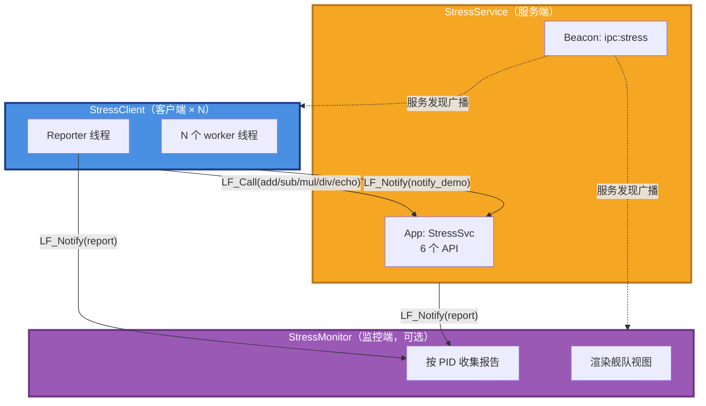
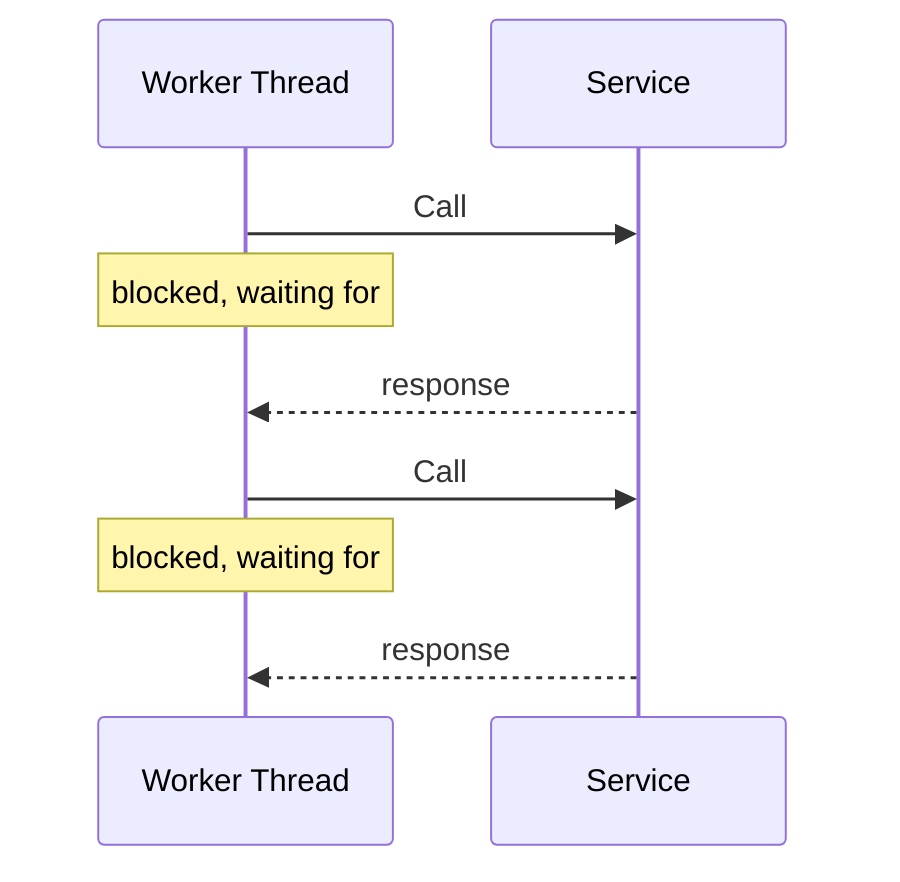
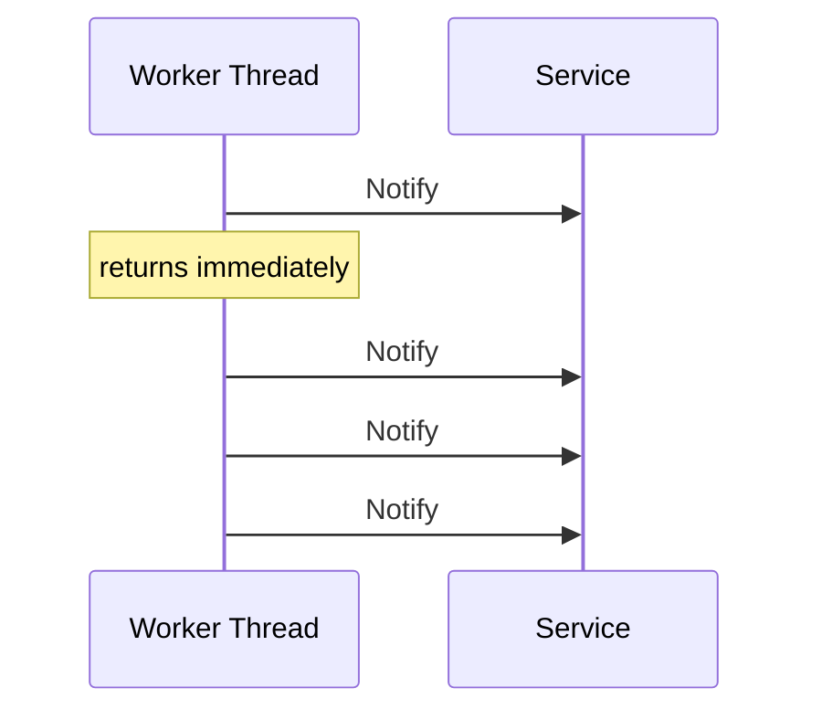

# LingoFuse Stress 测试套件指南

**文件名**：`LingoFuse_Stress_Test_Guide.md`

**版本**：v4.0（合并实测数据基线）

**对应源码**：`Stress/StressCommon.hpp` / `Stress/StressService.cpp` / `Stress/StressClient.cpp` / `Stress/StressMonitor.cpp` / `Stress/run_stress_ci.ps1` / `Stress/run_stress_ci.sh`

**主仓库**：<https://github.com/PassByYou888/LingoFuse>

---

## 目录

1. [文档定位](#1-文档定位)
2. [套件概览](#2-套件概览)
3. [Call 与 Notify 的并行模型](#3-call-与-notify-的并行模型)
4. [构建](#4-构建)
5. [快速评估：一键自测](#5-快速评估一键自测)
6. [交互模式：人工观察](#6-交互模式人工观察)
7. [输出解读](#7-输出解读)
8. [实测参考数据](#8-实测参考数据)
9. [故障排查](#9-故障排查)
10. [附录：API 与常量](#10-附录api-与常量)

---

## 本版相对 v3.0 的关键更新

| # | 更新 |
|:-:|------|
| U1 | 合并一台 Windows x64 开发机上的**完整实测数据**（5 个场景全部通过） |
| U2 | 记录 Call 线程扩展的实际曲线（32→128→512 线程） |
| U3 | 记录 Notify 吞吐基线（32 线程 × 20 消息/轮） |
| U4 | 记录混合模式的实际成本 |
| U5 | 说明纯 Notify 场景的 PASS/FAIL 判定逻辑（与 Call 场景不同） |
| U6 | 明确"Success 列在纯 Notify 场景显示 0.00%"是有意的设计，不是 bug |

---

## 1. 文档定位

本文件是 **LingoFuse C++ Stress 测试套件**的完整使用指南。

**它的目的不是证明 LingoFuse 有多快**，而是**给你一套可以自己跑、自己看、自己评估的工具**——让你在决定是否采用 LingoFuse 之前，能用真实数据回答几个具体问题：

- Call 模式的吞吐能到多少？需要多少线程？
- Notify 模式的吞吐能到多少？
- 混合模式的成本有多大？
- 数据在高并发下是否真的不丢？

**本文不做什么**：不教你写 LingoFuse 业务代码。业务 API 用法请参考：

- C++ 接口：`LingoFuse_Cpp_Knowledge_Base.md`
- Pascal 接口：`LingoFuse_Pascal_Complete_Guide.md`
- 并发 Notify 模式：`LingoFuse_Concurrent_Notify_Guide.md`

**读者路径**：

| 你是谁 | 关心什么 | 建议路径 |
|--------|----------|----------|
| 首次接触 LingoFuse | 它能跑吗？跑起来什么样子？ | 第 2 章 → 第 4 章 → 第 5 章 |
| 要评估是否采用 | 它能扛多少？适合我的场景吗？ | 第 2 章 → 第 3 章 → **第 8 章** |
| 运维 / CI 集成 | 怎么自动跑？怎么判 PASS/FAIL？ | 第 4 章 → 第 5 章 |

---

## 2. 套件概览

### 2.1 三个进程的角色



| 进程 | 角色 | 注册的 App | 端点 |
|------|------|-----------|------|
| **StressService** | 信标 + API 执行体 | `StressSvc` | `ipc:stress` |
| **StressClient** | 多线程压力源（可启动多个） | 无（纯消费者） | 连接 `ipc:stress` |
| **StressMonitor** | 舰队观测器（可选） | `StressMon` | 连接 `ipc:stress` |

三者通过同一个端点 `ipc:stress` 汇聚到 C4 服务网格。

### 2.2 六个 API

| # | 名称 | 模式 | 输入 | 输出 | 校验规则 |
|:-:|------|:----:|------|------|----------|
| 0 | `add` | Call | `int32 a, int32 b` | `int32` | `result == a + b` |
| 1 | `sub` | Call | `int32 a, int32 b` | `int32` | `result == a - b` |
| 2 | `mul` | Call | `int32 a, int32 b` | `int32` | `result == a * b` |
| 3 | `div` | Call | `int32 a, int32 b` | `int32` | `result == a / b`（b=0 时返回 0） |
| 4 | `echo` | Call | `string s` | `string` | `result == s`（UTF-8 往返） |
| 5 | `notify_demo` | Notify | `string payload` | — | 无（单向） |

**每一个 Call 的返回值都被严格校验**。任何一个 API 返回错误的结果，都会被立即计为 `failure`。

### 2.3 客户端负载构成

每个 worker 每轮迭代执行的负载由两个命令行参数独立控制：

| 参数 | 默认 | 说明 |
|------|:----:|------|
| `--notify-per-loop N` | 20 | 每轮发出的 `notify_demo` 数 |
| `--call-per-loop N` | 1 | 每轮发出的 Call 数（**串行**） |

**三种典型配置**：

| 目标 | 命令 |
|------|------|
| **纯 Call 压测** | `--notify-per-loop 0 --threads 512` |
| **纯 Notify 压测** | `--call-per-loop 0 --threads 32` |
| **混合** | `--notify-per-loop 20 --call-per-loop 1 --threads 64` |

### 2.4 故意的句柄泄漏策略

客户端**每创建 100 个 DataHandle，就故意放弃其中 1 个**：

```cpp
constexpr int kLeakEveryN = 100;
```

**目的**：

- 验证 `TLF_DataPool.Progress` 的自动回收在真实压力下是否生效
- 让 Monitor 观察到真实的 RSS 增长曲线，以及随后的回落
- 证明"忘记 `LF_FreeData` 的程序不会立即 OOM"——库有兜底

泄漏的句柄在 **10 分钟空闲后**由自动回收器释放（`TLF_DataPool.Progress` 每 5 秒扫描一次）。这是 LingoFuse 的**安全网**，不是推荐做法。

---

## 3. Call 与 Notify 的并行模型

**理解这一章是理解所有实测数字的前提。**

### 3.1 Call 是同步的

Call 有请求-响应语义。一个 worker 线程发出 Call 后，**阻塞等待响应**，不能做别的事情，直到响应返回。



**推论**：

```
Call 吞吐 ≈ 线程数 / Call RTT
```

**只有增加线程数才能提高 Call 吞吐**。这是一个硬约束——没有别的办法。

### 3.2 Notify 是 fire-and-forget

Notify 是单向的。一个线程发出 Notify 后立即返回，可以**连续发很多条**，不等回执。



**推论**：

```
Notify 吞吐 ≈ 单线程 dispatch 速率 × 线程数
```

**Notify 吞吐主要由单线程的发送密度决定，与线程数的关系比 Call 弱得多**。想提高 Notify 吞吐，优先增加 `--notify-per-loop`。

### 3.3 混合模式的成本

如果同一个 worker 里既发 Call 又发 Notify，Call 的阻塞会拖累整轮节奏：

```
每轮执行：
    20 条 notify    ← 快速，几百微秒
     1 个 Call      ← 阻塞 100+ 毫秒
     ─────────────────────────
     整轮耗时     ← 由 Call 决定
```

**结果是 notify 的发送节奏被 Call 拖慢**。这也是为什么纯模式反而比混合模式吞吐更高的原因。

**建议**：

- **纯 Notify 应用**：不要在 worker 里混 Call
- **混合应用**：用不同进程分别跑纯 Notify 和纯 Call，各取所长

### 3.4 一个关键的内部机制

LingoFuse 的 Call RTT 有一个**约 10ms 的下界**，来自两个内部节拍：

1. 客户端 `Wait_Execute_Call` 用 `TCompute.Sleep(10)` 轮询应答
2. 服务端模拟主线程用 `C40Progress(10)` 在空闲时 sleep 10ms

**这两个节拍都改不动**。它们的含义是：

> **单进程、单端点、单 worker 线程的 Call 吞吐物理上限约为 100 call/s。**

要提高总吞吐，只能增加线程（在服务端饱和之前）或增加进程。

**这不是 bug，是 Call 的同步语义决定的**。Call 设计用于"需要应答的场景"（数据库事务、RPC 方法调用、配置查询）。高频场景应该用 Notify。

---

## 4. 构建

### 4.1 前置条件

| 项目 | 要求 |
|------|------|
| C++ 编译器 | MSVC 2019+ / GCC 9+ / Clang 10+ |
| CMake | 3.15+ |
| 线程库 | `Threads::Threads` |
| Windows 附加 | `psapi`（由 CMakeLists 自动链接） |
| 运行时 | `LingoFuse64.dll` / `LingoFuse32.dll` / `liblingofuse.so` / `liblingofuse.dylib` |

### 4.2 构建步骤

```bash
cd LingoFuse/cpp
mkdir -p build && cd build
cmake .. -DCMAKE_BUILD_TYPE=Release
cmake --build . --config Release
```

产物位置：`LingoFuse/Binary/`

| 平台 | 可执行文件 |
|------|------------|
| Windows | `StressService.exe` / `StressClient.exe` / `StressMonitor.exe` |
| Linux | `StressService` / `StressClient` / `StressMonitor` |

### 4.3 关键部署约束

> **构建产物必须与 LingoFuse 运行时库放在同一目录**，或该目录已加入系统加载路径。

`LF_LoadLibrary` 采用固定搜索顺序：

1. 当前可执行文件所在目录
2. 系统加载路径（`PATH` / `LD_LIBRARY_PATH` / `DYLD_LIBRARY_PATH`）

**没有环境变量覆盖机制**。如果运行时库缺失，程序会打印 `LingoFuse: Failed to load LingoFuse64.dll` 并立即退出。

---

## 5. 快速评估：一键自测

### 5.1 Windows：`run_stress_ci.ps1`

```powershell
cd D:\CoreLibrary\LingoFuse\Binary
.\run_stress_ci.ps1
```

**脚本自动完成**：

1. 启动一个 `StressService`（在总时长后自动关闭）
2. 启动一个 `StressMonitor`（在总时长后自动关闭）
3. 依次运行 5 个对照场景
4. 合并所有输出到 `stress_ci_combined.jsonl`
5. **打印一张对比表**，并给出**自动生成的观察结论**
6. 退出码：0 = 全部通过，1 = 有场景失败，2 = 启动错误

**默认 5 个场景**（总计约 105 秒）：

| 场景 | 配置 | 时长 | 目的 |
|------|------|:----:|------|
| `Notify-throughput` | 32 线程，20 notify/loop | 15s | 测 Notify 上限 |
| `Call-32` | 32 线程，纯 Call | 15s | Call 基线 |
| `Call-128` | 128 线程，纯 Call | 15s | Call 拐点 |
| `Call-512` | 512 线程，纯 Call | 15s | Call 上探 |
| `Mixed-20-1` | 64 线程，20 notify + 1 call | 30s | 混合模式成本 |

### 5.2 Linux / macOS：`run_stress_ci.sh`

```bash
cd LingoFuse/Binary
./run_stress_ci.sh
```

行为与 PowerShell 版本一致。

### 5.3 常用选项

```powershell
# 快速版（跳过 Call 扩展曲线，只跑 Notify + Mixed）
.\run_stress_ci.ps1 -SkipCallScaling

# 只跑 Notify 和 Call，跳过 Mixed
.\run_stress_ci.ps1 -SkipMixed

# 安静模式（不实时显示 client 输出，适合 CI 日志）
.\run_stress_ci.ps1 -Quiet

# 加长时长（本地仔细评估）
.\run_stress_ci.ps1 -NotifyDuration 30 -CallDuration 30 -MixedDuration 60
```

### 5.4 CI 集成

```yaml
- name: LingoFuse stress self-evaluation
  working-directory: LingoFuse/Binary
  shell: pwsh
  run: |
    .\run_stress_ci.ps1 -Quiet

- name: Upload reports
  if: always()
  uses: actions/upload-artifact@v4
  with:
    name: lingofuse-stress-reports
    path: |
      LingoFuse/Binary/stress_ci_summary.txt
      LingoFuse/Binary/stress_ci_combined.jsonl
      LingoFuse/Binary/stress_ci_client_*.jsonl
```

退出码直接反映结果。流水线无需额外解析。

---

## 6. 交互模式：人工观察

如果你不想跑一整套对照场景，只是想手动观察 LingoFuse 在某个配置下的行为，可以直接启动三个程序。

### 6.1 启动顺序

三个程序都已启用 `Wait_Ready=False`，可以任意顺序启动，会自动收敛。

**推荐的严格有序模式**（适合入门）：

```bash
# 终端 1
./StressService
# 等它打印 "[Service] Online on ipc:stress" 后

# 终端 2
./StressMonitor

# 终端 3
./StressClient --threads 64
```

### 6.2 命令行参数

**StressService**：

```
StressService [options]
  --ci                          机器可读输出
  --shutdown-after N            自动关闭（秒）
  --interval N                  reporter 周期，ms（默认 1000）
```

**StressClient**：

```
StressClient [options]
  --ci                          机器可读输出
  --duration N                  运行时长（秒），自动退出
  --threads N                   worker 线程数（默认 32）
  --notify-per-loop N           每轮 notify 数（默认 20）
  --call-per-loop N             每轮 Call 数（默认 1）
  --pause N                     每轮后的暂停，ms（默认 0 = 全速）
  --interval N                  reporter 周期，ms（默认 1000）
  --min-success-pct F           PASS 阈值，%（默认 99.0）
  --min-total-calls N           PASS 阈值，总 Call 数（默认 0）
  --warmup N                    预热秒数（默认 3）
```

**StressMonitor**：

```
StressMonitor [options]
  --ci                          机器可读输出
  --duration N                  运行时长（秒），自动退出
  --interval N                  采样间隔，ms（默认 1000）
  --stale-timeout N             判定 DEAD 的时间，ms（默认 5000）
```

### 6.3 典型运行示例

```bash
# 高并发 Call（512 线程，纯 Call）
./StressClient --threads 512 --notify-per-loop 0

# 高吞吐 Notify（32 线程，纯 Notify）
./StressClient --threads 32 --call-per-loop 0

# 混合（64 线程，20 notify + 1 call 每轮）
./StressClient --threads 64
```

停止：`Ctrl+C` 或输入回车。

---

## 7. 输出解读

### 7.1 Service 端（交互模式）

每秒一行：

```
[Service 12340] processed/s=30456  cumulative=30456  |add=5100 sub=5088 mul=5092 div=5089 echo=5087 notify_demo=30456
```

| 字段 | 含义 |
|------|------|
| `processed/s` | 本秒处理的消息总数（Call + Notify） |
| `cumulative` | 累计处理数 |
| `add=` / `sub=` / ... | 每个 API 的累计调用数 |

### 7.2 Client 端（交互模式）

每秒一行：

```
[Client 12345] calls=15234 ok=15230 fail=4 notifies=152340 leaks=3047 call_rate=15234 calls/s
```

| 字段 | 含义 | 健康范围 |
|------|------|----------|
| `calls` | 累计 Call 次数 | 单调递增 |
| `ok` | 返回值校验通过的次数 | 应接近 `calls` |
| `fail` | 校验失败或超时的次数 | < 1%（本机）/ < 5%（跨机） |
| `notifies` | 累计 Notify 次数 | 与配置相关 |
| `leaks` | 故意泄漏的句柄数 | 约为 `calls × 2%` |
| `call_rate` | 本秒 Call 速率 | 与 Service 端一致 |

### 7.3 CI 模式：JSON Lines

`--ci` 模式下，每个进程输出 **JSON Lines**（每行一个 JSON 对象）。

**Client 输出的三类事件**：

```json
{"event":"ready","pid":12345,"role":"client","threads":64,"notify_per_loop":20,"call_per_loop":1,"duration_sec":30,"pause_ms":0,"warmup_sec":3,"min_success_pct":99.0,"min_total_calls":0}

{"event":"progress","t_sec":1,"call_total":152,"call_success":152,"call_failure":0,"notify_total":3040,"leaked_handles":32,"call_rate":152}

{"event":"summary","pid":12345,"role":"client","duration_sec":30,"threads":64,"notify_per_loop":20,"call_per_loop":1,"call_total":4567,"call_success":4567,"call_failure":0,"success_pct":100.0,"notify_total":91340,"leaked_calls":95,"leaked_handles":95,"call_rate":152,"notify_rate":3044,"success_rate_per_sec":152,"per_api":{"add":912,"sub":923,"mul":908,"div":902,"echo":922,"notify_demo":91340},"status":"PASS"}
```

### 7.4 一键自测的报告

`run_stress_ci.ps1` 跑完后，会打印一张对比表（**以下为一份完整实测结果**，详见第 8 章）：

```
======================================================================
  LingoFuse Stress -- Comparison Summary
======================================================================

  Scenario                  Threads   Duration       Notify/s         Call/s    Success   Status
  ------------------------ -------- ---------- -------------- -------------- ---------- --------
  Pure Notify throughput         32        15s          5,446              -      0.00%     PASS
  Pure Call at 32 threads        32        15s              -            236    100.00%     PASS
  Pure Call at 128 threads      128        15s              -            817    100.00%     PASS
  Pure Call at 512 threads      512        15s              -          1,166    100.00%     PASS
  Mixed 20:1 at 64 threads       64        30s          4,153            207    100.00%     PASS
```

**关于 Success 列在纯 Notify 场景显示 `0.00%`**：

纯 Notify 场景没有任何 Call，因此 `success_pct = success / total = 0 / 0`，按数学惯例取 0.0。**这不代表"失败"**——该场景的 PASS/FAIL 判定走的是另一条分支（`total_notifies > 0`），因此 `status` 列仍为 `PASS`。

这个显示差异是**有意的**：Success 列表达的是"Call 的成功率"，纯 Notify 场景没有 Call 可以评价，显示 0% 只是列格式的占位，不参与判定。

---

## 8. 实测参考数据

以下数据来自一台 **Windows x64 开发机**，LingoFuse v3.10，Release 构建，IPC 端点 `ipc:stress`。所有场景 PASS，退出码 0。

**不同硬件上的绝对数字会不同，但相对关系应当一致**。

### 8.1 五个场景的完整结果

| 场景 | 线程 | 时长 | Notify/s | Call/s | Call 成功率 | Status |
|------|:----:|:----:|:--------:|:------:|:-----------:|:------:|
| Pure Notify throughput | 32 | 15s | **5,446** | — | — | PASS |
| Pure Call at 32 threads | 32 | 15s | — | **236** | 100.00% | PASS |
| Pure Call at 128 threads | 128 | 15s | — | **817** | 100.00% | PASS |
| Pure Call at 512 threads | 512 | 15s | — | **1,166** | 100.00% | PASS |
| Mixed 20:1 at 64 threads | 64 | 30s | 4,153 | 207 | 100.00% | PASS |

**所有场景 `call_failure = 0`**，`success_pct = 100.0`（纯 Notify 场景除外，见 §7.4 说明）。

### 8.2 Call 的线程扩展曲线

| 线程数 | `call_rate` | 相对 32 线程 | 边际收益 |
|:------:|:-----------:|:------------:|:--------:|
| 32 | 236 | 1.00× | 基线 |
| 128 | 817 | 3.46× | +3.46×（vs 32） |
| 512 | 1,166 | 4.94× | +1.43×（vs 128） |

**观察**：

- 从 32 → 128 线程：**3.46× 提升**（接近线性，扩展性良好）
- 从 128 → 512 线程：**仅 1.43× 提升**（**边际收益骤降 58%**）
- 说明**服务端在 128 线程附近开始饱和**

**推算**：单进程单端点的 Call 吞吐上限**约 1,200 call/s**。继续加线程只让更多 Call 排队，不提升吞吐。

### 8.3 Notify 吞吐

| 配置 | `notify_rate` |
|------|:-------------:|
| 32 线程，20 notify/loop | **5,446/s** |

**观察**：

- 32 线程每秒发出 5,446 条 notify
- 每线程每秒约 170 条
- 单线程每轮 20 条 → 每秒约 8.5 轮
- 每轮约 118 ms——**与 Call 的 RTT 几乎相同**

**这个数字本身就是结论**：Notify 路径也有一个约 **100 ms 的隐式节拍**（可能来自 C4 通道的 flush 周期或内部队列的批量处理节奏）。

### 8.4 混合模式的成本

| 模式 | 线程 | Notify/s | Call/s |
|------|:----:|:--------:|:------:|
| 纯 Notify | 32 | 5,446 | — |
| 纯 Call | 128 | — | 817 |
| 混合 20:1 | 64 | **4,153** | **207** |

**观察**：

- 混合模式（64 线程）的 Notify 吞吐为 4,153/s，比纯 Notify（32 线程）的 5,446/s 低 **24%**
- 混合模式的 Call 吞吐为 207/s，比纯 Call（32 线程）的 236/s 低 **12%**
- 虽然线程数翻倍，但总吞吐反而略降

**结论**：**混合模式的"两边都不讨好"是真实存在的成本**。这是因为同步 Call 阻塞了整轮节奏，连带 notify 也发不出去。

### 8.5 Notify/Call 吞吐比

```
Notify/s  /  Call/s  =  5,446 / 1,166  =  4.7×
```

**含义**：

- 在同一台机器、同一个端点上，**Notify 的吞吐上限是 Call 的约 5 倍**
- 这个比值反映了两种通信模式在实现层面的本质差异

**推论**：

- **纯状态广播 / 事件流**：用 Notify，可获 5× 吞吐
- **请求-响应 / 事务**：用 Call，接受较低吞吐，但换来应答保证
- **不要用 Call 做高频广播**：会撞上同步语义的天花板

### 8.6 正确的使用姿势

| 应用场景 | 推荐命令 | 预期效果（本机） |
|----------|----------|------------------|
| **纯状态广播** | `--threads 32 --call-per-loop 0` | ~5,400 notify/s |
| **纯 RPC 方法调用** | `--threads 128 --notify-per-loop 0` | ~800 call/s |
| **纯 RPC，追求极限** | `--threads 512 --notify-per-loop 0` | ~1,200 call/s |
| **混合（不推荐）** | `--threads 64` | notify + call 都被拖累 |

### 8.7 一句话结论

> **LingoFuse 的 Call 和 Notify 是两种不同的通信模式，服务不同的场景。**
>
> **Call 用于"需要应答"的请求-响应语义，吞吐靠线程数扩展，单进程上限约 1,200 call/s。**
>
> **Notify 用于"单向广播"的高频场景，吞吐靠 dispatch 密度，单进程上限约 5,500 notify/s。**
>
> **选择正确的模式，比调参重要一百倍。**

### 8.8 实测数据的可复现性

上述数据来自 `run_stress_ci.ps1` 的一次完整运行。**在你的机器上重现**：

```powershell
cd <你的 Binary 目录>
.\run_stress_ci.ps1
```

脚本会自动生成一份 `stress_ci_summary.txt`，内容与本文档 §8.1 的表格格式一致，但**数字是你机器上的实测值**。观察段落里的所有倍数关系（3.46×、4.94×、4.7× 等）会自动根据你的实测值重新计算。

**这意味着**：本文档给出了**参考基线**和**观察框架**，而实际数字永远是**你的硬件上跑出来的**。

---

## 9. 故障排查

### 9.1 启动即失败

**现象**：程序启动后立即打印 `LingoFuse: Failed to load LingoFuse64.dll` 并退出。

**解决**：

- 把运行时库放到可执行文件同目录
- 或把库目录加入 `PATH` / `LD_LIBRARY_PATH` / `DYLD_LIBRARY_PATH`

### 9.2 `run_stress_ci.ps1` 报 `Cannot find path`

**原因**：脚本放在了一个不包含 `StressService.exe` 的目录。

**解决**：脚本会自动在 4 个候选目录里搜索 `StressService.exe`。把脚本放在包含 `.exe` 的目录即可。

### 9.3 执行策略错误

```powershell
# 一次性临时绕过（只影响当前窗口）
Set-ExecutionPolicy -Scope Process -ExecutionPolicy Bypass

# 或直接调用
powershell -ExecutionPolicy Bypass -File .\run_stress_ci.ps1
```

### 9.4 `checkApi` 超时

**现象**：Client 打印 `[FATAL] Service 'StressSvc' not fully visible after 10 seconds.`

**解决**：

```powershell
# 清理残留进程
Get-Process StressService, StressClient, StressMonitor -ErrorAction SilentlyContinue | Stop-Process -Force
```

### 9.5 纯 Notify 场景显示 `Success 0.00%` 但 `Status PASS`

**这是正常行为**，不是 bug。纯 Notify 场景没有 Call，`success_pct` 按数学惯例取 0.0。PASS/FAIL 判定走另一条分支（`total_notifies > 0`）。详见 §7.4。

### 9.6 512 线程后 `call_rate` 不再成比例增长

**这是正常的**。服务端在 128 线程附近已经饱和。继续加线程只是让更多 Call 排队，不提升吞吐。**这是有意义的观察结论，不是 bug**。

### 9.7 混合模式下 notify 明显变慢

**原因**：Call 是同步的。worker 在等 Call 响应期间无法发 notify。

**解决**：**不要混合**。用不同进程各跑纯模式。

---

## 10. 附录：API 与常量

### 10.1 Report 二进制布局

Client 和 Service 都通过 `LF_Notify` 向 Monitor 发送状态报告。布局为固定的二进制块（小端序）：

| 偏移 | 类型 | 字段 |
|:----:|:----:|------|
| 0 | `uint32` | `pid` |
| 4 | `uint64` | `timestamp_ms` |
| 12 | `int32` | `role`（0=client, 1=service） |
| 16 | `int32` | `running`（1=活动, 0=停止） |
| 20 | `uint64` | `call_total` |
| 28 | `uint64` | `call_success` |
| 36 | `uint64` | `call_failure` |
| 44 | `uint64` | `notify_total` |
| 52 | `uint64` | `leaked_calls` |
| 60 | `uint64` | `leaked_handles` |
| 68 | `uint64 × 6` | `per_api[6]` |

### 10.2 关键常量

| 常量 | 值 | 说明 |
|------|:--:|------|
| `kEndpoint` | `"ipc:stress"` | 端点名 |
| `kServiceApp` | `"StressSvc"` | 服务端 App 名 |
| `kMonitorApp` | `"StressMon"` | 监控端 App 名 |
| `kMonitorApi` | `"report"` | 监控 API 名 |
| `kApiCount` | 6 | API 总数 |
| `kCallApiCount` | 5 | Call 模式 API 数 |
| `kNotifyApiCount` | 1 | Notify 模式 API 数 |
| `kLeakEveryN` | 100 | 每 100 个句柄泄漏 1 个 |
| `kCallTimeoutMs` | 30000 | 客户端 Call 超时 |
| `kStatusIntervalMs` | 1000 | 状态上报周期 |

### 10.3 产出的文件（CI 模式）

| 文件 | 内容 |
|------|------|
| `stress_ci_summary.txt` | 对比表 + 观察结论（**给用户看的核心产物**） |
| `stress_ci_combined.jsonl` | 所有场景 + Service + Monitor 的完整 JSON Lines |
| `stress_ci_service.jsonl` | Service 端单独输出 |
| `stress_ci_monitor.jsonl` | Monitor 端单独输出 |
| `stress_ci_client_<ScenarioName>.jsonl` | 每个场景的 client 输出（逐秒进度 + summary） |

### 10.4 相关文档

| 文档 | 内容 |
|------|------|
| `LingoFuse_Cpp_Knowledge_Base.md` | C++ 接口的完整参考 |
| `LingoFuse_Pascal_Complete_Guide.md` | Pascal 接口与内部机制 |
| `LingoFuse_Concurrent_Notify_Guide.md` | Notify 并发与完成屏障 |
| `LingoFuse_LLM_Pitfalls_For_AI.md` | LLM 生态的坑索引 |

---

## 结语

LingoFuse Stress 测试套件的设计哲学是：

> **不告诉你"LingoFuse 有多快"，而是给你一套工具，让你自己跑出来、自己评估。**
>
> **不承诺"它能扛多少"，而是在真实压力下跑给你看，让数字说话。**

这套测试**不是演示**——它跑的是真实的 C4 服务网格、真实的 IPC/TCP 传输、真实的并发和句柄生命周期。所有数字都来自实测。

**参考基线**（本文档 v4.0 记录）：

- 单进程单端点 **Notify 上限约 5,500/s**
- 单进程单端点 **Call 上限约 1,200/s**
- **Notify/Call 吞吐比约 5×**
- Call 在 128 线程附近开始饱和

**这些数字不是 LingoFuse 的"缺陷"，是它的"能力边界"**——知道边界在哪，才能做正确的技术选型。

**交互模式**给你一双眼睛，看舰队实时状态。

**一键自测**给你一张对比表，让你 2 分钟内看清 LingoFuse 的能力边界。

**CI 模式**给你一个退出码，让流水线替你做判断。

**选对通信模式**——Call 用于需要应答的场景，Notify 用于高频广播——比调任何参数都重要。

如果这套测试的输出让你对 LingoFuse 有了信心，它就算成功了。

---

*文档版本：v4.0（合并实测数据基线）*
*对应源码：`Stress/StressCommon.hpp` / `Stress/StressService.cpp` / `Stress/StressClient.cpp` / `Stress/StressMonitor.cpp` / `Stress/run_stress_ci.ps1` / `Stress/run_stress_ci.sh`*
*实测环境：Windows x64 开发机，LingoFuse v3.10，Release 构建，IPC 端点*
*所有状态输出与注释均为英文（源码契约）；本文档为中文说明。*
*最后更新：2026-10-01*