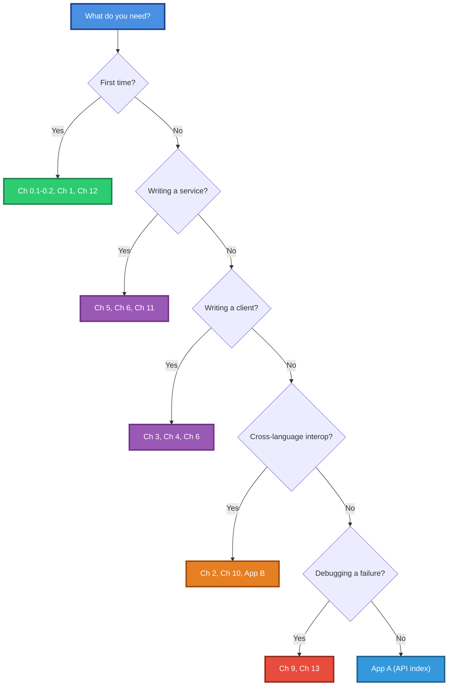
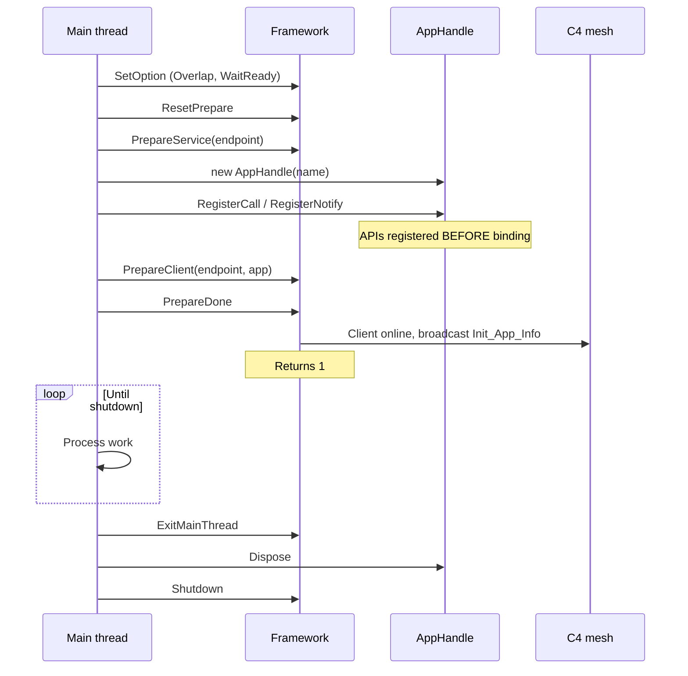
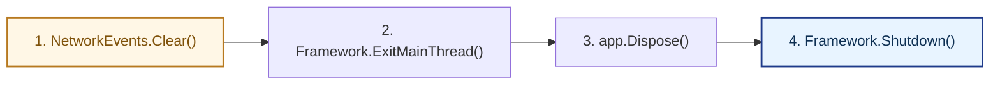

# LingoFuse C# Interface — Complete Guide

**Document version**: 4.0
**Covers**: LingoFuse native library v3.06 + the two-layer C# binding (assembly `LingoFuse`, namespace `LingoFuse`)
**Target frameworks**: .NET 8.0+
**Reading goal**: after reading this document alone, without opening any source file, an engineer or AI agent can write correct, production-grade LingoFuse C# programs.

---

## Table of Contents

**Part I — Orientation**
- [Chapter 0 — What LingoFuse Is](#chapter-0--what-lingofuse-is)
- [Chapter 1 — Quick Start](#chapter-1--quick-start)

**Part II — Contracts**
- [Chapter 2 — The Wire Contract](#chapter-2--the-wire-contract)
- [Chapter 3 — DataHandle](#chapter-3--datahandle)
- [Chapter 4 — LfIo](#chapter-4--lfio)
- [Chapter 5 — AppHandle](#chapter-5--apphandle)
- [Chapter 6 — Framework](#chapter-6--framework)
- [Chapter 7 — NetworkEvents](#chapter-7--networkevents)
- [Chapter 8 — LingoFuseStatus](#chapter-8--lingofusestatus)
- [Chapter 9 — Exception Reference](#chapter-9--exception-reference)

**Part III — Interop and Patterns**
- [Chapter 10 — Cross-Language Interoperability](#chapter-10--cross-language-interoperability)
- [Chapter 11 — Lifecycle Patterns](#chapter-11--lifecycle-patterns)
- [Chapter 12 — Complete Examples](#chapter-12--complete-examples)
- [Chapter 13 — Pitfalls and Anti-Patterns](#chapter-13--pitfalls-and-anti-patterns)

**Part IV — Reference**
- [Appendix A — Public API Index](#appendix-a--public-api-index)
- [Appendix B — Cross-Language Wire Matrix](#appendix-b--cross-language-wire-matrix)
- [Appendix C — Glossary](#appendix-c--glossary)
- [Appendix D — Self-Verification Checklist](#appendix-d--self-verification-checklist)

---

## Chapter 0 — What LingoFuse Is

### 0.1 One-sentence definition

> **LingoFuse is a cross-language, cross-process, cross-machine RPC framework built on the C4 service mesh. It lets services written in Pascal, Python, C++, C#, Rust, Java, or any other language call each other with a uniform wire contract.**

The C# binding exposes LingoFuse through **11 public types** in a single namespace, split into two strictly-layered groups:

| Layer | What it does | Types |
|---|---|---|
| **Native** (internal) | Direct P/Invoke declarations of the 36 C-ABI exports, the two opaque handle kinds, and three callback prototypes. **User code never touches this layer.** | `NativeMethods` (internal), `DataHnd` (internal), `AppHnd` (internal), `Utf8Marshal` (internal), `LfCallFunc` (internal), `LfNotifyFunc` (internal), `LfNetworkEventFunc` (internal) |
| **Managed** (public) | RAII handle wrappers, unified JSON/string I/O, process-wide lifecycle facade, network events, status queue, exception hierarchy. | `DataHandle`, `AppHandle`, `LfIo`, `Framework`, `NetworkEvents`, `LingoFuseStatus`, `LingoFuseException`, `LingoFuseCallException`, `LingoFuseIoException`, `LingoFuseObjectDisposedException`, `LingoFuseLibraryLoadException` |

### 0.2 The 8 primary concepts

If you remember nothing else, remember these eight things:

1. **A `DataHandle` is a byte buffer with an API name.** You write request bytes into it, read response bytes from it. It is an RAII object: `using` frees the underlying native resource.

2. **A `AppHandle` is an application.** It groups a set of related APIs under a unique name that the mesh uses for routing.

3. **`LfIo` is the ONE sanctioned way to move managed objects to and from a `DataHandle`.** Strings, raw bytes, JSON. There is no second path.

4. **`Framework` is the process-wide ABI facade.** Prepare the network, send remote calls, set options, generate app names, shut everything down.

5. **Callbacks run on native worker threads.** They must not block, must not touch UI, must not call any blocking LingoFuse function.

6. **The JSON wire format is UTF-8 with literal non-ASCII characters.** No `\uXXXX` escapes for characters that can be emitted literally — including emoji.

7. **Cleanup has a required order**: `NetworkEvents.Clear()` → `Framework.ExitMainThread()` → `App.Dispose()` → `Framework.Shutdown()`.

8. **`Framework.PrepareDone()` returns `1` only once per process.** A second call without an intervening `Shutdown()` returns `0`, which is **not** a failure.

### 0.3 Reading paths



---

## Chapter 1 — Quick Start

### 1.1 Project setup

Add a project reference to the LingoFuse binding assembly:

```xml
<ItemGroup>
  <ProjectReference Include="..\src\LingoFuse\LingoFuse.csproj" />
</ItemGroup>
```

Or, if the binding ships as a NuGet package, add:

```xml
<PackageReference Include="LingoFuse" Version="1.0.0" />
```

Add only one `using`:

```csharp
using LingoFuse;
```

No other namespace is public.

### 1.2 Minimal service

```csharp
using System;
using LingoFuse;

using var app = new AppHandle("Calculator", "Demo calculator");

// Register a JSON API: takes an int[] {a, b}, returns {"result": a+b}.
app.RegisterCall("add", "Add two ints", (input, output) =>
{
    var args = LfIo.ReadJson<int[]>(input);
    LfIo.WriteJson(output, new { result = args[0] + args[1] });
});

Framework.SetOption("Overlap_Connection", "True");
Framework.ResetPrepare();
Framework.PrepareService("ipc:calc", "ipc:calc");
Framework.PrepareClient("ipc:calc", app);

if (Framework.PrepareDone() != 1)
{
    Console.Error.WriteLine("Startup failed");
    return;
}

Console.WriteLine("Ready. Press Enter to stop.");
Console.ReadLine();

Framework.ExitMainThread();
Framework.Shutdown();
```

### 1.3 Minimal client

```csharp
using System;
using LingoFuse;

Framework.SetOption("Wait_Connection_ReadyOk", "True");
Framework.SetOption("Overlap_Connection", "True");
Framework.ResetPrepare();
Framework.PrepareClient("ipc:calc", null);

if (Framework.PrepareDone() != 1)
{
    Console.Error.WriteLine("Startup failed");
    return;
}

using var request = new DataHandle("add");
LfIo.WriteJson(request, new[] { 5, 7 });

using var response = Framework.Call("Calculator", request, timeoutMs: 3000);
if (response.Size == 0)
{
    Console.WriteLine("Call failed (timeout or unreachable)");
    return;
}

var result = LfIo.ReadJson<System.Text.Json.JsonElement>(response);
Console.WriteLine($"5 + 7 = {result.GetProperty("result").GetInt32()}");

Framework.ExitMainThread();
Framework.Shutdown();
```

### 1.4 Hello world: three terminals

```
Terminal 1:  dotnet run --project crossService
Terminal 2:  dotnet run --project CrossNode      (after terminal 1 prints "running")
Terminal 3:  dotnet run --project CrossCall      (after terminal 2 prints "Online")
```

The demo registers a `demo` application with two APIs (`add`, `inv_seri`), runs a 32-thread load test for 10 seconds, and prints a throughput summary.

---

## Chapter 2 — The Wire Contract

This is the single most important chapter. Every cross-language bug you will encounter traces back to violating one of these five contracts.

### 2.1 Contract 1: NUL framing for strings

Every string on the wire is:

```
[UTF-8 bytes][0x00]
```

A raw binary payload is:

```
[arbitrary bytes][0x00]
```

The NUL is what the receiver uses to find the end.

### 2.2 Contract 2: UTF-8, no escapes

The only text encoding on the wire is UTF-8. Non-ASCII characters are emitted as literal UTF-8 bytes:

- `"你好"` → `E4 BD A0 E5 A5 BD` (6 bytes)
- `"🌍"` → `F0 9F 8C 8D` (4 bytes)

**Never** as `\uXXXX` escapes:

- ❌ `"你好"` → `\u4f60\u597d` (12 ASCII characters)
- ❌ `"🌍"` → `\ud83c\udf0d` (12 ASCII characters)

The binding's `LfIo.WriteJson` explicitly unescapes BMP characters and supplementary-plane characters (surrogate pairs) to enforce this. Both `DataHandle.WriteString` and `LfIo.WriteJson` produce literal UTF-8.

### 2.3 Contract 3: Little-endian integers

All integer and floating-point types are encoded little-endian:

```
int32 0x01020304  →  bytes 04 03 02 01
uint16 0xAABB     →  bytes BB AA
```

On x86/x64/ARM64, the host byte order is already little-endian, so `DataHandle.WriteInt32(0x01020304)` produces the correct wire bytes without any conversion.

### 2.4 Contract 4: Fault-tolerant read

When reading a NUL-framed string, if no NUL is found before the end of the buffer, **the entire remaining buffer is consumed** and the cursor advances to `size + 1` (one byte past the end).

This is what makes interop with HTTP bridges, browsers, and hand-written clients possible: they don't append a NUL, and the reader still works.

Three cases for `DataHandle.ReadString()`:

| Cursor position | Behavior |
|---|---|
| `< size`, NUL found at `e` | Returns bytes `[start, e)`. Cursor → `e + 1`. |
| `< size`, no NUL | Returns bytes `[start, size)`. Cursor → `size + 1`. |
| `>= size` | Returns `""`. Cursor unchanged. |

### 2.5 Contract 5: JSON policy

Every JSON payload produced by the binding goes through **one** serializer configuration, defined privately inside `LfIo`:

| Property | Value | Reason |
|---|---|---|
| `WriteIndented` | `false` | Compact, no trailing newline |
| `Encoder` | `UnsafeRelaxedJsonEscaping` | Emit BMP as literal UTF-8 |
| `PropertyNameCaseInsensitive` | `false` | Case-sensitive matching |
| `DefaultIgnoreCondition` | `Never` | Even null properties are serialized |
| `NumberHandling` | `Strict` | No string-to-number coercion |

Plus a post-processing step (`UnescapeSurrogatePairs`) that rewrites surrogate escape pairs (`\uD8xx\uDCxx`) back to raw chars, so supplementary-plane characters (emoji) are also emitted as literal UTF-8.

**Property names**: System.Text.Json uses the C# property name verbatim. For a property named `MyValue`, the JSON key is `"MyValue"`, not `"my_value"`. To change this, annotate the property:

```csharp
public sealed class Request
{
    [System.Text.Json.Serialization.JsonPropertyName("user_name")]
    public string UserName { get; set; } = "";
}
```

The binding deliberately does **not** expose its `JsonSerializerOptions` publicly: a second serialization path would fragment the wire contract.

---

## Chapter 3 — DataHandle

### 3.1 What it is

`DataHandle` is an RAII wrapper around a native byte buffer with an API name. It is the lowest-level primitive in the managed layer. Everything else (`LfIo`, `AppHandle` callbacks, `Framework.Call`) operates on `DataHandle` instances.

```csharp
public sealed class DataHandle : IDisposable
```

### 3.2 Ownership model

There are two kinds of `DataHandle`:

| Kind | Created by | `Dispose()` behavior |
|---|---|---|
| **Owning** | `new DataHandle("api")` | Calls `LF_FreeData` on the native handle |
| **Borrowing** | `DataHandle.FromRaw(raw, owned: false)` | **No-op** — the native layer owns the resource |

Borrowed handles are used inside callbacks: the native layer hands you a raw pointer, and it will free it as soon as your callback returns. If you call `Dispose()` on a borrowed handle, nothing happens — the wrapper's state is unchanged, and you can continue to read from it for the rest of the callback.

**Never construct a `DataHandle` from a raw pointer unless you are inside a callback.** Outside a callback, `FromRaw` with `owned: false` leaks the underlying resource.

### 3.3 Construction

```csharp
public DataHandle(string apiName)
```

Creates a new owning data handle with the given API name. The underlying buffer starts empty.

- `apiName` must not be null. An empty string is technically allowed but unusual.
- Throws `ArgumentNullException` if `apiName` is null.
- Throws `LingoFuseException` if the native library fails to allocate.

```csharp
public static DataHandle FromRaw(IntPtr raw, bool owned)
```

Wraps an existing raw pointer. Use `owned: false` inside a callback.

### 3.4 Identity and state

| Member | Type | Description |
|---|---|---|
| `Raw` | `IntPtr` | Raw native pointer. `IntPtr.Zero` after an owning handle is disposed. |
| `IsValid` | `bool` | True while the handle is usable. A borrowed handle is always valid until the native layer releases it. |
| `IsOwning` | `bool` | True when `Dispose()` will free the native handle. |

### 3.5 Position and size

| Member | Get | Set |
|---|---|---|
| `Position` | `long`, current cursor | `long`, must be non-negative; a value past the current size **implicitly grows** the buffer with uninitialized bytes |
| `Size` | `long`, total buffer size | `long`, must be non-negative; growing leaves new bytes uninitialized |
| `GetBufferPointer()` | `IntPtr`, native buffer pointer | — |

**Pitfall**: The pointer returned by `GetBufferPointer()` is invalidated by any subsequent write, resize, or `Position` assignment past the end. Do not cache it.

### 3.6 Byte I/O

Two families of read operations:

```csharp
public long WriteBytes(byte[] data)
```

Appends `data` at the current cursor. Buffer grows as needed. Returns the number of bytes written (equal to `data.Length`, or `0` if `data` is empty). **Throws `LingoFuseIoException` on a short write.**

```csharp
public byte[] ReadBytes(int count)
```

Reads **up to** `count` bytes. Returns fewer if the buffer ends early. Never throws for a short read. The result is never null.

```csharp
public byte[] ReadBytesExact(int count)
```

Reads **exactly** `count` bytes. On a short read, restores the cursor to its original position and **throws `LingoFuseIoException`** with `Operation = "ReadBytesExact"`.

```csharp
public bool TryReadBytes(int count, out byte[]? value)
```

Non-throwing counterpart of `ReadBytesExact`. On a short read, restores the cursor and returns `false`.

```csharp
public byte[] ReadAllBytes()
```

Reads every remaining byte from the cursor to the end. Advances the cursor to the end.

**When to use which**:

- **`ReadBytes`**: you want "as much as available" — for streaming or chunked reads.
- **`ReadBytesExact`**: you want "all or nothing" — for fixed-size fields.
- **`TryReadBytes`**: same as above, but you want a boolean result.

### 3.7 Atomic types (little-endian)

| Write | Read (exact) | Read (Try) |
|---|---|---|
| `WriteInt8(sbyte)` | `ReadInt8() : sbyte` | `TryReadInt8(out sbyte)` |
| `WriteUInt8(byte)` | `ReadUInt8() : byte` | `TryReadUInt8(out byte)` |
| `WriteInt16(short)` | `ReadInt16() : short` | `TryReadInt16(out short)` |
| `WriteUInt16(ushort)` | `ReadUInt16() : ushort` | `TryReadUInt16(out ushort)` |
| `WriteInt32(int)` | `ReadInt32() : int` | `TryReadInt32(out int)` |
| `WriteUInt32(uint)` | `ReadUInt32() : uint` | `TryReadUInt32(out uint)` |
| `WriteInt64(long)` | `ReadInt64() : long` | `TryReadInt64(out long)` |
| `WriteUInt64(ulong)` | `ReadUInt64() : ulong` | `TryReadUInt64(out ulong)` |
| `WriteSingle(float)` | `ReadSingle() : float` | `TryReadSingle(out float)` |
| `WriteDouble(double)` | `ReadDouble() : double` | `TryReadDouble(out double)` |

All exact readers throw `LingoFuseIoException` on a short read. All `Try*` variants return `false` and leave the cursor unchanged.

### 3.8 String I/O

```csharp
public void WriteString(string value)
```

Writes `value` as UTF-8 followed by a single NUL byte. An empty string writes exactly **one byte** (the NUL).

```csharp
public string ReadString()
```

Reads until the first NUL, or until the end of the buffer. Invalid UTF-8 byte sequences are decoded with the encoder's default fallback: each invalid byte becomes `U+FFFD`. This is **binary-safe** — a C# reader never throws on malformed UTF-8. If you need to detect invalid UTF-8, read the raw bytes and inspect them yourself.

```csharp
public bool TryReadString(out string? value)
```

Returns `false` only when the cursor is at or past the end of the buffer. A payload consisting of a single NUL (empty string) returns `true` with `value == ""`.

### 3.9 Lifecycle

```csharp
public void Dispose()
```

- **Owning**: calls `LF_FreeData`. Idempotent. All subsequent operations throw `LingoFuseObjectDisposedException`.
- **Borrowing**: **no-op**. The wrapper's state is unchanged, and the handle remains usable for the rest of the callback body.

The `_handle` field is declared `volatile`, so a `Dispose()` on one thread is observed by an `EnsureNotDisposed()` on another without an external lock. This is sufficient for the "do not use after dispose" contract; it does not make concurrent writes safe.

**Do not share an owning `DataHandle` across threads for writing.** Different instances are fully independent and can be used concurrently without restriction.

### 3.10 Complete example

```csharp
using var dh = new DataHandle("demo");
dh.WriteInt32(42);
dh.WriteString("hello");
dh.WriteUInt16(0xABCD);

dh.Position = 0;
int a = dh.ReadInt32();        // 42
string s = dh.ReadString();    // "hello"
ushort u = dh.ReadUInt16();    // 0xABCD
// dh.Position == dh.Size
```

---

## Chapter 4 — LfIo

### 4.1 What it is

`LfIo` is the single entry point for JSON and string I/O on a `DataHandle`. Its job is to centralize:

1. The framing policy (NUL termination).
2. The JSON serialization policy (compact, literal UTF-8, no escapes).
3. The read tolerance (fault-tolerant NUL handling).

**There is no second path.** If you find yourself tempted to write `System.Text.Json.JsonSerializer.Serialize` directly, stop — you are about to violate the wire contract.

```csharp
public static class LfIo
```

### 4.2 String I/O

```csharp
public static void WriteString(DataHandle handle, string value)
public static string ReadString(DataHandle handle)
```

Thin wrappers around `DataHandle.WriteString` / `DataHandle.ReadString`.

### 4.3 Byte-oriented I/O

```csharp
public static void WriteStringBytes(DataHandle handle, byte[] data)
```

Writes raw bytes followed by a NUL terminator. **Embedded NUL bytes are preserved.** Unlike `WriteString`, this method does not stop at embedded NULs — it writes `data.Length` bytes verbatim, then appends one NUL.

Use this when you have pre-serialized UTF-8 bytes (for example from `JsonSerializer.SerializeToUtf8Bytes`) and want to avoid a `string` round-trip.

```csharp
public static byte[] ReadStringBytes(DataHandle handle)
public static byte[] ReadAllBytes(DataHandle handle)
```

The first stops at the first NUL (fault-tolerant: reads all remaining if no NUL). The second reads everything without NUL handling.

### 4.4 JSON I/O

```csharp
public static void WriteJson(DataHandle handle, object? value)
```

Serializes `value` using the canonical policy and writes it with a NUL terminator.

- A `null` value produces the four-byte literal `null`.
- Throws `LingoFuseException` on serialization failure.
- Throws `LingoFuseIoException` on a short write.

```csharp
public static T ReadJson<T>(DataHandle handle)
```

Deserializes a NUL-framed JSON payload into `T`.

- Throws `LingoFuseException` when the payload is not valid JSON, or when it cannot be materialized as `T`.
- Throws `LingoFuseObjectDisposedException` if the handle is disposed.
- If the payload is `null` and `T` is a reference type or `Nullable<T>`, returns `null`. If `T` is a non-nullable value type, throws `LingoFuseException`.

```csharp
public static bool TryReadJson<T>(DataHandle handle, out T? value)
```

Non-throwing counterpart. Returns `false` when:

- The payload is empty.
- The payload is not valid JSON.
- The payload cannot be materialized as `T`.

Catches both `JsonException` and `NotSupportedException` (for unsupported types like interfaces without converters).

### 4.5 Example: JSON round trip

```csharp
public sealed class Person
{
    public string Name { get; set; } = "";
    public int Age { get; set; }
}

using var dh = new DataHandle("json_poco");
var original = new Person { Name = "Alice", Age = 30 };
LfIo.WriteJson(dh, original);

dh.Position = 0;
var back = LfIo.ReadJson<Person>(dh);
// back.Name == "Alice", back.Age == 30
```

The serialized JSON is:

```
{"Name":"Alice","Age":30}\0
```

Note the property names are `"Name"` and `"Age"` (C# names verbatim), not `"name"` and `"age"`.

### 4.6 Example: JSON with snake_case

```csharp
public sealed class Request
{
    [System.Text.Json.Serialization.JsonPropertyName("user_name")]
    public string UserName { get; set; } = "";

    [System.Text.Json.Serialization.JsonPropertyName("request_id")]
    public int RequestId { get; set; }
}
```

Serializes as `{"user_name":"...","request_id":...}` — matching the convention used by Python, C++, and Pascal peers.

### 4.7 Example: JSON array

```csharp
using var dh = new DataHandle("json_array");
LfIo.WriteJson(dh, new int[] { 1, 2, 3 });

dh.Position = 0;
var back = LfIo.ReadJson<int[]>(dh);   // [1, 2, 3]
```

### 4.8 Example: JSON with unicode

```csharp
using var dh = new DataHandle("json_unicode");
LfIo.WriteJson(dh, new { message = "你好 🌍" });

dh.Position = 0;
var text = dh.ReadString();
// text contains: {"message":"你好 🌍"}
// NOT: {"message":"\u4f60\u597d \ud83c\udf0d"}
```

The wire bytes for `"你好 🌍"` are:

```
E4 BD A0 E5 A5 BD 20 F0 9F 8C 8D
```

All literal UTF-8. No escapes.

### 4.9 Why there is no public Options

`LfIo` deliberately does **not** expose its `JsonSerializerOptions`. Exposing them would allow callers to build a second serialization path — different encoder, different indentation, different null handling — defeating the entire purpose of having a single wire contract.

If you need to customize the JSON shape of your payload, customize your **types**:

- Use `[JsonPropertyName]` to change a key.
- Use `[JsonIgnore]` to omit a property.
- Use `[JsonConverter]` to control a custom type's encoding.

But the outer policy — compact, literal UTF-8, no escapes — is not adjustable.

---

## Chapter 5 — AppHandle

### 5.1 What it is

`AppHandle` is an RAII wrapper around a native application. An application is a named container of related APIs.

```csharp
public sealed class AppHandle : IDisposable
```

### 5.2 Construction

```csharp
public AppHandle(string name, string description = "")
```

Creates a new application with the given name and description.

- `name` must not be null. Should be unique on the mesh. Case-insensitive matching applies at lookup time.
- `description` may be null; treated as empty.
- Throws `LingoFuseException` if the native side fails to allocate.

**Application name uniqueness**: if you create a new `AppHandle` with a name that is already in use, the native side will create the new application, but the old one will still be in the global pool until `LF_Shutdown`. Routing will target whichever registered first; the second may be reachable only after the mesh re-broadcasts. **Prefer distinct names.**

### 5.3 Identity and state

| Member | Type | Description |
|---|---|---|
| `Name` | `string` | The name passed to the constructor. |
| `Raw` | `IntPtr` | Raw native pointer. `IntPtr.Zero` after `Dispose`. |
| `IsValid` | `bool` | True while the handle is usable. |

### 5.4 API registration

```csharp
public bool RegisterCall(
    string apiName,
    string description,
    Action<DataHandle, DataHandle> handler)

public bool RegisterNotify(
    string apiName,
    string description,
    Action<DataHandle> handler)
```

Registers a Call (request-response) or Notify (one-way) API.

- Returns `true` on success, `false` if the API name is already taken.
- Throws `ArgumentNullException` if `apiName` or `handler` is null.
- Throws `LingoFuseObjectDisposedException` if the handle is already disposed.

**Callback signature**:

- Call: `Action<DataHandle input, DataHandle output>` — you read from `input`, write to `output`.
- Notify: `Action<DataHandle input>` — you read from `input`, no output.

**Borrowed handles**: the `DataHandle` instances passed to your callback are **borrowed** from the native layer. Do **not** call `Dispose()` on them (it's a harmless no-op, but don't do it). Do **not** cache them or any pointer obtained from them beyond the callback's return.

**Callback exceptions**: any exception your handler throws is caught by the wrapper and reported through `Framework.ReportCallbackError`. The native layer sees a callback that completed normally, and the caller receives an empty response. Your handler cannot crash the process with an unhandled exception.

```csharp
public bool Unregister(string apiName)
```

Removes a previously registered API. Local effect is immediate; a network broadcast propagates within a few seconds. Returns `true` if the API was found and removed.

### 5.5 Local execution

```csharp
public DataHandle LocalCall(DataHandle param)
public void LocalNotify(DataHandle param)
```

Execute a Call or Notify API **within the same process**, bypassing the network.

- `LocalCall` returns a new `DataHandle` owning the result. The caller must dispose it.
- The request handle is **not** consumed by this call; the caller retains ownership.
- Throws `LingoFuseCallException` if the native layer returns a null handle (an unexpected transport-level failure).
- When the target API is not registered, the returned handle has `Size == 0`.

Local execution is useful for:

- Testing without a network.
- Inter-module communication within the same process.
- Performance-critical paths where the network hop is unnecessary.

### 5.6 Client binding

```csharp
public int Bind()
```

Binds the application to all currently unbound clients. Must be called **after** `Framework.PrepareDone()` has returned `1` and the simulated main thread is running.

Returns the number of clients bound. Zero means either:

- No free client was available (all clients already host an app).
- The main thread is not active.

**When to use `Bind`**:

- You prepared multiple clients **without** an app, then created the app later.
- You want to attach the app to all currently-unbound clients at once.

**When not to use `Bind`**:

- You passed the app to `Framework.PrepareClient(addr, app)`. The binding happens automatically.

### 5.7 Threading and locking

Every public method that touches the native handle or the internal registration dictionary is serialized under an internal lock. This closes the race between an in-flight `RegisterCall` and a concurrent `Dispose` — the two cannot interleave in a way that leaves `LF_RegisterCall` operating on an already-freed handle.

The `_handle` field is `volatile`. A `Dispose()` on one thread is visible to a concurrent operation on another thread without an external lock.

**Registration dictionaries and GC**: the wrapper stores each callback delegate in an internal dictionary (`_registrations`). This keeps the delegate alive for as long as the app is alive and the API remains registered. When the app is disposed or an API is unregistered, the delegate becomes collectable again.

### 5.8 Two-phase destruction

`AppHandle.Dispose()` calls `LF_FreeApp`, which is the **first stage** of a two-stage destruction:

1. **Stage 1** (`Dispose`): the native object is detached from all clients and its sequenced threads are stopped. The object itself remains alive in the global `LF_App_Pool`.
2. **Stage 2** (`Framework.Shutdown`): the pool is cleared, and every `TLF_App` object is destroyed.

Why two stages? So that a broadcast that is still referencing the app's data cannot land on a dangling pointer.

**Implications**:

- After `Dispose`, the handle is invalid. All subsequent operations throw.
- The underlying memory is **not** freed until `Framework.Shutdown`.
- If you create and destroy thousands of apps, the pool grows until `Shutdown`.

**Rule**: call `Framework.Shutdown()` at process exit. It is the only way to reclaim app memory.

### 5.9 Complete example

```csharp
using var app = new AppHandle("Echo", "Echo service");

app.RegisterCall("echo", "Echo a string", (input, output) =>
{
    var s = LfIo.ReadJson<string>(input);
    LfIo.WriteJson(output, s);
});

// Local call — no network involved
using var param = new DataHandle("echo");
LfIo.WriteJson(param, "hello");
using var result = app.LocalCall(param);
var echoed = LfIo.ReadJson<string>(result);   // "hello"
```

---

## Chapter 6 — Framework

### 6.1 What it is

`Framework` is the public facade over the process-wide native functions that don't fit the `DataHandle` or `AppHandle` abstractions:

- Network preparation.
- Remote invocation.
- Runtime options.
- Application name generation.
- Process-wide shutdown.

```csharp
public static class Framework
```

### 6.2 Callback error reporting

```csharp
public static Action<string, Exception>? CallbackErrorHandler { get; set; }
```

Optional handler invoked when a user callback raises an unhandled exception. The first argument is a short identifier for the callback site (for example `"AppHandle.RegisterCall[add]"`); the second is the exception.

**Threading**: the handler is invoked on the native worker thread that ran the failing callback. Do not block, do not touch UI.

**An exception raised by the handler itself is swallowed**, so a broken logging pipeline cannot destabilize the process.

**Default behavior**: if the handler is null, swallowed exceptions are still reported through `System.Diagnostics.Trace.WriteLine`. Trace is active in Release builds, unlike Debug. So even with no handler installed, swallowed exceptions are observable via a trace listener.

### 6.3 Network preparation

```csharp
public static void ResetPrepare()
```

Clears the preparation queue. Running services and clients are not affected.

```csharp
public static int PrepareService(string listeningAddr, string physicsAddr)
```

Prepares a C4 service listening on `listeningAddr` and advertised as `physicsAddr`. Returns an internal tag on success, or `-1` for a duplicate address.

**Typical usage**: one service per process. The listening address is what the OS binds; the physics address is what other processes use to reach it. They are usually the same.

```csharp
public static int PrepareClient(string physicsAddr, AppHandle? app = null)
```

Prepares a C4 client connecting to `physicsAddr`, optionally exposing an application.

- Pass `null` for a pure consumer.
- Pass an `AppHandle` to expose it.
- Returns an internal tag on success, or `-1` for a duplicate address (unless `Overlap_Connection` is enabled).

**Duplicate addresses**: without `Overlap_Connection=True`, the same `physicsAddr` can only be used **once** per process. A second `PrepareClient` on the same address returns `-1` and the app is silently discarded.

```csharp
public static int PrepareDone()
```

Starts the LingoFuse framework with all prepared services and clients.

- Returns `1` on success.
- Returns `0` on a second call in the same process without an intervening `Shutdown()`. **This is not a failure.**
- Blocks until the internal preparation is complete, subject to `Wait_Connection_ReadyOk` and `Wait_Connection_Timeout`.

**Important**: `PrepareDone` returns `1` only once per process. If you are writing a test suite that starts and stops the framework repeatedly, call `Shutdown` in a finally block to reset the state.

```csharp
public static void ExitMainThread()
```

Requests the simulated main thread to exit. Does not release all resources; call `Shutdown` for a full cleanup.

### 6.4 Runtime options

```csharp
public static void SetOption(string option, string value)
```

Adjusts a global runtime option. Unknown option names are **silently ignored**.

Supported option keys (case-insensitive, aliases accepted):

| Option | Aliases | Type | Default | Purpose |
|---|---|---|---|---|
| `password` | `passwd` | string | `DTC40@ZSERVER` | C4 P2PVM authentication token |
| `Quiet` | — | bool | `False` | Suppress most logs |
| `ShowThreadID` | `ShowThread`, `Show_Thread` | bool | `False` | Show thread IDs in logs |
| `ConsoleOutput` | `Console_Output` | bool | auto | Console logging |
| `Overlap_Connection` | `Overlap_Client`, `OverlapConnection`, `OverlapClient`, `OverlapConnect` | bool | `False` | Allow multiple clients per address |
| `Wait_Connection_ReadyOk` | `Wait_API_Prepare_Done`, `API_Prepare_Done_Wait`, `WaitConnect`, `Wait_Ready`, `WaitReady` | bool | `True` | `PrepareDone` waits for all clients |
| `Wait_Connection_Timeout` | `Wait_TimeOut`, `API_Prepare_Done_TimeOut`, `WaitTimeOut` | int (ms) | `30000` | Timeout for the above wait |
| `Fixed_Sequenced_Time` | `Fixed_Sequenced_Life` | int (ms) | `20000` | Sequenced-Notify fallback threshold |

**Boolean value format**: `"True"` / `"False"` / `"1"` / `"0"` / `"Yes"` / `"No"` (case-insensitive). `"true"` and `"false"` all-lowercase work but `"True"` is the canonical form.

**Overlap_Connection**: set this to `"True"` when you need multiple clients on the same address in the same process. Without it, the second `PrepareClient` on the same address returns `-1`.

**Wait_Connection_ReadyOk**: set this to `"True"` (default) when you want `PrepareDone` to block until every client is online. Set it to `"False"` in elastic-cluster scenarios where nodes start in unpredictable order.

### 6.5 Application name generation

```csharp
public static string GenerateAppName()
```

Generates a globally unique application name.

**Precondition**: must be called after `PrepareDone` returns `1`. Before that, the tunnel information is not available and the name may not be unique.

**Return value**: a copy of the native string. The native pointer is valid for approximately 5 seconds; this method copies it immediately, so the returned `string` is safe to hold indefinitely.

**Returns an empty string** when the native function returns a null pointer. Check the result.

### 6.6 Remote invocation

```csharp
public static DataHandle Call(
    string appName,
    DataHandle param,
    ulong timeoutMs = 5000)
```

Performs a synchronous remote call and returns the response.

**Behavior**:

- Returns a new `DataHandle` owning the response. The caller must dispose it.
- On timeout or unreachable target, the native side returns a **size-0 handle**, not a null pointer. The returned handle is still valid: `response.IsValid` is `true`, `response.Size` is `0`.
- On success, `response.Size > 0`.

**Timeout**: milliseconds. Zero means "wait indefinitely". Default 5000.

**Blocking**: this call blocks the calling thread until the response arrives or the timeout expires. Do not call from a LingoFuse callback — it will deadlock.

```csharp
public static void Notify(string appName, DataHandle param)
```

Sends a one-way notification. Delivery order is **not** guaranteed. Returns immediately after queueing.

```csharp
public static void SequencedNotify(string appName, DataHandle param)
```

Sends a one-way notification with **FIFO ordering** guaranteed for the same `(appName, apiName)` pair. Returns immediately after queueing.

The underlying implementation uses a dedicated thread per `(app, api)` pair. If the thread is idle for more than 5 minutes, it terminates; the next notification recreates it.

### 6.7 Shutdown

```csharp
public static void Shutdown()
```

Gracefully terminates the framework, releasing all resources.

**What it does**:

1. Clears network event callbacks (redundant if `NetworkEvents.Clear()` was called).
2. Stops the simulated main thread.
3. Frees all remaining data handles.
4. Clears the global app pool.
5. Unloads the IPC library.

**After `Shutdown`**:

- Every `AppHandle` still alive becomes invalid.
- The framework may be re-initialized by calling `PrepareService`/`PrepareClient`/`PrepareDone` again.
- The process-wide "started" flag is reset, so the next `PrepareDone` returns `1`.

**Idempotent**: safe to call multiple times.

### 6.8 Complete example: service + client in one process

```csharp
using System;
using LingoFuse;

// --- Setup ---
Framework.SetOption("Wait_Connection_ReadyOk", "True");
Framework.SetOption("Overlap_Connection", "True");
Framework.SetOption("Wait_Connection_Timeout", "10000");
Framework.ResetPrepare();

// --- Service ---
int serviceTag = Framework.PrepareService("ipc:demo", "ipc:demo");
if (serviceTag == -1)
{
    Console.Error.WriteLine("Service address already in use");
    return;
}

// --- Application ---
using var app = new AppHandle("Demo", "Demo service");

// Register APIs BEFORE PrepareClient so the mesh registration carries them.
app.RegisterCall("echo", "Echo a string", (input, output) =>
{
    var s = LfIo.ReadJson<string>(input);
    LfIo.WriteJson(output, s);
});

// --- Client ---
int clientTag = Framework.PrepareClient("ipc:demo", app);
if (clientTag == -1)
{
    Console.Error.WriteLine("Client address already in use");
    return;
}

// --- Start ---
if (Framework.PrepareDone() != 1
    && !LingoFuseStatus.CheckMainThread())
{
    Console.Error.WriteLine("Startup failed");
    return;
}

// --- Call ---
using var param = new DataHandle("echo");
LfIo.WriteJson(param, "hello");
using var response = Framework.Call("Demo", param, timeoutMs: 3000);

if (response.Size > 0)
{
    var echoed = LfIo.ReadJson<string>(response);
    Console.WriteLine($"Echoed: {echoed}");
}

// --- Shutdown ---
NetworkEvents.Clear();
Framework.ExitMainThread();
app.Dispose();
Framework.Shutdown();
```

---

## Chapter 7 — NetworkEvents

### 7.1 What it is

`NetworkEvents` exposes the process-global connect and disconnect handlers.

```csharp
public static class NetworkEvents
```

### 7.2 Semantics

**Connect** fires the **first time** a client receives a service API-info broadcast. It is **not** the TCP handshake; it is the earliest point at which remote calls can be routed.

**Disconnect** fires once per **physical link loss**. An automatic reconnect does **not** emit a Disconnect for the reconnect attempt itself; it emits a new Connect once the client is back online.

**Scope**: process-global. There is no per-client registration.

### 7.3 Threading contract

Callbacks run on a **background worker thread** owned by the native library. They must:

- Copy the endpoint string immediately if they need to retain it. The wrapper does this for you: your delegate receives a managed `string`.
- Never touch UI controls directly.
- Never call any blocking LingoFuse function (`Framework.Call`, `Framework.Notify`, `Framework.SequencedNotify`, `AppHandle.LocalCall`, `AppHandle.LocalNotify`, `Framework.PrepareDone`, `Framework.Shutdown`). This would deadlock.
- Never let an exception escape into the native stack. The wrapper catches every exception and reports it through `Framework.ReportCallbackError`.

### 7.4 API

```csharp
public static bool IsInstalled { get; }
```

`true` when at least one handler is installed.

```csharp
public static void Set(Action<string>? onConnect, Action<string>? onDisconnect)
```

Installs the handlers. Passing `null` for either argument disables that event.

**REPLACE operation**: calling `Set` a second time discards any previously installed handlers, **including** those whose corresponding argument is `null` in the new call. To install both handlers, pass both arguments in a single call.

```csharp
public static void Clear()
```

Removes both handlers. Safe to call multiple times.

### 7.5 Example

```csharp
// Install
NetworkEvents.Set(
    onConnect: addr => Console.WriteLine($"[+] Connected: {addr}"),
    onDisconnect: addr => Console.WriteLine($"[-] Disconnected: {addr}"));

// ... run the framework ...

// Uninstall
NetworkEvents.Clear();
```

### 7.6 Automatic clearing on shutdown

`Framework.Shutdown` does **not** clear the managed delegate references held by `NetworkEvents`. It clears the native slot, so the callbacks will no longer fire, but the managed delegates stay alive until `NetworkEvents.Clear` is called or the process exits.

**Best practice**: always call `NetworkEvents.Clear()` before `Framework.Shutdown()`.

---

## Chapter 8 — LingoFuseStatus

### 8.1 What it is

`LingoFuseStatus` exposes the status queue and health checks.

```csharp
public static class LingoFuseStatus
```

### 8.2 Status queue

The native library maintains a bounded FIFO of log messages, up to 1000 entries. Older entries are dropped when the buffer is full.

**Main-thread dependency**: the queue is processed by the native simulated main thread. Before `Framework.PrepareDone` has been called, the queue may be empty or contain stale data.

```csharp
public static int GetStatusCount()
```

Returns the number of pending messages.

```csharp
public static string GetStatus()
```

Retrieves the next message. Returns an empty string when the queue is empty.

The native function returns a pointer into a static buffer that is overwritten by the next call. The wrapper copies the string to managed memory immediately, so you never observe a dangling pointer.

**Caveat**: an empty message and an empty queue both produce `""`. This is a native ABI limitation.

```csharp
public static string[] DrainStatus(int maxMessages = 64)
```

Drains up to `maxMessages` messages in FIFO order. Returns an empty array when the queue is empty.

```csharp
public static void PostStatus(string message)
```

Injects a custom message into the queue. Messages posted before `PrepareDone` may be discarded.

### 8.3 Health checks

```csharp
public static bool CheckMainThread()
```

Returns `true` when the simulated main thread is running.

```csharp
public static bool CheckApp(string appName)
```

Probes whether an application with the given name is available.

**Cache-based**: the lookup uses a local cache updated by network broadcasts with an approximate **3-second delay**. False negatives immediately after registration and false positives shortly after unregistration are both normal. Do not use this as an authoritative existence test for critical paths.

```csharp
public static bool CheckApi(string appName, string apiName)
```

Probes whether the named API is available. Same cache caveat as `CheckApp`.

### 8.4 Example: waiting for an app to appear

```csharp
bool seen = false;
for (int i = 0; i < 30; i++)
{
    if (LingoFuseStatus.CheckApp("RemoteApp")) { seen = true; break; }
    Thread.Sleep(200);
}

if (!seen)
{
    Console.Error.WriteLine("RemoteApp did not appear within 6 seconds");
}
```

---

## Chapter 9 — Exception Reference

### 9.1 The hierarchy

```
System.Exception
└── LingoFuseException                     (base class)
    ├── LingoFuseCallException             (remote call failed)
    ├── LingoFuseIoException               (short read or write)
    ├── LingoFuseObjectDisposedException   (use after Dispose)
    └── LingoFuseLibraryLoadException      (native library could not be loaded)
```

### 9.2 `LingoFuseException`

The base class. Catch this type for a single, catch-all handler around any LingoFuse operation.

```csharp
try
{
    // ... LingoFuse operation ...
}
catch (LingoFuseException ex)
{
    Console.Error.WriteLine($"LingoFuse error: {ex.Message}");
}
```

### 9.3 `LingoFuseCallException`

Thrown when a remote Call fails: null handle from the native layer, timeout, or an unreachable target.

```csharp
public string? TargetApp { get; }
public string? TargetApi { get; }
```

Use these to build precise diagnostics without parsing the message.

### 9.4 `LingoFuseIoException`

Thrown when a low-level I/O operation on a data handle fails: a short read when the caller asked for a fixed number of bytes, or a short write when the native layer accepted fewer bytes than requested.

```csharp
public string? Operation { get; }
```

The `Operation` property names the failing operation (for example `"ReadBytesExact"`).

Argument validation errors use the standard .NET exceptions (`ArgumentNullException`, `ArgumentOutOfRangeException`), not `LingoFuseIoException`.

### 9.5 `LingoFuseObjectDisposedException`

Thrown when an operation is attempted on an object that has already been disposed.

```csharp
public string ObjectName { get; }
```

The `ObjectName` is the name of the disposed class (`"DataHandle"` or `"AppHandle"`).

### 9.6 `LingoFuseLibraryLoadException`

Declared for future use. **The current binding does not throw this exception.** If the native library cannot be found, `NativeLibrary.Load` throws `DllNotFoundException` (a platform exception), not this type.

In a future revision, the resolver may be updated to throw `LingoFuseLibraryLoadException` on failure. For now, catch both:

```csharp
try
{
    // ... first LingoFuse operation ...
}
catch (DllNotFoundException ex)
{
    Console.Error.WriteLine($"LingoFuse native library not found: {ex.Message}");
}
```

### 9.7 Try* family

The following methods promise not to throw for I/O or JSON reasons. They may still throw `ArgumentNullException` or `LingoFuseObjectDisposedException` for caller misuse.

| Method | Returns `false` on |
|---|---|
| `DataHandle.TryReadBytes` | Short read |
| `DataHandle.TryReadInt32` etc. | Short read |
| `DataHandle.TryReadString` | Exhausted buffer |
| `LfIo.TryReadJson<T>` | Empty payload, invalid JSON, unsupported type |
| `AppHandle.RegisterCall` | Duplicate API name (returns `false`) |
| `AppHandle.RegisterNotify` | Duplicate API name (returns `false`) |
| `AppHandle.Unregister` | API not found |

---

## Chapter 10 — Cross-Language Interoperability

### 10.1 The universal wire format

Every LingoFuse binding uses the same wire format for scalar values and JSON:

| Element | Encoding |
|---|---|
| String framing | UTF-8 bytes + single NUL (`0x00`) |
| Integers | Little-endian |
| Floats | IEEE 754, little-endian |
| JSON text | Compact, literal UTF-8, no `\uXXXX` escapes |
| Raw bytes | Arbitrary, followed by NUL if written via `WriteStringBytes` |

### 10.2 Working with a C++ / Pascal / Python peer

The ABI channel is the natural interop path. Every binding can read and write scalar types in the same order.

**Example: `add(int a, int b) -> int`**

Request bytes (8 bytes):

```
[a: int32 little-endian][b: int32 little-endian]
```

Response bytes (4 bytes):

```
[sum: int32 little-endian]
```

C# server:

```csharp
app.RegisterCall("add", "Add two ints", (input, output) =>
{
    int a = input.ReadInt32();
    int b = input.ReadInt32();
    output.WriteInt32(a + b);
});
```

C++ client (from `CrossCall.cpp`):

```cpp
DataHandle param("add");
param.write<int32_t>(a);
param.write<int32_t>(b);
auto response = lingofuse::call("demo", param, 1000);
int32_t sum = response.read<int32_t>();
```

Same bytes on the wire.

### 10.3 Working with a Python peer

Python uses the same wire format for the ABI channel. For JSON payloads, both bindings emit literal UTF-8:

C# server:

```csharp
app.RegisterCall("echo", "Echo", (input, output) =>
{
    var s = LfIo.ReadJson<string>(input);
    LfIo.WriteJson(output, s);
});
```

Python client:

```python
result = c4.call("Echo", "hello")
```

The Python side uses `json.dumps(obj, ensure_ascii=False)` by default; the C# side uses the canonical `LfIo` policy. Both produce the same bytes.

### 10.4 Working with a C# peer

Two C# processes connected over the mesh work identically to any other pair. The wire format is not special-cased.

### 10.5 Complete interop matrix

See [Appendix B](#appendix-b--cross-language-wire-matrix) for the full matrix of (server language) × (client language) × (transport) × (envelope).

### 10.6 The ABI-vs-JSON choice

For each `(app, api)` pair, you choose **either** the ABI channel **or** the JSON channel. The two are not interchangeable on the same API:

| Channel | Handler | Wire format | When to use |
|---|---|---|---|
| ABI | `app.RegisterCall(name, desc, Action<DataHandle, DataHandle>)` | Caller-defined scalar sequence | Cross-language binary RPC; performance-critical; fixed schema |
| JSON | `app.RegisterCall(name, desc, (input, output) => { LfIo.WriteJson(...); })` | JSON text + NUL | Structured data; evolving schema; human-readable debugging |

Both channels use the same `AppHandle.RegisterCall` method — the difference is what the handler does with the `input` and `output` handles.

---

## Chapter 11 — Lifecycle Patterns

### 11.1 The standard service pattern



**Rule**: `RegisterCall` **before** `PrepareClient`. If you register after, the mesh broadcast carries an empty API list, and the first call against the newly-registered app can time out.

### 11.2 The pure consumer pattern

```csharp
Framework.SetOption("Wait_Connection_ReadyOk", "True");
Framework.ResetPrepare();
Framework.PrepareClient("ipc:service", null);   // null = no app
Framework.PrepareDone();

// Now you can call any app on the mesh.
using var param = new DataHandle("some_api");
LfIo.WriteJson(param, payload);
using var response = Framework.Call("RemoteApp", param, 3000);
```

### 11.3 The worker node pattern

A worker node is a service that does **not** host the beacon; it attaches to an existing beacon.

```csharp
Framework.SetOption("Wait_Connection_ReadyOk", "True");
Framework.ResetPrepare();

using var app = new AppHandle("Worker", "Compute worker");
app.RegisterCall("compute", "Compute", (input, output) =>
{
    // ... your work ...
});

Framework.PrepareClient("ipc:beacon", app);
Framework.PrepareDone();
```

Note: no `PrepareService`. The beacon is hosted elsewhere.

### 11.4 The combined service + client pattern

A single process can host the beacon, expose an app, and act as a client to other apps.

```csharp
Framework.ResetPrepare();
Framework.PrepareService("ipc:my_node", "ipc:my_node");

using var app = new AppHandle("MyNode", "Combined");
app.RegisterCall("local", "...", ...);

Framework.PrepareClient("ipc:my_node", app);
Framework.PrepareDone();

// Now call a remote app
using var param = new DataHandle("remote_api");
using var response = Framework.Call("RemoteApp", param, 3000);
```

### 11.5 The re-initialization pattern

You can start and stop the framework multiple times within the same process.

```csharp
// First cycle
Framework.PrepareService("ipc:ep1", "ipc:ep1");
Framework.PrepareDone();
// ... use ...
Framework.ExitMainThread();
Framework.Shutdown();

// Second cycle (fresh state)
Framework.ResetPrepare();
Framework.PrepareService("ipc:ep2", "ipc:ep2");
Framework.PrepareDone();   // returns 1 again
```

**Important**: `Shutdown` **must** be called between cycles. Without it, `PrepareDone` returns `0` on the second attempt, and no new service is created.

### 11.6 Cleanup sequence

The correct shutdown order is:



| Step | Why |
|---|---|
| 1 | Prevents a user callback from firing during the shutdown transition |
| 2 | Stops the native main thread, so no further callback can fire |
| 3 | Detaches the app from the mesh and stops its sequenced threads |
| 4 | Frees every remaining native resource, including the app pool |

Wrap it in a `finally` block to guarantee it runs on every exit path:

```csharp
AppHandle? app = null;
bool started = false;

try
{
    app = new AppHandle("MyApp", "");
    // ... setup ...
    started = true;
    // ... run ...
}
catch (LingoFuseException ex)
{
    Console.Error.WriteLine(ex.Message);
    return 1;
}
finally
{
    if (started)
    {
        try { NetworkEvents.Clear(); } catch { }
        try { Framework.ExitMainThread(); } catch { }
        try { app?.Dispose(); } catch { }
        try { Framework.Shutdown(); } catch { }
    }
    else
    {
        try { app?.Dispose(); } catch { }
    }
}
```

---

## Chapter 12 — Complete Examples

### 12.1 Calculator service

```csharp
using System;
using LingoFuse;

using var app = new AppHandle("Calculator", "Simple calculator");

app.RegisterCall("add", "Add two ints", (input, output) =>
{
    var args = LfIo.ReadJson<int[]>(input);
    LfIo.WriteJson(output, new { result = args[0] + args[1] });
});

app.RegisterCall("multiply", "Multiply two ints", (input, output) =>
{
    var args = LfIo.ReadJson<int[]>(input);
    LfIo.WriteJson(output, new { result = args[0] * args[1] });
});

app.RegisterNotify("log", "Log a message", input =>
{
    var msg = LfIo.ReadJson<string>(input);
    Console.WriteLine($"[Calculator] {msg}");
});

Framework.SetOption("Overlap_Connection", "True");
Framework.ResetPrepare();
Framework.PrepareService("ipc:calc", "ipc:calc");
Framework.PrepareClient("ipc:calc", app);

if (Framework.PrepareDone() != 1)
{
    Console.Error.WriteLine("Startup failed");
    return;
}

Console.WriteLine("Calculator ready. Press Enter to stop.");
Console.ReadLine();

NetworkEvents.Clear();
Framework.ExitMainThread();
app.Dispose();
Framework.Shutdown();
```

### 12.2 Calculator client

```csharp
using System;
using System.Text.Json;
using LingoFuse;

Framework.SetOption("Wait_Connection_ReadyOk", "True");
Framework.ResetPrepare();
Framework.PrepareClient("ipc:calc", null);

if (Framework.PrepareDone() != 1)
{
    Console.Error.WriteLine("Startup failed");
    return;
}

// Wait for the app to appear
bool seen = false;
for (int i = 0; i < 30; i++)
{
    if (LingoFuseStatus.CheckApp("Calculator")) { seen = true; break; }
    System.Threading.Thread.Sleep(200);
}
if (!seen) { Console.Error.WriteLine("Calculator not found"); return; }

// Call add
using (var param = new DataHandle("add"))
{
    LfIo.WriteJson(param, new[] { 5, 7 });
    using var response = Framework.Call("Calculator", param, 3000);
    if (response.Size > 0)
    {
        var result = LfIo.ReadJson<JsonElement>(response);
        Console.WriteLine($"5 + 7 = {result.GetProperty("result").GetInt32()}");
    }
}

// Send a notification
using (var param = new DataHandle("log"))
{
    LfIo.WriteJson(param, "Client says hello");
    Framework.Notify("Calculator", param);
}

NetworkEvents.Clear();
Framework.ExitMainThread();
Framework.Shutdown();
```

### 12.3 ABI cross-language server

```csharp
using System;
using LingoFuse;

using var app = new AppHandle("demo", "ABI worker");

// add(int a, int b) -> int
app.RegisterCall("add", "Add two ints", (input, output) =>
{
    int a = input.ReadInt32();
    int b = input.ReadInt32();
    output.WriteInt32(a + b);
});

// inv_seri() -> reversed typed sequence
app.RegisterCall("inv_seri", "Reversed typed sequence", (input, output) =>
{
    byte   b   = input.ReadUInt8();
    ushort w   = input.ReadUInt16();
    uint   c   = input.ReadUInt32();
    ulong  u64 = input.ReadUInt64();
    string s   = input.ReadString();
    float  f   = input.ReadSingle();

    output.WriteSingle(f);
    output.WriteString(s);
    output.WriteUInt64(u64);
    output.WriteUInt32(c);
    output.WriteUInt16(w);
    output.WriteUInt8(b);
});

Framework.SetOption("Overlap_Connection", "True");
Framework.ResetPrepare();
Framework.PrepareClient("ipc:cross", app);

if (Framework.PrepareDone() != 1)
{
    Console.Error.WriteLine("Startup failed");
    return;
}

Console.WriteLine("ABI worker online. Press Enter to stop.");
Console.ReadLine();

NetworkEvents.Clear();
Framework.ExitMainThread();
app.Dispose();
Framework.Shutdown();
```

### 12.4 ABI client

```csharp
using System;
using LingoFuse;

Framework.SetOption("Wait_Connection_ReadyOk", "True");
Framework.ResetPrepare();
Framework.PrepareClient("ipc:cross", null);

if (Framework.PrepareDone() != 1)
{
    Console.Error.WriteLine("Startup failed");
    return;
}

// Call add
using (var param = new DataHandle("add"))
{
    param.WriteInt32(15);
    param.WriteInt32(27);
    using var response = Framework.Call("demo", param, 3000);
    if (response.Size >= 4)
    {
        Console.WriteLine($"15 + 27 = {response.ReadInt32()}");
    }
}

// Call inv_seri
using (var param = new DataHandle("inv_seri"))
{
    param.WriteUInt8(200);
    param.WriteUInt16(0x10);
    param.WriteUInt32(0x2F);
    param.WriteUInt64(0x3F);
    param.WriteString("hello world");
    param.WriteSingle(3.14f);

    using var response = Framework.Call("demo", param, 3000);

    float  rf   = response.ReadSingle();
    string rs   = response.ReadString();
    ulong  ru64 = response.ReadUInt64();
    uint   rc   = response.ReadUInt32();
    ushort rw   = response.ReadUInt16();
    byte   rb   = response.ReadUInt8();

    Console.WriteLine($"Reversed: [{rb}, {rw}, {rc}, {ru64}, \"{rs}\", {rf}]");
}

NetworkEvents.Clear();
Framework.ExitMainThread();
Framework.Shutdown();
```

### 12.5 Load-test client

```csharp
using System;
using System.Threading;
using LingoFuse;

Framework.SetOption("Wait_Connection_ReadyOk", "True");
Framework.ResetPrepare();
Framework.PrepareClient("ipc:cross", null);

if (Framework.PrepareDone() != 1) return;

const int kThreads = 32;
long success = 0;
long failed = 0;
var stop = new ManualResetEventSlim(false);
var threads = new Thread[kThreads];

for (int i = 0; i < kThreads; i++)
{
    threads[i] = new Thread(() =>
    {
        var rng = new Random();
        while (!stop.IsSet)
        {
            int a = rng.Next(1, 1000);
            int b = rng.Next(1, 1000);
            try
            {
                using var param = new DataHandle("add");
                param.WriteInt32(a);
                param.WriteInt32(b);
                using var response = Framework.Call("demo", param, 1000);
                if (response.Size >= 4) Interlocked.Increment(ref success);
                else Interlocked.Increment(ref failed);
            }
            catch { Interlocked.Increment(ref failed); }
        }
    }) { IsBackground = true };
    threads[i].Start();
}

Thread.Sleep(TimeSpan.FromSeconds(10));
stop.Set();
foreach (var t in threads) t.Join();

Console.WriteLine($"Success: {success}, Failed: {failed}");

NetworkEvents.Clear();
Framework.ExitMainThread();
Framework.Shutdown();
```

---

## Chapter 13 — Pitfalls and Anti-Patterns

### 13.1 LF-CB-001: Callback missing `cdecl`

**Not applicable to C#.** The delegate prototypes are declared with `[UnmanagedFunctionPointer(CallingConvention.Cdecl)]` in the internal layer. You don't need to worry about calling conventions.

### 13.2 LF-CB-002: Blocking call inside a callback

**Symptom**: the entire process freezes; the callback thread is stuck.

**Root cause**: LingoFuse callbacks run on native worker threads. `Framework.Call` and friends need the main thread to dispatch the response. If a callback blocks the worker waiting for the main thread, and the main thread is waiting on the same worker, you get a self-deadlock.

**Fix**: never call `Framework.Call`, `Framework.Notify`, `Framework.SequencedNotify`, `AppHandle.LocalCall`, `AppHandle.LocalNotify`, `Framework.PrepareDone`, or `Framework.Shutdown` inside a callback. Offload the work to another thread:

```csharp
app.RegisterCall("api", "desc", (input, output) =>
{
    // Do NOT do: Framework.Call("OtherApp", input, 5000);
    var payload = LfIo.ReadJson<MyType>(input);
    _ = Task.Run(() => { /* heavy work here */ });
    // return immediately
});
```

### 13.3 LF-DATA-004: Reading a payload without a NUL

**Symptom**: reading a string from a payload that has trailing data consumes everything.

**Root cause**: `ReadString` is fault-tolerant: if no NUL is found, it reads to the end of the buffer.

**Fix**: ensure the writer always appends a NUL. If you write via `DataHandle.WriteBytes`, you must append the NUL yourself, or use `LfIo.WriteStringBytes` which does it for you.

### 13.4 LF-DATA-005: `WriteBytes` does not append a NUL

**Symptom**: a string appears to have trailing garbage when read by the peer.

**Root cause**: `WriteBytes` writes exactly the bytes you give it, with no terminator. Only `WriteString` and `LfIo.WriteStringBytes` append a NUL.

**Fix**: use `WriteString` (for UTF-8 text) or `LfIo.WriteStringBytes` (for pre-serialized bytes) when you need NUL termination. Use `WriteBytes` only for raw byte streams where you control the framing yourself.

### 13.5 LF-NET-001: Duplicate client address

**Symptom**: `Framework.PrepareClient` returns `-1`.

**Root cause**: the same physical address can host at most one client per process, unless `Overlap_Connection` is enabled.

**Fix**:

```csharp
Framework.SetOption("Overlap_Connection", "True");
Framework.PrepareClient(endpoint, app1);
Framework.PrepareClient(endpoint, app2);   // Both succeed
```

Or use distinct addresses.

### 13.6 LF-NET-003: `PrepareDone` returns 1 only once

**Symptom**: the second `PrepareDone` returns `0` and you treat it as a failure.

**Root cause**: the native main thread has already started. The flag persists until `Framework.Shutdown`.

**Fix**: call `Framework.Shutdown` between cycles. Or check `LingoFuseStatus.CheckMainThread()` after a `0` return — if the main thread is running, the framework is already up and you can proceed.

### 13.7 LF-NET-004: Deployment mode and the first call

**Symptom**: the first remote call after `PrepareDone` times out.

**Root cause**: `Wait_Connection_ReadyOk=False` lets `PrepareDone` return before the client is fully online. The first call races with the handshake.

**Fix A**: use `Wait_Connection_ReadyOk=True` (the default). `PrepareDone` will block until the client is online.

**Fix B**: if you need deployment mode, add a retry loop:

```csharp
for (int i = 0; i < 30; i++)
{
    if (LingoFuseStatus.CheckApi("RemoteApp", "remote_api")) break;
    Thread.Sleep(200);
}
```

### 13.8 LF-CALL-001: `Call` timeout returns a size-0 handle, not null

**Symptom**: your code checks `if (response == null)` and never triggers.

**Root cause**: `Framework.Call` **always** returns a valid `DataHandle`. On timeout or unreachable target, the handle has `Size == 0`.

**Fix**: check `response.Size > 0` instead of null.

```csharp
using var response = Framework.Call("Target", param, 3000);
if (response.Size == 0)
{
    // Timeout or unreachable target
}
```

### 13.9 LF-CHK-001: `CheckApp` / `CheckApi` are cached

**Symptom**: `CheckApp` returns `false` immediately after starting a new service.

**Root cause**: the mesh broadcasts have a ~3-second delay.

**Fix**: retry with a delay (see §13.7 Fix B).

### 13.10 LF-APP-002: `Dispose` does not free the app

**Symptom**: memory keeps growing even though you dispose every app.

**Root cause**: `AppHandle.Dispose` performs only the first stage of a two-stage destruction. The app object stays in the global pool until `Framework.Shutdown`.

**Fix**:

- For long-running services that create many short-lived apps, call `Framework.Shutdown` periodically and re-initialize.
- For normal usage, call `Framework.Shutdown` at process exit.

### 13.11 LF-CLEAN-001: Wrong cleanup order

**Symptom**: crash or hang during shutdown.

**Root cause**: calling `Framework.Shutdown` before `Framework.ExitMainThread` can leave the main thread operating on a freed state. Calling `AppHandle.Dispose` after `Shutdown` is a use-after-free.

**Fix**: use the strict order:

```
NetworkEvents.Clear()
Framework.ExitMainThread()
app.Dispose()
Framework.Shutdown()
```

### 13.12 Pitfall: registering APIs after `PrepareClient`

**Symptom**: the first call to a newly-registered app times out.

**Root cause**: the mesh registration (`Init_App_Info`) is broadcast at `PrepareClient` time. If you register APIs after, the broadcast carries an empty API list.

**Fix**: always register APIs **before** `PrepareClient`:

```csharp
using var app = new AppHandle("MyApp", "");

app.RegisterCall("api1", "...", ...);   // ← BEFORE
app.RegisterCall("api2", "...", ...);   // ← BEFORE

Framework.PrepareClient(endpoint, app);
```

### 13.13 Pitfall: creating a `DataHandle` from a raw pointer outside a callback

**Symptom**: crash, double-free, or memory corruption.

**Root cause**: `DataHandle.FromRaw(raw, owned: false)` wraps a pointer the native layer owns. Outside a callback, nobody owns the pointer, so it leaks.

**Fix**: use the public constructor `new DataHandle("api")` which creates a fresh owning handle.

### 13.14 Pitfall: expecting `DataHandle.Raw` to remain valid after resize

**Symptom**: reading stale data or a segmentation fault.

**Root cause**: `Raw` returns the current buffer pointer. Any write, resize, or `Position` assignment past the end can reallocate the buffer, invalidating the pointer.

**Fix**: do not cache `Raw`. If you need a pointer for a long-lived purpose, copy the bytes.

### 13.15 Pitfall: `TryReadJson` succeeds with `null` value

**Symptom**: `TryReadJson<T>(h, out var v)` returns `true` but `v` is null.

**Root cause**: the JSON payload was the literal `null`, and `T` is a reference type or `Nullable<T>`. `null` is a valid value.

**Fix**: `TryReadJson` returning `true` means "I parsed the payload". It does not mean "the value is non-null". Check both:

```csharp
if (LfIo.TryReadJson<MyType>(h, out var v) && v is not null)
{
    // v is non-null and parsed successfully
}
```

### 13.16 Pitfall: mutating `JsonSerializerOptions` at runtime

**Not possible.** The options instance is private and read-only. This is by design.

### 13.17 Pitfall: sharing an `AppHandle` across threads for `RegisterCall`

**Safe.** `AppHandle.RegisterCall` is serialized under an internal lock. Different threads can register different APIs concurrently.

### 13.18 Pitfall: calling `Framework.PrepareService` twice

**Symptom**: the second call returns `-1`.

**Root cause**: the same listening address is already bound.

**Fix**: `Framework.ResetPrepare()` clears the preparation queue, but does not unbind an active service. To host multiple services in one process, use distinct addresses.

### 13.19 Pitfall: `NetworkEvents.Set` REPLACE semantics

**Symptom**: your first `NetworkEvents.Set(onConnect)` handler stops firing after a second `NetworkEvents.Set(onDisconnect)` call.

**Root cause**: `Set` is a REPLACE operation. The second call discards the first handler entirely.

**Fix**: pass both handlers in one call:

```csharp
NetworkEvents.Set(onConnect, onDisconnect);
```

### 13.20 Pitfall: `LingoFuseStatus.DrainStatus` cannot distinguish empty message from empty queue

**Symptom**: you call `GetStatus()` and get `""`, unsure whether the queue is empty or the message is empty.

**Root cause**: a native ABI limitation — both cases produce an empty string.

**Fix**: check `GetStatusCount()` first.

---

## Appendix A — Public API Index

### DataHandle

| Member | Signature |
|---|---|
| Constructor | `DataHandle(string apiName)` |
| Factory | `static DataHandle FromRaw(IntPtr raw, bool owned)` |
| `Raw` | `IntPtr` |
| `IsValid` | `bool` |
| `IsOwning` | `bool` |
| `Position` | `long` (get/set) |
| `Size` | `long` (get/set) |
| `GetBufferPointer()` | `IntPtr` |
| `WriteBytes(byte[])` | `long` |
| `ReadBytes(int)` | `byte[]` |
| `ReadBytesExact(int)` | `byte[]` |
| `TryReadBytes(int, out byte[]?)` | `bool` |
| `ReadAllBytes()` | `byte[]` |
| `WriteInt8` / `WriteUInt8` | `void` |
| `WriteInt16` / `WriteUInt16` | `void` |
| `WriteInt32` / `WriteUInt32` | `void` |
| `WriteInt64` / `WriteUInt64` | `void` |
| `WriteSingle` / `WriteDouble` | `void` |
| `ReadInt8` : `sbyte` / `ReadUInt8` : `byte` | — |
| `ReadInt16` : `short` / `ReadUInt16` : `ushort` | — |
| `ReadInt32` : `int` / `ReadUInt32` : `uint` | — |
| `ReadInt64` : `long` / `ReadUInt64` : `ulong` | — |
| `ReadSingle` : `float` / `ReadDouble` : `double` | — |
| `TryReadInt8` ... `TryReadDouble` | `bool` with `out` parameter |
| `WriteString(string)` | `void` |
| `ReadString()` | `string` |
| `TryReadString(out string?)` | `bool` |
| `Dispose()` | `void` |

### LfIo

| Member | Signature |
|---|---|
| `WriteString` | `static void WriteString(DataHandle, string)` |
| `ReadString` | `static string ReadString(DataHandle)` |
| `WriteStringBytes` | `static void WriteStringBytes(DataHandle, byte[])` |
| `ReadStringBytes` | `static byte[] ReadStringBytes(DataHandle)` |
| `ReadAllBytes` | `static byte[] ReadAllBytes(DataHandle)` |
| `WriteJson` | `static void WriteJson(DataHandle, object?)` |
| `ReadJson<T>` | `static T ReadJson<T>(DataHandle)` |
| `TryReadJson<T>` | `static bool TryReadJson<T>(DataHandle, out T?)` |

### AppHandle

| Member | Signature |
|---|---|
| Constructor | `AppHandle(string name, string description = "")` |
| `Name` | `string` |
| `Raw` | `IntPtr` |
| `IsValid` | `bool` |
| `RegisterCall` | `bool RegisterCall(string, string, Action<DataHandle, DataHandle>)` |
| `RegisterNotify` | `bool RegisterNotify(string, string, Action<DataHandle>)` |
| `Unregister` | `bool Unregister(string)` |
| `LocalCall` | `DataHandle LocalCall(DataHandle)` |
| `LocalNotify` | `void LocalNotify(DataHandle)` |
| `Bind` | `int Bind()` |
| `Dispose()` | `void` |

### Framework

| Member | Signature |
|---|---|
| `CallbackErrorHandler` | `static Action<string, Exception>?` (get/set) |
| `ResetPrepare` | `static void ResetPrepare()` |
| `PrepareService` | `static int PrepareService(string, string)` |
| `PrepareClient` | `static int PrepareClient(string, AppHandle? = null)` |
| `PrepareDone` | `static int PrepareDone()` |
| `ExitMainThread` | `static void ExitMainThread()` |
| `SetOption` | `static void SetOption(string, string)` |
| `GenerateAppName` | `static string GenerateAppName()` |
| `Call` | `static DataHandle Call(string, DataHandle, ulong = 5000)` |
| `Notify` | `static void Notify(string, DataHandle)` |
| `SequencedNotify` | `static void SequencedNotify(string, DataHandle)` |
| `Shutdown` | `static void Shutdown()` |

### NetworkEvents

| Member | Signature |
|---|---|
| `IsInstalled` | `static bool IsInstalled` |
| `Set` | `static void Set(Action<string>?, Action<string>?)` |
| `Clear` | `static void Clear()` |

### LingoFuseStatus

| Member | Signature |
|---|---|
| `GetStatusCount` | `static int GetStatusCount()` |
| `GetStatus` | `static string GetStatus()` |
| `DrainStatus` | `static string[] DrainStatus(int = 64)` |
| `PostStatus` | `static void PostStatus(string)` |
| `CheckMainThread` | `static bool CheckMainThread()` |
| `CheckApp` | `static bool CheckApp(string)` |
| `CheckApi` | `static bool CheckApi(string, string)` |

### Exceptions

| Type | Base | Notable members |
|---|---|---|
| `LingoFuseException` | `Exception` | — |
| `LingoFuseCallException` | `LingoFuseException` | `TargetApp`, `TargetApi` |
| `LingoFuseIoException` | `LingoFuseException` | `Operation` |
| `LingoFuseObjectDisposedException` | `LingoFuseException` | `ObjectName` |
| `LingoFuseLibraryLoadException` | `LingoFuseException` | `LibraryName` |

---

## Appendix B — Cross-Language Wire Matrix

### B.1 Scalar encodings

| Type | C# | Bytes (little-endian) |
|---|---|---|
| Signed 8-bit | `sbyte` | `[v]` |
| Unsigned 8-bit | `byte` | `[v]` |
| Signed 16-bit | `short` | `[v & 0xFF, (v >> 8) & 0xFF]` |
| Unsigned 16-bit | `ushort` | `[v & 0xFF, (v >> 8) & 0xFF]` |
| Signed 32-bit | `int` | 4 bytes LE |
| Unsigned 32-bit | `uint` | 4 bytes LE |
| Signed 64-bit | `long` | 8 bytes LE |
| Unsigned 64-bit | `ulong` | 8 bytes LE |
| Single | `float` | 4 bytes IEEE 754 LE |
| Double | `double` | 8 bytes IEEE 754 LE |
| String | `string` | UTF-8 bytes + `0x00` |

### B.2 JSON wire format

| Aspect | Value |
|---|---|
| Encoding | UTF-8 |
| Non-ASCII characters | Literal UTF-8 (no `\uXXXX`) |
| Supplementary plane (emoji) | Literal 4-byte UTF-8 (no surrogate escapes) |
| Compact | No indentation, no trailing newline |
| Null | `null` (4 bytes) |
| Number | Shortest round-trippable representation |
| Property names | C# property name verbatim; use `[JsonPropertyName]` to change |

### B.3 Interop matrix (all combinations)

| Server | Client | Transport | Envelope | Supported |
|---|---|---|---|---|
| C# | C# | IPC | JSON | ✅ |
| C# | C# | IPC | ABI | ✅ |
| C# | C# | TCP | JSON | ✅ |
| C# | C# | TCP | ABI | ✅ |
| C# | Pascal | IPC | JSON | ✅ |
| C# | Pascal | IPC | ABI | ✅ |
| Pascal | C# | IPC | JSON | ✅ |
| Pascal | C# | IPC | ABI | ✅ |
| C# | Python | IPC | JSON | ✅ |
| C# | Python | IPC | ABI | ✅ |
| Python | C# | IPC | JSON | ✅ |
| Python | C# | IPC | ABI | ✅ |
| C# | C++ | IPC | JSON | ✅ |
| C# | C++ | IPC | ABI | ✅ |
| C++ | C# | IPC | JSON | ✅ |
| C++ | C# | IPC | ABI | ✅ |
| C# | HTTP bridge | IPC | JSON | ✅ (via `bridge.py`) |
| HTTP | C# | HTTP→bridge→LF | JSON | ✅ (via `bridge.py`) |

**All rows use the same wire contract.** The only difference is which envelope (JSON text vs raw scalars) the application layer uses.

---

## Appendix C — Glossary

| Term | Definition |
|---|---|
| **App** | A named container of related APIs, identified by a unique string |
| **ABI channel** | The raw-bytes path: the handler reads and writes scalars directly |
| **Beacon** | A service that hosts the registry; acts as the discovery anchor |
| **Borrowed handle** | A `DataHandle` whose `Dispose` is a no-op; the native layer owns the resource |
| **C4** | The underlying service mesh that handles discovery, routing, and load balancing |
| **Call** | Request-response API mode |
| **Callback** | User-supplied delegate invoked by the framework |
| **FIFO** | First-In-First-Out ordering |
| **JSON channel** | The JSON-text path: the handler uses `LfIo.WriteJson` / `LfIo.ReadJson` |
| **Main thread** | The simulated event loop started by `Framework.PrepareDone` |
| **Mesh** | See C4 |
| **NUL** | Byte `0x00` |
| **Notify** | One-way API mode |
| **Owning handle** | A `DataHandle` created via `new DataHandle(...)` |
| **Raw pointer** | The native `IntPtr` hidden behind a `DataHandle` or `AppHandle` |
| **Sequenced Notify** | One-way notification with FIFO guarantee per `(app, api)` |
| **Worker thread** | Any thread other than the main thread; callbacks run here |

---

## Appendix D — Self-Verification Checklist

After reading this document, you should be able to answer every question below **without opening any source file**.

### D.1 Basic concepts

- [ ] What are the 11 public types of the LingoFuse C# binding?
- [ ] What is the difference between `DataHandle` and `AppHandle`?
- [ ] Why is `LfIo` the only sanctioned JSON path?
- [ ] What is the difference between the ABI channel and the JSON channel?

### D.2 Wire format

- [ ] How are strings framed on the wire?
- [ ] What is the byte sequence for `"你好"` in the JSON channel?
- [ ] What is the byte sequence for the int32 `0x01020304`?
- [ ] What happens when `ReadString` encounters no NUL?

### D.3 Lifecycle

- [ ] What are the 4 steps of a service startup?
- [ ] In what order must APIs be registered relative to `PrepareClient`?
- [ ] What is the correct cleanup order?
- [ ] Why does `PrepareDone` return `1` only once?

### D.4 Callbacks

- [ ] On what thread do callbacks run?
- [ ] What functions must not be called from a callback?
- [ ] What happens when a callback throws?
- [ ] How do you install a global error handler for swallowed callback exceptions?

### D.5 Remote calls

- [ ] What does `Framework.Call` return on timeout?
- [ ] How do you detect a timeout?
- [ ] What is the difference between `Framework.Notify` and `Framework.SequencedNotify`?

### D.6 JSON

- [ ] How do you change the JSON key of a property?
- [ ] How are emoji emitted on the wire?
- [ ] What does `TryReadJson<T>` return `false` for?
- [ ] Why is there no public `JsonSerializerOptions`?

### D.7 Cross-language

- [ ] What is the byte sequence for `add(int, int) -> int`?
- [ ] What byte order are integers?
- [ ] What NUL framing rule applies to strings?
- [ ] Can a C# server be called by a Python client? A C++ client? A Pascal client?

### D.8 Debugging

- [ ] What does `LingoFuseCallException.TargetApp` tell you?
- [ ] What does `LingoFuseIoException.Operation` tell you?
- [ ] Why might `CheckApp` return `false` immediately after registering?
- [ ] Why might the first call to a newly-registered app time out?

If you can answer every question above, you have mastered the LingoFuse C# interface.

---

**Document version**: 4.0
**Covers**: LingoFuse native v3.06, C# binding (two-layer design)
**Last updated**: 2026-09-27
**Maintenance rule**: any change to the public API of the C# binding must update this document in the same commit. The self-verification checklist in Appendix D defines the minimum contract of "sufficient documentation".