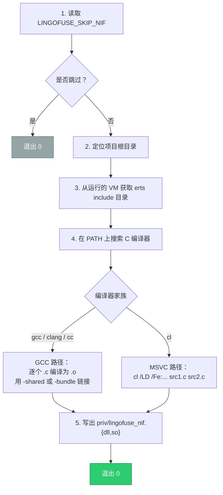

# LingoFuse Erlang 绑定

[LingoFuse](https://github.com/PassByYou888/LingoFuse) 分布式 RPC 框架的 Erlang NIF 绑定。

任何用 Pascal、Python、C++、C#、JavaScript、Rust 或其它 LingoFuse 支持的语言编写的函数，都可以从 Erlang 直接调用。反过来，任何通过本绑定注册的 Erlang 函数，也可以被其它所有 LingoFuse 绑定调用。

## 核心特性

- **完整 C ABI 覆盖。** 全部 37 个 LingoFuse 导出函数均可用，用 RAII 风格的 resource 类型封装。
- **统一 JSON I/O。** 只有一个模块（`lingofuse_json`）被允许做 JSON 编解码，强制实施跨语言线格式契约：紧凑 UTF-8、字面非 ASCII 字符、NUL 结尾的载荷。
- **两种 Call 回调模式。** `register_call/4` 异步投递请求；`register_call_sync/4` 阻塞原生调用方，直到 Erlang 侧调用 `reply/2`。
- **可移植的 NIF 构建。** `c_src/build.escript` 在 Windows、Linux、macOS、BSD 上都能构建 NIF，自动使用主机上可用的 C 编译器（gcc、clang、cc 或 MSVC `cl`）。
- **零运行时依赖。** 基于 OTP 27+ 内置的 `json` 模块；运行时不需要任何第三方 Hex 包。

---

## 目录

1. [环境要求](#1-环境要求)
2. [环境准备](#2-环境准备)
3. [构建](#3-构建)
4. [测试](#4-测试)
5. [测试项目报告](#5-测试项目报告)
6. [Erlang 接口重要信息](#6-erlang-接口重要信息)
7. [快速开始](#7-快速开始)
8. [将 LingoFuse 合并到现有项目](#8-将-lingofuse-合并到现有项目)
9. [编译 NIF（c_src）](#9-编译-nifc_src)
10. [跨语言线格式](#10-跨语言线格式)
11. [已知限制](#11-已知限制)
12. [许可证](#12-许可证)

---

## 1. 环境要求

| 组件 | 最低版本 | 说明 |
|------|----------|------|
| Erlang/OTP | 27 | 已在 OTP 29 上验证 |
| rebar3 | 3.20 | 已随仓库提供，位于项目根目录：`rebar3` 与 `rebar3.cmd` |
| C 编译器 | gcc、clang、cc、cl 任选其一 | 仅在编译 NIF 时需要，详见 §9 |
| LingoFuse 运行时 | 3.10 或更高 | `LingoFuse64.dll` / `liblingofuse.so` / `liblingofuse.dylib` |
| PowerShell | 5.1 或更高 | 仅用于便捷脚本 `build.ps1` / `check.ps1` / `test.ps1` / `clean.ps1` |

本绑定覆盖以下平台/工具链组合：

| 平台 | `build.escript` 使用的 C 编译器 |
|------|--------------------------------|
| Windows (x64) | `gcc`（MinGW-w64）→ `clang` → `cc` → `cl`（MSVC） |
| Linux (x86_64 / aarch64) | `gcc` → `clang` → `cc` |
| macOS (x64 / arm64) | `clang`（Xcode 命令行工具）→ `gcc` → `cc` |
| FreeBSD / OpenBSD | `clang` → `cc` → `gcc` |

---

## 2. 环境准备

### 2.1 安装 Erlang/OTP

安装 OTP 27 或更高版本：

- **Windows**：[Erlang/OTP 安装包](https://www.erlang.org/downloads) 或
  `winget install Erlang.ErlangOTP`
- **Linux**：发行版软件包，或
  [Erlang Solutions 仓库](https://www.erlang-solutions.com/downloads/)
- **macOS**：`brew install erlang`

验证：

```bash
erl -noshell -eval 'io:format("~s~n", [erlang:system_info(otp_release)]), halt().'
```

### 2.2 获取 rebar3

`rebar3` 是一个单一 escript。仓库根目录已经提供它，以及 Windows 的
`rebar3.cmd` 启动器：

```
erlang/
├── rebar3        （escript 本体）
└── rebar3.cmd    （Windows 启动器）
```

如果克隆时缺失这两个文件，可以手动下载：

```bash
# Linux / macOS
curl -L -o rebar3 https://s3.amazonaws.com/rebar3/rebar3
chmod +x rebar3
```

```powershell
# Windows (PowerShell)
Invoke-WebRequest -Uri "https://s3.amazonaws.com/rebar3/rebar3" -OutFile "rebar3"
```

### 2.3 放置 LingoFuse 原生运行时

LingoFuse 共享库必须在 BEAM 启动**之前**放到操作系统加载器搜索路径上。

| 平台 | 运行时库 | 搜索路径变量 |
|------|----------|--------------|
| Windows 64 位 | `LingoFuse64.dll` | `PATH` |
| Windows 32 位 | `LingoFuse32.dll` | `PATH` |
| Linux / BSD | `liblingofuse.so` | `LD_LIBRARY_PATH` |
| macOS | `liblingofuse.dylib` | `DYLD_LIBRARY_PATH` |

它自身的依赖也必须位于同一搜索路径：

- `z_ipc_64.dll`（Windows）或 `libz_ipc.so` / `libz_ipc.dylib`（Linux / macOS）
- 如果使用了 mimalloc 分配器，也要放上去

Windows 示例：

```powershell
$env:PATH += ";D:\CoreLibrary\LingoFuse\Binary"
```

Linux 示例：

```bash
export LD_LIBRARY_PATH="$LD_LIBRARY_PATH:/opt/lingofuse/lib"
```

### 2.4 验证环境

```powershell
cd D:\CoreLibrary\LingoFuse\erlang
.\build.ps1
```

成功时会打印 `[ OK ] rebar3 compile`，并生成
`priv/lingofuse_nif.dll`（或 `.so`）。

如果主机上没有 C 编译器，但你只需要 Erlang 侧，可以用 `-SkipNif`：

```powershell
.\build.ps1 -SkipNif
```

---

## 3. 构建

### 3.1 便捷脚本（推荐）

项目根目录提供四个 PowerShell 脚本。

| 脚本 | 用途 |
|------|------|
| `build.ps1` | 编译 NIF 和 Erlang 代码 |
| `check.ps1` | 静态分析：语法、风格、xref、死代码、escript、dialyzer |
| `test.ps1` | 运行 EUnit 测试套件 |
| `clean.ps1` | 清理构建产物（三个累积级别） |

```powershell
# 完整构建（NIF + Erlang）
.\build.ps1

# 仅 Erlang（无需 C 编译器）
.\build.ps1 -SkipNif

# 先清理，再完整构建
.\build.ps1 -Clean
```

### 3.2 直接使用 rebar3

```powershell
# Windows
.\rebar3.cmd compile

# Linux / macOS
./rebar3 compile
```

跳过 NIF 编译：

```powershell
# PowerShell
$env:LINGOFUSE_SKIP_NIF = "1"
.\rebar3.cmd compile
```

```bash
# bash
LINGOFUSE_SKIP_NIF=1 ./rebar3 compile
```

### 3.3 静态分析

`check.ps1` 运行六项检查。默认启用其中五项：

| 检查项 | 工具 | 覆盖内容 |
|--------|------|----------|
| `compile` | `erl_lint` | 语法、未使用变量、弃用调用、变量遮蔽 |
| `style` | 内嵌扫描器 | 行尾空白、tab 字符、行长 |
| `xref` | `xref` | 未定义函数、未使用本地函数、弃用调用 |
| `hank` | `rebar3_hank` | 死代码（未使用函数、宏、记录、回调） |
| `escript` | `cross/check_escript.escript` | `cross/*.escript` 的语法 |
| `dialyzer` | `dialyzer` | 类型分析（通过 `-Dialyzer` 启用） |
| `fmt --check` | `rebar3_erlfmt` | 格式检查（通过 `-Format` 启用） |

```powershell
# 默认快速套件
.\check.ps1

# 含 dialyzer（首次运行较慢：需要构建 PLT）
.\check.ps1 -Dialyzer

# 全部检查，含 fmt --check
.\check.ps1 -All

# 自动格式化，然后运行默认套件
.\check.ps1 -Fix

# 跳过 escript 扫描
.\check.ps1 -SkipEscript
```

### 3.4 清理

```powershell
# 移除目标文件并执行 rebar3 clean
.\clean.ps1

# 同时移除 _build/ 和 priv/lingofuse_nif.*
.\clean.ps1 -Deep

# 同时移除 rebar.lock 和 dialyzer PLT
.\clean.ps1 -All

# 预览但不实际删除
.\clean.ps1 -All -DryRun
```

---

## 4. 测试

### 4.1 运行完整 EUnit 套件

```powershell
.\test.ps1
```

它会调用 `rebar3 eunit`，运行全部四个套件：

| 模块 | 覆盖范围 |
|------|----------|
| `lingofuse_abi_tests` | 数据句柄生命周期、缓冲区 I/O、位置/大小、应用生命周期、API 注册、回调桥、运行时选项 |
| `lingofuse_json_tests` | JSON 编解码、线格式、NUL 框架、容错读取 |
| `lingofuse_network_tests` | 框架生命周期、本地与回环派发、诊断、客户端绑定 |
| `lingofuse_sync_tests` | 同步 Call 桥、reply/2、超时行为、并发调用 |

### 4.2 运行单个套件

```powershell
.\test.ps1 -Suite lingofuse_sync_tests
```

### 4.3 CI 模式

默认情况下，如果 LingoFuse 原生库缺失，每个套件会打印 `[SKIP]`
并让运行以 `0` 退出。CI 中通常希望缺失原生库成为硬失败：

```powershell
.\test.ps1 -RequireNative
```

它会设置 `LINGOFUSE_REQUIRE_NATIVE=1`。缺失原生库时，套件会抛出
`native_library_unavailable`，运行以非零退出码结束。

### 4.4 直接调用 rebar3

```powershell
# Windows
.\rebar3.cmd eunit

# 单个套件
.\rebar3.cmd eunit --module=lingofuse_json_tests

# Linux / macOS
./rebar3 eunit
```

---

## 5. 测试项目报告

### 5.1 覆盖范围

| 分类 | 所属套件 | 状态 |
|------|----------|:----:|
| 数据句柄：创建、释放、重复释放、缓冲区 I/O、位置、大小、快照 | `lingofuse_abi_tests` | ✅ |
| 应用句柄：创建、释放、重复释放、默认描述 | `lingofuse_abi_tests` | ✅ |
| API 注册：单次注册、重复拒绝、反注册、重新注册 | `lingofuse_abi_tests` | ✅ |
| 回调桥：本地派发（Call 与 Notify）、未注册 API | `lingofuse_abi_tests` | ✅ |
| 运行时选项：已知键、未知键、错误参数、状态往返 | `lingofuse_abi_tests` | ✅ |
| JSON 序列化：紧凑输出、字面 UTF-8、标量往返 | `lingofuse_json_tests` | ✅ |
| 线格式：参考字节序列、NUL 框架、CJK 载荷 | `lingofuse_json_tests` | ✅ |
| 句柄 JSON I/O：往返、空载荷、非法载荷、多载荷、无 NUL 容错、宽松读取 | `lingofuse_json_tests` | ✅ |
| `cstr/1`：binary、charlist、atom、错误参数 | `lingofuse_json_tests` | ✅ |
| 框架生命周期：prepare-done、线程活跃、service tag、client tag、重复拒绝、reset-restart、exit 幂等、shutdown 幂等 | `lingofuse_network_tests` | ✅ |
| 本地派发：`{lf_call, ...}` 与 `{lf_notify, ...}` 消息、错误参数 | `lingofuse_network_tests` | ✅ |
| 远程派发（回环）：Call、Notify、Sequenced Notify、FIFO 顺序 | `lingofuse_network_tests` | ✅ |
| 诊断：`check_app`、`check_api`、状态计数、运行时选项 | `lingofuse_network_tests` | ✅ |
| 客户端绑定：无空闲客户端、成功绑定 | `lingofuse_network_tests` | ✅ |
| 同步桥：基础往返、延迟回复、未知 ref、超时、`set_sync_timeout`、错误参数、多路并发调用 | `lingofuse_sync_tests` | ✅ |
| 异步桥（旧行为）：`{lf_call, Api, Payload}` 消息投递 | `lingofuse_sync_tests` | ✅ |

### 5.2 静态分析

当前源码通过全部静态检查：

| 检查项 | 状态 |
|--------|:----:|
| `compile`（严格 `erl_opts` 警告） | ✅ |
| `style`（行尾空白、tab、行长） | ✅ |
| `xref`（未定义函数、未使用本地函数、弃用调用） | ✅ |
| `hank`（死代码） | ✅ |
| `escript`（全部四个 `cross/*.escript`） | ✅ |
| `dialyzer`（类型分析） | ✅ |

Dialyzer 只启用 `error_handling`、`unmatched_returns`、`unknown` 三类警告。
`underspecs` 被刻意禁用：`lingofuse_json.erl` 的公共 API 使用 `term()`
作为 `dumps/1`、`write_json/2` 等的输入类型，与 OTP 内置 `json` 模块一致。
Dialyzer 会把五个这样的 spec 报告为 "supertype of the success typing"，
没有任何可操作的信息。

### 5.3 NIF 构建

`c_src/build.escript` 生成 `priv/lingofuse_nif.dll`（Windows）或
`priv/lingofuse_nif.so`（Linux / macOS / BSD）。NIF 在 Windows 上用
MinGW-w64 `gcc` 构建并成功加载。

---

## 6. Erlang 接口重要信息

### 6.1 两种 Call 回调模式

绑定支持两种 Call API 注册方式，选择很重要。

**异步模式**（`register_call/4`）：

```erlang
ok = lingofuse:register_call(App, <<"myapi">>, <<"desc">>, self()).
```

注册进程会收到 `{lf_call, ApiName, Payload}`。原生调用方立即返回；
LingoFuse 输出句柄为空。

**同步模式**（`register_call_sync/4`）：

```erlang
ok = lingofuse:register_call_sync(App, <<"myapi">>, <<"desc">>, self()).
```

注册进程会收到 `{lf_call, Ref, ApiName, Payload}`。原生调用方阻塞，
直到 Erlang 侧调用 `reply(Ref, ResultBin)`。该 binary 被写入 LingoFuse
输出句柄，调用方看到的是正常的同步响应。

```erlang
receive
    {lf_call, Ref, <<"myapi">>, Payload} ->
        Result = handle(Payload),
        ok = lingofuse:reply(Ref, Result)
end.
```

### 6.2 同步回调契约

- 同步回调**必须**由**发起调用的进程之外的另一个进程**处理。如果同一
  进程既发起调用又处理回调，会死锁：调用方阻塞在 `local_call/2` 内部，
  无法接收回调消息。请用独立进程执行调用。
- 同步超时后到达的回复返回 `{error, unknown_ref}`。
- 同步超时是进程级设置，默认 30 秒，用 `set_sync_timeout/1` 配置。低于
  100 ms 的值会被钳制到 100 ms。
- 回复延迟上界为轮询间隔（5 ms）。NIF API 没有提供
  `enif_cond_timedwait`，所以同步桥用短睡眠循环轮询。

### 6.3 回调线程

- Call、Notify 和网络事件回调都运行在 LingoFuse 库自有的原生工作线程
  上，**不是** BEAM 调度线程。
- **不要在回调中调用阻塞型 LingoFuse 函数。** 从回调里调用
  `call/2`、`local_call/2`、`prepare_done/0` 或 `shutdown/0` 会让整个
  LingoFuse mesh 死锁。
- 耗时工作应转交给独立的 Erlang 进程。回调应尽快返回。

### 6.4 网络事件

```erlang
ok = lingofuse:set_network_event(ConnectPid, DisconnectPid).
```

- **Connect** 在客户端首次收到服务 API 信息广播时触发，**不是** TCP 握手。
- **Disconnect** 每次物理链路断开时触发一次。
- 两个回调都运行在后台工作线程。
- 传 `undefined` 可禁用对应的回调。

### 6.5 句柄生命周期

- `create_data/1` 创建自动回收句柄。库会在空闲 10 分钟后释放（每 5 秒
  扫描一次）。
- `create_data_permanent/1` 创建永不自动回收的句柄。必须显式释放。
- 两种句柄都会在 `shutdown/0` 时释放。
- `free_data/1` 是幂等的。

### 6.6 应用生命周期

- `create_app/2` 在全局池中创建应用。
- `free_app/1` 把应用从所有客户端解绑，并停止它的顺序线程。底层对象
  保留在全局池中直到 `shutdown/0` 运行。
- 调用 `free_app/1` 后句柄失效。

### 6.7 每个进程只能启动一次

`prepare_done/0` 只在第一次调用时返回 `1`。在同一进程内再次调用
（中间没有 `shutdown/0`）会返回 `0`。这是文档化行为，不是失败。

### 6.8 地址唯一性

默认情况下，每个物理地址只能承载**一个**客户端。对同一地址再次调用
`prepare_client/2` 会返回 `-1`。在准备客户端之前设置
`Overlap_Connection=True` 可以允许同一地址上有多个客户端。

---

## 7. 快速开始

### 7.1 暴露 echo API 的服务端

```erlang
-module(echo_service).
-export([run/0]).

run() ->
    {ok, App} = lingofuse:create_app(<<"EchoService">>, <<"echo demo">>),
    ok = lingofuse:register_call_sync(App, <<"echo">>, <<"echo">>, self()),

    ok = lingofuse:set_option(<<"Wait_Connection_ReadyOk">>, <<"False">>),
    ok = lingofuse:reset_prepare(),
    {ok, _} = lingofuse:prepare_service(<<"ipc:echo">>, <<"ipc:echo">>),
    {ok, _} = lingofuse:prepare_client(<<"ipc:echo">>, App),
    {ok, 1} = lingofuse:prepare_done(),

    loop().

loop() ->
    receive
        {lf_call, Ref, <<"echo">>, Payload} ->
            ok = lingofuse:reply(Ref, Payload),
            loop();
        stop ->
            lingofuse:shutdown()
    end.
```

### 7.2 调用 echo API 的客户端

```erlang
call_echo() ->
    ok = lingofuse:set_option(<<"Wait_Connection_ReadyOk">>, <<"False">>),
    ok = lingofuse:reset_prepare(),
    {ok, _} = lingofuse:prepare_client(<<"ipc:echo">>, undefined),
    {ok, 1} = lingofuse:prepare_done(),

    %% 等待应用在 mesh 上可见。
    ok = wait_for_app(<<"EchoService">>, 5000),

    {ok, P} = lingofuse:create_data(<<"echo">>),
    ok = lingofuse_json:write_json(P, <<"hello">>),
    {ok, R} = lingofuse:call(<<"EchoService">>, P, 3000),
    Reply = lingofuse_json:read_json(R),
    lingofuse:free_data(P),
    lingofuse:free_data(R),
    Reply.

wait_for_app(_Name, 0) ->
    error(app_not_found);
wait_for_app(Name, Remaining) ->
    case lingofuse:check_app(Name) of
        {ok, true} -> ok;
        _ ->
            timer:sleep(100),
            wait_for_app(Name, Remaining - 100)
    end.
```

### 7.3 Cross 演示

`cross/` 下的三个脚本与 C++ / C# / Python / JavaScript 的 Cross 演示
逐字节互通，可以与任意其他语言的 Cross 演示互操作：

```bash
# 终端 1：协调者（信标）
escript cross/cross_service.escript

# 终端 2：工作节点（注册 "add" 和 "inv_seri"）
escript cross/cross_node.escript

# 终端 3：负载测试客户端
escript cross/cross_call.escript
```

Windows 上使用 `.cmd` 包装脚本：

```powershell
cross\run_service.cmd
cross\run_node.cmd
cross\run_call.cmd
```

---

## 8. 将 LingoFuse 合并到现有项目

### 8.1 方案 A —— 复制源码树

把下列内容复制到你的项目中：

```
your_project/
├── src/
│   ├── lingofuse.erl
│   ├── lingofuse_app.erl
│   ├── lingofuse_json.erl
│   ├── lingofuse_nif.erl
│   └── lingofuse_sup.erl
├── c_src/
│   ├── build.escript
│   ├── lf_bindings.h
│   ├── lf_loader.c
│   ├── lf_loader.h
│   ├── lingofuse_nif.c
│   └── Makefile
└── priv/             （构建时自动创建）
```

然后在你的 `rebar.config` 中加入：

```erlang
{pre_hooks, [
    {".*", compile, "escript c_src/build.escript"}
]}.
```

### 8.2 方案 B —— 作为 rebar3 依赖

如果 Erlang 绑定已发布为 Hex 或 Git 包，加入 `deps`：

```erlang
{deps, [
    {lingofuse, {git, "https://github.com/PassByYou888/LingoFuse.git",
                 {branch, "main"}}}
]}.
```

依赖自身的 `rebar.config` 里的 `pre_hook` 会把它的 NIF 编译到它自己的
`priv/`，你的项目不需要做额外工作。

### 8.3 方案 C —— 只嵌入 NIF，直接调用 ABI

如果你已经有完整的 OTP release 并希望完全控制，可以自行编译 NIF 并用
`erlang:load_nif/2` 加载：

1. 把 `c_src/*.c` 编译成 `priv/lingofuse_nif.{dll,so}`。
2. 把 `lingofuse_nif.beam` 加入代码路径。
3. 应用启动时调用 `lingofuse:ensure_loaded()`。

这就是默认绑定里 `lingofuse_app.erl` 的做法。

### 8.4 必需的构建产物

| 产物 | 位置 | 产生者 |
|------|------|--------|
| `lingofuse_nif.{dll,so}` | `priv/` | `c_src/build.escript` |
| `lingofuse*.beam` | `_build/default/lib/lingofuse/ebin/` | `rebar3 compile` |
| `LingoFuse64.dll` / `liblingofuse.so` / `liblingofuse.dylib` | 操作系统加载器搜索路径 | LingoFuse 核心发行包 |

### 8.5 上线前核对清单

生产环境启动 BEAM 之前，确认：

- [ ] LingoFuse 运行时库已放到 `PATH` / `LD_LIBRARY_PATH` /
      `DYLD_LIBRARY_PATH`。
- [ ] 它的依赖（`z_ipc_*.dll`、`libz_ipc.so`、分配器）在同一搜索路径上。
- [ ] `priv/lingofuse_nif.{dll,so}` 已存在。
- [ ] `LINGOFUSE_SKIP_NIF` **未**被设置（除非你刻意分发预编译 NIF）。
- [ ] 应用启动时调用 `lingofuse:ensure_loaded/0`，并在返回
      `{error, lf_not_loaded}` 时快速失败。

---

## 9. 编译 NIF（c_src）

NIF 是一个 C11 共享库，把 LingoFuse 的 C ABI 暴露给 BEAM。它由
`c_src/build.escript` 构建，`rebar.config` 的 `pre_hooks` 会让
`rebar3 compile` 自动调用它。

### 9.1 build.escript 做什么



脚本不硬编码任何路径。项目根目录与 erts include 目录都从
`escript:script_name()` 和运行的 VM 推导，所以在所有平台上行为一致。

### 9.2 编译器检测顺序

`build.escript` 按下列顺序查找编译器，使用第一个在 `PATH` 上找到的：

| 顺序 | 名称 | 说明 |
|:----:|------|------|
| 1 | `gcc` | Windows 上是 MinGW-w64，Linux/macOS/BSD 上是原生 |
| 2 | `clang` | LLVM，全平台 |
| 3 | `cc` | POSIX 通用别名 |
| 4 | `cl` | MSVC，仅 Windows，作为最后兜底 |

`gcc` 和 `clang` 优先，因为它们产出的 NIF 在所有 OTP 构建上都能加载，
无需额外配置。MSVC 是备选，产出的 DLL 运行时行为等价。

### 9.3 平台矩阵

| 平台 | 编译器 | 链接标志 | 产物 |
|------|--------|----------|------|
| Windows (MinGW) | `gcc` | `-shared` | `priv/lingofuse_nif.dll` |
| Windows (LLVM) | `clang` | `-shared` | `priv/lingofuse_nif.dll` |
| Windows (MSVC) | `cl` | `/LD /Fe:<target>` | `priv/lingofuse_nif.dll` |
| Linux (x86_64 / aarch64) | `gcc` 或 `clang` | `-shared` | `priv/lingofuse_nif.so` |
| macOS (x64 / arm64) | `clang` | `-bundle -undefined dynamic_lookup` | `priv/lingofuse_nif.so` |
| FreeBSD / OpenBSD | `clang` 或 `cc` | `-shared` | `priv/lingofuse_nif.so` |

**macOS 注意。** macOS 上的 NIF 是一个 *bundle*，不是共享库，
`erl_*` / `enif_*` 符号由 BEAM 在加载时解析。必须使用
`-bundle -undefined dynamic_lookup`；单纯用 `-shared` 会加载失败。

**Windows / MSVC 注意。** `cl.exe` 必须在 "x64 Native Tools Command
Prompt for VS" 中调用。脚本还会查找
`erts-<ver>/lib/erl_nif.lib` 并链接（若存在）；找不到则依赖运行时
符号解析——这与 gcc/clang 路径的行为一致。

### 9.4 环境变量

| 变量 | 效果 |
|------|------|
| `LINGOFUSE_SKIP_NIF` | 设为任意非空值时，`build.escript` 直接成功退出，不编译任何内容。适用于只验证 Erlang 侧的 CI 任务，或没有 C 编译器的主机。 |

没有用于强制指定编译器的环境变量。搜索顺序是固定的。

### 9.5 手动编译（绕过 rebar3）

**用 build.escript：**

```bash
# 从项目根目录
escript c_src/build.escript
```

**用 Makefile**（需要 GNU Make；Windows 上需 MSYS2）：

```bash
cd c_src
make            # 生成 ../priv/lingofuse_nif.{dll,so}
make clean      # 移除目标文件与产物
make rebuild    # clean + all
```

Makefile 支持以下覆盖：

| 变量 | 默认值 | 含义 |
|------|--------|------|
| `ERL_ROOT` | `erl -eval code:root_dir()` 的结果 | OTP 安装根目录 |
| `ERTS_VER` | `erl -eval erlang:system_info(version)` 的结果 | erts 版本字符串 |
| `CC` | `cc` | 使用的 C 编译器 |
| `CFLAGS` | `-O2 -Wall -Wextra -fPIC -std=c11` | 编译标志 |

Makefile **不**支持 MSVC 的 `nmake`。Windows 上请用 MSYS2 的
`mingw32-make`，或改用 `build.escript`。

### 9.6 验证构建

成功构建后，NIF 位于：

```
priv/
└── lingofuse_nif.dll      （Windows）
└── lingofuse_nif.so       （Linux、macOS、BSD）
```

可以在 Erlang shell 中手动加载验证：

```erlang
1> code:add_patha("_build/default/lib/lingofuse/ebin").
2> lingofuse:ensure_loaded().
ok
3> lingofuse:check_main_thread().
{ok, false}
```

NIF 加载时会向 stderr 打印诊断。成功加载长这样：

```
[lingofuse_nif] NIF loaded from .../priv/lingofuse_nif
[lingofuse_nif] LingoFuse library loaded (platform=Windows 64-bit, file=LingoFuse64.dll)
```

如果找不到 LingoFuse 运行时，第二行会变成多行诊断，指明期望的文件名
和平台。

### 9.7 扩展 NIF

NIF 函数表在 `c_src/lingofuse_nif.c` 底部：

```c
static ErlNifFunc nif_funcs[] = {
    {"create_data", 1, nif_create_data, 0},
    ...
};
```

新增导出：

1. 添加一个 `static ERL_NIF_TERM nif_xxx(ErlNifEnv*, int, const ERL_NIF_TERM[])`。
2. 在 `nif_funcs` 中加入对应行。
3. 在 `src/lingofuse_nif.erl` 中加同 arity 的存根。
4. 若属于公共 API，在 `src/lingofuse.erl` 中导出包装。

现有 37 个导出全部遵循这一模式，可作为模板参考。

---

## 10. 跨语言线格式

LingoFuse 数据句柄上的 JSON 载荷是：

```
[UTF-8 JSON 文本][NUL 字节]
```

逻辑载荷 `{"a":1}` 对应字节序列 `7B 22 61 22 3A 31 7D 00`，
与其它所有绑定完全一致：

| 绑定 | `{"a":1}` 的字节 |
|------|------------------|
| Pascal | `7B 22 61 22 3A 31 7D 00` |
| C++ | same |
| C# | same |
| Python | same |
| Rust | same |
| JavaScript | same |
| **Erlang** | **same** |

非 ASCII 字符以字面 UTF-8 传输。任何绑定都不会对可以直接写出的字符
发出 `\uXXXX` 转义。

所有 JSON 都经过 `lingofuse_json`：

```erlang
%% 编码：紧凑、字面 UTF-8、无 \uXXXX 转义。
Bin = lingofuse_json:dumps(#{<<"name">> => <<"张三"/utf8>>}).
%% => <<"{\"name\":\"张三\"}">>

%% 写入句柄，附带必需的 NUL 结尾。
ok = lingofuse_json:write_json(Hnd, Term).

%% 读回。空载荷返回 `undefined`。
Term = lingofuse_json:read_json(Hnd).

%% 宽松读取：非 JSON 载荷时返回原始字节。
Term | Bin | undefined = lingofuse_json:read_json_or_bytes(Hnd).
```

---

## 11. 已知限制

- **默认每个地址只能有一个客户端。** 在 `prepare_client/2` 之前设置
  `Overlap_Connection=True` 可以允许同一物理地址上有多个客户端。
- **回调中不得调用阻塞型 LingoFuse 函数。** 从 Call 或 Notify 回调
  里调用 `call/2`、`local_call/2`、`prepare_done/0` 或 `shutdown/0`
  会让整个 mesh 死锁。
- **NIF 崩溃会拖垮 BEAM 节点。** C 桥中的任何 bug 都会摧毁整个运行
  时。上线前请在隔离环境测试新功能。
- **同步 Call 延迟受轮询间隔限制。** 同步桥使用 5 ms 轮询循环
  （NIF API 没有提供 `enif_cond_timedwait`）。回复延迟因此最多 5 ms。
- **`set_sync_timeout/1` 是进程级的。** 所有挂起的同步调用共享一个
  超时值。
- **MSVC 构建需要 Native Tools 命令提示符。** `cl.exe` 不在普通 shell
  的 `PATH` 上。请用 "x64 Native Tools Command Prompt for VS"，或用
  `vcvarsall.bat` 配置环境。
- **`build.escript` 不强制指定编译器。** 若需要特定编译器，把其它
  编译器从 `PATH` 中移除，或按 §9.3 的参数手动调用。

---

## 12. 许可证

MIT。见 `LICENSE`。
