# LingoFuse Fortran 绑定

> 用 Fortran 直接调用其它语言写的函数，也让其它语言直接调用 Fortran 函数。
> 不需要写 IDL，不需要生成桩代码，不需要手写 HTTP 服务。

---

## 目录

1. [写在前面](#一写在前面)
2. [环境要求](#二环境要求)
3. [编译器与工具链要求](#三编译器与工具链要求)
4. [接口原理](#四接口原理)
5. [构建方法](#五构建方法)
6. [如何使用 Fortran 接口](#六如何使用-fortran-接口)
7. [API 速查](#七api-速查)
8. [测试项目说明](#八测试项目说明)
9. [测试与应用场景对照](#九测试与应用场景对照)
10. [故障排查](#十故障排查)

---

## 一、写在前面

### 1.1 目标

让 Fortran 成为 LingoFuse 的**一等公民**：

- Fortran 函数可以被 Pascal / Python / C++ / C# / Rust / Go / JavaScript / Dart / Java / Swift / Zig / Erlang / Ruby 调用。
- Fortran 代码可以调用上述任意语言写的函数。
- 底层字节格式与其它所有绑定**完全一致**。

### 1.2 为什么需要一个 C++ 中间层

Fortran 的 `iso_c_binding` 能直接调用 C 函数，但 LingoFuse 的动态库在 ABI 上有一段由 C++ RAII 封装（`LingoFuse.hpp` / `lf_io.hpp`）承载的便利性——特别是**回调、异常隔离、统一 I/O 策略**。直接让 Fortran 与 LingoFuse 裸 C ABI 对接会把这些便利重新实现一遍，代价大且容易出细节问题。

因此采用三层结构：

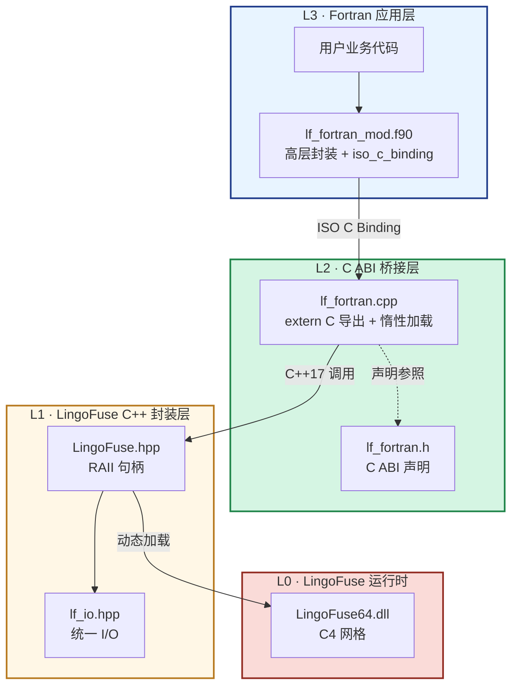

**分工明确**：

| 层 | 语言 | 职责 |
|----|------|------|
| L3 | Fortran | 业务逻辑、算法、数值计算 |
| L2 | C++ | 跨语言 ABI 桥接、错误码翻译、字符串编解码、回调 trampoline |
| L1 | C++ | RAII 资源管理、统一 JSON/字符串/字节 I/O |
| L0 | Pascal | C4 服务网格、IPC/TCP 传输、负载均衡、服务发现 |

---

## 二、环境要求

### 2.1 操作系统

| 平台 | 最低版本 | 已验证 |
|------|----------|:------:|
| Windows 10 | 1809+ | ✅ Windows 10 / 11 x64 |
| Windows 11 | 任意 | ✅ |
| Windows Server | 2019+ | ⏳ |
| Linux | 现代 glibc | ⏳ 理论可行，未实测 |
| macOS | 12+ | ⏳ 理论可行，未实测 |

当前绑定**只在 Windows x64 上经过完整验证**。Linux / macOS 的代码路径已经预留（`bind(C)` 与 `extern "C"` 都是跨平台标准），但未在真实机器上运行过。

### 2.2 软件依赖总览

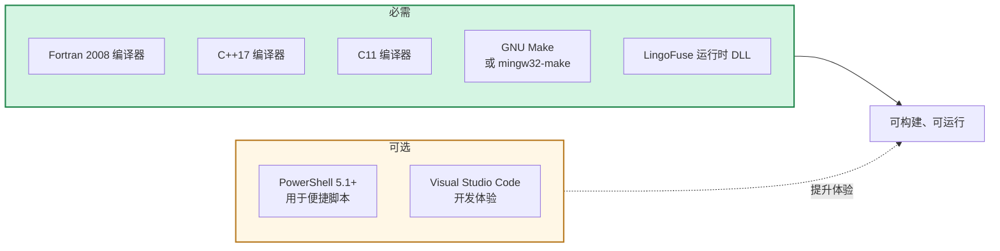

### 2.3 LingoFuse 运行时（必需）

核心动态库由 LingoFuse 主仓库的 `Binary/` 目录提供。Windows x64 需要以下文件：

| 文件 | 作用 |
|------|------|
| `LingoFuse64.dll` | C4 服务网格、RPC 引擎 |
| `z_ipc_64.dll` | 同机 IPC 传输 |
| `mimalloc64.dll` | 高性能内存分配器 |
| `mimalloc-redirect.dll` | 分配器重定向（可选，但建议一起放） |

**放置方式**：把 4 个文件放在 exe 同目录，或把它们的目录加入系统 `PATH`。`LF_LoadLibrary` 会按此顺序自动搜索，不需要任何显式配置。

### 2.4 编译产物清单

构建完成后，`c_ext\` 目录下应出现：

| 文件 | 类型 | 说明 |
|------|------|------|
| `lf_fortran_mod.o` / `.mod` | 中间 | Fortran 模块对象与模块接口文件 |
| `LingoFuse.o` | 中间 | C ABI 动态加载器 |
| `lf_fortran.o` | 中间 | C++ 桥接层 |
| `test_lf_fortran_c.exe` | 可执行 | C ABI 单元测试 |
| `test_lf_fortran_f.exe` | 可执行 | Fortran 绑定单元测试 |
| `test_lf_json_f.exe` | 可执行 | Fortran JSON 测试 |

`cross_demo\` 目录下应出现：

| 文件 | 类型 | 说明 |
|------|------|------|
| `cross_service.exe` | 可执行 | Fortran 信标（协调器） |
| `cross_node.exe` | 可执行 | Fortran 计算节点 |
| `cross_call.exe` | 可执行 | Fortran 调用端 |
| `cross_call_cpp.exe` | 可执行 | C++ 调用端（跨语言验证） |

---

## 三、编译器与工具链要求

### 3.1 三个编译器，各司其职

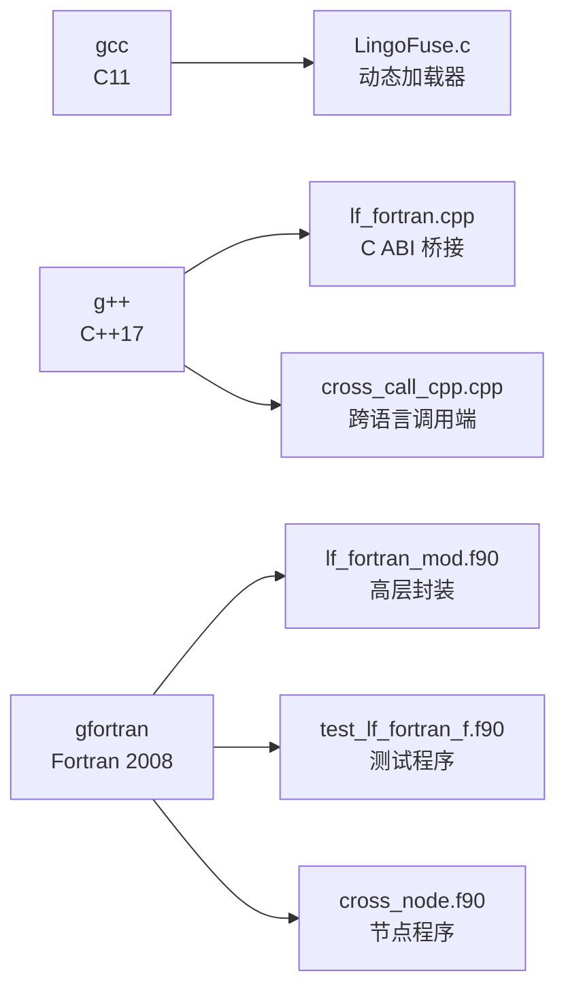

### 3.2 c_ext 层对编译器的具体要求

C 桥接层由三个源文件组成，各自对编译器有明确要求：

| 源文件 | 语言标准 | 必需的编译器特性 |
|--------|----------|------------------|
| `LingoFuse.c` | **C11** | 动态加载（`LoadLibraryA` / `dlopen`）、`int64_t` / `uint64_t`、函数指针 |
| `lf_fortran.cpp` | **C++17** | `extern "C"` 导出、`std::once_flag`、`try / catch (...)`、`reinterpret_cast` |
| `test_lf_fortran.c` | **C11** | `_Static_assert`、变参宏、`inttypes.h` |

**最低编译器版本**：

| 编译器 | 最低版本 | 推荐 |
|--------|:--------:|:----:|
| GCC / MinGW-w64 | 9.0 | 13.0+ |
| Clang | 10.0 | 17.0+ |
| MSVC | 2019 (19.20) | 2022 |
| gfortran | 9.0 | 13.0+ |

**版本一致性要求**：

> ⚠️ **C++ 编译器和 Fortran 编译器必须来自同一套工具链**。

原因：链接 Fortran 目标文件时，会用 C++ 链接器（`g++`）并附带 `-lgfortran`，如果 `g++` 版本与 `gfortran` 版本不一致，会报 `undefined reference to __gfortran_*` 之类的符号缺失。

同一套 MinGW-Builds / MSYS2 / WinLibs 发行版里的三个编译器天然版本一致。

### 3.3 Fortran 编译器必须支持的语言特性

| 特性 | 标准 | 用途 |
|------|:----:|------|
| `iso_c_binding` 模块 | F2003 | 全部 C 互操作 |
| `bind(C)` 过程属性 | F2003 | 回调注册 |
| `c_funloc` / `c_funptr` / `c_ptr` / `c_associated` | F2003 | 回调传递、指针判空 |
| `allocatable` + `character(len=:)` | F2003 | 动态字符串返回 |
| `int(x, kind)` 转换函数 | F2003 | 类型安全 |
| `size(arr)` / `len(str)` 内建 | F2003 | 缓冲区大小计算 |

**不建议**使用 `block ... end block`（F2008 新增）：部分 IDE 的 Fortran 插件对其支持不佳，本绑定刻意避开。

### 3.4 已验证的工具链

| 组件 | 版本 | 来源 |
|------|------|------|
| gfortran | 16.1.0 | MinGW-Builds x86_64-win32-seh-rev1 |
| g++ | 16.1.0 | 同上 |
| gcc | 16.1.0 | 同上 |
| GNU Make | mingw32-make | 随 MinGW-Builds 提供 |

---

## 四、接口原理

### 4.1 为什么 Fortran 无法直接调用 LingoFuse

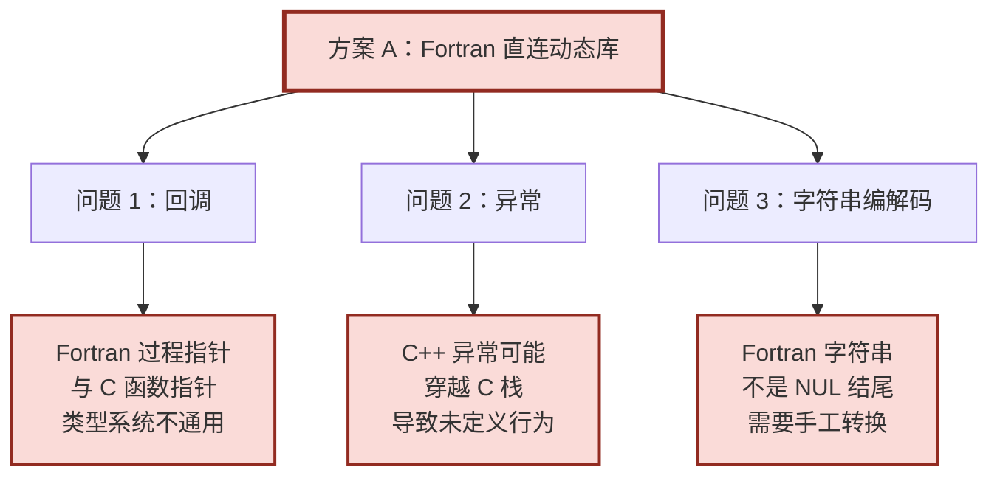

C++ 中间层把这三个问题全部吸收：

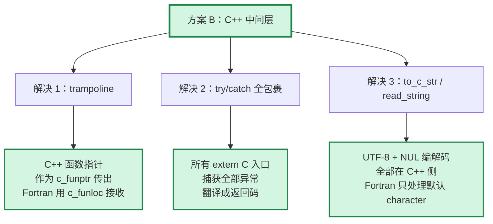

### 4.2 回调机制：跨越三层语言边界

用户注册一个 Fortran 回调，当远端发起调用时，LingoFuse 会把它送到 Fortran。中间要穿过 C4 → C++ → Fortran 三层。

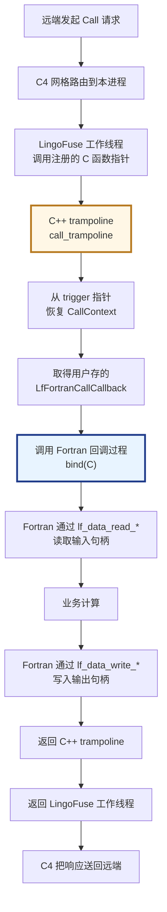

**CallContext 的生命周期**：C++ 桥接层为每个注册的 API 分配一个小结构体，用 `Box::into_raw` 类似的手段泄漏（不回收），把指针作为 `trigger` 传给 LingoFuse。这样做是因为 LingoFuse 可能在任意时刻调用回调——包括注销过程中。回收会引入 use-after-free 窗口，代价是每个 API 泄漏几十字节，对任何现实程序都可忽略。

### 4.3 字符串编解码：NUL 帧契约

所有跨语言字符串都是 **UTF-8 字节 + 单个 NUL**。Fortran 默认的 `character(len=*)` 不是 NUL 结尾，需要转换。

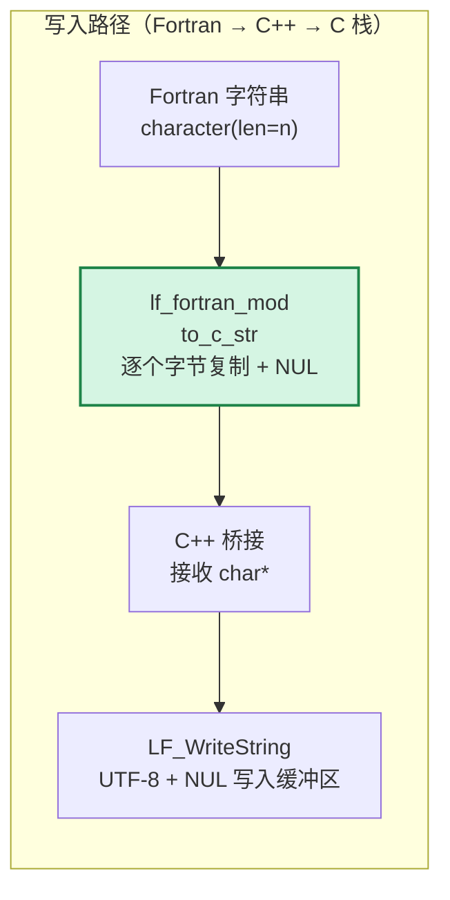

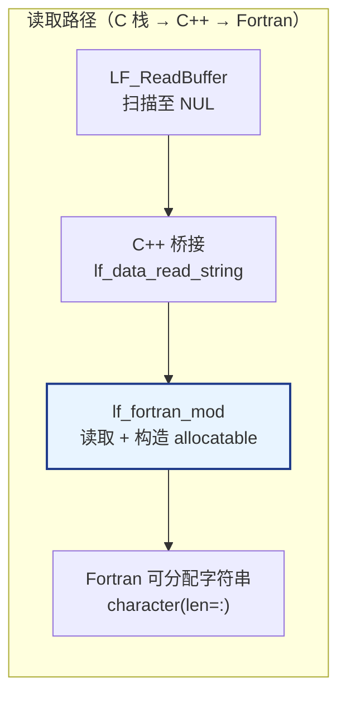

**容错读取**：如果缓冲区里**没有 NUL**（例如来自 HTTP 桥接的裸 JSON），读取方会消费整个缓冲区并返回，游标停在 `size + 1`。这与 Pascal / C++ / C# / Python / JavaScript 的行为**逐字节一致**。

### 4.4 数据句柄的两种生命周期

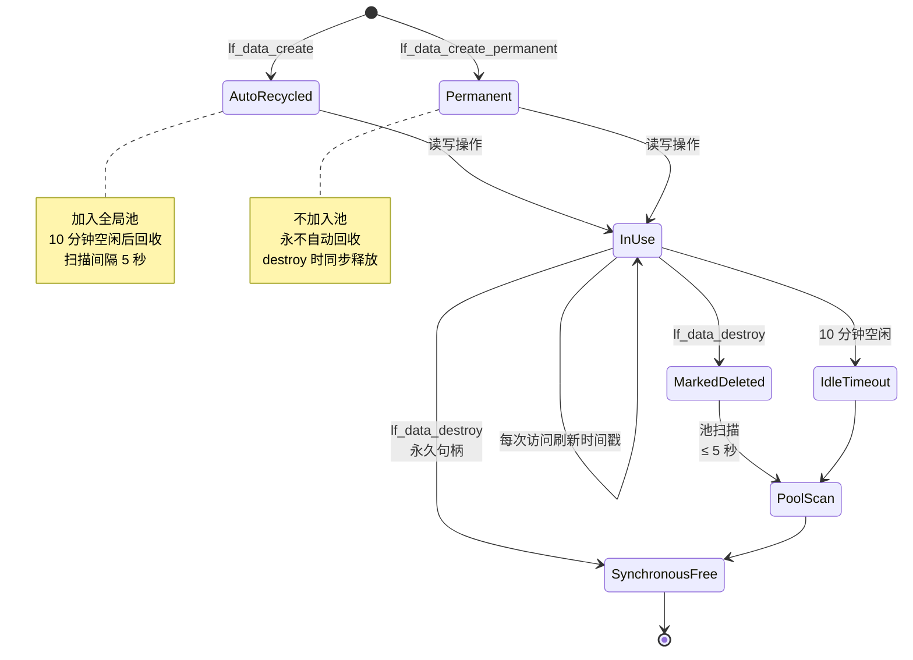

**使用建议**：

- **默认用 `lf_data_create`**（自动回收）。池会兜底忘记释放的句柄。
- **仅在需要跨进程生命周期时用 `lf_data_create_permanent`**（缓存模板、全局注册表）。
- **不要依赖自动回收**：高强度调用下句柄累积速度可能超过回收速度。始终显式 `lf_data_destroy`。

### 4.5 动态库加载契约

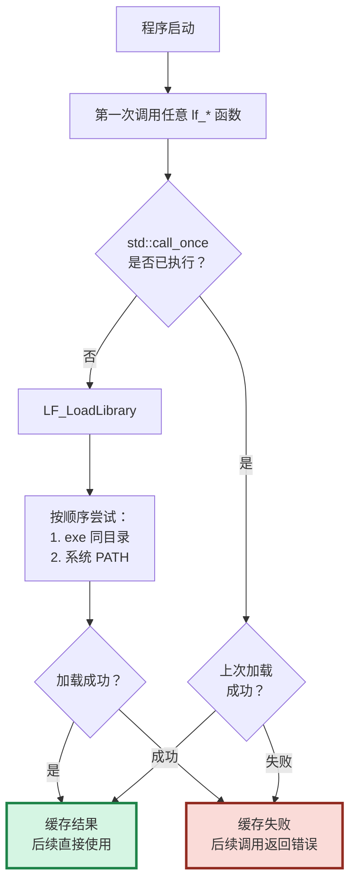

**关键点**：无论你调用的是 `lf_data_create` 还是 `lf_check_app`，C++ 桥接层都会先做一次 `ensure_loaded`，确保动态库已经加载。**用户不需要显式调用 `lf_load_library`**——虽然它也提供了，用于在程序启动时快速失败。

---

## 五、构建方法

### 5.1 目录结构

```
fortran/
├── README.md               本文件
├── check_env.ps1           环境诊断脚本
├── build.ps1               构建脚本
├── clean.ps1               清理脚本
├── test.ps1                测试脚本
├── run_cross_demo.ps1      跨语言 demo 一键启动
│
├── c_ext/                  C-ABI 桥接层 + 单元测试
│   ├── Makefile
│   ├── lf_fortran.h        C ABI 头文件
│   ├── lf_fortran.cpp      C ABI 实现
│   ├── lf_fortran_mod.f90  Fortran 模块
│   ├── LingoFuse.c / .h    LingoFuse C 动态加载器
│   ├── LingoFuse.hpp       LingoFuse C++ RAII 封装
│   ├── lf_io.hpp           统一 I/O 层
│   ├── json.hpp            nlohmann/json
│   ├── test_lf_fortran.c   C ABI 测试
│   ├── test_lf_fortran_f.f90  Fortran 绑定测试
│   └── test_lf_json_f.f90  Fortran JSON 测试
│
└── cross_demo/             跨语言 Demo
    ├── Makefile
    ├── cross_service.f90   Fortran 信标
    ├── cross_node.f90      Fortran 计算节点
    ├── cross_call.f90      Fortran 调用端
    └── cross_call_cpp.cpp  C++ 调用端（跨语言验证）
```

### 5.2 构建流程

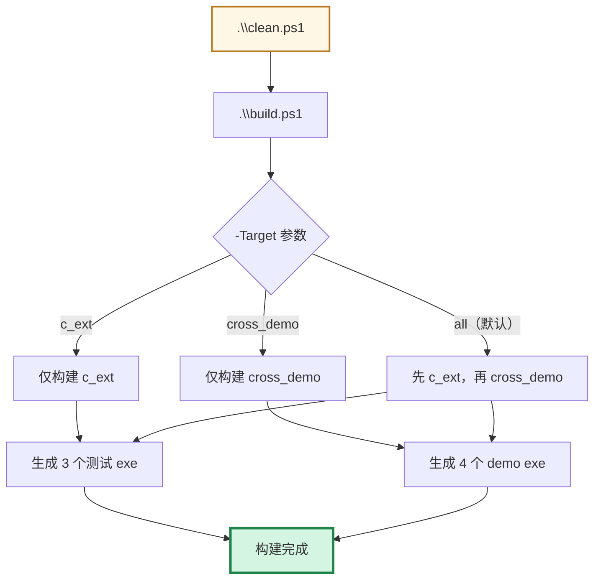

### 5.3 常用命令

在 `fortran\` 目录下执行：

```powershell
# 全清 + 全构建 + 全测试
.\clean.ps1
.\build.ps1
.\test.ps1

# 仅构建 c_ext（单元测试部分）
.\build.ps1 -Target c_ext

# 仅构建 cross_demo（跨语言演示）
.\build.ps1 -Target cross_demo

# 并行构建（4 个 job）
.\build.ps1 -MakeArgs '-j4'

# 只跑 Fortran 绑定测试
.\test.ps1 -F -SkipBuild

# 只跑 Fortran JSON 测试
.\test.ps1 -J -SkipBuild

# 一键跑跨语言 demo（自动按顺序启动三个进程）
.\run_cross_demo.ps1
```

### 5.4 PowerShell 执行策略

首次运行如遇 `无法加载文件 ... 未对文件进行数字签名` 错误：

```powershell
# 只影响当前窗口
Set-ExecutionPolicy -Scope Process -ExecutionPolicy Bypass

# 或调用时临时绕过
powershell -ExecutionPolicy Bypass -File .\build.ps1
```

### 5.5 环境诊断

`check_env.ps1` 用于检查三个编译器是否齐全、版本是否匹配：

```powershell
.\check_env.ps1
```

它会依次检查：

| 检查项 | 说明 |
|--------|------|
| 操作系统 | Windows x64 |
| PowerShell 版本 | ≥ 5.1 |
| Fortran 编译器 | gfortran 或 x86_64-w64-mingw32-gfortran |
| C++ 编译器 | g++ 或 x86_64-w64-mingw32-g++ |
| C 编译器 | gcc 或 x86_64-w64-mingw32-gcc |
| GNU Make | mingw32-make 或 make |
| 版本一致性 | C++ 与 Fortran 编译器主版本号相同 |

---

## 六、如何使用 Fortran 接口

### 6.1 最小服务端

```fortran
module my_service_callbacks
  use iso_c_binding
  use lf_fortran_mod
  implicit none
  private
  public :: add_callback
contains
  subroutine add_callback(input, output) bind(C)
    type(c_ptr), value :: input, output
    integer(c_int32_t) :: a, b, s
    if (lf_data_read_int32(input, a) /= 1) return
    if (lf_data_read_int32(input, b) /= 1) return
    s = a + b
    if (lf_data_write_int32(output, s) /= 1) return
  end subroutine
end module

program server
  use iso_c_binding
  use lf_fortran_mod
  use my_service_callbacks
  implicit none
  type(c_ptr) :: app
  integer(c_int) :: rc
  character(len=8) :: line

  app = lf_app_create('Calculator', 'Fortran calculator')
  rc = lf_app_register_call(app, 'add', 'Add two ints', &
                            c_funloc(add_callback))

  call lf_set_option('Wait_Ready', 'False')
  call lf_reset_prepare()
  rc = lf_prepare_service('ipc:calc', 'ipc:calc')
  rc = lf_prepare_client('ipc:calc', app)
  rc = lf_prepare_done()

  write(*, '(A)') 'Ready. Press Enter...'
  read(*, '(A)') line

  call lf_exit_main_thread()
  call lf_app_destroy(app)
  call lf_shutdown()
end program
```

### 6.2 最小调用端

```fortran
program client
  use iso_c_binding
  use lf_fortran_mod
  implicit none
  type(c_ptr) :: req, resp
  integer(c_int32_t) :: result
  integer(c_int64_t) :: sz

  call lf_set_option('Wait_Ready', 'False')
  call lf_reset_prepare()
  call lf_prepare_client('ipc:calc', c_null_ptr)
  call lf_prepare_done()

  ! Wait for the target app to appear
  do
    if (lf_check_app('Calculator') /= 0) exit
    call sleep_ms(200)
  end do

  req = lf_data_create('add')
  call lf_data_write_int32(req, 5_c_int32_t)  ! 但注意：这是函数，不用 call
  ! 正确写法：if (lf_data_write_int32(req, 5_c_int32_t) /= 1) stop

  resp = lf_call('Calculator', req, 3000_c_int64_t)
  if (c_associated(resp)) then
    sz = lf_data_get_size(resp)
    if (sz >= 4) then
      if (lf_data_read_int32(resp, result) == 1) then
        write(*, '(A,I0)') '5 + 5 = ', result
      end if
    end if
    call lf_data_destroy(resp)
  end if
  call lf_data_destroy(req)

  call lf_exit_main_thread()
  call lf_shutdown()
end program
```

### 6.3 函数 vs 子程序：最重要的一条规则

这是 Fortran 绑定最容易踩的坑：**一部分 API 是函数（返回整数状态码），一部分是子程序（无返回值）**。

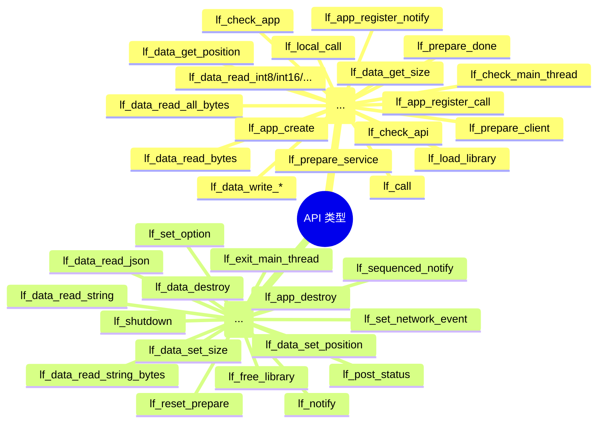

**判断规则**：

| 是否需要返回值？ | 类型 | 调用方式 |
|:---------------:|------|----------|
| 是（状态码 / 句柄 / 大小） | Function | `rc = f(...)` 或 `if (f(...) /= 1)` |
| 否 | Subroutine | `call s(...)` |

在 `lf_fortran_mod.f90` 里，所有函数都声明为 `function`，所有子程序都声明为 `subroutine`。编错了编译器会报 `'xxx' has a type, not consistent with CALL`。

### 6.4 应用模式：服务注册与调用

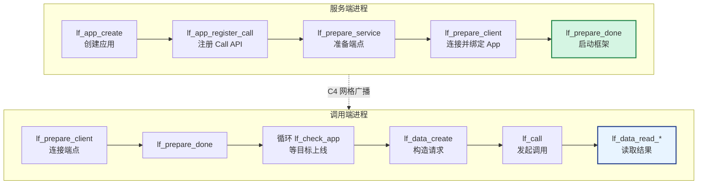

**核心规则**：

1. **先注册 API，再 `prepare_client`**。如果顺序颠倒，注册信息不会包含在广播里，其他进程看不到你注册的 API。
2. **调用端一定要等目标上线**。用 `lf_check_app` / `lf_check_api` 轮询，超时 5–10 秒。
3. **广播传播有约 3 秒延迟**。刚启动的节点不会立刻出现在整个 mesh 上。

### 6.5 清理顺序

**严格遵守**（对应 Pascal 的 LF-CLEAN-001 契约）：

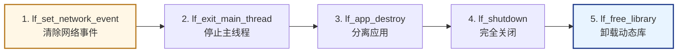

**为什么顺序重要**：

- `lf_exit_main_thread` 会清空**所有数据句柄**，包括永久句柄。在此之后使用句柄会崩溃。
- `lf_app_destroy` 必须在 `lf_shutdown` **之前**。反过来会访问已销毁的池。
- `lf_free_library` 必须在最后。它是桥接层自己的动作，不是 LingoFuse 的运行时刻。

每一步都是幂等的，所以用 `try / finally` 或者反复调用都不会出错。

---

## 七、API 速查

### 7.1 生命周期

| 函数 | 类型 | 说明 |
|------|:----:|------|
| `lf_load_library()` | Function → int | 显式加载动态库（可选，桥接层会惰性加载） |
| `lf_free_library()` | Subroutine | 卸载动态库 |
| `lf_shutdown()` | Subroutine | 完全关闭 LingoFuse 框架 |
| `lf_exit_main_thread()` | Subroutine | 请求主线程退出；会清空所有数据句柄 |

### 7.2 应用句柄

| 函数 | 类型 | 说明 |
|------|:----:|------|
| `lf_app_create(name, desc)` | Function → c_ptr | 创建应用 |
| `lf_app_destroy(app)` | Subroutine | 分离应用 |
| `lf_app_register_call(app, api, desc, c_funloc(cb))` | Function → int | 注册 Call API |
| `lf_app_register_notify(app, api, desc, c_funloc(cb))` | Function → int | 注册 Notify API |
| `lf_get_app_name(app, out[, status])` | Subroutine | 查询应用名 |

### 7.3 数据句柄

| 函数 | 类型 | 说明 |
|------|:----:|------|
| `lf_data_create(api)` | Function → c_ptr | 自动回收句柄 |
| `lf_data_create_permanent(api)` | Function → c_ptr | 永久句柄 |
| `lf_data_destroy(h)` | Subroutine | 销毁句柄 |

### 7.4 标量 I/O（全部小端序）

| 类别 | 写入（Function → int） | 读取（Function → int） |
|------|-----------------------|-----------------------|
| 8 位有符号 | `lf_data_write_int8` | `lf_data_read_int8` |
| 16 位有符号 | `lf_data_write_int16` | `lf_data_read_int16` |
| 32 位有符号 | `lf_data_write_int32` | `lf_data_read_int32` |
| 64 位有符号 | `lf_data_write_int64` | `lf_data_read_int64` |
| 8 位无符号 | `lf_data_write_uint8` | `lf_data_read_uint8` |
| 16 位无符号 | `lf_data_write_uint16` | `lf_data_read_uint16` |
| 32 位无符号 | `lf_data_write_uint32` | `lf_data_read_uint32` |
| 64 位无符号 | `lf_data_write_uint64` | `lf_data_read_uint64` |
| 单精度浮点 | `lf_data_write_float32` | `lf_data_read_float32` |
| 双精度浮点 | `lf_data_write_float64` | `lf_data_read_float64` |

> ⚠️ **Fortran 没有无符号类型**。`lf_data_write_uint8` 等接受 `c_int8_t` 参数，值需要落在有符号范围内。无符号边界值（255、65535、0xDEADBEEF）通过 `char()` 构造字节序列或由 C 测试覆盖。

### 7.5 字符串 / 字节 / JSON

| 函数 | 类型 | 说明 |
|------|:----:|------|
| `lf_data_write_string(h, s)` | Function → int | 写 UTF-8 + NUL |
| `lf_data_read_string(h, out[, status])` | Subroutine | 读到 NUL；out 是 allocatable |
| `lf_data_write_string_bytes(h, data, n)` | Function → int | 写原始字节 + NUL |
| `lf_data_read_string_bytes(h, buf, n[, status])` | Subroutine | 读到 NUL |
| `lf_data_write_bytes(h, data, n)` | Function → int | 写原始字节（**不加 NUL**） |
| `lf_data_read_bytes(h, buf, n)` | Function → int64 | 读最多 n 字节 |
| `lf_data_read_all_bytes(h, buf, n)` | Function → int64 | 读到缓冲区末尾 |
| `lf_data_write_json(h, s)` | Function → int | 写 JSON + NUL |
| `lf_data_read_json(h, out[, status])` | Subroutine | 读 JSON |

### 7.6 游标与大小

| 函数 | 类型 | 说明 |
|------|:----:|------|
| `lf_data_get_position(h)` | Function → int64 | 当前游标 |
| `lf_data_set_position(h, pos)` | Subroutine | 设置游标 |
| `lf_data_get_size(h)` | Function → int64 | 缓冲区大小 |
| `lf_data_set_size(h, sz)` | Subroutine | 调整大小 |

### 7.7 网络准备与调用

| 函数 | 类型 | 说明 |
|------|:----:|------|
| `lf_reset_prepare()` | Subroutine | 清空准备队列 |
| `lf_prepare_service(listen, physics)` | Function → int | 准备服务端点 |
| `lf_prepare_client(addr, app)` | Function → int | 准备客户端 |
| `lf_prepare_done()` | Function → int | 启动框架（每进程只成功一次） |
| `lf_call(app, param, ms)` | Function → c_ptr | 同步远程调用 |
| `lf_local_call(app, param)` | Function → c_ptr | 进程内调用 |
| `lf_notify(app, param)` | Subroutine | 单向通知 |
| `lf_sequenced_notify(app, param)` | Subroutine | 顺序通知 |

### 7.8 诊断与选项

| 函数 | 类型 | 说明 |
|------|:----:|------|
| `lf_set_option(name, value)` | Subroutine | 设置运行时选项 |
| `lf_check_main_thread()` | Function → int | 主线程是否运行 |
| `lf_check_app(name)` | Function → int | 应用是否可见 |
| `lf_check_api(app, api)` | Function → int | API 是否可见 |
| `lf_generate_app_name(out[, status])` | Subroutine | 生成唯一应用名 |
| `lf_get_status_count()` | Function → int | 待处理日志数 |
| `lf_get_status(out[, status])` | Subroutine | 读取一条日志 |
| `lf_post_status(msg)` | Subroutine | 注入一条日志 |

### 7.9 网络事件

| 函数 | 类型 | 说明 |
|------|:----:|------|
| `lf_set_network_event(connect, disconnect)` | Subroutine | 安装全局连接/断开回调 |

---

## 八、测试项目说明

### 8.1 三个测试套件的分工

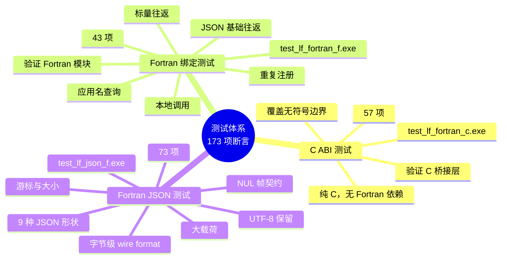

### 8.2 C ABI 测试（57 项）

**目标**：验证 `lf_fortran.h` + `lf_fortran.cpp` 对 C 侧的完备性与正确性。

| 类别 | 项数 | 覆盖内容 |
|------|:----:|----------|
| 数据句柄标量 | 22 | 全部整数类型往返，含无符号边界 255 / 65535 / 0xDEADBEEF |
| 字符串 | 5 | 明文、UTF-8 多字节、NUL 终结、空串 |
| JSON | 4 | 简单对象、中文、空串、`{"a":1}` 字节序列 |
| 本地调用 | 8 | Call 注册、Notify 注册、add(5,7)=12、异步通知 |
| 重复注册 | 2 | 第二次注册被拒绝 |
| 应用名 | 5 | 缓冲区太小返回 -2、正常路径返回长度 |

**为什么用 C 而不只用 Fortran**：C 有真正的 `uint8_t` / `uint16_t` / `uint32_t` 类型，可以做完整的无符号边界测试。Fortran 没有无符号类型，这部分必须由 C 承担。

### 8.3 Fortran 绑定测试（43 项）

**目标**：验证 `lf_fortran_mod.f90` 对 C ABI 的正确封装。

| 类别 | 项数 | 覆盖内容 |
|------|:----:|----------|
| 标量往返 | 20 | 有符号/无符号函数入口的管道畅通性 |
| 字符串 | 3 | 明文往返、size 包含 NUL |
| JSON | 2 | `{"a":1}` 往返 |
| 本地调用 | 10 | 注册回调、`c_funloc` 地址传递、`lf_local_call` 往返 |
| 重复注册 | 3 | 同名第二次被拒绝 |
| 应用名 | 3 | `allocatable` 返回值、长度与内容一致 |

**与 C 测试的分工**：C 测试覆盖字节级细节和边界值，Fortran 测试覆盖**语言绑定正确性**——`c_ptr`、`c_funloc`、`allocatable character`、`kind` 转换。

### 8.4 Fortran JSON 测试（73 项）

**目标**：把 C++ `test_lingofuse_json.cpp` 的思路完整移植到 Fortran 侧。

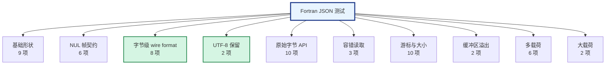

**关键类别详解**：

**类别 1：基础形状** —— 覆盖 9 种 JSON 值：简单对象、嵌套对象、数组、空对象、空数组、`null`、`true`、带指数数字、带转义引号的字符串。

**类别 3：字节级 wire format** —— `{"a":1}` 必须产生**精确的 8 个字节**：

```
7B 22 61 22 3A 31 7D 00
│  │  │  │  │  │  │  └── NUL 帧
│  └──┴──┴──┴──┴──┘
└─ {"a":1}
```

这是与 Pascal / Python / C++ / C# / Rust / Go / JavaScript 互通的**基础契约**。任何偏差都意味着跨语言字节级不兼容。

**类别 4：UTF-8 保留** —— 用 `char(228) // char(184) // char(173)` 构造"中"字的 UTF-8 字节序列，验证整个链路不做任何转码。emoji 用 `char(240) // char(159) // char(140) // char(141)`。

**类别 5：原始字节 API** —— `lf_data_write_string_bytes` 保留缓冲区内的嵌入 NUL，`lf_data_read_string_bytes` 在第一个 NUL 停止，`lf_data_read_all_bytes` 返回整个缓冲区（含末尾的帧 NUL）。

### 8.5 跨语言 Demo（4 个进程）

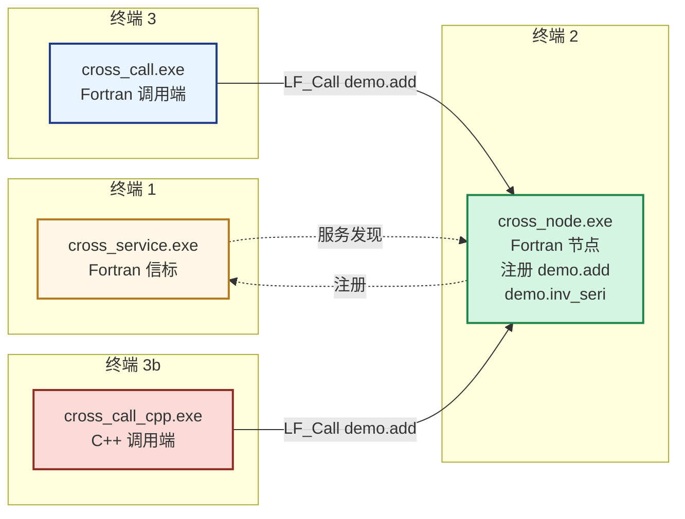

**验证目标**：**同一个 Fortran 节点**同时接受 Fortran 和 C++ 两种调用端，两种语言发出的字节完全一致，节点返回的字节也完全一致。

**一键启动**：

```powershell
.\run_cross_demo.ps1
```

它自动：
1. 在新窗口启动 `cross_service.exe`（信标）
2. 在新窗口启动 `cross_node.exe`（Fortran 节点）
3. 等待 5 秒（等 mesh 广播传播）
4. 在主窗口运行 `cross_call.exe`（Fortran 调用端，基线）
5. 在主窗口运行 `cross_call_cpp.exe`（C++ 调用端，跨语言验证）

两个调用端都应输出 `success : 25, failed : 0`。

---

## 九、测试与应用场景对照

### 9.1 场景分类

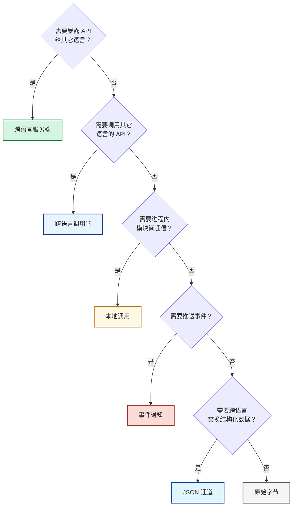

### 9.2 测试与场景映射

| 应用场景 | 对应测试套件 | 关键测试项 | 真实业务示例 |
|----------|--------------|-----------|-------------|
| **跨语言服务端**：Fortran 函数被 Python / C++ 调用 | `test_lf_fortran_f.exe` + `cross_node.exe` | `lf_app_register_call`、`add_callback` | 数值计算服务、仿真内核 |
| **跨语言调用端**：Fortran 调用 C++ / Python 写的 API | `cross_call.exe` + `cross_call_cpp.exe` | `lf_call`、`lf_data_read_int32` | 调用已有的 C++ 数据处理库 |
| **进程内模块间通信**：绕过网络的快速路径 | `test_lf_fortran_f.exe` | `lf_local_call`、`register_call` | 单进程内的模块解耦 |
| **事件通知**：单向推送、状态广播 | `test_lf_fortran_f.exe` | `lf_app_register_notify`、`lf_notify` | 日志采集、进度上报 |
| **JSON 数据交换**：与 HTTP / Web / LLM 对接 | `test_lf_json_f.exe` | `lf_data_write_json`、`lf_data_read_json` | REST API 网关、LLM 工具调用 |
| **二进制协议**：自定义字节格式、高性能场景 | `test_lf_json_f.exe` | `lf_data_write_bytes`、`lf_data_read_all_bytes` | 视频帧、传感器流、Protobuf |
| **大载荷传输**：MB 级消息 | `test_lf_json_f.exe` | `test_large_json` | 大矩阵、图像、日志文件 |
| **跨语言字节互通**：与 Pascal / C++ 对齐 | `cross_call_cpp.exe` | `add` 和 `inv_seri` 的字节序列 | 多语言混合部署 |
| **弹性集群启动**：节点无序启动 | `cross_node.exe` | `Wait_Ready=False` | K8s / Docker 集群 |
| **服务发现与负载均衡**：多个同 App 节点 | `cross_node.exe` × N | C4 mesh 自动路由 | 横向扩容 |

### 9.3 场景与测试的对应关系图

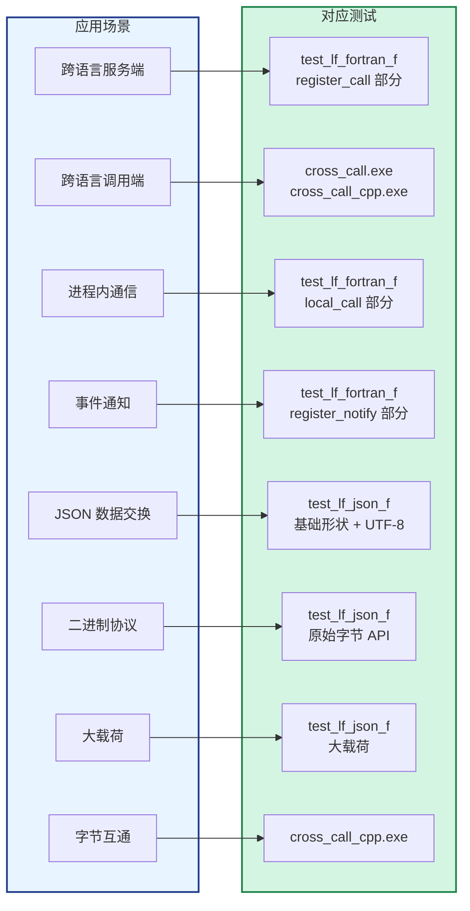

### 9.4 典型场景详解

#### 场景 A：数值计算服务

**业务**：Fortran 写的求解器被 Python 的 ML 管线调用。

| 步骤 | 代码 | 对应测试 |
|------|------|----------|
| 1 | `app = lf_app_create('Solver', 'Linear solver')` | `test_local_call` |
| 2 | `rc = lf_app_register_call(app, 'solve', ..., c_funloc(solve_callback))` | `test_local_call` |
| 3 | `rc = lf_prepare_client('ipc:solver', app)` | `cross_node` |
| 4 | Python 端 `c.solve(matrix_data)` | `cross_call`（跨语言路径） |

#### 场景 B：LLM 工具调用

**业务**：Fortran 的算法暴露为 LLM 的工具，通过 MCP 协议调用。

**数据流**：LLM → MCP Server → Python bridge → LingoFuse → Fortran 节点。JSON 载荷经 Fortran 的 `lf_data_read_json` / `lf_data_write_json` 处理。

| 步骤 | 对应测试 |
|------|----------|
| 参数以 JSON 传入 | `test_basic_json` |
| UTF-8 中文/emoji 参数 | `test_utf8` |
| 字节级无转义 | `test_wire_format` |
| 大响应（数 KB JSON） | `test_large_json` |

#### 场景 C：实时数据流

**业务**：传感器数据以二进制格式高频推送到 Fortran 处理。

| 步骤 | 对应测试 |
|------|----------|
| 二进制帧以 `lf_data_write_bytes` 写入 | `test_fault_tolerant` |
| 帧内含嵌入 NUL | `test_raw_bytes` |
| 接收方一次读全帧 | `read_all_bytes` 测试项 |

#### 场景 D：多语言混合网格

**业务**：C++ 前端 + Fortran 计算核心 + Python 训练后端，通过同一 mesh 通信。

**关键验证**：`cross_call_cpp.exe` 调用 `cross_node.exe`（Fortran），且 `cross_call.exe`（Fortran）调用同一个节点。两边都能得到 `success : 25, failed : 0`。

---

## 十、故障排查

### 10.1 决策树

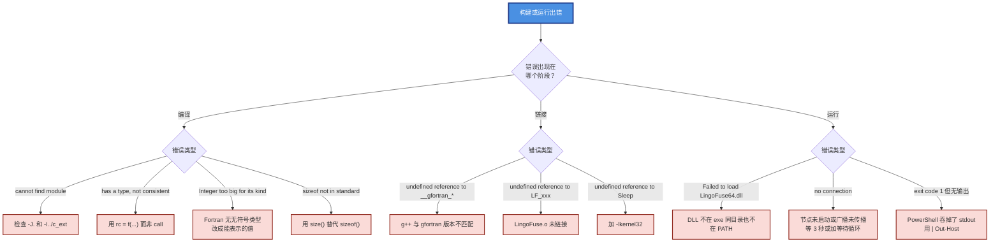

### 10.2 常见错误速查

| 错误信息 | 根因 | 修复 |
|----------|------|------|
| `Cannot open module file 'lf_fortran_mod.mod'` | 模块未编译或路径不对 | `make clean && make` 重来；确认 `-J.` 和 `-I../c_ext` 生效 |
| `has a type, not consistent with CALL` | 把函数当子程序调用 | 用 `rc = f(...)` 或 `if (f(...) /= 1)` |
| `Integer too big for its kind` | 数值超出有符号 kind 范围 | Fortran 无无符号类型；换成能表示的值 |
| `Function 'sizeof' has no IMPLICIT type` | 用了 GNU 扩展 | 改 `size(buf)` |
| `undefined reference to __gfortran_*` | g++ 与 gfortran 版本不匹配 | 用同一套工具链 |
| `undefined reference to Sleep` | 未链接 kernel32 | `Makefile` 里加 `-lkernel32` |
| `Failed to load LingoFuse64.dll` | 运行时库找不到 | 放到 exe 同目录或加 PATH |
| `"demo" no connection` | 目标节点不在 mesh 上 | 检查节点是否运行；等 3 秒或加等待循环 |
| `exit code 1 但屏幕空白` | PowerShell 吞掉了原生输出 | 脚本里用 `\| Out-Host` |
| `LF_PrepareClient returned -1` | 地址重复 | 换地址或设 `Overlap_Connection=True` |
| 中文显示成乱码 | 控制台代码页不是 UTF-8 | `chcp 65001` 切到 UTF-8 |

### 10.3 调试技巧

**开启详细日志**：

```fortran
call lf_set_option('ConsoleOutput', 'True')
call lf_set_option('Quiet', 'False')
call lf_set_option('ShowThreadID', 'True')
```

**查看 LingoFuse 内部日志**：

```fortran
character(len=:), allocatable :: msg
do while (lf_get_status_count() > 0)
  call lf_get_status(msg)
  if (len(msg) > 0) write(*, '(A,A)') '[LF] ', msg
end do
```

**检查 mesh 状态**：

```fortran
if (lf_check_main_thread() /= 0) write(*, *) 'Framework running'
if (lf_check_app('demo') /= 0) write(*, *) 'demo visible'
if (lf_check_api('demo', 'add') /= 0) write(*, *) 'demo.add visible'
```

---

## 附录 A：核心代码提示

**添加回调的标准范式**：

```fortran
module my_callbacks
  use iso_c_binding
  use lf_fortran_mod
  implicit none
  private
  public :: my_callback
contains
  subroutine my_callback(input, output) bind(C)
    type(c_ptr), value :: input, output
    ! ... 读 input，写 output
  end subroutine
end module

! 在 program 中：
use my_callbacks
! ...
if (lf_app_register_call(app, 'myapi', 'desc', &
                         c_funloc(my_callback)) /= 1) stop
```

**三个必须记住的点**：

1. **回调必须用 `bind(C)` 且放在 module 里**。program 内部的过程无法用 `c_funloc` 取地址。
2. **写入函数是 Function**，必须 `rc = f(...)` 或 `if (f(...) /= 1)`。
3. **读取字符串是 Subroutine**，用 `call lf_data_read_string(h, out)`。

---

## 附录 B：与其它绑定的对照

| 功能 | Fortran | C++ | Python | C# |
|------|:-------:|:---:|:------:|:--:|
| 创建句柄 | `lf_data_create` | `DataHandle h("api")` | `DataHandle("api")` | `new DataHandle("api")` |
| 写 int32 | `lf_data_write_int32` | `h.write<int32_t>(42)` | `h.write_int32(42)` | `h.WriteInt32(42)` |
| 写 JSON | `lf_data_write_json` | `h.writeJson(obj)` | `h.write_json(obj)` | `LfIo.WriteJson(h, obj)` |
| 读 JSON | `lf_data_read_json` | `h.readJson()` | `h.read_json()` | `LfIo.ReadJson<T>(h)` |
| 注册回调 | `lf_app_register_call` + `c_funloc` | `app.registerCall` | `@app.expose` | `app.RegisterCall` |
| 远程调用 | `lf_call` | `lingofuse::call` | `call()` | `Framework.Call` |
| 网络事件 | `lf_set_network_event` | `setNetworkEvent` | `set_network_event` | `NetworkEvents.Set` |

**线格式完全一致**：同一逻辑载荷 `{"a":1}` 在任意两种语言间往返，字节序列都是 `7B 22 61 22 3A 31 7D 00`。

---

*LingoFuse Fortran 绑定版本 1.0*
*最后更新：2026-10-05*