# LingoFuse Julia 绑定

> **跨语言 RPC 框架 LingoFuse 的 Julia 官方绑定。**
>
> Julia 写的函数可以被任何其他语言直接调用，Julia 也可以直接调用任何其他语言写的 LingoFuse 服务。与 Pascal / C / C++ / C# / Python / JavaScript 各绑定的**线格式字节级一致**。

---

## 目录

- [一、文档导航](#一文档导航)
- [二、环境要求](#二环境要求)
- [三、依赖要求](#三依赖要求)
- [四、C 编译器要求](#四c-编译器要求)
- [五、构建](#五构建)
- [六、接口原理](#六接口原理)
- [七、快速开始](#七快速开始)
- [八、核心 API 速查](#八核心-api-速查)
- [九、测试](#九测试)
- [十、测试对应应用场景](#十测试对应应用场景)
- [十一、Cross Demo](#十一cross-demo)
- [十二、已知限制](#十二已知限制)
- [十三、许可](#十三许可)

---

## 一、文档导航

**本目录下的关键文档**（点击文件名直接打开）：

- [**`c_ext/SHIM_MECHANISM_GUIDE.md`**](c_ext/SHIM_MECHANISM_GUIDE.md) — C shim 机制的完整验证文档。**修改回调层之前必读。**
- [**`example/README.md`**](example/README.md) — Cross Demo 三进程启动指南。
- [**`test/runtests.jl`**](test/runtests.jl) — 标准 Julia 测试入口。
- **`check_env.ps1`** — 环境诊断脚本（9 节）。
- **`build.ps1` / `clean.ps1` / `test.ps1`** — 根目录一键脚本。

**目录结构**：

```
julia/
├── build.ps1 / clean.ps1 / test.ps1 / check_env.ps1
├── c_ext/          C 回调桥（mock 版 + 真库版）
├── src/            Julia 包源码（13 个 .jl）
├── example/        Cross Demo（3 个 .jl + README）
└── test/           验收测试（8 个 .jl + runtests）
```

各目录的详细说明分散在下面各章节。

---

## 二、环境要求

### 2.1 系统环境

| 项目 | 要求 |
|------|------|
| 架构 | **x86_64**（32 位未验证） |
| Windows | Windows 10 / Server 2019 及以上 |
| Linux | glibc 2.17+ 或 musl |
| macOS | 11+（Apple Silicon 未验证） |
| 运行时依赖（Windows） | VC++ 2015-2022 Redistributable |

### 2.2 Julia 环境

| 项目 | 要求 |
|------|------|
| 最低版本 | **Julia 1.9** |
| 建议版本 | **Julia 1.13.1**（本文档验证环境） |
| **启动参数** | **必须 `--threads=2` 或更多** |

> ⚠️ **`--threads=2` 是硬性要求，不是建议。**
>
> 回调消费者任务必须运行在非 main 线程上。原因见下面这张图：

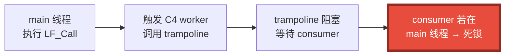

`start_callback_consumer()` 会在运行时检查：

- `Threads.nthreads() < 2` → 抛 `LingoFuseStateError`
- consumer 落到 tid=1 → 抛 `LingoFuseStateError`（并自我停止）

### 2.3 LingoFuse 运行时

Julia 绑定**不包含**原生库，需要单独获取：

| 平台 | 核心库 | IPC 依赖 | 内存分配器（可选） |
|------|--------|----------|--------------------|
| Windows 64 | `LingoFuse64.dll` | `z_ipc_64.dll` | `mimalloc64.dll` |
| Linux | `liblingofuse.so` | `libz_ipc.so` | `libmimalloc.so` |
| macOS | `liblingofuse.dylib` | `libz_ipc.dylib` | `libmimalloc.dylib` |

**库路径搜索顺序**（由 `loader.jl` 决定）：


找到后，`loader.jl` 会把库所在目录**前置到 `PATH`**，这样 Windows 上 `LingoFuse64.dll` 依赖的 `z_ipc_64.dll` 才能被系统加载器找到。

**推荐做法**（Windows）：

```powershell
$env:LINGOFUSE_LIBRARY = "D:\CoreLibrary\LingoFuse\Binary\LingoFuse64.dll"
```

或者把 `Binary\` 目录加到系统 `PATH`。

---

## 三、依赖要求

### 3.1 Julia 包依赖（需要安装）

**唯一需要手动安装的外部包**：

| 包 | 版本 | 安装命令 |
|----|------|---------|
| **JSON3.jl** | 1.x（验证于 1.14.3） | `Pkg.add("JSON3")` |

**安装方法**：

```julia
using Pkg
Pkg.add("JSON3")
```

或从命令行：

```powershell
julia -e 'using Pkg; Pkg.add("JSON3")'
```

**为什么选 JSON3**：

| 特性 | 说明 |
|------|------|
| 零拷贝 | `JSON3.read` 返回视图，对大 payload 有实际意义 |
| 字面 UTF-8 | 非 ASCII 字符以原始字节输出，与其它绑定的 `ensure_ascii=False` 一致 |
| 现代 API | `JSON3.Object` / `JSON3.Array` 支持属性式访问 |

**除 JSON3 外，不需要任何其他第三方 Julia 包。**

### 3.2 Julia 标准库依赖

以下都是 Julia 自带的标准库，无需安装：

| 标准库 | 用途 |
|--------|------|
| `Libdl` | `ccall` 内部用于定位共享库（透明使用） |
| `Base.Threads` | 多线程（consumer 任务使用） |
| `Base.Threads.Atomic` | Cross demo 的计数器 |

### 3.3 系统依赖

| 依赖 | 何时需要 | 说明 |
|------|---------|------|
| C 运行时 | 总是 | Windows 上由 VC++ Redistributable 提供 |
| `pthread` | Linux / macOS | `build.sh` 会自动加 `-lpthread` |
| gcc / cc / clang | **构建 c_ext 时必需** | 见 [第四章](#四c-编译器要求) |

### 3.4 依赖关系总览

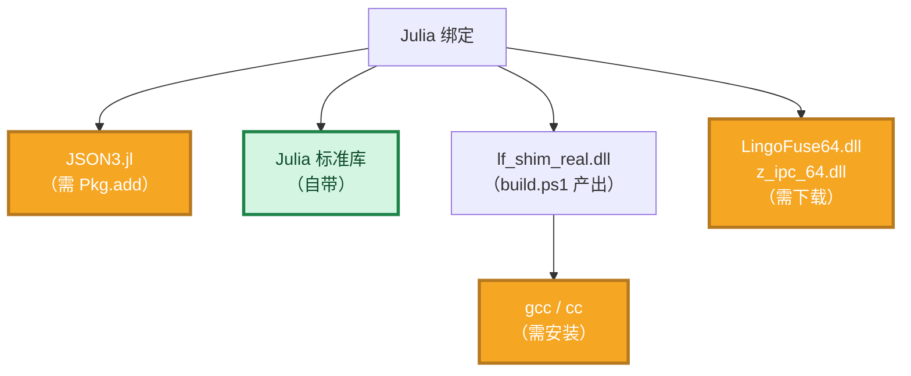

橙色 = 需要手动获取；绿色 = 自带。

---

## 四、C 编译器要求

`c_ext/` 需要 C 编译器来编译两个共享库。**这不是可选项**——Julia 绑定依赖一个 native C shim 来完成跨线程回调（原因见[第六章](#六接口原理)）。

### 4.1 编译器要求

| 项目 | 要求 |
|------|------|
| **目标架构** | **必须 x86_64**（与 Julia 的 64 位 build 匹配） |
| C 标准 | C99 |
| Windows 推荐 | **MinGW-w64 gcc**（`x86_64-w64-mingw32-gcc`） |
| Linux / macOS | `cc` 或 `clang` |
| 32 位 | 未验证 |

### 4.2 Windows 上安装 MinGW-w64

**方式 1：winget（推荐）**

```powershell
winget install --id=BrechtSanders.WinLibs.POSIX.UCRT
```

**方式 2：MSYS2**

从 https://www.msys2.org/ 下载安装后：

```bash
pacman -S mingw-w64-x86_64-gcc
```

### 4.3 验证编译器

```powershell
gcc -dumpmachine
```

**期望输出**：

```
x86_64-w64-mingw32
```

如果输出 `i686-...` 或其他 32 位目标，说明装的是 32 位工具链，**不能用于本项目**。

### 4.4 为什么不能链接 import library

C shim 用**运行时动态解析**（`LoadLibraryA` / `GetProcAddress`）加载真库，**不链接 import library**：

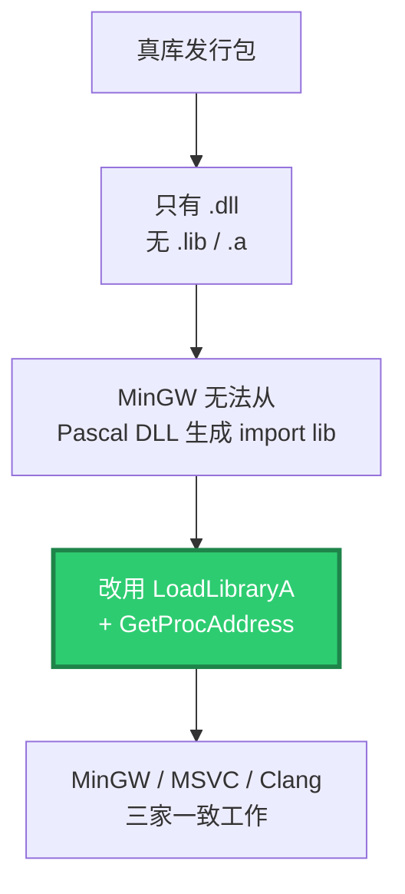

`lf_real_link.c` 用**懒加载**（首次调用时解析），避免 `DllMain` 内的 loader lock 死锁（MSDN 明确警告）。

---

## 五、构建

### 5.1 一键构建

```powershell
cd D:\CoreLibrary\LingoFuse\julia
.\build.ps1
```

### 5.2 构建流程

`build.ps1` 依次执行三个步骤：


### 5.3 两个产物的用途

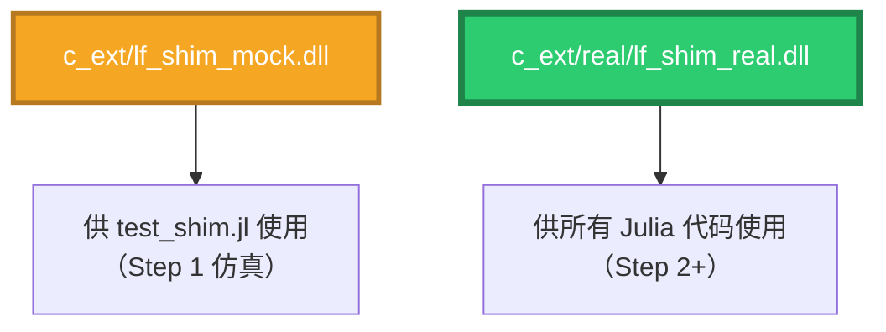

**日常使用只需要 `lf_shim_real.dll`。** mock 版只是 Step 1 的仿真测试产物。

### 5.4 清理

```powershell
.\clean.ps1
```

删除 `c_ext/` 和 `c_ext/real/` 下的 `*.dll` / `*.o` / `*.a` / `*.so` / `*.dylib`，以及 `src/` 下的 `*.ji` 预编译缓存。**幂等**：文件不存在也不报错。

### 5.5 环境诊断

```powershell
.\check_env.ps1
```

9 节检查：


---

## 六、接口原理

### 6.1 问题的本质

LingoFuse 在 **C4 worker 线程**（native 线程）上触发回调。Julia 的 GC / JIT / Task 调度器**全部要求**进入 Julia 的线程被 runtime 认领。

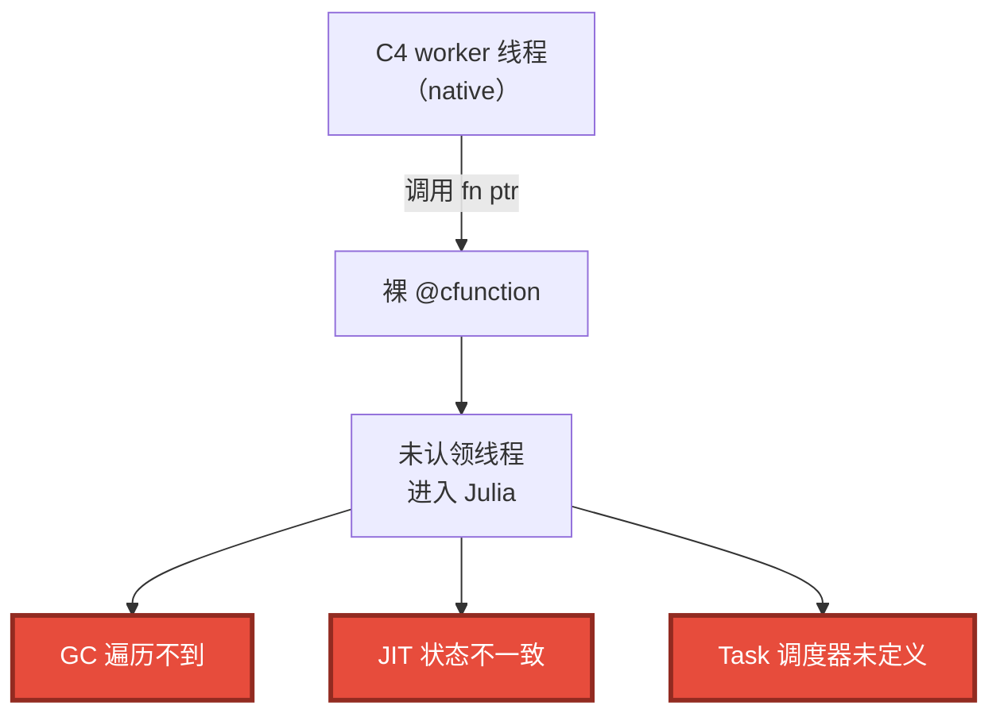

**为什么其他语言没有这个问题**：

| 语言 | 原因 |
|------|------|
| C / C++ / Rust | 无 runtime，无 GC，无调度器 |
| Python | GIL 让任意线程进入解释器都是设计内的 |
| C# | CLR 的 P/Invoke 层能"接管"外来线程 |
| **Julia** | **GC + JIT + Task 调度器都依赖线程已被 runtime 认领** |

### 6.2 解决方案：C shim

**核心思路**：在 C 和 Julia 之间建一个缓冲区。

**第一步：C4 worker 触发回调**

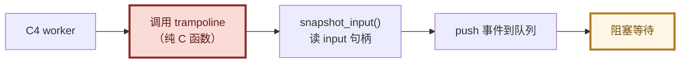

**第二步：Julia consumer 处理事件**


**第三步：trampoline 醒来写回结果**


**关键契约**：**Julia consumer 绝不触碰 native data handle**。

所有 handle I/O（读 input、写 output）都在 trampoline 线程上完成。原因是真库对每个 handle 有 per-handle 锁，如果 consumer 从另一个线程访问同一个 handle，会与正在等待的 C4 worker 线程争用锁 → 死锁。

### 6.3 分层架构

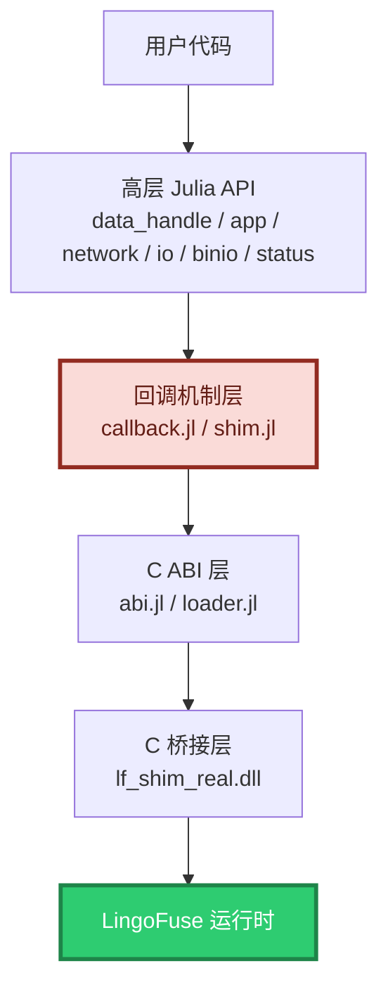

依赖方向严格单向，不允许反向依赖。

### 6.4 阻塞分类：`@threadcall` 是核心机制

Julia 的 GC 需要所有线程到 safepoint。**阻塞在 ccall 里的线程不在 safepoint。**

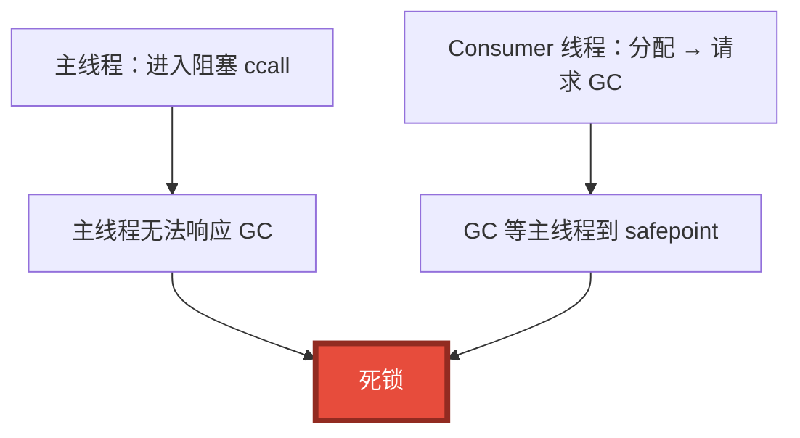

**修复**：所有可能阻塞的 C 调用走 `@threadcall`（libuv 线程池），Julia 线程保持可响应。

**已分类的 LF_* 函数**：

| LF_* 函数 | 是否阻塞 | 处理 |
|-----------|:--------:|------|
| `LF_CreateData` / `LF_FreeData` / `LF_Get*` / `LF_Set*` | 微秒级 | 普通 `ccall` |
| `LF_CreateApp` / `LF_FreeApp` | 微秒级 | 普通 `ccall` |
| `LF_RegisterCall` / `LF_RegisterNotify` | 微秒级 | 普通 `ccall` |
| `LF_SetOption` / `LF_PostStatus` | 微秒级 | 普通 `ccall` |
| `LF_LocalCall` / `LF_LocalNotify` | 同步触发回调 | **`@threadcall`** |
| `LF_Notify` / `LF_Sequenced_Notify` | 可能同步触发回调 | **`@threadcall`** |
| `LF_Call` | 秒级阻塞 | **`@threadcall`** |
| `LF_PrepareDone` | 可能阻塞 30 秒 | **`@threadcall`** |
| `LF_ExitMainThread` / `LF_Shutdown` | 等待资源 | **`@threadcall`** |

### 6.5 四条硬性规则

| # | 规则 | 违反后果 |
|:-:|------|----------|
| 1 | 所有可能阻塞的 ccall 走 `@threadcall` | 与 GC 死锁 |
| 2 | `@threadcall` 参数必须 isbits | libuv 线程进入 Julia runtime 崩溃 |
| 3 | 传指针给 native 必须 `GC.@preserve` | 悬空指针读到已回收内存 |
| 4 | 所有 handler 调用走 `Base.invokelatest` | "method too new" 报错 |

**规则 4 的根因**：

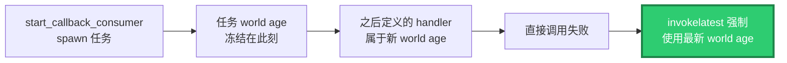

### 6.6 DataHandle 生命周期

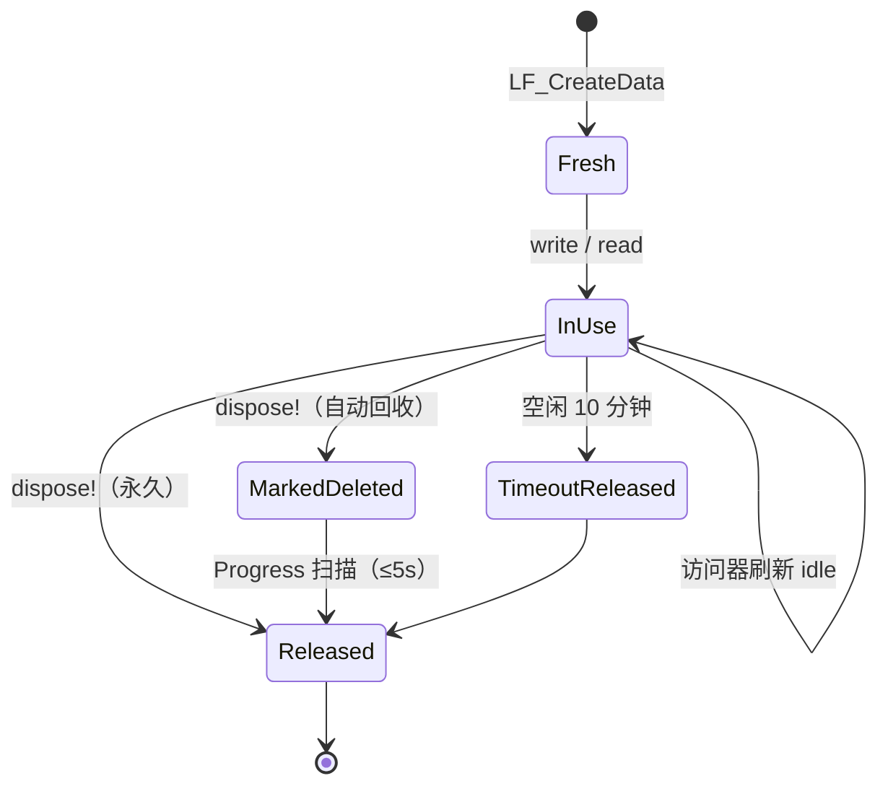

两种句柄：

| 种类 | 构造方式 | 回收方式 | 适用场景 |
|------|---------|---------|---------|
| **自动回收** | `DataHandle(name)` | 10 分钟空闲 + 5 秒扫描 | 绝大多数场景 |
| **永久句柄** | `DataHandle(name; permanent=true)` | `dispose!` 立即释放 | 缓存模板、长生命周期 scratch buffer |

---

## 七、快速开始

### 7.1 安装依赖

```julia
using Pkg
Pkg.add("JSON3")
```

### 7.2 三步上手（无网络）

```julia
push!(LOAD_PATH, "path/to/julia/src")
using LingoFuse

# 1. 注册一个 API
app = App("MyApp", "My Julia service")
register_call!(app, "echo", "Echo the payload") do in_bytes
    return in_bytes            # Vector{UInt8} in → Vector{UInt8} out
end

# 2. 本地调用（不经过网络）
param = DataHandle("echo")
write_string!(param, "hello, world")
result = local_call(app, param)
set_cursor_position!(result, 0)
println(read_string!(result))   # → "hello, world"

# 3. 清理
dispose!(result)
dispose!(param)
dispose!(app)
```

### 7.3 完整网络服务（环回 RPC）

```julia
push!(LOAD_PATH, "path/to/julia/src")
using LingoFuse

set_option("Wait_Ready", "False")
set_option("Quiet", "True")

reset_prepare()
start_callback_consumer()

app = App("EchoApp", "demo")
register_call!(app, "echo", "echo") do in_bytes
    return in_bytes
end

prepare_service("ipc:my_service", "ipc:my_service")
prepare_client("ipc:my_service", app)
prepare_done()

# 调用
param = DataHandle("echo")
write_string!(param, "hello")
raw = LF_Call("EchoApp", param.handle, UInt64(5000))
result = _wrap_data_handle(raw, true)
set_cursor_position!(result, 0)
println(read_string!(result))   # → "hello"

# 清理（LF-CLEAN-001 顺序）
clear_network_event()
exit_main_thread()
dispose!(result)
dispose!(param)
dispose!(app)
stop_callback_consumer()
shutdown()
```

### 7.4 使用统一 JSON I/O

```julia
dh = DataHandle("my_api")

# 写入：字面 UTF-8，无 \uXXXX 转义，末尾自动加 NUL
write_json!(dh, Dict("name" => "张三", "age" => 30))

# 读取：返回 JSON3.Object（零拷贝视图）
set_cursor_position!(dh, 0)
obj = read_json(dh)
println(obj.name)     # → "张三"

# 需要普通 Dict 时
d = json_to_dict(obj)   # → Dict{String,Any}
```

### 7.5 监听网络事件

```julia
q = global_queue()
install!(q)

try
    while running
        evt = poll_event(q)
        if evt !== nothing
            kind, addr = evt
            println("$kind: $addr")
        end
        sleep(0.1)
    end
finally
    uninstall!(q)
end
```

### 7.6 重启回调层（进程内）

回调层支持在同一进程内多次启动和停止：

```julia
start_callback_consumer()
# ... 第一轮操作 ...
stop_callback_consumer()

start_callback_consumer()   # ← 重新启动，正常工作
# ... 第二轮操作 ...
stop_callback_consumer()
```

**约束**：`stop_callback_consumer()` 会**完全静默**（fully quiesce）consumer 任务后才返回，确保重启安全。详见 `c_ext/lf_shim.c` 头部的 "Shutdown contract" 与 "Re-initialisation contract"。

---

## 八、核心 API 速查

### 8.1 API 分类总览

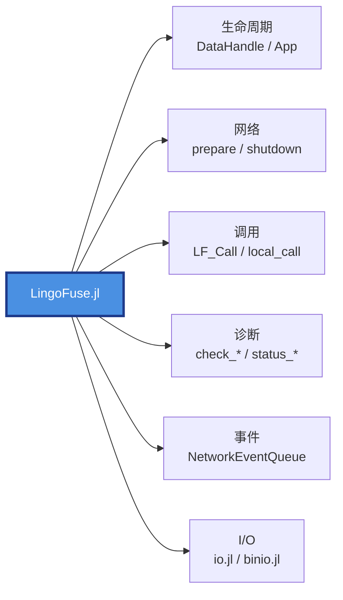

### 8.2 数据句柄 I/O（`data_handle.jl` / `binio.jl`）

| 函数 | 说明 |
|------|------|
| `DataHandle(name)` | 创建自动回收句柄 |
| `DataHandle(name; permanent=true)` | 创建永久句柄 |
| `write_buffer!(dh, bytes)` | 写原始字节，游标前进 |
| `read_buffer!(dh, n)` | 读最多 n 字节（可能短读） |
| `read_buffer_exact!(dh, n)` | 读恰好 n 字节，短读抛异常 |
| `read_all!(dh)` | 读剩余全部字节 |
| `write_string!(dh, s)` | 写 UTF-8 + NUL |
| `read_string!(dh)` | 读到 NUL（无 NUL 则读到末尾） |
| `write_json!(dh, obj)` | JSON 序列化 + NUL |
| `read_json(dh)` | 反序列化，失败抛异常 |
| `try_read_json(dh)` | 失败返回 `nothing` |
| `read_json_or_bytes(dh)` | 非 JSON 返回原始字节 |
| `cursor_position` / `set_cursor_position!` | 游标 |
| `buffer_size(dh)` | 缓冲总大小 |
| `dispose!(dh)` | 释放（幂等） |

**二进制小端 I/O**（`binio.jl`）：

| 类型 | 写入 | 读取 |
|------|------|------|
| `UInt8` | `write_uint8!` | `read_uint8` |
| `UInt16` | `write_uint16!` | `read_uint16` |
| `UInt32` | `write_uint32!` | `read_uint32` |
| `UInt64` | `write_uint64!` | `read_uint64` |
| `Int8/16/32/64` | `write_int8!` … | `read_int8` … |
| `Float32` | `write_single!` | `read_single` |
| `Float64` | `write_double!` | `read_double` |

每类都有 `try_read_*` 非抛异常版本。

### 8.3 应用（`app.jl`）

| 函数 | 说明 |
|------|------|
| `App(name, desc)` | 创建 App |
| `register_call!(app, name, desc, handler)` | 注册 Call API，默认 warmup |
| `register_notify!(app, name, desc, handler)` | 注册 Notify API |
| `unregister!(app, name)` | 注销 |
| `local_call(app, param)` | 本地执行，返回新 `DataHandle` |
| `local_notify(app, param)` | 本地通知 |
| `bind(app)` | 绑定到所有空闲客户端，返回数量 |
| `app_name(app)` | 返回 App 名 |
| `dispose!(app)` / `is_disposed(app)` | 生命周期 |

**Warmup 契约**：`register_call!` / `register_notify!` 默认 `warmup=true`，会在注册时用三个合成 payload（空、2 字节、256 字节）**真实调用**你的 handler。副作用（日志、状态修改、I/O）会发生三次。有副作用的 handler 请传 `warmup=false`。

### 8.4 网络（`network.jl`）

| 函数 | 说明 |
|------|------|
| `reset_prepare()` | 清空准备队列 |
| `prepare_service(local, public)` | 排队 C4 服务，返回 tag 或 -1 |
| `prepare_client(addr, app)` | 排队 C4 客户端 |
| `prepare_done()` | 启动主循环，每进程只返回 1 一次 |
| `exit_main_thread()` | 停止主循环，不释放资源 |
| `shutdown()` | 释放全部资源，可重复调用 |
| `set_option(key, value)` | 设置全局选项 |

### 8.5 网络事件（`status.jl`）

| 函数 | 说明 |
|------|------|
| `NetworkEventListener()` | OOP 监听器基类 |
| `NetworkEventQueue(max_size)` | 有界队列 |
| `global_queue()` | 进程级单例 |
| `install!(q)` / `uninstall!(q)` | 安装 / 卸载 |
| `take_event(q; timeout)` | 阻塞取事件 |
| `poll_event(q)` | 非阻塞取事件 |
| `clear!(q)` / `close_queue!(q)` | 清空 / 关闭 |
| `set_network_event(...)` / `clear_network_event()` | 函数式安装 |

### 8.6 诊断（`network.jl`）

| 函数 | 说明 |
|------|------|
| `check_main_thread()` | 主循环是否运行 |
| `check_app(name)` | 探测 App 是否可见（约 3 秒延迟） |
| `check_api(app, api)` | 探测 API 是否可见 |
| `generate_app_name()` | 生成全局唯一 App 名 |
| `get_app_name(app)` | 从 App 句柄读名字 |
| `status_count()` / `get_status()` / `post_status(msg)` | 状态队列 |
| `drain_status(n)` / `log_status(io; max)` | 批量排空 / 打印 |

---

## 九、测试

### 9.1 运行全部测试

```powershell
cd D:\CoreLibrary\LingoFuse\julia
.\test.ps1
```

`test.ps1` **自动扫描 `test/*.jl`**，对每个文件启动一个带 `--threads=2` 的独立 Julia 子进程。新增测试只需把 `.jl` 放进 `test/` 目录即可，无需修改脚本。

**唯一自动排除**：`runtests.jl`（标准 Julia 测试入口，它会调用其它所有脚本，包含会导致重复执行）。

输出末尾的汇总表会列出每个测试文件的 PASS / FAIL 和耗时。

### 9.2 单跑一个测试

```powershell
julia --threads=2 test\test_io.jl
julia --threads=2 test\test_network.jl
# ...
```

或通过标准 Julia 测试入口：

```powershell
julia --threads=2 test\runtests.jl
```

> ⚠️ **必须带 `--threads=2`。** 少带会立即抛 `LingoFuseStateError`。

### 9.3 测试套件构成

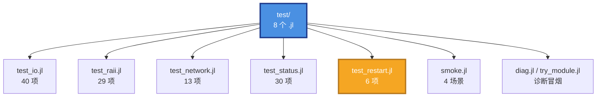

### 9.4 各测试的内容

**`test_io.jl`（40 项）** — 统一 I/O 层

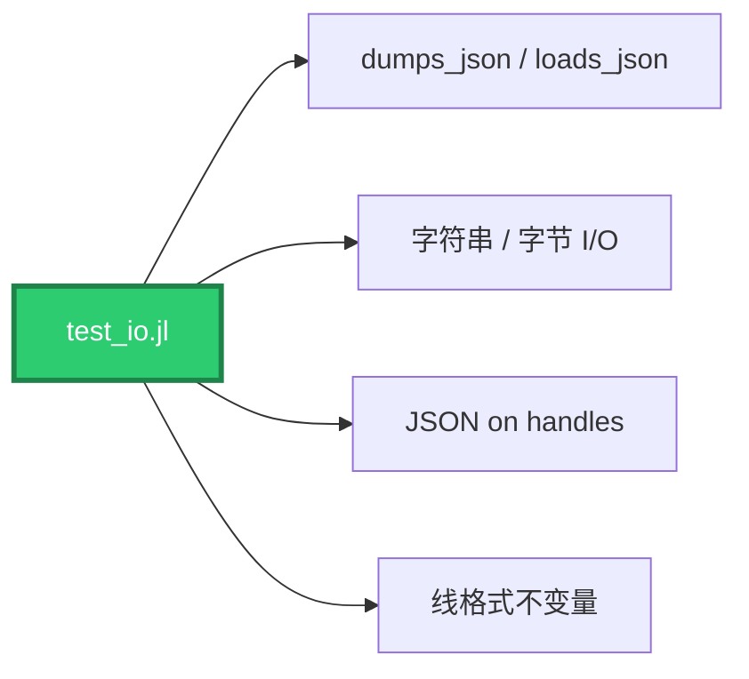

**`test_raii.jl`（29 项）** — RAII + 本地调用

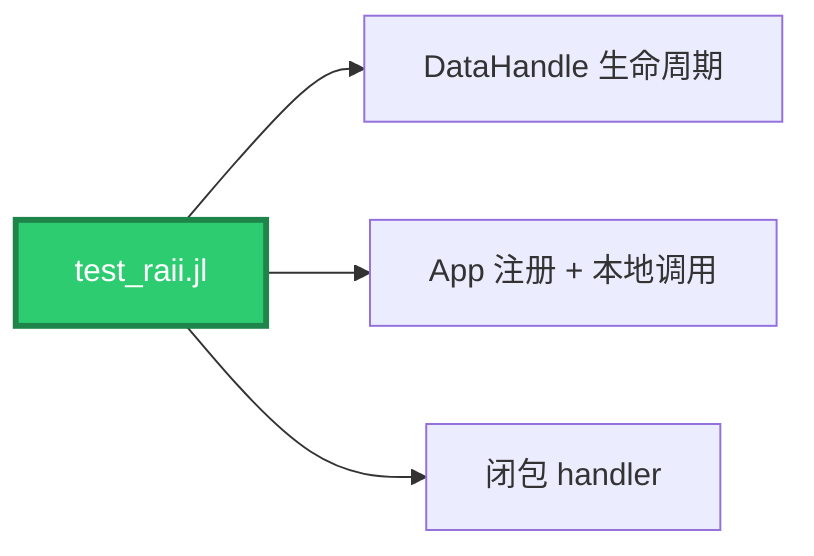

**`test_network.jl`（13 项）** — 网络准备 + 环回

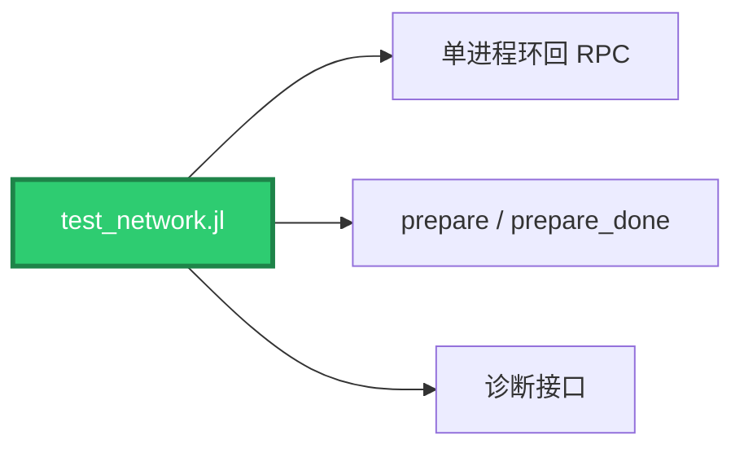

**`test_status.jl`（30 项）** — 事件 + 状态

```mermaid
flowchart LR
    A["test_status.jl"] --> B["网络事件监听"]
    A --> C["有界队列"]
    A --> D["状态队列"]

    style A fill:#2ECC71,stroke:#1E8449,stroke-width:3px,color:#FFFFFF
```

**`test_restart.jl`（6 项）** — 进程内重启回调层

```mermaid
flowchart LR
    A["test_restart.jl"] --> B["round 1<br/>启动 → 停止"]
    A --> C["round 2<br/>再启动 → 调用 → 停止"]

    style C fill:#F5A623,stroke:#B7791F,stroke-width:3px,color:#FFFFFF
```

**`smoke.jl`（4 场景）** — handler 定义形状兼容性

```mermaid
flowchart LR
    A["smoke.jl"] --> S1["S1: 具名函数"]
    A --> S2["S2: 匿名闭包"]
    A --> S3["S3: 捕获变量的闭包"]
    A --> S4["S4: 运行时注册的闭包"]

    style A fill:#2ECC71,stroke:#1E8449,stroke-width:3px,color:#FFFFFF
```

**`diag.jl` / `try_module.jl`** — 诊断

- `diag.jl`：Step 1 最小复现（`@threadcall` 跨线程闭包）
- `try_module.jl`：`using LingoFuse` 冒烟

### 9.5 验收状态

`.\test.ps1` 全绿，8 个测试文件全部 PASS：

| 测试 | 状态 | 用时 |
|------|:----:|:----:|
| `diag.jl` | ✅ PASS | ~3.3 s |
| `smoke.jl` | ✅ PASS | ~4.1 s |
| `test_io.jl` | ✅ PASS | ~4.2 s |
| `test_network.jl` | ✅ PASS | ~9.8 s |
| `test_raii.jl` | ✅ PASS | ~4.2 s |
| `test_restart.jl` | ✅ PASS | ~3.6 s |
| `test_status.jl` | ✅ PASS | ~4.3 s |
| `try_module.jl` | ✅ PASS | ~3.1 s |

**主测试合计：118 项断言（40 + 29 + 13 + 30 + 6）全绿。**

### 9.6 诊断工具

| 工具 | 用途 |
|------|------|
| `test/diag.jl` | Step 1 最小复现：`@threadcall` 跨线程闭包 |
| `test/try_module.jl` | `using LingoFuse` 冒烟 |
| `check_env.ps1` | 环境诊断（9 节） |
| `LINGOFUSE_TRACE=1` | 运行时逐步 trace |

---

## 十、测试对应应用场景

每个测试文件对应一类**真实应用场景**。

### 10.1 测试 → 场景对应表

| 测试 | 应用场景 | 真实使用示例 |
|------|---------|-------------|
| **`test_io.jl`** | 应用与其它语言服务交换 JSON 数据 | Julia 服务作为 LLM 后端返回结构化 JSON |
| | 跨语言线格式兼容 | Julia handler 被 C++ 调用，字节必须一致 |
| | 字符串 / 二进制编解码 | 传输 base64、图像字节流 |
| **`test_raii.jl`** | 单进程本地 RPC，无网络 | 单元测试：在 Julia 进程内验证 API 逻辑 |
| | 注册 API 并本地执行 | 快速验证 handler 实现 |
| | 闭包 handler 支持 | 捕获外部状态的回调 |
| **`test_network.jl`** | 单进程内的完整 RPC 环回 | 集成测试：一个进程内跑完 prepare → 调用 → 清理 |
| | 服务发现 | `check_app` / `check_api` 探测目标是否上线 |
| | 进程级重启 | 测试 `shutdown()` 后能否重新初始化 |
| **`test_status.jl`** | 网络事件监听 | 客户端上线 / 下线时触发业务逻辑 |
| | 日志采集 | 通过 `drain_status` 收集 native 层日志 |
| | 有界队列背压 | 生产者阻塞，避免 OOM |
| **`test_restart.jl`** | **长运行服务中重建回调层** | 长时间运行的服务在计划内重启网络模块 |
| | 单元测试多轮循环 | 一个 Julia 进程内跑多轮测试，不重新 fork |
| **`smoke.jl`** | 不同 handler 定义形状的兼容性 | 具名函数 / 匿名闭包 / 捕获变量的闭包 / 运行时注册 |
| **`diag.jl`** | `@threadcall` + GC 交互 | 诊断 safepoint 死锁的最小复现 |
| **`try_module.jl`** | 包加载冒烟 | CI 中验证 `using LingoFuse` 是否成功 |

### 10.2 场景分类

```mermaid
flowchart TB
    S["测试场景"]

    S --> A["数据交换"]
    S --> B["本地执行"]
    S --> C["跨进程通信"]
    S --> D["事件监听"]
    S --> E["生命周期管理"]
    S --> F["机制验证"]

    A --> A1["test_io.jl"]
    B --> B1["test_raii.jl"]
    C --> C1["test_network.jl"]
    C --> C2["smoke.jl"]
    D --> D1["test_status.jl"]
    E --> E1["test_restart.jl"]
    F --> F1["diag.jl"]
    F --> F2["try_module.jl"]

    style S fill:#4A90E2,stroke:#1E3A8A,stroke-width:3px,color:#FFFFFF
    style E1 fill:#F5A623,stroke:#B7791F,stroke-width:3px,color:#FFFFFF
```

### 10.3 什么时候跑哪个测试

| 我改了什么？ | 应该跑什么 |
|-------------|-----------|
| 回调层 / `c_ext/` | `smoke.jl` + `test_restart.jl` |
| I/O 层（`io.jl` / `binio.jl`） | `test_io.jl` |
| RAII / 生命周期 | `test_raii.jl` + `test_restart.jl` |
| 网络 / 诊断 | `test_network.jl` |
| 事件 / 状态 | `test_status.jl` |
| 不确定 | `.\test.ps1`（全套） |

---

## 十一、Cross Demo

三个进程的端到端演示，与 C++ / C# / Pascal / Python / JavaScript 的 Cross Demo **字节级兼容**。

### 11.1 三进程角色

```mermaid
flowchart LR
    S["CrossService.jl<br/>信标"] --> N["CrossNode.jl<br/>Worker"]
    S --> C["CrossCall.jl<br/>压测客户端"]
    N -->|"demo.add"| C

    style S fill:#F5A623,stroke:#B7791F,stroke-width:3px,color:#FFFFFF
    style N fill:#2ECC71,stroke:#1E8449,stroke-width:3px,color:#FFFFFF
    style C fill:#4A90E2,stroke:#1E3A8A,stroke-width:3px,color:#FFFFFF
```

### 11.2 启动命令

```powershell
# 终端 1
julia --threads=2 example\CrossService.jl

# 终端 2（等终端 1 打印 "running" 后）
julia --threads=2 example\CrossNode.jl

# 终端 3（等终端 2 打印 "Online" 后）
julia --threads=2 example\CrossCall.jl
```

详细说明见 `example/README.md`。

### 11.3 并发限制与 `UV_THREADPOOL_SIZE`

8 task 并发压测受 libuv 线程池限制（默认 4）。要更高并发需先设置：

```powershell
$env:UV_THREADPOOL_SIZE = "32"
julia --threads=2 example\CrossCall.jl
```

---

## 十二、已知限制

| 限制 | 说明 | 规避 |
|------|------|------|
| **必须 `--threads=2`** | 回调 consumer 不能落在 main 线程 | 无（硬性要求） |
| **libuv 线程池默认 4** | 影响 `@threadcall` 的并发上限 | `UV_THREADPOOL_SIZE` 环境变量 |
| **32 位未验证** | 只在 x86_64 上验证 | 用 64 位 Julia |
| **Apple Silicon 未验证** | 只在 x64 上验证 | Rosetta 或等后续版本 |
| **`String(v::Vector{UInt8})` 转移所有权** | 调用后 v 变空 | 用 `String(copy(v))` |
| **`LF_PrepareDone` 每进程只返回 1 一次** | 二次调用返回 0 | 状态守卫 |
| **`LF_FreeData` 在 `LF_PrepareDone` 前是 no-op** | 初始化期间的句柄释放被忽略 | 用 `create_permanent` 或延后释放 |
| **`LF_GetStatus` 返回静态缓冲** | 下次调用失效 | 立即拷贝为 Julia `String` |
| **`read_string!` / `read_string_bytes` 无 NUL 时会扩展 buffer** | 触发 `LF_SetPos(size + 1)`，buffer +1 字节 | 契约行为，与其它绑定一致 |
| **warmup 会真实调用 handler 三次** | 有副作用的 handler 需 `warmup=false` | 见 8.3 节 |
| **`peek_string_bytes` 是纯读** | 不修改 cursor / size | 与非 peek 版本行为不同 |

---

## 十三、许可

MIT License. 详见仓库根目录 `LICENSE`。

---

## 附：Julia 源文件依赖顺序

`src/LingoFuse.jl` 的 `include` 顺序是有意义的：

```mermaid
flowchart LR
    A["trace.jl"] --> B["error.jl"]
    B --> C["loader.jl"]
    C --> D["abi.jl"]
    D --> E["shim.jl"]
    E --> F["callback.jl"]
    F --> G["data_handle.jl"]
    G --> H["app.jl"]
    H --> I["network.jl"]
    I --> J["io.jl"]
    J --> K["binio.jl"]
    K --> L["status.jl"]

    style A fill:#E8F4FF,stroke:#1E3A8A,stroke-width:2px,color:#0D2F52
    style L fill:#D5F5E3,stroke:#1E8449,stroke-width:2px,color:#0E4D2A
```

**约束**：

- `error.jl` 必须在 `loader.jl` 之前（loader 会抛 `LingoFuseLoadError`）
- `abi.jl` 必须在所有包装层之前
- `shim.jl` 必须在 `callback.jl` 之前

---

*本文档对应的 LingoFuse 运行时版本：v3.10。Julia 绑定版本：v0.1.0。*