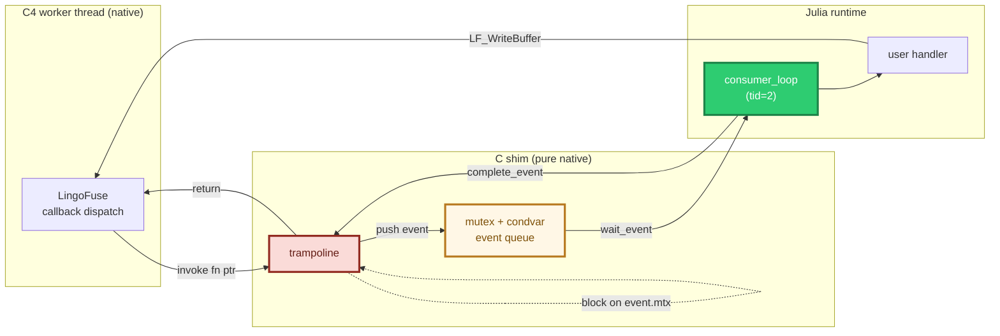
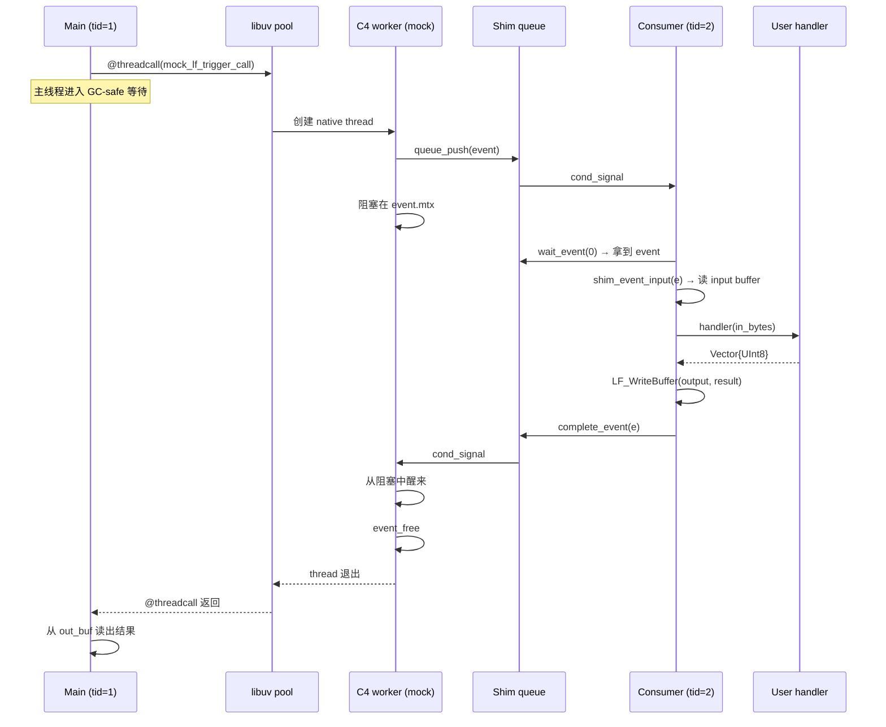
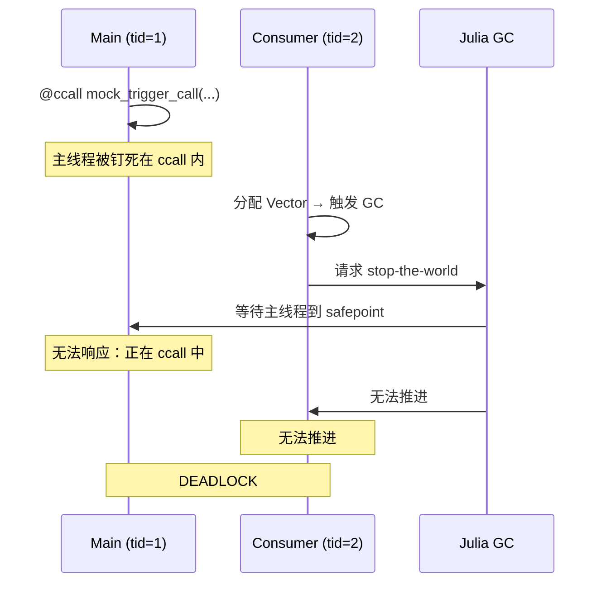

# LingoFuse Julia 绑定 · C Shim 机制验证文档

> **文档版本**：v1.0
> **验证环境**：Windows Server 2022 · Julia 1.13.1 · MinGW-w64 gcc 16.1.0 · x86_64
> **验证时间**：Step 1 完成时
> **验证结果**：11/11 检查通过（见 `test_shim.jl` 的输出 `main: DONE` 行）
> **文档定位**：本文档解释"为什么需要 C shim"、"机制如何工作"、"踩过哪些坑"、"后续开发的硬性规则"。它是 Step 2/3/4 的前置阅读材料。

---

## 第一部分：结论先行

### 1.1 验证了什么

通过 `test_shim.jl` 验证了以下事实：

| # | 结论 | 证据 |
|:-:|------|------|
| 1 | C shim 能在**真实原生线程**上安全触发回调 | `mock_lf.c` 用 `CreateThread`/`pthread_create` 创建线程，日志显示 consumer 每次都收到事件 |
| 2 | 回调参数（`input` / `output` 句柄）能跨线程传递并保持有效 | 日志显示 `handle_call: got handles  input=0x...  output=0x...`，读写均成功 |
| 3 | Julia 侧 handler 的结果能回写到 C 侧缓冲区 | `test_add_call` 返回 `12`，与 C 侧读出的值一致 |
| 4 | 字符串地址（`addr`）能跨线程完整传递 | `test_network_events` 收到 `ipc:test_endpoint` |
| 5 | 事件完成信号能让 C 侧 trampoline 正确返回 | 每个事件的日志顺序都是 `mock_trigger_call: ENTER` → `...` → `mock_trigger_call: RETURNED` |
| 6 | 整套机制**无死锁、无崩溃、无内存越界** | `main: DONE  checks_passed=11  checks_failed=0`，进程正常退出 |

### 1.2 没有验证什么

本文档**只覆盖回调机制**。以下内容属于后续步骤：

- 真实 LingoFuse 库的 33 个非回调 ABI 的调用（Step 2）
- 高层 JSON / 字符串封装（Step 3）
- Cross demo 移植（Step 4）

---

## 第二部分：为什么需要 C Shim

### 2.1 问题的本质

LingoFuse 的 API 回调在 **C4 worker 线程**上触发（见 `Z.Net.C4.LingoFuse.pas` 的 `TCompute.RunC`）。从 LingoFuse 的角度看，它只是在调用一个 C 函数指针。

但对 Julia 而言，一个"从外部线程进入 Julia runtime"的调用是**非法**的，因为：

| 子系统 | 依赖 | 外部线程的后果 |
|--------|------|----------------|
| **GC** | 每个 Julia 线程注册在 TLS 中，GC 靠遍历所有注册线程来 stop-the-world | 未注册线程进入 → GC 遍历不到它 → 已分配对象可能被误判为垃圾 |
| **JIT** | 编译缓存和调度依赖 runtime 状态 | 未注册线程调用 JIT 相关代码 → 状态不一致，崩溃 |
| **Task 调度器** | 每个线程维护自己的 run queue | 未注册线程尝试 `@async` / `yield` / `sleep` → 未定义行为 |

### 2.2 为什么其他语言没有这个问题

| 语言 | 回调机制 | 为什么安全 |
|------|----------|-----------|
| C / C++ | 原生函数指针 | 没有 runtime，没有 GC，没有调度器 |
| Python | `ctypes.CFUNCTYPE` | CPython 的 GIL 让任意线程进入解释器都是设计内的 |
| C# | `Marshal.GetFunctionPointerForDelegate` | CLR 的 P/Invoke 层能"接管"外来线程 |
| Rust | `extern "C" fn` | 无 GC，无 JIT，无调度器 |
| **Julia** | `@cfunction` | ❌ **四个子系统全部依赖线程已被 runtime 认领** |

### 2.3 三条候选路径

| 路径 | 做法 | 评价 |
|------|------|------|
| A | 在 trampoline 里调用 `jl_adopt_thread()` | ❌ 内部 API，跨版本不稳定；每线程要认领一次；与 C4 线程池复用语义冲突 |
| B | **C shim 中转** | ✅ **本方案** |
| C | 只做调用者，不做服务端 | ✅ 简单场景可用，但放弃 LingoFuse 的一半价值 |

**我们选择路径 B**。它不是"绕过问题"，而是**在 C 和 Julia 之间建一个缓冲区**：C 侧的一切都保持纯 native，Julia 侧只在它自己的线程上运行。

---

## 第三部分：机制详解

### 3.1 总体架构



### 3.2 一次回调的完整时序

以 `test_add_call` 为例，从 Julia 的 `mock_trigger_call("add", req)` 到返回，完整流程：



### 3.3 关键数据结构

`struct lf_shim_event` 是整个机制的核心：

```c
struct lf_shim_event {
    int      kind;         // CALL / NOTIFY / NET_CONNECT / NET_DISCONNECT
    int64_t  user_id;      // 用于 Julia 侧路由到正确的 handler
    void*    trigger;      // LingoFuse 原样透传
    void*    input;        // 借用的 DataHnd，trampoline 阻塞期间有效
    void*    output;       // 借用的 DataHnd，仅 Call 事件有
    char*    addr;         // 网络事件的地址副本（自管理生命周期）

    lf_mutex_t  mtx;       // 每事件独立的 mutex
    lf_cond_t   cv;        // 每事件独立的 condvar
    int         done;      // 完成标志

    struct lf_shim_event* next;  // 队列链表
};
```

**为什么每个事件有独立的 mutex/condvar**：如果共用一把锁，所有 C4 worker 在等待完成时会串行化，吞吐量崩塌。独立锁让每个 worker 只等自己的事件。

### 3.4 `user_id` 路由机制

LingoFuse 的 `trigger` 参数是 `void*`，LingoFuse 本身不使用它，只是"存进去，回调时原样传回"。Shim 用这个字段作为 **int64 user_id 的载体**：

```c
// 注册时
LF_RegisterCall(app, name, desc,
                (void*)(intptr_t)user_id,     // ← trigger 承载 user_id
                shim_call_trampoline);

// 触发时
int64_t uid = (int64_t)(intptr_t)trigger;     // ← 从 trigger 取回
```

Julia 侧维护 `HANDLERS = Dict{Int64, Function}()`，`consumer_loop` 用 `shim_event_uid(e)` 查表分发。

**为什么用 id 而不是指针**：Julia 对象在 GC 下会移动，指针不稳定；`Int64` 是 isbits，跨语言传递无歧义。

### 3.5 内存生命周期契约

| 对象 | 所有权 | 释放时机 |
|------|--------|----------|
| `lf_shim_event_t` | trampoline 分配，trampoline 释放 | `lf_shim_complete_event` 返回后，trampoline 自己 `event_free` |
| `input` / `output` 句柄 | LingoFuse 拥有 | trampoline 返回后 LingoFuse 释放 |
| `addr` 字符串 | shim 自己 `malloc` 副本 | `event_free` 时 free |
| Julia 侧 `Vector{UInt8}` | Julia GC | 正常 GC |

**关键契约**：Julia 侧**永远不能**在 `shim_complete(e)` 之后触碰 `e`。`e` 已被 trampoline 释放。

---

## 第四部分：踩坑记录（本次调试的关键发现）

以下每一条都是本次实际调试中踩到的、**后续开发必须避免**的坑。

### 4.1 `@ccall` 宏的语法限制

**症状**：

```julia
@ccall LIB.fn()::Cint == 1 || error("...")
```

报错 `ArgumentError: @ccall needs a function signature with a return type`。

**根因**：Julia 解析器把 `@ccall` 后面的**整个表达式**（到行尾）当作宏参数。`X == 1 || err()` 这个整体的顶层操作符是 `||`，`@ccall` 内部找不到 `::`。

**规则**：`@ccall` 必须**独占**赋值右侧或整个语句。任何运算符混用都要**先赋值，后运算**。

```julia
# ✅ 正确
ret = @ccall LIB.fn()::Cint
ret == 1 || error("...")

# ❌ 错误
@ccall LIB.fn()::Cint == 1 || error("...")
```

### 4.2 `@ccall` 不支持 `$(...)` 库插值

**症状**：

```julia
const H = dlopen("lib.so")
@ccall $(H).fn()::Cint   # ❌ TypeError: in ccall library name, expected Symbol
```

**根因**：`@ccall` 的库插值机制与普通 `$var` 不同，且要求插值结果是 `Symbol` 或 `LazyLibrary`，不接受 `dlopen` 返回的 `Ptr{Nothing}`。

**规避**：改用原始 `ccall` 形式：

```julia
ccall((:fn, LIB_PATH), Cint, ())
```

### 4.3 Julia 1.13 的 `ccall` 库参数类型

**症状**：

```julia
const H = Libdl.dlopen("lib.so")
ccall((:fn, H), Cint, ())    # ❌ TypeError: in dlopen, expected Union{String, Symbol, LazyLibrary}
```

**根因**：Julia 1.13 起，`ccall` 的库参数**只接受** `String` / `Symbol` / `LazyLibrary`。传 `dlopen` 句柄的做法已被移除。

**规则**：

```julia
const LIB = "path/to/lib.so"   # String
ccall((:fn, LIB), ...)          # ✅ Julia 内部缓存 dlopen，无重复开销
```

### 4.4 `Cstring` 作为返回值会自动解码

**症状**：

```julia
p = @ccall LIB.get_addr()::Cstring
p == C_NULL && return nothing     # ❌ p 是 String，永远不会 == C_NULL
unsafe_string(p)                  # ❌ String 不能传给 unsafe_string
```

**根因**：`Cstring` 作为 `ccall` 的返回类型时，Julia **自动**把 C 字符串转换成 Julia `String`。空指针会直接抛异常。

**规则**：需要检查 NULL 时，返回类型写 `Ptr{UInt8}`：

```julia
function get_addr()::Union{String,Nothing}
    p = ccall((:get_addr, LIB), Ptr{UInt8}, ())
    p == C_NULL && return nothing
    return unsafe_string(p)
end
```

### 4.5 GC stop-the-world 与阻塞 ccall 的死锁（**最严重**）

**症状**：Julia 侧 consumer 收到事件后卡死，`handle_call: input read` 之后无日志。

**根因**：



**关键理解**：**Julia 的 GC 需要所有线程到 safepoint**，而一个正阻塞在 C 调用里的线程**不在 safepoint**。

**修复**：所有阻塞时间可能较长的 C 调用必须走 `@threadcall`：

```julia
# ❌ 会钉死 Julia 线程
ccall((:blocking_fn, LIB), Cvoid, (Cstring,), s)

# ✅ 走 libuv 线程池，Julia 线程可响应 GC
name_ptr = Base.unsafe_convert(Ptr{UInt8}, s)
GC.@preserve s begin
    @threadcall((:blocking_fn, LIB), Cvoid, (Ptr{UInt8},), name_ptr)
end
```

**为什么 `@threadcall` 参数必须是 isbits**：libuv 线程不是 Julia 线程，不能调用任何 Julia runtime。传 `String` 会触发转换，转换进入 Julia runtime → 非法线程进入 → 新的问题。所有指针必须在**调用前**用 `Base.unsafe_convert` 转好。

**搭配 `GC.@preserve`**：`@threadcall` 不保留参数引用。传 `pointer(buf)` 后，`buf` 可能被 GC 回收，libuv 线程读到悬空内存。必须 `GC.@preserve buf begin ... end`。

### 4.6 Consumer 长超时轮询也会钉死 GC

**症状**：`shim_wait_event(100)` 的循环里，虽然主线程用了 `@threadcall`，测试还是偶发卡在收尾。

**根因**：`shim_wait_event(100)` 是**阻塞 100ms 的 ccall**。当 GC 请求到达时，consumer 正在这个 ccall 里，同样无法 safepoint。每次 GC 都要等 100ms，如果 GC 请求频繁，就表现为饥饿。

**修复**：consumer 循环改为**非阻塞轮询**：

```julia
while RUNNING[]
    e = shim_wait_event(0)         # 立即返回，几微秒的 ccall
    if e == C_NULL
        sleep(0.005)                # 主动让出，让 GC 完成
        continue
    end
    # ... 处理事件 ...
    sleep(0)                        # 事件处理后也让出一次
end
```

**代价**：CPU 使用率略升（每 5ms 一次 syscall），但换来 GC 完全流畅。

---

## 第五部分：后续开发的硬性规则

以下规则**适用于 Step 2 / 3 / 4 的所有 Julia 侧代码**。

### 规则 1：任何超过 1ms 的 ccall 都要走 `@threadcall`

**判定标准**：如果这个 C 函数可能阻塞（网络、磁盘、等待、锁），就用 `@threadcall`。

**应用于**：

| LingoFuse 函数 | 是否阻塞 | 处理方式 |
|----------------|:--------:|----------|
| `LF_CreateData` / `LF_FreeData` | 微秒级 | 普通 `ccall` |
| `LF_WriteBuffer` / `LF_ReadBuffer` | 微秒级 | 普通 `ccall` |
| `LF_GetPos` / `LF_SetPos` / `LF_GetSize` / `LF_SetSize` | 微秒级 | 普通 `ccall` |
| `LF_CreateApp` / `LF_FreeApp` | 微秒级 | 普通 `ccall` |
| `LF_RegisterCall` / `LF_RegisterNotify` | 微秒级 | 普通 `ccall` |
| `LF_SetOption` / `LF_PostStatus` | 微秒级 | 普通 `ccall` |
| **`LF_Call`** | **秒级**（阻塞等待响应） | **`@threadcall`** |
| **`LF_PrepareDone`** | **可能阻塞 30 秒** | **`@threadcall`** |
| **`LF_ExitMainThread`** | **可能等待主线程退出** | **`@threadcall`** |
| **`LF_Shutdown`** | **可能等待资源释放** | **`@threadcall`** |
| `LF_Notify` / `LF_Sequenced_Notify` | 排队后立即返回 | 普通 `ccall`（除非队列满） |

### 规则 2：`@threadcall` 的每个参数都必须是 isbits

```julia
# ✅ 正确
name_ptr = Base.unsafe_convert(Ptr{UInt8}, name)
GC.@preserve name begin
    @threadcall((:fn, LIB), Cvoid,
                (Ptr{UInt8}, Csize_t),    # 都是 isbits
                name_ptr, length(name))
end

# ❌ 错误：传 String 会触发 libuv 线程做转换
@threadcall((:fn, LIB), Cvoid, (Cstring,), name)
```

**例外**：`Cstring` 作为 `@threadcall` 的参数类型是**允许**的，但**传入的必须是已转换的 `Cstring`**，不能是 `String`：

```julia
cstr = Base.unsafe_convert(Cstring, name)
GC.@preserve name begin
    @threadcall((:fn, LIB), Cvoid, (Cstring,), cstr)
end
```

### 规则 3：任何传指针给 native 的调用都要 `GC.@preserve`

```julia
buf = Vector{UInt8}(undef, 1024)
GC.@preserve buf begin
    ccall((:fn, LIB), Cvoid, (Ptr{UInt8},), pointer(buf))
end
```

**不能省的场景**：
- `@threadcall`（因为执行在其他 OS 线程）
- 长时间 ccall（因为期间可能触发 GC）
- `unsafe_convert` 后立即使用（局部变量提升可能被优化掉）

### 规则 4：所有 Julia 侧消费循环必须是"非阻塞 + 让出"模式

```julia
while RUNNING[]
    e = wait_event(0)          # 立即返回
    if e == C_NULL
        sleep(SMALL_INTERVAL)  # 让出
        continue
    end
    # ... 处理 ...
    sleep(0)                   # 让出
end
```

**绝不允许**：`wait_event(100)` 或更长的阻塞。

### 规则 5：Julia 侧 consumer 必须在**非 main 线程**

```julia
consumer = Threads.@spawn consumer_loop()   # ✅
sleep(0.2)                                   # 给调度器时间迁移
if CONSUMER_TID[] == 1
    @error "consumer on main thread: will deadlock"
end
```

**启动 Julia 时必须加 `--threads=2`**（或更多）。

### 规则 6：`@cfunction` 的闭包限制

**不允许**把闭包传给 `@cfunction`：

```julia
# ❌ 编译错误
cb = @cfunction(x -> handler(ctx, x), Cvoid, (Ptr{Cvoid},))
```

**必须**用顶层函数 + 显式状态：

```julia
# ✅
function _cb(state::Ptr{Cvoid}, arg::Ptr{Cvoid})::Cvoid
    ctx = unsafe_pointer_to_objref(state)::MyContext
    ...
end

# 或者全局 id 表（本项目的做法）
const HANDLERS = Dict{Int64, Function}()
```

### 规则 7：库路径用 `String` 常量，不要 `dlopen`

```julia
const LIB = "/path/to/library"   # String
# 之后所有 ccall / @threadcall 都用 LIB
```

Julia 内部会缓存 `dlopen` 结果，不会有重复开销。

---

## 第六部分：验收清单

未来任何对 shim 或 Julia 调用层的改动，必须通过以下清单：

### C 侧

- [ ] 所有需要跨线程的参数（句柄、指针）都由 shim 正确携带
- [ ] 每个事件的 mutex / condvar 独立，不共用
- [ ] `lf_shim_complete_event` 之后，C 侧不再触碰 event
- [ ] `lf_shim_shutdown` 能唤醒所有阻塞的 consumer
- [ ] Windows 和 POSIX 的线程原语都对

### Julia 侧

- [ ] 所有阻塞 ccall 都走 `@threadcall`
- [ ] 所有 `@threadcall` 参数都是 isbits（或预转换的 `Cstring`）
- [ ] 所有传指针给 native 的地方都有 `GC.@preserve`
- [ ] consumer 循环是非阻塞 + `sleep(0)` / `sleep(small)`
- [ ] consumer 在非 main 线程
- [ ] `--threads >= 2` 启动
- [ ] 启动时有 `consumer_tid` 校验

### 集成

- [ ] 完整跑一遍 `test_shim.jl`
- [ ] 看到 `main: DONE  checks_passed=N  checks_failed=0`
- [ ] 进程正常退出，无 `Ctrl+C` 杀进程
- [ ] Windows 和 Linux 都测过（如果目标平台包括两者）

---

## 第七部分：Step 2 的前瞻

Step 1 验证了**回调机制**。Step 2 会：

1. 编译一个**真实 shim**（与 `mock_lf.c` 不同，链接真库）
2. 用 `ccall` / `@threadcall` 实现 33 个**非回调** LF_* 函数
3. 在 Julia 侧构建 `DataHandle` / `App` 的 RAII 包装
4. 用 `LF_LocalCall` / `LF_LocalNotify` 做**无网络**的端到端测试

**Step 2 会遇到的新的坑**（预判）：

| 坑 | 说明 | 预防 |
|----|------|------|
| `LF_CreateApp` 返回 `AppHnd`，但 Julia 没有 `finalizer` 会误回收 | 需要显式 `finalizer` | 用 mutable struct + finalizer |
| `LF_FreeData` 在 `LF_PrepareDone` 之前是 no-op（见 LF-DATA-008） | 包装层要显式管理生命周期 | 在 wrapper 里跟踪 `owned` 标志 |
| `LF_PrepareDone` 每进程只返回 1 一次 | 多次调用会返回 0 | Julia 层做状态守卫 |
| `LF_GetStatus` 返回静态缓冲 | 必须立即拷贝 | 已在文档中明确 |

**Step 2 的验收标准**：能在 Julia 里写出一个 App，注册一个 API，用 `LF_LocalCall` 调通。

---

## 附录 A：文件清单

| 文件 | 作用 |
|------|------|
| `lf_shim.h` | C shim 的公共接口 |
| `lf_shim.c` | C shim 的实现（队列 + trampoline） |
| `mock_lf.h` / `mock_lf.c` | 模拟 LingoFuse ABI（测试用），含 native-thread 驱动 |
| `build.ps1` / `build.sh` | 编译 `lf_shim_mock.dll` / `.so` / `.dylib` |
| `test_shim.jl` | Julia 仿真测试（本文档验证的对象） |

## 附录 B：版本与兼容性

| 组件 | 最低版本 | 备注 |
|------|----------|------|
| Julia | **1.9**（建议 1.10+） | `@threadcall` 稳定性 |
| Julia 目标 | **1.13+** | `ccall` 库参数只接受 `String` / `Symbol` / `LazyLibrary` |
| gcc (MinGW-w64) | 任意 x86_64 版本 | 必须与 Julia 同为 64 位 |
| 平台 | Windows x64 / Linux x64 / macOS x64 | 32 位未测 |

## 附录 C：术语表

| 术语 | 含义 |
|------|------|
| **C4 worker thread** | LingoFuse 内部用于网络事件处理的 native 线程 |
| **safepoint** | Julia GC 能安全暂停线程的代码位置；阻塞 ccall 内**不**是 safepoint |
| **isbits** | Julia 中"无 GC 引用"的值类型；可安全传给 `@threadcall` |
| **adopt thread** | `jl_adopt_thread()` 让外部线程被 Julia runtime 认领（未采用） |
| **trampoline** | C shim 中注册给 LingoFuse 的原生回调函数 |
| **user_id** | 整型标识，用于 Julia 侧路由事件到正确的 handler |

---

*文档结束。下次修改 shim 或写 Step 2 前，请先读完第四、五部分。*
