# Pascal Service Guide for LingoFuse HTTP Bridge

**版本**：v4.0
**最后更新**：2026-09-19
**适用对象**：使用 Pascal（Free Pascal / Delphi）编写 LingoFuse 服务端，并通过 `bridge.py` 对外提供 HTTP 接口的开发者。
**参照基准**：本指南的所有契约均以 `lingofuse/bridge.py` 当前版本源码为准。

> **本版重点**：
> - 修正 v3.0 中关于"bridge 不做 JSON 处理"的过时说法——当前 `bridge.py` **会对 JSON 载荷做规范化**（可选，默认开启）。
> - 用准确的措辞重新论述"Pascal 走 bridge 天然稳定"。
> - 所有流程图使用 Mermaid。过大的图拆分为多个小图。
> - 只讲流程，不写具体目录。

---

## 目录

1. [为什么 Pascal 走 bridge 天然稳定](#第-1-章-为什么-pascal-走-bridge-天然稳定)
2. [三角色架构](#第-2-章-三角色架构)
3. [环境准备](#第-3-章-环境准备)
4. [Pascal 服务端开发规范](#第-4-章-pascal-服务端开发规范)
5. [bridge.py 的载荷处理规则](#第-5-章-bridgepy-的载荷处理规则)
6. [命令行操作详解](#第-6-章-命令行操作详解)
7. [端到端启动流程](#第-7-章-端到端启动流程)
8. [测试与验证](#第-8-章-测试与验证)
9. [故障排查](#第-9-章-故障排查)
10. [生产部署建议](#第-10-章-生产部署建议)

---

## 第 1 章 为什么 Pascal 走 bridge 天然稳定

### 1.1 一句话结论

> **Pascal 只负责业务计算，bridge 负责 HTTP 与编码处理。两边的职责边界清晰且固定，这就是长期稳定运行的工程基础。**

### 1.2 三条稳定性根基

稳定性不是一句口号，它来自三条可以被逐条核对的事实：

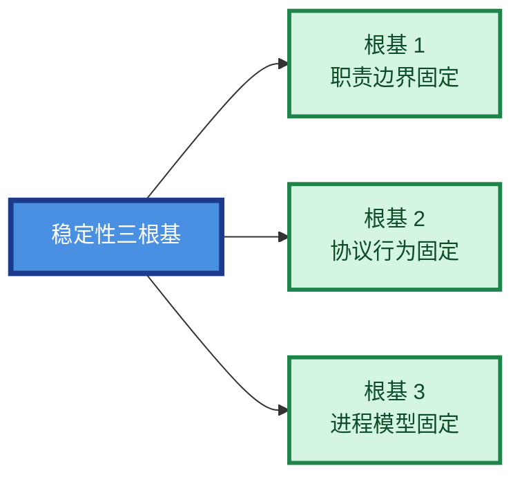

| 根基 | 具体含义 | 为什么稳定 |
|------|---------|-----------|
| **职责边界固定** | Pascal 只读写二进制 DataHnd；bridge 只做 HTTP ↔ DataHnd 的搬运与 JSON 规范化 | 每一方只做少数几件确定性的事 |
| **协议行为固定** | `LF_WriteString` 无条件追加 `\0`；`LF_ReadString` 遇到 `\0` 停止；bridge 剥离尾部 `\0` | 三个动作在两端一致，不会因平台或版本变化 |
| **进程模型固定** | Pascal 进程与 bridge 进程通过 LingoFuse C4 网格通信；bridge 无状态 | Pascal 进程崩溃或重启，不影响 bridge 与其它节点 |

### 1.3 谁负责什么

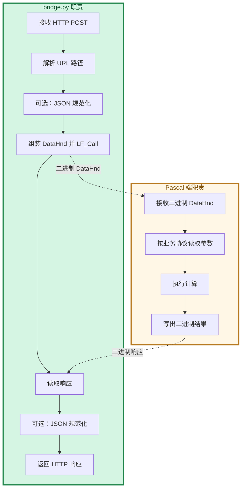

**关键点**：

1. **Pascal 端不碰 HTTP**——它不知道请求是从浏览器、curl、还是别的 Pascal 节点来的。
2. **Pascal 端不做 JSON 解析**——它只是把 DataHnd 的字节按业务协议读出来。协议是 JSON 还是二进制由业务决定。
3. **Pascal 端不做编码转换**——它只信任 DataHnd 的字节，由 bridge 保证进入 DataHnd 的字节已经是规范化后的形式。
4. **bridge 不做业务校验**——它只保证"载荷是合法 JSON 或原样透传"，具体业务字段由 Pascal 端负责。

### 1.4 稳定性的技术根源

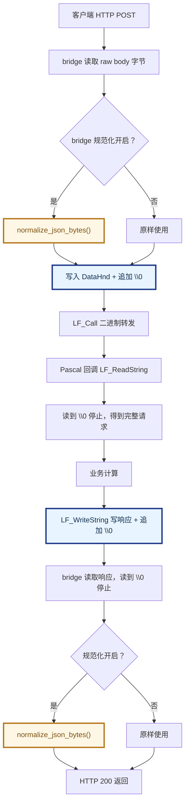

**逐条解读**：

1. **`\0` 读写在两端一致**——`LF_WriteString` 加、`LF_ReadString` 停、bridge 剥离。这三步固定，字符串边界永远清晰。
2. **JSON 规范化只在 bridge 出口执行**——Pascal 端只需要保证自己写出的是符合业务约定的内容（推荐用 `TZ_JsonObject` 或 `TPascalString.Bytes`），bridge 会把它规范化成客户端能安全解析的 UTF-8 紧凑 JSON。
3. **Pascal 端不知道 HTTP 或浏览器存在**——它只看到一个 DataHnd 进、一个 DataHnd 出。业务逻辑与传输层完全解耦。

### 1.5 与其它方案的对比

| 方案 | 主要问题 | bridge 方案的差异 |
|------|---------|------------------|
| Pascal 内嵌 HTTP 服务 | 需要维护 HTTP 解析、TLS、连接池、并发 | bridge 全包，Pascal 一行 HTTP 代码不写 |
| Pascal 直接暴露 LingoFuse 端口 | 二进制协议对浏览器不友好，安全层难叠 | bridge 提供标准 HTTP，安全层可放在 Nginx |
| Pascal 手动拼 JSON 响应 | 字符串转义、UTF-8 编码、尾随逗号等易错 | bridge 规范化 JSON，客户端拿到的永远是合法载荷 |
| 用 Node/PHP 写中间层 | 又要装一套运行时和依赖 | bridge 是单个 Python 进程，依赖极少 |

---

## 第 2 章 三角色架构

### 2.1 三个角色及职责

| 角色 | 语言 | 编译产物 | 端点 | 职责 |
|------|------|---------|------|------|
| **bridge_service** | Pascal | 原生可执行文件 | `ipc:compute_grid` | 服务注册中心（信标），不注册业务 API |
| **bridge_compute** | Pascal | 原生可执行文件 | 连接信标 | 注册 `pas.exp`，执行业务逻辑 |
| **bridge.py** | Python | 脚本或打包后单文件 | `http://0.0.0.0:8081` | HTTP 网关，转发到 `pas.exp` |

> **关于路径**：本指南不写具体目录。所有程序编译/安装在你认为合适的位置即可，只要保证 `LingoFuse64.dll`（Windows）/ `liblingofuse.so`（Linux）/ `liblingofuse.dylib`（macOS）能被找到。

### 2.2 启动时序（分四阶段）

因为完整时序图太大，拆成四个小图。

#### 阶段 1 —— 信标启动

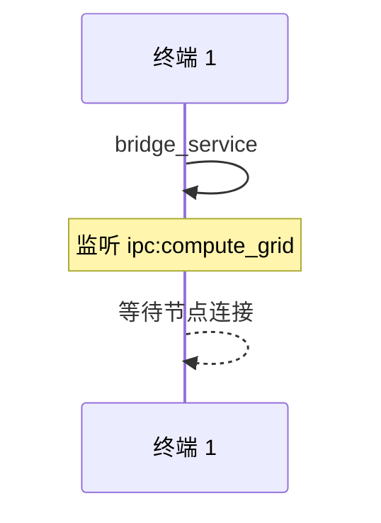

#### 阶段 2 —— 计算节点注册

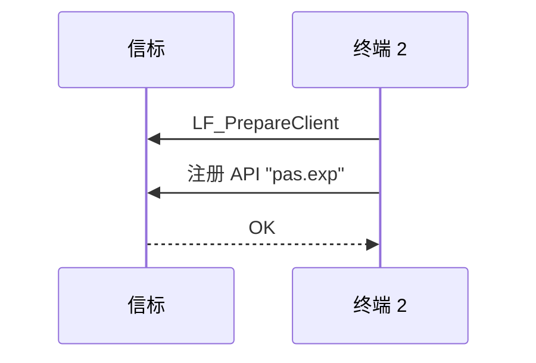

#### 阶段 3 —— 网关接入

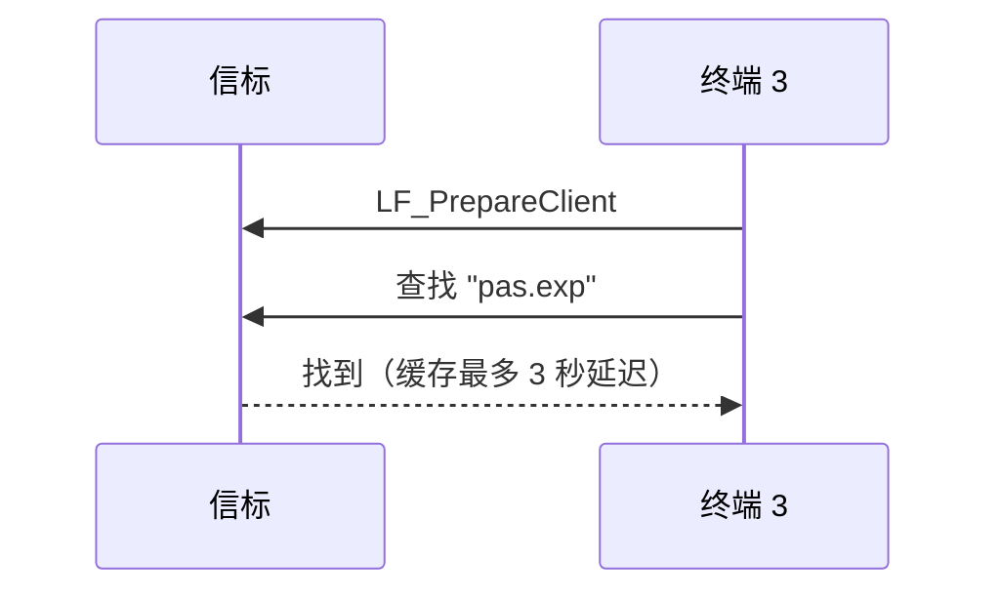

#### 阶段 4 —— 端到端调用

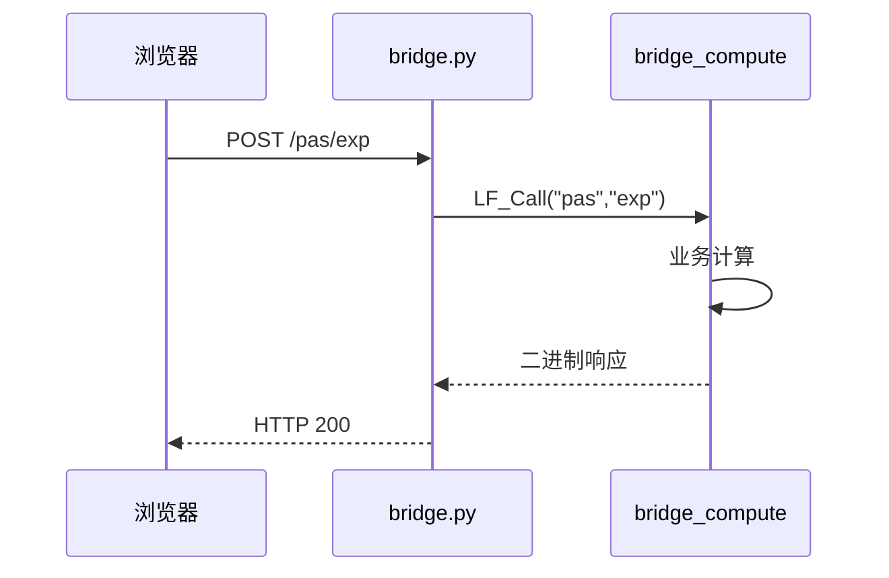

---

## 第 3 章 环境准备

### 3.1 依赖检查流程

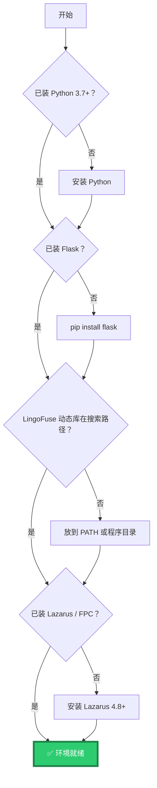

### 3.2 依赖清单

| 组件 | 版本要求 | 说明 |
|------|---------|------|
| Python | ≥ 3.7 | 运行 bridge.py |
| Flask | ≥ 2.0 | bridge.py 的 HTTP 框架 |
| lingofuse 包 | 与本仓库同版本 | Python 绑定 |
| LingoFuse 动态库 | 与本仓库同版本 | 核心 RPC 库 |
| Lazarus / FPC | 3.2.2+ 或 3.3.1 | 编译 Pascal 端 |

### 3.3 动态库位置

只需要保证一件事：动态库能被找到。

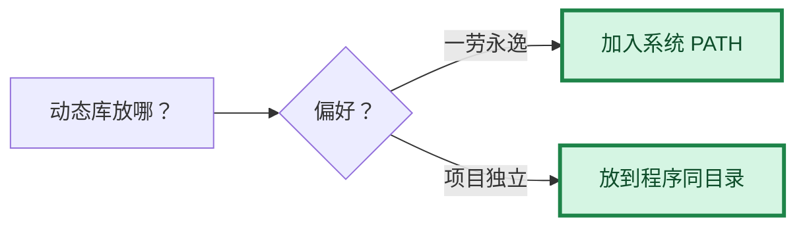

---

## 第 4 章 Pascal 服务端开发规范

### 4.1 API 注册的标准范式

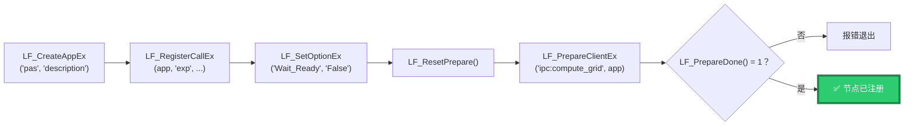

**关键点**：注册回调时**不需要考虑 HTTP 或 JSON 解析**——回调只读写二进制 DataHnd。

### 4.2 JSON 格式约定

这是一个**应用层约定**，不是协议强制。bridge 不校验，客户端（如 `web_demo.html`）依赖它。

**请求**（HTTP → bridge → Pascal）：

```json
{"args": ["1+2*3"]}
```

**成功响应**：

```json
{"code": 0, "result": "7"}
```

**错误响应**：

```json
{"code": -1, "error": "错误描述"}
```

> **提示**：Pascal 端推荐用 `TZ_JsonObject` 构造响应，这样写出的字节天然是合法 UTF-8 JSON，bridge 的规范化也会直接判为 `canonical`（字节无变化）。

### 4.3 字符串与 `\0` 的契约


**为什么这是稳定的关键**：

- `LF_WriteString` 无条件追加 `\0`——一致的行为。
- `LF_ReadString` 遇到 `\0` 就停——一致的行为。
- bridge 剥离尾部 `\0`——客户端拿到的 body 干净。

这三步在两端固定成立，字符串边界永远清晰。

---

## 第 5 章 bridge.py 的载荷处理规则

> **本章是 v4.0 相对 v3.0 的核心修正**。v3.0 声称"bridge 不处理 JSON"是**过时的**——当前 `bridge.py` 默认会规范化 JSON 载荷。

### 5.1 一句话规则

> **能识别为 JSON 的载荷会被规范化为 UTF-8 紧凑 JSON；不能识别的载荷原样透传。二进制安全是硬保证。**

### 5.2 请求方向的载荷流程

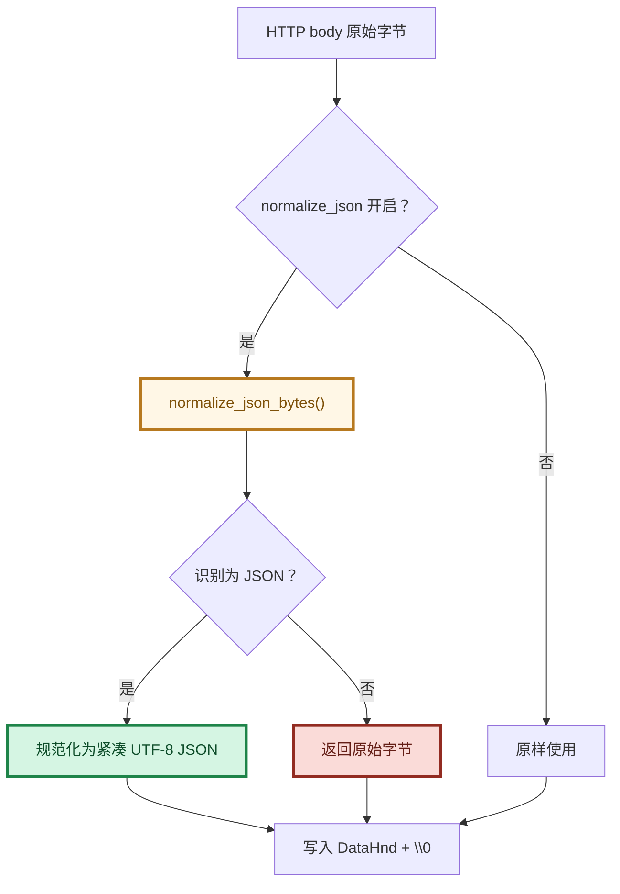

### 5.3 响应方向的载荷流程

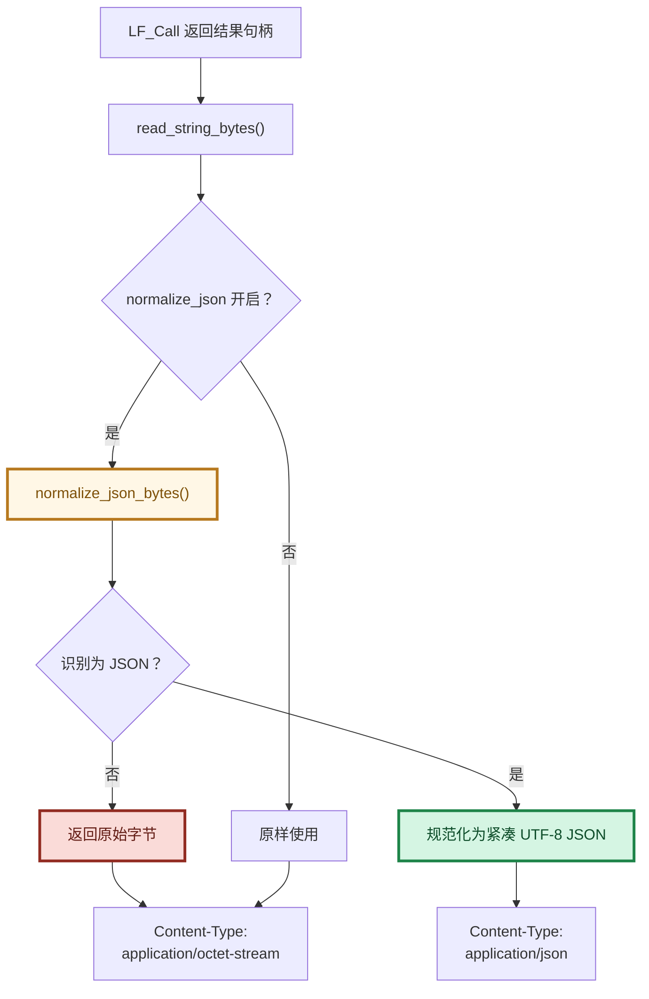

### 5.4 七个规范化步骤

`normalize_json_bytes()` 按顺序执行：

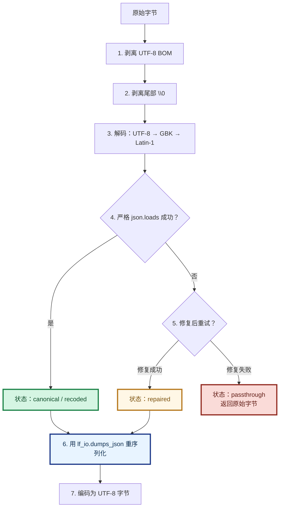

### 5.5 四个状态码

| 状态 | 含义 | 输出 | Content-Type |
|------|------|------|-------------|
| `canonical` | 输入已是合法 UTF-8 JSON | 紧凑 JSON | `application/json` |
| `recoded` | 输入是 GBK / Latin-1 编码的合法 JSON | 转成 UTF-8 紧凑 JSON | `application/json` |
| `repaired` | 输入经修复后才合法（如尾随逗号） | 紧凑 JSON | `application/json` |
| `passthrough` | 无法识别为 JSON | **原始字节不变** | `application/octet-stream` |

### 5.6 处理示例

| 输入 | 输出 | 状态 |
|------|------|------|
| `{"a":1}` | `{"a":1}` | canonical |
| `{"a":1,}` | `{"a":1}` | repaired |
| `EF BB BF{"a":1}` | `{"a":1}` | canonical |
| `{"a":"你好"}` 用 GBK 编码 | `{"a":"你好"}` 用 UTF-8 | recoded |
| `{"a":1}\x00` | `{"a":1}` | canonical |
| `\x89PNG\r\n...` | 字节完全不变 | passthrough |
| `not json at all` | 字节完全不变 | passthrough |

### 5.7 二进制安全保证

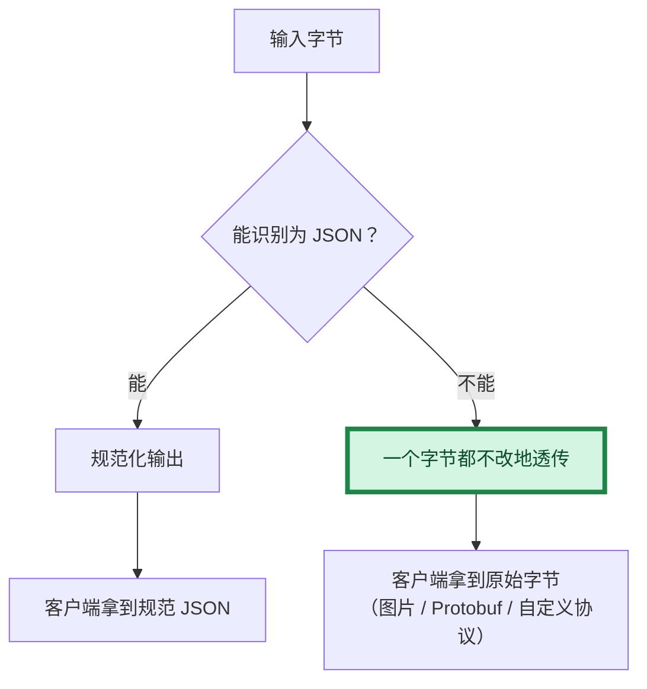

**硬保证**：bridge 绝不猜测、绝不修改无法识别为 JSON 的载荷。

### 5.8 对 Pascal 端的影响

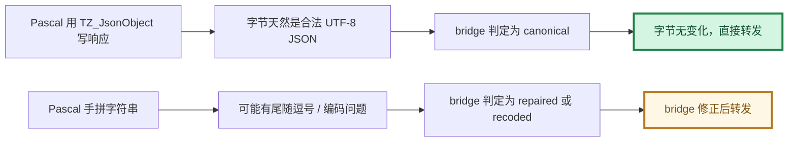

**建议**：Pascal 端**优先用 `TZ_JsonObject`** 构造响应，让 bridge 走 `canonical` 路径（零修改）。这样既省 CPU，也让行为完全可预期。

---

## 第 6 章 命令行操作详解

### 6.1 三个维度

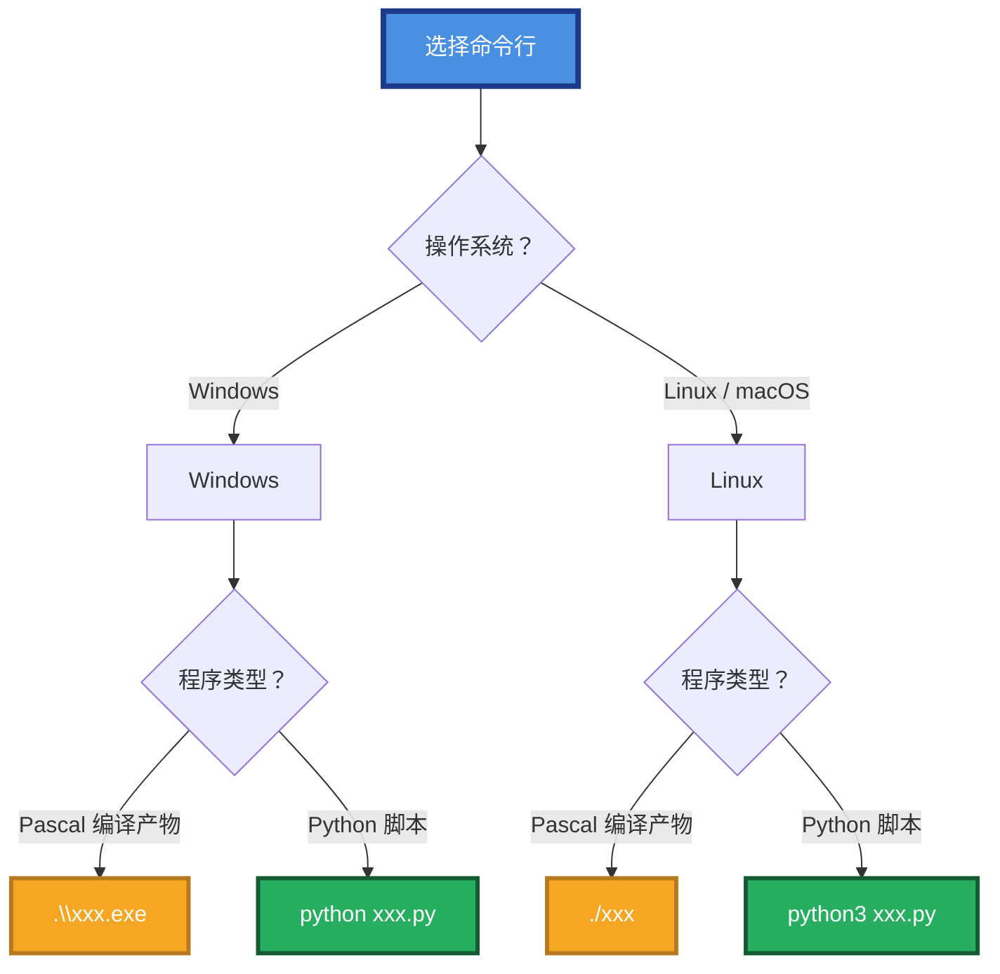

### 6.2 Pascal 编译产物的平台差异

**编译**（两个平台一致）：

```bash
lazbuild -B bridge_service.lpr
lazbuild -B bridge_compute.lpr
```

**运行**：

| 平台 | 编译产物名 | 运行方式 |
|------|-----------|---------|
| Windows | `bridge_service.exe` | `.\bridge_service.exe` 或双击 |
| Windows | `bridge_compute.exe` | `.\bridge_compute.exe` 或双击 |
| Linux | `bridge_service` | `./bridge_service` |
| Linux | `bridge_compute` | `./bridge_compute` |

> **Linux / macOS 首次运行前**：`chmod +x bridge_service bridge_compute`

### 6.3 bridge_service —— 信标（Pascal）

#### 6.3.1 Windows 启动

**CMD**：

```cmd
bridge_service.exe
```

**PowerShell**：

```powershell
.\bridge_service.exe
```

> **PowerShell 必须加 `.\` 前缀**——否则会提示"无法将 'bridge_service.exe' 项识别为 cmdlet"。

**期望输出**：

```
=== LingoFuse Beacon (bridge_service) ===
[OK] Beacon started on endpoint: ipc:compute_grid
Press Enter to exit...
```

#### 6.3.2 Linux 启动

```bash
chmod +x bridge_service     # 首次运行前
./bridge_service
```

### 6.4 bridge_compute —— 计算节点（Pascal）

#### 6.4.1 Windows 启动

**CMD**：

```cmd
bridge_compute.exe
```

**PowerShell**：

```powershell
.\bridge_compute.exe
```

**期望输出**：

```
=== LingoFuse Compute Node (bridge_compute) ===
[OK] Compute node connected to beacon, waiting for JSON requests...
Press Enter to exit...
```

#### 6.4.2 Linux 启动

```bash
chmod +x bridge_compute
./bridge_compute
```

### 6.5 bridge.py —— HTTP 网关（Python）

#### 6.5.1 两种执行模式

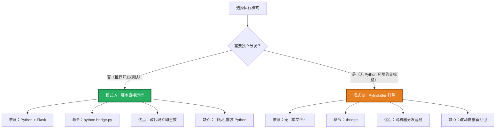

#### 6.5.2 模式 A：脚本直接运行（推荐）

**Windows CMD**：

```cmd
python lingofuse\bridge.py --endpoint ipc:compute_grid --no-precheck --debug --port 8081
```

**Windows PowerShell**：

```powershell
python .\lingofuse\bridge.py --endpoint ipc:compute_grid --no-precheck --debug --port 8081
```

**Linux / macOS**：

```bash
python3 lingofuse/bridge.py --endpoint ipc:compute_grid --no-precheck --debug --port 8081
```

> 如果 `lingofuse` 包不在当前目录，设置 `PYTHONPATH`：
> - Windows CMD：`set PYTHONPATH=<py目录>`
> - Windows PowerShell：`$env:PYTHONPATH="<py目录>"`
> - Linux：`export PYTHONPATH=<py目录>`

#### 6.5.3 模式 B：PyInstaller 打包

**打包步骤（一次性）**：

**Windows**：

```cmd
pip install pyinstaller
pyinstaller --onefile --name bridge lingofuse\bridge.py
```

产物：`dist\bridge.exe`

**Linux**：

```bash
pip3 install pyinstaller
pyinstaller --onefile --name bridge lingofuse/bridge.py
```

产物：`dist/bridge`（无扩展名）

**运行（打包后）**：

**Windows**：

```cmd
bridge.exe --endpoint ipc:compute_grid --debug --port 8081
```

**Linux**：

```bash
chmod +x bridge
./bridge --endpoint ipc:compute_grid --debug --port 8081
```

> **打包后仍需动态库在可搜索路径**——PyInstaller 只打包 Python 与 Flask，不打包 LingoFuse 动态库。

#### 6.5.4 完整参数速查

| 参数 | 环境变量 | 默认值 | 说明 |
|------|---------|--------|------|
| `--host` | `LINGOFUSE_HOST` | `0.0.0.0` | 监听地址 |
| `--port` | `LINGOFUSE_PORT` | `8081` | 监听端口 |
| `--endpoint` | `LINGOFUSE_ENDPOINT` | `ipc:lingofuse_bridge` | **必须与 Pascal 端一致** |
| `--timeout` | `LINGOFUSE_TIMEOUT` | `5000` | 调用超时（毫秒） |
| `--app` | `LINGOFUSE_APP` | 无 | 单段路径的默认 app |
| `--threaded` / `--no-threaded` | `LINGOFUSE_THREADED` | `True` | 多线程请求处理 |
| `--debug` / `--no-debug` | `LINGOFUSE_DEBUG` | `False` | 详细日志 |
| `--no-precheck` / `--precheck` | `LINGOFUSE_NO_PRECHECK` | `False` | 跳过 `check_api` 预检 |
| `--normalize-json` / `--no-normalize-json` | `LINGOFUSE_NORMALIZE_JSON` | `True` | JSON 规范化 |
| `--log-file` | `LINGOFUSE_LOG_FILE` | `stderr` | 日志文件路径 |

#### 6.5.5 三种典型启动命令

**开发调试**（跳过预检 + 详细日志）：

```bash
python3 lingofuse/bridge.py --endpoint ipc:compute_grid --no-precheck --debug --port 8081
```

**生产部署**（只监听本机 + 日志文件）：

```bash
python3 lingofuse/bridge.py --endpoint ipc:compute_grid --host 127.0.0.1 --port 8081 --log-file bridge.log
```

**关闭 JSON 规范化**（纯字节透传）：

```bash
python3 lingofuse/bridge.py --endpoint ipc:compute_grid --no-normalize-json --port 8081
```

---

## 第 7 章 端到端启动流程

### 7.1 完整流程拆四阶段

#### 阶段 1 —— 信标

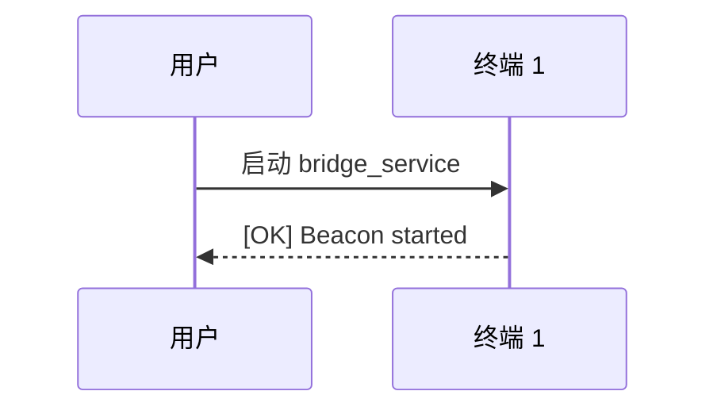

#### 阶段 2 —— 计算节点

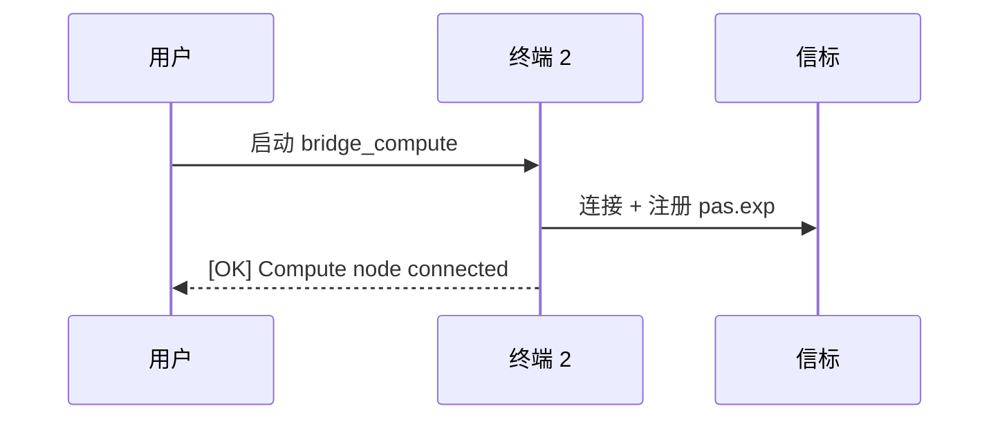

#### 阶段 3 —— HTTP 网关

```mermaid
sequenceDiagram
    participant U as 用户
    participant T3 as 终端 3
    participant T1 as 信标
    U->>T3: 启动 bridge.py
    T3->>T1: 连接 + 查找 pas.exp
    T3-->>U: [OK] Connected to LingoFuse service
```

#### 阶段 4 —— 调用

```mermaid
sequenceDiagram
    participant B as 浏览器
    participant T3 as bridge.py
    participant T2 as bridge_compute
    B->>T3: POST /pas/exp
    T3->>T2: LF_Call("pas","exp")
    T2-->>T3: "7"
    T3-->>B: {"code":0,"result":"7"}
```

### 7.2 三个终端命令

**Windows（CMD）**：

```cmd
:: 终端 1
bridge_service.exe

:: 终端 2（等终端 1 打印 OK 后）
bridge_compute.exe

:: 终端 3（等终端 2 打印 OK 后）
python lingofuse\bridge.py --endpoint ipc:compute_grid --no-precheck --debug --port 8081
```

**Windows（PowerShell）**：

```powershell
# 终端 1
.\bridge_service.exe

# 终端 2
.\bridge_compute.exe

# 终端 3
python .\lingofuse\bridge.py --endpoint ipc:compute_grid --no-precheck --debug --port 8081
```

**Linux**：

```bash
# 终端 1
./bridge_service

# 终端 2
./bridge_compute

# 终端 3
python3 lingofuse/bridge.py --endpoint ipc:compute_grid --no-precheck --debug --port 8081
```

---

## 第 8 章 测试与验证

### 8.1 用 curl 测试

**Windows CMD**（引号需要转义）：

```cmd
curl -X POST http://127.0.0.1:8081/pas/exp ^
  -H "Content-Type: application/json" ^
  -d "{\"args\": [\"1+2*3\"]}"
```

**Linux / macOS**：

```bash
curl -X POST http://127.0.0.1:8081/pas/exp \
  -H "Content-Type: application/json" \
  -d '{"args": ["1+2*3"]}'
```

**期望响应**：

```json
{"code":0,"result":"7"}
```

### 8.2 用浏览器测试

打开 `web_demo.html`，输入 `1+2*3`，点击"计算"，应显示 `✅ 7`。

### 8.3 用 Python 测试脚本

```bash
# Windows
python test_bridge.py

# Linux
python3 test_bridge.py
```

---

## 第 9 章 故障排查

### 9.1 故障诊断决策树

```mermaid
flowchart TD
    Start["浏览器显示错误"] --> Q1{"错误信息？"}

    Q1 -- "API 'exp' not available" --> A1{"--endpoint 参数值？"}
    A1 -- "ipc:lingofuse_bridge（默认）" --> F1["改为 --endpoint ipc:compute_grid"]
    A1 -- "ipc:compute_grid" --> A2{"bridge_compute 已启动？"}
    A2 -- "否" --> F2["启动 bridge_compute"]
    A2 -- "是" --> F3["加 --no-precheck 重试"]

    Q1 -- "网络错误" --> B1{"bridge.py 在运行？"}
    B1 -- "否" --> F4["启动 bridge.py"]
    B1 -- "是" --> F5["检查 8081 端口占用"]

    Q1 -- "HTTP 200 但 body 为空" --> C1{"bridge_compute 有错误？"}
    C1 -- "是" --> F6["修 Pascal 回调"]
    C1 -- "否" --> F7["回调内打印请求体排查"]

    style F1 fill:#E74C3C,stroke:#922B21,stroke-width:3px,color:#FFFFFF
    style F2 fill:#E74C3C,stroke:#922B21,stroke-width:3px,color:#FFFFFF
    style F3 fill:#F5A623,stroke:#B7791F,stroke-width:3px,color:#FFFFFF
    style F4 fill:#E74C3C,stroke:#922B21,stroke-width:3px,color:#FFFFFF
    style F5 fill:#F5A623,stroke:#B7791F,stroke-width:3px,color:#FFFFFF
    style F6 fill:#F5A623,stroke:#B7791F,stroke-width:3px,color:#FFFFFF
    style F7 fill:#F5A623,stroke:#B7791F,stroke-width:3px,color:#FFFFFF
```

### 9.2 常见问题速查

| 现象 | 根因 | 修法 |
|------|------|------|
| `API 'exp' not available` | `--endpoint` 用了默认值 | 加 `--endpoint ipc:compute_grid` |
| `API 'exp' not available`（端点正确） | 广播延迟 | 加 `--no-precheck` |
| `LF_PrepareClient returned -1` | 地址被占用 | 杀掉旧进程或换端点 |
| 浏览器"网络错误" | bridge 未运行或端口占用 | 检查终端 3 |
| PowerShell 提示"不是内部或外部命令" | 少了 `.\` 前缀 | `.\bridge_service.exe` |
| Linux `Permission denied` | 可执行文件无权限 | `chmod +x bridge_service` |
| Linux `command not found` | 少了 `./` 前缀 | `./bridge_service` |
| 打包后找不到 DLL | 动态库不在 PATH | 复制到 exe 同目录 |
| `ModuleNotFoundError: lingofuse` | `PYTHONPATH` 未设置 | 设 `PYTHONPATH` 或 `cd` 到正确目录 |

### 9.3 错误码含义

| code | HTTP status | 含义 | 触发场景 |
|:----:|:-----------:|------|---------|
| `-1` | 200 | 远程调用失败 | 超时 / 空响应 / 后端异常 |
| `-2` | **400** | 请求形状错误 | URL 路径无法解析 |
| `-3` | 200 | API 预检失败 | `check_api` 返回 False |

---

## 第 10 章 生产部署建议

### 10.1 部署拓扑

```mermaid
flowchart TB
    subgraph Internet["外网"]
        Users["用户 / 浏览器"]
    end

    subgraph Gateway["生产网关"]
        Nginx["Nginx<br/>反向代理 + HTTPS"]
        Gunicorn["Gunicorn<br/>多 worker"]
        Bridge["bridge.py"]
    end

    subgraph Backend["后端服务"]
        Beacon["bridge_service"]
        Node1["bridge_compute #1"]
        Node2["bridge_compute #2"]
        Node3["bridge_compute #N"]
    end

    Users -->|"HTTPS"| Nginx
    Nginx -->|"HTTP"| Gunicorn
    Gunicorn --> Bridge
    Bridge --> Beacon
    Node1 -.-> Beacon
    Node2 -.-> Beacon
    Node3 -.-> Beacon
    Bridge -.->|"LF_Call"| Node1
    Bridge -.->|"LF_Call"| Node2
    Bridge -.->|"LF_Call"| Node3

    style Nginx fill:#4A90E2,stroke:#1E3A8A,stroke-width:3px,color:#FFFFFF
    style Gunicorn fill:#9B59B6,stroke:#6C3483,stroke-width:3px,color:#FFFFFF
    style Bridge fill:#27AE60,stroke:#145A32,stroke-width:3px,color:#FFFFFF
    style Beacon fill:#F5A623,stroke:#B7791F,stroke-width:3px,color:#FFFFFF
```

### 10.2 弹性伸缩

```mermaid
flowchart LR
    A["1 个 bridge_compute<br/>最小配置"] --> B["3 个<br/>中负载"]
    B --> C["10+ 个<br/>高负载"]

    style A fill:#D5F5E3,stroke:#1E8449,stroke-width:3px,color:#0E4D2A
    style B fill:#FFF7E6,stroke:#B7791F,stroke-width:3px,color:#7E5109
    style C fill:#FADBD8,stroke:#922B21,stroke-width:3px,color:#641E16
```

**核心**：**增加 `bridge_compute` 实例即可**——不改 `bridge.py`，不改客户端。

### 10.3 关键配置建议

| 项目 | 建议 |
|------|------|
| 进程数 | `bridge_compute` 开 N 个（LingoFuse 自动负载均衡） |
| WSGI | 用 Gunicorn 替代 Flask 内置服务器 |
| 日志 | `--log-file` + logrotate |
| 超时 | `--timeout 10000`（长任务加大） |
| 监听 | 生产环境用 `--host 127.0.0.1`（Nginx 反代） |
| 动态库 | 放 PATH 或程序目录 |
| 系统服务 | Windows 用 `nssm`/`sc`；Linux 用 `systemd` |
| JSON 规范化 | 保持默认开启（`canonical` 路径零修改，异常载荷被修正） |

---

## 附录 A：命令行参数汇总

### A.1 Pascal 编译产物（无参数）

| 程序 | Windows | Linux |
|------|---------|-------|
| 信标 | `bridge_service.exe` | `./bridge_service` |
| 计算节点 | `bridge_compute.exe` | `./bridge_compute` |

### A.2 bridge.py 全参数

| 参数 | 类型 | 默认值 |
|------|------|--------|
| `--host` | 字符串 | `0.0.0.0` |
| `--port` | 整数 | `8081` |
| `--endpoint` | 字符串 | `ipc:lingofuse_bridge` |
| `--timeout` | 整数(ms) | `5000` |
| `--app` | 字符串 | 无 |
| `--threaded` / `--no-threaded` | 开关 | 开启 |
| `--debug` / `--no-debug` | 开关 | 关闭 |
| `--no-precheck` / `--precheck` | 开关 | 预检开启 |
| `--normalize-json` / `--no-normalize-json` | 开关 | 规范化开启 |
| `--log-file` | 路径 | `stderr` |

### A.3 环境变量汇总

| 字段 | 环境变量 |
|------|---------|
| `host` | `LINGOFUSE_HOST` |
| `port` | `LINGOFUSE_PORT` |
| `endpoint` | `LINGOFUSE_ENDPOINT` |
| `timeout_ms` | `LINGOFUSE_TIMEOUT` |
| `default_app` | `LINGOFUSE_APP` |
| `threaded` | `LINGOFUSE_THREADED` |
| `debug` | `LINGOFUSE_DEBUG` |
| `no_precheck` | `LINGOFUSE_NO_PRECHECK` |
| `normalize_json` | `LINGOFUSE_NORMALIZE_JSON` |
| `log_file` | `LINGOFUSE_LOG_FILE` |

> **配置优先级**：命令行 > 环境变量 > 内置默认值。

---

## 附录 B：与 web_demo.html 的对接

`web_demo.html` 中硬编码的 URL：

```javascript
const API_URL = 'http://127.0.0.1:8081/pas/exp';
```

因此：

- bridge 必须监听 `127.0.0.1:8081`（默认 `0.0.0.0:8081` 已满足）
- 必须能通过 `/pas/exp` 找到 Pascal 计算节点
- 若 app 名不是 `pas`，修改 `web_demo.html` 中的 URL

---

## 总结

> **流程**：先起 `bridge_service`（信标），再起 `bridge_compute`（算 exp），最后起 `bridge.py`（**务必带 `--endpoint ipc:compute_grid`**）。

> **命令差异**：Windows 用 `.\xxx.exe` 或 `python xxx.py`；Linux 用 `./xxx` 或 `python3 xxx.py`。

> **避坑**：bridge.py 默认端点是 `ipc:lingofuse_bridge`，不是 `ipc:compute_grid`——这是 90% "API 不可用"问题的根因。

> **载荷规则**：bridge 对能识别为 JSON 的载荷做规范化，对不能识别的原样透传。二进制安全是硬保证。

> **稳定性**：Pascal 只做业务计算，bridge 只做 HTTP 与编码处理，`\0` 契约两端一致——这就是长期稳定运行的工程基础。