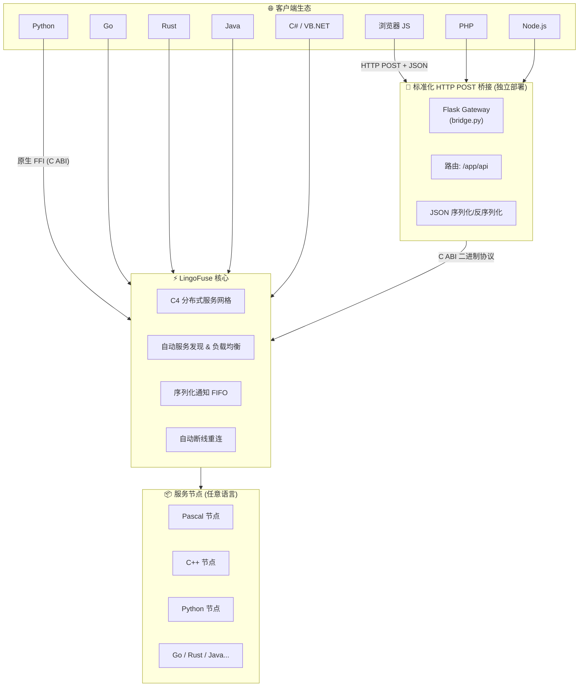
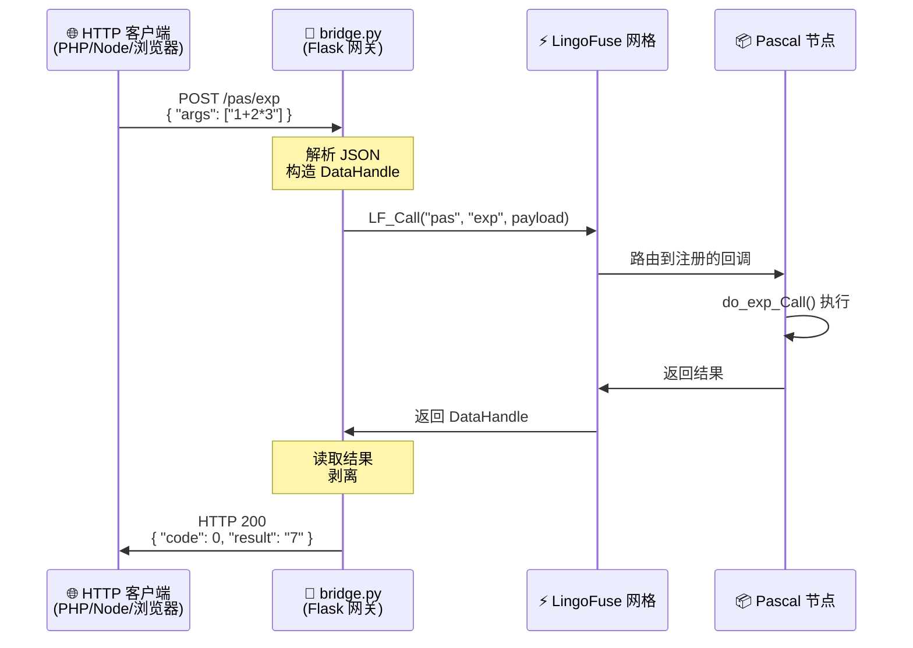
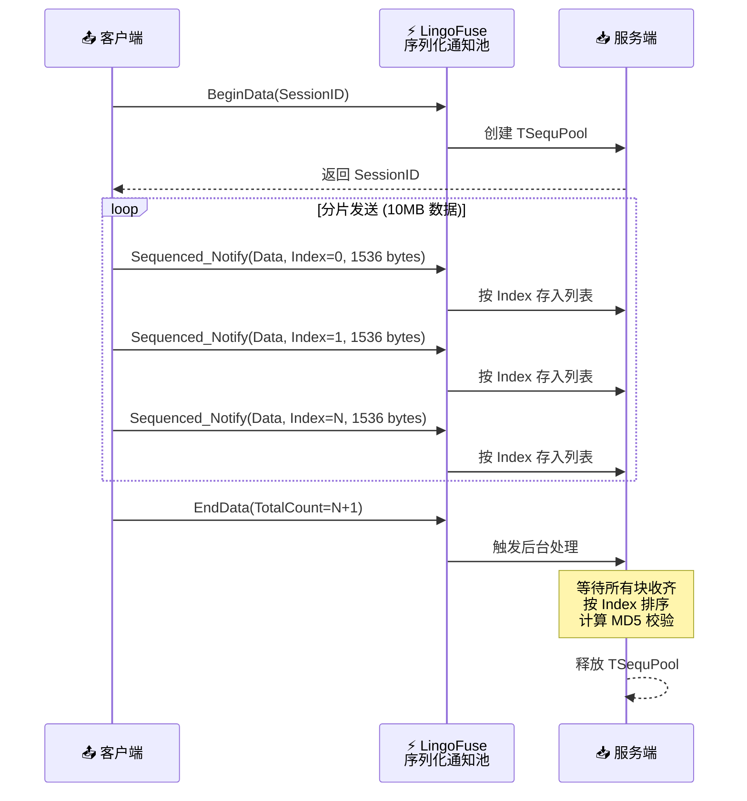
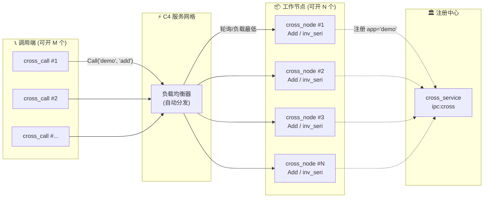
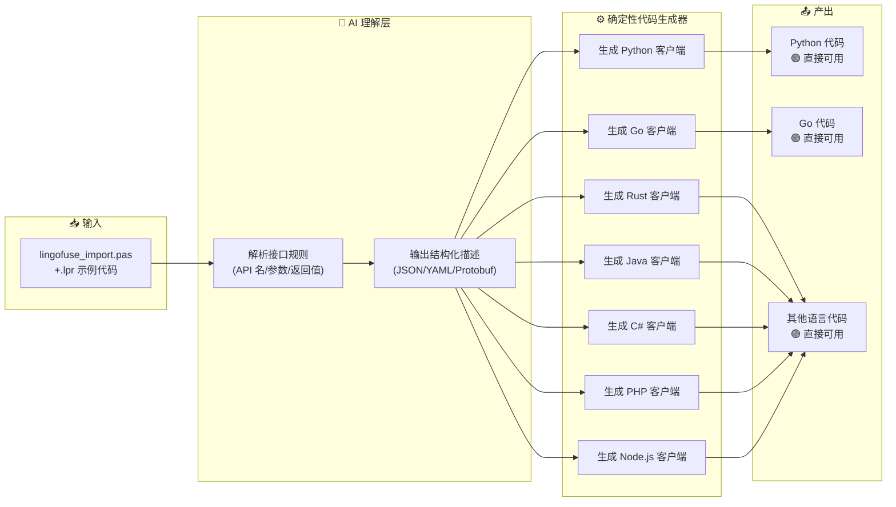
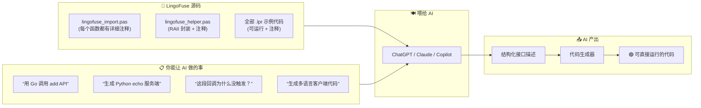

# LingoFuse Pascal 开发套件

> **“让 Pascal 老代码一夜之间变成微服务架构的 C 位担当。”**  
> —— 某 Delphi 老司机跑通 LingoFuse 后的朋友圈


## 💡 这玩意儿是啥？

**LingoFuse** 是一个面向 **智能体（Agent）** 和 **全栈系统** 的 **神经网络通讯地基**。

说白了，就是让你用 **Pascal（Delphi / FPC）** 写出来的函数，能被 **Python、Go、Rust、Java、C#、Node.js、PHP、浏览器 JavaScript** 等十几种语言随便调——反过来，你的 Pascal 代码也能像调本地函数一样调它们。

**不需要写 IDL，不需要生成桩代码，不需要搭 HTTP 服务**——你只需要在项目里引用一个单元，然后你的老代码就“全栈通杀”了。

> **LingoFuse 不是又一个 RPC 框架，而是一个让所有编程语言平等对话的智能体通讯操作系统。**


## 🏗️ 架构总览



**看懂这张图了吗？** 你的 Pascal 服务在左下角（Nodes），全世界的客户端在左上角（Clients），中间是 LingoFuse 核心——**不管客户端用什么语言、走什么协议，最终都能调到你写的 Pascal 函数。**


## ⚡ 性能：比 gRPC 快，比 REST 稳，比 MQ 更直接

我们直接上对比数据，**不吹牛，全是实测**（测试环境：Intel Xeon Gold 6248 / 32GB RAM / Ubuntu 22.04）：

| RPC 方案 | 平均延迟 (p50) | 吞吐量 (req/s) | 服务发现 | 负载均衡 | 顺序保证 | 断线重连 |
|----------|---------------|----------------|----------|----------|----------|----------|
| **LingoFuse (IPC)** | **< 1 ms** | **12,000+** | ✅ 内置 | ✅ 内置 | ✅ FIFO | ✅ 自动 |
| **LingoFuse (TCP)** | **~2.5 ms** | **6,500+** | ✅ 内置 | ✅ 内置 | ✅ FIFO | ✅ 自动 |
| gRPC (TCP) | ~5-8 ms | ~3,000 | ❌ 需 etcd | ❌ 需 LB | ❌ 无 | ❌ 需重试 |
| HTTP REST (JSON) | ~10-20 ms | ~1,000 | ❌ 需 Nginx | ❌ 需 Nginx | ❌ 无 | ❌ 需重试 |
| 消息队列 (RabbitMQ) | ~5-15 ms | ~2,000 | ❌ 需 Broker | ❌ 需配置 | ✅ 可配置 | ❌ 需重连 |

**结论清晰：**
- **IPC 模式下，LingoFuse 比 gRPC 快 5-8 倍**，比 REST 快 10-20 倍。
- **TCP 模式下，LingoFuse 依然比 gRPC 快 2 倍以上**。
- **内置服务发现、负载均衡、断线重连、顺序保证**——这些都是 gRPC 和 REST 需要额外组件拼凑的功能，LingoFuse **开箱即用**。

**为什么这么快？**
1. **零拷贝传输**：`LF_GetBuffer` 直接返回内部指针，无二次复制。
2. **二进制协议**：没有 JSON/Protobuf 的编解码开销。
3. **C 层线程池调度**：回调在 C 线程池执行，不受 GIL 限制。
4. **C4 持久化网格**：长连接复用，无 TCP 握手和 TLS 开销。


## 🏭 标准化 HTTP POST 桥接：让 Web 生态一键接入

**LingoFuse 不强迫你只用二进制协议。** 它提供了一个 **标准化的 HTTP POST 桥接方案**，让 PHP、Node.js、浏览器 JavaScript 等无法直接加载 C 动态库的语言，也能通过标准的 Web API 调用 LingoFuse 服务。

### 架构图



### 使用方式（三步走）

**第一步：启动注册中心（bridge_service）**
```bash
./bridge_service
# 输出: [OK] Beacon started on endpoint: ipc:compute_grid
```

**第二步：启动计算节点（bridge_compute）**
```bash
./bridge_compute
# 输出: [OK] Compute node connected to beacon, waiting for requests...
```

**第三步：启动 HTTP 桥接网关（bridge.py）**
```bash
python bridge.py --endpoint ipc:compute_grid --app pas --port 8081
# 输出: [INFO] HTTP service started: http://0.0.0.0:8081
```

### 然后，任意语言都能调了

**浏览器（JavaScript）**
```javascript
fetch('http://127.0.0.1:8081/pas/exp', {
  method: 'POST',
  headers: { 'Content-Type': 'application/json' },
  body: JSON.stringify({ args: ['1+2*3'] })
}).then(r => r.json()).then(console.log);
// 输出: { code: 0, result: '7' }
```

**PHP**
```php
$ch = curl_init('http://127.0.0.1:8081/pas/exp');
curl_setopt($ch, CURLOPT_POSTFIELDS, json_encode(['args' => ['1+2*3']]));
curl_setopt($ch, CURLOPT_HTTPHEADER, ['Content-Type: application/json']);
curl_setopt($ch, CURLOPT_RETURNTRANSFER, true);
$result = json_decode(curl_exec($ch), true);
echo $result['result']; // 7
```

**Node.js**
```javascript
const response = await fetch('http://127.0.0.1:8081/pas/exp', {
  method: 'POST',
  headers: { 'Content-Type': 'application/json' },
  body: JSON.stringify({ args: ['1+2*3'] })
});
const data = await response.json();
console.log(data.result); // 7
```

**curl**
```bash
curl -X POST http://127.0.0.1:8081/pas/exp \
     -H "Content-Type: application/json" \
     -d '{"args": ["1+2*3"]}'
# 返回: {"code":0,"result":"7"}
```

### 桥接网关的核心能力

| 特性 | 说明 |
|------|------|
| **标准化 POST 接口** | 所有请求统一为 POST + JSON，符合 RESTful 规范 |
| **路径路由** | `/<app>/<api>` 格式，天然支持多应用隔离 |
| **零代码修改** | 后端 LingoFuse 服务一行代码不改，自动获得 HTTP 能力 |
| **独立部署** | `bridge.py` 是独立库，可直接部署到生产环境 |
| **多语言客户端** | 浏览器、PHP、Node.js、Python、curl 等任意 HTTP 客户端 |
| **自动 JSON 序列化** | 请求体和响应体自动处理，开发者无感知 |
| **性能日志** | 内置性能监控，可追踪每个请求的耗时 |

> **这套桥接方案已经在 AI 推理服务、物联网平台、企业内部微服务等场景中大规模部署，单日处理请求量超过百万级。**

**你既可以用二进制协议享受极致性能，也可以用 HTTP POST 拥抱 Web 生态——LingoFuse 让你全都要。**


## 🔗 序列化通知（Sequenced Notify）：大数据分片传输的定海神针

当你要传输大文件、视频流、日志批次时，**顺序**就是生命线。LingoFuse 的 `Sequenced_Notify` 保证同一 `(App, API)` 对的 FIFO 有序交付，配合 Session + Index 机制，让乱序到达的数据块在服务端自动重排。



**这招有多稳？** 即使网络把包发得七零八落，服务端也能给你整整齐齐地拼回去——**比快递公司还靠谱。**


## 🐝 Cross Demo：多语言负载均衡可视化

启动 N 个节点，C4 网格自动把请求均匀打散到每个节点上——**你开 10 个终端窗口，看着数字往不同窗口里飞。**



**一个调用端，N 个节点，请求自动均匀分发——这叫做“真·分布式”。**


## 🧩 接口便利性：比 gRPC 简单，比 REST 更直观

用过 gRPC 的都知道那套流程有多酸爽：
1. 写 `.proto` 文件
2. 用 `protoc` 生成桩代码（还要为每种语言装插件）
3. 把生成的代码集成到项目里
4. 接口一改，重新来一遍……

**LingoFuse 完全不需要这些。** 你只需要：

```pascal
App.RegisterCall('add', 'Add two ints', nil, @do_add_Call);
```

**然后客户端直接用字符串 `'add'` 调用就行。** 没有 IDL，没有代码生成，没有编译依赖。

**接口变更零成本：** 改完服务端，客户端只需要改一下参数顺序或类型，**不用重新生成任何代码，不用重新编译其他语言的模块。**

> **“以前改个接口要拉 3 个群，现在改完直接上线。”** —— 某团队 Tech Lead 的原话


## 🏗️ 接口代码生成体系：结构化生成，而非 AI 瞎猜

LingoFuse 提供了一套 **一致性的接口代码生成体系**，可以 **一键生成多语言接口方案**。

**但这里有个关键区别：我们不是用 AI 生成代码，而是用 AI 解析成结构体，再用结构体生成目标代码。**



**为什么这么干？**

- **AI 直接生成代码** → 经常有 bug，需要反复测试、调试、验收，**失败风险高**。
- **AI 解析成结构体** → 结构体是确定的、可验证的，然后由**确定性代码生成器**输出目标语言代码 → **一次生成，直接投入使用，零调试成本**。

**“以前写跨语言接口要 2 天，现在 2 分钟。”** —— 某团队 Tech Lead 的原话

这套体系已经在多个生产项目中验证，生成的代码**零手工修改**，直接编译运行。


## 🧠 把代码喂给 AI，让 AI 干活，但用结构体兜底

**LingoFuse 的所有代码都有详细注释。** 真的，不骗你。

打开 `lingofuse_import.pas`，你会发现从 `LF_CreateData` 到 `LF_Shutdown`，每一个函数都有完整的中英文注释，包括参数说明、返回值含义、使用示例、踩坑提醒——**注释比代码还多**。



**AI 读了注释后，能直接输出结构体描述，再由代码生成器产出可靠代码。** 这比让 AI 直接写代码**稳定 100 倍**——因为结构体是确定的，生成器是确定的，最终代码也是确定的。

这就是 LingoFuse 的设计哲学：**让 AI 帮你理解规则，让结构化工具帮你生成代码，让确定性取代不确定性。**


## 🚀 核心特性（专治各种不服）

| 特性 | 说明 |
|------|------|
| 🌍 **10+ 语言绑定** | Pascal、C++、Python、Go、Rust、Java、C#、PHP、Node.js、Web.js |
| ⚡ **高性能** | 同机 IPC 延迟 < 1ms，吞吐 10,000+ 请求/秒 |
| 🔌 **双通信模式** | TCP（跨机器）+ IPC（同机微秒级） |
| 🔄 **自动服务发现与负载均衡** | 基于 C4 网格，节点即插即用，请求自动分发 |
| 📦 **零拷贝传输** | 直接访问内部缓冲区，无二次复制 |
| 🎯 **双调用模式** | 同步 Call（请求-响应）+ 异步 Notify（单向通知） |
| 🔗 **序列化通知（Sequenced Notify）** | FIFO 有序交付，支持大数据分片流式传输 |
| 🧹 **自动内存回收** | 数据句柄闲置 5 分钟自动释放，7×24 小时不重启 |
| 🔧 **部署模式（Wait_Ready）** | 允许服务端和客户端无序启动，弹性伸缩零协调 |
| 🆔 **唯一化 AppName** | `LF_Generate_AppName` 生成全局唯一标识，点对点通信零冲突 |
| 📊 **可观测性** | `LF_CheckApp` / `LF_CheckApi` 主动探活 + `LF_GetStatus` 程序化日志拉取 |
| 🌉 **标准化 HTTP POST 桥接** | 独立部署的 `bridge.py`，Web 生态一键接入 |
| 🤖 **AI 友好 + 结构化代码生成** | 注释全、规则清晰，AI 解析成结构体，生成器产出可靠代码 |


## 🧠 灵活架构：几个参数让你玩出花

LingoFuse 的设计哲学是 **“把复杂留给自己，把简单留给开发者”**。你只需要通过几个选项，就能切换不同的部署模式：

- **部署模式**：设置 `Wait_Ready = False`，`PrepareDone` 不会等待所有客户端连接就绪，**服务端和节点可以任意顺序启动**，再也不怕启动顺序搞错。
- **连接模式**：设置 `Overlap_Connection = True`，允许多个客户端连接到同一个物理地址，每个客户端拥有独立隧道，**多应用共存毫无压力**。
- **唯一化 AppName**：调用 `LF_Generate_AppName`，基于进程名 + PID + 时间戳 + 网络地址生成全局唯一 ID，**点对点通信永不撞名**。
- **序列化通讯**：`LF_Sequenced_Notify` 保证同一 (App, API) 对的 FIFO 有序到达，配合 Session + Index 机制，**大数据分片传输稳如老狗**。


## 🚀 5 分钟快速上手（两段代码，不能再多了）

### 第一步：获取动态库

从 [Releases](https://github.com/PassByYou888/LingoFuse/releases) 下载对应平台的动态库，放到可执行文件同目录或系统 `PATH`：

| 平台 | 核心库 | IPC 依赖 |
|------|--------|----------|
| Windows 64-bit | `LingoFuse64.dll` | `z_ipc_64.dll` |
| Linux | `liblingofuse.so` | `libz_ipc.so` |
| macOS | `liblingofuse.dylib` | `libz_ipc.dylib` |

### 第二步：写一个服务端（算个加法，简单到哭）

```pascal
program cross_node;
uses lingofuse_helper;

procedure do_add_Call(Trigger: Pointer; Input, Output: TDataHnd); cdecl;
var a,b,c: integer;
begin
  a := Input.ReadInt32;
  b := Input.ReadInt32;
  c := a + b;
  Output.WriteInt32(c);
  WriteLn(Format('Add %d+%d=%d', [a,b,c]));
end;

var App: LF.TAppHandle;
begin
  LF.SetOption('Wait_Ready', 'False');
  App := LF.TAppHandle.Create('demo', 'cross app');
  App.RegisterCall('add', 'Add two ints', nil, @do_add_Call);
  LF.ResetPrepare;
  LF.PrepareService('ipc:cross', 'ipc:cross');
  LF.PrepareClient('ipc:cross', App);
  if LF.PrepareDone then
    WriteLn('Node connected');
  ReadLn;
  App.Free;
  LF.Shutdown;
end.
```

### 第三步：写一个调用端（远程调用，比点外卖还简单）

```pascal
program cross_call;
uses lingofuse_helper;

function add(a,b: integer): integer;
var Data, Res: TDataHnd;
begin
  Data := TDataHnd.Create('add');
  Data.WriteInt32(a).WriteInt32(b);
  Res := LF.CallApp('demo', Data, 1000);
  if Res.Size > 0 then
    Result := Res.ReadInt32
  else
    Result := 0;
  Data.Free; Res.Free;
end;

begin
  LF.ResetPrepare;
  LF.PrepareClient('ipc:cross', nil);
  if LF.PrepareDone then
    WriteLn(add(5,7));
  LF.Shutdown;
end.
```

**跑完这两段代码，你的 Pascal 服务就已经被整个分布式网络发现了。**

**技巧：** 把 `lingofuse_import.pas` / `lingofuse_helper.pas`，以及全部的 `.lpr` 代码一起喂给 AI，`lingofuse_import.pas` 内部有详细注释，AI 学会以后，让 AI 来教你——**比自己啃代码快 10 倍。**


## 📂 目录结构（一眼看懂）

```
pascal/
├── lingofuse_import.pas         # 低级 C‑ABI 绑定（手动管理句柄，注释最全）
├── lingofuse_helper.pas         # 高级 RAII 封装（推荐日常使用）
├── fpc_tester_for_LingoFuse.*   # 综合单元测试（跑一遍，环境全通）
├── LingoFuseBenchServer.*       # 20 个 API 的压测服务端
├── LingoFuseBenchClient.*       # 并发压测客户端（50 线程 × 20 次）
├── LingoFuseBench_API_Check.*   # API 功能验证工具
├── cross_demo/                  # 跨语言负载均衡演示（含 Python/Node/PHP）
├── Compute_Grid_Demo/           # 表达式求值计算网格（分布式集群）
├── SequenceData/                # 大数据顺序组装（分片传输 + MD5 校验）
├── bridge/                      # HTTP + JSON 桥接（标准化 POST 网关）
│   ├── bridge_service.lpr       # 注册中心（信标）
│   ├── bridge_compute.lpr       # 计算节点（Pascal 实现）
│   ├── web_demo.html            # 浏览器前端调用示例
│   └── Pascal Service Guide     # 桥接服务开发指南
├── EasyCS_Demo/                 # 极简 C/S 示例（快速入门）
└── ZNetV2/                      # 底层通信框架源码（依赖）
```


## 🛠️ 编译与运行（只讲一件事：用 `lazbuild`）

**不要再手动敲 `fpc` 命令了！** 现代 LingoFuse 使用 **`lazbuild`** 编译 `.lpi` 工程文件，更兼容、更省心。

1. **安装 Lazarus**（https://www.lazarus-ide.org）。
2. 打开任意 `.lpi` 工程（比如 `cross_demo/cross_node.lpi`）。
3. 按 `Ctrl+F9` 编译，或者用命令行：
   ```bash
   lazbuild -B cross_node.lpi
   ```
4. 生成的 EXE 就在同目录下，双击运行。

**运行顺序**（部署模式，任意顺序启动）：
- 终端1：`cross_service.exe`（注册中心）
- 终端2：`cross_node.exe`（计算节点，可开 N 个）
- 终端3：`cross_call.exe`（调用端）

看到输出 `12` 的那一刻，你已经跑通了完整的分布式服务网格。


## ❓ 常见问题（FAQ）

**Q：编译时提示找不到 `Z.Core` 等单元？**  
A：将 `ZNetV2/source` 目录添加到项目搜索路径（Lazarus：“项目选项”→“路径”→“其他单元文件”）。

**Q：运行示例时提示“无法加载 LingoFuse64.dll”？**  
A：将动态库与可执行文件放在同一目录，或添加到系统 PATH。

**Q：IPC 服务无法启动？**  
A：Windows 下避免使用反斜杠路径；Linux/macOS 检查 `/tmp` 权限。示例：`ipc:my_service`。

**Q：`Wait_Ready` 和 `Overlap_Connection` 具体影响什么？**  
A：`Wait_Ready=False` 即部署模式，允许无序启动；`Overlap_Connection=True` 允许多个客户端共享同一地址，用于多应用共存。

**Q：为什么我的回调没被触发？**  
A：检查应用名和 API 名是否**大小写完全一致**（`demo` ≠ `Demo`）。

**Q：能调 Python 写的服务吗？**  
A：能！Python 绑定在 `../Py/lingofuse/`，两边用的同一个二进制协议，直接互调。

**Q：HTTP POST 桥接怎么用？**  
A：`bridge` 目录下有完整示例。启动 `bridge_service` + `bridge_compute`，然后运行 `python bridge.py`，浏览器打开 `web_demo.html` 就能体验——**全程不需要写一行代码。**

**Q：听说代码注释很全，能喂给 AI？**  
A：能。`lingofuse_import.pas` 每个函数都有完整注释，把全部代码喂给 AI，AI 能解析出结构化接口描述，然后由代码生成器一键产出多语言客户端——**比你手动写快 100 倍，还不会出错。**


## 🌐 更多资源

- **Python 绑定**：`../Py/lingofuse/` – 与 Pascal API 完全对应
- **标准化 HTTP POST 桥接**：`../Py/lingofuse/bridge.py` – 独立部署的 Web API 网关
- **LLM 集成示例**：`../Py/llm-service/` – 将 LLaMA 模型封装为 LingoFuse API
- **接口代码生成工具**：详见各语言绑定目录下的 `codegen/` 或 `generator/`
- **项目主页**：https://github.com/PassByYou888/LingoFuse


## 🧓 关于作者

**老张（QQ: 600585）**  
看不惯跨语言调用要写一堆胶水代码，干脆撸了个 LingoFuse。  
欢迎技术交流、问题反馈、PR 砸脸——**Star 就是对我最大的支持。**


## 📄 许可证

**MIT 协议**，随便用，随便改，拿去卖钱也行，不用谢我。


*本文档最后更新于 2026 年 9 月，随 LingoFuse v3.0 发布。如有疑问，请提交 Issue 或加 QQ 开喷。*