# LingoFuse R 绑定

> **让 R 与其他 16 种语言直接对话。**
> 不写 IDL，不生成桩代码，不搭 HTTP 服务。

---

## 目录

- [0. 概览](#0-概览)
- [1. 环境要求](#1-环境要求)
- [2. 依赖要求](#2-依赖要求)
- [3. 编译器要求](#3-编译器要求)
- [4. 目录结构](#4-目录结构)
- [5. 架构与原理](#5-架构与原理)
  - [5.1 四层架构](#51-四层架构)
  - [5.2 C 与 C++ 分层的必要性](#52-c-与-c-分层的必要性)
  - [5.3 回调机制：Job 队列](#53-回调机制job-队列)
  - [5.4 Job 生命周期](#54-job-生命周期)
  - [5.5 单线程重入限制](#55-单线程重入限制)
- [6. 构建与安装](#6-构建与安装)
  - [6.1 从零构建](#61-从零构建)
  - [6.2 脚本一览](#62-脚本一览)
  - [6.3 环境诊断](#63-环境诊断)
- [7. 使用 R 接口](#7-使用-r-接口)
  - [7.1 最小示例：单进程自测](#71-最小示例单进程自测)
  - [7.2 两进程 demo](#72-两进程-demo)
  - [7.3 二进制载荷](#73-二进制载荷)
  - [7.4 数据句柄](#74-数据句柄)
  - [7.5 卸载](#75-卸载)
- [8. 测试体系](#8-测试体系)
  - [8.1 五步测试链](#81-五步测试链)
  - [8.2 场景与测试对照](#82-场景与测试对照)
  - [8.3 R 测试脚本](#83-r-测试脚本)
  - [8.4 C++ 测试二进制](#84-c-测试二进制)
  - [8.5 运行测试](#85-运行测试)
- [9. R CMD check](#9-r-cmd-check)
- [10. 常见错误](#10-常见错误)
- [11. 已知限制](#11-已知限制)

---

## 0. 概览

本仓库是 **LingoFuse 的 R 语言第一方绑定**。它让 R 既能**调用**其他语言写的 LingoFuse 服务，也能**作为服务端**被其他语言调用。

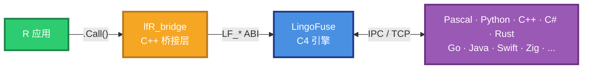

**三条硬性承诺**：

1. **字节级互通** — 与 Pascal / Python / C++ / C# 等绑定产生**完全一致**的线格式。
2. **RAII 语义** — 句柄通过 R `externalptr` 管理，GC 触发 finalizer 时自动释放。
3. **零拷贝** — R `raw` 向量直接映射到 C++ `std::string`，不经过 JSON 序列化。

---

## 1. 环境要求

| 项目 | 最低版本 | 说明 |
|------|:--------:|------|
| **R** | 4.0+ | 依赖 `R_RegisterCFinalizerEx` 和 `R_MakeExternalPtr` 的现代语义。已在 **R 4.6.1 (ucrt) x64** 上完整验证。 |
| **操作系统** | Windows 10+ / Linux (待验证) / macOS (待验证) | 当前**只在 Windows x64 上完整验证过**。Linux / macOS 走同一份代码路径，但未实测。 |
| **磁盘空间** | ~10 MB | 桥接 DLL + R 包 + 测试二进制 |
| **LingoFuse 运行时** | 3.10+ | 单独分发，不包含在 R 包内 |

**LingoFuse 运行时文件**（按平台）：

| 平台 | 运行时文件 |
|------|-----------|
| Windows 64 | `LingoFuse64.dll`, `z_ipc_64.dll`, `mimalloc64.dll` |
| Windows 32 | `LingoFuse32.dll`, `z_ipc_32.dll`, `mimalloc32.dll` |
| Linux | `liblingofuse.so`, `libz_ipc.so`, `libmimalloc.so` |
| macOS | `liblingofuse.dylib`, `libz_ipc.dylib`, `libmimalloc.dylib` |

运行时目录路径通过 `LINGOFUSE_RUNTIME` 环境变量或 `lf_load(dir)` 显式提供。**R 包本身不携带运行时**——这是设计选择，避免把平台相关的二进制打进包里。

---

## 2. 依赖要求

### R 侧

| 依赖 | 用途 | 是否必需 |
|------|------|:--------:|
| R base | 全部导出 API 只用 base | ✅ |
| `jsonlite` | **仅用于用户代码**（`demo/*.R` 和测试脚本），包本身不 import | ❌ |
| `roxygen2` | 生成 `NAMESPACE` 和 `man/` | 🛠 开发时 |
| `Rtools45` | Windows 上的 C/C++ 编译工具链 | 🛠 构建时 |

**R 包本身没有任何运行时依赖**——`DESCRIPTION` 的 `Imports` 为空，`Suggests` 也为空（已刻意移除 `jsonlite`，避免 `R CMD check` 联网校验依赖图）。

### C/C++ 侧

桥接层用标准 C/C++ 写成，**不依赖任何第三方 C++ 库**（无 Boost、无 protobuf、无 nlohmann）。只依赖：

| 依赖 | 用途 |
|------|------|
| C++17 STL | `std::string` / `std::atomic` / `std::mutex` / `std::condition_variable` / `std::unordered_map` |
| `<windows.h>` 或 `<dlfcn.h>` | 动态加载运行时 |
| LingoFuse 的 C ABI | `LF_*` 导出函数 |

**没有依赖 LingoFuse 官方 C++ 头文件**（`LingoFuse.hpp` / `lf_io.hpp` / `nlohmann/json`），因为那些头文件依赖 nlohmann/json 且强制 UTF-8 契约，与 R 的 `SEXP` 边界不兼容。桥接层通过手写的 ABI 声明直接调用 `LF_*`。

---

## 3. 编译器要求

### Windows 上必需：Rtools

**R 在 Windows 上用什么编译器由 `R CMD config CC/CXX` 决定**，与 PATH 上的 gcc 无关。典型配置：

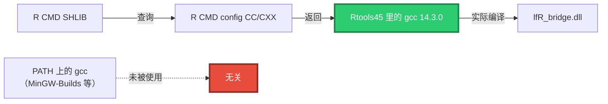

**验证环境**：

```powershell
.\check_env.ps1
```

会打印 `R CMD config CC/CXX` 报告的路径，并检查 Rtools 是否完整。

### 已知约束

| 项 | 值 |
|---|---|
| R 4.6.x 需要的 Rtools | **Rtools45** |
| R 4.5.x 需要的 Rtools | Rtools44 |
| 使用的 gcc | **14.3.0**（由 Rtools45 提供） |
| C++ 标准 | **C++17**（由 `src/Makevars` 的 `CXX_STD = CXX17` 强制） |
| C 标准 | C11 + GNU 扩展（R 默认） |

**不要用 MSVC**。R 4.6 的 `R_ext/Complex.h` 使用了 C11 匿名 `union`，MSVC 的 C 前端拒绝编译。改用 `R CMD SHLIB` 走 Rtools 是唯一可行的路径。

### Linux / macOS

理论上任何支持 C++17 的 gcc 9+ / clang 10+ 都能编译。**未实测**。

---

## 4. 目录结构

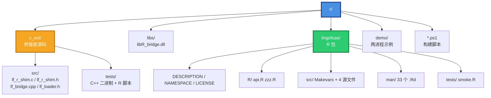

**关键事实**：

- **`c_ext/src/` 是唯一的源码真相**。`lingofuse/src/` 里的同名文件是 `build_package.ps1` 每次构建时拷贝过去的。
- **`lingofuse/` 是标准 R 包布局**，可以直接 `R CMD INSTALL`。
- **`libs/lfR_bridge.dll` 是开发用的独立 DLL**，供 `c_ext/tests/*.R` 脚本 `dyn.load()` 使用。它与 R 包装的 DLL 是**同一份代码**，只是初始化函数名不同（`R_init_lfR_bridge` vs `R_init_lingofuse`）。

---

## 5. 架构与原理

### 5.1 四层架构

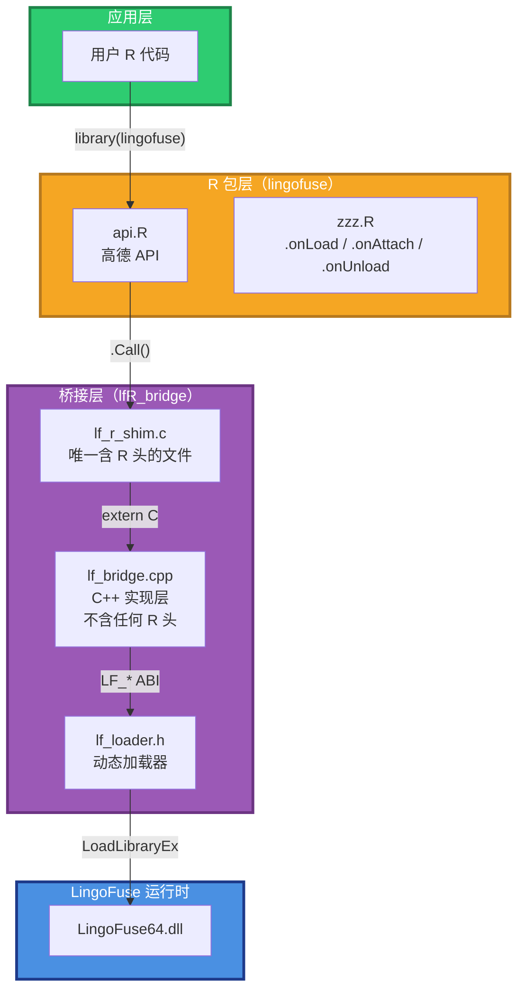

**每层的职责**：

| 层 | 文件 | 职责 | 约束 |
|----|------|------|------|
| L1 | 用户 R | 调用 `lf_*` 函数 | 无 |
| L2 | `api.R` | 参数校验、错误类型转换、handler 表管理 | 不直接 `.Call` 复杂类型 |
| L3a | `lf_r_shim.c` | `.Call` 入口、`SEXP` ↔ C 类型的转换 | **只有此文件可以 `#include <R.h>`** |
| L3b | `lf_bridge.cpp` | Job 队列、状态机、回调 trampoline | **绝不 `#include <R.h>`** |
| L4 | `LingoFuse64.dll` | C4 网络、序列化、负载均衡 | 由 `lf_loader.h` 在运行时加载 |

### 5.2 C 与 C++ 分层的必要性

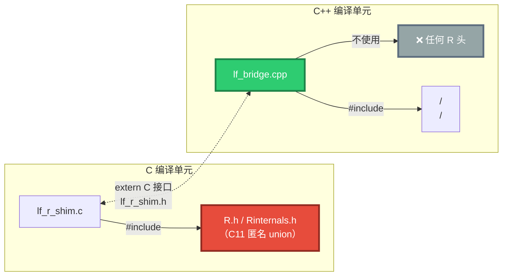

**为什么要分层**：

1. R 4.6 的 `R.h` 依赖 C11 匿名 `union` / 匿名 `enum`，这是 **MSVC 的 C 前端无法编译的**。
2. 但 **C++17 编译器（gcc/g++）支持 C11 匿名 union 作为扩展**。
3. 即使如此，让 C++ 编译单元包含 R 头会引入 `_Complex` / `SEXP` 等类型，与 C++ 标准库冲突。
4. **所以：C 文件管 R 头，C++ 文件管业务逻辑，二者通过纯 C89 的 `lf_r_shim.h` 通信**。

`lf_r_shim.h` 里**没有任何 R 类型**——只有 `void*` / `int64_t` / `const char*`。

### 5.3 回调机制：Job 队列

**核心约束**：**C4 worker 线程不能碰 R 解释器**。R 是单线程的——所有 R 代码必须在同一个线程执行。

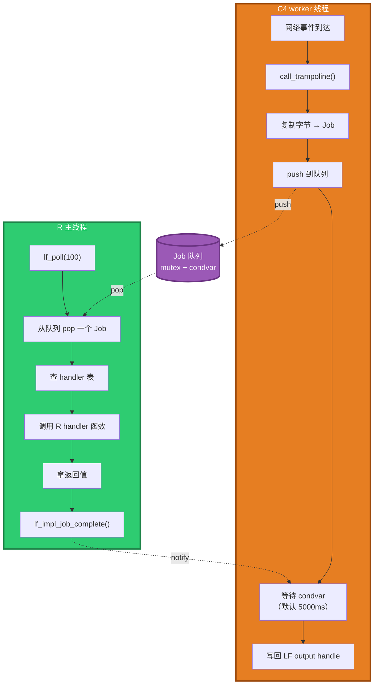

**契约**：

| 规则 | 后果 |
|------|------|
| worker 线程**绝不**调用任何 R API | 违反则**进程崩溃**（R 内部断言） |
| worker 线程只复制字节 + 排队 + 阻塞 | — |
| R 主线程只从队列取 Job + 调用 handler | — |
| R handler **绝不**调用 `lf_call` / `lf_notify` | 违反则**死锁**（见 §5.5） |
| handler 内**不得**阻塞超过 `timeout_ms` | 否则 worker 超时返回 `{"error":"R handler timeout"}` |

### 5.4 Job 生命周期

**这是整个系统最容易出 UAF 的地方**。采用**原子引用计数**方案：

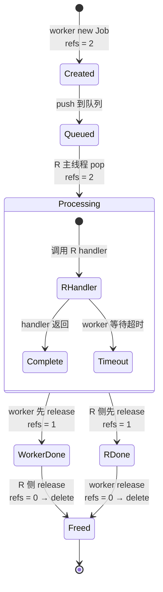

**关键不变量**：

- Job 初始 `refs = 2`：一个引用归 worker，一个归 R 侧。
- **谁最后放弃引用，谁 `delete`**。
- 无论 worker 还是 R 侧先释放，另一个总能正确释放，**不会双重释放**，也**不会泄漏**。
- `mtx` 保护 `done` / `output` 字段，`refs` 是 `std::atomic<int>`。

**超时场景**：
1. worker 等待超过 `timeout_ms` → 设置 `done = true`，**不删除 Job**，直接返回
2. worker 侧释放它的引用
3. 稍后 R handler 完成 → `lf_impl_job_complete` 看到 `done == true` → **不再写 output**，直接释放 R 侧引用 → Job 销毁

**正常场景**：
1. R handler 完成 → `lf_impl_job_complete` → 设置 output + `done = true` + `notify` + **释放 R 侧引用**
2. worker 被唤醒 → 读 output → 释放 worker 侧引用 → Job 销毁

### 5.5 单线程重入限制

**`LF_Call` 不可重入**。这在 Pascal 指南里编号 **LF-CB-002**。

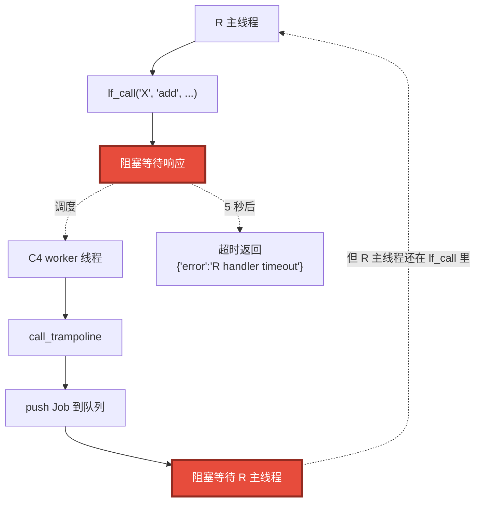

**解决方案**：`lf_local_call()` / `lf_local_notify()` 绕过 C4 网络，**直接从 R 侧的 handler 表派发**。

| 场景 | 用哪个 | 是否需要 pump loop |
|------|--------|:------------------:|
| 单进程自测（自我调用） | `lf_local_call` | ❌ 不需要 |
| 跨进程/跨机器调用 | `lf_call` | ✅ 需要 |

---

## 6. 构建与安装

### 6.1 从零构建

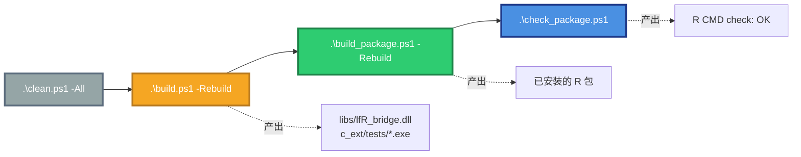

**命令**：

```powershell
cd D:\CoreLibrary\LingoFuse\r

# 1. 清空所有构建产物
.\clean.ps1 -All

# 2. 编译 c_ext 层（桥接 DLL + C++ 测试二进制）
.\build.ps1 -Rebuild

# 3. 复制源码到 R 包 + R CMD INSTALL
.\build_package.ps1 -Rebuild

# 4. （可选）R CMD check
.\check_package.ps1 -Keep
```

**每一步的产物**：

| 步骤 | 产物 | 位置 |
|:----:|------|------|
| 2 | `lfR_bridge.dll` | `libs/` |
| 2 | `test_service.exe` / `echo_client.exe` / `cross_client.exe` | `c_ext/tests/` |
| 3 | 已安装的 R 包 | `C:\Program Files\R\R-4.6.1\library\lingofuse\` |
| 4 | `.tar.gz` + `.Rcheck` | `_check_YYYYMMDD_HHMMSS/` |

### 6.2 脚本一览

| 脚本 | 定位 | 何时用 |
|------|------|--------|
| `check_env.ps1` | 环境诊断 | 首次搭建 / 编译报错 |
| `build.ps1` | 编译 c_ext 桥接层 | 改了任何 C/C++ 代码 |
| `build_package.ps1` | 编译 + 装 R 包 | 改了任何 C/C++ 代码，且要重装 R 包 |
| `install_package.ps1` | 只装 R 包（不编译） | 从 `.tar.gz` 装，或源文件已就绪 |
| `uninstall_package.ps1` | 卸载 R 包 | 清理 |
| `clean.ps1` | 清理构建产物 | 从零重来 |
| `check_package.ps1` | `R CMD build` + `R CMD check` | 验证包质量 |

**`-Rebuild` 参数**：删除所有 `.o` / `.dll` / `.exe` 后重新编译。**改了 C 代码必须带 `-Rebuild`**，否则 make 可能漏掉重编译。

**`clean.ps1 -All`**：除了构建产物，还删除 `man/` / `NAMESPACE` / `lingofuse/src/` 里的拷贝源文件。**下次 `build_package.ps1` 会全部重新生成**。

### 6.3 环境诊断

**编译报错时，第一件事跑这个**：

```powershell
.\check_env.ps1
```

会检查：

- `R.exe` / `Rscript.exe` 是否在 PATH
- `R_HOME` 是否正常
- `R CMD config CC/CXX` 报告的编译器路径是否存在
- `R include` 目录和 `R.dll` 是否就位
- 是否有残留的 `.o` / `.obj` 文件

---

## 7. 使用 R 接口

### 7.1 最小示例：单进程自测

**单进程自测演示 R 函数被自己的 R 代码调用**——不经过网络，不需要第二个进程。

```r
Sys.setenv(LINGOFUSE_RUNTIME = "D:/CoreLibrary/LingoFuse/Binary")

library(lingofuse)
library(jsonlite)

# 1. 加载 runtime（也可通过 LINGOFUSE_RUNTIME 自动加载）
lf_load("D:/CoreLibrary/LingoFuse/Binary")

# 2. 创建 App
app <- lf_create_app("CalcSelf", "self-contained demo")

# 3. 注册一个 Call API
lf_register_call(app, "add", "Add two integers", function(input) {
    req <- fromJSON(input)
    toJSON(list(result = req$a + req$b), auto_unbox = TRUE)
})

# 4. 单进程本地调用——绕过 C4 网络，直接派发
res <- lf_local_call(app, "add", toJSON(list(a = 3L, b = 4L), auto_unbox = TRUE))
cat("response:", res, "\n")
# 输出：response: {"result":7}

# 5. 清理
lf_cleanup(app)
```

**关键**：这里**没有** `lf_prepare_service` / `lf_prepare_client` / `lf_prepare_done`。因为 `lf_local_call` 完全不经过 C4 网络，只在 R 内部派发。

### 7.2 两进程 demo

R 作为服务端，另一个 R 进程作为客户端——**这才走真正的 C4 网络**。

**服务端**（`demo/server.R`，T1 终端）：

```r
Sys.setenv(LINGOFUSE_RUNTIME = "D:/CoreLibrary/LingoFuse/Binary")
library(lingofuse)
library(jsonlite)

app <- lf_create_app("CalcR", "R calculator demo")

lf_register_call(app, "add", "add two integers", function(input) {
    req <- fromJSON(input)
    toJSON(list(result = req$a + req$b), auto_unbox = TRUE)
})

lf_prepare_service("ipc:r_calc", "ipc:r_calc")
lf_prepare_client("ipc:r_calc", app)
stopifnot(lf_prepare_done() == 1L)

cat("[server] online: CalcR @ ipc:r_calc\n")

# pump 循环：处理来自其他进程的请求
start <- Sys.time()
while (as.numeric(Sys.time() - start, units = "secs") < 60) {
    lf_poll(100)   # 100ms 超时
}
lf_cleanup(app)
```

**客户端**（`demo/client.R`，T2 终端）：

```r
Sys.setenv(LINGOFUSE_RUNTIME = "D:/CoreLibrary/LingoFuse/Binary")
library(lingofuse)
library(jsonlite)

# 纯消费者：没有 app 绑定
lf_prepare_client("ipc:r_calc", NULL)
stopifnot(lf_prepare_done() == 1L)

# 等 app 上线（广播延迟 ~3s）
for (i in 1:50) {
    if (lf_check_api("CalcR", "add")) break
    Sys.sleep(0.2)
}

res <- lf_call("CalcR", "add",
               toJSON(list(a = 3L, b = 4L), auto_unbox = TRUE),
               timeout_ms = 5000)
cat("response:", res, "\n")
# 输出：response: {"result":7}

lf_cleanup(NULL)
```

**运行**：

```powershell
# T1
Rscript demo\server.R D:\CoreLibrary\LingoFuse\Binary 60

# T2
Rscript demo\client.R D:\CoreLibrary\LingoFuse\Binary
```

### 7.3 二进制载荷

**默认是字符串模式**（UTF-8 + 末尾 NUL）。对于二进制协议（如 CrossDemo），需要 `bin = TRUE` 模式。

```r
# 服务端注册二进制 handler
lf_register_call(app, "echo_bin", "echo raw bytes", bin = TRUE,
    handler = function(req) {
        # req 是 raw 向量（无 NUL 剥离）
        req
    })

# 客户端调用
req <- as.raw(c(0x01, 0x02, 0x03, 0x04))
res <- lf_call_bin("TargetApp", "echo_bin", req, timeout_ms = 5000)
# res 是 raw 向量，长度 4，内容与 req 相同
```

**两种模式的关键差异**：

| 模式 | handler 收到 | handler 返回 | NUL 处理 |
|------|:-----------:|:-----------:|:--------:|
| 字符串（默认） | `character(1)` | `character(1)` | 剥离末尾 NUL |
| 二进制（`bin=TRUE`） | `raw` | `raw` | **不剥离** |

### 7.4 数据句柄

低层数据句柄用于手动构造请求/解析响应：

```r
hnd <- lf_data_create("add")
lf_data_write(hnd, charToRaw('{"a":3,"b":4}'))
lf_data_write(hnd, as.raw(0))   # NUL 终止符

# 使用（例如通过 .Call 直接调 C 层 lf_call）
# ...

lf_data_free(hnd)
```

**永久句柄**（`lf_data_create_permanent`）：永不被自动回收，**必须显式 `lf_data_free`**。

### 7.5 卸载

```powershell
Rscript -e "remove.packages('lingofuse')"
```

或：

```powershell
.\uninstall_package.ps1
```

**注意**：如果包在**当前 R 会话**里曾调用过 `lf_prepare_done`，`detach` 时会触发 `.onUnload`，打印：

```
lingofuse: LF was running. The bridge DLL is left loaded;
the OS will reclaim it at process exit.
```

这是**故意的**——`LF_Shutdown` 是异步的，C4 worker 线程可能还在 DLL 里跑。此时 `FreeLibrary` 会崩。**让 OS 在进程退出时回收**是唯一安全的做法。

---

## 8. 测试体系

### 8.1 五步测试链

整个测试体系沿**依赖深度**递进——从"能加载 DLL"到"能跨语言二进制互通"：

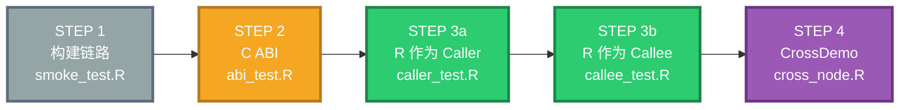

**递增的依赖深度**：

| 步骤 | 加载 runtime | 用 C4 网络 | 用二进制协议 | 跨进程 |
|:----:|:------------:|:---------:|:-----------:|:------:|
| 1 | ❌ | ❌ | ❌ | ❌ |
| 2 | ✅ | ❌ | ❌ | ❌ |
| 3a | ✅ | ✅ | ❌ | ✅ |
| 3b | ✅ | ✅ | ❌ | ✅ |
| 4 | ✅ | ✅ | ✅ | ✅ |

**出问题时定位**：从 STEP 1 开始逐级跑。哪一步失败，问题就出在哪一层。

### 8.2 场景与测试对照

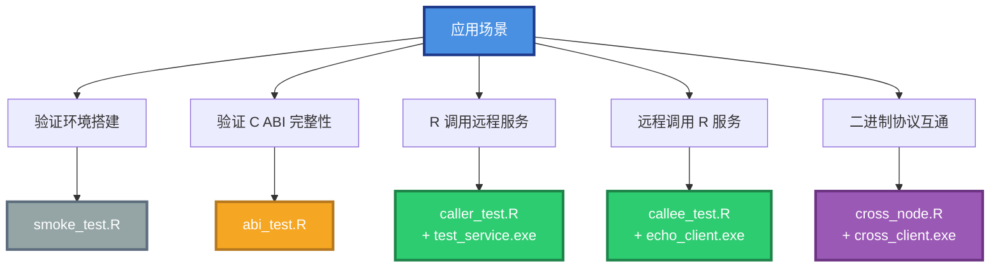

**每个场景对应现实中的什么**：

| 场景 | 现实中对应 | 测试 |
|------|-----------|------|
| **环境搭建** | 第一次装完包，验证编译链是否正常 | `smoke_test.R` |
| **C ABI 完整性** | 运行时升级后，验证 API 兼容 | `abi_test.R` |
| **R 调用远程服务** | R 分析脚本调 Python 训练服务、C++ 推理服务 | `caller_test.R` |
| **远程调用 R 服务** | Web 后端 / LLM Agent 调 R 数据分析函数 | `callee_test.R` |
| **二进制协议互通** | R 与 C++ 之间传输图像 / 特征向量 / Protobuf | `cross_node.R` + `cross_client.exe` |

### 8.3 R 测试脚本

#### `c_ext/tests/smoke_test.R` — STEP 1

**做什么**：验证 R 能 `dyn.load` 桥接 DLL，`.Call` 注册表可访问，参数往返正确。

**不需要 LingoFuse 运行时**。

```powershell
Rscript c_ext\tests\smoke_test.R
```

**期望**：`Passed : 9  Failed : 0`

#### `c_ext/tests/abi_test.R` — STEP 2

**做什么**：加载真实运行时，验证 `TDataHnd` / `TAppHnd` 创建、读写、位置、大小、use-after-free 错误路径。

**不需要 C4 网络**。

```powershell
Rscript c_ext\tests\abi_test.R D:\CoreLibrary\LingoFuse\Binary
```

**期望**：`Passed : 18  Failed : 0`

#### `c_ext/tests/caller_test.R` — STEP 3a

**做什么**：R 作为客户端，调用 C++ 服务（`test_service.exe`）的 `add` / `echo` / `notify`。

**需要两终端**：先启动服务端，再运行测试脚本。

```powershell
# T1
.\c_ext\tests\test_service.exe D:\CoreLibrary\LingoFuse\Binary

# T2
Rscript c_ext\tests\caller_test.R D:\CoreLibrary\LingoFuse\Binary
```

**期望**：`Passed : 12  Failed : 0`

#### `c_ext/tests/callee_test.R` — STEP 3b

**做什么**：R 作为服务端，被 C++ 客户端（`echo_client.exe`）调用。

**需要两终端**：先启动 R 服务端，再启动 C++ 客户端。

**用法**：`Rscript callee_test.R [runtime_dir] [wait_sec]`（`wait_sec` 默认 60 秒）

```powershell
# T1
Rscript c_ext\tests\callee_test.R D:\CoreLibrary\LingoFuse\Binary 60

# T2（5 秒内启动）
.\c_ext\tests\echo_client.exe D:\CoreLibrary\LingoFuse\Binary
```

**支持 Ctrl+C 提前退出**：pump loop 被打断后会打印已收到的请求列表并干净退出（退出码 0）。

#### `c_ext/tests/cross_node.R` — STEP 4

**做什么**：R 作为 CrossDemo 节点，暴露 `demo.add` 和 `demo.inv_seri` 两个**二进制协议** API。

**协议**：**raw little-endian bytes**，与 LingoFuse 官方 CrossDemo 完全兼容。

| API | 请求格式 | 响应格式 |
|-----|---------|---------|
| `demo.add` | `int32 a` + `int32 b` | `int32 a+b` |
| `demo.inv_seri` | `u8 + u16 + u32 + u64 + string(NUL) + float` | 逆序：`float + string + u64 + u32 + u16 + u8` |

**需要两终端**：

```powershell
# T1
Rscript c_ext\tests\cross_node.R D:\CoreLibrary\LingoFuse\Binary 60

# T2（5 秒内启动）
.\c_ext\tests\cross_client.exe D:\CoreLibrary\LingoFuse\Binary
```

**期望 T2 输出**：

```
>> demo.add(3, 4)
   << result = 7  (expected 7)
>> demo.inv_seri(...)
   << reversed: f=3.14 s="hello world" u64=0x3f u32=0x2f u16=0x10 u8=200
[OK] Done. Press Enter to exit...
```

#### `lingofuse/tests/smoke.R` — R 包内置测试

**做什么**：`R CMD check` 时自动运行。分两部分：

1. **纯 R 检查**（始终运行）：验证导出函数存在、参数校验生效。
2. **运行时检查**（仅当 `LINGOFUSE_RUNTIME` 设置时运行）：加载运行时、注册 handler、`lf_local_call` 往返、DataHandle 读写、重复注册失败、Notify 路径。

```powershell
# 无 runtime
Rscript lingofuse\tests\smoke.R

# 带 runtime
$env:LINGOFUSE_RUNTIME = "D:/CoreLibrary/LingoFuse/Binary"
Rscript lingofuse\tests\smoke.R
```

### 8.4 C++ 测试二进制

| 程序 | 角色 | 被谁使用 |
|------|------|---------|
| `test_service.exe` | 提供 `RTestService` App，注册 `echo` / `add` | `caller_test.R`（STEP 3a） |
| `echo_client.exe` | 连接到 `ipc:r_callee`，调 `RService` | `callee_test.R`（STEP 3b） |
| `cross_client.exe` | 连接到 `ipc:cross`，用二进制协议调 `demo` | `cross_node.R`（STEP 4） |

**它们都是 LingoFuse 官方风格的 C++ 客户端/服务**——不依赖桥接层，只依赖 `lf_loader.h`（动态加载器）。

**编译**：由 `build.ps1` 统一编译。

### 8.5 运行测试

**完整流程**（从零开始）：

```powershell
cd D:\CoreLibrary\LingoFuse\r

# 1. 全清 + 重建
.\clean.ps1 -All
.\build.ps1 -Rebuild

# 2. STEP 1（独立）
Rscript c_ext\tests\smoke_test.R

# 3. STEP 2（独立）
Rscript c_ext\tests\abi_test.R D:\CoreLibrary\LingoFuse\Binary

# 4. STEP 3a（两终端）
# T1:
.\c_ext\tests\test_service.exe D:\CoreLibrary\LingoFuse\Binary
# T2:
Rscript c_ext\tests\caller_test.R D:\CoreLibrary\LingoFuse\Binary

# 5. STEP 3b（两终端）
# T1:
Rscript c_ext\tests\callee_test.R D:\CoreLibrary\LingoFuse\Binary 15
# T2:
.\c_ext\tests\echo_client.exe D:\CoreLibrary\LingoFuse\Binary

# 6. STEP 4（两终端）
# T1:
Rscript c_ext\tests\cross_node.R D:\CoreLibrary\LingoFuse\Binary 15
# T2:
.\c_ext\tests\cross_client.exe D:\CoreLibrary\LingoFuse\Binary
```

**用 `15` 秒替代 `60` 秒** 可以快速跑通——只要客户端在 15 秒内完成，服务端就按时退出。

---

## 9. R CMD check

```powershell
.\check_package.ps1 -Keep
```

**产物**：`_check_YYYYMMDD_HHMMSS/` 目录，含 `.tar.gz` 和 `.Rcheck/`。

**为什么需要离线模式**：`R CMD check` 默认会联网校验依赖图（"checking package dependencies"），在内网/代理环境会**挂起几十分钟**。`check_package.ps1` 通过以下机制绕过：

- 设置 `_R_CHECK_PACKAGE_DEPENDS_=false` 等环境变量
- 通过 `R_PROFILE_USER` 把 `repos` 指向 `http://127.0.0.1:1/`（回环地址，任何请求立即被拒）
- `R_DEFAULT_INTERNET_TIMEOUT=2`（2 秒超时）

**预期结果**：`Status: OK`

---

## 10. 常见错误

### `cannot find -lR` 或 `R_init_xxx not found`

**原因**：`lf_r_shim.c` 尾部没使用 `LF_R_INIT_NAME` 宏。

**修**：确认 `c_ext/src/lf_r_shim.c` 尾部包含：

```c
#ifndef LF_R_INIT_NAME
#  define LF_R_INIT_NAME R_init_lfR_bridge
#endif

void LF_R_INIT_NAME(DllInfo *dll) { ... }
```

以及 `lingofuse/src/Makevars[.win]` 里有 `-DLF_R_INIT_NAME=R_init_lingofuse`。

### `Failed to assign RegisteredNativeSymbol`

**原因**：`NAMESPACE` 里 `useDynLib` 缺 `.fixes = "C_"`。

**修**：

```plaintext
useDynLib(lingofuse, .registration = TRUE, .fixes = "C_")
```

### `unexpected 'else'`

**原因**：R 里 `if/else` 跨行时，`else` 必须和 `if` 的右括号同行（或整体用 `{}` 包裹）。

**反例**：

```r
runtime <- if (length(args) >= 1) args[1]
           else "default"    # ❌ 报错
```

**正确**：

```r
runtime <- if (length(args) >= 1) {
    args[1]
} else {
    "default"
}
```

### `LF handler timeout`

**原因**：`lf_call` 和 pump loop 在**同一线程**竞争。

**修**：单进程自测改用 `lf_local_call`。跨进程场景确保客户端和服务端在不同进程。

### `Subdirectory 'src' contains: lf_loader.hpp`

**原因**：`R CMD check` 不认 `.hpp` 作为 `src/` 里的合法头文件后缀。

**修**：改名为 `.h`。

### R 包加载时报 `lf_load_library not resolved`

**原因**：`roxygenise` / `pkgload::load_all()` 时包 DLL 未就绪，但 `LINGOFUSE_RUNTIME` 已设置。

**修**：`zzz.R` 的 `.onLoad` 必须用 `is.loaded("lf_load_library")` 探测符号。

---

## 11. 已知限制

| 项 | 状态 | 说明 |
|----|:----:|------|
| **Windows x64** | ✅ 完整验证 | R 4.6.1 + Rtools45 |
| **Windows x86** | ⏳ 未测 | 代码支持，但未编译过 |
| **Linux / macOS** | ⏳ 未测 | 代码路径一致，但未在真机跑过 |
| **R < 4.0** | ❌ 不支持 | 依赖 `R_RegisterCFinalizerEx` 的现代语义 |
| **单线程重入** | ❌ 不可能 | LF_Call 设计上不可重入。用 `lf_local_call` 替代 |
| **`lf_run` 优雅停止** | ⚠️ 不完美 | 目前靠固定时长或 Ctrl+C；未来可用 `later::later_fd` 实现 |
| **CRAN 提交** | ❌ 不可行 | 运行时是外部二进制依赖，CRAN 政策拒绝 |
| **`man/` 无 examples** | ⚠️ 待补 | 目前 `checking examples ... NONE`，不影响 check 通过 |

---

*本文档由 LingoFuse R 绑定维护。有问题提 Issue，急事联系项目作者。*
