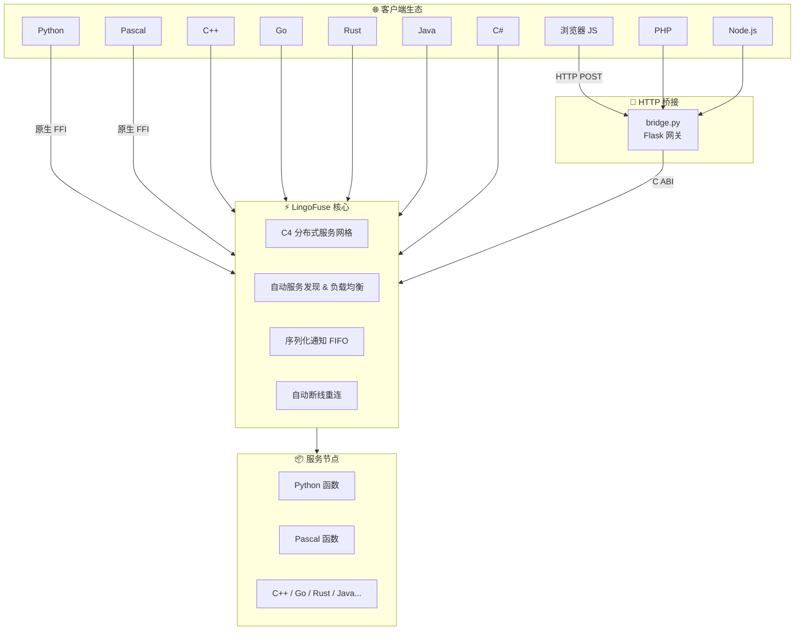

# LingoFuse

> **让所有编程语言平等对话的智能体通讯地基**

---

## 💡 这到底是什么？

**LingoFuse** 是一个面向 **智能体（Agent）** 和 **全栈系统** 的 **分布式 RPC 框架**。它让 **Python、Pascal、C++、Go、Rust、Java、C#、Node.js、PHP、浏览器 JavaScript** 等十几种语言编写的服务能够互相调用，就像调用本地函数一样简单。

**不需要写 IDL，不需要生成桩代码，不需要搭 HTTP 服务**——你只需要引用一个库，用你熟悉的语言写几行代码，你的函数就“全栈通杀”了。

> **LingoFuse 不是又一个 RPC 框架，而是一张让所有编程语言“互捅”的神经通讯网。**

---

## 🏗️ 架构



---

## ✨ 核心特性

| 特性 | 说明 |
|------|------|
| 🌍 **10+ 语言绑定** | Python、Pascal、C++、Go、Rust、Java、C#、Node.js、PHP、Web.js |
| ⚡ **高性能** | 同机 IPC 延迟 < 1ms，吞吐 10,000+ 请求/秒 |
| 🔌 **双通信模式** | TCP（跨机器）+ IPC（同机微秒级） |
| 🔄 **自动服务发现 & 负载均衡** | 基于 C4 网格，节点即插即用，请求自动分发 |
| 📦 **零拷贝传输** | 直接访问内部缓冲区，无二次复制 |
| 🎯 **双调用模式** | 同步 Call（请求-响应）+ 异步 Notify（单向通知） |
| 🔗 **Sequenced Notify** | FIFO 有序交付，支持大数据分片流式传输 |
| 🧹 **自动内存回收** | 数据句柄闲置 5 分钟自动释放，7×24 小时不重启 |
| 🔧 **部署模式** | 节点无序启动，弹性伸缩零协调 |
| 🆔 **唯一化 AppName** | 生成全局唯一标识，点对点通信永不撞车 |
| 🌉 **HTTP 桥接** | 自带 Flask 网关，Web 生态无缝接入 |
| 🧠 **AI 友好** | 注释详实，喂给 AI 就能帮你写代码 |

---

## 🚀 快速上手（两段代码，不能再多了）

### Python 服务端（7 行）

```python
from lingofuse import Server

app = Server("Calc")

@app.expose("add")
def add(a, b):
    return a + b

app.start_multi(["ipc:calc", "0.0.0.0:9898"])
input("按回车退出...\n")
app.stop()
```

### Python 客户端（3 行）

```python
from lingofuse import C4

c = C4("Calc", "ipc:calc")
print(c.add(10, 20))   # 30
```

### 或者用 Pascal 客户端调 Python 服务

```pascal
program client;
uses lingofuse_helper;

function Add(a,b: integer): integer;
var Data, Res: TDataHnd;
begin
  Data := TDataHnd.Create('add');
  Data.WriteInt32(a).WriteInt32(b);
  Res := LF.CallApp('Calc', Data, 3000);
  if Res.Size > 0 then Result := Res.ReadInt32 else Result := 0;
  Data.Free; Res.Free;
end;

begin
  LF.ResetPrepare;
  LF.PrepareClient('ipc:calc', nil);
  if LF.PrepareDone then
    WriteLn('10 + 20 = ', Add(10,20));
  LF.Shutdown;
end.
```

**看到没？Python 写的服务，Pascal 直接调——这就是 LingoFuse。**

---

## 📊 性能对比

| 方案 | 延迟 (IPC) | 吞吐量 | 服务发现 | 负载均衡 | 顺序保证 |
|------|-----------|--------|----------|----------|----------|
| **LingoFuse** | **< 1 ms** | **12k+/s** | ✅ 内置 | ✅ 内置 | ✅ FIFO |
| gRPC | ~5-8 ms | ~3k/s | ❌ 需 etcd | ❌ 需 LB | ❌ |
| REST | ~10-20 ms | ~1k/s | ❌ 需 Nginx | ❌ 需 Nginx | ❌ |

**LingoFuse 比 gRPC 快 5-8 倍，比 REST 快 10-20 倍。**

---

## 🌐 语言支持矩阵

| 语言 | 绑定 | 状态 | 可当服务端 | 可当客户端 |
|------|------|------|-----------|-----------|
| **Pascal** | ✅ 原生 | 🟢 生产就绪 | ✅ | ✅ |
| **Python** | ✅ 原生 | 🟢 生产就绪 | ✅ | ✅ |
| **C++** | 🚧 计划中 | ⏳ 即将到来 | ✅ | ✅ |
| **Go** | 🚧 计划中 | ⏳ 即将到来 | ✅ | ✅ |
| **Rust** | 🚧 计划中 | ⏳ 即将到来 | ✅ | ✅ |
| **Java** | 🚧 计划中 | ⏳ 即将到来 | ✅ | ✅ |
| **C#** | 🚧 计划中 | ⏳ 即将到来 | ✅ | ✅ |
| **Node.js** | 🌉 HTTP 桥接 | 🟢 可用 | ❌ | ✅ |
| **PHP** | 🌉 HTTP 桥接 | 🟢 可用 | ❌ | ✅ |
| **浏览器** | 🌉 HTTP 桥接 | 🟢 可用 | ❌ | ✅ |

> 🌉 HTTP 桥接通过 `bridge.py` 实现，任何能发 HTTP 请求的语言都能接入。

---

## 🐝 Cross Demo：负载均衡可视化

启动 N 个节点，C4 网格自动把请求均匀洒向每个节点：

```bash
# 终端1：注册中心
python cross/cross_service.py

# 终端2-11：开 10 个工作节点
python cross/cross_node.py   # 重复执行

# 终端12-16：开 5 个客户端疯狂呼叫
python cross/cross_call.py   # 重复执行
```

你会看到请求像蜜蜂一样均匀飞到每个节点——**真·蜂群分布式。**

---

## 📂 项目结构

```
LingoFuse/
├── Binary/                    # 动态库文件
│   ├── LingoFuse64.dll        # 核心库 (Windows)
│   └── liblingofuse.so        # 核心库 (Linux)
├── Z.LingoFuse_Core.pas       # Pascal 核心引擎
├── Z.LingoFuse_Export.pas     # Pascal C ABI 导出
├── Z.Net.C4.LingoFuse.pas     # C4 网格集成
├── pascal/                    # Pascal 绑定 + 示例
│   ├── lingofuse_import.pas   # 低级绑定
│   ├── lingofuse_helper.pas   # RAII 高级封装
│   ├── cross_demo/            # 跨语言负载均衡
│   ├── Compute_Grid_Demo/     # 分布式计算网格
│   └── SequenceData/          # 大数据顺序组装
├── Py/                        # Python 绑定 + 示例
│   ├── lingofuse/             # 核心包
│   │   ├── _lf_native.py      # ctypes 底层绑定
│   │   ├── core.py            # DataHandle + App
│   │   ├── server.py          # @expose 装饰器
│   │   ├── client.py          # C4 动态客户端
│   │   └── bridge.py          # HTTP 网关
│   ├── cross/                 # 多语言负载均衡演示
│   └── llm-service/           # 流式 LLM 服务
├── Test/                      # Delphi 测试项目
└── tools/                     # 开发工具
```

---

## 🔗 LLM 流式服务

LingoFuse 自带流式 LLM 服务示例，将 `llama-cpp-python` 的 token 流通过 `Sequenced_Notify` 推送给客户端：

```bash
# 启动服务
python llm-service/llm_service.py --model-path ./qwen.gguf

# 客户端接收流式输出
python llm-service/llm_test.py --content "print('Hello')" --prompt "解释"
```

---

## 🌉 HTTP 桥接

```bash
python lingofuse/bridge.py --endpoint ipc:calc --app Calc --port 8081
```

然后任意 HTTP 客户端都能调用：

```bash
curl -X POST http://127.0.0.1:8081/Calc/add -d '[10,20]'
# 返回: 30
```

---

## ❓ 常见问题

**Q：Python 绑定需要编译吗？**  
A：不需要。纯 Python + ctypes，直接 `pip install -e .`。

**Q：`generate_app_name()` 什么时候调？**  
A：**必须在 `PrepareDone()` 成功后调用**，否则生成的名称缺少隧道 ID。

**Q：回调里能调 `LF_Call` 吗？**  
A：**绝对不行！** 会死锁。想远程调用，另开线程。

**Q：想多个应用绑到同一个地址？**  
A：设 `Overlap_Connection=True`，然后反复 `PrepareClient`。

**Q：动态库找不到？**  
A：把 `LingoFuse64.dll` 扔到当前目录或加到 PATH。

---

## 🧓 关于作者

**老张（QQ: 600585）**  
看不惯跨语言调用得写一箩筐胶水代码，干脆撸了 LingoFuse。  
欢迎来撩、来喷、来 PR——**Star 是最好的催更。**

---

## 📄 许可证

**MIT**——拿去用，拿去改，拿去卖，都不用来谢我。

---

*项目始于 2026 年，持续进化中。有问题提 Issue，急事加 Q。*