# LingoFuse

> **智能体时代的神经网络通讯地基 | 让 30+ 种语言无缝互调，为 AI Agent 与全栈系统提供高速、动态、流式 RPC 通信**

[](https://opensource.org/licenses/MIT)


---

## 🎯 一句话说人话

**Python 写的函数，Pascal 直接调；Go 写的服务，Rust 随手用；浏览器点个按钮，后端 C++ 就响应——不用写 IDL，不用生成桩代码，不用搭 HTTP 服务。**

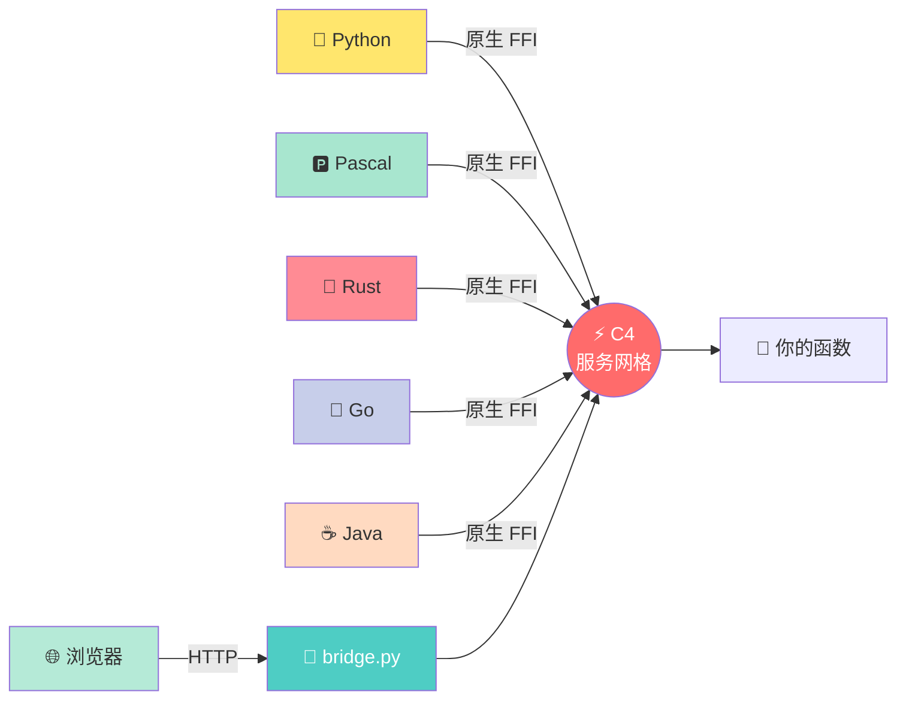

> **LingoFuse 不是又一个 RPC 框架，而是一张让所有编程语言"互捅"的神经通讯网。**
>
> 它围绕**两个核心领域**构建：**多语言**与**智能体**。在这张地基之上，社区构建了 pasAgent 工具链作为生态分支。

---

## 🌐 两大核心领域

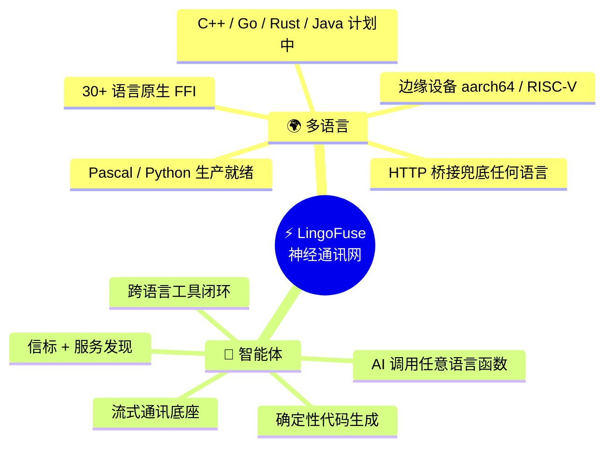

### 🌍 领域一：多语言 —— 让所有语言平等对话

**核心命题**：任何语言写的函数，任何其他语言都能直接调——不写 IDL，不生成桩代码，不搭 HTTP 服务。

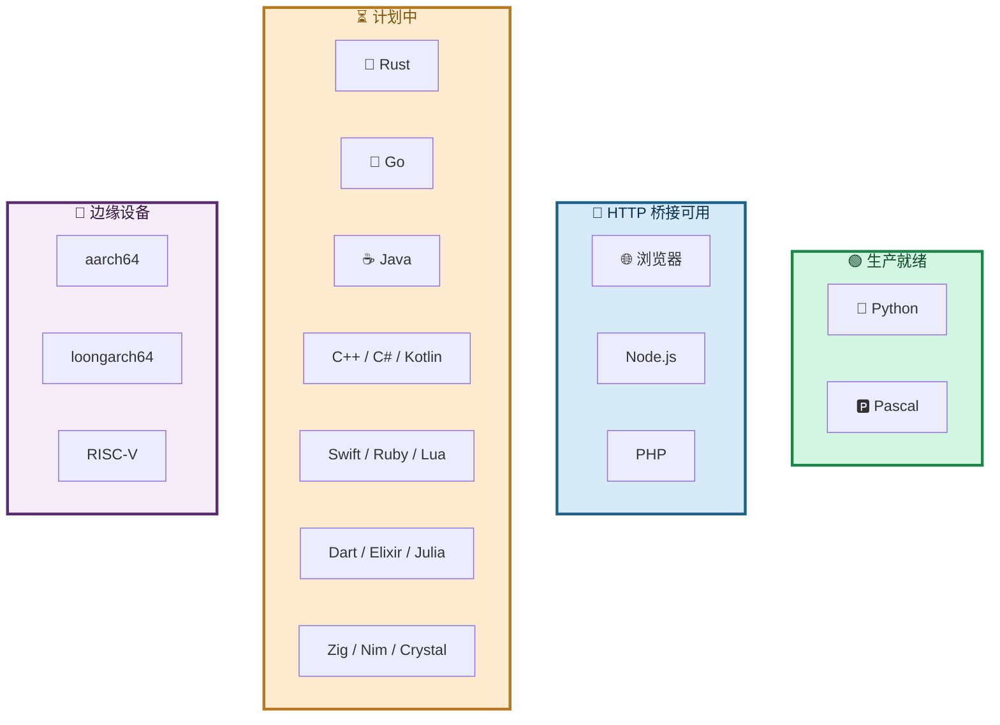

| 语言 | 状态 | 服务端 | 客户端 |
|------|------|:------:|:------:|
| **Pascal** | 🟢 生产就绪 | ✅ | ✅ |
| **Python** | 🟢 生产就绪 | ✅ | ✅ |
| **C++ / Go / Rust / Java / C# / Kotlin / Swift / Ruby / Lua / Dart / Elixir / Julia / Zig / Nim / Crystal** | ⏳ 计划中 | ✅ | ✅ |
| **Node.js / PHP / 浏览器** | 🌉 HTTP 桥接可用 | ❌ | ✅ |
| **aarch64 / loongarch64 / RISC-V** | 📱 边缘设备计划 | ✅ | ✅ |

> 🎯 **目标：让地球上 30+ 种编程语言，用同一个函数调用约定互相说话。**

**三条路径，覆盖所有语言：**

| 路径 | 适用语言 | 是否需编译绑定 | 性能 |
|------|---------|:--------------:|:----:|
| **原生 FFI** | Pascal / Python（已就绪）；Rust / Go / C++ 等（计划中） | 需要 | ⚡ 极致（< 1ms） |
| **HTTP 桥接** | 任何支持 HTTP 的语言（Node.js / PHP / 浏览器 / Swift / Kotlin / Go / …） | **不需要** | 🌉 可用 |
| **边缘设备移植** | aarch64 / loongarch64 / RISC-V | 需要 | 📱 适配 |

---

### 🤖 领域二：智能体 —— AI 调用任意语言函数的底座

**核心命题**：AI 智能体要调用函数，但它不知道你的函数是用什么语言写的——**LingoFuse 让这一切透明**。

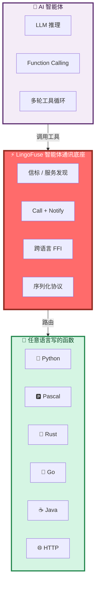

**LingoFuse 为智能体提供四大基石：**

| 基石 | 作用 | 智能体受益点 |
|------|------|-------------|
| **信标（`pascal_agent_service`）** | 工具注册中心 | AI 自动发现有哪些工具可用 |
| **Call + Notify** | 双向通讯 | 请求-响应 + 流式推送 |
| **跨语言 FFI** | 语言无关调用 | 无论工具用什么语言，AI 无需感知 |
| **确定性序列化** | 结构化数据 | 工具参数可复现、可审计 |

**智能体生态的上层应用（pasAgent 工具链）：**

LingoFuse 本身**专注通讯底座**。在这张地基之上，社区构建了 **pasAgent 智能体工具链**，让 AI 能像调用本地函数一样调用 Pascal 代码——详见下方「生态分支」一小节。

---

## ⚡ 性能：不给友商留活路

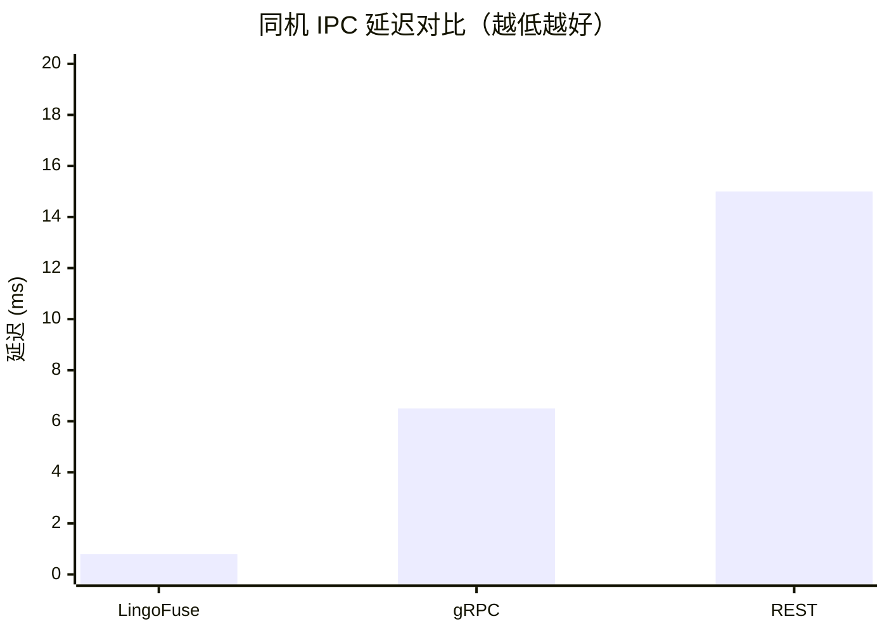

| 方案 | 延迟 (IPC) | 吞吐量 | 服务发现 | 负载均衡 | 顺序保证 |
|------|-----------|--------|----------|----------|----------|
| **LingoFuse** | **< 1 ms** | **12k+/s** | ✅ 内置 | ✅ 内置 | ✅ FIFO |
| gRPC | ~5-8 ms | ~3k/s | ❌ 需 etcd | ❌ 需 LB | ❌ |
| REST | ~10-20 ms | ~1k/s | ❌ 需 Nginx | ❌ 需 Nginx | ❌ |

**翻译成人话：比 gRPC 快 5-8 倍，比 REST 快 10-20 倍，自带全套中间件——友商：绷不住了。**

### 🏭 实战验证

- **2022 年**：C4 网格在机房**扛过单日单台 PB 级流量**——不是理论值，是真在跑。
- **优化工作长期深水区**：从底层内存管理到网络调度持续打磨，**后续发展稳如老狗**。
- **智能体场景已生产验证**：pasAgent 工具链已在生产环境稳定运行。

---

## 🚀 三行上手

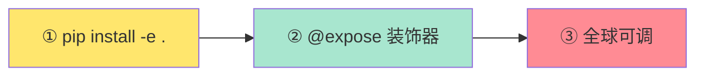

**服务端**（Python，7 行）：

```python
from lingofuse import Server

app = Server("Calc")

@app.expose("add")
def add(a, b):
    return a + b

app.start_multi(["ipc:calc", "0.0.0.0:9898"])
input("按回车退出...\n")
```

**客户端**（Pascal，3 行搞定）：

```pascal
LF.PrepareClient('ipc:calc', nil);
if LF.PrepareDone then
  WriteLn('10 + 20 = ', LF.CallApp('Calc', Data, 3000).ReadInt32);
```

**这就完了。你的函数现在挂到了分布式网络上，谁都能调。**

---

## 🧠 AI 原生：不做"AI 一把梭"

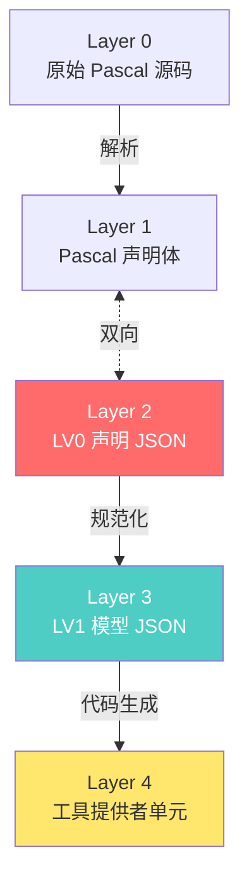

**核心哲学**：不信任 AI 直接写代码，而是 **"LLM 解析成结构体 → 确定性生成器产出目标代码"**。

- ✅ **结果可复现**：同样输入永远同样输出
- ✅ **零调试成本**：生成即可编译运行
- ✅ **跳过报告**：哪些函数被跳过、为什么，白纸黑字
- ✅ **可喂 LLM 辅助**：任意中间态都能让 AI 帮忙修

> **"以前写跨语言接口要 2 天，现在 2 分钟。"** —— 某团队 Tech Lead 的原话

---

## 🐝 来，看个活的

开 10 个终端跑 `cross_node`，再开 5 个跑 `cross_call`——**你会看到请求像蜜蜂一样均匀飞到每个节点。**

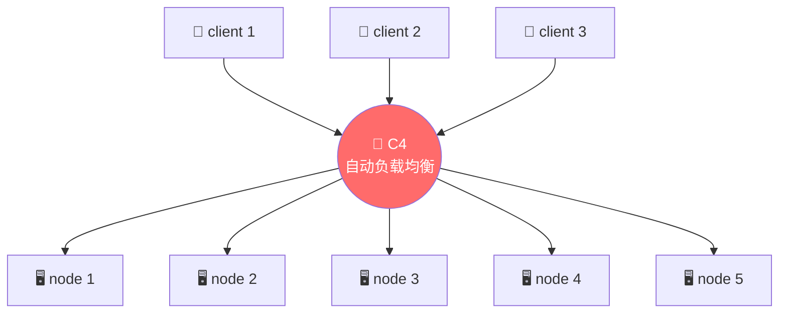

**真·蜂群分布式，一行调度代码不用写。**

---

## 🧩 生态分支：pasAgent 工具链

> LingoFuse 本身**专注通讯底座**。以下**分支项目**在其之上，提供"AI 调用 Pascal 工具"的一站式闭环。如果你只需要 LingoFuse 的跨语言通讯能力，**可以直接跳过这一节**。

**pasAgent** 是基于 LingoFuse 构建的 Pascal 智能体工具链，现有两个平行分支：

| 分支 | 定位 | 核心能力 | 仓库 |
|:----:|------|----------|------|
| **v2** | 纯文本智能体 | 文字问答 · 工具调用 · 129+ 后端 | [LingoFuse-pasAgent](https://github.com/PassByYou888/LingoFuse-pasAgent) |
| **v3** ⭐ | 多模态智能体 | 文字 + 图片 · 双语言代码生成 · 250+ 后端 | [LingoFuse-pasAgent-v3](https://github.com/PassByYou888/LingoFuse-pasAgent-v3) |

**该选哪一个？**

- 只要**文字能力** → **v2**
- 需要**多模态 / 图像识别 / 语音 / 双语言代码生成** → **v3**
- v3 是 v2 的**平行分支**，不是替代——v2 仍然可用、仍然维护

**快速链接**：

- 🟦 [pasAgent v2 仓库](https://github.com/PassByYou888/LingoFuse-pasAgent)
- 🟪 [pasAgent v3 仓库（多模态 ⭐）](https://github.com/PassByYou888/LingoFuse-pasAgent-v3)

---

## 🛠️ LingoFuse 正在推进中

> **LingoFuse 从未停止进化。** 从 2022 年的机房实战，到 2026 年的多语言智能体时代，这张通讯网一直在扩张。

### 当前推进方向

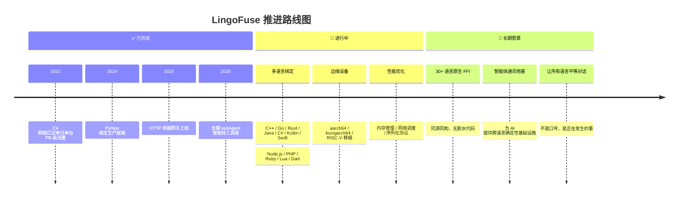

### 已完成

- ✅ **Pascal / Python** 双语言生产就绪
- ✅ **C4 服务网格**：自动服务发现 + 负载均衡 + FIFO 顺序保证
- ✅ **HTTP 桥接网关**（`bridge.py`）：让任何 HTTP 客户端接入
- ✅ **智能体通讯底座**：支撑 pasAgent 工具链落地

### 进行中

- 🚀 **多语言原生绑定**：C++ / Go / Rust / Java / C# / Kotlin / Swift / Node.js / PHP / Ruby / Lua / Dart
- 🚀 **边缘设备移植**：aarch64 / loongarch64 / RISC-V
- 🚀 **性能持续深挖**：内存管理、网络调度、序列化协议
- 🚀 **智能体生态扩展**：更丰富的跨语言工具闭环

### 长期愿景

- 🌌 **30+ 语言原生 FFI**：同源同构，不写胶水代码
- 🌌 **智能体通讯地基**：为 AI 提供跨语言确定性基础设施
- 🌌 **让所有语言平等对话**：不是口号，是正在发生的事

> 💡 **参与推进**：欢迎提 Issue、提交 PR、贡献语言绑定。**Star 是最好的催更。**

---

## 📚 完整文档地图

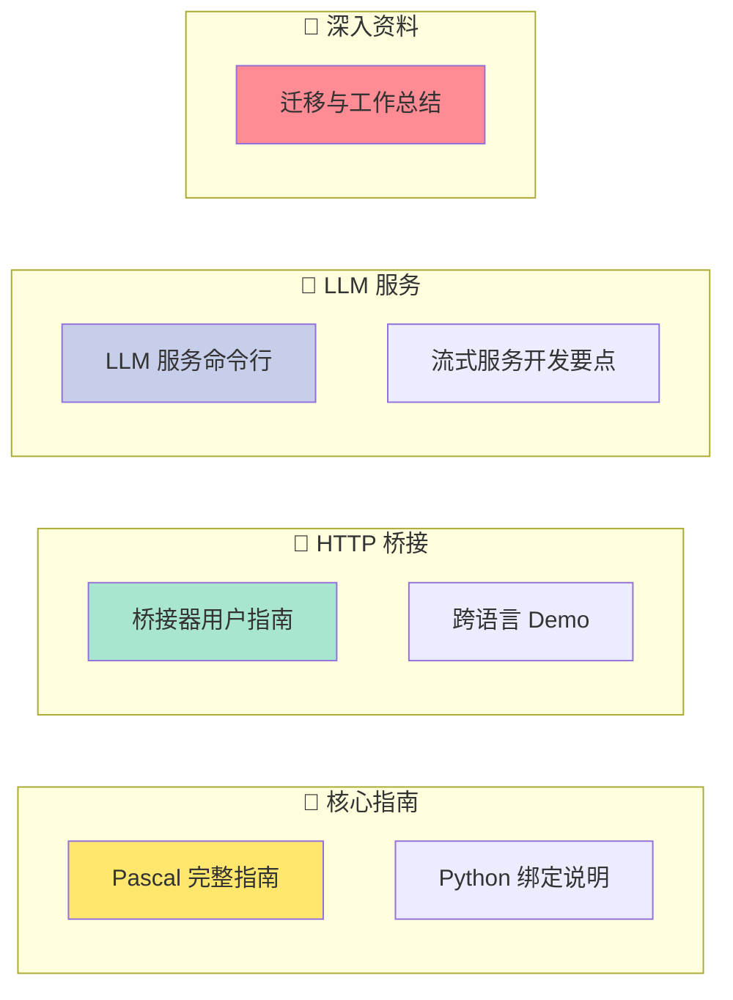

| 文档 | 面向对象 |
|------|----------|
| 📘 [**Pascal 完整指南**](pascal/LingoFuse_Pascal_Complete_Guide.md) | Pascal 开发者 |
| 📗 [**Python 绑定说明**](Py/readme.md) | Python 开发者 |
| 📙 [**HTTP 桥接器用户指南**](Py/lingofuse/Bridge_User_Guide.md) | 网关部署 |
| 📕 [**跨语言 Demo 指南**](Py/cross/Cross_Demo_Guide_zh.md) | 想体验负载均衡 |
| 📔 [**LLM 服务命令行指南**](Py/llm-service/LingoFuse_LLM_Service_guide.md) | 部署本地大模型 |
| 📓 [**流式 LLM 服务开发要点**](Py/llm-service/LingoFuse_Python_Streaming_LLM_Guide.md) | LLM 服务开发 |
| 📒 [**llama-cpp-python 使用说明**](Py/llm-service/llama_cpp_python_guide.md) | 装依赖 |
| 📊 [**迁移与工作总结报告**](Py/LingoFuse_Python_Binding_Migration_Record.md) | 想了解内部实现 |

---

## 📂 项目结构

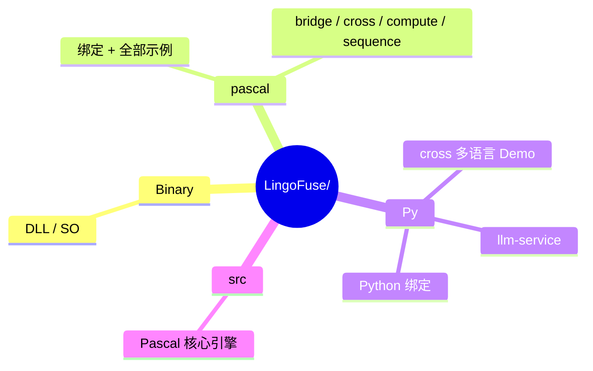

---

## ⚠️ 克隆必读

**本仓库有子模块，必须加 `--recursive`：**

```bash
git clone --recursive https://github.com/PassByYou888/LingoFuse.git
# 忘了加？补救：
git submodule update --init --recursive
```

**不加？** 编译时你会看到一堆 `Can't find unit Z.Core`——**别问，问就是"我没说清楚"。**

---

## ❓ 常见问题（一句话版）

| 问题 | 回答 |
|------|------|
| 要写 IDL 吗？ | **不用。** `@expose` 装饰器搞定一切 |
| Python 绑定要编译吗？ | **不用。** 纯 ctypes，`pip install -e .` 完事 |
| `generate_app_name()` 什么时候调？ | **必须在 `PrepareDone()` 成功后。** 否则名字缺隧道信息 |
| 回调里能调 `LF_Call` 吗？ | **绝对不行！** 会死锁。另开线程 |
| 多应用绑同一地址？ | 设 `Overlap_Connection=True` |
| 动态库找不到？ | 把 DLL 扔当前目录，或加 PATH |
| 想让浏览器也来凑热闹？ | `python lingofuse/bridge.py` 起网关 |
| **LingoFuse 是 RPC 框架吗？** | **不只是。** 它是**多语言 + 智能体**的神经网络通讯地基 |
| **LingoFuse 和 pasAgent 什么关系？** | pasAgent 是**生态分支**（基于 LingoFuse 构建）；LingoFuse 本身专注通讯底座 |
| **LingoFuse 本身会停更吗？** | **不会。** 多语言绑定、边缘设备、性能优化持续推进中 |

---

## 🌟 运营策略与开放性

**LingoFuse 是面向技术社区的完全开放项目，采用 MIT 许可证。**

### 开源过滤机制

参考作者在 [Z-AI1.4](https://github.com/PassByYou888/Z-AI1.4) 中阐述的理念：

> *"开源版本可以自由获取，自由建模，自己解决识别问题；而项目框架设计、底座和平台化、落地等环节并不开源，也不提供文档。不开源项目的初衷：拥抱技术，建立开源过滤机制。"*

**LingoFuse 的定位是"通讯地基"**——它本身完全开源、免费、无商业捆绑。而基于它构建的上层应用（如 pasAgent 工具链）保留各自的开源策略。

### 开放承诺

- ✅ **永久免费**：MIT 许可证，个人 / 团队 / 企业随便用
- ✅ **无商业捆绑**：没收费功能、没付费订阅、没"企业版"
- ✅ **社区驱动**：所有决策来自贡献者
- ✅ **透明开发**：源码全公开，构建可复现

> **我们相信：跨语言通信应该是每个开发者的基本权利，不该被商业壁垒卡脖子。**

---

## 🧓 关于作者

**老张（QQ: 600585）**

看不惯跨语言调用得写一箩筐胶水代码，干脆撸了 LingoFuse。

欢迎来撩、来喷、来 PR——**Star 是最好的催更。**

---

## 📄 许可证

**MIT** —— 拿去用，拿去改，拿去卖，都不用来谢我。

---

## 🔗 快速链接

| 资源 | 链接 |
|------|------|
| **LingoFuse 主仓库**（多语言 + 智能体通讯地基） | <https://github.com/PassByYou888/LingoFuse> |
| **zIPC（进程通信组件）** | <https://github.com/PassByYou888/zIPC> |
| 🟦 **pasAgent v2**（纯文本智能体，生态分支） | <https://github.com/PassByYou888/LingoFuse-pasAgent> |
| 🟪 **pasAgent v3**（多模态智能体，生态分支） | <https://github.com/PassByYou888/LingoFuse-pasAgent-v3> |

---

*项目始于 2026 年，持续进化中。有问题提 Issue，急事加 Q。*

*"让所有编程语言平等对话" —— 不是口号，是正在发生的事。*
