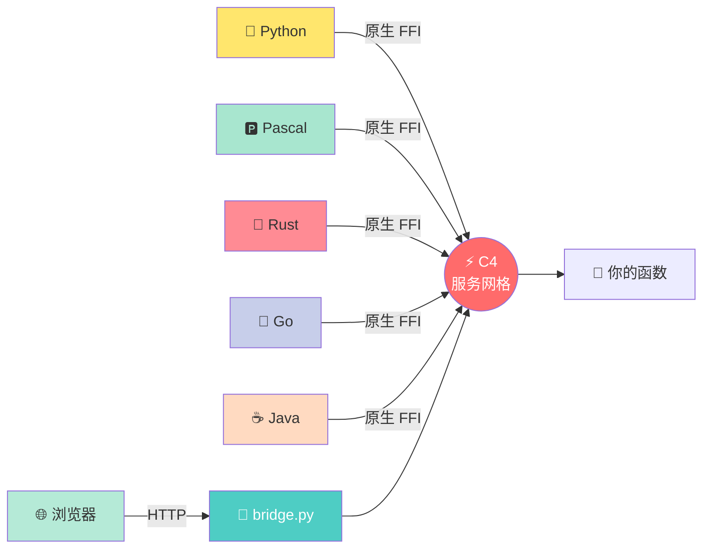
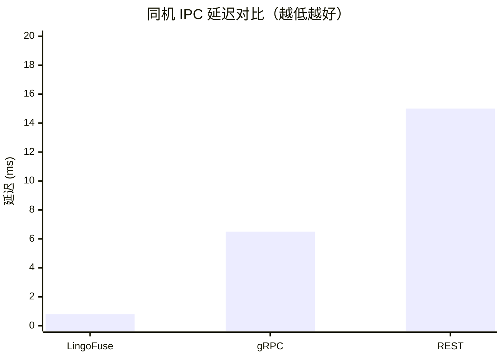
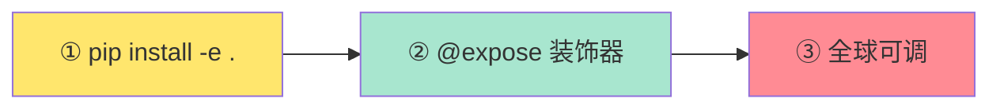
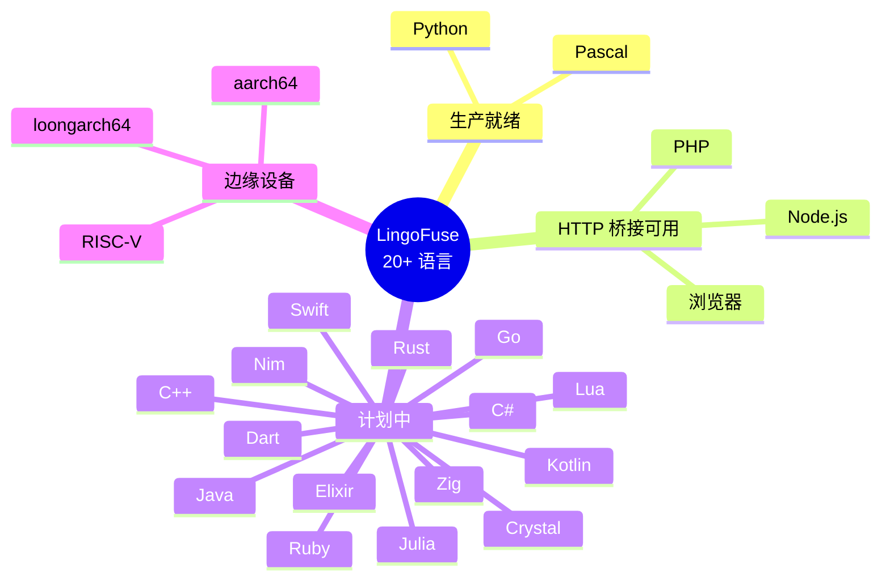
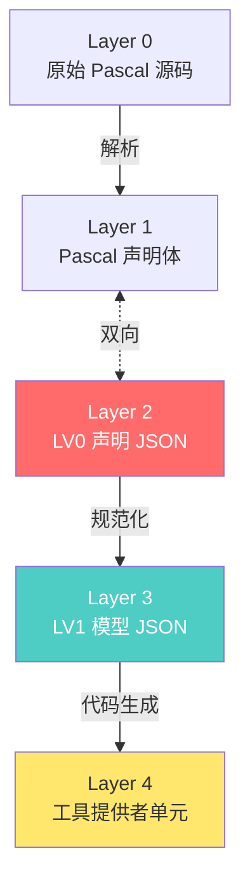
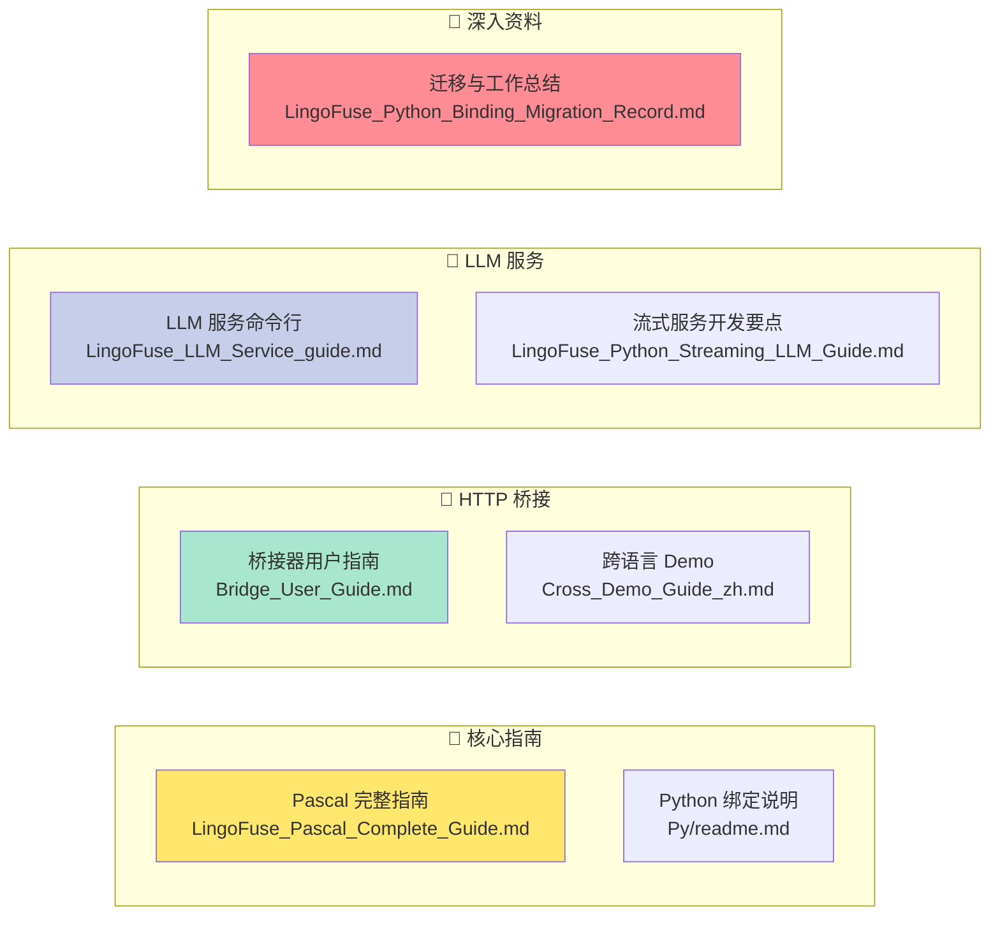
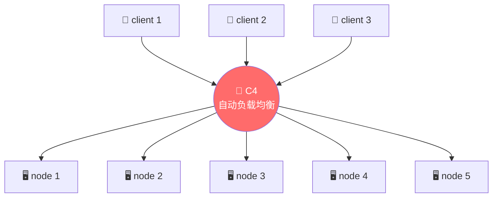
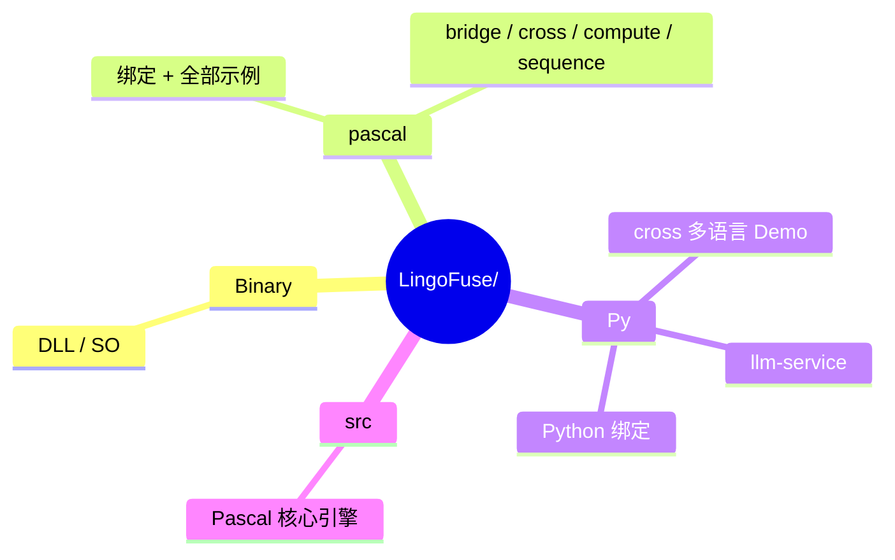

# LingoFuse

> **让所有编程语言平等对话的智能体通讯地基**

[](https://opensource.org/licenses/MIT)


---

## 🎯 一句话说人话

**Python 写的函数，Pascal 直接调；Go 写的服务，Rust 随手用；浏览器点个按钮，后端 C++ 就响应——不用写 IDL，不用生成桩代码，不用搭 HTTP 服务。**



> **LingoFuse 不是又一个 RPC 框架，而是一张让所有编程语言"互捅"的神经通讯网。**

---

## ⚡ 性能：不给友商留活路



| 方案 | 延迟 (IPC) | 吞吐量 | 服务发现 | 负载均衡 | 顺序保证 |
|------|-----------|--------|----------|----------|----------|
| **LingoFuse** | **< 1 ms** | **12k+/s** | ✅ 内置 | ✅ 内置 | ✅ FIFO |
| gRPC | ~5-8 ms | ~3k/s | ❌ 需 etcd | ❌ 需 LB | ❌ |
| REST | ~10-20 ms | ~1k/s | ❌ 需 Nginx | ❌ 需 Nginx | ❌ |

**翻译成人话：比 gRPC 快 5-8 倍，比 REST 快 10-20 倍，自带全套中间件——友商：绷不住了。**

### 🏭 实战验证

- **2022 年**：C4 网格在机房**扛过单日单台 PB 级流量**——不是理论值，是真在跑。
- **优化工作长期深水区**：从底层内存管理到网络调度持续打磨，**后续发展稳如老狗**。

---

## 🚀 三行上手



**服务端**（Python，7 行）：

```python
from lingofuse import Server

app = Server("Calc")

@app.expose("add")
def add(a, b):
    return a + b

app.start_multi(["ipc:calc", "0.0.0.0:9898"])
input("按回车退出...\n")
```

**客户端**（Pascal，3 行搞定）：

```pascal
LF.PrepareClient('ipc:calc', nil);
if LF.PrepareDone then
  WriteLn('10 + 20 = ', LF.CallApp('Calc', Data, 3000).ReadInt32);
```

**这就完了。你的函数现在挂到了分布式网络上，谁都能调。**

---

## 🌍 语言支持矩阵：全村的希望



| 语言 | 状态 | 服务端 | 客户端 |
|------|------|--------|--------|
| **Pascal** | 🟢 生产就绪 | ✅ | ✅ |
| **Python** | 🟢 生产就绪 | ✅ | ✅ |
| **C++** | ⏳ 计划中 | ✅ | ✅ |
| **Go** | ⏳ 计划中 | ✅ | ✅ |
| **Rust** | ⏳ 计划中 | ✅ | ✅ |
| **Java / C# / Kotlin / Swift / Ruby / Lua / Dart / Elixir / Julia / Zig / Nim / Crystal** | ⏳ 计划中 | ✅ | ✅ |
| **Node.js / PHP / 浏览器** | 🌉 HTTP 桥接可用 | ❌ | ✅ |
| **aarch64 / loongarch64** | 📱 边缘设备计划 | ✅ | ✅ |

> 🎯 **目标：让地球上 20+ 种编程语言，用同一个函数调用约定互相说话。**

---

## 🧠 AI 原生：不做"AI 一把梭"



**核心哲学**：不信任 AI 直接写代码，而是 **"LLM 解析成结构体 → 确定性生成器产出目标代码"**。

- ✅ **结果可复现**：同样输入永远同样输出
- ✅ **零调试成本**：生成即可编译运行
- ✅ **跳过报告**：哪些函数被跳过、为什么，白纸黑字
- ✅ **可喂 LLM 辅助**：任意中间态都能让 AI 帮忙修

> **"以前写跨语言接口要 2 天，现在 2 分钟。"** —— 某团队 Tech Lead 的原话

**配套项目**：[pasAgent](https://github.com/PassByYou888/LingoFuse-pasAgent)（Pascal 智能体工具链）

---

## 📚 完整文档地图



| 文档 | 面向对象 |
|------|----------|
| 📘 [**Pascal 完整指南**](pascal/LingoFuse_Pascal_Complete_Guide.md) | Pascal 开发者 |
| 📗 [**Python 绑定说明**](Py/readme.md) | Python 开发者 |
| 📙 [**HTTP 桥接器用户指南**](Py/lingofuse/Bridge_User_Guide.md) | 网关部署 |
| 📕 [**跨语言 Demo 指南**](Py/cross/Cross_Demo_Guide_zh.md) | 想体验负载均衡 |
| 📔 [**LLM 服务命令行指南**](Py/llm-service/LingoFuse_LLM_Service_guide.md) | 部署本地大模型 |
| 📓 [**流式 LLM 服务开发要点**](Py/llm-service/LingoFuse_Python_Streaming_LLM_Guide.md) | LLM 服务开发 |
| 📒 [**llama-cpp-python 使用说明**](Py/llm-service/llama_cpp_python_guide.md) | 装依赖 |
| 📊 [**迁移与工作总结报告**](Py/LingoFuse_Python_Binding_Migration_Record.md) | 想了解内部实现 |

---

## 🐝 来，看个活的

开 10 个终端跑 `cross_node`，再开 5 个跑 `cross_call`——**你会看到请求像蜜蜂一样均匀飞到每个节点。**



**真·蜂群分布式，一行调度代码不用写。**

---

## 📂 项目结构



---

## ⚠️ 克隆必读

**本仓库有子模块，必须加 `--recursive`：**

```bash
git clone --recursive https://github.com/PassByYou888/LingoFuse.git
# 忘了加？补救：
git submodule update --init --recursive
```

**不加？** 编译时你会看到一堆 `Can't find unit Z.Core`——**别问，问就是"我没说清楚"。**

---

## ❓ 常见问题（一句话版）

| 问题 | 回答 |
|------|------|
| 要写 IDL 吗？ | **不用。** `@expose` 装饰器搞定一切 |
| Python 绑定要编译吗？ | **不用。** 纯 ctypes，`pip install -e .` 完事 |
| `generate_app_name()` 什么时候调？ | **必须在 `PrepareDone()` 成功后。** 否则名字缺隧道信息 |
| 回调里能调 `LF_Call` 吗？ | **绝对不行！** 会死锁。另开线程 |
| 多应用绑同一地址？ | 设 `Overlap_Connection=True` |
| 动态库找不到？ | 把 DLL 扔当前目录，或加 PATH |
| 想让浏览器也来凑热闹？ | `python lingofuse/bridge.py` 起网关 |

---

## 🌟 关于开放性

**LingoFuse 是完全开放、非商业性的开源项目。**

- ✅ **永久免费**：MIT 许可证，个人 / 团队 / 企业随便用
- ✅ **无商业捆绑**：没收费功能、没付费订阅、没"企业版"
- ✅ **社区驱动**：所有决策来自贡献者
- ✅ **透明开发**：源码全公开，构建可复现

> **我们相信：跨语言通信应该是每个开发者的基本权利，不该被商业壁垒卡脖子。**

---

## 🧓 关于作者

**老张（QQ: 600585）**

看不惯跨语言调用得写一箩筐胶水代码，干脆撸了 LingoFuse。
又看不惯 Pascal 老代码接不进 AI 时代，顺手撸了 [pasAgent](https://github.com/PassByYou888/LingoFuse-pasAgent)。

欢迎来撩、来喷、来 PR——**Star 是最好的催更。**

---

## 📄 许可证

**MIT** —— 拿去用，拿去改，拿去卖，都不用来谢我。

---

*项目始于 2026 年，持续进化中。有问题提 Issue，急事加 Q。*

*"让所有编程语言平等对话" —— 不是口号，是正在发生的事。*