# lingofuse_ext 编译指南

本指南描述如何在 Windows 上编译 `lingofuse_ext`（LingoFuse Ruby 绑定的 C 扩展），以及编译后如何验证。

---

## 一、为什么需要 C 扩展

Ruby 的 Fiddle 无法从 LingoFuse 的原生工作线程安全地回调 Ruby 代码。LingoFuse 收到远端 Call / Notify / Sequenced Notify / Network 事件时，会在它自己创建的 TCompute 工作线程上执行回调；而 Ruby 虚拟机不认识这个线程。当 Fiddle 的 `Closure::BlockCaller` 试图从该线程重新进入解释器时，MRI 会抛出：

```
[BUG] rb_thread_call_with_gvl() is called by non-ruby thread
```

随后进程永久死锁。

### 1.1 问题根源（三段式）

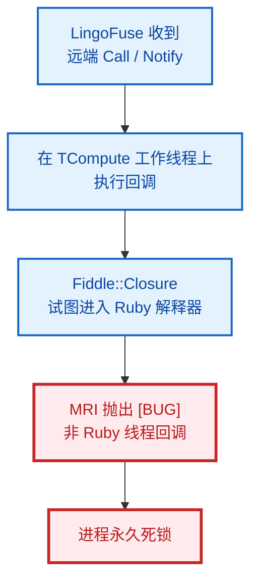

### 1.2 C 扩展如何破局（分两块）

**块 1 — 原生线程侧**：

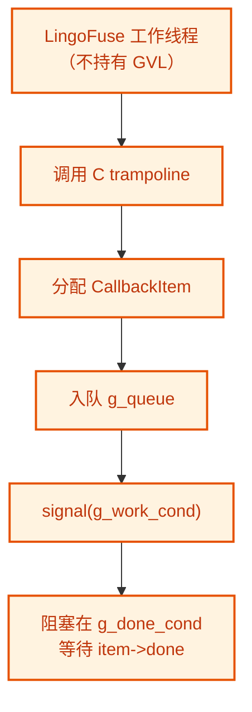

**块 2 — Ruby 调度线程侧**：

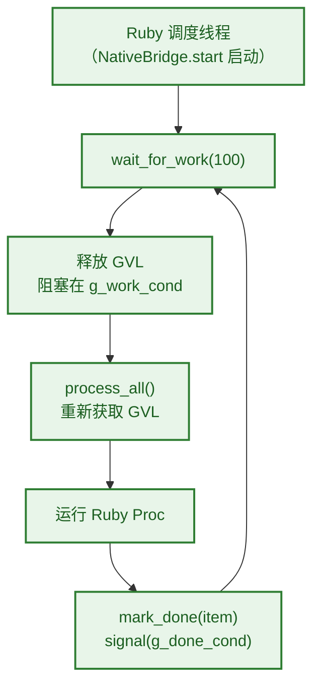

调度线程是真正的 Ruby 线程。它持有 GVL 时运行用户代码，所以所有 Ruby 层的约束都保持有效。LingoFuse 的工作线程从不接触任何 Ruby 对象。

### 1.3 GVL 分流（本地调用为什么不能走队列）

C 扩展里每个 trampoline 都做一次关键判断。

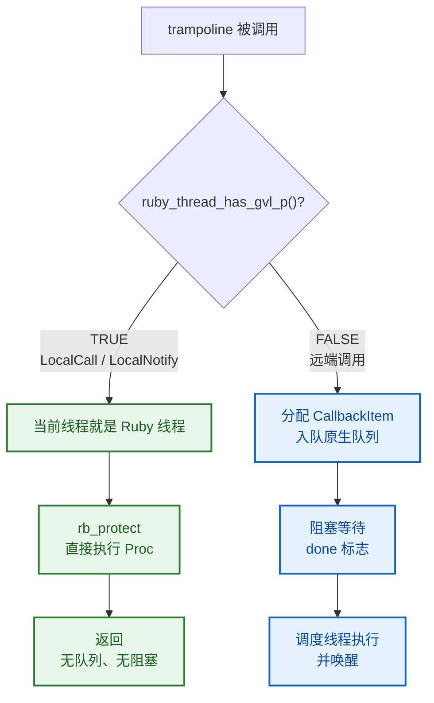

**为什么必须分流**：如果本地调用也走队列，主线程会阻塞在等待 `done` 标志的位置，而调度线程需要 GVL 才能运行 —— 形成**死锁**。

---

## 二、环境前提

| 项 | 要求 | 检查命令 |
|---|---|---|
| 操作系统 | Windows 10 / 11 / Server 2019+ | — |
| Ruby | RubyInstaller（x64-mingw-ucrt），4.0+ | `ruby -v` |
| DevKit | 随 Ruby 安装包提供（`msys64`） | 见第 4 节 |
| GNU Make | msys64 自带的 `make.exe`（不是 Embarcadero Make） | 见第 4 节 |
| gcc | MinGW-w64 的 gcc | `gcc --version` |
| 命令行 | PowerShell 5+ 或 PowerShell 7 | `$PSVersionTable.PSVersion` |

**关键点：不要使用 Embarcadero / Borland / CodeGear 的 `make.exe`。** 这些厂商的 Make 不兼容 GNU Make 语法，会报 `Fatal makefile ... No terminator specified for in-line file operator`。

---

## 三、目录结构

编译产物会放到 `lib/` 下：

```
ruby/
├── ext/
│   └── lingofuse_ext/
│       ├── extconf.rb                  构建配置（mkmf）
│       ├── lingofuse_ext.c             C 源文件
│       ├── Makefile                    由 extconf.rb 生成（不要手工编辑）
│       ├── lingofuse_ext.o             由 make 生成（中间产物）
│       └── lingofuse_ext.so            由 make 生成（最终产物）
├── lib/
│   ├── lingofuse.rb                    公共入口
│   ├── lingofuse_ext.so                构建产物会复制到这里
│   └── lingofuse/
│       ├── binding.rb                  Fiddle 声明
│       ├── native_bridge.rb            C 扩展的 Ruby 包装
│       ├── app_handle.rb
│       ├── network_events.rb
│       └── ...
├── test/
│   └── test_native_bridge_self_test.rb 编译后自测
└── setup_build_env.ps1                 一键编译脚本
```

### 3.1 原生库的位置（与编译无关，但影响运行时）

`lingofuse_ext.so` 是编译产物，由 `native_bridge.rb` 通过 `require_relative` 加载，**位置固定**（`lib/`）。

原生库（`LingoFuse64.dll` 及三个兄弟 DLL）则相反 —— 它由 `Fiddle.dlopen` 在**运行时**加载，搜索路径**仅来自系统环境变量**。编译时不需要它。

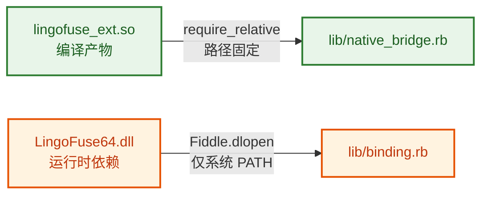

**编译与运行时是两条独立的路径**。本指南只涉及编译路径；运行时路径见 `INSTALL_DEPENDENCIES.md`。

---

## 四、编译前自检

在动手之前，先确认环境。两种方式任选：

### 方式 A：使用 setup_build_env.ps1（推荐）

打开 PowerShell：

```powershell
cd D:\CoreLibrary\LingoFuse\ruby
powershell -ExecutionPolicy Bypass -File setup_build_env.ps1
```

### 4.1 setup_build_env.ps1 的内部流程

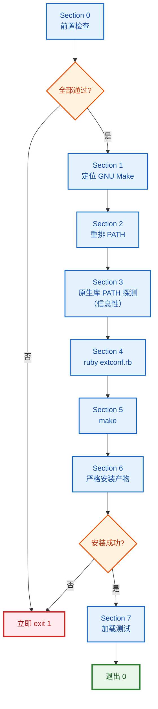

### 4.2 Section 0 前置检查明细

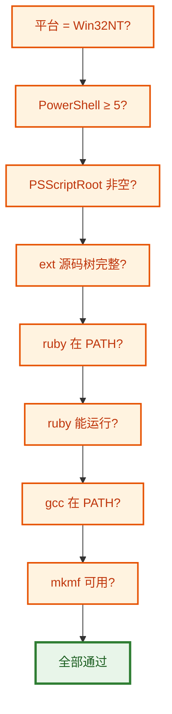

### 4.3 Section 6 严格安装

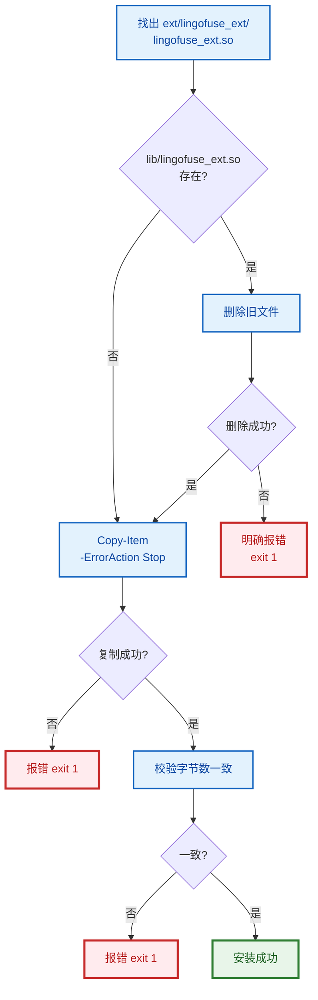

**期望的关键输出**：

```
========================================================================
1. Locating a GNU Make
========================================================================
  [OK]   GNU Make found:
           path    : C:\Ruby40-x64\msys64\usr\bin\make.exe
           version : GNU Make 4.4.1
...
========================================================================
3. LingoFuse native library (informational)
========================================================================
  [OK]   Found on PATH: LingoFuse64.dll
           directory: D:\LingoFuse\Binary
  [OK]     sibling present: z_ipc_64.dll
  [OK]     sibling present: mimalloc64.dll
  [OK]     sibling present: mimalloc-redirect.dll
...
========================================================================
5. make
========================================================================
         compiling lingofuse_ext.c
         linking shared-object lingofuse_ext.so
  [OK]   make completed successfully.

========================================================================
6. Artifact
========================================================================
  [OK]   Built: lingofuse_ext.so (45056 bytes)
  [OK]   Installed: D:\...\lib\lingofuse_ext.so (45056 bytes)

========================================================================
7. Load test
========================================================================
         LOADED: true true true
  [OK]   lingofuse_ext loads and exposes the full expected surface.
```

> Section 3 是**信息性**的。如果原生库不在 PATH 上，只输出 `[WARN]`，不阻塞编译。加载测试（Section 7）也不依赖原生库，因为 C 扩展本身不链接 LingoFuse。

### 方式 B：手动编译

如果不使用脚本，在 PowerShell 里**逐个执行**：

```powershell
cd D:\CoreLibrary\LingoFuse\ruby\ext\lingofuse_ext

# 1. 找到 GNU Make 的路径
Get-Command make
# 如果返回 Embarcadero 的路径，手动用 msys64 里的 make：
#   C:\Ruby40-x64\msys64\usr\bin\make.exe

# 2. 删除过期 Makefile（如果存在）
Remove-Item Makefile -ErrorAction SilentlyContinue

# 3. 生成 Makefile
ruby extconf.rb

# 4. 编译
C:\Ruby40-x64\msys64\usr\bin\make.exe

# 5. 复制产物到 lib/
Copy-Item lingofuse_ext.so ..\..\lib\ -Force
```

---

## 五、编译失败排查

### 问题 1：`Fatal makefile ... No terminator specified for in-line file operator`

**原因**：调用了 Embarcadero / Borland Make。

**诊断**：

```powershell
Get-Command make
```

**修复**：改用 msys64 的 make，或使用 `setup_build_env.ps1` 自动处理。

### 问题 2：`gettimeofday` 类型冲突

**错误信息**：

```
error: conflicting types for 'gettimeofday'
note: previous declaration of 'gettimeofday' with type 'int(struct timeval *, struct timezone *)'
```

**原因**：MinGW-w64 的 `<sys/time.h>` 与 Ruby 的 `ruby/win32.h` 对 `gettimeofday` 的签名不同，两个头文件同时引入会冲突。

**修复**：`lingofuse_ext.c` 中**不要**包含 `<sys/time.h>`，直接使用 `clock_gettime`（winpthreads 已提供）。

### 问题 3：`clock_gettime` 未定义

**错误信息**：

```
undefined reference to 'clock_gettime'
```

**原因**：极少数 MinGW 工具链不提供 `clock_gettime`。

**修复**：确认 `extconf.rb` 中 `have_library('pthread')` 检测通过。如果依然失败，说明 DevKit 不完整，需要重装 RubyInstaller + DevKit。

### 问题 4：`ruby/thread.h` 找不到

**错误信息**：

```
ruby/thread.h: No such file or directory
```

**原因**：使用了完整版 Ruby 但缺少开发头文件。

**修复**：

```powershell
ruby -e "require 'rbconfig'; puts RbConfig::CONFIG['rubyhdrdir']"
```

路径应该指向 `C:/Ruby40-x64/include/ruby-4.0.0`。如果该目录不存在，重装 RubyInstaller 时勾选 "Install development headers"。

### 问题 5：`cannot load such file -- lingofuse_ext`

**原因**：编译成功但 `.so` 不在 `lib/` 下，或 `lib/` 与 `native_bridge.rb` 的相对位置不对。

**诊断**：

```powershell
Get-Item lib\lingofuse_ext.so
```

**修复**：

```powershell
Copy-Item ext\lingofuse_ext\lingofuse_ext.so lib\ -Force
```

`native_bridge.rb` 用 `require_relative '../lingofuse_ext'` 加载扩展，即以 `lib/lingofuse/` 为基准，向上找 `lib/lingofuse_ext.so`。所以 `.so` 必须在 `lib/` 下，与 `lingofuse/` 同级。


如果 `.so` 放在了别处（例如 `ext/lingofuse_ext/`），`require_relative` 找不到，会静默失败并退回 Fiddle 路径。

### 问题 6：`.so` 加载时报 `[BUG] rb_thread_call_with_gvl()`

**原因**：跑的是 Fiddle fallback 路径，说明 `lingofuse_ext.so` **没有加载成功**。通常是因为文件位置不对（见问题 5）。

**诊断**：

```powershell
ruby -I lib -e "require 'lingofuse_ext'; puts 'OK'"
```

如果这行报 `LoadError`，说明 `.so` 不在 `lib/`。

---

## 六、编译后验证

### 6.1 加载测试

```powershell
cd D:\CoreLibrary\LingoFuse\ruby
ruby -I lib -e "require 'lingofuse_ext'; puts LingoFuse::NativeBridge.respond_to?(:create_ref)"
```

**期望输出**：`true`

### 6.2 独立自测

`test/test_native_bridge_self_test.rb` 是**不依赖 LingoFuse 网络层**的单元测试。它直接调用 C 扩展的 trampoline，模拟 native 线程回调，验证队列 + 调度线程的工作。

```powershell
ruby test/test_native_bridge_self_test.rb
```

**期望输出**：

```
Run options: --seed xxxxx

# Running:

..................

Finished in 0.788307s, 22.8337 runs/s, 69.7697 assertions/s.

18 runs, 55 assertions, 0 failures, 0 errors, 0 skips
```

**测试覆盖**：

| # | 测试 | 验证点 |
|:-:|---|---|
| 1 | `test_extension_exposes_expected_methods` | 扩展暴露了全部 11 个方法 |
| 2 | `test_trampoline_addresses_are_nonzero_and_distinct` | 4 个 trampoline 地址都是非零且互不相同 |
| 3 | `test_create_ref_returns_nonzero_address` | `create_ref` 返回非零 Integer |
| 4 | `test_create_ref_rejects_non_proc` | 参数必须是 Proc |
| 5 | `test_free_ref_with_zero_is_a_noop` | `free_ref(0)` 是 no-op |
| 6 | `test_wait_for_work_returns_false_when_queue_is_empty` | 空队列时 `wait_for_work` 返回 false |
| 7 | `test_call_trigger_invokes_proc_with_two_args` | Call 回调收到 2 个参数，地址往返一致 |
| 8 | `test_call_trigger_with_null_output_still_passes_two_args` | NULL output 依然传 2 个参数 |
| 9 | `test_notify_trigger_invokes_proc_with_one_arg` | Notify 回调收到 1 个参数 |
| 10 | `test_proc_runs_on_a_ruby_thread` | Proc 运行在 Ruby 线程上，不是调用线程 |
| 11 | `test_proc_exception_does_not_block_the_trampoline` | 回调异常不阻塞 trampoline |
| 12 | `test_concurrent_triggers_all_deliver` | 5 个并发触发全部送达 |
| 13 | `test_sequential_triggers_preserve_fifo_order` | 顺序触发保持 FIFO |
| 14 | `test_network_connect_event_from_native_thread` | 网络连接事件从 native 线程触发 |
| 15 | `test_network_disconnect_event_from_native_thread` | 网络断开事件从 native 线程触发 |
| 16 | `test_network_connect_event_in_place` | 网络事件在 GVL 持有路径下执行 |
| 17 | `test_network_event_with_null_addr_passes_nil` | NULL 地址传 nil |
| 18 | `test_network_event_exception_does_not_block` | 网络事件异常不阻塞 |

**日志中出现的以下内容是预期的**，不是错误：

```
[LingoFuse::NativeBridge] callback raised: intentional failure from self-test
[LingoFuse::NativeBridge] callback raised: intentional network failure
```

这两条来自自测 11 和 18，是故意触发的 C 端 fallback 日志（因为自测**直接**调用 C 端 trampoline，绕过了 Ruby 包装层的异常捕获）。

### 6.3 集成测试

编译后重跑全部 Ruby 测试，确认无回归：

```powershell
ruby test/test_app_handle.rb
ruby test/test_app_handle_extra.rb
ruby test/test_network_events.rb
ruby test/test_callback_error_reporter.rb
```

**期望全部 `0 failures, 0 errors, 0 skips`**。

---

## 七、编译后如何判断扩展生效

**日志会告诉你**。

### 7.1 生效时（NativeBridge 路径）

用户回调抛异常时，日志长这样：

```
[LingoFuse] Callback error in AppHandle.register_call[boom]: RuntimeError: ...
```

注意前缀是 `[LingoFuse]` —— **这是 Ruby 层 `CallbackErrorReporter` 的输出**，说明 Ruby 包装层捕获了异常，根本没有到达 C 端。

### 7.2 未生效时（Fiddle fallback 路径）

同样场景，日志长这样：

```
[LingoFuse::NativeBridge] callback raised: ...
```

注意前缀是 `[LingoFuse::NativeBridge]` —— **这是 C 端 `fprintf(stderr, ...)` 的输出**，是最后的兜底路径。

### 7.3 两条路径的判定逻辑

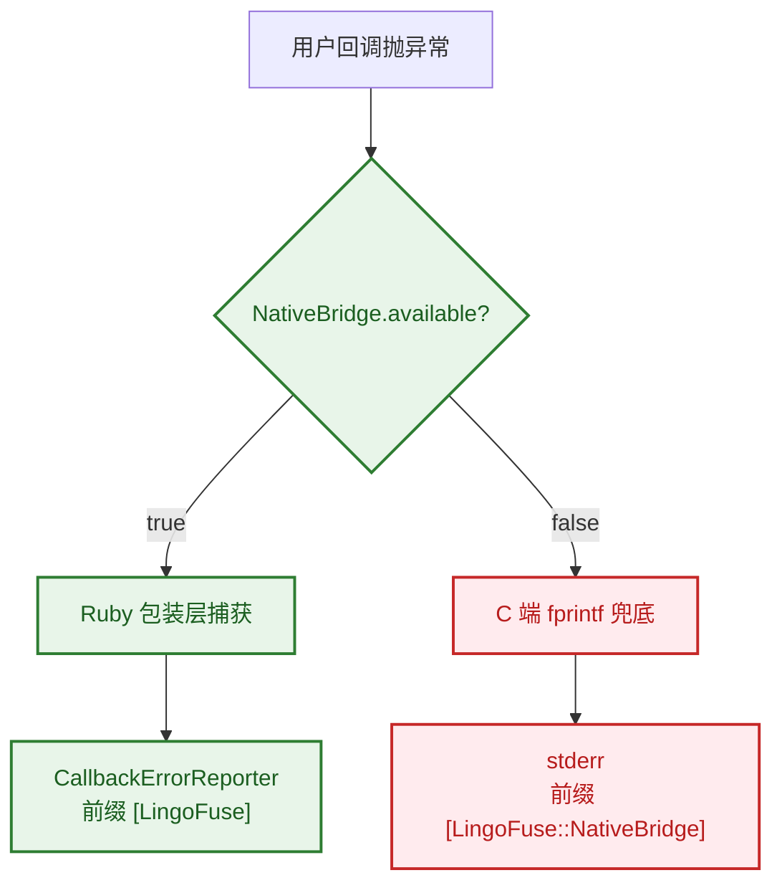

**两者同时出现在同一段日志里**，说明扩展已加载，但有些回调路径没走 Ruby 包装层（通常是自测直接调 C trampoline 导致的）。

---

## 八、修改源码后重新编译

修改 `lingofuse_ext.c` 后：

```powershell
cd D:\CoreLibrary\LingoFuse\ruby
powershell -ExecutionPolicy Bypass -File setup_build_env.ps1
```

脚本会**自动删除旧 Makefile**，重新运行 `extconf.rb` 和 `make`，并覆盖 `lib/lingofuse_ext.so`。

修改 `extconf.rb` 后同样流程。修改 `native_bridge.rb` 或其他 Ruby 文件**不需要重新编译** —— 直接跑测试即可。

### 8.1 何时需要重编译

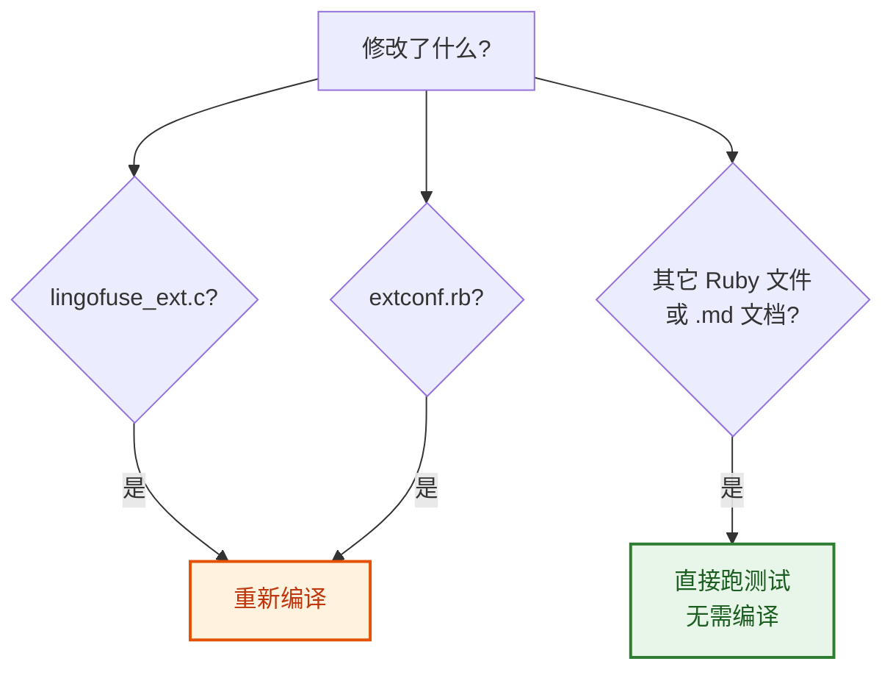

---

## 九、清理

```powershell
cd D:\CoreLibrary\LingoFuse\ruby

# 完整清理（推荐，脚本自动识别目标）
powershell -ExecutionPolicy Bypass -File clean.ps1

# 或手动清理
cd ext\lingofuse_ext
Remove-Item Makefile, mkmf.log, *.o, *.so, *.def -ErrorAction SilentlyContinue
```

`lib/lingofuse_ext.so` 是生产用的副本，删除它会导致运行时加载失败。`clean.ps1` 默认会删它，可用 `-KeepInstalled` 保留。

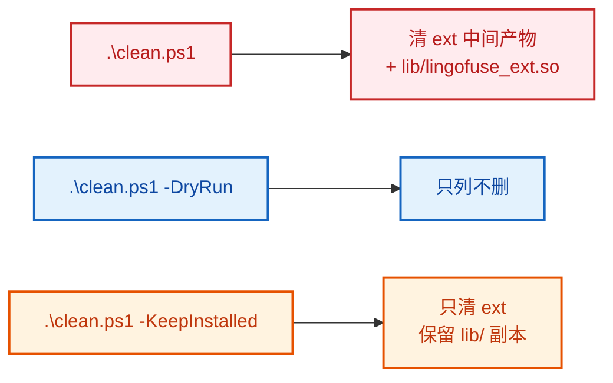