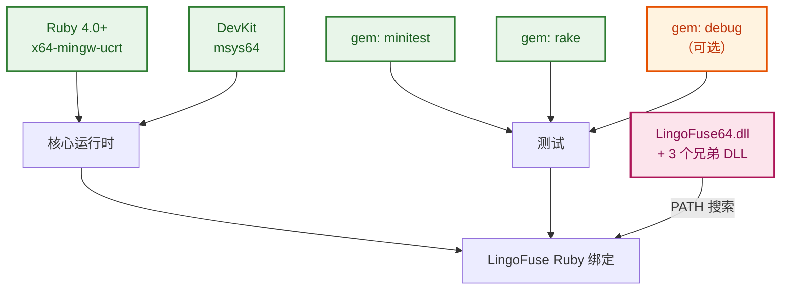
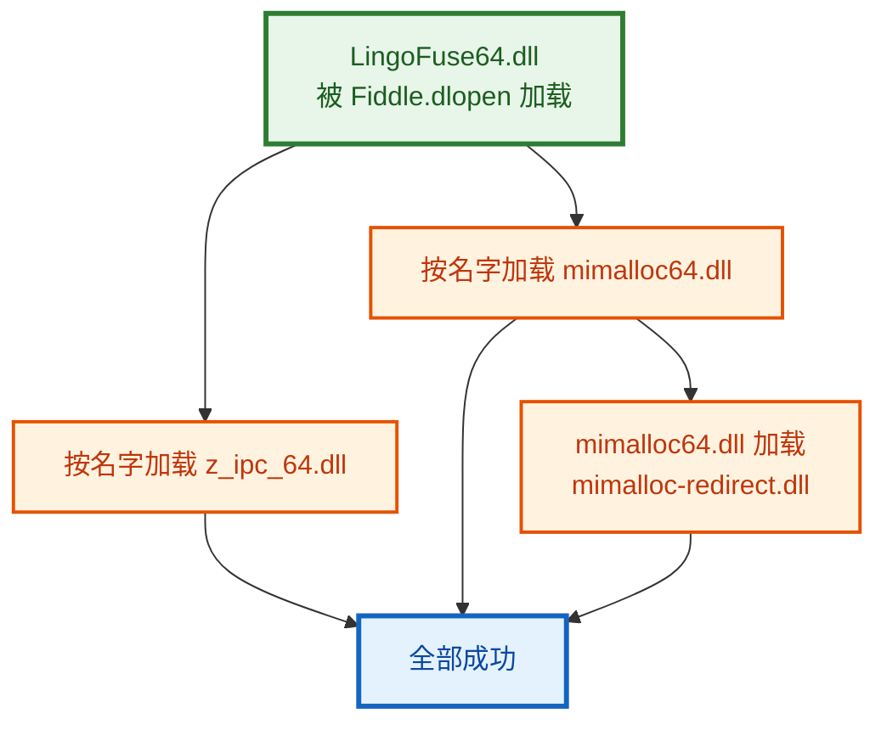
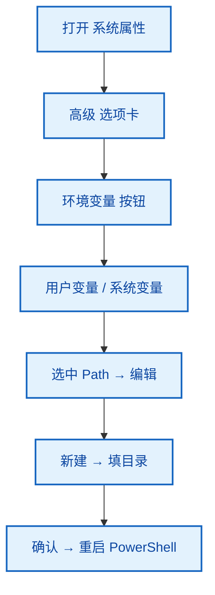
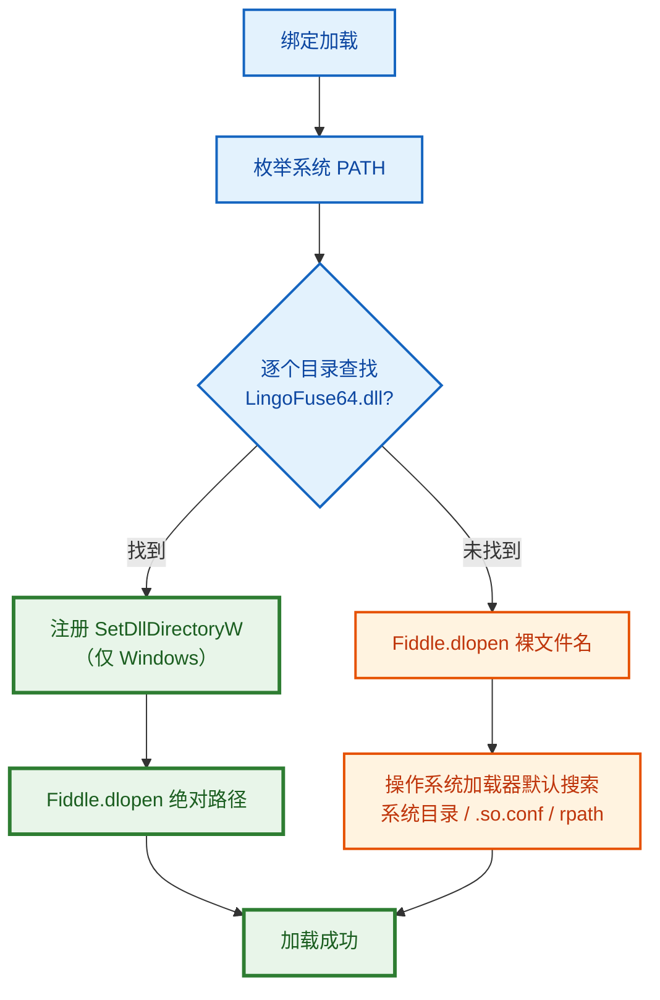
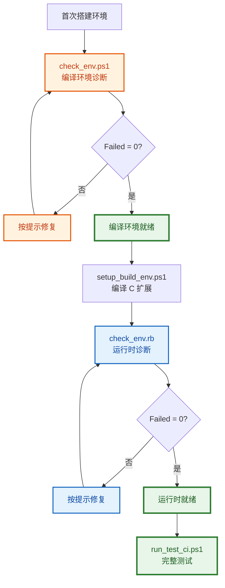
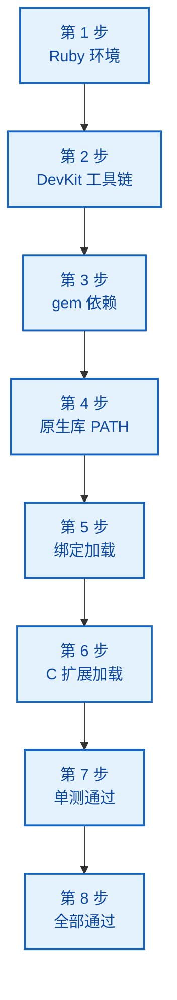
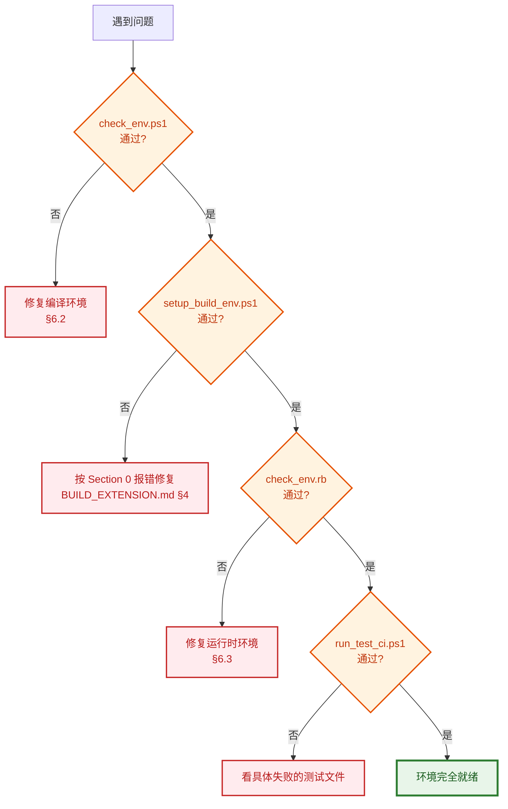
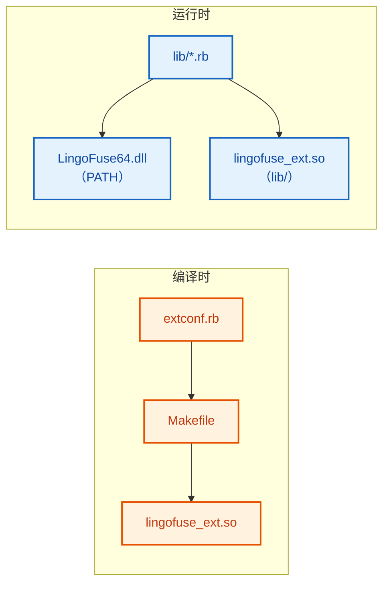

# Ruby 依赖安装指南

本指南描述 LingoFuse Ruby 绑定所需的运行环境和依赖库，以及在 Windows 上的具体安装步骤。

---

## 一、总览

| 依赖 | 用途 | 安装方式 |
|---|---|---|
| Ruby 4.0+ (x64-mingw-ucrt) | 运行环境 | RubyInstaller 安装包 |
| DevKit（随 RubyInstaller） | 编译 C 扩展 | RubyInstaller 安装包 + `msys64` |
| `minitest`（gem） | 测试框架 | `gem install minitest` |
| `rake`（gem） | 任务运行器 | `gem install rake` |
| `debug`（gem） | 调试器后端 | `gem install debug` |
| 系统 `pthread` | C 扩展线程原语 | DevKit 自带 |
| `LingoFuse64.dll` | 原生 RPC 库 | 从 `Binary/` 目录获取，放到 PATH 上 |

**Fiddle 是 Ruby 标准库的一部分**，不需要单独安装。FFI gem **不是**本绑定的依赖。

### 1.1 依赖层级



---

## 二、Ruby 运行环境

### 2.1 安装 RubyInstaller

从 [RubyInstaller for Windows](https://rubyinstaller.org/downloads/) 下载：

- **Ruby+Devkit 4.0.x (x64)**（不是不带 Devkit 的版本）

安装时勾选：

- ☑ Add Ruby executables to your PATH
- ☑ Associate `.rb` and `.rbw` files with this Ruby installation
- ☑ Install MSYS2 development toolchain

**安装完成后必须重启 PowerShell**，否则 PATH 变更不生效。

### 2.2 验证

打开**新的** PowerShell：

```powershell
ruby -v
```

**期望**：

```
ruby 4.0.7 (2026-09-15 revision 229531a6cf) +PRISM [x64-mingw-ucrt]
```

**关键**：`x64-mingw-ucrt` 是正确平台。如果显示 `x64-mswin64` 或 `x86-mingw32`，说明装错了版本。

```powershell
gem -v
```

**期望**：`4.x.x` 或更高。

### 2.3 检查安装路径

```powershell
ruby -e "require 'rbconfig'; puts RbConfig::CONFIG['bindir']"
```

**期望**（大致）：

```
C:/Ruby40-x64/bin
```

记下这个路径，后面配置 VS Code 或调试器时会用到。

---

## 三、DevKit（编译 C 扩展必需）

### 3.1 确认 DevKit 已安装

```powershell
Get-Command make
Get-Command gcc
```

**期望**：

| 命令 | 期望输出 |
|---|---|
| `make` | `C:\Ruby40-x64\msys64\usr\bin\make.exe` |
| `gcc` | `...\mingw64\bin\gcc.exe` 或 `D:\mingw64\bin\gcc.exe` |

### 3.2 检查 make 不是 Embarcadero 版本

```powershell
make --version
```

**期望**：

```
GNU Make 4.4.1
```

**如果显示 Embarcadero / Borland / CodeGear**：

Embarcadero 的 `make.exe` 与 GNU Make 不兼容，会导致 mkmf 生成的 Makefile 编译失败。

| 修复方法 | 命令 | 作用范围 |
|:--------:|------|----------|
| 1 | `$env:PATH = "C:\Ruby40-x64\msys64\usr\bin;" + $env:PATH` | 当前会话 |
| 2 | 系统设置 → 环境变量：把 msys64 路径移到 Embarcadero 之前 | 永久 |
| 3 | 使用项目自带的 `setup_build_env.ps1`，自动处理 | 脚本内 |

### 3.3 检查 MSYS2 环境

DevKit 通过 MSYS2 提供。检查目录：

```powershell
Test-Path C:\Ruby40-x64\msys64\usr\bin\make.exe
Test-Path C:\Ruby40-x64\msys64\mingw64\bin\gcc.exe
```

两条都应该是 `True`。

如果 `msys64` 不存在，说明安装 RubyInstaller 时没有勾选 DevKit。**重新运行 RubyInstaller 安装包**，选择 "Add or remove components"，勾选 "MSYS2 development toolchain"。

### 3.4 检查头文件

编译 C 扩展需要 Ruby 头文件：

```powershell
ruby -e "require 'rbconfig'; puts RbConfig::CONFIG['rubyhdrdir']"
ruby -e "require 'rbconfig'; puts RbConfig::CONFIG['rubyarchhdrdir']"
```

**期望**：

```
C:/Ruby40-x64/include/ruby-4.0.0
C:/Ruby40-x64/include/ruby-4.0.0/x64-mingw-ucrt
```

确认关键头文件存在：

```powershell
Test-Path C:\Ruby40-x64\include\ruby-4.0.0\ruby\thread.h
```

**期望**：`True`

---

## 四、gem 依赖

### 4.1 minitest

测试框架（Ruby 内置版本通常已足够，但显式安装保证一致性）：

```powershell
gem install minitest
```

**期望**：

```
Successfully installed minitest-5.x.x
1 gem installed
```

**验证**：

```powershell
ruby -e "require 'minitest/autorun'; puts 'minitest OK'"
```

**期望**：`minitest OK`

### 4.2 rake

任务运行器，用来执行 `Rakefile`：

```powershell
gem install rake
```

**验证**：

```powershell
cd D:\CoreLibrary\LingoFuse\ruby
rake -T
```

**期望**：列出所有 `rake test:*` 任务（约 15-20 条）。

### 4.3 debug

Ruby 调试器的后端。用 VS Code 的 rdbg 扩展调试时需要：

```powershell
gem install debug
```

**期望**：

```
Building native extensions. This could take a while...
Successfully installed debug-1.11.1
1 gem installed
```

**注意**：`debug` 需要编译原生扩展，所以**必须先装好 DevKit**。如果这步报错，回到第三节检查 DevKit。

**验证**：

```powershell
ruby -e "require 'debug'; puts 'debug OK'"
```

**期望**：`debug OK`

### 4.4 不需要的 gem

以下 gem **不是**本绑定的依赖，不用装：

| gem | 为什么不需要 |
|---|---|
| `ffi` | 本绑定用标准库 Fiddle，不用 FFI |
| `ffi-compiler` | 同上 |
| `sqlite3` | 无关 |
| `json` | 已内置 Ruby 标准库 |
| `rubocop` | 代码风格工具，可选 |

---

## 五、原生库（LingoFuse64.dll）

### 5.1 定位原则

原生库（`LingoFuse64.dll` 及其三个兄弟 DLL）由 `lib/lingofuse/binding.rb` 在**运行时**通过 `Fiddle.dlopen` 加载。**加载路径仅来自操作系统的库搜索路径**：

| 平台 | 环境变量 | 分隔符 |
|------|----------|:------:|
| Windows | `PATH` | `;` |
| Linux / BSD | `LD_LIBRARY_PATH` | `:` |
| macOS | `DYLD_LIBRARY_PATH` + `DYLD_FALLBACK_LIBRARY_PATH` | `:` |

**没有绑定专属的环境变量**（例如旧的 `LINGOFUSE_LIB_PATH` 已被移除）。这与任何其他 Windows 程序使用 PATH 的行为一致，也是唯一的机制。

### 5.2 需要的文件

四个 DLL **必须放在同一目录**：

| 文件 | 用途 |
|---|---|
| `LingoFuse64.dll` | 核心 RPC 库 |
| `z_ipc_64.dll` | IPC 底层 |
| `mimalloc64.dll` | 内存分配器 |
| `mimalloc-redirect.dll` | mimalloc 重定向 |

**为什么必须同一目录**：`LingoFuse64.dll` 加载时会**按文件名**加载另外三个 DLL。Windows 加载器在 `LoadLibrary` 时不会自动搜索"已加载 DLL 自己的目录"，所以它们必须在同一个目录里，且该目录必须在 `PATH` 上。



**少一个 DLL，或分散到不同目录，加载会失败并报 `The specified module could not be found`。**

### 5.3 放置位置

推荐放到一个独立目录，例如：

```
D:\LingoFuse\Binary\
├── LingoFuse64.dll
├── z_ipc_64.dll
├── mimalloc64.dll
└── mimalloc-redirect.dll
```

然后把这个目录加到 `PATH` 上。

### 5.4 把目录加入 PATH

**当前 PowerShell 会话**：

```powershell
$env:PATH = "D:\LingoFuse\Binary;" + $env:PATH
```

**永久生效**（Windows 系统设置）：

1. `Win + R` → `sysdm.cpl` → 高级 → 环境变量
2. 在"用户变量"或"系统变量"里找到 `Path`
3. 添加 `D:\LingoFuse\Binary`
4. 确认，重启 PowerShell



**Linux / BSD**（`~/.bashrc` 或 `~/.zshrc`）：

```bash
export LD_LIBRARY_PATH="/opt/lingofuse/lib:$LD_LIBRARY_PATH"
```

**macOS**（`~/.zshrc`）：

```bash
export DYLD_LIBRARY_PATH="/opt/lingofuse/lib:$DYLD_LIBRARY_PATH"
```

### 5.5 验证

**新开一个 PowerShell**，确认 PATH 已经包含目标目录：

```powershell
$env:PATH -split ';' | Select-String "LingoFuse"
```

**期望**：输出包含 `D:\LingoFuse\Binary` 的那一行。

然后跑绑定加载：

```powershell
cd D:\CoreLibrary\LingoFuse\ruby
ruby -I lib -e "require 'lingofuse'; puts LingoFuse.loaded?; puts LingoFuse.library_name"
```

**期望**：

```
true
LingoFuse64.dll
```

### 5.6 运行时搜索顺序

`binding.rb` 的搜索顺序**只有**下面两条：



**没有**下面这些路径：

- ❌ `LINGOFUSE_LIB_PATH` 环境变量（已移除）
- ❌ 绑定自身目录
- ❌ `Binary/` 子目录
- ❌ 项目根目录
- ❌ 当前工作目录

**只有 PATH。** 如果 PATH 上没有，就是找不到。

---

## 六、一键环境诊断

项目自带两个诊断脚本，用途不同。

### 6.1 分工

| 脚本 | 检查对象 | 何时运行 |
|---|---|---|
| `check_env.ps1` | 编译 C 扩展的**工具链** | 首次搭建环境、编译失败时 |
| `check_env.rb` | Ruby 绑定的**运行时** | 首次使用、加载失败时 |



### 6.2 `check_env.ps1` — 编译环境诊断

```powershell
cd D:\CoreLibrary\LingoFuse\ruby
powershell -ExecutionPolicy Bypass -File check_env.ps1
```

**检查内容**（8 个 Section）：

| Section | 检查项 |
|:-------:|--------|
| 1 | PowerShell 版本 + 操作系统 |
| 2 | Ruby 版本 / 平台 / `RbConfig` |
| 3 | **GNU Make（区分 Embarcadero）+ gcc** |
| 4 | `mkmf` 可用性 + 实际编译一个 C 程序 |
| 5 | `pthread.h` 编译链接 + `ruby/thread.h` 存在 |
| 6 | **原生库 PATH 探测**（信息性，缺失仅 WARN） |
| 7 | 扩展源码树完整性 |
| 8 | 汇总报告 |

**期望尾部**：

```
  Passed : 26
  Warned : 0
  Failed : 0

  All required checks passed.
```

**Section 6 特别说明**：这一节直接枚举 `$env:PATH`，逐个目录查找 `LingoFuse64.dll`。找到后还会验证 3 个兄弟 DLL 是否同目录。找不到只报 `[WARN]`，不阻塞。

### 6.3 `check_env.rb` — 运行时诊断

```powershell
ruby check_env.rb
```

**检查内容**（5 个 Section）：

| Section | 检查项 |
|:-------:|--------|
| 1 | Ruby 版本 |
| 2 | 包布局（11 个 lib 文件 + 3 个 test 文件） |
| 3 | 原生库加载 + C ABI 往返（create / write / read / free） |
| 4 | 全栈冒烟测试 + **C 扩展加载状态** |
| 5 | 汇总 |

**期望尾部**：

```
  Passed : 26
  Failed : 0
```

**关键检查**：

```
  [OK]   lingofuse_ext is loaded (NativeBridge available).
```

如果显示 `[FAIL] lingofuse_ext is NOT available`，说明 C 扩展未正确安装，需要回到 `BUILD_EXTENSION.md` 重新编译。

---

## 七、完整验证清单

按顺序执行以下命令，每步都通过再进行下一步：

### 第 1 步：Ruby 环境

```powershell
ruby -v
gem -v
```

**期望**：Ruby 4.0+，`x64-mingw-ucrt`，gem 4.x+。

### 第 2 步：DevKit 工具链

```powershell
make --version
gcc --version
```

**关键**：`make --version` 必须显示 `GNU Make`。

### 第 3 步：gem 依赖

```powershell
gem list minitest rake debug
```

**期望**：列出这三个 gem 及版本号。

### 第 4 步：原生库在 PATH 上

```powershell
$env:PATH -split ';' | Select-String "LingoFuse"
```

**期望**：输出包含目标目录的那一行。

或者用 `check_env.ps1` 的 Section 6 结果作为权威判断。

### 第 5 步：绑定加载

```powershell
cd D:\CoreLibrary\LingoFuse\ruby
ruby -I lib -e "require 'lingofuse'; puts LingoFuse.loaded?"
```

**期望**：`true`

### 第 6 步：C 扩展加载

```powershell
ruby -I lib -e "require 'lingofuse_ext'; puts LingoFuse::NativeBridge.respond_to?(:create_ref)"
```

**期望**：`true`

### 第 7 步：跑一个测试

```powershell
ruby test/test_errors.rb
```

**期望**：

```
23 runs, 39 assertions, 0 failures, 0 errors, 0 skips
```

### 第 8 步：跑全部测试

```powershell
powershell -ExecutionPolicy Bypass -File run_test_ci.ps1
```

**期望尾部**：

```
========================================================================
All 14 test files passed.
========================================================================
```

### 7.1 验证流程图



---

## 八、VS Code 配置（可选）

如果要在 VS Code 里调试 Ruby：

### 8.1 安装扩展

Extensions 面板搜索并安装：

| 扩展 | 作者 | 用途 |
|---|---|---|
| **VSCode rdbg Ruby Debugger** | Koichi Sasada | 断点调试（必需） |
| Ruby LSP | Shopify | 语法提示（可选） |

**不要装**：`Ruby`（旧版，已弃用）、`ruby-debug-ide`（过时）。

### 8.2 用户设置

按 `Ctrl + Shift + P` → `Preferences: Open User Settings (JSON)`，加入：

```json
{
  "rdbg.ruby": "C:\\Ruby40-x64\\bin\\ruby.exe",
  "rdbg.useBundler": false
}
```

路径要根据 `RbConfig::CONFIG['bindir']` 的实际输出调整。

### 8.3 项目设置

创建 `D:\CoreLibrary\LingoFuse\ruby\.vscode\launch.json`：

```json
{
  "version": "0.2.0",
  "configurations": [
    {
      "type": "rdbg",
      "name": "Debug current file",
      "request": "launch",
      "script": "${file}",
      "args": [],
      "useBundler": false
    },
    {
      "type": "rdbg",
      "name": "Debug cross_service.rb",
      "request": "launch",
      "script": "${workspaceFolder}/cross/cross_service.rb",
      "args": [],
      "useBundler": false
    },
    {
      "type": "rdbg",
      "name": "Debug cross_node.rb",
      "request": "launch",
      "script": "${workspaceFolder}/cross/cross_node.rb",
      "args": [],
      "useBundler": false
    },
    {
      "type": "rdbg",
      "name": "Debug cross_call.rb",
      "request": "launch",
      "script": "${workspaceFolder}/cross/cross_call.rb",
      "args": [],
      "useBundler": false
    }
  ]
}
```

### 8.4 断点调试

1. 打开目标 `.rb` 文件
2. 点击行号左侧空白处，出现红点（断点）
3. 按 `F5`，从下拉选择调试配置
4. 程序停到断点处，左侧 "Variables" 面板显示当前作用域

**多进程注意**：`Cross Demo` 是三个独立进程，VSCode 一次只能调试一个。典型做法是：

- VSCode 调试 `cross_service.rb`
- PowerShell 独立窗口跑 `ruby cross/cross_node.rb` 和 `ruby cross/cross_call.rb`

---

## 九、故障排查速查表

| 症状 | 原因 | 修复 |
|---|---|---|
| `ruby: command not found` | PATH 未生效 | 重启 PowerShell 或重装 RubyInstaller |
| `cannot load such file -- lingofuse` | `$LOAD_PATH` 未包含 `lib/` | 用 `require_relative` 或 `-I lib` |
| `Failed to load the LingoFuse native library` | 原生库不在 PATH 上 | 见 §5.4，把目录加入 PATH |
| `The specified module could not be found` | 兄弟 DLL 缺失或分散 | 4 个 DLL 必须同一目录 |
| `[BUG] rb_thread_call_with_gvl()` | C 扩展未编译 | 跑 `setup_build_env.ps1` |
| `[LingoFuse::NativeBridge] lingofuse_ext not available` | C 扩展不在 `lib/` | 见 BUILD_EXTENSION.md 问题 5 |
| `No GNU Make found` | DevKit 未安装 / PATH 顺序 | 见 §3.2 |
| `Fatal makefile ... No terminator` | 用了 Embarcadero Make | 前置 msys64 到 PATH |
| `gettimeofday: conflicting types` | 头文件冲突 | 更新 `lingofuse_ext.c`（去 `<sys/time.h>`） |
| `undefined reference to 'clock_gettime'` | MinGW 缺 pthread | 重装 DevKit |
| `gem install debug` 失败 | DevKit 未装 | 先装 DevKit 再装 debug |
| `cannot load such file -- debug` | gem 未安装 | `gem install debug` |
| `Workspace not activated` (VS Code) | 工作区 URI 异常 | 用 `code .` 而不是 `code <path>` 打开 |
| `Cannot find any Ruby installations` (Ruby LSP) | 扩展检测失败 | 卸载 Ruby LSP，或用 rdbg 替代 |

### 9.1 通用排查顺序



---

## 十、文件清单

完成后，项目应该包含以下与依赖相关的文件：

```
ruby/
├── Gemfile                          声明开发依赖
├── lingofuse.gemspec                gem 元数据（不含 runtime 依赖）
├── Rakefile                         rake 任务
├── check_env.ps1                    编译环境诊断（PowerShell）
├── check_env.rb                     运行时环境诊断（Ruby）
├── setup_build_env.ps1              一键编译 C 扩展
├── clean.ps1                        清理编译产物
├── run_tests.ps1                    开发测试运行器（Windows）
├── run_test_ci.ps1                  CI 测试运行器（Windows）
├── run_test_ci.sh                   CI 测试运行器（Linux / macOS）
├── BUILD_EXTENSION.md               编译指南
├── INSTALL_DEPENDENCIES.md          本文件
├── README.md                        完整手册
├── lib/
│   ├── lingofuse.rb                 公共入口
│   ├── lingofuse_ext.so             C 扩展（编译产物）
│   └── lingofuse/                   绑定源码
├── ext/lingofuse_ext/               C 扩展源码
└── test/                            测试套件（14 个文件）
```

### 10.1 运行时依赖与编译时依赖



**关键区别**：

| 依赖 | 何时需要 | 位置要求 |
|------|:--------:|----------|
| `lingofuse_ext.so` | 编译时产出，运行时加载 | `lib/`（与 `lingofuse/` 同级） |
| `LingoFuse64.dll` | 仅运行时 | PATH 上的任意目录，4 个 DLL 同目录 |