# LingoFuse Ruby 绑定 — 完整手册

**版本**：1.0.0
**目标平台**：Windows 10 / 11 / Server 2019+（x64）
**Ruby 版本**：4.0+（x64-mingw-ucrt）

---

## 目录

1. [这是什么](#一这是什么)
2. [体系结构](#二体系结构)
3. [环境要求](#三环境要求)
4. [依赖安装](#四依赖安装)
5. [环境诊断](#五环境诊断)
6. [编译 C 扩展](#六编译-c-扩展)
7. [**在自有 Ruby 项目中引入 LingoFuse**](#七在自有-ruby-项目中引入-lingofuse)
8. [测试](#八测试)
9. [API 说明](#九api-说明)
10. [使用示例](#十使用示例)
11. [故障排查速查](#十一故障排查速查)

---

## 一、这是什么

LingoFuse Ruby 绑定让 Ruby 程序能够：

- **调用**由 Pascal / C++ / C# / Python / JavaScript / Rust / Go / Dart / Java / Swift / Zig / Erlang 写的函数
- **被**上述任何语言调用
- 在**同一进程内**、**同机跨进程**、或**跨机器**范围内工作
- 使用**字节级统一**的线格式，无需 IDL、无需桩代码、无需 HTTP 服务

一句话总结：

> **任何语言写的函数，任何其他语言都能直接调；Ruby 是 14 种一等公民语言之一。**

---

## 二、体系结构

### 2.1 五层架构

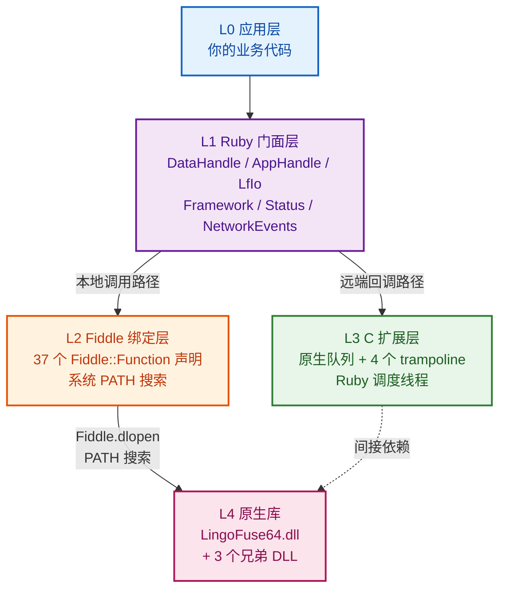
```mermaid
flowchart TD
    L0["L0 应用层<br/>你的业务代码"]
    L1["L1 Ruby 门面层<br/>DataHandle / AppHandle / LfIo<br/>Framework / Status / NetworkEvents"]
    L2["L2 Fiddle 绑定层<br/>37 个 Fiddle::Function 声明<br/>系统 PATH 搜索"]
    L3["L3 C 扩展层<br/>原生队列 + 4 个 trampoline<br/>Ruby 调度线程"]
    L4["L4 原生库<br/>LingoFuse64.dll<br/>+ 3 个兄弟 DLL"]

    L0 --> L1
    L1 -->|"本地调用路径"| L2
    L1 -->|"远端回调路径"| L3
    L2 -->|"Fiddle.dlopen<br/>PATH 搜索"| L4
    L3 -.->|"间接依赖"| L4

    classDef app fill:#E3F2FD,stroke:#1565C0,stroke-width:2px,color:#0D47A1
    classDef facade fill:#F3E5F5,stroke:#6A1B9A,stroke-width:2px,color:#4A148C
    classDef fiddle fill:#FFF3E0,stroke:#E65100,stroke-width:2px,color:#BF360C
    classDef cext fill:#E8F5E9,stroke:#2E7D32,stroke-width:2px,color:#1B5E20
    classDef native fill:#FCE4EC,stroke:#AD1457,stroke-width:2px,color:#880E4F

    class L0 app
    class L1 facade
    class L2 fiddle
    class L3 cext
    class L4 native
```

**依赖方向**：L0 → L1 → (L2 本地 / L3 远端) → L4。

### 2.2 C 扩展存在的必要性

**这是整个绑定最重要的设计决策。** Ruby 的 Fiddle **无法**从 LingoFuse 的原生工作线程回调 Ruby 代码。

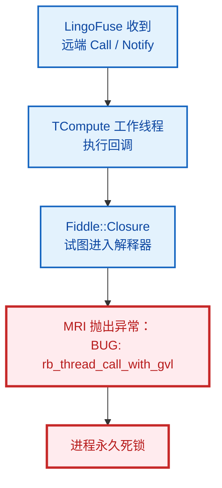
```mermaid
flowchart TD
    A["LingoFuse 收到<br/>远端 Call / Notify"] --> B["TCompute 工作线程<br/>执行回调"]
    B --> C["Fiddle::Closure<br/>试图进入解释器"]
    C --> D["MRI 抛出异常：<br/>BUG: rb_thread_call_with_gvl"]
    D --> E["进程永久死锁"]

    classDef ok fill:#E3F2FD,stroke:#1565C0,stroke-width:2px,color:#0D47A1
    classDef bad fill:#FFEBEE,stroke:#C62828,stroke-width:3px,color:#B71C1C
    class A,B,C ok
    class D,E bad
```

**决策表**：

| 使用场景 | 是否需要 C 扩展 |
|----------|:---------------:|
| 只做本地调用（`AppHandle#local_call` / `local_notify`） | 不需要 |
| 注册 Call / Notify API，但只从本地触发 | 不需要 |
| 需要接收远端调用（作为服务端） | **必需** |
| 需要网络事件回调 | **必需** |

### 2.3 C 扩展如何解决问题

**原生线程侧**：

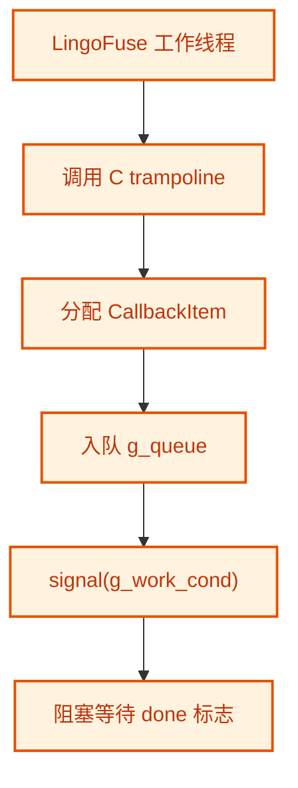
```mermaid
flowchart TD
    A["LingoFuse 工作线程"] --> B["调用 C trampoline"]
    B --> C["分配 CallbackItem"]
    C --> D["入队 g_queue"]
    D --> E["signal(g_work_cond)"]
    E --> F["阻塞等待 done 标志"]

    classDef native fill:#FFF3E0,stroke:#E65100,stroke-width:2px,color:#BF360C
    class A,B,C,D,E,F native
```

**Ruby 调度线程侧**：

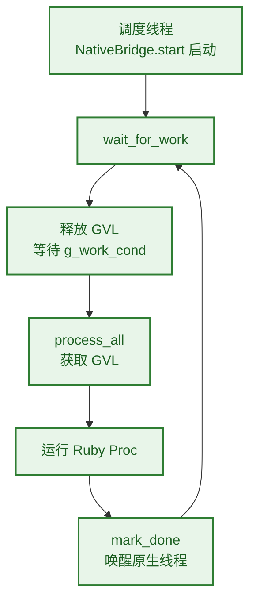
```mermaid
flowchart TD
    A["调度线程<br/>NativeBridge.start 启动"] --> B["wait_for_work"]
    B --> C["释放 GVL<br/>等待 g_work_cond"]
    C --> D["process_all<br/>获取 GVL"]
    D --> E["运行 Ruby Proc"]
    E --> F["mark_done<br/>唤醒原生线程"]
    F --> B

    classDef ruby fill:#E8F5E9,stroke:#2E7D32,stroke-width:2px,color:#1B5E20
    class A,B,C,D,E,F ruby
```

### 2.4 GVL 分流决策

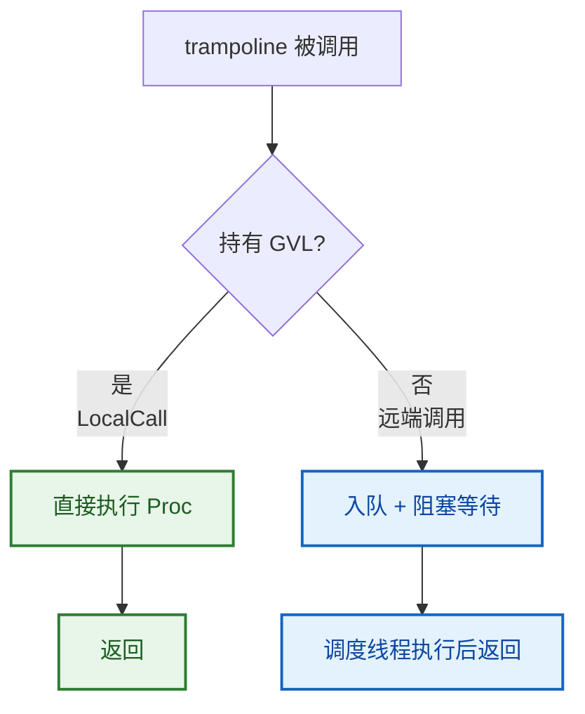
```mermaid
flowchart TD
    Start["trampoline 被调用"] --> Check{"持有 GVL?"}
    Check -->|"是<br/>LocalCall"| InPlace["直接执行 Proc"]
    Check -->|"否<br/>远端调用"| Enqueue["入队 + 阻塞等待"]

    InPlace --> Done1["返回"]
    Enqueue --> Done2["调度线程执行后返回"]

    classDef gvlHeld fill:#E8F5E9,stroke:#2E7D32,stroke-width:2px,color:#1B5E20
    classDef gvlFree fill:#E3F2FD,stroke:#1565C0,stroke-width:2px,color:#0D47A1
    class InPlace,Done1 gvlHeld
    class Enqueue,Done2 gvlFree
```

**为什么必须分流**：如果本地调用也走队列，主线程会阻塞在 `wait_for_item`，而调度线程需要 GVL 才能运行 —— 形成**死锁**。

### 2.5 DataHandle 生命周期状态机

**三种构造方式**：

| 构造 | 底层 API | 空闲回收 | dispose 语义 |
|------|----------|:--------:|--------------|
| `DataHandle.new(api)` | `LF_CreateData` | 10 分钟 | 只标记，池扫描时释放（≤ 5 秒） |
| `DataHandle.create_permanent(api)` | `LF_CreateData_Permanent` | 永不 | 立即同步释放 |
| `DataHandle.borrow(raw)` | 无 | 由原生层管理 | no-op |

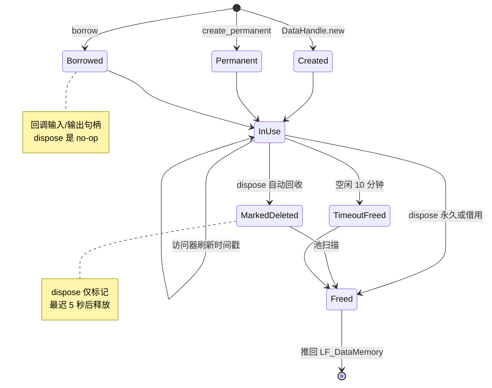
```mermaid
stateDiagram-v2
    [*] --> Created: DataHandle.new
    [*] --> Permanent: create_permanent
    [*] --> Borrowed: borrow

    Created --> InUse
    Permanent --> InUse
    Borrowed --> InUse

    InUse --> InUse: 访问器刷新时间戳
    InUse --> MarkedDeleted: dispose 自动回收
    InUse --> Freed: dispose 永久或借用
    InUse --> TimeoutFreed: 空闲 10 分钟

    MarkedDeleted --> Freed: 池扫描
    TimeoutFreed --> Freed
    Freed --> [*]: 推回 LF_DataMemory

    note right of Borrowed
        回调输入/输出句柄
        dispose 是 no-op
    end note
    note right of MarkedDeleted
        dispose 仅标记
        最迟 5 秒后释放
    end note
```

### 2.6 依赖关系

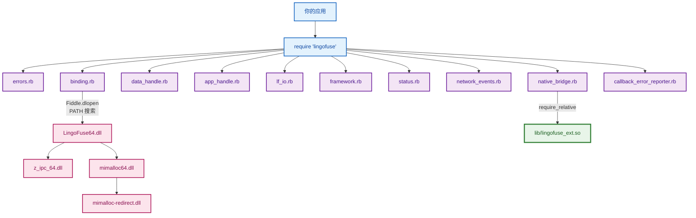
```mermaid
flowchart TD
    App["你的应用"] --> Load["require 'lingofuse'"]

    Load --> Errors["errors.rb"]
    Load --> Binding["binding.rb"]
    Load --> DataHandle["data_handle.rb"]
    Load --> AppHandle["app_handle.rb"]
    Load --> LfIo["lf_io.rb"]
    Load --> Framework["framework.rb"]
    Load --> Status["status.rb"]
    Load --> NetEvt["network_events.rb"]
    Load --> NatBridge["native_bridge.rb"]
    Load --> CBErr["callback_error_reporter.rb"]

    Binding -->|"Fiddle.dlopen<br/>PATH 搜索"| DLL["LingoFuse64.dll"]
    NatBridge -->|"require_relative"| Ext["lib/lingofuse_ext.so"]

    DLL --> ZIPC["z_ipc_64.dll"]
    DLL --> MI["mimalloc64.dll"]
    MI --> MIRed["mimalloc-redirect.dll"]

    classDef app fill:#E3F2FD,stroke:#1565C0,stroke-width:2px,color:#0D47A1
    classDef rb fill:#F3E5F5,stroke:#6A1B9A,stroke-width:2px,color:#4A148C
    classDef ext fill:#E8F5E9,stroke:#2E7D32,stroke-width:3px,color:#1B5E20
    classDef native fill:#FCE4EC,stroke:#AD1457,stroke-width:2px,color:#880E4F

    class App,Load app
    class Errors,Binding,DataHandle,AppHandle,LfIo,Framework,Status,NetEvt,NatBridge,CBErr rb
    class Ext ext
    class DLL,ZIPC,MI,MIRed native
```

### 2.7 文件布局

```
ruby/
├── README.md                      本文件
├── BUILD_EXTENSION.md             C 扩展编译指南
├── INSTALL_DEPENDENCIES.md        依赖安装指南
├── Gemfile                        Bundler 声明
├── lingofuse.gemspec              gem 元数据
├── Rakefile                       rake 任务
│
├── setup_build_env.ps1            C 扩展一键编译
├── clean.ps1                      清理编译产物
├── check_env.ps1                  编译环境诊断
├── check_env.rb                   运行时诊断
├── run_tests.ps1                  开发测试（Windows）
├── run_test_ci.ps1                CI 测试（Windows）
├── run_test_ci.sh                 CI 测试（Linux / macOS）
│
├── .vscode/
│   └── launch.json                VS Code 调试配置
│
├── lib/
│   ├── lingofuse.rb               公共入口
│   ├── lingofuse_ext.so           C 扩展（编译产物）
│   └── lingofuse/
│       ├── errors.rb              异常层级
│       ├── callback_error_reporter.rb
│       ├── binding.rb             Fiddle 声明 + PATH 搜索
│       ├── data_handle.rb
│       ├── app_handle.rb
│       ├── lf_io.rb
│       ├── framework.rb
│       ├── status.rb
│       ├── network_events.rb
│       └── native_bridge.rb
│
├── ext/lingofuse_ext/
│   ├── extconf.rb                 mkmf 配置
│   └── lingofuse_ext.c            C 源文件
│
├── cross/
│   ├── cross_service.rb           信标
│   ├── cross_node.rb              工作节点
│   └── cross_call.rb              压测客户端
│
└── test/                          14 个测试文件
    ├── test_errors.rb
    ├── test_callback_error_reporter.rb
    ├── test_module_helpers.rb
    ├── test_lf_io.rb
    ├── test_lf_io_extra.rb
    ├── test_data_handle.rb
    ├── test_data_handle_extra.rb
    ├── test_app_handle.rb
    ├── test_app_handle_extra.rb
    ├── test_status.rb
    ├── test_network_events.rb
    ├── test_framework.rb
    ├── test_network.rb
    └── test_native_bridge_self_test.rb
```

---

## 三、环境要求

### 3.1 硬件与操作系统

| 项 | 要求 |
|---|---|
| 操作系统 | Windows 10（1809+）/ Windows 11 / Windows Server 2019+ |
| 架构 | x64（ARM64 未测试） |
| 磁盘空间 | ≥ 1 GB（含 Ruby + DevKit） |
| 内存 | ≥ 4 GB |

### 3.2 软件清单

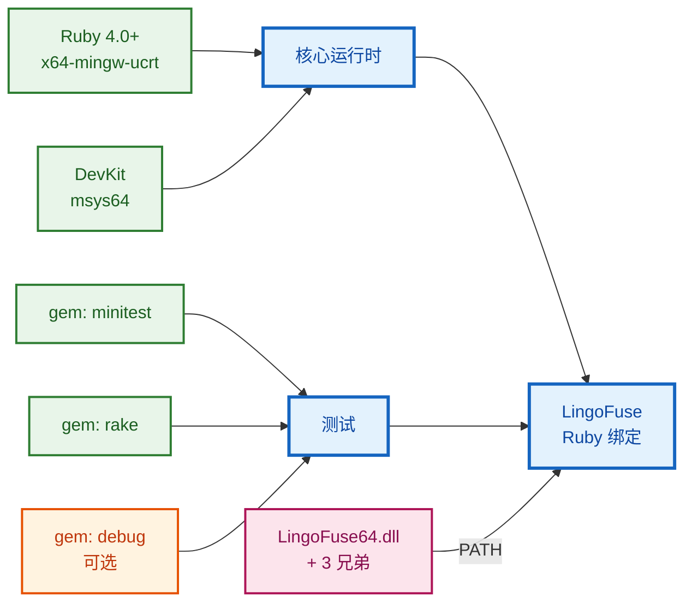
```mermaid
flowchart LR
    Ruby["Ruby 4.0+<br/>x64-mingw-ucrt"] --> Runtime["核心运行时"]
    DevKit["DevKit<br/>msys64"] --> Runtime
    Minitest["gem: minitest"] --> Tests["测试"]
    Rake["gem: rake"] --> Tests
    Debug["gem: debug<br/>可选"] --> Tests
    Runtime --> LF["LingoFuse<br/>Ruby 绑定"]
    Tests --> LF
    DLL["LingoFuse64.dll<br/>+ 3 兄弟"] -->|"PATH"| LF

    classDef req fill:#E8F5E9,stroke:#2E7D32,stroke-width:2px,color:#1B5E20
    classDef opt fill:#FFF3E0,stroke:#E65100,stroke-width:2px,color:#BF360C
    classDef core fill:#E3F2FD,stroke:#1565C0,stroke-width:3px,color:#0D47A1
    classDef native fill:#FCE4EC,stroke:#AD1457,stroke-width:2px,color:#880E4F

    class Ruby,DevKit,Minitest,Rake req
    class Debug opt
    class Runtime,Tests,LF core
    class DLL native
```

**必需**：Ruby 4.0+、DevKit、`minitest`、`rake`、4 个 LingoFuse DLL 在 PATH 上。

**可选**：`debug`（仅 VS Code 调试需要）。

### 3.3 版本选择对照表

| 组件 | 最低版本 | **推荐版本** | 禁止版本 | 说明 |
|------|:--------:|:------------:|:--------:|------|
| Ruby | 2.7.0 | **4.0.x** | x86-mingw32 | 必须 `x64-mingw-ucrt` |
| 平台 | Windows 10 1809 | **Windows 11** | — | 需要 PowerShell 5+ |
| PowerShell | 5.0 | **7.x** | 2.0-4.0 | 5.0 已够用 |
| gem: minitest | 5.0 | **5.x 最新** | — | 通常随 Ruby 一起装 |
| gem: rake | 13.0 | **13.x 最新** | — | |
| gem: debug | — | **1.11+** | — | 可选，用于 VS Code 调试 |
| LingoFuse DLL | 3.0 | **3.10+** | — | 与 `LingoFuse-v3.10` 匹配 |

**关键警告**：

- ⚠️ **一定要装 x64-mingw-ucrt 版本的 Ruby**。x64-mswin64 版本会失败
- ⚠️ **一定要装带 DevKit 的 RubyInstaller**。不带 DevKit 无法编译 C 扩展
- ⚠️ **一定不要用 Embarcadero / Borland / CodeGear 的 make.exe**。与 GNU Make 语法不兼容

---

## 四、依赖安装

详见 [`INSTALL_DEPENDENCIES.md`](INSTALL_DEPENDENCIES.md)。这里只给最简速查。

### 4.1 Step 1 — 安装 Ruby + DevKit

下载 [RubyInstaller](https://rubyinstaller.org/downloads/)，选择 **Ruby+Devkit 4.0.x (x64)**。

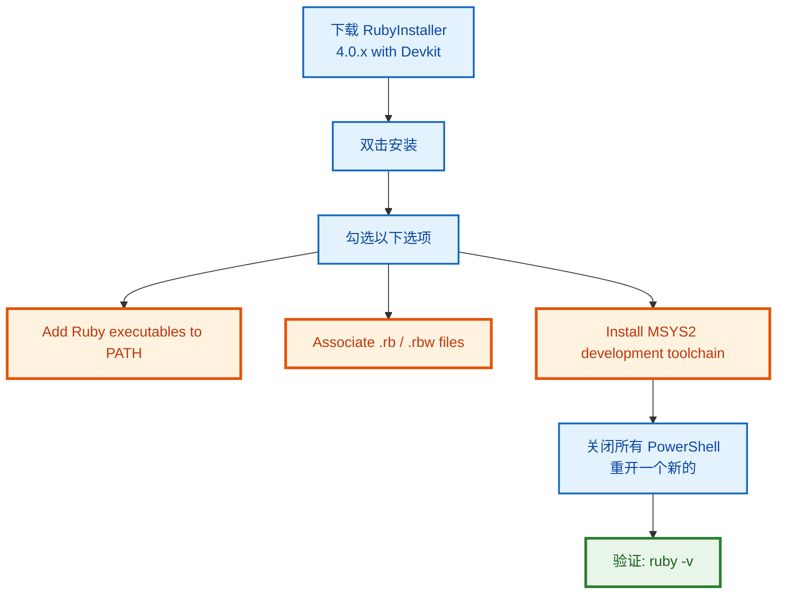
```mermaid
flowchart TD
    S1["下载 RubyInstaller<br/>4.0.x with Devkit"] --> S2["双击安装"]
    S2 --> S3["勾选以下选项"]
    S3 --> O1["Add Ruby executables to PATH"]
    S3 --> O2["Associate .rb / .rbw files"]
    S3 --> O3["Install MSYS2 development toolchain"]
    O3 --> S4["关闭所有 PowerShell<br/>重开一个新的"]
    S4 --> V["验证: ruby -v"]

    classDef action fill:#E3F2FD,stroke:#1565C0,stroke-width:2px,color:#0D47A1
    classDef warn fill:#FFF3E0,stroke:#E65100,stroke-width:3px,color:#BF360C
    classDef done fill:#E8F5E9,stroke:#2E7D32,stroke-width:3px,color:#1B5E20
    class S1,S2,S3,S4 action
    class O1,O2,O3 warn
    class V done
```

### 4.2 Step 2 — 验证 DevKit

```powershell
make --version
gcc --version
```

**期望**：`GNU Make 4.4.1` 和 MinGW-w64 的 gcc。

### 4.3 Step 3 — gem 依赖

```powershell
gem install minitest
gem install rake
gem install debug        # 可选
```

### 4.4 Step 4 — 原生库加入 PATH

四个 DLL **必须放在同一目录**：

| 文件 | 用途 |
|---|---|
| `LingoFuse64.dll` | 核心 RPC 库 |
| `z_ipc_64.dll` | IPC 底层 |
| `mimalloc64.dll` | 内存分配器 |
| `mimalloc-redirect.dll` | mimalloc 重定向 |

**该目录必须在 PATH 上**：

```powershell
$env:PATH = "D:\LingoFuse\Binary;" + $env:PATH
```

**这就是全部机制**。运行时绑定只从 PATH 搜索原生库，没有绑定专属的环境变量。

**验证**：

```powershell
cd D:\CoreLibrary\LingoFuse\ruby
ruby -I lib -e "require 'lingofuse'; puts LingoFuse.loaded?"
```

**期望**：`true`

---

## 五、环境诊断

两个诊断脚本，用途不同。详见 [`INSTALL_DEPENDENCIES.md` §6](INSTALL_DEPENDENCIES.md#六一键环境诊断)。

| 脚本 | 检查对象 | 何时运行 |
|------|----------|----------|
| `check_env.ps1` | 编译 C 扩展的工具链 | 首次搭建环境、编译失败时 |
| `check_env.rb` | Ruby 绑定的运行时 | 首次使用、加载失败时 |

**一键运行**：

```powershell
cd D:\CoreLibrary\LingoFuse\ruby
powershell -ExecutionPolicy Bypass -File check_env.ps1
ruby check_env.rb
```

**期望**：两个脚本都以 `Failed : 0` 结尾。

---

## 六、编译 C 扩展

详见 [`BUILD_EXTENSION.md`](BUILD_EXTENSION.md)。

### 6.1 一键编译

```powershell
cd D:\CoreLibrary\LingoFuse\ruby
powershell -ExecutionPolicy Bypass -File setup_build_env.ps1
```

### 6.2 内部流程

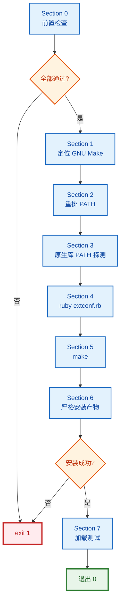
```mermaid
flowchart TD
    S0["Section 0<br/>前置检查"] --> Q0{"全部通过?"}
    Q0 -->|"否"| Fail["exit 1"]
    Q0 -->|"是"| S1["Section 1<br/>定位 GNU Make"]
    S1 --> S2["Section 2<br/>重排 PATH"]
    S2 --> S3["Section 3<br/>原生库 PATH 探测"]
    S3 --> S4["Section 4<br/>ruby extconf.rb"]
    S4 --> S5["Section 5<br/>make"]
    S5 --> S6["Section 6<br/>严格安装产物"]
    S6 --> Q6{"安装成功?"}
    Q6 -->|"否"| Fail
    Q6 -->|"是"| S7["Section 7<br/>加载测试"]
    S7 --> Done["退出 0"]

    classDef step fill:#E3F2FD,stroke:#1565C0,stroke-width:2px,color:#0D47A1
    classDef check fill:#FFF3E0,stroke:#E65100,stroke-width:2px,color:#BF360C
    classDef fail fill:#FFEBEE,stroke:#C62828,stroke-width:3px,color:#B71C1C
    classDef ok fill:#E8F5E9,stroke:#2E7D32,stroke-width:3px,color:#1B5E20

    class S0,S1,S2,S3,S4,S5,S6,S7 step
    class Q0,Q6 check
    class Fail fail
    class Done ok
```

**期望关键输出**：

```
========================================================================
6. Artifact
========================================================================
  [OK]   Built: lingofuse_ext.so (45056 bytes)
  [OK]   Installed: D:\...\lib\lingofuse_ext.so (45056 bytes)

========================================================================
7. Load test
========================================================================
         LOADED: true true true
  [OK]   lingofuse_ext loads and exposes the full expected surface.
```

### 6.3 清理

```powershell
cd D:\CoreLibrary\LingoFuse\ruby
powershell -ExecutionPolicy Bypass -File clean.ps1
```

---

## 七、在自有 Ruby 项目中引入 LingoFuse

> **本章是独立章节，讲的是把 LingoFuse Ruby 绑定作为依赖项引入到**你自己的** Ruby 项目里。**

### 7.1 关键事实：三类文件的加载机制

Ruby 有三种"库"，加载机制完全不同：

| 类型 | 例子 | 加载者 | 搜索路径 |
|------|------|--------|----------|
| **Ruby 源文件** | `*.rb` | `require` / `require_relative` | `$LOAD_PATH` 或相对当前文件 |
| **Ruby C 扩展** | `lingofuse_ext.so` | `require_relative`（**本绑定**） | 相对 `native_bridge.rb` 固定为 `lib/` |
| **原生系统 DLL** | `LingoFuse64.dll` | `Fiddle.dlopen` | **仅系统环境变量**（PATH / LD_LIBRARY_PATH / DYLD_*） |

**核心结论**：

> **C 扩展由 `native_bridge.rb` 通过 `require_relative` 加载，位置固定在 `lib/`。你只需要把整个 `ruby/` 目录拷过去，`.so` 会自动被找到。**
>
> **原生 DLL 由 `Fiddle.dlopen` 加载，走操作系统加载器的规则。你必须把包含 4 个 DLL 的目录加到 PATH 上。**

### 7.2 两条独立的搜索路径

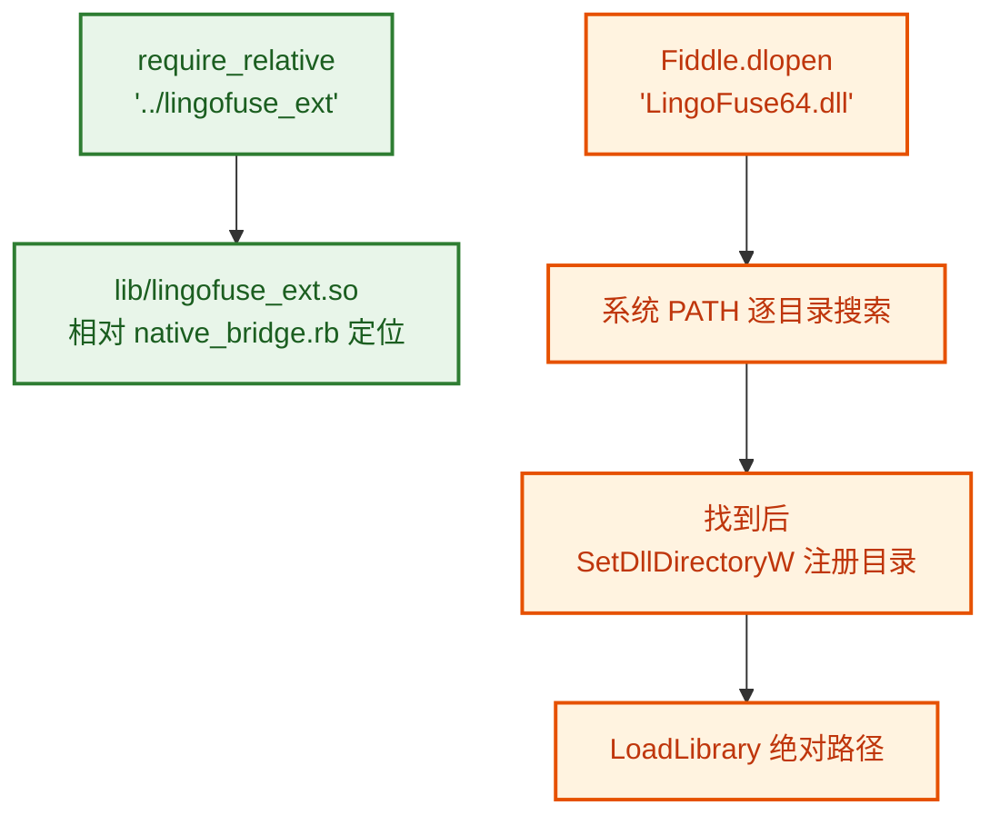
```mermaid
flowchart TD
    A["require_relative<br/>'../lingofuse_ext'"] --> B["lib/lingofuse_ext.so<br/>相对 native_bridge.rb 定位"]
    C["Fiddle.dlopen<br/>'LingoFuse64.dll'"] --> D["系统 PATH 逐目录搜索"]
    D --> E["找到后<br/>SetDllDirectoryW 注册目录"]
    E --> F["LoadLibrary 绝对路径"]

    classDef cext fill:#E8F5E9,stroke:#2E7D32,stroke-width:2px,color:#1B5E20
    classDef native fill:#FFF3E0,stroke:#E65100,stroke-width:2px,color:#BF360C

    class A,B cext
    class C,D,E,F native
```

**C 扩展**：位置固定为 `lib/lingofuse_ext.so`（与 `lib/lingofuse/` 同级）。这是 `require_relative` 决定的，**不依赖 $LOAD_PATH、不依赖环境变量**。

**原生 DLL**：从系统 PATH 搜索。可以是任意目录，只要是 PATH 上的一环。**4 个 DLL 必须同一目录**。

### 7.3 只需做两件事

#### 步骤 1 — 把整个 `ruby/` 目录拷贝到你的项目

不需要拆散 `lib/`、`lingofuse/`、`lingofuse_ext.so` 的相对结构。整个 `ruby/` 是一个自包含单元。

#### 步骤 2 — 把原生库目录加入 PATH

```powershell
# Windows PowerShell
$env:PATH = "D:\LingoFuse\Binary;" + $env:PATH
```

```bash
# Linux
export LD_LIBRARY_PATH="/opt/lingofuse/lib:$LD_LIBRARY_PATH"
```

```bash
# macOS
export DYLD_LIBRARY_PATH="/opt/lingofuse/lib:$DYLD_LIBRARY_PATH"
```

**没有**绑定专属的环境变量。所有其他 Windows 程序的 PATH 是什么样，这里就是什么样。

### 7.4 三种引入方案

#### 方案 A — 绝对路径 require（快速验证）

```ruby
# C:\temp\my_app.rb
lingofuse_lib = 'D:/CoreLibrary/LingoFuse/ruby/lib'
$LOAD_PATH.unshift(lingofuse_lib) unless $LOAD_PATH.include?(lingofuse_lib)

require 'lingofuse'

puts LingoFuse.loaded?
puts LingoFuse.library_name
```

**前提**：原生库目录已在 PATH 上。

**优点**：零配置。**缺点**：路径硬编码。

#### 方案 B — 把 `ruby/` 整体拷到项目内（推荐）

```
C:\temp\my_app\
├── my_app.rb
└── ruby\                          ← 整个 ruby/ 拷过来
    ├── lib\
    │   ├── lingofuse.rb
    │   ├── lingofuse_ext.so       ← C 扩展（已包含）
    │   └── lingofuse\
    └── ...
```

**`my_app.rb`**：

```ruby
$LOAD_PATH.unshift(File.expand_path('ruby/lib', __dir__))
require 'lingofuse'

puts "loaded: #{LingoFuse.loaded?}"
puts "native bridge: #{LingoFuse::NativeBridge.available?}"
```

**前提**：原生库目录已在 PATH 上（与 `ruby/` 无关）。

#### 方案 C — Windows 目录联接（Junction）

**Windows 特有，不需要管理员权限。**

```powershell
mkdir C:\temp\my_app\ruby -Force
cmd /c mklink /J C:\temp\my_app\ruby\lib D:\CoreLibrary\LingoFuse\ruby\lib
```

之后照方案 B 用。

### 7.5 三种方案对比

| 方案 | 命令复杂度 | 包更新后 | 需要管理员 | 适合场景 |
|:----:|:---------:|:--------:|:---------:|----------|
| A 绝对路径 require | 零 | 立即生效 | 否 | 快速验证、一次性脚本 |
| B 拷贝整个 ruby/ | 一条 copy | 需重新复制 | 否 | 长期项目、打包分发 |
| C Windows Junction | 两条命令 | 立即生效 | 否 | Windows 开发调试 |

### 7.6 完整最小示例

**目录结构**：

```
C:\temp\my_app\
├── app.rb
└── ruby\
    ├── lib\
    │   ├── lingofuse.rb
    │   ├── lingofuse_ext.so
    │   └── lingofuse\
    └── ...
```

**`app.rb`**：

```ruby
# frozen_string_literal: true

# ---------------------------------------------------------------------------
# 步骤 1：把 ruby/lib/ 加到 $LOAD_PATH
# ---------------------------------------------------------------------------

lib_dir = File.expand_path('ruby/lib', __dir__)
$LOAD_PATH.unshift(lib_dir) unless $LOAD_PATH.include?(lib_dir)

# ---------------------------------------------------------------------------
# 步骤 2：加载
# ---------------------------------------------------------------------------
# C 扩展（lingofuse_ext.so）由 native_bridge.rb 用 require_relative
# 自动加载，无需任何 $LOAD_PATH 配置。
#
# 原生库（LingoFuse64.dll）由 Fiddle.dlopen 从系统 PATH 加载，
# 需要在启动前把它的目录加进 PATH。
# ---------------------------------------------------------------------------

require 'lingofuse'

puts "LingoFuse loaded: #{LingoFuse.loaded?}"
puts "Library name:     #{LingoFuse.library_name}"
puts "NativeBridge:     #{LingoFuse::NativeBridge.available?}"

# ---------------------------------------------------------------------------
# 步骤 3：使用
# ---------------------------------------------------------------------------

app = LingoFuse::AppHandle.new('MyApp', 'Demo')

app.register_call('echo', 'Echo a string') do |input, output|
  text = LingoFuse::LfIo.read_string(input)
  LingoFuse::LfIo.write_string(output, text)
end

param = LingoFuse::DataHandle.new('echo')
LingoFuse::LfIo.write_string(param, 'hello')

result = app.local_call(param)
puts "Result: #{LingoFuse::LfIo.read_string(result)}"

param.dispose
result.dispose
app.dispose
```

**运行**：

```powershell
# 确保原生库在 PATH 上
$env:PATH = "D:\LingoFuse\Binary;" + $env:PATH

cd C:\temp\my_app
ruby app.rb
```

**期望输出**：

```
LingoFuse loaded: true
Library name:     LingoFuse64.dll
NativeBridge:     true
Result: hello
```

### 7.7 关键注意点

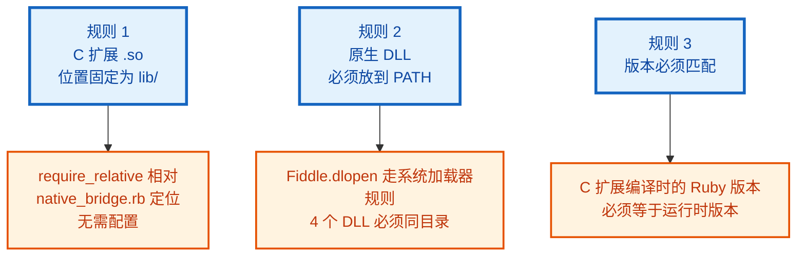
```mermaid
flowchart TD
    R1["规则 1<br/>C 扩展 .so<br/>位置固定为 lib/"]
    R1 --> R1D["require_relative 相对<br/>native_bridge.rb 定位<br/>无需配置"]

    R2["规则 2<br/>原生 DLL<br/>必须放到 PATH"]
    R2 --> R2D["Fiddle.dlopen 走系统加载器规则<br/>4 个 DLL 必须同目录"]

    R3["规则 3<br/>版本必须匹配"]
    R3 --> R3D["C 扩展编译时的 Ruby 版本<br/>必须等于运行时版本"]

    classDef rule fill:#E3F2FD,stroke:#1565C0,stroke-width:3px,color:#0D47A1
    classDef detail fill:#FFF3E0,stroke:#E65100,stroke-width:2px,color:#BF360C
    class R1,R2,R3 rule
    class R1D,R2D,R3D detail
```

**注意点 1 — C 扩展（`.so`）位置固定**

`lingofuse_ext.so` 必须与 `lingofuse/` 目录同级（都在 `lib/` 下）。`native_bridge.rb` 用 `require_relative '../lingofuse_ext'` 加载它，这是**相对路径**，不经过 `$LOAD_PATH`、不经过 PATH、不经过工作目录。

**注意点 2 — 原生 DLL 必须在 PATH 上**

`LingoFuse64.dll` 等**不归 Ruby 管**，由 `Fiddle.dlopen` 加载，走操作系统加载器的规则。**唯一机制就是 PATH**。

**注意点 3 — 4 个 DLL 必须永远在一起**

`LingoFuse64.dll` 加载时会**按文件名**加载另外三个 DLL。它们必须在**同一目录**，且该目录在 PATH 上。少一个都会报 `The specified module could not be found`。

**注意点 4 — 版本必须匹配**

`lingofuse_ext.so` 编译时的 Ruby 版本必须和运行时的 Ruby 版本一致。换了 Ruby 版本（例如从 4.0.7 升到 4.1.0）必须重新编译。

---

## 八、测试

### 8.1 测试体系总览

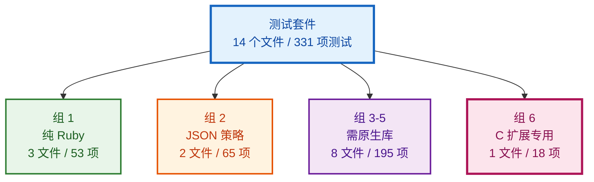
```mermaid
flowchart TD
    Root["测试套件<br/>14 个文件 / 331 项测试"]

    Root --> G1["组 1<br/>纯 Ruby<br/>3 文件 / 53 项"]
    Root --> G2["组 2<br/>JSON 策略<br/>2 文件 / 65 项"]
    Root --> G3["组 3-5<br/>需原生库<br/>8 文件 / 195 项"]
    Root --> G6["组 6<br/>C 扩展专用<br/>1 文件 / 18 项"]

    classDef root fill:#E3F2FD,stroke:#1565C0,stroke-width:3px,color:#0D47A1
    classDef pure fill:#E8F5E9,stroke:#2E7D32,stroke-width:2px,color:#1B5E20
    classDef partial fill:#FFF3E0,stroke:#E65100,stroke-width:2px,color:#BF360C
    classDef native fill:#F3E5F5,stroke:#6A1B9A,stroke-width:2px,color:#4A148C
    classDef cext fill:#FCE4EC,stroke:#AD1457,stroke-width:3px,color:#880E4F

    class Root root
    class G1 pure
    class G2 partial
    class G3 native
    class G6 cext
```

| 组 | 文件 | 测试数 | 是否需要原生库 |
|:--:|------|:------:|:--------------:|
| 1 | `test_errors.rb` | 23 | 否 |
| 1 | `test_callback_error_reporter.rb` | 10 | 否 |
| 1 | `test_module_helpers.rb` | 20 | 否 |
| 2 | `test_lf_io.rb` | 32 | 部分 |
| 2 | `test_lf_io_extra.rb` | 33 | 部分 |
| 3 | `test_data_handle.rb` | 44 | 是 |
| 3 | `test_data_handle_extra.rb` | 20 | 是 |
| 4 | `test_app_handle.rb` | 33 | 是 |
| 4 | `test_app_handle_extra.rb` | 15 | 是 |
| 5 | `test_status.rb` | 17 | 是 |
| 5 | `test_network_events.rb` | 27 | 是 |
| 5 | `test_framework.rb` | 30 | 是 |
| 5 | `test_network.rb` | 9 | 是 |
| 6 | `test_native_bridge_self_test.rb` | 18 | C 扩展专用 |

### 8.2 三种运行方式

| 方式 | 命令 | 用途 |
|------|------|------|
| 开发（Windows） | `.\run_tests.ps1` | 交互式跑全部 14 个文件 |
| CI（Windows） | `.\run_test_ci.ps1` | 与开发版功能相同，独立文件 |
| CI（Linux / macOS） | `bash run_test_ci.sh` | 在 POSIX 环境跑 |

### 8.3 运行流程

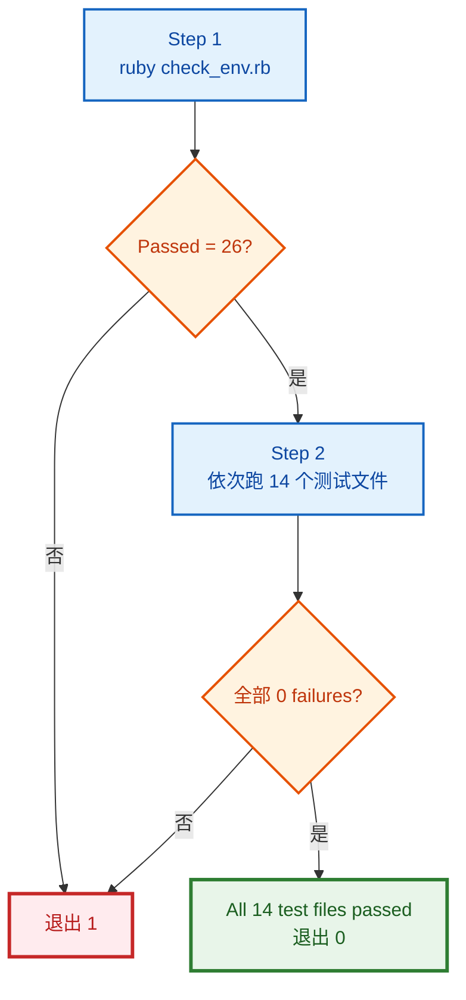
```mermaid
flowchart TD
    S1["Step 1<br/>ruby check_env.rb"] --> Q1{"Passed = 26?"}
    Q1 -->|"否"| Fail["退出 1"]
    Q1 -->|"是"| S2["Step 2<br/>依次跑 14 个测试文件"]
    S2 --> Q2{"全部 0 failures?"}
    Q2 -->|"否"| Fail
    Q2 -->|"是"| Ok["All 14 test files passed<br/>退出 0"]

    classDef ok fill:#E8F5E9,stroke:#2E7D32,stroke-width:3px,color:#1B5E20
    classDef fail fill:#FFEBEE,stroke:#C62828,stroke-width:3px,color:#B71C1C
    classDef step fill:#E3F2FD,stroke:#1565C0,stroke-width:2px,color:#0D47A1
    classDef check fill:#FFF3E0,stroke:#E65100,stroke-width:2px,color:#BF360C

    class Ok ok
    class Fail fail
    class S1,S2 step
    class Q1,Q2 check
```

### 8.4 预期输出

```powershell
cd D:\CoreLibrary\LingoFuse\ruby
.\run_test_ci.ps1
```

**末尾**：

```
========================================================================
All 14 test files passed.
========================================================================
```

**各项统计**：

| 文件 | Runs | Assertions | Failures | Errors |
|------|:----:|:----------:|:--------:|:------:|
| test_errors.rb | 23 | 39 | 0 | 0 |
| test_callback_error_reporter.rb | 10 | 17 | 0 | 0 |
| test_module_helpers.rb | 20 | 41 | 0 | 0 |
| test_lf_io.rb | 32 | 58 | 0 | 0 |
| test_lf_io_extra.rb | 33 | 40 | 0 | 0 |
| test_data_handle.rb | 44 | 85 | 0 | 0 |
| test_data_handle_extra.rb | 20 | 40 | 0 | 0 |
| test_app_handle.rb | 33 | 57 | 0 | 0 |
| test_app_handle_extra.rb | 15 | 28 | 0 | 0 |
| test_status.rb | 17 | 24-40 * | 0 | 0 |
| test_network_events.rb | 27 | 37 | 0 | 0 |
| test_framework.rb | 30 | 41 | 0 | 0 |
| test_network.rb | 9 | 29 | 0 | 0 |
| test_native_bridge_self_test.rb | 18 | 55 | 0 | 0 |
| **合计** | **331** | — | **0** | **0** |

> \* `test_status.rb` 的断言数取决于状态队列长度，非确定性，属正常现象。

### 8.5 日志中"看起来像错误但实际是预期"的条目

| 日志 | 来源 | 说明 |
|------|------|------|
| `[LingoFuse::NativeBridge] callback raised: intentional ...` | 自测 11 / 14 | 故意触发异常，验证 C 端 fallback 日志 |
| `[LingoFuse] Callback error in ...boom...` | test_app_handle | 故意抛异常，验证异常隔离 |
| `no found api "does_not_exist"` | 多个文件 | 故意调用不存在的 API |
| `prepare error: repeat listen/connection addr` | test_framework / test_network | 故意重复地址 |
| `LF_BindApp: Main thread is not active` | test_app_handle_extra | 故意在无主线程时 bind |
| `hint: Data handle pool "N" handles automatically freed.` | 所有含 DataHandle 的测试 | 10 分钟空闲回收，正常行为 |

---

## 九、API 说明

### 9.1 顶层模块函数

```ruby
require 'lingofuse'
```

| 函数 | 说明 |
|------|------|
| `LingoFuse::VERSION` | 绑定版本字符串（`"1.0.0"`） |
| `LingoFuse.load_library` | 幂等，总是返回 `true`（加载在 `require` 时已完成） |
| `LingoFuse.loaded?` | 原生库是否已加载 |
| `LingoFuse.library_name` | 平台相关的库文件名 |
| `LingoFuse.platform` | `{ ruby:, platform:, library: }` |
| `LingoFuse.cstr_ptr(str)` | 转 `Fiddle::Pointer`（NUL 结尾 UTF-8） |
| `LingoFuse.read_cstr(ptr)` | 从指针读 UTF-8 字符串 |

### 9.2 `LingoFuse::DataHandle`

RAII 包装：`TDataHnd`。

**构造**：

```ruby
h = LingoFuse::DataHandle.new('api_name')             # 自动回收
h = LingoFuse::DataHandle.create_permanent('api_name') # 永久
h = LingoFuse::DataHandle.borrow(raw_pointer)          # 借用
LingoFuse::DataHandle.open('api_name') { |h| ... }     # 块形式
```

**方法分类**：

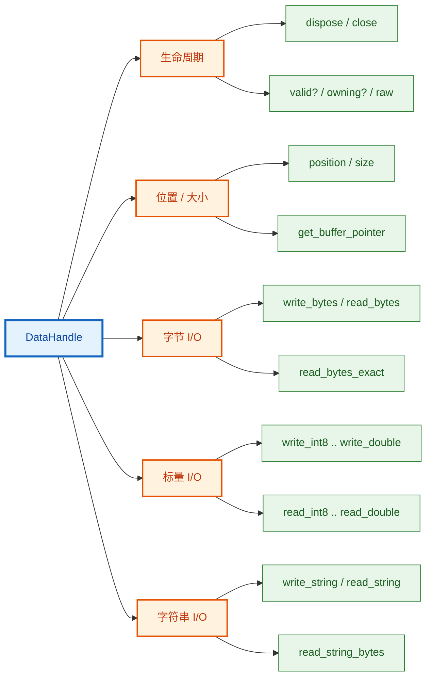
```mermaid
flowchart LR
    DH["DataHandle"] --> L["生命周期"]
    DH --> P["位置 / 大小"]
    DH --> B["字节 I/O"]
    DH --> S["标量 I/O"]
    DH --> T["字符串 I/O"]

    L --> L1["dispose / close"]
    L --> L2["valid? / owning? / raw"]
    P --> P1["position / size"]
    P --> P2["get_buffer_pointer"]
    B --> B1["write_bytes / read_bytes"]
    B --> B2["read_bytes_exact"]
    S --> S1["write_int8 .. write_double"]
    S --> S2["read_int8 .. read_double"]
    T --> T1["write_string / read_string"]
    T --> T2["read_string_bytes"]

    classDef root fill:#E3F2FD,stroke:#1565C0,stroke-width:3px,color:#0D47A1
    classDef group fill:#FFF3E0,stroke:#E65100,stroke-width:2px,color:#BF360C
    classDef leaf fill:#E8F5E9,stroke:#2E7D32,stroke-width:1px,color:#1B5E20

    class DH root
    class L,P,B,S,T group
    class L1,L2,P1,P2,B1,B2,S1,S2,T1,T2 leaf
```

### 9.3 `LingoFuse::AppHandle`

RAII 包装：`TAppHnd`。

**构造**：

```ruby
app = LingoFuse::AppHandle.new('AppName', 'description')
```

**方法**：

| 方法 | 说明 |
|------|------|
| `app.register_call(name, desc, &block)` | 注册 Call API |
| `app.register_notify(name, desc, &block)` | 注册 Notify API |
| `app.unregister(name)` | 注销，返回 `true` / `false` |
| `app.local_call(param)` | 本地同步调用，返回新 `DataHandle` |
| `app.local_notify(param)` | 本地异步通知 |
| `app.bind` | 绑定到空闲客户端，返回数量 |
| `app.dispose` | 释放（**两阶段析构第一步**） |
| `app.valid?` / `app.raw` / `app.name` | 状态访问 |

**回调签名**：

```ruby
app.register_call('add', 'Add two ints') do |input, output|
  a = input.read_int32
  b = input.read_int32
  output.write_int32(a + b)
end

app.register_notify('log', 'One-way log') do |input|
  msg = input.read_string
  puts msg
end
```

**回调整约**：

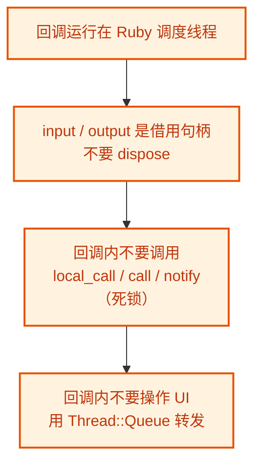
```mermaid
flowchart TD
    R1["回调运行在 Ruby 调度线程"] --> R2["input / output 是借用句柄<br/>不要 dispose"]
    R2 --> R3["回调内不要调用<br/>local_call / call / notify<br/>（死锁）"]
    R3 --> R4["回调内不要操作 UI<br/>用 Thread::Queue 转发"]

    classDef rule fill:#FFF3E0,stroke:#E65100,stroke-width:2px,color:#BF360C
    class R1,R2,R3,R4 rule
```

### 9.4 `LingoFuse::LfIo`

统一 JSON / 字符串 / 字节 I/O。

| 函数 | 说明 |
|------|------|
| `LfIo.dumps_json(obj)` | 序列化：紧凑、非 ASCII 字面量 |
| `LfIo.loads_json(text)` | strict 解析 |
| `LfIo.write_string(handle, str)` | 写 UTF-8 + NUL |
| `LfIo.read_string(handle)` | 读到 NUL |
| `LfIo.write_string_bytes(handle, bytes)` | 写原始字节 + NUL |
| `LfIo.read_string_bytes(handle)` | 读到 NUL（不解码） |
| `LfIo.peek_string_bytes(handle)` | 读到 NUL，**不移动游标** |
| `LfIo.read_all_bytes(handle)` | 读剩余全部 |
| `LfIo.write_json(handle, obj)` | 序列化 + 写 + NUL |
| `LfIo.read_json(handle)` | 读 + 解析（抛 `JSON::ParserError`） |
| `LfIo.try_read_json(handle)` | 非抛异常版本（返回 `nil`） |
| `LfIo.cstr(value)` | 规范化为字符串 |

**线格式**：

```
[UTF-8 encoded JSON text][NUL byte]
```

**跨语言字节级兼容**：`{"a":1}` 在所有绑定上的字节序列都是：

```
7B 22 61 22 3A 31 7D 00
```

### 9.5 `LingoFuse::Framework`

进程级门面。

| 方法 | 说明 |
|------|------|
| `Framework.reset_prepare` | 清空准备队列 |
| `Framework.prepare_service(listen, physics)` | 准备服务端点 |
| `Framework.prepare_client(physics, app)` | 准备客户端连接 |
| `Framework.prepare_done` | 启动框架（**只返回一次 `true`**） |
| `Framework.exit_main_thread` | 请求主线程退出 |
| `Framework.set_option(name, value)` | 调整运行时选项 |
| `Framework.generate_app_name` | 生成唯一 App 名 |
| `Framework.get_app_name(app)` | 查询 App 权威名 |
| `Framework.call(app, param, timeout_ms)` | 同步远程调用 |
| `Framework.try_call(app, param, timeout_ms)` | 空响应返回 `nil` |
| `Framework.notify(app, param)` | 单向通知 |
| `Framework.sequenced_notify(app, param)` | FIFO 通知 |
| `Framework.shutdown` | 完全关闭（幂等） |

**运行时选项**：

| 选项 | 默认 | 说明 |
|------|:----:|------|
| `Wait_Ready` / `Wait_Connection_ReadyOk` | `True` | `prepare_done` 是否等待所有客户端就绪 |
| `Wait_Connection_Timeout` | 30000 | 等待超时（毫秒） |
| `Overlap_Connection` | `False` | 是否允许同地址多客户端 |
| `Fixed_Sequenced_Time` | 20000 | 顺序通知回退阈值 |
| `Quiet` | `False` | 安静模式 |
| `ShowThreadID` | — | 日志显示线程 ID |
| `ConsoleOutput` | — | 控制台输出 |

### 9.6 `LingoFuse::Status`

| 方法 | 说明 |
|------|------|
| `Status.get_status_count` | 队列中待处理消息数 |
| `Status.get_status` | 弹出下一条 |
| `Status.drain_status(max)` | 弹出最多 `max` 条 |
| `Status.post_status(msg)` | 推入一条 |
| `Status.check_main_thread` | 主线程是否运行 |
| `Status.check_app(name)` | App 是否可见 |
| `Status.check_api(app, api)` | API 是否可见 |

### 9.7 `LingoFuse::NetworkEvents`

进程全局连接 / 断开处理器。

```ruby
LingoFuse::NetworkEvents.set(
  on_connect:    ->(addr) { puts "+ #{addr}" },
  on_disconnect: ->(addr) { puts "- #{addr}" }
)
LingoFuse::NetworkEvents.clear
LingoFuse::NetworkEvents.installed?
LingoFuse::NetworkEvents.set_listener(listener)
```

**语义**：

- **Connect** — 客户端首次收到服务 API 广播时触发，**不是** TCP 建链
- **Disconnect** — 物理链路丢失时触发
- **回调线程** — 原生工作线程

### 9.8 `LingoFuse::NetworkEventListener`

面向对象风格：

```ruby
class MyListener < LingoFuse::NetworkEventListener
  def on_connect(addr); end
  def on_disconnect(addr); end
end

LingoFuse::NetworkEvents.set_listener(MyListener.new)
```

### 9.9 `LingoFuse::NetworkEventQueue`

队列式消费：

```ruby
q = LingoFuse::NetworkEventQueue.global_instance
q.install
begin
  loop do
    type, addr = q.get(timeout: 1.0)
    # type 是 :connect 或 :disconnect
  end
ensure
  q.uninstall
end
```

### 9.10 `LingoFuse::NativeBridge`

C 扩展的 Ruby 包装。**通常不直接使用**。

| 方法 | 说明 |
|------|------|
| `NativeBridge.available?` | 扩展是否加载 |
| `NativeBridge.start` | 启动调度线程（幂等） |
| `NativeBridge.register_call(app, name, desc, &block)` | 注册 Call，返回 `ref_addr` |
| `NativeBridge.register_notify(app, name, desc, &block)` | 注册 Notify |
| `NativeBridge.unregister(ref_addr)` | 释放 ref |

### 9.11 `LingoFuse::CallbackErrorReporter`

```ruby
LingoFuse::CallbackErrorReporter.handler = ->(source, error) do
  puts "[#{source}] #{error.class}: #{error.message}"
end

LingoFuse::CallbackErrorReporter.report('src', err)
```

- 未装 handler 时写到 `$stderr`
- handler 内部异常被吞噬
- 线程安全

### 9.12 异常层级

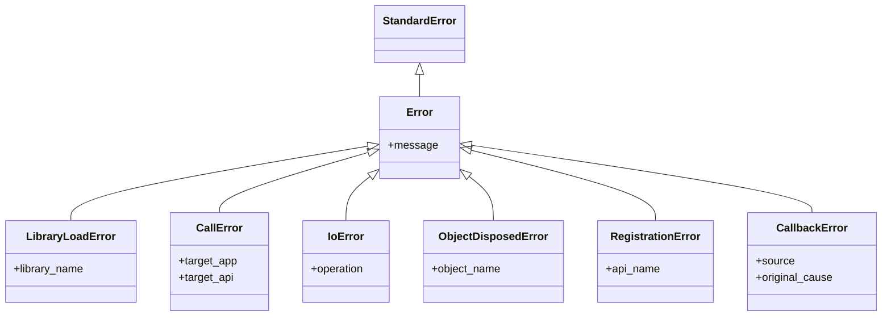
```mermaid
classDiagram
    StandardError <|-- Error
    Error <|-- LibraryLoadError
    Error <|-- CallError
    Error <|-- IoError
    Error <|-- ObjectDisposedError
    Error <|-- RegistrationError
    Error <|-- CallbackError

    class Error {
        +message
    }
    class LibraryLoadError {
        +library_name
    }
    class CallError {
        +target_app
        +target_api
    }
    class IoError {
        +operation
    }
    class ObjectDisposedError {
        +object_name
    }
    class RegistrationError {
        +api_name
    }
    class CallbackError {
        +source
        +original_cause
    }
```

**捕获策略**：

```ruby
begin
  # LingoFuse 操作
rescue LingoFuse::CallError => e
  puts "调用失败: #{e.target_app}.#{e.target_api}"
rescue LingoFuse::Error => e
  puts "LingoFuse 错误: #{e.message}"
end
```

---

## 十、使用示例

### 10.1 纯本地调用

```ruby
require 'lingofuse'

app = LingoFuse::AppHandle.new('Calculator', 'Demo')

app.register_call('add', 'Add two ints') do |input, output|
  a = input.read_int32
  b = input.read_int32
  output.write_int32(a + b)
end

param = LingoFuse::DataHandle.new('add')
param.write_int32(5)
param.write_int32(7)

result = app.local_call(param)
puts result.read_int32   # 12

param.dispose
result.dispose
app.dispose
```

### 10.2 服务端

```ruby
require 'lingofuse'

app = LingoFuse::AppHandle.new('Calculator', 'Server')

app.register_call('add', 'Add') do |input, output|
  req = LingoFuse::LfIo.read_json(input)
  result = (req['a'] || 0) + (req['b'] || 0)
  LingoFuse::LfIo.write_json(output, { result: result })
end

LingoFuse::Framework.set_option('Wait_Ready', 'False')
LingoFuse::Framework.reset_prepare
LingoFuse::Framework.prepare_service('ipc:calc', 'ipc:calc')
LingoFuse::Framework.prepare_client('ipc:calc', app)

if LingoFuse::Framework.prepare_done
  puts 'Server ready. Press Enter to exit...'
  $stdin.gets
end

LingoFuse::Framework.exit_main_thread
app.dispose
LingoFuse::Framework.shutdown
```

### 10.3 客户端

```ruby
require 'lingofuse'

LingoFuse::Framework.set_option('Wait_Ready', 'False')
LingoFuse::Framework.reset_prepare
LingoFuse::Framework.prepare_client('ipc:calc', nil)
LingoFuse::Framework.prepare_done

# 等待 App 可见
30.times do
  break if LingoFuse::Status.check_app('Calculator')
  sleep 0.2
end

param = LingoFuse::DataHandle.new('add')
LingoFuse::LfIo.write_json(param, { a: 40, b: 2 })

result = LingoFuse::Framework.call('Calculator', param, 3000)
puts LingoFuse::LfIo.read_json(result)['result']   # 42

param.dispose
result.dispose
LingoFuse::Framework.exit_main_thread
LingoFuse::Framework.shutdown
```

### 10.4 Cross Demo

三个进程，验证跨进程 / 跨语言：

```powershell
# 终端 1
ruby cross/cross_service.rb

# 终端 2
ruby cross/cross_node.rb

# 终端 3
ruby cross/cross_call.rb
```

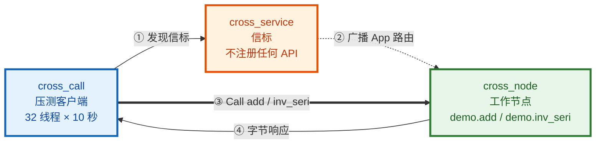
```mermaid
flowchart LR
    Call["cross_call<br/>压测客户端<br/>32 线程 × 10 秒"]
    Service["cross_service<br/>信标<br/>不注册任何 API"]
    Node["cross_node<br/>工作节点<br/>demo.add / demo.inv_seri"]

    Call -->|"① 发现信标"| Service
    Service -.->|"② 广播 App 路由"| Node
    Call ==>|"③ Call add / inv_seri"| Node
    Node -->|"④ 字节响应"| Call

    classDef beacon fill:#FFF3E0,stroke:#E65100,stroke-width:3px,color:#BF360C
    classDef worker fill:#E8F5E9,stroke:#2E7D32,stroke-width:3px,color:#1B5E20
    classDef client fill:#E3F2FD,stroke:#1565C0,stroke-width:3px,color:#0D47A1

    class Service beacon
    class Node worker
    class Call client
```

| 进程 | 角色 | 说明 |
|------|------|------|
| `cross_service.rb` | 协调者（信标） | 创建 `ipc:cross` 端点，不注册任何 API |
| `cross_node.rb` | 工作节点 | 注册 `demo.add` / `demo.inv_seri` 两个 Call API |
| `cross_call.rb` | 压测客户端 | 32 线程 × 10 秒，压测 `demo` 应用 |

---

## 十一、故障排查速查

| 症状 | 原因 | 修复 |
|------|------|------|
| `ruby: command not found` | PATH 未生效 | 重启 PowerShell |
| `cannot load such file -- lingofuse` | `$LOAD_PATH` 未包含 `lib/` | §7.4 |
| `Failed to load the LingoFuse native library` | 原生库不在 PATH 上 | §4.4 |
| `The specified module could not be found` | 兄弟 DLL 缺失或分散 | 4 个 DLL 必须同目录 |
| `[BUG] rb_thread_call_with_gvl()` | C 扩展未编译 | 跑 `setup_build_env.ps1` |
| `[LingoFuse::NativeBridge] lingofuse_ext not available` | C 扩展不在 `lib/` | BUILD_EXTENSION.md 问题 5 |
| `No GNU Make found` | DevKit 未安装 / PATH 顺序 | INSTALL_DEPENDENCIES.md §3.2 |
| `Fatal makefile ... No terminator` | 用了 Embarcadero Make | 前置 msys64 到 PATH |
| `gettimeofday: conflicting types` | 头文件冲突 | 更新 `lingofuse_ext.c`（去 `<sys/time.h>`） |
| `undefined reference to 'clock_gettime'` | MinGW 缺 pthread | 重装 DevKit |
| `Cannot replace lib\lingofuse_ext.so` | 文件被占用 | `Get-Process ruby \| Stop-Process -Force` |
| `prepare error: repeat listen` | 地址重复 | `Framework.reset_prepare` 后重试 |
| `prepare error: repeat connection` | 地址重复 | 设 `Overlap_Connection=True` |
| `no connection` | 目标 App 不可见 | 等 broadcast 广播，用 `check_app` 轮询 |
| `hint: Data handle pool ... automatically freed.` | 10 分钟空闲回收 | 正常行为 |
| `callback raised: ...`（前缀 `NativeBridge`） | 回调抛异常 | 修回调 |
| 调试器无法启动 | `debug` gem 未装 | `gem install debug` |

### 11.1 通用排查顺序

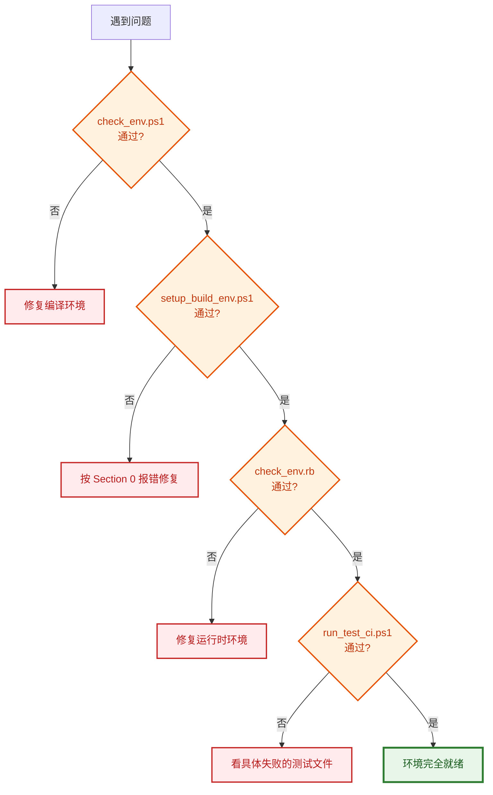
```mermaid
flowchart TD
    Issue["遇到问题"] --> Q1{"check_env.ps1<br/>通过?"}
    Q1 -->|"否"| Fix1["修复编译环境"]
    Q1 -->|"是"| Q2{"setup_build_env.ps1<br/>通过?"}
    Q2 -->|"否"| Fix2["按 Section 0 报错修复"]
    Q2 -->|"是"| Q3{"check_env.rb<br/>通过?"}
    Q3 -->|"否"| Fix3["修复运行时环境"]
    Q3 -->|"是"| Q4{"run_test_ci.ps1<br/>通过?"}
    Q4 -->|"否"| Fix4["看具体失败的测试文件"]
    Q4 -->|"是"| OK["环境完全就绪"]

    classDef ok fill:#E8F5E9,stroke:#2E7D32,stroke-width:3px,color:#1B5E20
    classDef fail fill:#FFEBEE,stroke:#C62828,stroke-width:2px,color:#B71C1C
    classDef check fill:#FFF3E0,stroke:#E65100,stroke-width:2px,color:#BF360C

    class OK ok
    class Fix1,Fix2,Fix3,Fix4 fail
    class Q1,Q2,Q3,Q4 check
```

---

## 附录 A — 与其他语言的互通性

同一个 JSON 载荷在**所有** LingoFuse 绑定上产生**相同的字节序列**：

| 语言 | 文件 | 绑定类型 |
|------|------|----------|
| Pascal | `lingofuse_import.pas` | 原生 |
| C | `LingoFuse.h` / `LingoFuse.c` | 原生 |
| C++ | `LingoFuse.hpp` / `lf_io.hpp` | 原生 |
| C# | `LingoFuse.cs` / `LfIo.cs` | P/Invoke |
| Python | `lingofuse.lf_io` | ctypes |
| JavaScript | `index.js` / `lf-io.js` | Koffi |
| **Ruby** | **本绑定** | **Fiddle + C 扩展** |
| Rust | `io.rs` | FFI |
| Go | `lingofuse.go` | purego |
| Dart | `lf_io.dart` | FFI |
| Java | `LingoFuse.java` | FFM API |
| Swift | `LfIo.swift` | C++ 桥 |
| Zig | `lf_io.zig` | C ABI |
| Erlang | `lingofuse.erl` | NIF |

**示例**：`{"a":1}` 在所有绑定上的线字节：

```
7B 22 61 22 3A 31 7D 00
```

跨语言 RPC **无需任何转码层**。

---

## 附录 B — 快速命令卡

```powershell
# ============ 环境诊断 ============
cd D:\CoreLibrary\LingoFuse\ruby

.\check_env.ps1                        # 编译环境
ruby check_env.rb                      # 运行时环境

# ============ 编译 C 扩展 ============
.\setup_build_env.ps1                  # 一键编译 + 安装 + 加载测试
.\clean.ps1                            # 清理全部编译产物
.\clean.ps1 -DryRun                    # 预览清理
.\clean.ps1 -KeepInstalled             # 只清 ext/，保留 lib/

# ============ 测试 ============
.\run_tests.ps1                        # 开发测试
.\run_test_ci.ps1                      # CI 测试

# 单个测试
ruby test\test_errors.rb
ruby test\test_data_handle.rb
ruby test\test_native_bridge_self_test.rb

# ============ Cross Demo（三个终端）============
ruby cross\cross_service.rb
ruby cross\cross_node.rb
ruby cross\cross_call.rb
```

---

## 附录 C — 关于动态库搜索的关键总结

### C.1 三条规则

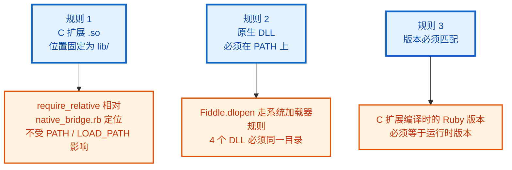
```mermaid
flowchart TD
    R1["规则 1<br/>C 扩展 .so<br/>位置固定为 lib/"]
    R1 --> R1D["require_relative 相对<br/>native_bridge.rb 定位<br/>不受 PATH / LOAD_PATH 影响"]

    R2["规则 2<br/>原生 DLL<br/>必须在 PATH 上"]
    R2 --> R2D["Fiddle.dlopen 走系统加载器规则<br/>4 个 DLL 必须同一目录"]

    R3["规则 3<br/>版本必须匹配"]
    R3 --> R3D["C 扩展编译时的 Ruby 版本<br/>必须等于运行时版本"]

    classDef rule fill:#E3F2FD,stroke:#1565C0,stroke-width:3px,color:#0D47A1
    classDef detail fill:#FFF3E0,stroke:#E65100,stroke-width:2px,color:#BF360C

    class R1,R2,R3 rule
    class R1D,R2D,R3D detail
```

### C.2 记忆要点

**C 扩展 `lingofuse_ext.so`**：

- 位置：`lib/`（与 `lingofuse/` 同级）
- 加载者：`native_bridge.rb` 的 `require_relative`
- 需要配置吗？**不需要**。只要整个 `ruby/` 目录结构没变，自动找到。

**原生库 `LingoFuse64.dll` + 3 个兄弟**：

- 位置：PATH 上的任意目录
- 加载者：`binding.rb` 的 `Fiddle.dlopen`
- 需要配置吗？**需要**。把它们所在的目录加到 PATH 上。
- 4 个 DLL 必须在**同一目录**。

### C.3 两条独立的搜索路径（再次强调）

```mermaid
flowchart LR
    A["C 扩展<br/>lingofuse_ext.so"] --> A1["require_relative<br/>相对路径"]
    A1 --> A2["lib/"]

    B["原生库<br/>LingoFuse64.dll"] --> B1["Fiddle.dlopen<br/>系统加载器"]
    B1 --> B2["PATH 逐目录"]

    classDef cext fill:#E8F5E9,stroke:#2E7D32,stroke-width:2px,color:#1B5E20
    classDef native fill:#FFF3E0,stroke:#E65100,stroke-width:2px,color:#BF360C

    class A,A1,A2 cext
    class B,B1,B2 native
```

**两者互不影响，各有各的搜索机制。搞清楚这一点，所有加载问题都能自己排查。**

---

## 附录 D — 许可

MIT。

---

*文档版本 1.1 · 与 LingoFuse Ruby 绑定 1.0.0 匹配 · 最后更新 2026-10-06*