# LingoFuse Ruby 绑定 — 完整手册

**版本**：1.0.0
**目标平台**：Windows 10 / 11 / Server 2019+（x64）
**Ruby 版本**：4.0+（x64-mingw-ucrt）

---

## 目录

1. [这是什么](#一这是什么)
2. [体系结构](#二体系结构)
3. [环境要求](#三环境要求)
4. [依赖安装](#四依赖安装)
5. [环境诊断](#五环境诊断)
6. [编译 C 扩展](#六编译-c-扩展)
7. [**在自有 Ruby 项目中引入 LingoFuse**](#七在自有-ruby-项目中引入-lingofuse)
8. [测试](#八测试)
9. [API 说明](#九api-说明)
10. [使用示例](#十使用示例)
11. [故障排查速查](#十一故障排查速查)

---

## 一、这是什么

LingoFuse Ruby 绑定让 Ruby 程序能够：

- **调用**由 Pascal / C++ / C# / Python / JavaScript / Rust / Go / Dart / Java / Swift / Zig / Erlang 写的函数
- **被**上述任何语言调用
- 在**同一进程内**、**同机跨进程**、或**跨机器**范围内工作
- 使用**字节级统一**的线格式，无需 IDL、无需桩代码、无需 HTTP 服务

一句话总结：

> **任何语言写的函数，任何其他语言都能直接调；Ruby 是 14 种一等公民语言之一。**

---

## 二、体系结构

### 2.1 五层架构

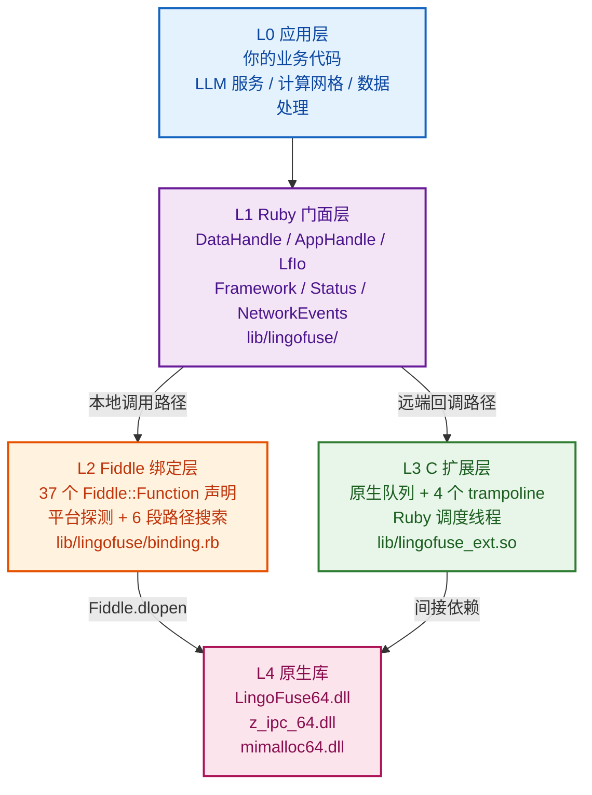

**依赖方向**：L0 → L1 → (L2 本地 / L3 远端) → L4。

### 2.2 C 扩展存在的必要性（关键）

**这是整个绑定最重要的设计决策。**

Ruby 的 Fiddle **无法**从 LingoFuse 的原生工作线程回调 Ruby 代码。

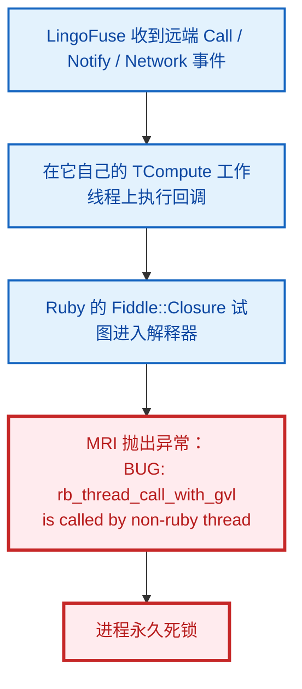

**决策表**：

| 使用场景 | 是否需要 C 扩展 |
|----------|:---------------:|
| 只做本地调用（`AppHandle#local_call` / `local_notify`） | 不需要 |
| 需要接收远端调用（作为服务端） | **必需** |
| 需要网络事件回调 | **必需** |

**C 扩展如何解决问题**：

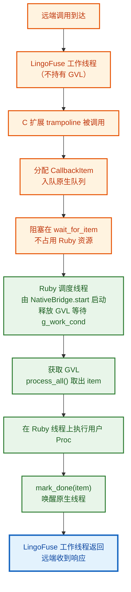

### 2.3 GVL 分流决策

C 扩展里每个 trampoline 都做一次关键判断。

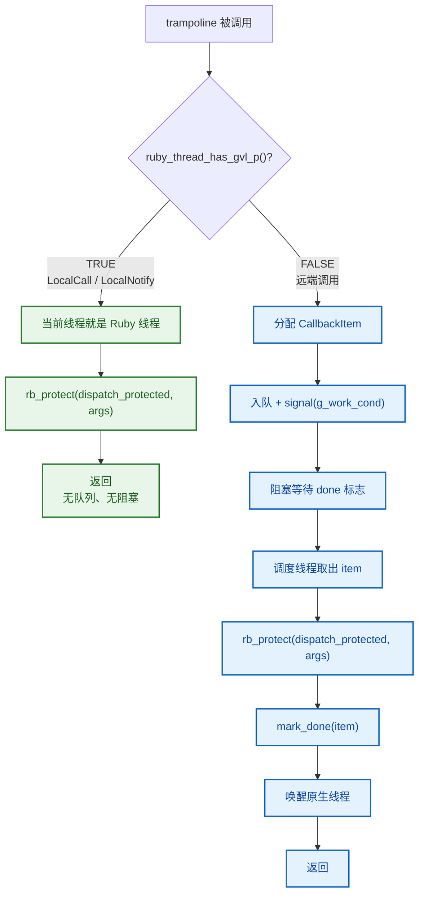

**为什么必须分流**：如果本地调用也走队列，主线程会阻塞在 `wait_for_item`，而调度线程需要 GVL 才能运行，形成**死锁**。

### 2.4 DataHandle 生命周期状态机

**三种构造方式**：

| 构造 | 底层 API | 空闲回收 | dispose 语义 |
|------|----------|:--------:|--------------|
| `DataHandle.new(api)` | `LF_CreateData` | 10 分钟 | 只标记，池扫描时释放（≤ 5 秒） |
| `DataHandle.create_permanent(api)` | `LF_CreateData_Permanent` | 永不 | 立即同步释放 |
| `DataHandle.borrow(raw)` | 无 | 由原生层管理 | no-op |

**状态转换**：

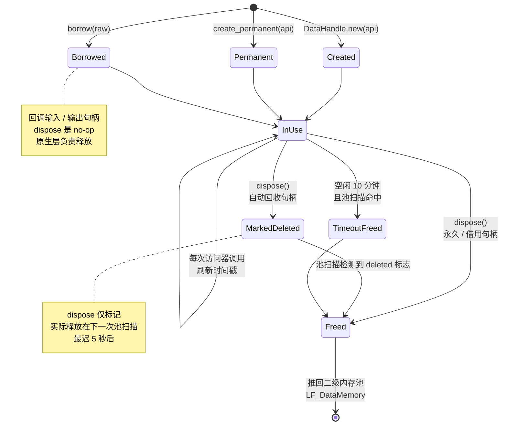

### 2.5 依赖关系

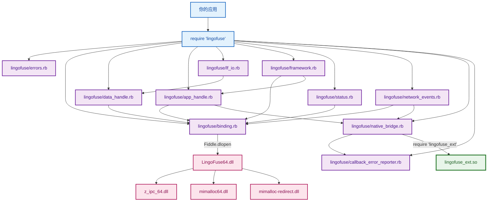

### 2.6 文件布局

```
ruby/
├── README.md                      本文件
├── BUILD_EXTENSION.md             C 扩展编译指南
├── INSTALL_DEPENDENCIES.md        依赖安装指南
├── Gemfile                        Bundler 声明
├── lingofuse.gemspec              gem 元数据
├── Rakefile                        rake 任务
│
├── setup_build_env.ps1            C 扩展一键编译
├── clean.ps1                      清理编译产物
├── check_env.ps1                  编译环境诊断
├── check_env.rb                   运行时诊断
├── run_tests.ps1                  开发测试（Windows）
├── run_test_ci.ps1                CI 测试（Windows）
├── run_test_ci.sh                 CI 测试（Linux / macOS）
│
├── .vscode/
│   └── launch.json                VS Code 调试配置
│
├── lib/
│   ├── lingofuse.rb               公共入口
│   ├── lingofuse_ext.so           C 扩展（编译产物）
│   └── lingofuse/
│       ├── errors.rb              异常层级
│       ├── callback_error_reporter.rb
│       ├── binding.rb             Fiddle 声明 + 路径搜索
│       ├── data_handle.rb
│       ├── app_handle.rb
│       ├── lf_io.rb
│       ├── framework.rb
│       ├── status.rb
│       ├── network_events.rb
│       └── native_bridge.rb
│
├── ext/lingofuse_ext/
│   ├── extconf.rb                 mkmf 配置
│   └── lingofuse_ext.c            C 源文件
│
├── cross/
│   ├── cross_service.rb           信标
│   ├── cross_node.rb              工作节点
│   └── cross_call.rb              压测客户端
│
└── test/                          14 个测试文件
    ├── test_errors.rb
    ├── test_callback_error_reporter.rb
    ├── test_module_helpers.rb
    ├── test_lf_io.rb
    ├── test_lf_io_extra.rb
    ├── test_data_handle.rb
    ├── test_data_handle_extra.rb
    ├── test_app_handle.rb
    ├── test_app_handle_extra.rb
    ├── test_status.rb
    ├── test_network_events.rb
    ├── test_framework.rb
    ├── test_network.rb
    └── test_native_bridge_self_test.rb
```

---

## 三、环境要求

### 3.1 硬件与操作系统

| 项 | 要求 |
|---|---|
| 操作系统 | Windows 10（1809+）/ Windows 11 / Windows Server 2019+ |
| 架构 | x64（ARM64 未测试） |
| 磁盘空间 | ≥ 1 GB（含 Ruby + DevKit） |
| 内存 | ≥ 4 GB |

### 3.2 软件清单

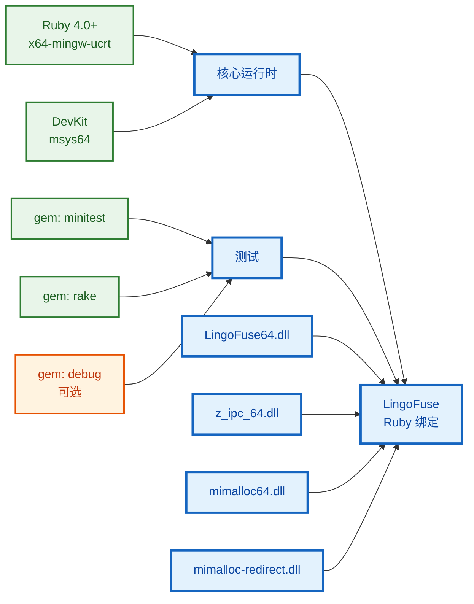

**必需**：Ruby 4.0+、DevKit、`minitest`、`rake`、4 个 LingoFuse DLL。

**可选**：`debug`（仅 VS Code 调试需要）。

### 3.3 版本选择对照表

| 组件 | 最低版本 | **推荐版本** | 禁止版本 | 说明 |
|------|:--------:|:------------:|:--------:|------|
| Ruby | 2.7.0 | **4.0.x** | x86-mingw32 | 必须 `x64-mingw-ucrt` |
| 平台 | Windows 10 1809 | **Windows 11** | — | 需要 PowerShell 5+ |
| PowerShell | 5.0 | **7.x** | 2.0-4.0 | 5.0 已够用 |
| gem: minitest | 5.0 | **5.x 最新** | — | 通常随 Ruby 一起装 |
| gem: rake | 13.0 | **13.x 最新** | — | |
| gem: debug | — | **1.11+** | — | 可选，用于 VS Code 调试 |
| LingoFuse DLL | 3.0 | **3.10+** | — | 与 `LingoFuse-v3.10` 匹配 |

**关键警告**：

- ⚠️ **一定要装 x64-mingw-ucrt 版本的 Ruby**。x64-mswin64 版本会失败
- ⚠️ **一定要装带 DevKit 的 RubyInstaller**。不带 DevKit 无法编译 C 扩展
- ⚠️ **一定不要用 Embarcadero / Borland / CodeGear 的 make.exe**。与 GNU Make 语法不兼容

---

## 四、依赖安装

### 4.1 Step 1 — 安装 Ruby + DevKit

**下载地址**：https://rubyinstaller.org/downloads/

选择：**Ruby+Devkit 4.0.x (x64)**（不是不带 Devkit 的版本）

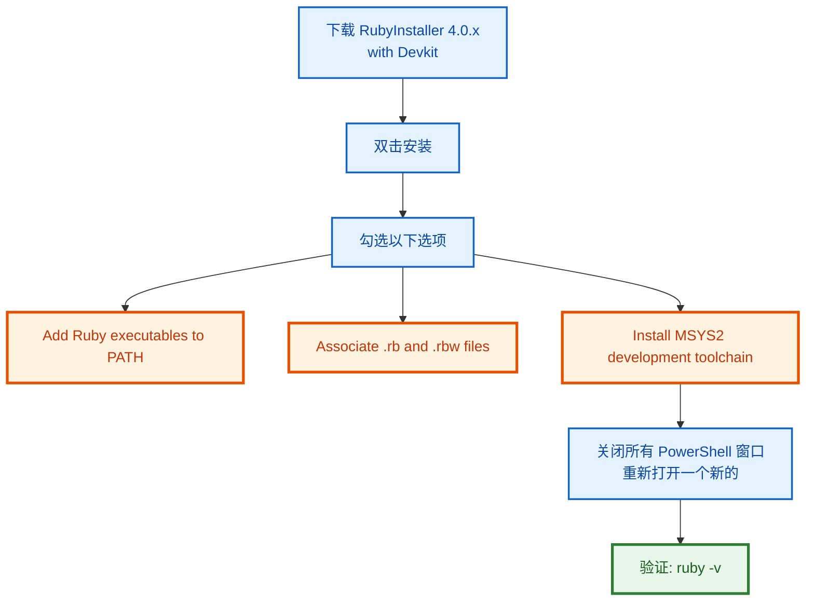

**期望输出**：

```
ruby 4.0.7 (2026-09-15 revision 229531a6cf) +PRISM [x64-mingw-ucrt]
```

**关键**：`x64-mingw-ucrt` 是正确平台。若显示 `x64-mswin64` 或 `x86-mingw32`，重装。

### 4.2 Step 2 — 验证 DevKit

```powershell
make --version
gcc --version
```

**期望**：

| 命令 | 期望输出 |
|---|---|
| `make --version` | `GNU Make 4.4.1` |
| `gcc --version` | `gcc.exe (Rev... x86_64-w64-mingw32) 13.x.x` |

**如果 `make --version` 显示 Embarcadero / Borland**：

| 方案 | 命令 | 作用范围 |
|:----:|------|----------|
| 1 | `$env:PATH = "C:\Ruby40-x64\msys64\usr\bin;" + $env:PATH` | 当前会话 |
| 2 | 系统设置 → 环境变量：把 `C:\Ruby40-x64\msys64\usr\bin` 移到 Embarcadero 之前 | 永久 |

### 4.3 Step 3 — 安装 gem 依赖

```powershell
gem install minitest
gem install rake
gem install debug        # 可选，仅调试需要
```

**验证**：

```powershell
ruby -e "require 'minitest/autorun'; puts 'minitest OK'"
ruby -e "require 'debug'; puts 'debug OK'"
```

### 4.4 Step 4 — 放置 LingoFuse 原生库

**需要的文件**：

| 文件 | 用途 |
|---|---|
| `LingoFuse64.dll` | 核心 RPC 库 |
| `z_ipc_64.dll` | IPC 底层 |
| `mimalloc64.dll` | 内存分配器 |
| `mimalloc-redirect.dll` | mimalloc 重定向 |

**推荐位置**：`D:\CoreLibrary\LingoFuse\Binary\`（项目根 `Binary` 目录）。

**`binding.rb` 的自动搜索顺序**：

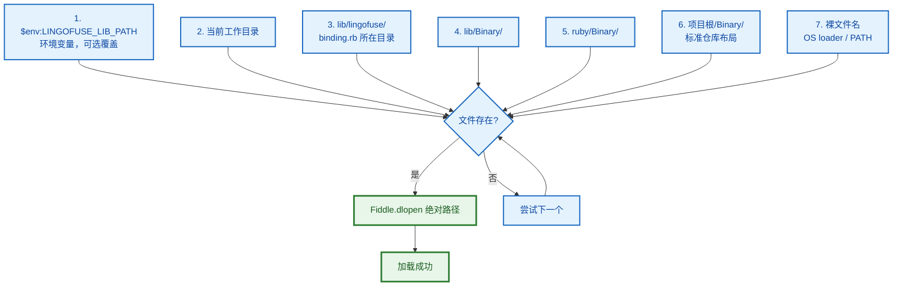

**第 6 条**命中标准仓库布局，所以**通常不需要设环境变量**。

**只在 DLL 放在别处时**才需要：

```powershell
$env:LINGOFUSE_LIB_PATH = "D:\OtherLocation\LingoFuse\Binary"
```

**`LingoFuse64.dll` 加载时会尝试加载其他 3 个 DLL**。如果它们不在同一目录、也不在 PATH 上，会报 `The specified module could not be found`。

---

## 五、环境诊断

### 5.1 两个诊断脚本的分工

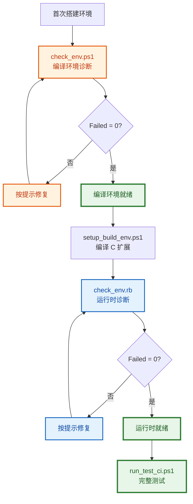

| 脚本 | 检查对象 | 何时运行 |
|------|----------|----------|
| `check_env.ps1` | 编译 C 扩展的工具链 | 首次搭建环境、编译失败时 |
| `check_env.rb` | Ruby 绑定运行时 | 首次使用、加载失败时 |

### 5.2 `check_env.ps1` — 编译环境诊断

```powershell
cd D:\CoreLibrary\LingoFuse\ruby
powershell -ExecutionPolicy Bypass -File check_env.ps1
```

**检查内容**（8 个 Section）：

| Section | 检查项 |
|:-------:|--------|
| 1 | PowerShell 版本 + 操作系统 |
| 2 | Ruby 版本 / 平台 / `RbConfig` |
| 3 | **GNU Make（区分 Embarcadero）+ gcc** |
| 4 | `mkmf` 可用性 + 实际编译一个 C 程序 |
| 5 | `pthread.h` 编译链接 + `ruby/thread.h` 存在 |
| 6 | `LINGOFUSE_LIB_PATH`（**可选**，缺失不阻塞） |
| 7 | 扩展源码树完整性 |
| 8 | 汇总报告 |

**期望尾部**：

```
  Passed : 26
  Warned : 0
  Failed : 0

  All required checks passed.
```

### 5.3 `check_env.rb` — 运行时诊断

```powershell
ruby check_env.rb
```

**检查内容**（5 个 Section）：

| Section | 检查项 |
|:-------:|--------|
| 1 | Ruby 版本 |
| 2 | 包布局（11 个 lib 文件 + 3 个 test 文件） |
| 3 | 原生库加载 + C ABI 往返（create / write / read / free） |
| 4 | 全栈冒烟测试 + **C 扩展加载状态** |
| 5 | 汇总 |

**期望尾部**：

```
  Passed : 26
  Failed : 0
```

**关键检查**：

```
  [OK]   lingofuse_ext is loaded (NativeBridge available).
```

如果显示 `[FAIL] lingofuse_ext is NOT available`，说明 C 扩展未正确安装，需要回到第 6 节重新编译。

---

## 六、编译 C 扩展

### 6.1 一键编译（推荐）

```powershell
cd D:\CoreLibrary\LingoFuse\ruby
powershell -ExecutionPolicy Bypass -File setup_build_env.ps1
```

### 6.2 内部流程

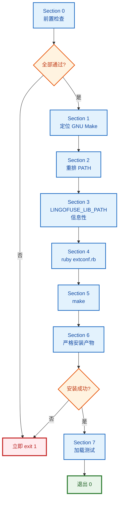

**Section 0 — 前置检查**（任一失败立即退出）：

| 检查项 | 失败信息 |
|--------|----------|
| 平台 = `Win32NT` | `This script targets Windows` |
| PowerShell ≥ 5 | `PowerShell N.N is too old` |
| `$PSScriptRoot` 非空 | `$PSScriptRoot is empty` |
| ext 源码树完整 | `Extension directory not found` |
| `ruby` 在 PATH | `ruby is not on PATH` |
| `ruby` 能运行 | `ruby is on PATH but does not run` |
| `gcc` 在 PATH | `gcc is not on PATH` |
| `mkmf` 可用 | `mkmf is not available` |

**Section 6 — 严格安装**：

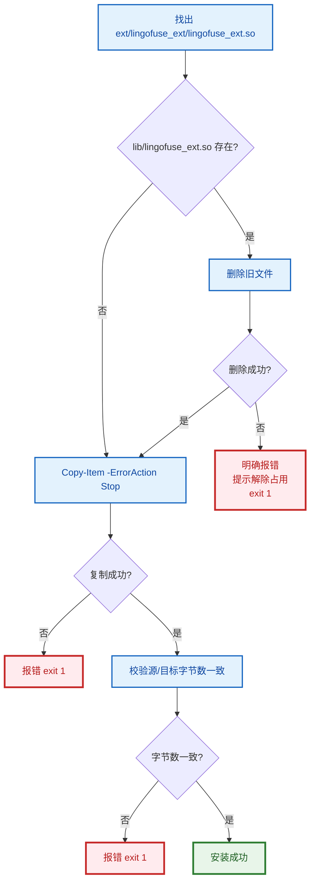

**期望关键输出**：

```
========================================================================
6. Artifact
========================================================================
  [OK]   Built: lingofuse_ext.so (45056 bytes)
  [OK]   Installed: D:\...\lib\lingofuse_ext.so (45056 bytes)

========================================================================
7. Load test
========================================================================
         LOADED: true true true
  [OK]   lingofuse_ext loads and exposes the full expected surface.
```

### 6.3 手动编译（备选）

```powershell
cd D:\CoreLibrary\LingoFuse\ruby\ext\lingofuse_ext

# 删除旧 Makefile
Remove-Item Makefile -ErrorAction SilentlyContinue

# 生成 Makefile
ruby extconf.rb

# 编译（必须用 GNU Make）
C:\Ruby40-x64\msys64\usr\bin\make.exe

# 复制产物
Copy-Item lingofuse_ext.so ..\..\lib\ -Force
```

### 6.4 编译产物

| 文件 | 位置 | 说明 |
|------|------|------|
| `lingofuse_ext.o` | `ext/lingofuse_ext/` | 中间对象文件 |
| `lingofuse_ext.so` | `ext/lingofuse_ext/` | 编译出的动态库 |
| `lingofuse_ext.so` | `lib/` | 安装副本（**运行时加载的**） |
| `Makefile` | `ext/lingofuse_ext/` | mkmf 生成 |
| `mkmf.log` | `ext/lingofuse_ext/` | mkmf 日志 |
| `*.def` | `ext/lingofuse_ext/` | 导出符号定义 |

### 6.5 清理

```powershell
cd D:\CoreLibrary\LingoFuse\ruby
powershell -ExecutionPolicy Bypass -File clean.ps1
```

**三种模式**：

| 命令 | 行为 |
|------|------|
| `.\clean.ps1` | 清 ext 中间产物 + `lib/lingofuse_ext.so` |
| `.\clean.ps1 -DryRun` | 只列不删 |
| `.\clean.ps1 -KeepInstalled` | 只清 ext 中间产物，保留安装副本 |

**如果提示"文件被占用"**：脚本会**自动列出**运行中的 Ruby 进程（Id / Memory / Path），用户用 `Stop-Process -Id <Id> -Force` 停止即可。

---

## 七、在自有 Ruby 项目中引入 LingoFuse

> **本章是独立章节，讲的是把 LingoFuse Ruby 绑定作为依赖项引入到**你自己的** Ruby 项目里。**

### 7.1 关键事实：Ruby 的 require 机制决定了什么

Ruby 有三种"库"，加载机制完全不同：

| 类型 | 例子 | 加载者 | 搜索路径 |
|------|------|--------|----------|
| **Ruby 源文件** | `*.rb` | `require` | `$LOAD_PATH` |
| **Ruby C 扩展** | `lingofuse_ext.so` | `require` | `$LOAD_PATH`（**仅此一处**） |
| **原生系统 DLL** | `LingoFuse64.dll` | `Fiddle.dlopen` | Windows 加载器搜索顺序（PATH + SetDllDirectory） |

**核心结论**：

> **Ruby 的 `require` 只搜索 `$LOAD_PATH` 中的目录。它不会自动去其他项目的 `lib/` 里找 `.rb` 或 `.so`。**
>
> **原生 DLL（如 `LingoFuse64.dll`）完全不归 `require` 管。它由 `Fiddle.dlopen` 加载，走 Windows 的 DLL 搜索顺序。**

这意味着：**当你在自己的 Ruby 项目里用 LingoFuse 时，必须手动把库文件放到正确位置。**

### 7.2 必须要手动复制的两个文件

| 文件 | 类型 | 必须复制到哪 |
|------|------|--------------|
| `lingofuse_ext.so` | Ruby C 扩展 | 目标的 `$LOAD_PATH` 里（例如项目的 `lib/`） |
| `LingoFuse64.dll` 及 3 个依赖 DLL | 原生系统库 | **同一目录**（4 个 DLL 必须在一起），且该目录需在搜索路径上 |

### 7.3 四种引入方案

假设 LingoFuse Ruby 绑定位于 `D:\CoreLibrary\LingoFuse\ruby\`，你的应用位于 `C:\temp\my_app.rb`。

#### 方案 A — 绝对路径 require（快速验证）

**最简单，适合一次性脚本或验证。**

```ruby
# C:\temp\my_app.rb

# 1. 让 LingoFuse 的 lib/ 进入 $LOAD_PATH
lingofuse_lib = 'D:/CoreLibrary/LingoFuse/ruby/lib'
$LOAD_PATH.unshift(lingofuse_lib) unless $LOAD_PATH.include?(lingofuse_lib)

# 2. 现在 require 就能找到 lingofuse.rb 和 lingofuse_ext.so
require 'lingofuse'

# 3. 原生 DLL 需要绑定到正确的目录
#    方案 1：把 4 个 DLL 复制到 C:\temp\（当前工作目录）
#    方案 2：设环境变量
ENV['LINGOFUSE_LIB_PATH'] = 'D:/CoreLibrary/LingoFuse/Binary'

# 4. 使用
puts LingoFuse.loaded?
puts LingoFuse.library_name
```

**优点**：零配置。**缺点**：路径硬编码，换机器需要改代码。

**注意**：Windows 上正斜杠 `/` 和反斜杠 `\\` 都接受。推荐正斜杠（免转义）。

#### 方案 B — 把绑定目录的 `lib/` 加到 `$LOAD_PATH`（推荐）

**适合不修改 LingoFuse 源码、只是想引用它的场景。**

```ruby
# C:\temp\my_app.rb

# ---------------------------------------------------------------------------
# 让 LingoFuse 的 lib/ 进入 load path
# ---------------------------------------------------------------------------
# 这一段必须在 `require 'lingofuse'` 之前。
# 它同时让 `require 'lingofuse'` 和 `require 'lingofuse_ext'` 都能找到。
# ---------------------------------------------------------------------------

lingofuse_lib = File.expand_path(
  'D:/CoreLibrary/LingoFuse/ruby/lib'
)
$LOAD_PATH.unshift(lingofuse_lib) unless $LOAD_PATH.include?(lingofuse_lib)

# ---------------------------------------------------------------------------
# 告诉 LingoFuse 原生 DLL 在哪
# ---------------------------------------------------------------------------
# 这一行让 binding.rb 在自动搜索时优先看这个目录。
# 也可以不设，只要 DLL 在项目的 Binary/ 或 PATH 上。
# ---------------------------------------------------------------------------

ENV['LINGOFUSE_LIB_PATH'] ||= 'D:/CoreLibrary/LingoFuse/Binary'

# ---------------------------------------------------------------------------
# 现在可以加载了
# ---------------------------------------------------------------------------

require 'lingofuse'
```

**优点**：不改 LingoFuse 源码；不用复制 DLL；`lingofuse_ext` 也能找到。
**缺点**：路径仍然硬编码（但只在一处）。

#### 方案 C — 复制文件到项目内（最独立）

**适合需要完全独立、不依赖 LingoFuse 源码树位置的项目。**

**步骤 1 — 复制 C 扩展**：

```powershell
Copy-Item D:\CoreLibrary\LingoFuse\ruby\lib\lingofuse_ext.so C:\temp\my_app\lib\ -Force
```

**步骤 2 — 复制原生 DLL**：

```powershell
# 4 个 DLL 必须在同一目录
Copy-Item D:\CoreLibrary\LingoFuse\Binary\*.dll C:\temp\my_app\lib\ -Force
```

**步骤 3 — 复制 Ruby 源文件**：

```powershell
Copy-Item D:\CoreLibrary\LingoFuse\ruby\lib\lingofuse.rb C:\temp\my_app\lib\ -Force
Copy-Item D:\CoreLibrary\LingoFuse\ruby\lib\lingofuse C:\temp\my_app\lib\ -Recurse -Force
```

**步骤 4 — 应用入口**：

```ruby
# C:\temp\my_app\my_app.rb

$LOAD_PATH.unshift(File.expand_path('lib', __dir__))
ENV['LINGOFUSE_LIB_PATH'] = File.expand_path('lib', __dir__)

require 'lingofuse'
```

**最终目录结构**：

```
C:\temp\my_app\
├── my_app.rb                  ← 你的应用入口
└── lib\
    ├── lingofuse.rb           ← 复制来的
    ├── lingofuse\             ← 复制来的（整个目录）
    │   ├── errors.rb
    │   ├── binding.rb
    │   ├── data_handle.rb
    │   ├── app_handle.rb
    │   ├── lf_io.rb
    │   ├── framework.rb
    │   ├── status.rb
    │   ├── network_events.rb
    │   ├── native_bridge.rb
    │   └── callback_error_reporter.rb
    ├── lingofuse_ext.so       ← 复制来的 C 扩展
    ├── LingoFuse64.dll        ← 复制来的原生库
    ├── z_ipc_64.dll           ← 复制来的
    ├── mimalloc64.dll         ← 复制来的
    └── mimalloc-redirect.dll  ← 复制来的
```

**优点**：完全独立，不需要 LingoFuse 源码树，可以打包发给别人。
**缺点**：升级 LingoFuse 时要重新复制。

#### 方案 D — Windows 目录联接（Junction）

**Windows 特有，不需要管理员权限，改动源文件立即生效。**

```powershell
# 1. 创建你的项目的 lib/ 目录（如果不存在）
mkdir C:\temp\my_app\lib -Force

# 2. 用 junction 让 lib/lingofuse 指向 LingoFuse 的 lib/lingofuse
cmd /c mklink /J C:\temp\my_app\lib\lingofuse D:\CoreLibrary\LingoFuse\ruby\lib\lingofuse

# 3. 复制顶层 lingofuse.rb（junction 只能指向目录）
Copy-Item D:\CoreLibrary\LingoFuse\ruby\lib\lingofuse.rb C:\temp\my_app\lib\ -Force

# 4. 复制 C 扩展（.so 是文件，不是目录）
Copy-Item D:\CoreLibrary\LingoFuse\ruby\lib\lingofuse_ext.so C:\temp\my_app\lib\ -Force

# 5. 复制原生 DLL
Copy-Item D:\CoreLibrary\LingoFuse\Binary\*.dll C:\temp\my_app\lib\ -Force
```

**应用入口**：

```ruby
# C:\temp\my_app\my_app.rb
$LOAD_PATH.unshift(File.expand_path('lib', __dir__))
ENV['LINGOFUSE_LIB_PATH'] = File.expand_path('lib', __dir__)
require 'lingofuse'
```

**Junction 效果**：

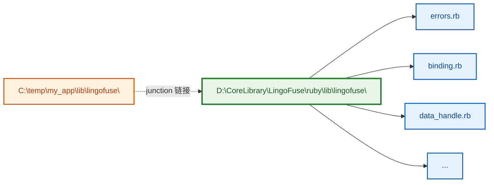

**优点**：不需要管理员权限；修改源码立即生效；删除联接是安全的。
**缺点**：Windows 特有。

### 7.4 四种方案对比

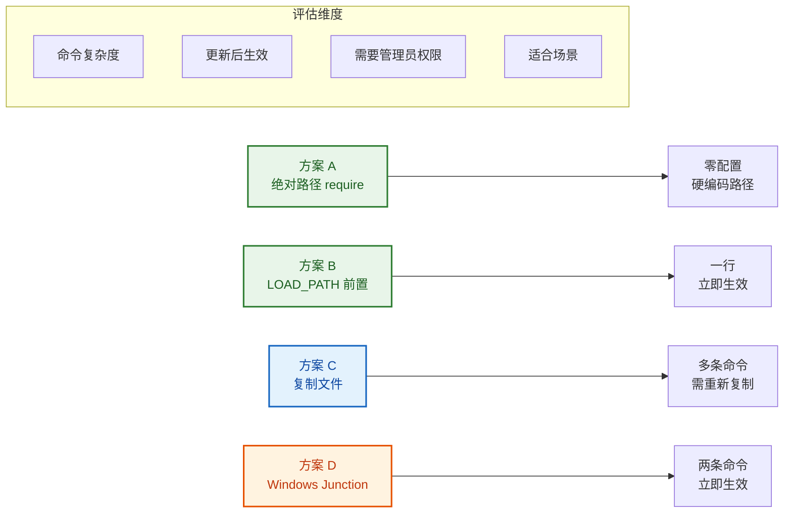

| 方案 | 命令复杂度 | 包更新后 | 需要管理员 | 适合场景 |
|:----:|:---------:|:--------:|:---------:|----------|
| A 绝对路径 require | 零 | 立即生效 | 否 | 快速验证、一次性脚本 |
| B `$LOAD_PATH` 前置 | 一行 | 立即生效 | 否 | 引用 LingoFuse 源码树 |
| C 复制文件 | 多条命令 | 需重新复制 | 否 | 完全独立、打包分发 |
| D Windows 目录联接 | 两条命令 | 立即生效 | 否 | Windows 开发调试 |

### 7.5 关键注意点（总结）

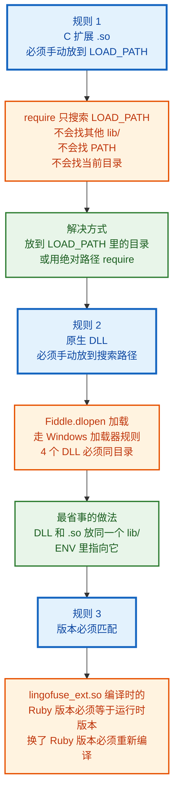

**注意点 1 — C 扩展（`.so`）必须手动放到 `$LOAD_PATH` 里**

Ruby 的 `require 'lingofuse_ext'` **只搜索 `$LOAD_PATH`**。它不会：
- ❌ 去 LingoFuse 源码树找
- ❌ 去当前目录之外的地方找
- ❌ 去 PATH 里找

所以你必须做以下之一：
- 把 `lingofuse_ext.so` 放到 `$LOAD_PATH` 里的某个目录（通常是项目的 `lib/`）
- 用绝对路径 `require_relative` 或 `require '/path/to/lingofuse_ext'`

**注意点 2 — 原生 DLL 必须手动放到搜索路径上**

`LingoFuse64.dll` 等**不归 Ruby 管**，由 `Fiddle.dlopen` 加载。搜索规则是 Windows 加载器的规则（按优先级）：

1. `SetDllDirectoryW` 设置的目录（`binding.rb` 加载 DLL 前会注册）
2. `$LINGOFUSE_LIB_PATH` 环境变量指向的目录（`binding.rb` 自己检查的）
3. `Fiddle.dlopen` 绝对路径加载时所在的目录
4. `PATH` 环境变量
5. 系统目录

**最省事的做法**：4 个 DLL 和 `lingofuse_ext.so` 放在**同一个目录**（例如项目的 `lib/`），然后设 `ENV['LINGOFUSE_LIB_PATH']` 指向那个目录。

**注意点 3 — 4 个 DLL 必须永远在一起**

- `LingoFuse64.dll` 加载时会自动加载 `z_ipc_64.dll` 和 `mimalloc64.dll`
- 这 3 个 DLL 必须在**同一目录**
- 少一个都会报 `The specified module could not be found`

**注意点 4 — 版本必须匹配**

- `lingofuse_ext.so` 编译时的 Ruby 版本必须和运行时的 Ruby 版本一致
- 换了 Ruby 版本（例如从 4.0.7 升到 4.1.0）必须重新编译

### 7.6 完整最小示例

**目录结构**：

```
C:\temp\my_app\
├── app.rb
└── lib\
    ├── lingofuse.rb
    ├── lingofuse\
    ├── lingofuse_ext.so
    ├── LingoFuse64.dll
    ├── z_ipc_64.dll
    ├── mimalloc64.dll
    └── mimalloc-redirect.dll
```

**`app.rb`**：

```ruby
# frozen_string_literal: true

# ---------------------------------------------------------------------------
# 步骤 1：让项目自己的 lib/ 进入 $LOAD_PATH
# ---------------------------------------------------------------------------
# 这个目录里同时有：
#   * Ruby 源文件（lingofuse.rb / lingofuse/）
#   * C 扩展（lingofuse_ext.so）
# 所以 require 两个都能找到。

lib_dir = File.expand_path('lib', __dir__)
$LOAD_PATH.unshift(lib_dir) unless $LOAD_PATH.include?(lib_dir)

# ---------------------------------------------------------------------------
# 步骤 2：让原生 DLL 也被找到
# ---------------------------------------------------------------------------
# lib_dir 里同时有 4 个原生 DLL。
# LINGOFUSE_LIB_PATH 是 binding.rb 优先检查的目录。

ENV['LINGOFUSE_LIB_PATH'] ||= lib_dir

# ---------------------------------------------------------------------------
# 步骤 3：加载
# ---------------------------------------------------------------------------

require 'lingofuse'

puts "LingoFuse loaded: #{LingoFuse.loaded?}"
puts "Library name:     #{LingoFuse.library_name}"
puts "NativeBridge:     #{LingoFuse::NativeBridge.available?}"

# ---------------------------------------------------------------------------
# 步骤 4：使用
# ---------------------------------------------------------------------------

app = LingoFuse::AppHandle.new('MyApp', 'Demo')

app.register_call('echo', 'Echo a string') do |input, output|
  text = LingoFuse::LfIo.read_string(input)
  LingoFuse::LfIo.write_string(output, text)
end

param = LingoFuse::DataHandle.new('echo')
LingoFuse::LfIo.write_string(param, 'hello')

result = app.local_call(param)
puts "Result: #{LingoFuse::LfIo.read_string(result)}"

param.dispose
result.dispose
app.dispose
```

**运行**：

```powershell
cd C:\temp\my_app
ruby app.rb
```

**期望输出**：

```
LingoFuse loaded: true
Library name:     LingoFuse64.dll
NativeBridge:     true
Result: hello
```

---

## 八、测试

### 8.1 测试体系总览

```mermaid
flowchart TD
    Root["测试套件<br/>14 个文件 / 331 项测试"]

    Root --> G1["组 1<br/>纯 Ruby<br/>3 文件 / 53 项"]
    Root --> G2["组 2<br/>JSON 策略<br/>2 文件 / 65 项"]
    Root --> G3["组 3-5<br/>需原生库<br/>8 文件 / 195 项"]
    Root --> G6["组 6<br/>C 扩展专用<br/>1 文件 / 18 项"]

    G1 --> T1["test_errors<br/>23 项"]
    G1 --> T2["test_callback_error_reporter<br/>10 项"]
    G1 --> T3["test_module_helpers<br/>20 项"]

    G2 --> T4["test_lf_io<br/>32 项"]
    G2 --> T5["test_lf_io_extra<br/>33 项"]

    G3 --> T6["test_data_handle<br/>44 项"]
    G3 --> T7["test_data_handle_extra<br/>20 项"]
    G3 --> T8["test_app_handle<br/>33 项"]
    G3 --> T9["test_app_handle_extra<br/>15 项"]
    G3 --> T10["test_status<br/>17 项"]
    G3 --> T11["test_network_events<br/>27 项"]
    G3 --> T12["test_framework<br/>30 项"]
    G3 --> T13["test_network<br/>9 项"]

    G6 --> T14["test_native_bridge_self_test<br/>18 项"]

    classDef root fill:#E3F2FD,stroke:#1565C0,stroke-width:3px,color:#0D47A1
    classDef pure fill:#E8F5E9,stroke:#2E7D32,stroke-width:2px,color:#1B5E20
    classDef partial fill:#FFF3E0,stroke:#E65100,stroke-width:2px,color:#BF360C
    classDef native fill:#F3E5F5,stroke:#6A1B9A,stroke-width:2px,color:#4A148C
    classDef cext fill:#FCE4EC,stroke:#AD1457,stroke-width:3px,color:#880E4F

    class Root root
    class G1,T1,T2,T3 pure
    class G2,T4,T5 partial
    class G3,T6,T7,T8,T9,T10,T11,T12,T13 native
    class G6,T14 cext
```

| 组 | 文件 | 测试数 | 是否需要原生库 |
|:--:|------|:------:|:--------------:|
| 1 | `test_errors.rb` | 23 | 否 |
| 1 | `test_callback_error_reporter.rb` | 10 | 否 |
| 1 | `test_module_helpers.rb` | 20 | 否 |
| 2 | `test_lf_io.rb` | 32 | 部分 |
| 2 | `test_lf_io_extra.rb` | 33 | 部分 |
| 3 | `test_data_handle.rb` | 44 | 是 |
| 3 | `test_data_handle_extra.rb` | 20 | 是 |
| 4 | `test_app_handle.rb` | 33 | 是 |
| 4 | `test_app_handle_extra.rb` | 15 | 是 |
| 5 | `test_status.rb` | 17 | 是 |
| 5 | `test_network_events.rb` | 27 | 是 |
| 5 | `test_framework.rb` | 30 | 是 |
| 5 | `test_network.rb` | 9 | 是 |
| 6 | `test_native_bridge_self_test.rb` | 18 | C 扩展专用 |

### 8.2 三种运行方式

| 方式 | 命令 | 用途 |
|------|------|------|
| 开发（Windows） | `.\run_tests.ps1` | 交互式跑全部 14 个文件 |
| CI（Windows） | `.\run_test_ci.ps1` | 与开发版功能相同，独立文件 |
| CI（Linux / macOS） | `bash run_test_ci.sh` | 在 POSIX 环境跑 |

**运行流程**：

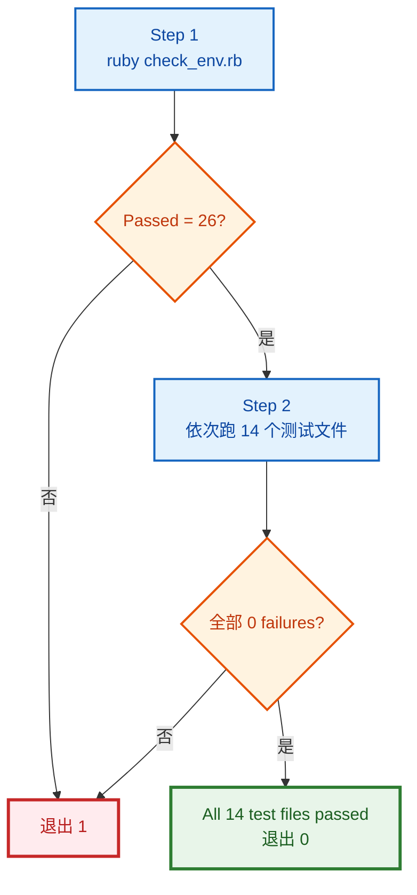

### 8.3 14 个测试文件详细说明

**组 1 — 纯 Ruby（无需原生库）**：

| 文件 | 覆盖内容 |
|------|----------|
| `test_errors.rb` | 异常层级：基类、子类、字段、`rescue` 多态 |
| `test_callback_error_reporter.rb` | 处理器安装、`report` 分发、异常吞噬、并发安全 |
| `test_module_helpers.rb` | `VERSION` / `load_library` / `library_name` / `platform` / `cstr_ptr` / `read_cstr` |

**组 2 — JSON 策略（部分需要原生库）**：

| 文件 | 覆盖内容 |
|------|----------|
| `test_lf_io.rb` | 紧凑输出、非 ASCII 字面量、往返、strict 解析、`IoError` 包装 |
| `test_lf_io_extra.rb` | 边界：`NUL_BYTE` / `ENCODING` / `cstr` / `peek` 游标 / `read_all_bytes` / `try_read_json` |

**组 3 — 数据句柄**：

| 文件 | 覆盖内容 |
|------|----------|
| `test_data_handle.rb` | 构造、位置、大小、字节 I/O、10 种标量类型、NUL 帧字符串、所有权、生命周期、块形式 |
| `test_data_handle_extra.rb` | 边界：写入返回值、多字节 UTF-8、无效 UTF-8 替换、大载荷、`create_permanent` |

**组 4 — 应用句柄**：

| 文件 | 覆盖内容 |
|------|----------|
| `test_app_handle.rb` | 构造、注册 Call/Notify、本地调用、重复注册、注销、大小写不敏感、回调异常隔离、回调生命周期 |
| `test_app_handle_extra.rb` | 边界：无客户端时 `bind`、未注册 API、注册表键小写、非标准异常、`local_call` 参数校验 |

**组 5 — 门面层**：

| 文件 | 覆盖内容 |
|------|----------|
| `test_status.rb` | 状态队列（count / get / drain / post）、`check_main_thread` / `check_app` / `check_api` |
| `test_network_events.rb` | `set` / `clear` / `installed?` / `set_listener`、`NetworkEventListener`、`NetworkEventQueue` |
| `test_framework.rb` | `reset_prepare` / `prepare_service` / `prepare_client` / `prepare_done` / `set_option` / `generate_app_name` / `get_app_name` / `call` / `try_call` |
| `test_network.rb` | `Overlap_Connection` 两种模式、`prepare_done` 只返回一次 `true`、状态队列往返 |

**组 6 — C 扩展自测**：

| 文件 | 覆盖内容 |
|------|----------|
| `test_native_bridge_self_test.rb` | 扩展 API 表面、trampoline 地址、`create_ref` / `free_ref`、队列空时 `wait_for_work`、Call/Notify/Network 三种 trampoline、GVL 分流、异常隔离、FIFO、并发 |

### 8.4 测试环境与条件

| 条件 | 必要性 | 说明 |
|------|:------:|------|
| Ruby 4.0+ | **必需** | 无 Ruby 无法运行 |
| LingoFuse64.dll 等 4 个 DLL | **必需** | 组 3/4/5 需要 |
| C 扩展 (`lingofuse_ext.so`) | **组 6 必需** | 其他组会警告但可运行 |
| `minitest` gem | **必需** | 测试框架 |
| 至少 4 个空闲 IPC 端点 | 条件 | 组 5 会创建大量 `ipc:ruby_*` 端点 |
| 无其他 LingoFuse 进程占用相同端点 | 条件 | 测试使用随机端点名，冲突概率极低 |

### 8.5 预期输出

```powershell
cd D:\CoreLibrary\LingoFuse\ruby
.\run_test_ci.ps1
```

**末尾**：

```
========================================================================
All 14 test files passed.
========================================================================
```

**各项统计**：

| 文件 | Runs | Assertions | Failures | Errors |
|------|:----:|:----------:|:--------:|:------:|
| test_errors.rb | 23 | 39 | 0 | 0 |
| test_callback_error_reporter.rb | 10 | 17 | 0 | 0 |
| test_module_helpers.rb | 20 | 41 | 0 | 0 |
| test_lf_io.rb | 32 | 58 | 0 | 0 |
| test_lf_io_extra.rb | 33 | 40 | 0 | 0 |
| test_data_handle.rb | 44 | 85 | 0 | 0 |
| test_data_handle_extra.rb | 20 | 40 | 0 | 0 |
| test_app_handle.rb | 33 | 57 | 0 | 0 |
| test_app_handle_extra.rb | 15 | 28 | 0 | 0 |
| test_status.rb | 17 | 24-40 * | 0 | 0 |
| test_network_events.rb | 27 | 37 | 0 | 0 |
| test_framework.rb | 30 | 41 | 0 | 0 |
| test_network.rb | 9 | 29 | 0 | 0 |
| test_native_bridge_self_test.rb | 18 | 55 | 0 | 0 |
| **合计** | **331** | — | **0** | **0** |

> \* `test_status.rb` 的断言数取决于状态队列长度，非确定性，属正常现象。

### 8.6 日志中"看起来像错误但实际是预期"的条目

| 日志 | 来源 | 说明 |
|------|------|------|
| `[LingoFuse::NativeBridge] callback raised: intentional ...` | 自测 11 / 14 | 故意触发异常，验证 C 端 fallback 日志 |
| `[LingoFuse] Callback error in ...boom...` | test_app_handle | 故意抛异常，验证异常隔离 |
| `no found api "does_not_exist"` | 多个文件 | 故意调用不存在的 API |
| `prepare error: repeat listen/connection addr` | test_framework / test_network | 故意重复地址 |
| `LF_BindApp: Main thread is not active` | test_app_handle_extra | 故意在无主线程时 bind |
| `hint: Data handle pool "N" handles automatically freed.` | 所有含 DataHandle 的测试 | 10 分钟空闲回收，正常行为 |

---

## 九、API 说明

### 9.1 顶层模块函数

```ruby
require 'lingofuse'
```

| 函数 | 说明 |
|------|------|
| `LingoFuse::VERSION` | 绑定版本字符串（`"1.0.0"`） |
| `LingoFuse.load_library` | 幂等，总是返回 `true`（加载在 `require` 时已完成） |
| `LingoFuse.loaded?` | 原生库是否已加载 |
| `LingoFuse.library_name` | 平台相关的库文件名 |
| `LingoFuse.platform` | `{ ruby:, platform:, library: }` |
| `LingoFuse.cstr_ptr(str)` | 转 `Fiddle::Pointer`（NUL 结尾 UTF-8） |
| `LingoFuse.read_cstr(ptr)` | 从指针读 UTF-8 字符串 |

### 9.2 `LingoFuse::DataHandle`

RAII 包装：`TDataHnd`。

**构造**：

```ruby
h = LingoFuse::DataHandle.new('api_name')             # 自动回收
h = LingoFuse::DataHandle.create_permanent('api_name') # 永久
h = LingoFuse::DataHandle.borrow(raw_pointer)          # 借用（回调内用）
LingoFuse::DataHandle.open('api_name') { |h| ... }     # 块形式
```

**方法分类**：

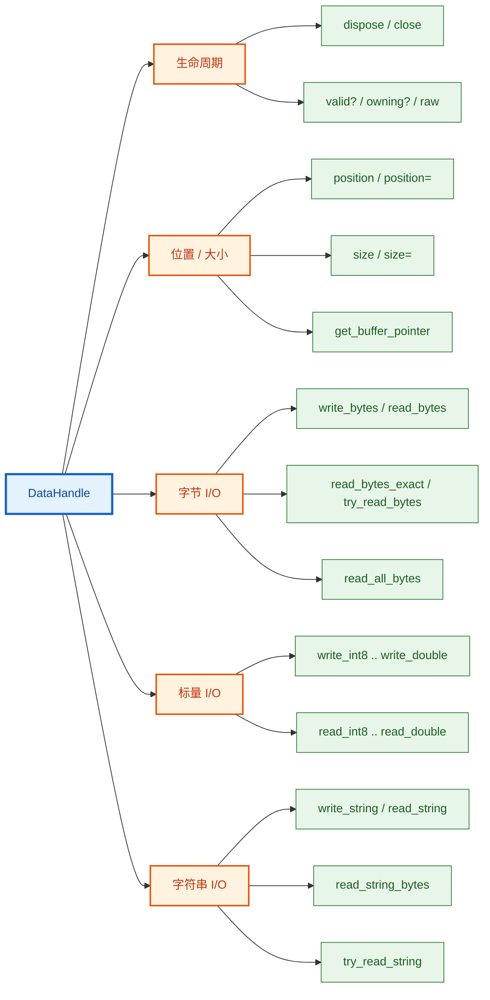

### 9.3 `LingoFuse::AppHandle`

RAII 包装：`TAppHnd`。

**构造**：

```ruby
app = LingoFuse::AppHandle.new('AppName', 'description')
```

**方法**：

| 方法 | 说明 |
|------|------|
| `app.register_call(name, desc, &block)` | 注册 Call API |
| `app.register_notify(name, desc, &block)` | 注册 Notify API |
| `app.unregister(name)` | 注销，返回 `true` / `false` |
| `app.local_call(param)` | 本地同步调用，返回新 `DataHandle` |
| `app.local_notify(param)` | 本地异步通知 |
| `app.bind` | 绑定到空闲客户端，返回数量 |
| `app.dispose` | 释放（**两阶段析构第一步**） |
| `app.valid?` / `app.raw` / `app.name` | 状态访问 |

**回调签名**：

```ruby
app.register_call('add', 'Add two ints') do |input, output|
  a = input.read_int32
  b = input.read_int32
  output.write_int32(a + b)
end

app.register_notify('log', 'One-way log') do |input|
  msg = input.read_string
  puts msg
end
```

**回调整约**：

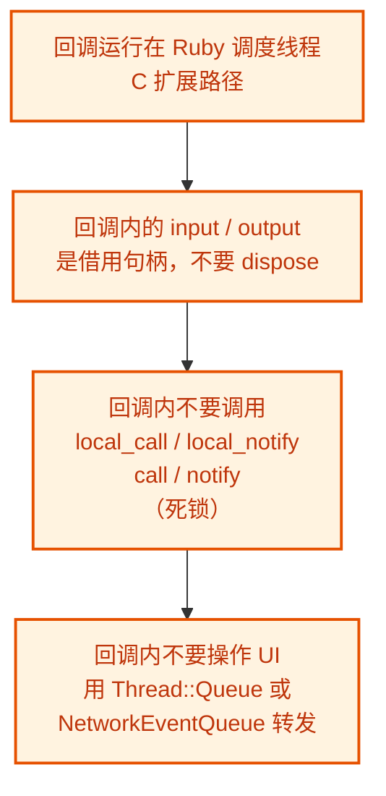

### 9.4 `LingoFuse::LfIo`

统一 JSON / 字符串 / 字节 I/O。

| 函数 | 说明 |
|------|------|
| `LfIo.dumps_json(obj)` | 序列化：紧凑、非 ASCII 字面量 |
| `LfIo.loads_json(text)` | strict 解析 |
| `LfIo.write_string(handle, str)` | 写 UTF-8 + NUL |
| `LfIo.read_string(handle)` | 读到 NUL |
| `LfIo.write_string_bytes(handle, bytes)` | 写原始字节 + NUL |
| `LfIo.read_string_bytes(handle)` | 读到 NUL（不解码） |
| `LfIo.peek_string_bytes(handle)` | 读到 NUL，**不移动游标** |
| `LfIo.read_all_bytes(handle)` | 读剩余全部 |
| `LfIo.write_json(handle, obj)` | 序列化 + 写 + NUL |
| `LfIo.read_json(handle)` | 读 + 解析（抛 `JSON::ParserError`） |
| `LfIo.try_read_json(handle)` | 非抛异常版本（返回 `nil`） |
| `LfIo.cstr(value)` | 规范化为字符串 |

**线格式**：

```
[UTF-8 encoded JSON text][NUL byte]
```

**跨语言字节级兼容**：`{"a":1}` 在所有绑定上的字节序列都是：

```
7B 22 61 22 3A 31 7D 00
```

### 9.5 `LingoFuse::Framework`

进程级门面。

| 方法 | 说明 |
|------|------|
| `Framework.reset_prepare` | 清空准备队列 |
| `Framework.prepare_service(listen, physics)` | 准备服务端点 |
| `Framework.prepare_client(physics, app)` | 准备客户端连接 |
| `Framework.prepare_done` | 启动框架（**只返回一次 `true`**） |
| `Framework.exit_main_thread` | 请求主线程退出 |
| `Framework.set_option(name, value)` | 调整运行时选项 |
| `Framework.generate_app_name` | 生成唯一 App 名 |
| `Framework.get_app_name(app)` | 查询 App 权威名 |
| `Framework.call(app, param, timeout_ms)` | 同步远程调用 |
| `Framework.try_call(app, param, timeout_ms)` | 空响应返回 `nil` |
| `Framework.notify(app, param)` | 单向通知 |
| `Framework.sequenced_notify(app, param)` | FIFO 通知 |
| `Framework.shutdown` | 完全关闭（幂等） |

**运行时选项**：

| 选项 | 默认 | 说明 |
|------|:----:|------|
| `Wait_Ready` / `Wait_Connection_ReadyOk` | `True` | `prepare_done` 是否等待所有客户端就绪 |
| `Wait_Connection_Timeout` | 30000 | 等待超时（毫秒） |
| `Overlap_Connection` | `False` | 是否允许同地址多客户端 |
| `Fixed_Sequenced_Time` | 20000 | 顺序通知回退阈值 |
| `Quiet` | `False` | 安静模式 |
| `ShowThreadID` | — | 日志显示线程 ID |
| `ConsoleOutput` | — | 控制台输出 |

### 9.6 `LingoFuse::Status`

| 方法 | 说明 |
|------|------|
| `Status.get_status_count` | 队列中待处理消息数 |
| `Status.get_status` | 弹出下一条 |
| `Status.drain_status(max)` | 弹出最多 `max` 条 |
| `Status.post_status(msg)` | 推入一条 |
| `Status.check_main_thread` | 主线程是否运行 |
| `Status.check_app(name)` | App 是否可见 |
| `Status.check_api(app, api)` | API 是否可见 |

### 9.7 `LingoFuse::NetworkEvents`

进程全局连接 / 断开处理器。

```ruby
LingoFuse::NetworkEvents.set(
  on_connect:    ->(addr) { puts "+ #{addr}" },
  on_disconnect: ->(addr) { puts "- #{addr}" }
)
LingoFuse::NetworkEvents.clear
LingoFuse::NetworkEvents.installed?
LingoFuse::NetworkEvents.set_listener(listener)
```

**语义**：

- **Connect** — 客户端首次收到服务 API 广播时触发，**不是** TCP 建链
- **Disconnect** — 物理链路丢失时触发
- **回调线程** — 原生工作线程

### 9.8 `LingoFuse::NetworkEventListener`

面向对象风格：

```ruby
class MyListener < LingoFuse::NetworkEventListener
  def on_connect(addr); end
  def on_disconnect(addr); end
end

LingoFuse::NetworkEvents.set_listener(MyListener.new)
```

### 9.9 `LingoFuse::NetworkEventQueue`

队列式消费：

```ruby
q = LingoFuse::NetworkEventQueue.global_instance
q.install
begin
  loop do
    type, addr = q.get(timeout: 1.0)
    # type 是 :connect 或 :disconnect
  end
ensure
  q.uninstall
end
```

### 9.10 `LingoFuse::NativeBridge`

C 扩展的 Ruby 包装。**通常不直接使用**。

| 方法 | 说明 |
|------|------|
| `NativeBridge.available?` | 扩展是否加载 |
| `NativeBridge.start` | 启动调度线程（幂等） |
| `NativeBridge.register_call(app, name, desc, &block)` | 注册 Call，返回 `ref_addr` |
| `NativeBridge.register_notify(app, name, desc, &block)` | 注册 Notify |
| `NativeBridge.unregister(ref_addr)` | 释放 ref |

C 扩展直接暴露的方法（通过 `lingofuse_ext.so`）：

| 方法 | 说明 |
|------|------|
| `create_ref(proc, kind)` | 保存 Proc，返回地址 |
| `free_ref(addr)` | 释放 |
| `call_trampoline_addr` | Call trampoline 地址 |
| `notify_trampoline_addr` | Notify trampoline 地址 |
| `network_connect_trampoline_addr` | 连接 trampoline |
| `network_disconnect_trampoline_addr` | 断开 trampoline |
| `set_network_refs(conn, disc)` | 设置全局网络 ref |
| `process_all` | 处理队列全部项 |
| `wait_for_work(timeout_ms)` | 等待工作，返回 Boolean |
| `test_invoke_from_native_thread(...)` | 测试用 |
| `test_invoke_network_event(...)` | 测试用 |
| `test_invoke_network_event_inplace(...)` | 测试用 |

**kind 常量**：

| 值 | 含义 |
|:-:|------|
| `0` | Call |
| `1` | Notify |
| `2` | Network connect |
| `3` | Network disconnect |

### 9.11 `LingoFuse::CallbackErrorReporter`

```ruby
LingoFuse::CallbackErrorReporter.handler = ->(source, error) do
  puts "[#{source}] #{error.class}: #{error.message}"
end

LingoFuse::CallbackErrorReporter.report('src', err)
```

- 未装 handler 时写到 `$stderr`
- handler 内部异常被吞噬
- 线程安全

### 9.12 异常层级

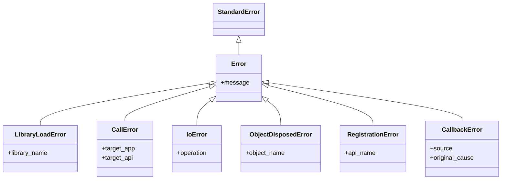

**捕获策略**：

```ruby
begin
  # LingoFuse 操作
rescue LingoFuse::CallError => e
  puts "调用失败: #{e.target_app}.#{e.target_api}"
rescue LingoFuse::Error => e
  puts "LingoFuse 错误: #{e.message}"
end
```

---

## 十、使用示例

### 10.1 纯本地调用

```ruby
require 'lingofuse'

app = LingoFuse::AppHandle.new('Calculator', 'Demo')

app.register_call('add', 'Add two ints') do |input, output|
  a = input.read_int32
  b = input.read_int32
  output.write_int32(a + b)
end

param = LingoFuse::DataHandle.new('add')
param.write_int32(5)
param.write_int32(7)

result = app.local_call(param)
puts result.read_int32   # 12

param.dispose
result.dispose
app.dispose
```

### 10.2 服务端

```ruby
require 'lingofuse'

app = LingoFuse::AppHandle.new('Calculator', 'Server')

app.register_call('add', 'Add') do |input, output|
  req = LingoFuse::LfIo.read_json(input)
  result = (req['a'] || 0) + (req['b'] || 0)
  LingoFuse::LfIo.write_json(output, { result: result })
end

LingoFuse::Framework.set_option('Wait_Ready', 'False')
LingoFuse::Framework.reset_prepare
LingoFuse::Framework.prepare_service('ipc:calc', 'ipc:calc')
LingoFuse::Framework.prepare_client('ipc:calc', app)

if LingoFuse::Framework.prepare_done
  puts 'Server ready. Press Enter to exit...'
  $stdin.gets
end

LingoFuse::Framework.exit_main_thread
app.dispose
LingoFuse::Framework.shutdown
```

### 10.3 客户端

```ruby
require 'lingofuse'

LingoFuse::Framework.set_option('Wait_Ready', 'False')
LingoFuse::Framework.reset_prepare
LingoFuse::Framework.prepare_client('ipc:calc', nil)
LingoFuse::Framework.prepare_done

# 等待 App 可见
30.times do
  break if LingoFuse::Status.check_app('Calculator')
  sleep 0.2
end

param = LingoFuse::DataHandle.new('add')
LingoFuse::LfIo.write_json(param, { a: 40, b: 2 })

result = LingoFuse::Framework.call('Calculator', param, 3000)
puts LingoFuse::LfIo.read_json(result)['result']   # 42

param.dispose
result.dispose
LingoFuse::Framework.exit_main_thread
LingoFuse::Framework.shutdown
```

### 10.4 Cross Demo

三个进程，验证跨进程 / 跨语言：

```powershell
# 终端 1
ruby cross/cross_service.rb

# 终端 2
ruby cross/cross_node.rb

# 终端 3
ruby cross/cross_call.rb
```

```mermaid
flowchart LR
    Call["cross_call<br/>压测客户端<br/>32 线程 × 10 秒"]
    Service["cross_service<br/>信标<br/>不注册任何 API"]
    Node["cross_node<br/>工作节点<br/>demo.add / demo.inv_seri"]

    Call -->|"① 发现信标"| Service
    Service -.->|"② 广播 App 路由"| Node
    Call ==>|"③ Call add / inv_seri"| Node
    Node -->|"④ 字节响应"| Call

    classDef beacon fill:#FFF3E0,stroke:#E65100,stroke-width:3px,color:#BF360C
    classDef worker fill:#E8F5E9,stroke:#2E7D32,stroke-width:3px,color:#1B5E20
    classDef client fill:#E3F2FD,stroke:#1565C0,stroke-width:3px,color:#0D47A1

    class Service beacon
    class Node worker
    class Call client
```

| 进程 | 角色 | 说明 |
|------|------|------|
| `cross_service.rb` | 协调者（信标） | 创建 `ipc:cross` 端点，不注册任何 API |
| `cross_node.rb` | 工作节点 | 注册 `demo.add` / `demo.inv_seri` 两个 Call API |
| `cross_call.rb` | 压测客户端 | 32 线程 × 10 秒，压测 `demo` 应用 |

---

## 十一、故障排查速查

| 症状 | 原因 | 修复 |
|------|------|------|
| `ruby: command not found` | PATH 未生效 | 重启 PowerShell |
| `cannot load such file -- lingofuse` | `$LOAD_PATH` 未包含 `lib/` | 见第 7 章方案 A/B/C/D |
| `Failed to load the LingoFuse native library` | DLL 找不到 | 检查 `Binary/` 或设 `LINGOFUSE_LIB_PATH` |
| `[BUG] rb_thread_call_with_gvl()` | C 扩展未编译 | 跑 `setup_build_env.ps1` |
| `[LingoFuse::NativeBridge] lingofuse_ext not available` | C 扩展不在 `$LOAD_PATH` | 见第 7 章，把 `.so` 放到 `$LOAD_PATH` |
| `No GNU Make found` | DevKit 未安装 / PATH 顺序 | 见 §4.2 |
| `Fatal makefile ... No terminator` | 用了 Embarcadero Make | 前置 msys64 到 PATH |
| `gettimeofday: conflicting types` | 头文件冲突 | 更新 `lingofuse_ext.c`（去 `<sys/time.h>`） |
| `undefined reference to 'clock_gettime'` | MinGW 缺 pthread | 重装 DevKit |
| `Cannot replace lib\lingofuse_ext.so` | 文件被占用 | `Get-Process ruby \| Stop-Process -Force` |
| `The specified module could not be found` | DLL 缺依赖 | 4 个 DLL 必须同目录 |
| `prepare error: repeat listen` | 地址重复 | `Framework.reset_prepare` 后重试 |
| `prepare error: repeat connection` | 地址重复 | 设 `Overlap_Connection=True` |
| `no connection` | 目标 App 不可见 | 等 broadcast 广播，用 `check_app` 轮询 |
| `hint: Data handle pool ... automatically freed.` | 10 分钟空闲回收 | 正常行为 |
| `callback raised: ...`（前缀 `NativeBridge`） | 回调抛异常 | 修回调；已通过 `CallbackErrorReporter` 报告 |
| 调试器无法启动 | `debug` gem 未装 | `gem install debug` |

**通用排查顺序**：

```mermaid
flowchart TD
    Issue["遇到问题"] --> Q1{"check_env.ps1<br/>通过?"}
    Q1 -->|"否"| Fix1["修复编译环境<br/>见 §5.2"]
    Q1 -->|"是"| Q2{"setup_build_env.ps1<br/>通过?"}
    Q2 -->|"否"| Fix2["按 Section 0 的报错修复<br/>见 §6.2"]
    Q2 -->|"是"| Q3{"check_env.rb<br/>通过?"}
    Q3 -->|"否"| Fix3["修复运行时环境<br/>见 §5.3"]
    Q3 -->|"是"| Q4{"run_test_ci.ps1<br/>通过?"}
    Q4 -->|"否"| Fix4["看具体失败的测试文件<br/>见 §8.3"]
    Q4 -->|"是"| OK["环境完全就绪"]

    classDef ok fill:#E8F5E9,stroke:#2E7D32,stroke-width:3px,color:#1B5E20
    classDef fail fill:#FFEBEE,stroke:#C62828,stroke-width:2px,color:#B71C1C
    classDef check fill:#FFF3E0,stroke:#E65100,stroke-width:2px,color:#BF360C

    class OK ok
    class Fix1,Fix2,Fix3,Fix4 fail
    class Q1,Q2,Q3,Q4 check
```

---

## 附录 A — 与其他语言的互通性

同一个 JSON 载荷在**所有** LingoFuse 绑定上产生**相同的字节序列**：

| 语言 | 文件 | 绑定类型 |
|------|------|----------|
| Pascal | `lingofuse_import.pas` | 原生 |
| C | `LingoFuse.h` / `LingoFuse.c` | 原生 |
| C++ | `LingoFuse.hpp` / `lf_io.hpp` | 原生 |
| C# | `LingoFuse.cs` / `LfIo.cs` | P/Invoke |
| Python | `lingofuse.lf_io` | ctypes |
| JavaScript | `index.js` / `lf-io.js` | Koffi |
| **Ruby** | **本绑定** | **Fiddle + C 扩展** |
| Rust | `io.rs` | FFI |
| Go | `lingofuse.go` | purego |
| Dart | `lf_io.dart` | FFI |
| Java | `LingoFuse.java` | FFM API |
| Swift | `LfIo.swift` | C++ 桥 |
| Zig | `lf_io.zig` | C ABI |
| Erlang | `lingofuse.erl` | NIF |

**示例**：`{"a":1}` 在所有绑定上的线字节：

```
7B 22 61 22 3A 31 7D 00
```

跨语言 RPC **无需任何转码层**。

---

## 附录 B — 快速命令卡

```powershell
# ============ 环境诊断 ============
cd D:\CoreLibrary\LingoFuse\ruby

.\check_env.ps1                        # 编译环境
ruby check_env.rb                      # 运行时环境

# ============ 编译 C 扩展 ============
.\setup_build_env.ps1                  # 一键编译 + 安装 + 加载测试
.\clean.ps1                            # 清理全部编译产物
.\clean.ps1 -DryRun                    # 预览清理
.\clean.ps1 -KeepInstalled             # 只清 ext/，保留 lib/

# ============ 测试 ============
.\run_tests.ps1                        # 开发测试
.\run_test_ci.ps1                      # CI 测试

# 单个测试
ruby test\test_errors.rb
ruby test\test_data_handle.rb
ruby test\test_native_bridge_self_test.rb

# ============ Cross Demo（三个终端）============
ruby cross\cross_service.rb
ruby cross\cross_node.rb
ruby cross\cross_call.rb
```

---

## 附录 C — 关于动态库搜索的关键总结

```mermaid
flowchart TD
    R1["规则 1<br/>Ruby 的 require 只搜索 LOAD_PATH"]
    R1 --> R1A["require 'lingofuse'<br/>在 LOAD_PATH 找 lingofuse.rb 或 .so"]
    R1 --> R1B["require 'lingofuse_ext'<br/>在 LOAD_PATH 找 lingofuse_ext.so"]
    R1 --> R1C["不会搜索<br/>其他项目的 lib/<br/>PATH<br/>当前目录"]

    R1C --> R2["规则 2<br/>原生 DLL 由 Fiddle.dlopen 加载<br/>走 Windows 加载器规则"]
    R2 --> R2A["4 个 DLL 必须在同一目录"]
    R2 --> R2B["搜索顺序:<br/>SetDllDirectory<br/>PATH<br/>系统目录"]
    R2 --> R2C["binding.rb 自动尝试 6 个位置<br/>见 §4.4"]

    R2C --> R3["规则 3<br/>所有需要的文件放在一起"]
    R3 --> R3A["项目 lib/ 同时放:<br/>Ruby 源文件<br/>C 扩展 .so<br/>4 个 DLL"]
    R3 --> R3B["入口设置:<br/>LOAD_PATH 指向 lib/<br/>LINGOFUSE_LIB_PATH 指向 lib/"]
    R3 --> R3C["见第 7 章方案 C"]

    classDef rule fill:#E3F2FD,stroke:#1565C0,stroke-width:3px,color:#0D47A1
    classDef detail fill:#FFF3E0,stroke:#E65100,stroke-width:2px,color:#BF360C
    classDef fix fill:#E8F5E9,stroke:#2E7D32,stroke-width:2px,color:#1B5E20

    class R1,R2,R3 rule
    class R1A,R1B,R1C,R2A,R2B,R2C detail
    class R3A,R3B,R3C fix
```

**记住三条规则**：

1. **Ruby 的 `require` 只搜索 `$LOAD_PATH`**
   - `require 'lingofuse'` → 在 `$LOAD_PATH` 找 `lingofuse.rb` 或 `lingofuse.so`
   - `require 'lingofuse_ext'` → 在 `$LOAD_PATH` 找 `lingofuse_ext.so`
   - **不会**搜索其他项目的 `lib/`、**不会**搜索 `PATH`、**不会**搜索当前目录

2. **原生 DLL 由 `Fiddle.dlopen` 加载，走 Windows 加载器规则**
   - `LingoFuse64.dll` 及其 3 个依赖 DLL 必须**在同一目录**
   - 搜索顺序：`SetDllDirectory` → `PATH` → 系统目录
   - `binding.rb` 会自动尝试 6 个位置（见 §4.4），但**你必须保证 DLL 在其中之一**

3. **把自己项目需要的所有文件放在一起**
   - 推荐做法：项目里的 `lib/` 同时放 Ruby 源文件、C 扩展、4 个 DLL
   - 入口设置 `$LOAD_PATH` 和 `LINGOFUSE_LIB_PATH` 都指向这个 `lib/`
   - 见第 7 章方案 C

---

## 附录 D — 许可

MIT。

---

*文档版本 1.0 · 与 LingoFuse Ruby 绑定 1.0.0 匹配 · 最后更新 2026-10-04*