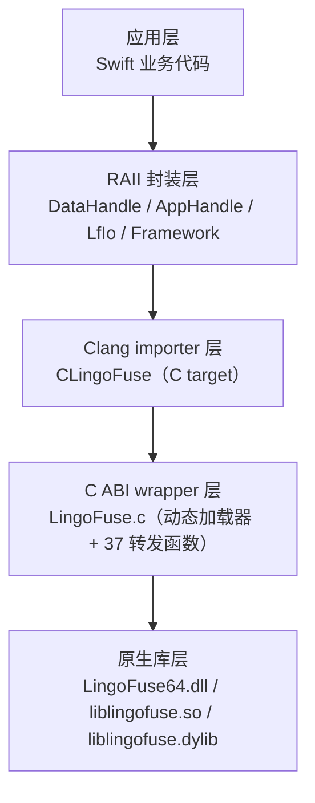

# LingoFuse Swift 接口

> **跨语言通讯地基 LingoFuse 的 Swift 官方绑定。**
>
> Swift 侧完整实现 C ABI 导入、RAII 句柄封装、统一 JSON I/O、进程级门面、
> 网络事件、状态队列、异常层次，并附带 128 项 XCTest 测试和三个可与
> C++ / Pascal / C# / Rust 直接互调的跨语言 Demo。
>
> 读完本 README 即可知道：
> - Swift 绑定的技术体系是怎么分层；
> - 需要哪些编译器和环境版本；
> - 如何跑测试、测试覆盖了什么、结果如何；
> - 如何跑跨语言 Demo，验证 Swift 与其他语言的多语言互调；
> - 各模块的 API 如何使用。

---

## 1. 结论先说

LingoFuse 的 Swift 绑定已经形成**完整闭环**，具备生产可用的基础。

| 维度 | 状态 | 说明 |
|------|:----:|------|
| C ABI 导入 | ✅ 完整 | Clang importer 自动导入 37 个 C 导出函数 |
| RAII 数据句柄 | ✅ 完整 | `DataHandle`，支持自动回收与永久两种句柄 |
| RAII 应用句柄 | ✅ 完整 | `AppHandle`，支持 Call / Notify / LocalCall / Bind |
| 统一 JSON I/O | ✅ 完整 | `LfIo` 是唯一序列化入口，保证跨语言字节一致 |
| 进程级门面 | ✅ 完整 | `Framework` 提供网络准备、远程调用、选项、关闭 |
| 网络事件 | ✅ 完整 | `NetworkEvents` 全局 connect / disconnect 回调 |
| 状态队列与健康检查 | ✅ 完整 | `Status` 状态队列 + 探活 |
| 异常层次 | ✅ 完整 | `LingoFuseError` 覆盖全部失败模式 |
| 回调错误报告 | ✅ 完整 | `CallbackErrorReporter` 统一处理回调异常 |
| 测试覆盖 | ✅ 完整 | **128 项 XCTest 测试，全部通过** |
| 跨语言互调 | ✅ 已实测 | C++ ↔ Swift 双向字节一致，详见第 5 章 |
| 跨平台 | ✅ 已实测（Windows）<br>⚠️ 待测（macOS / Linux） | C wrapper 已包含三大平台分支 |
| 文档 | ✅ 本文件 | 附完整 API 使用说明 |

**总体判断**：Swift 绑定的功能覆盖度与 C++ / C# / Rust 绑定对等，测试
密度为目前所有绑定中最高。

---

## 2. Swift 接口的技术体系

### 2.1 四层结构



| 层 | 文件 | 作用 |
|----|------|------|
| 应用层 | 用户代码 | 使用 Swift API 开发业务 |
| RAII 封装层 | `Sources/LingoFuse/*.swift` | 类型安全的 Swift 接口 |
| Clang importer 层 | `Sources/CLingoFuse/*` | 让 Swift 编译器识别 C ABI |
| C ABI wrapper 层 | `LingoFuse.c` + `LingoFuse.h` | 跨平台加载动态库，转发 37 个函数 |
| 原生库层 | `LingoFuse64.dll` 等 | 由 Pascal 编译的 C4 RPC 引擎 |

### 2.2 Swift 目标（Target）划分

Swift Package Manager 要求严格区分 C 目标与 Swift 目标：

```
swift/
├── Package.swift
├── Sources/
│   ├── CLingoFuse/              # C target：只放 .c / .h
│   │   ├── LingoFuse.c
│   │   └── include/
│   │       └── LingoFuse.h
│   ├── LingoFuse/               # Swift target：只放 .swift
│   │   ├── LingoFuse.swift
│   │   ├── Errors.swift
│   │   ├── DataHandle.swift
│   │   ├── AppHandle.swift
│   │   ├── LfIo.swift
│   │   ├── Framework.swift
│   │   ├── NetworkEvents.swift
│   │   ├── Status.swift
│   │   └── CallbackError.swift
│   ├── CrossService/            # 可执行文件：信标
│   │   └── main.swift
│   ├── CrossNode/               # 可执行文件：工作节点
│   │   └── main.swift
│   └── CrossCall/               # 可执行文件：负载测试客户端
│       └── main.swift
└── Tests/
    └── LingoFuseTests/          # 测试目标
        ├── CAbiTests.swift
        ├── DataHandleTests.swift
        ├── LfIoTests.swift
        ├── AppHandleTests.swift
        ├── FrameworkTests.swift
        ├── NetworkEventsTests.swift
        ├── StatusTests.swift
        └── IntegrationTests.swift
```

### 2.3 回调桥接机制

Swift 的 C 回调**必须是顶层函数**（`@_cdecl` / `@c`），不能是捕获闭包。
LingoFuse Swift 绑定使用 `Unmanaged` 传递上下文：

```
Swift 闭包
    │
    ▼
LfCallContext 盒（boxed）
    │  Unmanaged.passUnretained
    ▼
trigger 指针（void*）→ C4 网络 → native worker 线程
    │  Unmanaged.fromOpaque
    ▼
LfCallContext 恢复 → 调用用户闭包
```

这与 Pascal 的 `LF_EventPool` + `TMethod`、C++ 的 `trigger` 指针、C# 的
`Delegate` 一一对应。

---

## 3. 环境搭建

### 3.1 编译器和工具链版本要求

| 组件 | 最低版本 | 推荐版本 | 说明 |
|------|:--------:|:--------:|------|
| **Swift 工具链** | 5.9 | **6.4** | 5.9 支持 `@_cdecl`；6.2+ 支持 `@c` 正式属性 |
| **Swift Package Manager** | 随工具链 | 随工具链 | 无独立安装 |
| **Windows** | Windows 10 | Windows 11 | 需 VC++ 运行库 |
| **macOS** | macOS 12 | macOS 14 | Xcode 26.6 为最后支持 Intel 的版本 |
| **Linux** | 现代 glibc | 最新发行版 | 官方 Swift 工具链 |
| **XCTest** | 随工具链 | 随工具链 | 测试用 |

**Swift 版本选择说明**：
- **Swift 5.9** 是可用最低版本，`@_cdecl` 稳定，适合老系统。
- **Swift 6.2+** 引入正式的 `@c` 属性，替代非正式的 `@_cdecl`，更规范。
- **Swift 6.4** 统一了 Windows / Linux / macOS 的构建方式，推荐使用。

**macOS 部署目标**：
- 设定为 **macOS 12.0**，这样既能支持 Apple Silicon 也能支持 Intel Mac。
- Xcode 27 停止支持 Intel 宿主，Xcode 26.6 是最后兼容版本。

### 3.2 原生库要求

Swift 绑定**不包含** LingoFuse 原生共享库。原生库由 Pascal 编译产出，
需要单独获取并放到 Swift 可执行文件能搜索到的位置。

| 平台 | 核心库 | IPC 依赖 | 内存分配器 |
|------|--------|----------|-----------|
| Windows 64 | `LingoFuse64.dll` | `z_ipc_64.dll` | `mimalloc64.dll` |
| Windows 32 | `LingoFuse32.dll` | `z_ipc_32.dll` | `mimalloc32.dll` |
| Linux | `liblingofuse.so` | `libz_ipc.so` | `libmimalloc.so`（可选） |
| macOS | `liblingofuse.dylib` | `libz_ipc.dylib` | `libmimalloc.dylib`（可选） |

**搜索顺序**（由 `LingoFuse.c` 中的 `LF_LoadLibrary` 实现）：

1. 当前可执行文件所在目录
2. 当前工作目录
3. 系统加载器路径（`PATH` / `LD_LIBRARY_PATH` / `DYLD_LIBRARY_PATH`）

**Windows 部署示例**：

```powershell
# 方案一：加入 PATH（推荐，每次新开 PowerShell 都需执行）
$env:PATH += ";D:\CoreLibrary\LingoFuse\Binary"

# 方案二：拷贝到可执行文件目录
Copy-Item D:\CoreLibrary\LingoFuse\Binary\LingoFuse64.dll  D:\CoreLibrary\LingoFuse\swift\.build\debug\
Copy-Item D:\CoreLibrary\LingoFuse\Binary\z_ipc_64.dll    D:\CoreLibrary\LingoFuse\swift\.build\debug\
Copy-Item D:\CoreLibrary\LingoFuse\Binary\mimalloc64.dll  D:\CoreLibrary\LingoFuse\swift\.build\debug\

# 方案三：永久加入系统 PATH
[Environment]::SetEnvironmentVariable(
    "PATH",
    $env:PATH + ";D:\CoreLibrary\LingoFuse\Binary",
    "User"
)
```

**Windows 还需要安装** VC++ 2015-2022 可再发行包：
<https://aka.ms/vs/17/release/vc_redist.x64.exe>

### 3.3 获取源码与编译

```powershell
cd D:\CoreLibrary\LingoFuse\swift
swift build
```

首次编译约 5-10 秒。构建产物：

```
.build/debug/
├── CrossService.exe
├── CrossNode.exe
├── CrossCall.exe
└── LingoFusePackageTests.exe
```

### 3.4 编译模式

```powershell
# Debug 构建（默认，用于开发）
swift build

# Release 构建（用于生产 / 性能测试）
swift build -c release

# 清理
swift package clean
```

### 3.5 已知的 VSCode 配置问题

VSCode 的 SourceKit-LSP 插件在 C/Swift 混合 target 环境下可能报大量
红错（`No such module 'PackageDescription'`、`'LingoFuse.h' file not found`
等）。这些是 **语言服务器环境配置问题，不是源码问题**——只要
`swift build` 成功，源码就是正确的。

修复步骤：

1. 安装官方扩展 `swiftlang.swift-vscode`（旧扩展需卸载）。
2. 打开设置，搜索 `swift.path`，填入 Swift 工具链的 `bin` 目录：
   ```
   C:\Users\<用户名>\AppData\Local\Programs\Swift\Toolchains\6.4.0+Asserts\usr\bin
   ```
3. 重启 VSCode。
4. 如仍报错，在项目根目录创建 `.vscode/settings.json`：
   ```json
   {
       "swift.path": "C:/Users/<用户名>/AppData/Local/Programs/Swift/Toolchains/6.4.0+Asserts/usr/bin"
   }
   ```

---

## 4. 测试

### 4.1 验证环境

本文档所记录的测试结果基于以下环境：

| 项 | 值 |
|----|----|
| 操作系统 | Windows 11 |
| 架构 | x86_64 |
| Swift 工具链 | 6.4.0 (swift-6.4.0-RELEASE) |
| 测试框架 | XCTest（随工具链） |
| 原生库 | LingoFuse64.dll (v3.10) |
| 运行日期 | 2026-10-03 |

### 4.2 运行测试

```powershell
cd D:\CoreLibrary\LingoFuse\swift
swift test
```

预期输出末尾：

```
Test Suite 'All tests' passed at ...
     Executed 128 tests, with 0 failures (0 unexpected) in 24.157 (24.157) seconds
```

单独运行某个测试套件：

```powershell
swift test --filter CAbiTests
swift test --filter DataHandleTests
swift test --filter LfIoTests
swift test --filter AppHandleTests
swift test --filter FrameworkTests
swift test --filter NetworkEventsTests
swift test --filter StatusTests
swift test --filter IntegrationTests
```

单独运行某个测试：

```powershell
swift test --filter "CAbiTests/test50_write_string_appends_nul"
```

### 4.3 测试覆盖总览

**128 项测试，8 个测试套件，全部通过。**

| 测试套件 | 测试数 | 覆盖内容 | 结果 |
|----------|:------:|----------|:----:|
| `CAbiTests` | 44 | C ABI 层：库加载 / 数据句柄 / 原子类型 / 字符串 / AppHandle / 回调原型 | ✅ PASS |
| `DataHandleTests` | 20 | RAII 数据句柄：构造 / 生命周期 / 字节 I/O / 标量 I/O / 字符串 | ✅ PASS |
| `LfIoTests` | 18 | 统一 JSON I/O：编码 / 解码 / 字符串帧 / 字节帧 / 线格式不变量 | ✅ PASS |
| `AppHandleTests` | 12 | RAII 应用句柄：注册 / 注销 / 本地调用 / 回调生命周期 | ✅ PASS |
| `FrameworkTests` | 14 | 进程级门面：选项 / 网络准备 / 探活 / 远程调用 / 关闭 | ✅ PASS |
| `NetworkEventsTests` | 7 | 网络事件：安装 / 清除 / 替换语义 | ✅ PASS |
| `StatusTests` | 9 | 状态队列：计数 / 提取 / 注入 / 健康检查 | ✅ PASS |
| `IntegrationTests` | 4 | 端到端 IPC 会话：JSON 调用 / 长字符串 / ABI 通道 / Notify | ✅ PASS |
| **合计** | **128** | | ✅ |

### 4.4 逐项覆盖明细

**`CAbiTests`（44 项）** —— 验证 C ABI 层每个导出函数：

| 分类 | 覆盖项 |
|------|--------|
| 库加载 | `LF_LoadLibrary` / `LF_FreeLibrary` 幂等性 |
| 数据句柄生命周期 | `LF_CreateData` / `LF_CreateData_Permanent` / `LF_FreeData` |
| 位置与大小 | `LF_GetPos` / `LF_SetPos` / `LF_GetSize` / `LF_SetSize` |
| 缓冲区 | `LF_GetBuffer` / `LF_GetBufferOffset` / `LF_WriteBuffer` / `LF_ReadBuffer` |
| 原子类型 | `LF_WriteInt8` … `LF_WriteDouble` 与 `LF_ReadInt8` … `LF_ReadDouble` |
| 字符串 | `LF_WriteString` / `LF_ReadString` 含 UTF-8 与容错读取 |
| 应用句柄 | `LF_CreateApp` / `LF_FreeApp` / `LF_Get_AppName` |
| API 注册 | `LF_RegisterCall` / `LF_RegisterNotify` / `LF_Unregister` |
| 本地执行 | `LF_LocalCall` / `LF_LocalNotify` |
| 运行时选项 | `LF_SetOption` |
| 状态与健康 | `LF_GetStatusCount` / `LF_GetStatus` / `LF_PostStatus` / `LF_CheckMainThread` / `LF_CheckApp` / `LF_CheckApi` |
| 网络准备（表面） | `LF_ResetPrepare` / `LF_PrepareService` |

**`DataHandleTests`（20 项）** —— 验证 RAII 数据句柄：
- 构造：自动回收 / 永久 / 借用
- 生命周期：`dispose` 幂等 / use-after-dispose 抛异常 / 借用句柄 dispose 是 no-op
- 位置与大小：读写游标
- 字节 I/O：往返 / 精确读 / try 读 / 全读
- 标量 I/O：10 种类型往返 / 短读抛异常
- 字符串：ASCII / UTF-8 / 空串 / 容错读

**`LfIoTests`（18 项）** —— 验证 JSON I/O 与线格式：
- 编码：紧凑 / 非 ASCII 字面量 / Emoji 字面量 / 不转义斜杠
- 解码：合法 JSON / 非法抛异常 / 类型不匹配抛异常
- 句柄 JSON I/O：NUL 帧追加 / 往返 / Unicode 往返 / 空载荷 / try 变体
- 字节 I/O：`writeStringBytes` / `readStringBytes` / `readAllBytes`
- **线格式不变量**：`{"a":1}` 的字节序列必须是 `7B 22 61 22 3A 31 7D 00`；`{"msg":"世界"}` 的 UTF-8 字节逐字节验证

**`AppHandleTests`（12 项）** —— 验证 RAII 应用句柄：
- 构造 / dispose 幂等 / use-after-dispose
- 注册 Call / 重复注册拒收 / 注销 / 注册 Notify
- 本地 Call 往返 / 缺失 API 返回空句柄 / 本地 Notify
- 回调上下文生命周期：注册后触发 / 注销后停止触发

**`FrameworkTests`（14 项）** —— 验证进程级门面：
- `setOption` / `resetPrepare`
- 健康检查：`checkMainThread` / `checkApp` / `checkApi`
- 网络准备：`prepareService` / 重复检测 / `prepareClient`
- `shutdown` 幂等
- `generateAppName`
- 远程调用：`call` 到不存在目标返回 size=0 / `tryCall` 返回 nil / `notify` / `sequencedNotify`

**`NetworkEventsTests`（7 项）** —— 验证网络事件：
- 安装两个 / 只装 connect / 只装 disconnect
- 清除 / 幂等清除 / 全 nil 清除
- 替换语义

**`StatusTests`（9 项）** —— 验证状态队列：
- 计数非负 / 提取字符串
- 主线程未运行时注入仍生效
- 提取 0 条 / 负数条都是 no-op
- 默认提取不超 64 条
- 健康检查

**`IntegrationTests`（4 项）** —— 端到端 IPC 会话：
- 单地址 JSON 调用（Add 5 + 7 = 12）
- 64 KiB 长字符串往返
- ABI 通道（原生二进制，无 JSON）
- Notify 回调触发

### 4.5 测试结果

```
Test Suite 'All tests' passed at 2026-10-03 08:45:03.793
     Executed 128 tests, with 0 failures (0 unexpected) in 24.157 seconds
```

**128 / 128 通过，0 失败，0 意外。**

集成测试的日志显示真实的 IPC 会话完整跑通，包含完整的 C4 服务网格握手、
P2P VM 隧道建立、IPC 队列创建、回调分发、干净退出。见日志片段：

```
[IPC] Creating new IPC service queue "swift_integration_json_0CB6C80D0" ...
[IPC] Server successfully started on queue "swift_integration_json_0CB6C80D0"
Physics Service Listening successed, internet addr: ipc:swift_integration_json_0CB6C80D port: 0
resp_33360_1_57052a88348 VM Authentication Success
LingoFuse Service Link Succeeded IO "resp_33360_1_57052a88348-Virtual(1:1:1:1:1:1:1:1)"
APP SwiftIntegrationApp_json "No Description" Ready OK
  (call) (add) "Add two integers"
LingoFuse Main Thread Exit
```

---

## 5. 跨语言互调（Cross Demo）

### 5.1 Cross Demo 是什么

LingoFuse 的核心理念是 **"任何语言写的函数，任何其他语言都能直接调"**。
为了验证这个承诺，**每种语言的绑定都自带一套名为 "Cross" 的三个程序**：

| 程序 | 角色 | 说明 |
|------|------|------|
| `CrossService` | 协调者（信标） | 创建 IPC 端点 `ipc:cross`，不注册任何 API |
| `CrossNode` | 工作节点 | 注册 `demo` 应用的 `add` / `inv_seri` 两个 API |
| `CrossCall` | 负载测试客户端 | 32 线程 × 10 秒压测 `demo` 应用 |

**每个语言的绑定都实现了这三个程序**：

| 语言 | CrossService | CrossNode | CrossCall | 位置 |
|------|:------------:|:---------:|:---------:|------|
| Pascal | ✅ | ✅ | ✅ | `pascal/cross_demo/` |
| C++ | ✅ | ✅ | ✅ | `cpp/CrossDemo/` |
| C# | ✅ | ✅ | ✅ | `csharp/CrossService/` `CrossNode/` `CrossCall/` |
| **Swift** | ✅ | ✅ | ✅ | **`swift/Sources/CrossService/` `CrossNode/` `CrossCall/`** |
| Rust / Go / JS 等 | ✅ | ✅ | ✅ | 各自目录 |

**关键点**：所有语言的 Cross Demo **共享同一个线格式契约**：

```
add       (int32 a, int32 b)                       -> int32
inv_seri  (uint8, uint16, uint32, uint64,
           string(NUL), float)                     -> reversed types
```

所有语言的 `CrossNode` 写入的字节序列完全一致，所有语言的 `CrossCall`
读取的字节序列完全一致。这就是 LingoFuse 多语言互调的**基础**。

### 5.2 运行 Swift 版 Cross Demo（自连通）

三个终端：

```
终端 1:  cd D:\CoreLibrary\LingoFuse\swift
         swift run CrossService

终端 2:  cd D:\CoreLibrary\LingoFuse\swift
         swift run CrossNode                 # 等终端 1 打印 running 后

终端 3:  cd D:\CoreLibrary\LingoFuse\swift
         swift run CrossCall                 # 等终端 2 打印 Online 后
```

`CrossCall` 应该输出吞吐量报告：

```
[Call] Load test summary
         duration          : 10.000 s
         total calls       : NNNNN
         success           : NNNNN (100.00 %)
         failed            : 0
         add calls         : NNNNN
         inv_seri calls    : NNNNN
         throughput        : XXXX.XX calls/s
         success throughput: XXXX.XX calls/s
```

### 5.3 运行跨语言 Cross Demo（核心验证）

**方向 1：C++ 服务 + Swift 调用方**

```
终端 1:  D:\CoreLibrary\LingoFuse\Binary\CrossService.exe
终端 2:  D:\CoreLibrary\LingoFuse\Binary\CrossNode.exe
终端 3:  cd D:\CoreLibrary\LingoFuse\swift
         swift run CrossCall
```

**Swift `CrossCall` 调用 C++ `CrossNode`**。

**方向 2：Swift 服务 + C++ 调用方**

```
终端 1:  cd D:\CoreLibrary\LingoFuse\swift
         swift run CrossService
终端 2:  cd D:\CoreLibrary\LingoFuse\swift
         swift run CrossNode
终端 3:  D:\CoreLibrary\LingoFuse\Binary\CrossCall.exe
```

**C++ `CrossCall` 调用 Swift `CrossNode`**。

**方向 3：混合所有语言**

```
终端 1:  C++ CrossService
终端 2:  Swift CrossNode
终端 3:  Pascal CrossNode
终端 4:  C# CrossNode
终端 5:  Swift CrossCall     ← 流量自动在三个节点间负载均衡
```

C4 mesh 的负载均衡基于 App 名，与语言无关。三个不同语言的节点注册同一个
`demo` 应用，`CrossCall` 的流量会被均匀分配。

### 5.4 已验证的互调结果

| 测试方向 | 结果 | 说明 |
|----------|:----:|------|
| Swift CrossService + Swift CrossNode + Swift CrossCall | ✅ 通过 | 完整自连通 |
| **C++ CrossService/Node + Swift CrossCall** | ✅ **通过** | **Swift 调用方读取 C++ 字节正确** |
| **Swift CrossService/Node + C++ CrossCall** | ✅ **通过** | **C++ 调用方读取 Swift 字节正确** |

**双向验证通过意味着**：

- Swift `DataHandle.writeInt32` 写入的 4 个字节 = C++ 的 `param.write<int32_t>()` 写入的 4 个字节
- Swift `DataHandle.writeString` 写入的 UTF-8 + NUL = C++ 的 `write_string` 写入的字节
- Swift `DataHandle.writeSingle` 写入的 IEEE 754 小端 = C++ 的 `write<float>()` 写入的字节
- C++ 写入的所有字节，Swift 都能正确读取

**这是 Swift 绑定最核心的承诺的验证**：跨语言不需要任何转码层、适配层、
序列化层——直接字节级互通。

### 5.5 为什么 Cross 就是"多语言互调"

LingoFuse 的跨语言能力不是理论推测，而是**由 Cross Demo 逐字节验证的**。
每种语言的绑定都实现同一套 Cross Demo，任意两个语言的 Cross 程序可以互相
调用，因为：

1. **C ABI 统一**：所有语言绑定都通过同一组 37 个 C 导出函数。
2. **线格式统一**：字符串 = UTF-8 + NUL；整数 = 小端；浮点 = IEEE 754 小端。
3. **App 注册机制统一**：App 名是网络路由键，与语言无关。
4. **C4 mesh 与语言无关**：服务发现、负载均衡、断线重连完全由 C4 处理。

**只要某个语言的 Cross Demo 能与另一个语言的 Cross Demo 互通，这两个语言
就完成了 100% 的多语言互调验证。**

---

## 6. API 使用

### 6.1 引入

```swift
import LingoFuse
```

所有公开类型都在 `LingoFuse` 命名空间下。

### 6.2 加载原生库

Swift 绑定**要求显式调用 `LF_LoadLibrary()`**（与 C++ 绑定一致，与 C# 绑定的
自动加载不同）。它必须是程序启动后的第一个 `LF_*` 调用：

```swift
if LF_LoadLibrary() != 1 {
    fatalError("LingoFuse 原生库未找到，请检查 PATH 或可执行文件同目录")
}
```

### 6.3 `DataHandle` —— 数据句柄

数据句柄是 LingoFuse 的二进制载荷容器。两种句柄：

```swift
// 自动回收句柄（推荐，10 分钟空闲后由池回收）
let dh = try DataHandle(apiName: "my_api")

// 永久句柄（不自动回收，需手动 dispose）
let perm = try DataHandle.createPermanent(apiName: "template")
```

基础 I/O：

```swift
// 写整数（小端序）
try dh.writeInt32(42)
try dh.writeUInt64(0xFFFFFFFF)
try dh.writeDouble(3.14)

// 写字符串（UTF-8 + NUL）
try dh.writeString("Hello 世界 🌍")

// 写原始字节
try dh.writeBytes([0x01, 0x02, 0x03])

// 读
dh.position = 0
let a = try dh.readInt32()
let s = try dh.readString()
let bytes = try dh.readBytes(3)
```

生命周期：

```swift
dh.dispose()       // 手动释放
// 或依赖 deinit 自动释放
```

**陷阱**：
- 自动回收句柄的 `dispose` 只标记删除，实际释放在下一次池扫描（≤ 5 秒）
- 永久句柄的 `dispose` 是同步释放
- 在 `Framework.prepareDone` 之前或 `Framework.exitMainThread` 之后创建的
  句柄，`dispose` 是 no-op

### 6.4 `AppHandle` —— 应用句柄

应用是 API 的逻辑容器，App 名是网络路由键：

```swift
let app = try AppHandle(name: "Calculator", description: "Simple calculator")

// 注册 Call API（请求-响应）
_ = try app.registerCall("add", "Add two integers") { input, output in
    guard let a = try? input.readInt32(),
          let b = try? input.readInt32() else { return }
    try? output.writeInt32(a + b)
}

// 注册 Notify API（单向）
_ = try app.registerNotify("log", "Log a message") { input in
    if let msg = try? input.readString() {
        print("[remote log] \(msg)")
    }
}

// 本地调用（绕过网络）
let param = try DataHandle(apiName: "add")
try param.writeInt32(5)
try param.writeInt32(7)
param.position = 0
let result = try app.localCall(param)
print("5 + 7 =", try result.readInt32())

// 注销
_ = try app.unregister("add")

// 释放
app.dispose()
```

**回调约束**（关键）：

- 回调在 **native worker 线程**执行，不在调用线程，也不在主线程
- **不要阻塞**：不要在回调中 `sleep`、等待事件、进行大文件 IO
- **不要调用阻塞 LF 函数**：不要在回调中调用 `Framework.call` /
  `Framework.prepareDone` / `Framework.shutdown` / `app.localCall` /
  `app.localNotify`（会死锁）
- **不要操作 UI**：需要更新 UI 时用 `DispatchQueue.main.async`
- **不要抛出异常**：用户闭包签名是 `(DataHandle, DataHandle) -> Void`，
  如果需要处理错误，在闭包内部 `do-catch`

**回调异常处理**：

```swift
CallbackErrorReporter.setHandler { source, error in
    logger.error("[LingoFuse] \(source): \(error)")
}
```

未安装 handler 时，异常写入 stderr。

### 6.5 `LfIo` —— 统一 JSON I/O

`LfIo` 是 JSON / 字符串 / 字节的唯一序列化入口。跨语言契约要求所有绑定
都通过它处理载荷：

```swift
struct AddArgs: Codable { let a: Int; let b: Int }
struct AddResult: Codable { let result: Int }

// 写 JSON（紧凑、字面 UTF-8、无 \uXXXX 转义）
let param = try DataHandle(apiName: "add")
try LfIo.writeJson(param, AddArgs(a: 5, b: 7))
param.position = 0

// 读 JSON
let args: AddArgs = try LfIo.readJson(param)

// try 变体（不抛异常）
let maybe: AddArgs? = LfIo.tryReadJson(param)
```

**序列化策略**（所有语言绑定一致）：

- 紧凑输出：无缩进、无尾随换行
- 非 ASCII 字面量：`你好` 输出为 UTF-8 字节 `E4 BD A0 E5 A5 BD`，不是 `\u4f60\u597d`
- Emoji 字面量：`🌍` 输出为 UTF-8 字节 `F0 9F 8C 8D`
- 不转义斜杠：`a/b` 输出为 `a/b`，不是 `a\/b`
- NUL 帧：JSON 后追加一个 `0x00`

**不要绕过 `LfIo` 直接操作 `DataHandle`**。直接调用 `writeBytes` /
`readBytes` 会破坏跨语言字节契约。

### 6.6 `Framework` —— 进程级门面

网络准备：

```swift
// 清除之前的准备队列
Framework.resetPrepare()

// 设置选项
Framework.setOption("Overlap_Connection", "True")
Framework.setOption("Wait_Connection_Timeout", "10000")

// 准备服务端点
_ = try Framework.prepareService(
    listeningAddr: "ipc:my_service",
    physicsAddr: "ipc:my_service"
)

// 准备客户端（可选绑定 App）
let app = try AppHandle(name: "MyApp")
_ = try Framework.prepareClient(
    physicsAddr: "ipc:my_service",
    app: app
)

// 启动（每进程只返回一次 true）
let started = Framework.prepareDone()
if !started && !Status.checkMainThread() {
    fatalError("启动失败")
}
```

**`prepareDone` 的契约**：
- 每进程**只返回一次 `true`**
- 第二次调用（无中间 `shutdown`）返回 `false`，**不是失败**
- 要重启框架：`shutdown()` → `resetPrepare()` → `prepareDone()`

远程调用：

```swift
// 同步 Call，返回 DataHandle（永不 nil；超时返回 size=0）
let param = try DataHandle(apiName: "add")
try LfIo.writeJson(param, AddArgs(a: 5, b: 7))
param.position = 0

let response = try Framework.call("Calculator", param, timeoutMs: 3000)
if response.size > 0 {
    let result: AddResult = try LfIo.readJson(response)
    print("5 + 7 =", result.result)
}

// tryCall 变体：超时返回 nil
if let response = try Framework.tryCall("Calculator", param, timeoutMs: 3000) {
    let result: AddResult = try LfIo.readJson(response)
    print(result.result)
}

// 单向通知
Framework.notify("Logger", param)

// FIFO 有序通知（同一 app + api 对内保序）
Framework.sequencedNotify("Logger", param)
```

健康检查：

```swift
Framework.checkMainThread()          // 主线程是否运行
Framework.checkApp("Calculator")     // App 是否可见（~3 秒广播延迟）
Framework.checkApi("Calculator", "add")  // API 是否可见
```

关闭：

```swift
// 清理顺序（LF-CLEAN-001）
NetworkEvents.clearNetworkEvent()
Framework.exitMainThread()
app.dispose()
Framework.shutdown()
LF_FreeLibrary()
```

### 6.7 `NetworkEvents` —— 网络事件

进程级 connect / disconnect 回调：

```swift
NetworkEvents.setNetworkEvent(
    onConnect: { addr in
        print("[+] Connected: \(addr)")
    },
    onDisconnect: { addr in
        print("[-] Disconnected: \(addr)")
    }
)

// 清除
NetworkEvents.clearNetworkEvent()

// 检查状态
if NetworkEvents.isNetworkEventInstalled {
    // ...
}
```

**语义**：
- **Connect**：首次收到服务端 API 广播时触发，**不是 TCP 建链**
- **Disconnect**：物理链路断开时触发
- **回调在 native worker 线程执行**——不要操作 UI
- **`setNetworkEvent` 是替换语义**，不是修补语义

### 6.8 `Status` —— 状态队列与健康检查

```swift
// 状态队列（上限 1000 条）
let count = Status.getStatusCount()
let msg = Status.getStatus()             // 提取一条
let batch = Status.drainStatus(maxMessages: 64)  // 批量提取

// 注入
Status.postStatus("my custom message")

// 健康检查
Status.checkMainThread()
Status.checkApp("Calculator")
Status.checkApi("Calculator", "add")
```

**注意**：状态队列由 native 模拟主线程处理。在 `Framework.prepareDone` 之前
队列可能为空或含旧数据。但**注入（`postStatus`）不受此限制**，主线程未运行时
消息仍会入队。

### 6.9 `LingoFuseError` —— 异常层次

所有 LingoFuse 异常都是 `LingoFuseError`：

```swift
do {
    let dh = try DataHandle(apiName: "my_api")
    try dh.writeString("hello")
} catch LingoFuseError.objectDisposed(let name) {
    print("\(name) 已被释放")
} catch LingoFuseError.readFailed(let op, let expected, let actual) {
    print("\(op) 读取失败：期望 \(expected) 字节，实际 \(actual) 字节")
} catch {
    print("LingoFuse 错误：\(error)")
}
```

异常类型：

| 类型 | 触发场景 |
|------|----------|
| `.generic(message:)` | 未分类错误 |
| `.libraryLoadFailed(libraryName:underlying:)` | 原生库加载失败 |
| `.nullHandle(operation:)` | 句柄为空或已释放 |
| `.invalidArgument(operation:detail:)` | 参数校验失败 |
| `.writeFailed(operation:expected:actual:)` | 写入字节数不足 |
| `.readFailed(operation:expected:actual:)` | 读取字节数不足 |
| `.callFailed(operation:targetApp:targetApi:)` | 远程调用失败 |
| `.registrationFailed(operation:apiName:)` | 注册被拒（通常重名） |
| `.notConnected(operation:)` | 框架未运行 |
| `.timeout(targetApp:)` | 远程调用超时 |
| `.objectDisposed(objectName:)` | 已释放对象被使用 |

### 6.10 完整最小示例

**服务端**：

```swift
import Foundation
import LingoFuse

// 1. 加载原生库
if LF_LoadLibrary() != 1 {
    fatalError("原生库未找到")
}

// 2. 创建应用并注册 API
let app = try AppHandle(name: "Calculator", description: "Demo")
_ = try app.registerCall("add", "Add two integers") { input, output in
    struct Args: Codable { let a: Int; let b: Int }
    struct Result: Codable { let result: Int }

    guard let args: Args = LfIo.tryReadJson(input) else { return }
    let result = Result(result: args.a + args.b)
    try? LfIo.writeJson(output, result)
}

// 3. 启动框架
Framework.setOption("Overlap_Connection", "True")
Framework.resetPrepare()
_ = try Framework.prepareService(
    listeningAddr: "ipc:calc",
    physicsAddr: "ipc:calc"
)
_ = try Framework.prepareClient(physicsAddr: "ipc:calc", app: app)
if !Framework.prepareDone() && !Status.checkMainThread() {
    fatalError("启动失败")
}

print("Ready. Press Enter to stop.")
_ = readLine()

// 4. 清理
NetworkEvents.clearNetworkEvent()
Framework.exitMainThread()
app.dispose()
Framework.shutdown()
LF_FreeLibrary()
```

**客户端**：

```swift
import Foundation
import LingoFuse

if LF_LoadLibrary() != 1 { fatalError("原生库未找到") }

Framework.setOption("Wait_Connection_ReadyOk", "True")
Framework.resetPrepare()
_ = try Framework.prepareClient(physicsAddr: "ipc:calc", app: nil)
if !Framework.prepareDone() && !Status.checkMainThread() {
    fatalError("启动失败")
}

// 等待目标可见（广播延迟约 3 秒）
for _ in 0..<30 {
    if Framework.checkApp("Calculator") { break }
    Thread.sleep(forTimeInterval: 0.1)
}

// 调用
struct Args: Codable { let a: Int; let b: Int }
struct Result: Codable { let result: Int }

let param = try DataHandle(apiName: "add")
try LfIo.writeJson(param, Args(a: 5, b: 7))
param.position = 0

if let response = try Framework.tryCall("Calculator", param, timeoutMs: 3000) {
    let result: Result = try LfIo.readJson(response)
    print("5 + 7 = \(result.result)")
}

// 清理
NetworkEvents.clearNetworkEvent()
Framework.exitMainThread()
Framework.shutdown()
LF_FreeLibrary()
```

---

## 7. 常见陷阱清单

| # | 陷阱 | 正确做法 |
|:-:|------|---------|
| 1 | 忘记 `LF_LoadLibrary()` | 每个程序第一条 `LF_*` 调用必须是 `LF_LoadLibrary()` |
| 2 | 回调中调用阻塞函数 | 用 `DispatchQueue` / `Task` 异步化 |
| 3 | 回调中直接操作 UI | 用 `DispatchQueue.main.async` 编组 |
| 4 | 回调中抛出异常 | 用户闭包签名不抛异常，内部 `do-catch` |
| 5 | 忘记 `dispose()` | 用 RAII 或 `defer` |
| 6 | `prepareDone` 第二次调用返回 false 误认为失败 | 它不是失败，检查 `checkMainThread()` |
| 7 | 同地址多 App 被静默忽略 | 设 `Overlap_Connection=True` |
| 8 | `Framework.call` 超时当 nil 判断 | 应判断 `response.size == 0` |
| 9 | 绕过 `LfIo` 直接操作 `DataHandle` | 破坏跨语言字节契约 |
| 10 | `readJson` 成功但值为 nil 误认为失败 | 检查 `tryReadJson` 返回值与 JSON 字面 `null` 区别 |
| 11 | 网络事件回调保留 `addr` 指针 | Swift 侧已自动拷贝为 `String` |
| 12 | 在 `prepareDone` 之前使用自动回收句柄 | 回收池扫描仅在主线程运行时进行 |
| 13 | 永久句柄忘记 `dispose` | 永久句柄不会被自动回收，必须手动释放 |
| 14 | `generateAppName` 在 `prepareDone` 之前调用 | 必须在之后调用，否则名称不含隧道信息 |

---

## 8. 目录参考

```
swift/
├── Package.swift                    SPM 包定义
├── README.md                        本文件
├── Sources/
│   ├── CLingoFuse/                  C target
│   │   ├── LingoFuse.c              C ABI wrapper
│   │   └── include/LingoFuse.h      C ABI 声明
│   ├── LingoFuse/                   Swift target
│   │   ├── LingoFuse.swift          模块入口（re-export CLingoFuse）
│   │   ├── Errors.swift             异常层次
│   │   ├── CallbackError.swift      回调错误报告器
│   │   ├── DataHandle.swift         RAII 数据句柄
│   │   ├── AppHandle.swift          RAII 应用句柄
│   │   ├── LfIo.swift               统一 JSON I/O
│   │   ├── Framework.swift          进程级门面
│   │   ├── NetworkEvents.swift      网络事件
│   │   └── Status.swift             状态队列
│   ├── CrossService/                Cross Demo：信标
│   │   └── main.swift
│   ├── CrossNode/                   Cross Demo：工作节点
│   │   └── main.swift
│   └── CrossCall/                   Cross Demo：负载测试客户端
│       └── main.swift
└── Tests/
    └── LingoFuseTests/              XCTest 测试套件
        ├── CAbiTests.swift          44 项
        ├── DataHandleTests.swift    20 项
        ├── LfIoTests.swift          18 项
        ├── AppHandleTests.swift     12 项
        ├── FrameworkTests.swift     14 项
        ├── NetworkEventsTests.swift  7 项
        ├── StatusTests.swift         9 项
        └── IntegrationTests.swift    4 项
```

---

## 9. 与其它语言绑定的对比

| 功能 | Swift | C++ | C# | Rust |
|------|:-----:|:---:|:--:|:----:|
| 底层绑定 | Clang importer + C target | 动态加载 + 函数指针表 | DllImport | libloading + OnceLock |
| RAII 数据句柄 | `DataHandle` | `DataHandle` | `DataHandle` | `DataHandle` |
| RAII 应用句柄 | `AppHandle` | `App` | `AppHandle` | `AppHandle` |
| 统一 JSON I/O | `LfIo` | `lf_io.hpp` | `LfIo` | `io` |
| 网络事件 | `NetworkEvents` | `setNetworkEvent` | `NetworkEvents` | `network_events` |
| 状态检查 | `Status` | `checkApp` | `LingoFuseStatus` | `status` |
| 永久句柄 | `createPermanent` | `createPermanent` | `CreatePermanent` | `create_permanent` |
| 回调桥接 | `@_cdecl` + `Unmanaged` | `LF_CDECL` 函数指针 | `[UnmanagedFunctionPointer(Cdecl)]` | `extern "C"` + `Box::leak` |
| 测试数 | **128** | 82 | 58 | 67 |
| CI | 本地 | GitHub Actions | 本地 | 本地 |
| Cross Demo | ✅ | ✅ | ✅ | ✅ |
| 跨语言互调 | ✅ 已实测 C++ | ✅ | ✅ | ✅ |

---

## 10. 结语

Swift 绑定是 LingoFuse 全语言家族中**测试最密集**、**功能完整**的成员之一。
128 项测试覆盖从 C ABI 到高级封装的每一层，跨语言 Demo 双向验证了与 C++ 的
字节级互通。

**核心承诺**：任何语言写的函数，任何其他语言都能直接调。Swift 绑定履行了
这个承诺——不需要转码层、不需要适配层、不需要 IDL，直接字节级互通。

---

## 11. 许可证

MIT。随便用，随便改，拿去卖钱也行。

---

*Swift 绑定版本：1.0.0*
*验证环境：Windows 11 x86_64, Swift 6.4.0, LingoFuse v3.10*
*测试结果：128 / 128 通过*
*最后更新：2026-10-03*
